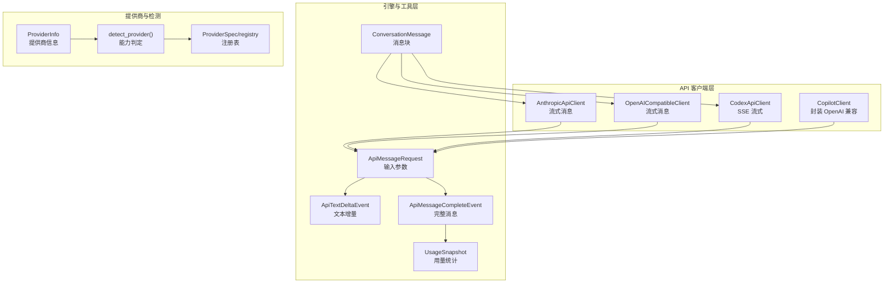
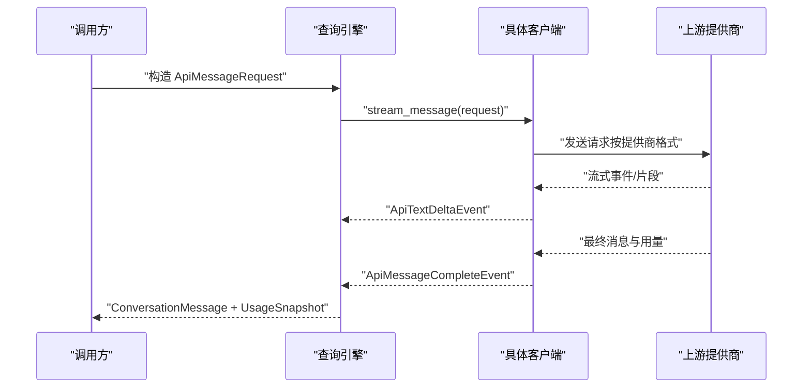
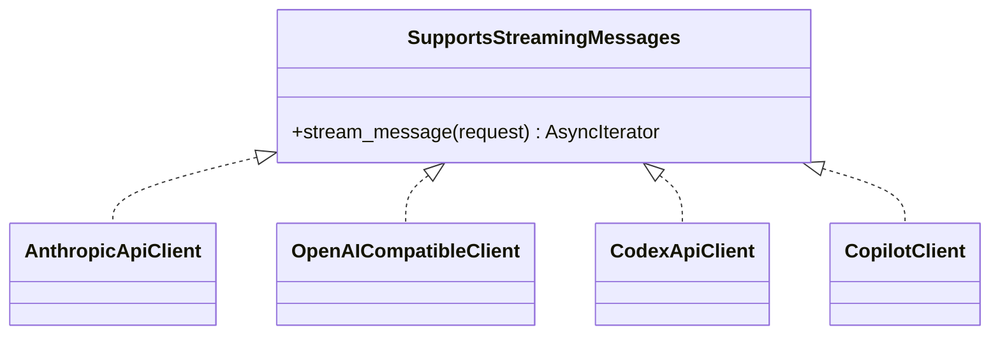

# API参考

<cite>
**本文引用的文件**
- [src/openharness/api/__init__.py](file://src/openharness/api/__init__.py)
- [src/openharness/api/client.py](file://src/openharness/api/client.py)
- [src/openharness/api/codex_client.py](file://src/openharness/api/codex_client.py)
- [src/openharness/api/copilot_client.py](file://src/openharness/api/copilot_client.py)
- [src/openharness/api/openai_client.py](file://src/openharness/api/openai_client.py)
- [src/openharness/api/provider.py](file://src/openharness/api/provider.py)
- [src/openharness/api/registry.py](file://src/openharness/api/registry.py)
- [src/openharness/api/errors.py](file://src/openharness/api/errors.py)
- [src/openharness/api/usage.py](file://src/openharness/api/usage.py)
- [tests/test_api/test_client.py](file://tests/test_api/test_client.py)
- [tests/test_api/test_codex_client.py](file://tests/test_api/test_codex_client.py)
- [tests/test_api/test_copilot_client.py](file://tests/test_api/test_copilot_client.py)
- [tests/test_api/test_openai_client.py](file://tests/test_api/test_openai_client.py)
- [src/openharness/channels/impl/mochat.py](file://src/openharness/channels/impl/mochat.py)
- [src/openharness/channels/impl/whatsapp.py](file://src/openharness/channels/impl/whatsapp.py)
</cite>

## 目录
1. [简介](#简介)
2. [项目结构](#项目结构)
3. [核心组件](#核心组件)
4. [架构总览](#架构总览)
5. [详细组件分析](#详细组件分析)
6. [依赖分析](#依赖分析)
7. [性能考量](#性能考量)
8. [故障排查指南](#故障排查指南)
9. [结论](#结论)
10. [附录](#附录)

## 简介
本文件为 OpenHarness 的 API 参考文档，覆盖客户端 API、引擎 API、工具 API 与插件 API 的公共接口与行为说明。内容包括：
- 客户端 API：支持多提供商（Anthropic、OpenAI 兼容、GitHub Copilot、OpenAI Codex）的消息流式调用与事件模型
- 引擎 API：消息格式、工具调用、流式事件与使用统计
- 工具 API：消息块类型与转换规则
- 插件 API：提供商检测、注册表与能力判定
- WebSocket API：通道适配器的连接、订阅与事件处理
- 错误处理、重试机制、认证与安全注意事项
- 版本信息、弃用策略与迁移指南
- 使用示例、性能优化与最佳实践

## 项目结构
OpenHarness 将 API 层集中于 openharness.api 包，围绕统一的流式消息协议构建，屏蔽不同提供商的差异；同时通过注册表与提供商探测实现“即插即用”的多提供商支持。

图表来源
- [src/openharness/api/client.py:117-267](file://src/openharness/api/client.py#L117-L267)
- [src/openharness/api/openai_client.py:228-449](file://src/openharness/api/openai_client.py#L228-L449)
- [src/openharness/api/codex_client.py:212-396](file://src/openharness/api/codex_client.py#L212-L396)
- [src/openharness/api/copilot_client.py:48-131](file://src/openharness/api/copilot_client.py#L48-L131)
- [src/openharness/api/provider.py:32-94](file://src/openharness/api/provider.py#L32-L94)
- [src/openharness/api/registry.py:17-368](file://src/openharness/api/registry.py#L17-L368)

章节来源
- [src/openharness/api/__init__.py:1-22](file://src/openharness/api/__init__.py#L1-L22)
- [src/openharness/api/provider.py:42-94](file://src/openharness/api/provider.py#L42-L94)
- [src/openharness/api/registry.py:55-368](file://src/openharness/api/registry.py#L55-L368)

## 核心组件
- 统一流式消息协议
  - 输入：ApiMessageRequest（模型名、消息列表、系统提示、最大输出令牌、工具列表）
  - 输出：ApiTextDeltaEvent（文本增量）、ApiMessageCompleteEvent（完整消息+用量+停止原因）
- 客户端
  - AnthropicApiClient：支持 OAuth 与 API Key，自动重试与会话元数据
  - OpenAICompatibleClient：OpenAI 兼容接口，含 token 限制字段适配与思考模型推理内容剥离
  - CodexApiClient：基于 SSE 的 ChatGPT/Codex 响应流
  - CopilotClient：GitHub Copilot 的 OpenAI 兼容封装，直接使用持久化 OAuth Token
- 提供商与检测
  - ProviderInfo：提供商名称、认证方式、语音支持状态与原因
  - detect_provider：根据配置与注册表推断当前提供商
  - ProviderSpec/registry：标准化提供商元数据与匹配优先级
- 工具与消息
  - ConversationMessage 与内容块（文本、图像、工具调用、工具结果）
  - UsageSnapshot：输入/输出令牌统计
- 错误模型
  - OpenHarnessApiError 及其子类：认证失败、限流、请求失败

章节来源
- [src/openharness/api/client.py:39-76](file://src/openharness/api/client.py#L39-L76)
- [src/openharness/api/openai_client.py:228-398](file://src/openharness/api/openai_client.py#L228-L398)
- [src/openharness/api/codex_client.py:212-344](file://src/openharness/api/codex_client.py#L212-L344)
- [src/openharness/api/copilot_client.py:48-131](file://src/openharness/api/copilot_client.py#L48-L131)
- [src/openharness/api/provider.py:32-94](file://src/openharness/api/provider.py#L32-L94)
- [src/openharness/api/registry.py:17-368](file://src/openharness/api/registry.py#L17-L368)
- [src/openharness/api/errors.py:6-20](file://src/openharness/api/errors.py#L6-L20)
- [src/openharness/api/usage.py:8-18](file://src/openharness/api/usage.py#L8-L18)

## 架构总览
OpenHarness 的 API 层以“统一请求-多提供商实现-统一事件输出”为核心设计，通过注册表与提供商探测实现灵活切换；消息在客户端内部完成格式转换与流式解析，最终统一为 ConversationMessage 与 UsageSnapshot。

图表来源
- [src/openharness/api/client.py:160-257](file://src/openharness/api/client.py#L160-L257)
- [src/openharness/api/openai_client.py:247-398](file://src/openharness/api/openai_client.py#L247-L398)
- [src/openharness/api/codex_client.py:244-344](file://src/openharness/api/codex_client.py#L244-L344)

## 详细组件分析

### 客户端 API

#### AnthropicApiClient
- 职责
  - 通过 AsyncAnthropic 发起消息流式请求
  - 自动重试（指数退避+抖动），识别可重试错误码
  - 支持 Claude OAuth（含会话元数据与归属头）
  - 将上游事件映射为 ApiTextDeltaEvent 与 ApiMessageCompleteEvent
- 关键参数
  - api_key 或 auth_token（二选一）
  - base_url（可选）
  - claude_oauth（布尔，启用 OAuth 与元数据）
  - auth_token_resolver（可选，动态刷新 OAuth Token）
- 返回事件
  - 文本增量：ApiTextDeltaEvent(text)
  - 完整消息：ApiMessageCompleteEvent(message, usage, stop_reason)
  - 重试通知：ApiRetryEvent(message, attempt, max_attempts, delay_seconds)
- 错误处理
  - 认证失败、限流、通用请求失败分别抛出对应异常
  - 对上游 APIStatusError 依据状态码分类处理
- 使用示例（路径）
  - [tests/test_api/test_client.py:7-71](file://tests/test_api/test_client.py#L7-L71)
  - [tests/test_api/test_client.py:98-194](file://tests/test_api/test_client.py#L98-L194)

章节来源
- [src/openharness/api/client.py:117-267](file://src/openharness/api/client.py#L117-L267)
- [tests/test_api/test_client.py:7-71](file://tests/test_api/test_client.py#L7-L71)
- [tests/test_api/test_client.py:98-194](file://tests/test_api/test_client.py#L98-L194)

#### OpenAICompatibleClient
- 职责
  - 适配 OpenAI 兼容接口（如 DashScope、GitHub Models 等）
  - 消息与工具格式转换、token 限制字段适配（gpt-5/o1/o3/o4 使用 max_completion_tokens）
  - 思考模型推理内容剥离（<think>…</think>）
  - 流式聚合文本增量与工具调用，产出统一消息
- 关键参数
  - api_key、base_url（可选）、timeout（可选）
- 返回事件
  - 文本增量：ApiTextDeltaEvent(text)
  - 完整消息：ApiMessageCompleteEvent(message, usage, stop_reason)
- 使用示例（路径）
  - [tests/test_api/test_openai_client.py:254-289](file://tests/test_api/test_openai_client.py#L254-L289)
  - [tests/test_api/test_openai_client.py:324-360](file://tests/test_api/test_openai_client.py#L324-L360)
  - [tests/test_api/test_openai_client.py:362-438](file://tests/test_api/test_openai_client.py#L362-L438)

章节来源
- [src/openharness/api/openai_client.py:228-449](file://src/openharness/api/openai_client.py#L228-L449)
- [tests/test_api/test_openai_client.py:254-289](file://tests/test_api/test_openai_client.py#L254-L289)
- [tests/test_api/test_openai_client.py:324-360](file://tests/test_api/test_openai_client.py#L324-L360)
- [tests/test_api/test_openai_client.py:362-438](file://tests/test_api/test_openai_client.py#L362-L438)

#### CodexApiClient
- 职责
  - 通过 SSE 访问 ChatGPT/Codex 响应流
  - 解析 response.output_text.delta、response.output_item.done、response.completed 等事件
  - 将工具调用与文本合并为 ConversationMessage
- 关键参数
  - auth_token（Codex JWT）
  - base_url（可选，默认指向 chatgpt.com/backend-api）
- 返回事件
  - 文本增量：ApiTextDeltaEvent(text)
  - 完整消息：ApiMessageCompleteEvent(message, usage, stop_reason)
- 使用示例（路径）
  - [tests/test_api/test_codex_client.py:162-205](file://tests/test_api/test_codex_client.py#L162-L205)
  - [tests/test_api/test_codex_client.py:207-242](file://tests/test_api/test_codex_client.py#L207-L242)

章节来源
- [src/openharness/api/codex_client.py:212-396](file://src/openharness/api/codex_client.py#L212-L396)
- [tests/test_api/test_codex_client.py:162-205](file://tests/test_api/test_codex_client.py#L162-L205)
- [tests/test_api/test_codex_client.py:207-242](file://tests/test_api/test_codex_client.py#L207-L242)

#### CopilotClient
- 职责
  - 直接使用持久化的 GitHub OAuth Token，无需二次交换
  - 将请求模型覆盖到默认模型（若构造时指定）
  - 委托给 OpenAICompatibleClient 实现流式消息
- 关键参数
  - github_token（可选，否则从持久化文件加载）
  - enterprise_url（企业域名，可选）
  - model（默认模型，可被请求覆盖）
- 返回事件
  - 文本增量：ApiTextDeltaEvent(text)
  - 完整消息：ApiMessageCompleteEvent(message, usage, stop_reason)
- 使用示例（路径）
  - [tests/test_api/test_copilot_client.py:116-141](file://tests/test_api/test_copilot_client.py#L116-L141)

章节来源
- [src/openharness/api/copilot_client.py:48-131](file://src/openharness/api/copilot_client.py#L48-L131)
- [tests/test_api/test_copilot_client.py:116-141](file://tests/test_api/test_copilot_client.py#L116-L141)

### 引擎 API 与数据模型

#### 请求与事件模型
- ApiMessageRequest
  - 字段：model、messages（ConversationMessage 列表）、system_prompt、max_tokens、tools
- ApiTextDeltaEvent
  - 字段：text
- ApiMessageCompleteEvent
  - 字段：message（ConversationMessage）、usage（UsageSnapshot）、stop_reason
- ApiRetryEvent
  - 字段：message、attempt、max_attempts、delay_seconds

#### 消息与工具块
- ConversationMessage
  - 角色：user/assistant
  - 内容块：TextBlock、ImageBlock、ToolUseBlock、ToolResultBlock
- UsageSnapshot
  - 字段：input_tokens、output_tokens、total_tokens

章节来源
- [src/openharness/api/client.py:39-76](file://src/openharness/api/client.py#L39-L76)
- [src/openharness/api/usage.py:8-18](file://src/openharness/api/usage.py#L8-L18)

### 插件 API 与提供商检测

#### ProviderInfo 与 detect_provider
- ProviderInfo
  - 字段：name、auth_kind、voice_supported、voice_reason
- detect_provider
  - 逻辑：优先匹配 openai_codex/anthropic_claude/copilot，其次通过注册表匹配，最后回退到 api_format
- auth_status
  - 返回简要认证状态字符串（缺失、已配置、企业环境等）

章节来源
- [src/openharness/api/provider.py:32-127](file://src/openharness/api/provider.py#L32-L127)

#### ProviderSpec 与注册表
- ProviderSpec
  - 字段：name、keywords、env_key、display_name、backend_type、default_base_url、detect_by_key_prefix、detect_by_base_keyword、is_gateway、is_local、is_oauth
- 注册表顺序
  - 网关与云厂商优先，标准厂商次之，本地部署最后
- 匹配优先级
  - 1) api_key 前缀；2) base_url 关键词；3) 模型关键词

章节来源
- [src/openharness/api/registry.py:17-368](file://src/openharness/api/registry.py#L17-L368)

### WebSocket API（通道适配器）
- MoChat
  - 连接：使用 socketio.AsyncClient，支持重连与序列化选择（msgpack/json）
  - 事件：connect/disconnect/connect_error，订阅会话/面板后进入就绪
  - 订阅：按会话/面板集合订阅，支持自动发现
- WhatsApp
  - 连接：使用 websockets.connect，支持桥接鉴权（type: auth, token）
  - 循环：持续监听消息，异常时自动重连

章节来源
- [src/openharness/channels/impl/mochat.py:353-443](file://src/openharness/channels/impl/mochat.py#L353-L443)
- [src/openharness/channels/impl/whatsapp.py:41-77](file://src/openharness/channels/impl/whatsapp.py#L41-L77)

## 依赖分析
- 客户端对上游 SDK 的依赖
  - AnthropicApiClient 依赖 AsyncAnthropic
  - OpenAICompatibleClient 依赖 AsyncOpenAI
  - CodexApiClient 依赖 httpx.AsyncClient
- 统一协议与解耦
  - 所有客户端实现 SupportsStreamingMessages 协议，保证上层一致调用
- 错误模型
  - OpenHarnessApiError 及子类用于区分认证、限流与通用请求失败

图表来源
- [src/openharness/api/client.py:79-84](file://src/openharness/api/client.py#L79-L84)
- [src/openharness/api/openai_client.py:228-246](file://src/openharness/api/openai_client.py#L228-L246)
- [src/openharness/api/codex_client.py:212-243](file://src/openharness/api/codex_client.py#L212-L243)
- [src/openharness/api/copilot_client.py:48-104](file://src/openharness/api/copilot_client.py#L48-L104)

章节来源
- [src/openharness/api/errors.py:6-20](file://src/openharness/api/errors.py#L6-L20)

## 性能考量
- 重试策略
  - 指数退避 + 抖动，上限延迟控制，尊重上游 Retry-After 头
- 流式解析
  - 仅在可见文本上产生 ApiTextDeltaEvent，减少渲染压力
  - 思考模型推理内容剥离，避免向用户暴露内部推理
- 连接与序列化
  - WebSocket 适配器支持 msgpack 序列化（可用时），降低带宽占用
- 超时与路径
  - OpenAI 兼容客户端规范化 base_url，确保正确路径（/v1）

章节来源
- [src/openharness/api/client.py:97-114](file://src/openharness/api/client.py#L97-L114)
- [src/openharness/api/openai_client.py:420-449](file://src/openharness/api/openai_client.py#L420-L449)
- [src/openharness/channels/impl/mochat.py:353-365](file://src/openharness/channels/impl/mochat.py#L353-L365)

## 故障排查指南
- 常见错误与处理
  - 认证失败：检查 api_key、OAuth Token 是否有效或过期
  - 限流：等待 Retry-After 或降低并发；观察 ApiRetryEvent 获取重试信息
  - 网络/超时：确认网络连通性与代理设置；适当增加超时
- 定位手段
  - 查看 ApiRetryEvent 的 attempt/max_attempts/delay_seconds
  - 检查 ProviderInfo.voice_reason 与 detect_provider 结果
  - 对 CopilotClient，确认持久化 Token 与企业域名配置
- 单元测试参考
  - 客户端初始化与头部设置
  - Codex SSE 事件解析与错误格式化
  - OpenAI 兼容消息/工具转换与路径规范化

章节来源
- [src/openharness/api/errors.py:6-20](file://src/openharness/api/errors.py#L6-L20)
- [src/openharness/api/provider.py:97-127](file://src/openharness/api/provider.py#L97-L127)
- [tests/test_api/test_client.py:7-71](file://tests/test_api/test_client.py#L7-L71)
- [tests/test_api/test_codex_client.py:149-160](file://tests/test_api/test_codex_client.py#L149-L160)
- [tests/test_api/test_openai_client.py:291-321](file://tests/test_api/test_openai_client.py#L291-L321)

## 结论
OpenHarness 的 API 层通过统一的流式消息协议与多提供商客户端实现，既保证了跨平台一致性，又保留了针对特定提供商的特性（如 Claude OAuth、Copilot 直接 Token、Codex SSE）。配合注册表与提供商检测，用户可在不修改上层逻辑的前提下灵活切换与扩展提供商。WebSocket 通道适配器则提供了实时通信能力，满足多渠道集成需求。

## 附录

### 版本信息、弃用策略与迁移指南
- 版本与兼容
  - 各客户端均内置重试与错误翻译，向上游变更具备一定弹性
- 弃用策略
  - 当上游提供商调整 API（如 token 限制字段变化），客户端会自动适配（例如 gpt-5/o1/o3/o4 使用 max_completion_tokens）
- 迁移建议
  - 从 Anthropic 迁移到 OpenAI 兼容：保持 ApiMessageRequest 结构不变，调整 base_url 与模型名
  - 从第三方网关迁移到本地部署：更新 base_url，必要时移除多余头部

章节来源
- [src/openharness/api/openai_client.py:45-56](file://src/openharness/api/openai_client.py#L45-L56)
- [src/openharness/api/registry.py:55-368](file://src/openharness/api/registry.py#L55-L368)

### 安全与速率限制
- 安全
  - CopilotClient 直接使用持久化 OAuth Token，避免额外交换流程
  - Anthropic OAuth 附加归属头与会话元数据，便于审计
- 速率限制
  - 客户端自动重试与指数退避；遇到 429 时优先尊重上游 Retry-After
  - 建议应用层在业务侧进行队列与并发控制

章节来源
- [src/openharness/api/copilot_client.py:67-110](file://src/openharness/api/copilot_client.py#L67-L110)
- [src/openharness/api/client.py:97-114](file://src/openharness/api/client.py#L97-L114)
- [src/openharness/api/openai_client.py:401-407](file://src/openharness/api/openai_client.py#L401-L407)