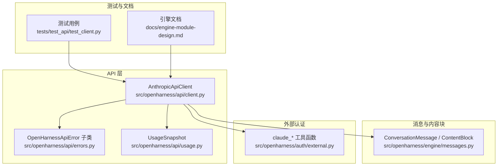
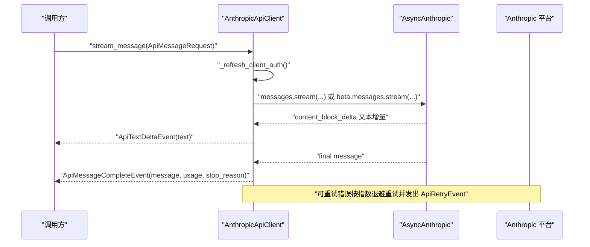
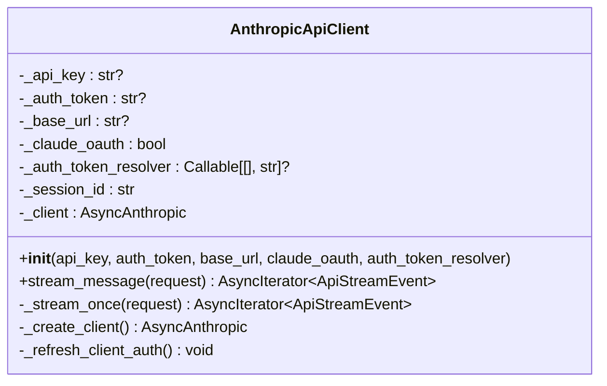
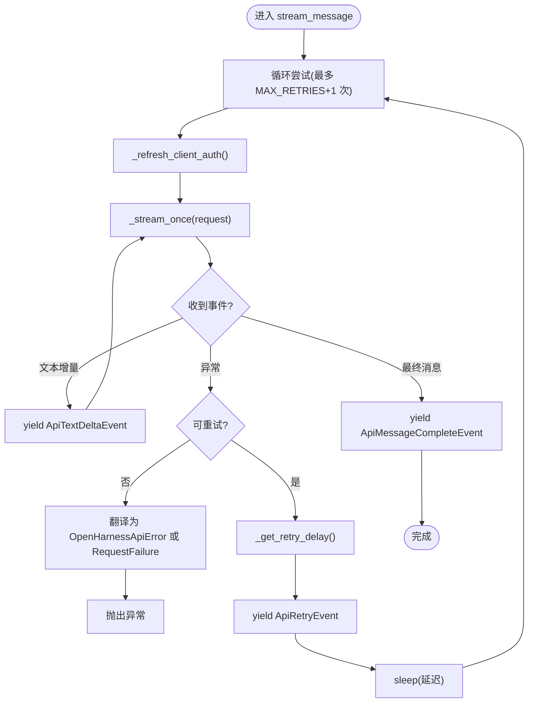
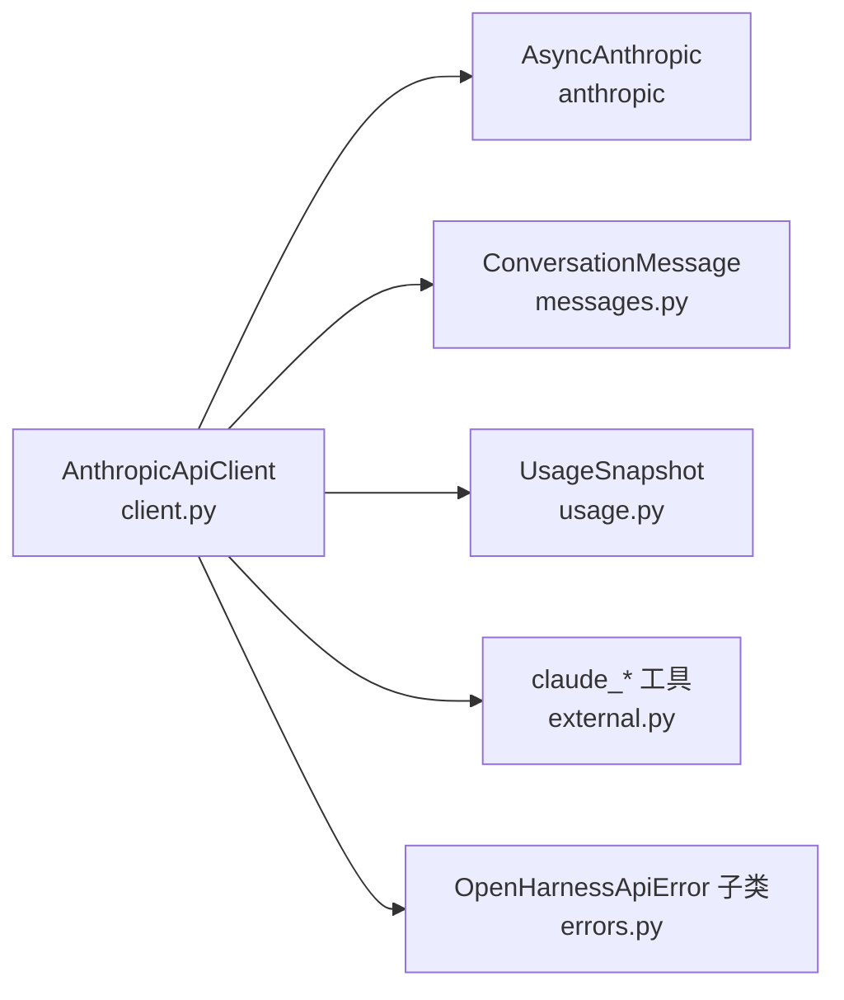

# 客户端API

<cite>
**本文引用的文件**
- [client.py](file://src/openharness/api/client.py)
- [errors.py](file://src/openharness/api/errors.py)
- [usage.py](file://src/openharness/api/usage.py)
- [messages.py](file://src/openharness/engine/messages.py)
- [external.py](file://src/openharness/auth/external.py)
- [test_client.py](file://tests/test_api/test_client.py)
- [engine-module-design.md](file://docs/engine-module-design.md)
</cite>

## 目录
1. [简介](#简介)
2. [项目结构](#项目结构)
3. [核心组件](#核心组件)
4. [架构总览](#架构总览)
5. [详细组件分析](#详细组件分析)
6. [依赖分析](#依赖分析)
7. [性能考虑](#性能考虑)
8. [故障排查指南](#故障排查指南)
9. [结论](#结论)
10. [附录](#附录)

## 简介
本文件面向使用者与开发者，系统化记录 OpenHarness 中 Anthropic API 客户端的公共接口与数据模型，重点覆盖：
- AnthropicApiClient 类的构造参数、属性与方法
- stream_message 方法的参数、返回值、事件类型与使用示例
- 数据模型 ApiMessageRequest、ApiTextDeltaEvent、ApiMessageCompleteEvent、ApiRetryEvent 的字段定义
- 重试机制、错误处理与异常类型
- 认证配置、最佳实践、流式响应处理、使用统计与性能优化建议

## 项目结构
与 Anthropic 客户端相关的核心文件分布于以下模块：
- API 客户端与错误类型：src/openharness/api/client.py、src/openharness/api/errors.py、src/openharness/api/usage.py
- 消息与内容块模型：src/openharness/engine/messages.py
- 外部认证与头信息：src/openharness/auth/external.py
- 使用示例与测试：tests/test_api/test_client.py
- 引擎与流式事件文档：docs/engine-module-design.md

图表来源
- [client.py:117-267](file://src/openharness/api/client.py#L117-L267)
- [errors.py:6-20](file://src/openharness/api/errors.py#L6-L20)
- [usage.py:8-18](file://src/openharness/api/usage.py#L8-L18)
- [messages.py:64-222](file://src/openharness/engine/messages.py#L64-L222)
- [external.py:388-411](file://src/openharness/auth/external.py#L388-L411)
- [test_client.py:1-194](file://tests/test_api/test_client.py#L1-L194)
- [engine-module-design.md:107-133](file://docs/engine-module-design.md#L107-L133)

章节来源
- [client.py:1-267](file://src/openharness/api/client.py#L1-L267)
- [errors.py:1-20](file://src/openharness/api/errors.py#L1-L20)
- [usage.py:1-18](file://src/openharness/api/usage.py#L1-L18)
- [messages.py:1-222](file://src/openharness/engine/messages.py#L1-L222)
- [external.py:1-611](file://src/openharness/auth/external.py#L1-L611)
- [test_client.py:1-194](file://tests/test_api/test_client.py#L1-L194)
- [engine-module-design.md:1-285](file://docs/engine-module-design.md#L1-L285)

## 核心组件
- AnthropicApiClient：对 Anthropic Async SDK 的轻量封装，内置指数退避重试、OAuth 头注入、会话 ID 与元数据注入、流式事件转换。
- 数据模型：
  - ApiMessageRequest：模型调用输入参数
  - ApiTextDeltaEvent：文本增量事件
  - ApiMessageCompleteEvent：最终消息与用量事件
  - ApiRetryEvent：可恢复上游失败的重试事件
  - ApiStreamEvent：三者联合类型
- 错误类型：OpenHarnessApiError 及其子类 AuthenticationFailure、RateLimitFailure、RequestFailure
- 使用统计：UsageSnapshot（input_tokens、output_tokens、total_tokens）

章节来源
- [client.py:39-76](file://src/openharness/api/client.py#L39-L76)
- [client.py:117-267](file://src/openharness/api/client.py#L117-L267)
- [errors.py:6-20](file://src/openharness/api/errors.py#L6-L20)
- [usage.py:8-18](file://src/openharness/api/usage.py#L8-L18)

## 架构总览
AnthropicApiClient 作为 SupportsStreamingMessages 的实现，被引擎查询循环调用，负责：
- 构建请求参数（模型、消息、系统提示、工具、令牌数）
- 注入 OAuth 头、会话 ID、元数据与 Beta 特性
- 调用 AsyncAnthropic 的流式接口
- 解析事件，产出 ApiTextDeltaEvent 与 ApiMessageCompleteEvent
- 对可重试错误进行指数退避重试，并发出 ApiRetryEvent

图表来源
- [client.py:160-197](file://src/openharness/api/client.py#L160-L197)
- [client.py:198-257](file://src/openharness/api/client.py#L198-L257)

## 详细组件分析

### AnthropicApiClient 类
- 构造参数
  - api_key: str | None
  - auth_token: str | None
  - base_url: str | None
  - claude_oauth: bool
  - auth_token_resolver: Callable[[], str] | None
- 属性
  - _api_key、_auth_token、_base_url、_claude_oauth、_auth_token_resolver、_session_id、_client
- 方法
  - stream_message(request: ApiMessageRequest) -> AsyncIterator[ApiStreamEvent]
  - _stream_once(request: ApiMessageRequest) -> AsyncIterator[ApiStreamEvent]
  - _create_client() -> AsyncAnthropic
  - _refresh_client_auth() -> None

图表来源
- [client.py:117-159](file://src/openharness/api/client.py#L117-L159)
- [client.py:160-257](file://src/openharness/api/client.py#L160-L257)

章节来源
- [client.py:117-159](file://src/openharness/api/client.py#L117-L159)
- [client.py:160-257](file://src/openharness/api/client.py#L160-L257)

### stream_message 方法
- 参数
  - request: ApiMessageRequest
    - model: str
    - messages: list[ConversationMessage]
    - system_prompt: str | None
    - max_tokens: int
    - tools: list[dict[str, Any]]
- 返回值
  - AsyncIterator[ApiStreamEvent]
  - ApiStreamEvent = ApiTextDeltaEvent | ApiMessageCompleteEvent | ApiRetryEvent
- 行为
  - 循环最多 MAX_RETRIES+1 次，每次先刷新认证，再调用 _stream_once
  - 对可重试错误（APIStatusError 状态码在 RETRYABLE_STATUS_CODES、APIError、连接/超时/OSError）进行指数退避重试
  - 每次重试发出 ApiRetryEvent，包含尝试次数、最大次数与延迟秒数
  - 成功时解析流事件，产出 ApiTextDeltaEvent（文本增量）与 ApiMessageCompleteEvent（最终消息、用量、停止原因）
- 错误处理
  - 认证失败、速率限制、通用请求失败分别映射到 AuthenticationFailure、RateLimitFailure、RequestFailure
  - 非重试异常直接抛出

图表来源
- [client.py:160-197](file://src/openharness/api/client.py#L160-L197)
- [client.py:198-257](file://src/openharness/api/client.py#L198-L257)
- [client.py:86-94](file://src/openharness/api/client.py#L86-L94)
- [client.py:97-114](file://src/openharness/api/client.py#L97-L114)

章节来源
- [client.py:160-197](file://src/openharness/api/client.py#L160-L197)
- [client.py:198-257](file://src/openharness/api/client.py#L198-L257)
- [client.py:86-94](file://src/openharness/api/client.py#L86-L94)
- [client.py:97-114](file://src/openharness/api/client.py#L97-L114)

### 数据模型

#### ApiMessageRequest
- 字段
  - model: str
  - messages: list[ConversationMessage]
  - system_prompt: str | None
  - max_tokens: int
  - tools: list[dict[str, Any]]

章节来源
- [client.py:40-47](file://src/openharness/api/client.py#L40-L47)

#### ApiTextDeltaEvent
- 字段
  - text: str

章节来源
- [client.py:51-54](file://src/openharness/api/client.py#L51-L54)

#### ApiMessageCompleteEvent
- 字段
  - message: ConversationMessage
  - usage: UsageSnapshot
  - stop_reason: str | None

章节来源
- [client.py:58-63](file://src/openharness/api/client.py#L58-L63)

#### ApiRetryEvent
- 字段
  - message: str
  - attempt: int
  - max_attempts: int
  - delay_seconds: float

章节来源
- [client.py:67-73](file://src/openharness/api/client.py#L67-L73)

#### ApiStreamEvent
- 定义
  - ApiStreamEvent = ApiTextDeltaEvent | ApiMessageCompleteEvent | ApiRetryEvent

章节来源
- [client.py:76-76](file://src/openharness/api/client.py#L76-L76)

#### UsageSnapshot
- 字段
  - input_tokens: int
  - output_tokens: int
- 属性
  - total_tokens: int

章节来源
- [usage.py:8-18](file://src/openharness/api/usage.py#L8-L18)

### 认证与头信息
- OAuth Beta 头
  - 非 Claude OAuth：default_headers 包含 "anthropic-beta": OAUTH_BETA_HEADER
  - Claude OAuth：default_headers 包含 "anthropic-beta" 与 "x-app"/"user-agent"/"X-Claude-Code-Session-Id"
- 会话 ID 与元数据
  - claude_oauth=True 时，注入 metadata.user_id（包含 device_id、session_id、account_uuid）
  - extra_headers.x-client-request-id
  - system 中注入 claude_attribution_header
- 认证刷新
  - 提供 auth_token_resolver 回调，请求前刷新 token 并重建客户端

章节来源
- [client.py:137-150](file://src/openharness/api/client.py#L137-L150)
- [client.py:207-228](file://src/openharness/api/client.py#L207-L228)
- [client.py:152-158](file://src/openharness/api/client.py#L152-L158)
- [external.py:388-411](file://src/openharness/auth/external.py#L388-L411)

### 错误处理与异常类型
- OpenHarnessApiError 及子类
  - AuthenticationFailure：认证失败
  - RateLimitFailure：速率限制
  - RequestFailure：通用请求/传输失败
- 错误翻译
  - APIError -> AuthenticationFailure | RateLimitFailure | RequestFailure
- 可重试条件
  - APIStatusError 状态码在 RETRYABLE_STATUS_CODES
  - APIError、ConnectionError、TimeoutError、OSError

章节来源
- [errors.py:6-20](file://src/openharness/api/errors.py#L6-L20)
- [client.py:260-267](file://src/openharness/api/client.py#L260-L267)
- [client.py:86-94](file://src/openharness/api/client.py#L86-L94)

### 使用示例与最佳实践
- 基本流式调用
  - 构造 ApiMessageRequest，包含 model、messages、可选 system_prompt、max_tokens、tools
  - 异步迭代 stream_message，处理 ApiTextDeltaEvent 与 ApiMessageCompleteEvent
- 认证配置
  - 使用 api_key 或 auth_token
  - claude_oauth=True 时启用 OAuth 头与会话元数据
  - 提供 auth_token_resolver 实现动态刷新
- 最佳实践
  - 为每次请求设置合理的 max_tokens
  - 在 Claude OAuth 模式下注入系统提示中的归属信息
  - 监听 ApiRetryEvent 以观察重试策略
  - 使用 UsageSnapshot 跟踪 token 使用

章节来源
- [test_client.py:160-194](file://tests/test_api/test_client.py#L160-L194)
- [engine-module-design.md:114-115](file://docs/engine-module-design.md#L114-L115)

## 依赖分析
- 内部依赖
  - client.py 依赖 engine.messages（ConversationMessage、assistant_message_from_api）、api.usage（UsageSnapshot）、auth.external（claude_* 工具）、api.errors（OpenHarnessApiError 子类）
- 外部依赖
  - anthropic.AsyncAnthropic
- 耦合与内聚
  - AnthropicApiClient 与 AsyncAnthropic 通过流式接口耦合，职责清晰：客户端负责参数构建、头注入、重试与事件转换，SDK 负责网络与协议细节

图表来源
- [client.py:12-27](file://src/openharness/api/client.py#L12-L27)

章节来源
- [client.py:12-27](file://src/openharness/api/client.py#L12-L27)

## 性能考虑
- 重试策略
  - 指数退避 + 随机抖动，上限 MAX_DELAY，避免雪崩
  - 优先读取 Retry-After 响应头，尊重服务端建议
- 流式处理
  - 逐块增量返回文本，降低首包延迟
- 请求头与元数据
  - Claude OAuth 模式下注入会话 ID 与请求 ID，便于追踪与限流
- 建议
  - 控制 max_tokens 与消息长度，减少重试概率
  - 在高并发场景下合理设置 base_url 与连接池（由 SDK 管理）
  - 使用 auth_token_resolver 缓存 token，避免频繁重建客户端

[本节为通用指导，无需特定文件来源]

## 故障排查指南
- 常见错误与定位
  - 认证失败：检查 api_key 或 auth_token 是否正确，OAuth 头是否注入
  - 速率限制：关注 RateLimitFailure，适当降低请求频率或增加重试间隔
  - 网络错误：检查连接/超时/OSError，确认 base_url 与网络连通性
- 重试观察
  - 监听 ApiRetryEvent，确认 attempt/max_attempts 与 delay_seconds
- 日志
  - 客户端会在重试时记录警告日志，包含状态码与延迟

章节来源
- [client.py:181-184](file://src/openharness/api/client.py#L181-L184)
- [client.py:260-267](file://src/openharness/api/client.py#L260-L267)

## 结论
AnthropicApiClient 提供了稳定、可重试、可观测的流式调用能力，结合 UsageSnapshot 与多种事件类型，满足从终端到引擎的多样化使用场景。通过合理的认证配置与重试策略，可在不稳定网络环境下获得可靠的用户体验。

[本节为总结，无需特定文件来源]

## 附录

### ApiMessageRequest 字段说明
- model: 目标模型标识符
- messages: 消息列表，元素为 ConversationMessage
- system_prompt: 可选系统提示
- max_tokens: 输出最大 token 数
- tools: 工具定义列表

章节来源
- [client.py:40-47](file://src/openharness/api/client.py#L40-L47)

### ApiTextDeltaEvent 字段说明
- text: 新增文本片段

章节来源
- [client.py:51-54](file://src/openharness/api/client.py#L51-L54)

### ApiMessageCompleteEvent 字段说明
- message: 完整助手消息（ConversationMessage）
- usage: 使用统计（UsageSnapshot）
- stop_reason: 停止原因（可选）

章节来源
- [client.py:58-63](file://src/openharness/api/client.py#L58-L63)

### ApiRetryEvent 字段说明
- message: 错误描述
- attempt: 当前尝试次数
- max_attempts: 最大尝试次数
- delay_seconds: 下次重试延迟（秒）

章节来源
- [client.py:67-73](file://src/openharness/api/client.py#L67-L73)

### UsageSnapshot 字段说明
- input_tokens: 输入 token 数
- output_tokens: 输出 token 数
- total_tokens: 输入与输出之和

章节来源
- [usage.py:8-18](file://src/openharness/api/usage.py#L8-L18)

### ConversationMessage 与内容块
- ConversationMessage：role、content 列表
- ContentBlock：TextBlock、ImageBlock、ToolUseBlock、ToolResultBlock
- to_api_param：序列化为 SDK 参数格式

章节来源
- [messages.py:64-222](file://src/openharness/engine/messages.py#L64-L222)

### 流式事件与引擎集成
- 引擎通过 SupportsStreamingMessages 接口消费 ApiStreamEvent
- 文档指出：通过 api_client.stream_message() 流式获取模型响应，为每个文本块产出 AssistantTextDelta 事件

章节来源
- [engine-module-design.md:107-133](file://docs/engine-module-design.md#L107-L133)