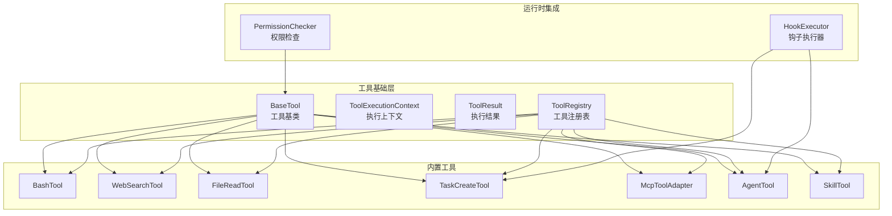
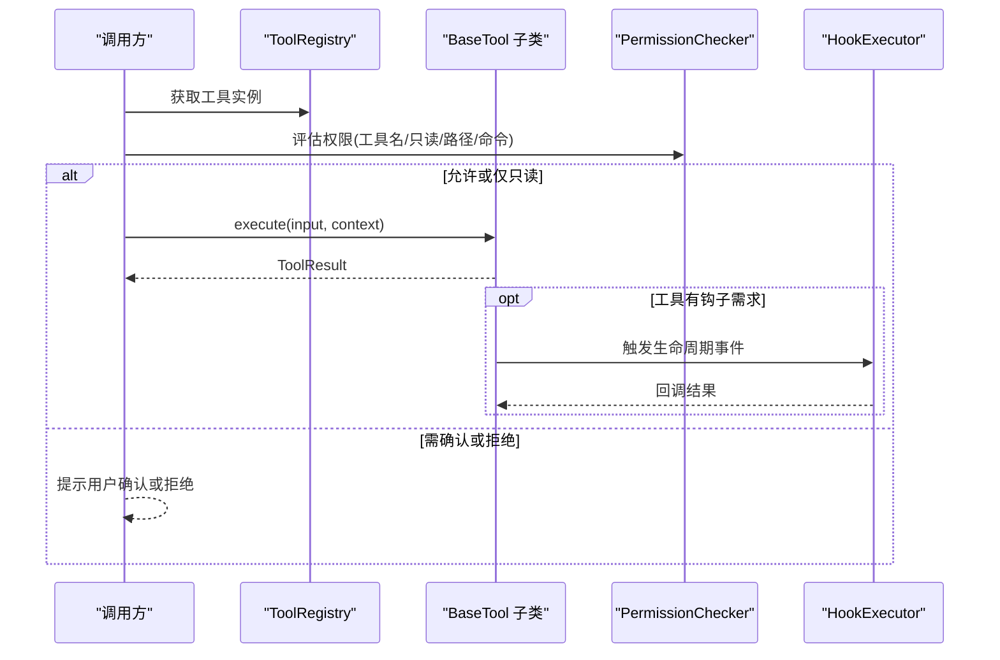
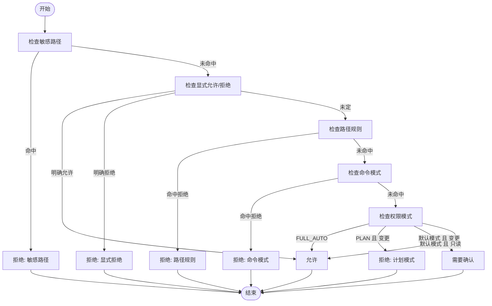
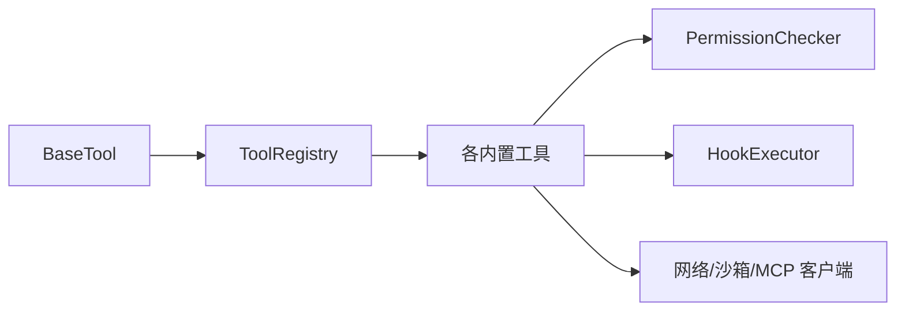

# 工具API

<cite>
**本文引用的文件**
- [src/openharness/tools/base.py](file://src/openharness/tools/base.py)
- [src/openharness/tools/__init__.py](file://src/openharness/tools/__init__.py)
- [src/openharness/tools/bash_tool.py](file://src/openharness/tools/bash_tool.py)
- [src/openharness/tools/web_search_tool.py](file://src/openharness/tools/web_search_tool.py)
- [src/openharness/tools/file_read_tool.py](file://src/openharness/tools/file_read_tool.py)
- [src/openharness/tools/task_create_tool.py](file://src/openharness/tools/task_create_tool.py)
- [src/openharness/tools/mcp_tool.py](file://src/openharness/tools/mcp_tool.py)
- [src/openharness/tools/agent_tool.py](file://src/openharness/tools/agent_tool.py)
- [src/openharness/tools/skill_tool.py](file://src/openharness/tools/skill_tool.py)
- [src/openharness/permissions/checker.py](file://src/openharness/permissions/checker.py)
- [src/openharness/hooks/executor.py](file://src/openharness/hooks/executor.py)
- [tests/test_tools/test_integration_flows.py](file://tests/test_tools/test_integration_flows.py)
</cite>

## 目录
1. [简介](#简介)
2. [项目结构](#项目结构)
3. [核心组件](#核心组件)
4. [架构总览](#架构总览)
5. [详细组件分析](#详细组件分析)
6. [依赖分析](#依赖分析)
7. [性能考量](#性能考量)
8. [故障排查指南](#故障排查指南)
9. [结论](#结论)
10. [附录：自定义工具开发指南](#附录自定义工具开发指南)

## 简介
本文件为 OpenHarness 工具系统的 API 文档，覆盖工具基类与注册机制、权限检查与执行流程、与引擎的交互方式、错误处理与性能注意事项，并提供内置工具的使用示例与最佳实践。读者可据此快速理解工具系统的公共接口，安全地扩展自定义工具。

## 项目结构
工具系统主要位于 Python 包 openharness.tools 中，包含：
- 基础抽象与注册：base.py（工具基类、执行上下文、结果封装、工具注册表）
- 内置工具集合：bash、web 搜索、文件读取、任务创建、MCP 适配、代理子进程、技能读取等
- 默认注册入口：__init__.py（集中导出与默认工具注册工厂）
- 权限控制：permissions/checker.py（基于模式与规则的权限决策）
- 钩子执行：hooks/executor.py（生命周期事件触发器，用于工具执行后的回调）

图表来源
- [src/openharness/tools/base.py:35-81](file://src/openharness/tools/base.py#L35-L81)
- [src/openharness/tools/__init__.py:47-96](file://src/openharness/tools/__init__.py#L47-L96)
- [src/openharness/permissions/checker.py:57-156](file://src/openharness/permissions/checker.py#L57-L156)
- [src/openharness/hooks/executor.py:41-78](file://src/openharness/hooks/executor.py#L41-L78)

章节来源
- [src/openharness/tools/base.py:1-81](file://src/openharness/tools/base.py#L1-L81)
- [src/openharness/tools/__init__.py:1-106](file://src/openharness/tools/__init__.py#L1-L106)

## 核心组件
- 工具基类 BaseTool
  - 必需属性：name、description、input_model（Pydantic 模型类型）
  - 抽象方法：execute(arguments: BaseModel, context: ToolExecutionContext) -> ToolResult
  - 可选扩展：is_read_only(arguments) -> bool（默认 False）
  - API 导出：to_api_schema() -> dict（兼容消息 API 的工具描述）
- 执行上下文 ToolExecutionContext
  - 字段：cwd（工作目录）、metadata（字典）、hook_executor（可选钩子执行器）
- 执行结果 ToolResult
  - 字段：output（字符串输出）、is_error（是否错误）、metadata（字典）
- 工具注册表 ToolRegistry
  - 方法：register(tool)、get(name)、list_tools()、to_api_schema()

章节来源
- [src/openharness/tools/base.py:17-81](file://src/openharness/tools/base.py#L17-L81)

## 架构总览
工具系统围绕“统一基类 + 注册表 + 权限检查 + 钩子回调”的模式组织。调用方通过注册表按名称获取工具实例，传入标准化输入模型与执行上下文，由权限模块进行策略评估，最终在工具内部完成具体操作并返回标准化结果。部分工具会触发钩子事件以通知外部系统。

图表来源
- [src/openharness/tools/base.py:35-57](file://src/openharness/tools/base.py#L35-L57)
- [src/openharness/permissions/checker.py:75-156](file://src/openharness/permissions/checker.py#L75-L156)
- [src/openharness/hooks/executor.py:64-78](file://src/openharness/hooks/executor.py#L64-L78)

## 详细组件分析

### 工具基类与注册机制
- BaseTool
  - 方法签名与职责
    - execute(arguments: BaseModel, context: ToolExecutionContext) -> ToolResult
    - is_read_only(arguments: BaseModel) -> bool（默认 False）
    - to_api_schema() -> dict（生成 API 描述）
  - 输入模型要求：必须是 Pydantic BaseModel 子类，用于自动校验与序列化
- ToolRegistry
  - register(tool: BaseTool)：以工具 name 为键注册
  - get(name: str) -> BaseTool | None：按名称检索
  - list_tools() -> list[BaseTool]：枚举所有已注册工具
  - to_api_schema() -> list[dict]：导出所有工具的 API 描述
- 默认注册工厂 create_default_tool_registry(mcp_manager=None)
  - 自动注册大量内置工具
  - 若提供 mcp_manager，则动态注册 MCP 资源与工具适配器

章节来源
- [src/openharness/tools/base.py:35-81](file://src/openharness/tools/base.py#L35-L81)
- [src/openharness/tools/__init__.py:47-96](file://src/openharness/tools/__init__.py#L47-L96)

### 权限检查与执行流程
- PermissionChecker.evaluate(tool_name, is_read_only, file_path=None, command=None)
  - 行为判定依据：
    - 内置敏感路径白名单（不可绕过）
    - 显式允许/拒绝列表
    - 路径规则匹配
    - 命令模式匹配
    - 权限模式：FULL_AUTO（全自动）、PLAN（计划模式阻断变更）、默认模式（变更需确认）
  - 返回 PermissionDecision：allowed、requires_confirmation、reason
- 流程图

图表来源
- [src/openharness/permissions/checker.py:75-156](file://src/openharness/permissions/checker.py#L75-L156)

章节来源
- [src/openharness/permissions/checker.py:57-156](file://src/openharness/permissions/checker.py#L57-L156)

### 工具与引擎交互方式
- 钩子执行器 HookExecutor
  - 支持命令、HTTP、提示词驱动的钩子
  - 在工具执行后触发生命周期事件，如子代理停止、任务完成等
  - 通过 ToolExecutionContext 将 cwd、API 客户端、默认模型注入钩子执行环境
- AgentTool 与 TaskCreateTool
  - AgentTool 使用子进程后端启动本地代理，支持团队编排与钩子回调
  - TaskCreateTool 创建后台任务（本地 Shell 或本地代理），便于后续查询与输出拉取

章节来源
- [src/openharness/hooks/executor.py:41-243](file://src/openharness/hooks/executor.py#L41-L243)
- [src/openharness/tools/agent_tool.py:38-142](file://src/openharness/tools/agent_tool.py#L38-L142)
- [src/openharness/tools/task_create_tool.py:23-57](file://src/openharness/tools/task_create_tool.py#L23-L57)

### 内置工具一览与使用要点
- BashTool
  - 输入模型字段：command、cwd、timeout_seconds
  - 行为：非交互式 shell 执行，捕获 stdout/stderr；超时/取消处理；输出截断与提示
  - 输出：ToolResult.output 为文本；metadata 包含 returncode、timed_out 等
- WebSearchTool
  - 输入模型字段：query、max_results、search_url
  - 行为：调用公开搜索端点，解析标题/链接/摘要，限制最大结果数
  - 输出：ToolResult.output 为格式化结果文本
- FileReadTool
  - 输入模型字段：path、offset、limit
  - 行为：UTF-8 文本读取，行号编号输出；沙箱模式下路径校验
  - 输出：ToolResult.output 为带行号的文本片段
- TaskCreateTool
  - 输入模型字段：type、description、command 或 prompt、model
  - 行为：创建后台任务（local_bash 或 local_agent），返回任务 ID
- McpToolAdapter
  - 输入模型：根据 MCP 工具输入模式动态生成
  - 行为：将 MCP 工具暴露为标准工具，名称规范化
- AgentTool
  - 输入模型字段：description、prompt、subagent_type、model、command、team、mode
  - 行为：子进程启动本地/远程/同进程代理，支持团队编排与钩子回调
- SkillTool
  - 输入模型字段：name
  - 行为：按名称查找技能内容；若禁用模型调用则仅允许用户命令触发

章节来源
- [src/openharness/tools/bash_tool.py:19-219](file://src/openharness/tools/bash_tool.py#L19-L219)
- [src/openharness/tools/web_search_tool.py:16-119](file://src/openharness/tools/web_search_tool.py#L16-L119)
- [src/openharness/tools/file_read_tool.py:12-73](file://src/openharness/tools/file_read_tool.py#L12-L73)
- [src/openharness/tools/task_create_tool.py:13-57](file://src/openharness/tools/task_create_tool.py#L13-L57)
- [src/openharness/tools/mcp_tool.py:14-73](file://src/openharness/tools/mcp_tool.py#L14-L73)
- [src/openharness/tools/agent_tool.py:20-142](file://src/openharness/tools/agent_tool.py#L20-L142)
- [src/openharness/tools/skill_tool.py:11-44](file://src/openharness/tools/skill_tool.py#L11-L44)

## 依赖分析
- 组件耦合
  - 工具基类与输入模型解耦，通过 Pydantic 自动校验
  - 注册表集中管理工具实例，调用方通过名称获取
  - 权限检查独立于工具实现，采用策略模式
  - 钩子执行器与工具解耦，通过事件驱动
- 外部依赖
  - 网络访问受网络守卫限制（如 WebSearchTool）
  - 沙箱路径校验（如 FileReadTool）
  - MCP 客户端管理（如 McpToolAdapter）

图表来源
- [src/openharness/tools/base.py:35-81](file://src/openharness/tools/base.py#L35-L81)
- [src/openharness/tools/__init__.py:47-96](file://src/openharness/tools/__init__.py#L47-L96)
- [src/openharness/permissions/checker.py:57-156](file://src/openharness/permissions/checker.py#L57-L156)
- [src/openharness/hooks/executor.py:41-78](file://src/openharness/hooks/executor.py#L41-L78)

## 性能考量
- I/O 与超时
  - BashTool 对长时间运行命令设置超时，避免阻塞；超时后返回部分输出与元数据
  - WebSearchTool 设置请求超时与结果上限，防止大响应导致内存压力
- 输出截断
  - BashTool 对超长输出进行截断，避免 UI/日志膨胀
- 并发与资源
  - 子进程后端保证任务可查询性，适合后台任务编排
  - 钩子执行器异步流式处理，降低等待时间

章节来源
- [src/openharness/tools/bash_tool.py:34-85](file://src/openharness/tools/bash_tool.py#L34-L85)
- [src/openharness/tools/web_search_tool.py:38-66](file://src/openharness/tools/web_search_tool.py#L38-L66)

## 故障排查指南
- 权限相关
  - 若被拒绝，检查 PermissionDecision.reason，确认是否命中敏感路径、显式拒绝、路径规则或命令模式
  - 在默认模式下，变更类工具需用户确认；只读工具通常直接放行
- 网络与沙箱
  - WebSearchTool 失败多为网络异常或被拦截，检查网络守卫与代理设置
  - FileReadTool 返回“沙箱”原因时，检查路径合法性与沙箱策略
- 进程与超时
  - BashTool 返回 timed_out 时，检查命令是否交互式或耗时过长，必要时增加超时或改为非交互参数
- 钩子失败
  - HookExecutor 的命令/HTTP/提示词钩子失败时，查看返回的 reason 与元数据中的状态码/返回码

章节来源
- [src/openharness/permissions/checker.py:75-156](file://src/openharness/permissions/checker.py#L75-L156)
- [src/openharness/tools/bash_tool.py:53-85](file://src/openharness/tools/bash_tool.py#L53-L85)
- [src/openharness/tools/web_search_tool.py:43-54](file://src/openharness/tools/web_search_tool.py#L43-L54)
- [src/openharness/hooks/executor.py:80-136](file://src/openharness/hooks/executor.py#L80-L136)

## 结论
OpenHarness 工具系统以清晰的抽象与注册机制为核心，结合严格的权限策略与灵活的钩子回调，既保证了安全性，又提供了强大的扩展能力。内置工具覆盖常见场景，同时保留了统一的开发范式，便于二次开发与集成。

## 附录：自定义工具开发指南
- 继承与实现
  - 继承 BaseTool，定义 name、description、input_model（Pydantic BaseModel）
  - 实现 execute(arguments, context) -> ToolResult
  - 如为只读操作，重写 is_read_only 以返回 True
- 输入模型设计
  - 使用 Field 描述参数含义与约束（如范围、默认值）
  - 保持字段简洁明确，便于 API 导出与用户理解
- 元数据与上下文
  - 通过 ToolExecutionContext.cwd、metadata 传递运行时信息
  - 在 ToolResult.metadata 中返回诊断信息（如 returncode、交互提示）
- 权限与安全
  - 对可能影响文件系统/网络/进程的工具，确保 is_read_only 返回 False
  - 在工具内对敏感路径与命令进行预检与保护
- 钩子集成
  - 如需生命周期回调，在工具中注入 context.hook_executor 并触发事件
- 注册与发布
  - 将工具实例注册到 ToolRegistry，或通过 create_default_tool_registry 合并到默认集合
- 最佳实践
  - 为长耗时操作设置合理超时与中断处理
  - 对输出进行截断与清洗，避免泄露敏感信息
  - 提供清晰的错误信息与建议（如交互式命令的非交互改进建议）

章节来源
- [src/openharness/tools/base.py:35-57](file://src/openharness/tools/base.py#L35-L57)
- [src/openharness/tools/__init__.py:47-96](file://src/openharness/tools/__init__.py#L47-L96)
- [src/openharness/hooks/executor.py:64-78](file://src/openharness/hooks/executor.py#L64-L78)