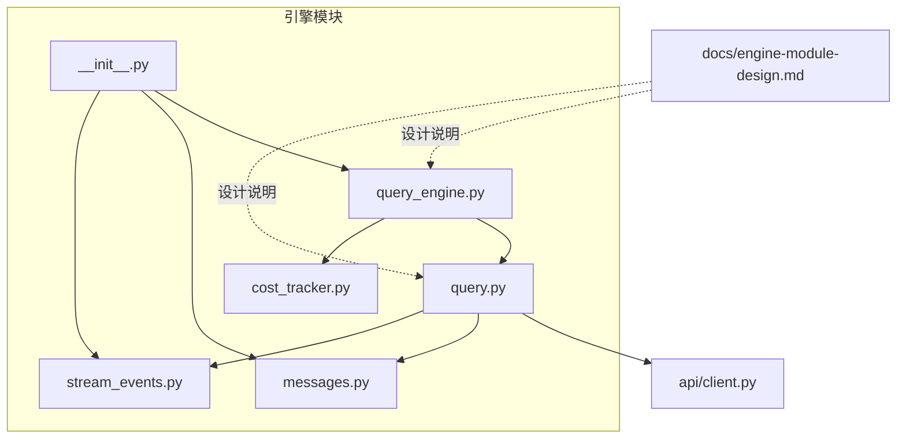
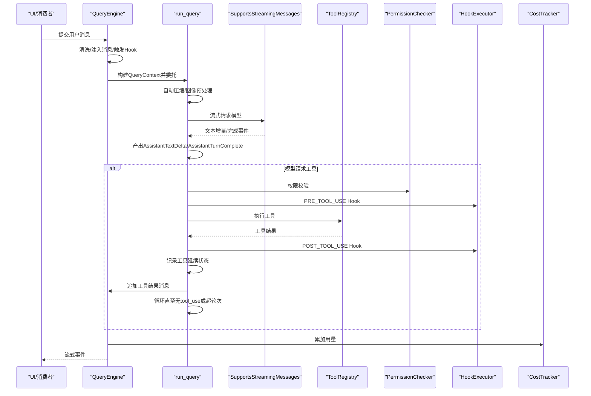
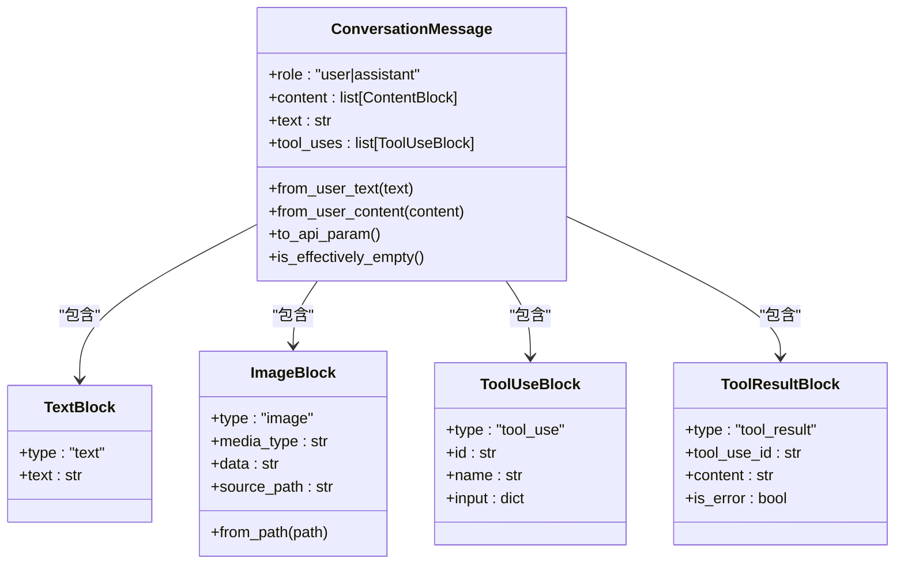
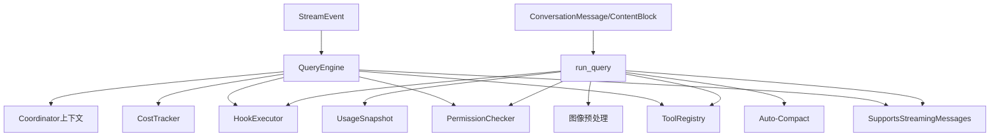

# 引擎API

<cite>
**本文引用的文件**
- [query_engine.py](file://src/openharness/engine/query_engine.py)
- [query.py](file://src/openharness/engine/query.py)
- [messages.py](file://src/openharness/engine/messages.py)
- [stream_events.py](file://src/openharness/engine/stream_events.py)
- [cost_tracker.py](file://src/openharness/engine/cost_tracker.py)
- [__init__.py](file://src/openharness/engine/__init__.py)
- [client.py](file://src/openharness/api/client.py)
- [engine-module-design.md](file://docs/engine-module-design.md)
- [test_query_engine.py](file://tests/test_engine/test_query_engine.py)
- [test_messages.py](file://tests/test_engine/test_messages.py)
</cite>

## 目录
1. [简介](#简介)
2. [项目结构](#项目结构)
3. [核心组件](#核心组件)
4. [架构总览](#架构总览)
5. [详细组件分析](#详细组件分析)
6. [依赖分析](#依赖分析)
7. [性能考量](#性能考量)
8. [故障排查指南](#故障排查指南)
9. [结论](#结论)
10. [附录](#附录)

## 简介
本文件面向使用者与开发者，系统化梳理 OpenHarness 引擎模块的公共API与关键数据结构，重点覆盖 QueryEngine 类与其周边组件，包括会话管理、消息处理、工具调用、异步流式事件、生命周期管理、性能监控与错误恢复策略。文档同时提供初始化、会话创建与消息传递的完整示例路径，并讨论扩展机制与最佳实践。

## 项目结构
引擎模块位于 src/openharness/engine，核心文件包括：
- query_engine.py：高层会话持有者，负责消息历史、工具感知循环、事件流与成本追踪
- query.py：核心查询循环 run_query 及上下文、工具执行、压缩与错误处理
- messages.py：对话消息与内容块模型（用户/助手/工具）
- stream_events.py：流式事件类型（文本增量、工具执行、错误、状态、压缩进度）
- cost_tracker.py：会话级用量聚合
- __init__.py：公共API的懒加载导出

图表来源
- [query_engine.py:1-215](file://src/openharness/engine/query_engine.py#L1-L215)
- [query.py:1-800](file://src/openharness/engine/query.py#L1-L800)
- [messages.py:1-222](file://src/openharness/engine/messages.py#L1-L222)
- [stream_events.py:1-90](file://src/openharness/engine/stream_events.py#L1-L90)
- [cost_tracker.py:1-25](file://src/openharness/engine/cost_tracker.py#L1-L25)
- [__init__.py:1-81](file://src/openharness/engine/__init__.py#L1-L81)
- [client.py:1-200](file://src/openharness/api/client.py#L1-L200)
- [engine-module-design.md:1-285](file://docs/engine-module-design.md#L1-L285)

章节来源
- [engine-module-design.md:1-285](file://docs/engine-module-design.md#L1-L285)
- [__init__.py:1-81](file://src/openharness/engine/__init__.py#L1-L81)

## 核心组件
- QueryEngine：会话持有者，管理消息历史、工具元数据、成本追踪与生命周期配置；对外暴露异步事件流
- run_query：核心查询循环，负责自动压缩、图像预处理、模型调用、工具执行、权限校验、Hook执行、事件产出与错误恢复
- ConversationMessage/ContentBlock：消息与内容块模型，支持文本、图片、工具调用与工具结果
- StreamEvent：事件类型集合，包括文本增量、工具执行、错误、状态与压缩进度
- CostTracker：会话级用量聚合器
- SupportsStreamingMessages：API客户端协议，提供流式事件

章节来源
- [query_engine.py:19-215](file://src/openharness/engine/query_engine.py#L19-L215)
- [query.py:632-800](file://src/openharness/engine/query.py#L632-L800)
- [messages.py:14-222](file://src/openharness/engine/messages.py#L14-L222)
- [stream_events.py:12-90](file://src/openharness/engine/stream_events.py#L12-L90)
- [cost_tracker.py:8-25](file://src/openharness/engine/cost_tracker.py#L8-L25)
- [client.py:79-84](file://src/openharness/api/client.py#L79-L84)

## 架构总览
引擎采用“事件驱动 + 异步流式”的架构：上层UI通过 QueryEngine.submit_message 推送用户输入，引擎在 run_query 中驱动模型与工具执行，期间持续产出 StreamEvent 供UI增量渲染；工具执行前后通过 HookExecutor 注入横切逻辑；自动压缩与图像预处理保障上下文可控与多模态兼容；成本追踪贯穿会话生命周期。

图表来源
- [query_engine.py:147-215](file://src/openharness/engine/query_engine.py#L147-L215)
- [query.py:632-800](file://src/openharness/engine/query.py#L632-L800)
- [client.py:160-196](file://src/openharness/api/client.py#L160-L196)

## 详细组件分析

### QueryEngine 类
- 职责
  - 会话持有与消息历史管理
  - 工具元数据携带与跨轮次延续
  - 成本追踪与用量聚合
  - 生命周期配置（模型、系统提示、最大轮次、上下文窗口等）
  - 事件流产出与Hook执行
- 关键方法
  - submit_message(prompt)：追加用户消息、清洗历史、注入协调器上下文、构建QueryContext并委托run_query，产出StreamEvent
  - continue_pending(max_turns)：在无新用户消息情况下继续被中断的工具循环
  - has_pending_continuation()：判断会话是否以工具结果等待后续模型轮次
  - load_messages(messages)/clear()：会话恢复与清空
  - set_* 系列：运行时更新模型、系统提示、API客户端、最大轮次、权限检查器
  - 属性：messages/max_turns/api_client/model/system_prompt/tool_metadata/total_usage
- 重要行为
  - 协调器模式：当系统提示以特定前缀开头时，注入合成的“协调器用户上下文”消息
  - 事件驱动：在提交消息时触发 USER_PROMPT_SUBMIT Hook

章节来源
- [query_engine.py:19-215](file://src/openharness/engine/query_engine.py#L19-L215)
- [engine-module-design.md:149-194](file://docs/engine-module-design.md#L149-L194)

### 核心查询循环 run_query
- 输入：QueryContext + 消息列表
- 输出：异步迭代器，产出 (StreamEvent, UsageSnapshot|None)
- 关键流程
  - 自动压缩：每次调用模型前检查阈值，必要时进行微压缩或LLM摘要
  - 图像预处理：非多模态模型时将ImageBlock转换为文本描述
  - 模型调用：通过 SupportsStreamingMessages 流式获取文本增量与最终消息
  - 工具执行：按序或并发执行，产出工具开始/完成事件
  - 权限校验与Hook：PRE_TOOL_USE/POST_TOOL_USE
  - 工具延续记录：在tool_metadata中记录活跃工件、最近读取文件、技能调用、异步智能体活动等
  - 错误处理：检测“提示过长”“补全token限制”“网络错误”，分别采取响应式压缩、降低max_tokens或报错
- 终止条件
  - 模型不再请求工具（自然停止）
  - 超过max_turns（抛出MaxTurnsExceeded）

章节来源
- [query.py:632-800](file://src/openharness/engine/query.py#L632-L800)
- [engine-module-design.md:82-133](file://docs/engine-module-design.md#L82-L133)

### 数据结构：ConversationMessage 与内容块
- ContentBlock 联合类型：TextBlock、ImageBlock、ToolUseBlock、ToolResultBlock
- ConversationMessage
  - role: user/assistant
  - content: ContentBlock 列表
  - 工具方法：from_user_text/from_user_content、text/tool_uses、to_api_param、is_effectively_empty
- 辅助函数
  - sanitize_conversation_messages：规范化恢复的历史，丢弃空助手消息与不完整的工具轮次
  - serialize_content_block/assistant_message_from_api：序列化与反序列化

图表来源
- [messages.py:14-222](file://src/openharness/engine/messages.py#L14-L222)

章节来源
- [messages.py:14-222](file://src/openharness/engine/messages.py#L14-L222)
- [test_messages.py:12-62](file://tests/test_engine/test_messages.py#L12-L62)

### 流式事件与API事件
- StreamEvent 联合类型：AssistantTextDelta、AssistantTurnComplete、ToolExecutionStarted、ToolExecutionCompleted、ErrorEvent、StatusEvent、CompactProgressEvent
- ApiStreamEvent：ApiTextDeltaEvent、ApiMessageCompleteEvent、ApiRetryEvent
- SupportsStreamingMessages：统一的流式消息协议，QueryEngine依赖其异步事件流

```mermaid
classDiagram
class AssistantTextDelta {
+text : str
}
class AssistantTurnComplete {
+message : ConversationMessage
+usage : UsageSnapshot
}
class ToolExecutionStarted {
+tool_name : str
+tool_input : dict
}
class ToolExecutionCompleted {
+tool_name : str
+output : str
+is_error : bool
}
class ErrorEvent {
+message : str
+recoverable : bool
}
class StatusEvent {
+message : str
}
class CompactProgressEvent {
+phase : enum
+trigger : "auto|manual|reactive"
+message : str
+attempt : int
+checkpoint : str
+metadata : dict
}
class ApiTextDeltaEvent {
+text : str
}
class ApiMessageCompleteEvent {
+message : ConversationMessage
+usage : UsageSnapshot
+stop_reason : str
}
class ApiRetryEvent {
+message : str
+attempt : int
+max_attempts : int
+delay_seconds : float
}
class SupportsStreamingMessages {
+stream_message(request) AsyncIterator[ApiStreamEvent]
}
```

图表来源
- [stream_events.py:12-90](file://src/openharness/engine/stream_events.py#L12-L90)
- [client.py:50-84](file://src/openharness/api/client.py#L50-L84)

章节来源
- [stream_events.py:12-90](file://src/openharness/engine/stream_events.py#L12-L90)
- [client.py:50-84](file://src/openharness/api/client.py#L50-L84)

### 成本追踪与用量聚合
- CostTracker：会话生命周期内累加 input_tokens 与 output_tokens
- QueryEngine.total_usage：聚合所有轮次用量

章节来源
- [cost_tracker.py:8-25](file://src/openharness/engine/cost_tracker.py#L8-L25)
- [query_engine.py:88-90](file://src/openharness/engine/query_engine.py#L88-L90)

### API客户端协议与流式处理
- SupportsStreamingMessages：统一的流式消息协议，QueryEngine依赖其事件流
- AnthropicApiClient：示例实现，提供指数退避重试、流式文本增量与最终消息
- 流式处理：UI可增量消费 AssistantTextDelta，最终收到 AssistantTurnComplete

章节来源
- [client.py:79-84](file://src/openharness/api/client.py#L79-L84)
- [client.py:160-196](file://src/openharness/api/client.py#L160-L196)

## 依赖分析
- QueryEngine 依赖
  - SupportsStreamingMessages（API客户端）
  - ToolRegistry（工具执行）
  - PermissionChecker（权限校验）
  - HookExecutor（Hook执行）
  - CostTracker（用量聚合）
  - Coordinator上下文注入（群智协调）
- run_query 依赖
  - SupportsStreamingMessages
  - ToolRegistry/PermissionChecker/HookExecutor
  - Auto-compact服务
  - 图像预处理（非多模态模型）
  - UsageSnapshot（用量）
- 数据模型
  - ConversationMessage/ContentBlock
  - StreamEvent

图表来源
- [query_engine.py:19-215](file://src/openharness/engine/query_engine.py#L19-L215)
- [query.py:632-800](file://src/openharness/engine/query.py#L632-L800)
- [messages.py:64-222](file://src/openharness/engine/messages.py#L64-L222)
- [stream_events.py:81-90](file://src/openharness/engine/stream_events.py#L81-L90)

章节来源
- [query_engine.py:19-215](file://src/openharness/engine/query_engine.py#L19-L215)
- [query.py:632-800](file://src/openharness/engine/query.py#L632-L800)

## 性能考量
- 自动压缩：在每次模型调用前检查阈值，必要时先微压缩再考虑LLM摘要，避免频繁失败与上下文溢出
- 补全token限制：动态调整 max_tokens，适配不同供应商的限制
- 图像预处理：非多模态模型时将ImageBlock转为文本，减少上下文膨胀
- 工具输出卸载：大型输出写入磁盘工件并附带内联预览，避免上下文窗口压力
- 并发工具执行：单轮次多工具调用通过 gather 并发执行，提升吞吐
- 用量聚合：CostTracker 聚合 input/output tokens，便于成本控制

章节来源
- [engine-module-design.md:127-133](file://docs/engine-module-design.md#L127-L133)
- [query.py:632-800](file://src/openharness/engine/query.py#L632-L800)
- [cost_tracker.py:8-25](file://src/openharness/engine/cost_tracker.py#L8-L25)

## 故障排查指南
- “提示过长”错误
  - 检测：_is_prompt_too_long_error
  - 处理：首次报错时触发响应式压缩（强制），重试一次；若仍失败，返回 ErrorEvent
- “补全token过大”错误
  - 检测：_is_completion_token_limit_error
  - 处理：解析供应商支持的最大补全token，降低 effective_max_tokens 后重试
- 网络/连接错误
  - 处理：产出 ErrorEvent，提示检查网络连接
- 空助手消息
  - 处理：丢弃空消息，发出错误提示，保持会话健康
- 会话恢复
  - 使用 sanitize_conversation_messages 规范化历史
  - has_pending_continuation/continue_pending 支持续传

章节来源
- [query.py:66-135](file://src/openharness/engine/query.py#L66-L135)
- [query.py:751-780](file://src/openharness/engine/query.py#L751-L780)
- [test_query_engine.py:200-214](file://tests/test_engine/test_query_engine.py#L200-L214)

## 结论
QueryEngine 与 run_query 构成了 OpenHarness 引擎的“事件驱动 + 异步流式 + 工具感知”的核心执行框架。通过标准化的消息与事件模型、完善的错误恢复与性能优化策略，以及可扩展的Hook与工具体系，引擎能够稳定地支撑复杂对话与工具协作场景。建议在生产环境中结合成本追踪与自动压缩策略，确保上下文可控与性能稳定。

## 附录

### API参考：QueryEngine 公共接口
- 初始化
  - 参数：api_client、tool_registry、permission_checker、cwd、model、system_prompt、max_tokens、context_window_tokens、auto_compact_threshold_tokens、max_turns、permission_prompt、ask_user_prompt、hook_executor、tool_metadata
- 方法
  - submit_message(prompt) -> AsyncIterator[StreamEvent]
  - continue_pending(max_turns) -> AsyncIterator[StreamEvent]
  - has_pending_continuation() -> bool
  - load_messages(messages) -> None
  - clear() -> None
  - set_system_prompt(prompt) -> None
  - set_model(model) -> None
  - set_api_client(api_client) -> None
  - set_max_turns(max_turns) -> None
  - set_permission_checker(checker) -> None
- 属性
  - messages、max_turns、api_client、model、system_prompt、tool_metadata、total_usage

章节来源
- [query_engine.py:22-215](file://src/openharness/engine/query_engine.py#L22-L215)

### 数据结构参考
- ConversationMessage
  - 字段：role、content
  - 方法：from_user_text、from_user_content、text、tool_uses、to_api_param、is_effectively_empty
- ContentBlock 联合类型：TextBlock、ImageBlock、ToolUseBlock、ToolResultBlock
- StreamEvent 联合类型：AssistantTextDelta、AssistantTurnComplete、ToolExecutionStarted、ToolExecutionCompleted、ErrorEvent、StatusEvent、CompactProgressEvent

章节来源
- [messages.py:64-222](file://src/openharness/engine/messages.py#L64-L222)
- [stream_events.py:81-90](file://src/openharness/engine/stream_events.py#L81-L90)

### 示例：初始化、会话创建与消息传递
- 初始化
  - 创建 SupportsStreamingMessages 实现（如 AnthropicApiClient）
  - 准备 ToolRegistry、PermissionChecker、cwd、model、system_prompt
  - 构造 QueryEngine
- 会话创建
  - 通过 submit_message(prompt) 发起一轮对话
  - 异步遍历事件流，增量渲染 AssistantTextDelta，最终收到 AssistantTurnComplete
- 续传
  - 使用 has_pending_continuation 判断是否需要 continue_pending
  - 使用 load_messages 恢复历史

章节来源
- [test_query_engine.py:217-246](file://tests/test_engine/test_query_engine.py#L217-L246)
- [test_query_engine.py:291-339](file://tests/test_engine/test_query_engine.py#L291-L339)
- [test_query_engine.py:484-518](file://tests/test_engine/test_query_engine.py#L484-L518)

### 生命周期管理
- 会话创建：submit_message
- 会话续传：continue_pending
- 会话清理：clear
- 历史恢复：load_messages + sanitize_conversation_messages
- 轮次上限：max_turns 控制

章节来源
- [query_engine.py:147-215](file://src/openharness/engine/query_engine.py#L147-L215)
- [query.py:129-135](file://src/openharness/engine/query.py#L129-L135)
- [messages.py:118-171](file://src/openharness/engine/messages.py#L118-L171)

### 扩展机制
- Hook 执行：PRE_TOOL_USE/POST_TOOL_USE 等事件钩子
- 工具注册：ToolRegistry 提供工具发现与执行
- API客户端：SupportsStreamingMessages 协议可替换实现
- 自动压缩：Auto-Compact 服务按阈值自动清理历史

章节来源
- [engine-module-design.md:253-268](file://docs/engine-module-design.md#L253-L268)
- [query.py:632-800](file://src/openharness/engine/query.py#L632-L800)