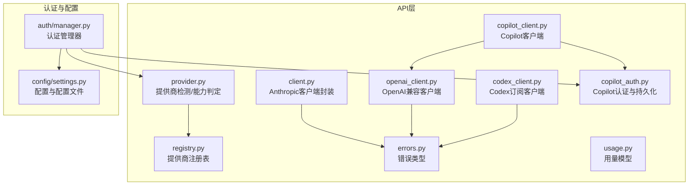
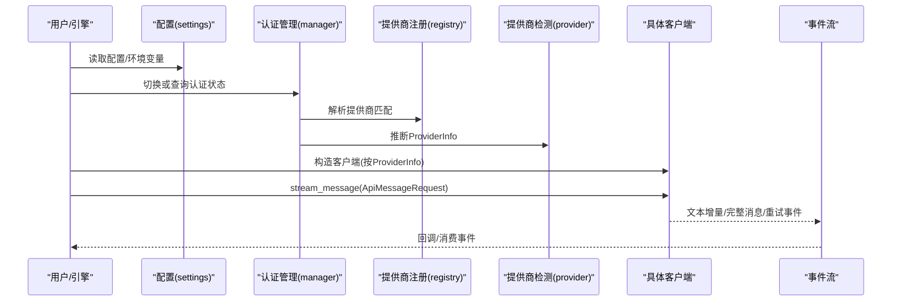
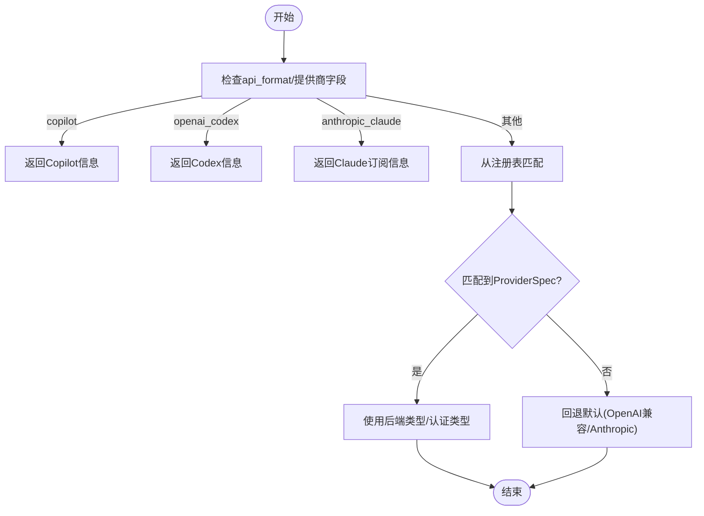
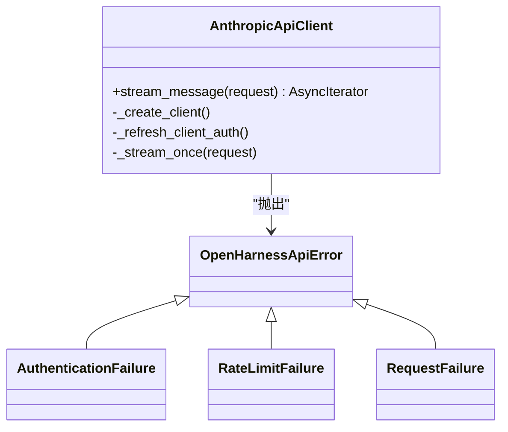
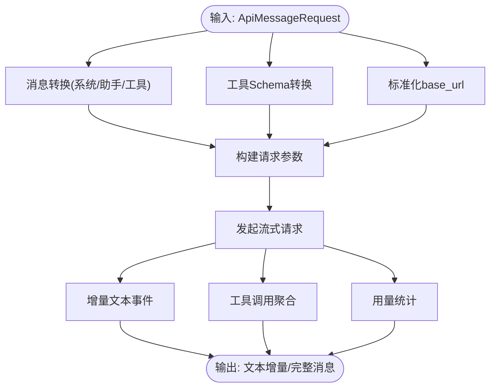
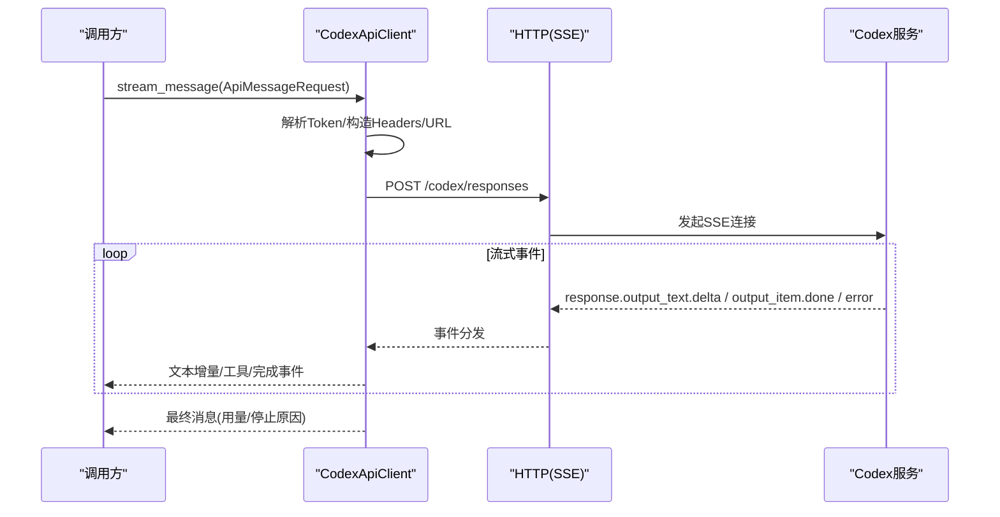
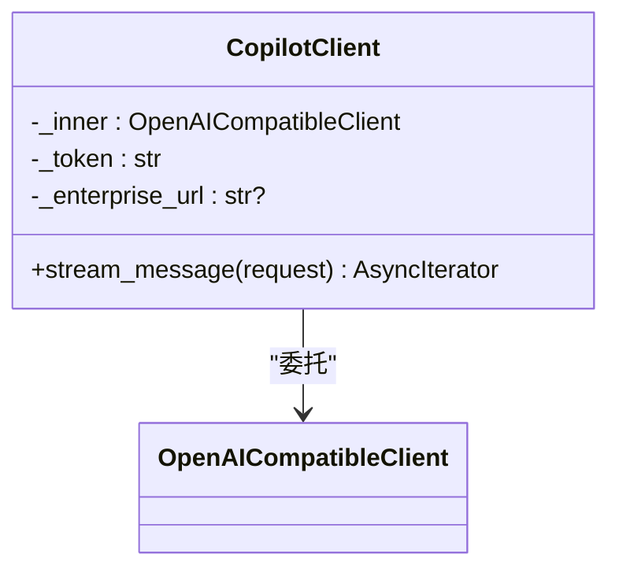
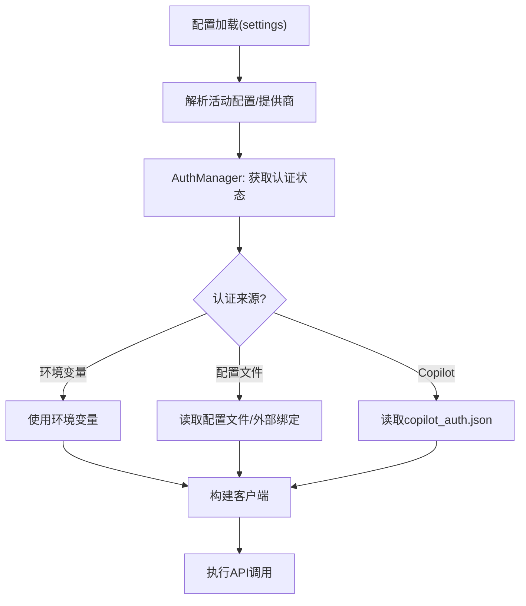
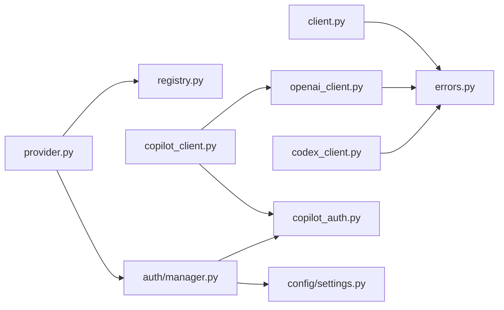

# 提供商API

<cite>
**本文引用的文件**
- [provider.py](file://src/openharness/api/provider.py)
- [client.py](file://src/openharness/api/client.py)
- [openai_client.py](file://src/openharness/api/openai_client.py)
- [codex_client.py](file://src/openharness/api/codex_client.py)
- [copilot_client.py](file://src/openharness/api/copilot_client.py)
- [registry.py](file://src/openharness/api/registry.py)
- [copilot_auth.py](file://src/openharness/api/copilot_auth.py)
- [errors.py](file://src/openharness/api/errors.py)
- [usage.py](file://src/openharness/api/usage.py)
- [manager.py](file://src/openharness/auth/manager.py)
- [settings.py](file://src/openharness/config/settings.py)
- [__init__.py](file://src/openharness/api/__init__.py)
- [test_openai_client.py](file://tests/test_api/test_openai_client.py)
- [test_codex_client.py](file://tests/test_api/test_codex_client.py)
- [test_copilot_client.py](file://tests/test_api/test_copilot_client.py)
</cite>

## 目录
1. [简介](#简介)
2. [项目结构](#项目结构)
3. [核心组件](#核心组件)
4. [架构总览](#架构总览)
5. [详细组件分析](#详细组件分析)
6. [依赖分析](#依赖分析)
7. [性能考虑](#性能考虑)
8. [故障排查指南](#故障排查指南)
9. [结论](#结论)
10. [附录](#附录)

## 简介
本文件面向多提供商支持的API接口，系统化梳理Provider类与各客户端实现（Anthropic、OpenAI兼容、Codex、Copilot），覆盖配置与使用方法、提供商切换机制、认证流程与API密钥管理、错误处理与兼容性说明，并解释各提供商功能差异与限制。

## 项目结构
OpenHarness在API层通过统一协议抽象屏蔽不同提供商差异，核心位于src/openharness/api目录，认证与配置由auth与config模块协同完成。

图表来源
- [provider.py:1-187](file://src/openharness/api/provider.py#L1-L187)
- [client.py:1-267](file://src/openharness/api/client.py#L1-L267)
- [openai_client.py:1-449](file://src/openharness/api/openai_client.py#L1-L449)
- [codex_client.py:1-396](file://src/openharness/api/codex_client.py#L1-L396)
- [copilot_client.py:1-131](file://src/openharness/api/copilot_client.py#L1-L131)
- [registry.py:1-438](file://src/openharness/api/registry.py#L1-L438)
- [copilot_auth.py:1-241](file://src/openharness/api/copilot_auth.py#L1-L241)
- [errors.py:1-20](file://src/openharness/api/errors.py#L1-L20)
- [usage.py:1-18](file://src/openharness/api/usage.py#L1-L18)
- [manager.py:1-483](file://src/openharness/auth/manager.py#L1-L483)
- [settings.py:1-965](file://src/openharness/config/settings.py#L1-L965)

章节来源
- [provider.py:1-187](file://src/openharness/api/provider.py#L1-L187)
- [registry.py:1-438](file://src/openharness/api/registry.py#L1-L438)
- [copilot_auth.py:1-241](file://src/openharness/api/copilot_auth.py#L1-L241)
- [manager.py:1-483](file://src/openharness/auth/manager.py#L1-L483)
- [settings.py:1-965](file://src/openharness/config/settings.py#L1-L965)

## 核心组件
- ProviderInfo与提供商检测：根据配置与注册表推断当前提供商、认证方式与能力（如语音支持）。
- 客户端协议：统一的流式消息接口，屏蔽Anthropic与OpenAI兼容差异。
- 具体客户端：
  - AnthropicApiClient：基于AsyncAnthropic，支持重试与OAuth元数据。
  - OpenAICompatibleClient：统一OpenAI兼容API（含多模态、工具调用、令牌限制参数等）。
  - CodexApiClient：ChatGPT/Codex订阅响应流式接口。
  - CopilotClient：基于OpenAI兼容客户端，注入Copilot专属头部。
- 认证与密钥管理：AuthManager集中管理认证状态、切换与存储；配置文件与环境变量解析。
- 错误体系：OpenHarnessApiError及其子类用于区分鉴权失败、限流与请求失败。

章节来源
- [provider.py:42-127](file://src/openharness/api/provider.py#L42-L127)
- [client.py:79-267](file://src/openharness/api/client.py#L79-L267)
- [openai_client.py:228-449](file://src/openharness/api/openai_client.py#L228-L449)
- [codex_client.py:212-396](file://src/openharness/api/codex_client.py#L212-L396)
- [copilot_client.py:48-131](file://src/openharness/api/copilot_client.py#L48-L131)
- [manager.py:71-483](file://src/openharness/auth/manager.py#L71-L483)
- [errors.py:6-20](file://src/openharness/api/errors.py#L6-L20)

## 架构总览
OpenHarness通过“配置解析—提供商检测—客户端选择—流式调用—事件回传”的链路实现跨提供商统一调用。

图表来源
- [settings.py:1-965](file://src/openharness/config/settings.py#L1-L965)
- [manager.py:1-483](file://src/openharness/auth/manager.py#L1-L483)
- [registry.py:408-438](file://src/openharness/api/registry.py#L408-L438)
- [provider.py:42-127](file://src/openharness/api/provider.py#L42-L127)
- [client.py:160-258](file://src/openharness/api/client.py#L160-L258)
- [openai_client.py:247-398](file://src/openharness/api/openai_client.py#L247-L398)
- [codex_client.py:220-344](file://src/openharness/api/codex_client.py#L220-L344)
- [copilot_client.py:112-131](file://src/openharness/api/copilot_client.py#L112-L131)

## 详细组件分析

### Provider类与提供商检测
- ProviderInfo：包含提供商名称、认证类型、是否支持语音及原因。
- detect_provider：综合配置与注册表，优先匹配显式格式（如copilot），其次依据模型名、URL关键字与键前缀匹配，最后回退默认。
- auth_status：返回紧凑的认证状态字符串，区分缺失、企业版、外部绑定等场景。
- 多模态能力：基于模型名正则模式判断是否具备视觉输入能力。

图表来源
- [provider.py:42-94](file://src/openharness/api/provider.py#L42-L94)
- [registry.py:408-438](file://src/openharness/api/registry.py#L408-L438)

章节来源
- [provider.py:42-127](file://src/openharness/api/provider.py#L42-L127)
- [registry.py:17-368](file://src/openharness/api/registry.py#L17-L368)

### Anthropic 客户端（AnthropicApiClient）
- 协议：SupportsStreamingMessages，统一事件流接口。
- 功能要点：
  - 重试策略：指数退避+抖动，可处理速率限制与网络异常。
  - 认证：支持API Key与OAuth Token；OAuth时附加属性头与元数据。
  - 流式输出：文本增量事件与最终消息事件，附带用量统计。
- 错误映射：将上游异常映射为统一错误类型。

图表来源
- [client.py:117-267](file://src/openharness/api/client.py#L117-L267)
- [errors.py:6-20](file://src/openharness/api/errors.py#L6-L20)

章节来源
- [client.py:117-267](file://src/openharness/api/client.py#L117-L267)
- [errors.py:6-20](file://src/openharness/api/errors.py#L6-L20)

### OpenAI 兼容客户端（OpenAICompatibleClient）
- 协议：与Anthropic客户端一致，便于在引擎中无缝替换。
- 能力：
  - 消息转换：系统提示、工具调用、多模态用户内容（文本/图片）。
  - 参数适配：针对不同模型族选择max_tokens或max_completion_tokens。
  - 思维模型支持：剥离<think>块，保留推理内容以备后续回放。
  - 流式处理：增量文本、工具调用聚合、用量统计。
- URL规范化：确保自定义base_url路径不被截断。

图表来源
- [openai_client.py:80-398](file://src/openharness/api/openai_client.py#L80-L398)

章节来源
- [openai_client.py:228-449](file://src/openharness/api/openai_client.py#L228-L449)
- [test_openai_client.py:1-438](file://tests/test_api/test_openai_client.py#L1-L438)

### Codex 客户端（CodexApiClient）
- 专用于ChatGPT/Codex订阅的响应流式接口。
- 关键点：
  - 认证：Bearer Token + JWT解析提取账户ID，注入HTTP头。
  - URL：自动修正至/codex/responses端点。
  - 消息/工具转换：遵循Codex输入规范，先输出函数结果再用户输入。
  - SSE事件解析：分发文本增量、消息完成、工具调用、错误事件。
  - 停止原因：根据响应状态映射为stop/tool_use/length/error。

图表来源
- [codex_client.py:212-396](file://src/openharness/api/codex_client.py#L212-L396)

章节来源
- [codex_client.py:212-396](file://src/openharness/api/codex_client.py#L212-L396)
- [test_codex_client.py:1-242](file://tests/test_api/test_codex_client.py#L1-L242)

### Copilot 客户端（CopilotClient）
- 基于OpenAI兼容客户端，直接复用其消息/工具转换逻辑。
- 认证：从持久化文件加载GitHub OAuth Token，或显式传入；支持企业域。
- 请求头：注入User-Agent与Openai-Intent标识。
- 默认模型：若未指定模型，使用默认值（如gpt-4o）。

图表来源
- [copilot_client.py:48-131](file://src/openharness/api/copilot_client.py#L48-L131)
- [copilot_auth.py:48-128](file://src/openharness/api/copilot_auth.py#L48-L128)

章节来源
- [copilot_client.py:48-131](file://src/openharness/api/copilot_client.py#L48-L131)
- [copilot_auth.py:1-241](file://src/openharness/api/copilot_auth.py#L1-L241)
- [test_copilot_client.py:1-141](file://tests/test_api/test_copilot_client.py#L1-L141)

### 认证流程与API密钥管理
- 认证来源：环境变量、配置文件、外部绑定（如Claude订阅）、Copilot持久化文件。
- 认证状态：统一由AuthManager维护，支持列出所有提供商/认证源状态、切换活动配置文件与认证源。
- 配置解析：settings模块按CLI参数、环境变量、配置文件、默认值顺序解析，支持内置配置模板与别名解析。

图表来源
- [settings.py:109-267](file://src/openharness/config/settings.py#L109-L267)
- [manager.py:116-289](file://src/openharness/auth/manager.py#L116-L289)
- [copilot_auth.py:97-146](file://src/openharness/api/copilot_auth.py#L97-L146)

章节来源
- [manager.py:71-483](file://src/openharness/auth/manager.py#L71-L483)
- [settings.py:1-965](file://src/openharness/config/settings.py#L1-L965)
- [copilot_auth.py:1-241](file://src/openharness/api/copilot_auth.py#L1-L241)

## 依赖分析
- 组件耦合：
  - 客户端均依赖统一的事件模型与错误类型，降低上层复杂度。
  - CopilotClient依赖OpenAI兼容客户端与Copilot认证模块。
  - ProviderInfo与注册表共同决定客户端选择与行为差异。
- 外部依赖：
  - Anthropic SDK（异步）用于原生调用。
  - OpenAI SDK（异步）用于兼容API。
  - httpx用于Codex SSE流式请求。
- 可能的循环依赖：未见直接循环导入，模块职责清晰。

图表来源
- [provider.py:1-187](file://src/openharness/api/provider.py#L1-L187)
- [registry.py:1-438](file://src/openharness/api/registry.py#L1-L438)
- [client.py:1-267](file://src/openharness/api/client.py#L1-L267)
- [openai_client.py:1-449](file://src/openharness/api/openai_client.py#L1-L449)
- [codex_client.py:1-396](file://src/openharness/api/codex_client.py#L1-L396)
- [copilot_client.py:1-131](file://src/openharness/api/copilot_client.py#L1-L131)
- [copilot_auth.py:1-241](file://src/openharness/api/copilot_auth.py#L1-L241)
- [manager.py:1-483](file://src/openharness/auth/manager.py#L1-L483)
- [settings.py:1-965](file://src/openharness/config/settings.py#L1-L965)
- [errors.py:1-20](file://src/openharness/api/errors.py#L1-L20)

章节来源
- [__init__.py:1-22](file://src/openharness/api/__init__.py#L1-L22)

## 性能考虑
- 重试与退避：客户端普遍采用指数退避+抖动，避免雪崩效应；合理设置最大延迟上限。
- 流式处理：优先增量事件，减少等待时间；注意在工具调用场景下避免不必要的stream_options。
- URL规范化：确保自定义base_url路径完整，避免额外重定向开销。
- 多模态输入：仅在模型明确支持时启用图像输入，避免无效请求与转换成本。

## 故障排查指南
- 认证失败（401/403）：检查环境变量、配置文件或外部绑定；Copilot需确认持久化token存在且未过期。
- 速率限制（429）：触发重试；必要时降低并发或调整模型参数。
- 连接/网络错误：确认代理、防火墙与超时设置；Codex流式需关注SSE连接稳定性。
- 模型不支持：核对模型名与提供商匹配；必要时切换到兼容模型或更换提供商。
- 用量统计：留意不同提供商返回的用量字段差异，统一使用UsageSnapshot进行聚合。

章节来源
- [errors.py:6-20](file://src/openharness/api/errors.py#L6-L20)
- [client.py:260-267](file://src/openharness/api/client.py#L260-L267)
- [openai_client.py:410-418](file://src/openharness/api/openai_client.py#L410-L418)
- [codex_client.py:387-396](file://src/openharness/api/codex_client.py#L387-L396)

## 结论
OpenHarness通过统一的提供商检测、认证管理与客户端协议，实现了对Anthropic、OpenAI兼容、Codex与Copilot的无缝接入。开发者可通过配置与认证管理器快速切换提供商，利用统一事件流与错误体系提升稳定性与可维护性。

## 附录

### 配置与使用示例（路径指引）
- 设置内置配置文件与环境变量优先级：参考配置解析顺序与内置模板。
  - [settings.py:1-200](file://src/openharness/config/settings.py#L1-L200)
  - [settings.py:200-400](file://src/openharness/config/settings.py#L200-L400)
- 切换提供商与认证源：
  - [manager.py:407-430](file://src/openharness/auth/manager.py#L407-L430)
- Copilot认证与持久化：
  - [copilot_auth.py:97-146](file://src/openharness/api/copilot_auth.py#L97-L146)
- 多模态能力检测：
  - [provider.py:175-187](file://src/openharness/api/provider.py#L175-L187)

### 错误类型与处理
- 统一错误基类与子类：
  - [errors.py:6-20](file://src/openharness/api/errors.py#L6-L20)
- 客户端错误映射：
  - [client.py:260-267](file://src/openharness/api/client.py#L260-L267)
  - [openai_client.py:410-418](file://src/openharness/api/openai_client.py#L410-L418)
  - [codex_client.py:204-210](file://src/openharness/api/codex_client.py#L204-L210)

### 兼容性说明
- 模型族差异：部分模型族使用max_completion_tokens而非max_tokens；已自动适配。
  - [openai_client.py:45-56](file://src/openharness/api/openai_client.py#L45-L56)
- 工具调用：OpenAI兼容客户端在工具调用时可能移除stream_options以避免思维模式干扰。
  - [openai_client.py:293-297](file://src/openharness/api/openai_client.py#L293-L297)
- 思维模型<think>标签：客户端剥离<think>块，保证用户可见内容纯净。
  - [openai_client.py:425-449](file://src/openharness/api/openai_client.py#L425-L449)