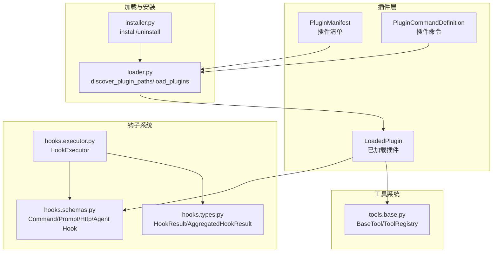
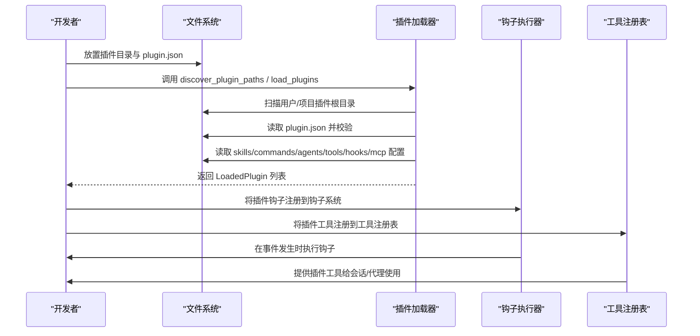
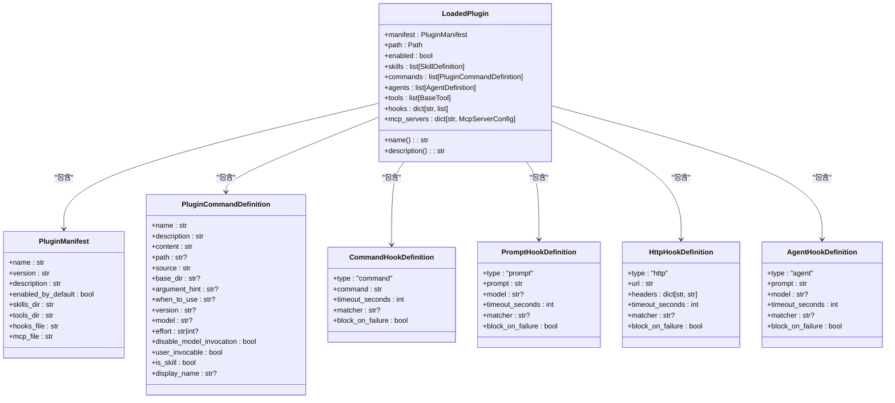
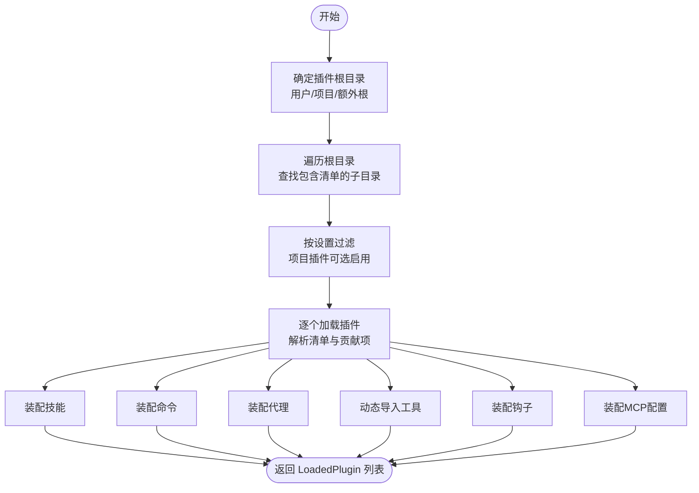
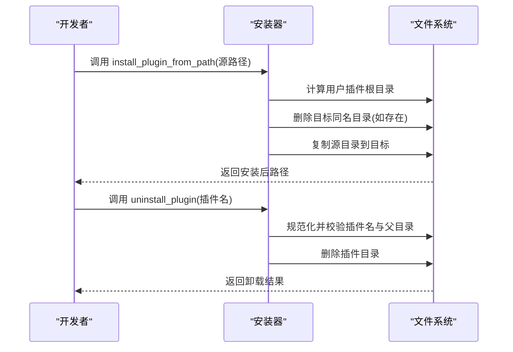
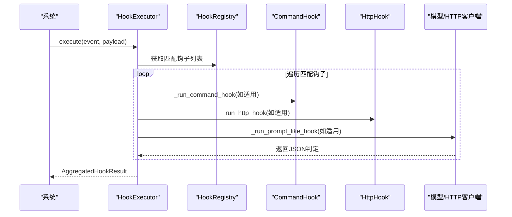
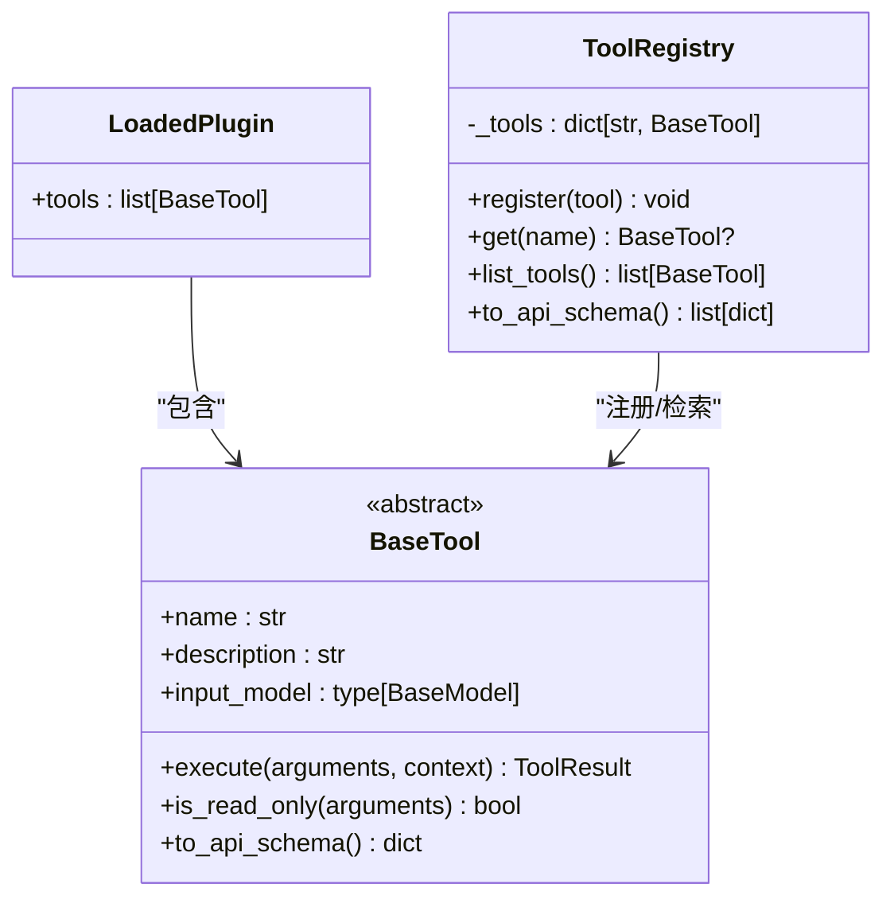
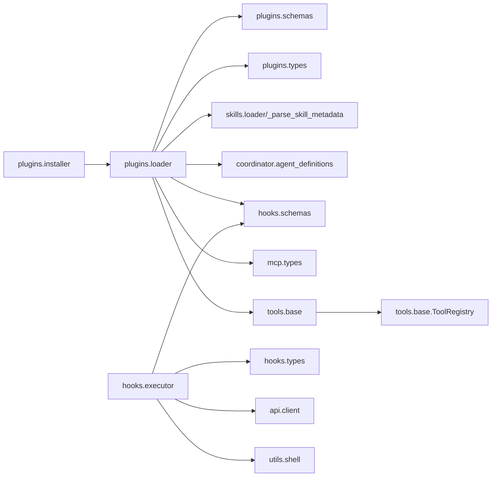

# 插件API

<cite>
**本文引用的文件**
- [src/openharness/plugins/__init__.py](file://src/openharness/plugins/__init__.py)
- [src/openharness/plugins/schemas.py](file://src/openharness/plugins/schemas.py)
- [src/openharness/plugins/types.py](file://src/openharness/plugins/types.py)
- [src/openharness/plugins/loader.py](file://src/openharness/plugins/loader.py)
- [src/openharness/plugins/installer.py](file://src/openharness/plugins/installer.py)
- [src/openharness/hooks/schemas.py](file://src/openharness/hooks/schemas.py)
- [src/openharness/hooks/types.py](file://src/openharness/hooks/types.py)
- [src/openharness/hooks/executor.py](file://src/openharness/hooks/executor.py)
- [src/openharness/tools/base.py](file://src/openharness/tools/base.py)
- [tests/test_plugins/test_loader.py](file://tests/test_plugins/test_loader.py)
- [tests/test_plugins/test_lifecycle_flow.py](file://tests/test_plugins/test_lifecycle_flow.py)
</cite>

## 目录
1. [简介](#简介)
2. [项目结构](#项目结构)
3. [核心组件](#核心组件)
4. [架构总览](#架构总览)
5. [详细组件分析](#详细组件分析)
6. [依赖分析](#依赖分析)
7. [性能考虑](#性能考虑)
8. [故障排查指南](#故障排查指南)
9. [结论](#结论)
10. [附录](#附录)

## 简介
本文件为 OpenHarness 插件系统的完整 API 文档，覆盖插件清单与运行时类型、插件发现与加载、安装与卸载、钩子（Hook）系统、工具（Tool）扩展以及与主系统的集成方式。文档同时提供插件开发指南、调试技巧与部署注意事项，帮助开发者快速构建可维护、可扩展且安全的插件生态。

## 项目结构
插件系统主要由以下模块组成：
- 插件清单与运行时类型：定义插件清单模型与加载后的运行时聚合对象
- 插件加载器：负责扫描、解析与装配插件贡献的技能、命令、代理、工具、钩子与 MCP 配置
- 插件安装器：提供用户级插件目录的安装与卸载能力
- 钩子系统：定义钩子类型、执行引擎与结果聚合
- 工具基础：统一工具抽象与注册表，支持插件动态注入工具

**图表来源**
- [src/openharness/plugins/schemas.py:8-25](file://src/openharness/plugins/schemas.py#L8-L25)
- [src/openharness/plugins/types.py:18-60](file://src/openharness/plugins/types.py#L18-L60)
- [src/openharness/plugins/loader.py:107-163](file://src/openharness/plugins/loader.py#L107-L163)
- [src/openharness/plugins/installer.py:23-40](file://src/openharness/plugins/installer.py#L23-L40)
- [src/openharness/hooks/schemas.py:10-58](file://src/openharness/hooks/schemas.py#L10-L58)
- [src/openharness/hooks/types.py:9-39](file://src/openharness/hooks/types.py#L9-L39)
- [src/openharness/hooks/executor.py:41-79](file://src/openharness/hooks/executor.py#L41-L79)
- [src/openharness/tools/base.py:35-81](file://src/openharness/tools/base.py#L35-L81)

**章节来源**
- [src/openharness/plugins/__init__.py:11-53](file://src/openharness/plugins/__init__.py#L11-L53)
- [src/openharness/plugins/loader.py:61-124](file://src/openharness/plugins/loader.py#L61-L124)
- [src/openharness/plugins/installer.py:23-40](file://src/openharness/plugins/installer.py#L23-L40)

## 核心组件
- 插件清单模型：描述插件元数据与资源路径，默认字段包含名称、版本、启用策略、目录名与配置文件名等
- 运行时聚合对象：封装已加载插件及其贡献的技能、命令、代理、工具、钩子与 MCP 服务器配置
- 加载器 API：提供插件目录发现、按设置过滤、单插件加载与多插件批量加载
- 安装器 API：提供从任意源路径复制到用户插件目录、按名称卸载用户插件的能力
- 钩子模型与执行器：定义多种钩子类型、执行上下文、超时与阻断策略，并统一异步执行
- 工具抽象：统一工具接口、输入模型与注册表，支持插件动态注入工具实例

**章节来源**
- [src/openharness/plugins/schemas.py:8-25](file://src/openharness/plugins/schemas.py#L8-L25)
- [src/openharness/plugins/types.py:18-60](file://src/openharness/plugins/types.py#L18-L60)
- [src/openharness/plugins/loader.py:107-163](file://src/openharness/plugins/loader.py#L107-L163)
- [src/openharness/plugins/installer.py:23-40](file://src/openharness/plugins/installer.py#L23-L40)
- [src/openharness/hooks/schemas.py:10-58](file://src/openharness/hooks/schemas.py#L10-L58)
- [src/openharness/hooks/executor.py:41-79](file://src/openharness/hooks/executor.py#L41-L79)
- [src/openharness/tools/base.py:35-81](file://src/openharness/tools/base.py#L35-L81)

## 架构总览
下图展示插件从磁盘到运行时的全链路：发现 → 解析清单 → 装配贡献项 → 注册钩子与工具 → 与 MCP 集成。

**图表来源**
- [src/openharness/plugins/loader.py:61-163](file://src/openharness/plugins/loader.py#L61-L163)
- [src/openharness/hooks/executor.py:64-79](file://src/openharness/hooks/executor.py#L64-L79)
- [src/openharness/tools/base.py:60-81](file://src/openharness/tools/base.py#L60-L81)

## 详细组件分析

### 数据模型与类型
- PluginManifest：插件清单，包含名称、版本、描述、默认启用状态、资源目录与配置文件名等字段；支持扩展作者、命令、代理、技能与钩子声明
- LoadedPlugin：运行时聚合对象，包含清单、路径、启用状态与贡献项集合（技能、命令、代理、工具、钩子、MCP 服务器）
- PluginCommandDefinition：插件命令定义，支持前端显示名、参数提示、模型选择、是否允许模型调用等
- Hook 模型：CommandHookDefinition、PromptHookDefinition、HttpHookDefinition、AgentHookDefinition，均支持匹配器、超时与失败阻断策略
- Hook 执行结果：HookResult 与 AggregatedHookResult，用于表达单个与整体钩子执行的状态与阻断原因

**图表来源**
- [src/openharness/plugins/schemas.py:8-25](file://src/openharness/plugins/schemas.py#L8-L25)
- [src/openharness/plugins/types.py:18-60](file://src/openharness/plugins/types.py#L18-L60)
- [src/openharness/hooks/schemas.py:10-58](file://src/openharness/hooks/schemas.py#L10-L58)

**章节来源**
- [src/openharness/plugins/schemas.py:8-25](file://src/openharness/plugins/schemas.py#L8-L25)
- [src/openharness/plugins/types.py:18-60](file://src/openharness/plugins/types.py#L18-L60)
- [src/openharness/hooks/schemas.py:10-58](file://src/openharness/hooks/schemas.py#L10-L58)
- [src/openharness/hooks/types.py:9-39](file://src/openharness/hooks/types.py#L9-L39)

### 插件加载器 API
- 目录发现
  - discover_plugin_paths：在用户与项目插件根目录中查找包含清单的插件目录
  - discover_plugin_paths_for_settings：根据设置决定是否包含项目插件根目录
- 插件加载
  - load_plugins：按设置过滤后批量加载插件
  - load_plugin：加载单个插件目录，解析清单并装配贡献项
- 贡献项装配
  - 技能：支持直接 SKILL.md 与嵌套目录 SKILL.md 的两种布局
  - 命令：支持目录扫描与清单声明两种方式，自动推导命令命名空间
  - 代理：支持目录扫描与清单声明，解析前端元数据与权限配置
  - 工具：动态导入 tools/*.py 中的 BaseTool 子类并实例化
  - 钩子：支持 hooks.json 与 hooks/hooks.json 两种格式
  - MCP：支持 mcp.json 与 .mcp.json 两种格式
- 错误与安全
  - 对异常进行日志记录，避免单个插件影响整体加载
  - 项目插件默认禁用，除非显式允许

**图表来源**
- [src/openharness/plugins/loader.py:61-163](file://src/openharness/plugins/loader.py#L61-L163)

**章节来源**
- [src/openharness/plugins/loader.py:61-163](file://src/openharness/plugins/loader.py#L61-L163)

### 插件安装器 API
- install_plugin_from_path：将源插件目录复制到用户插件根目录，若目标存在则先删除再复制
- uninstall_plugin：按名称删除用户插件目录，包含路径规范化与越界检查，防止目录穿越

**图表来源**
- [src/openharness/plugins/installer.py:23-40](file://src/openharness/plugins/installer.py#L23-L40)

**章节来源**
- [src/openharness/plugins/installer.py:23-40](file://src/openharness/plugins/installer.py#L23-L40)

### 钩子系统 API
- 钩子类型
  - CommandHookDefinition：执行 shell 命令，支持超时、阻断与匹配器
  - PromptHookDefinition：通过模型判断条件，支持超时与阻断
  - HttpHookDefinition：向 HTTP 端点发送事件负载，支持超时与阻断
  - AgentHookDefinition：更深入的代理式验证，支持超时与阻断
- 执行引擎
  - HookExecutor：接收事件与负载，匹配钩子并异步执行，聚合结果
  - 支持环境变量注入、超时控制、失败阻断与输出解析
- 结果类型
  - HookResult：单钩子执行结果
  - AggregatedHookResult：事件维度的聚合结果，提供阻断判定与首个阻断原因

**图表来源**
- [src/openharness/hooks/executor.py:64-79](file://src/openharness/hooks/executor.py#L64-L79)
- [src/openharness/hooks/schemas.py:10-58](file://src/openharness/hooks/schemas.py#L10-L58)

**章节来源**
- [src/openharness/hooks/schemas.py:10-58](file://src/openharness/hooks/schemas.py#L10-L58)
- [src/openharness/hooks/executor.py:41-243](file://src/openharness/hooks/executor.py#L41-L243)
- [src/openharness/hooks/types.py:9-39](file://src/openharness/hooks/types.py#L9-L39)

### 工具系统与插件集成
- BaseTool：统一工具接口，要求实现 execute 方法与输入模型
- ToolRegistry：工具注册表，提供按名称检索与 API Schema 导出
- 插件工具注入：加载器在插件启用时动态导入 tools/*.py 中的 BaseTool 子类并实例化，加入注册表

**图表来源**
- [src/openharness/tools/base.py:35-81](file://src/openharness/tools/base.py#L35-L81)
- [src/openharness/plugins/loader.py:691-731](file://src/openharness/plugins/loader.py#L691-L731)

**章节来源**
- [src/openharness/tools/base.py:35-81](file://src/openharness/tools/base.py#L35-L81)
- [src/openharness/plugins/loader.py:691-731](file://src/openharness/plugins/loader.py#L691-L731)

### 插件开发指南
- 插件结构
  - 清单文件：plugin.json，位于插件根目录或 .claude-plugin/plugin.json
  - 资源目录：skills、tools、agents、commands、hooks、mcp.json/.mcp.json
  - 命令与代理：支持 Markdown 前言元数据，自动提取描述与参数提示
- 钩子函数与事件处理
  - 在 hooks.json 或 hooks/hooks.json 中声明事件与钩子类型
  - 使用匹配器对事件进行筛选，结合超时与阻断策略保障安全性
- 与主系统的集成
  - 技能与命令：通过加载器自动注册到技能/命令系统
  - 代理：作为独立代理参与编排
  - 工具：动态导入 BaseTool 子类并注册到工具注册表
  - MCP：在 mcp.json/.mcp.json 中声明服务器配置，由加载器装配
- 依赖管理与版本兼容
  - 通过清单字段控制启用策略与资源目录名
  - 工具输入模型使用 Pydantic，确保参数校验与 API 兼容
- 开发示例与测试参考
  - 参考测试用例中的插件目录结构与内容生成逻辑
  - 参考生命周期测试，了解安装、加载、连接 MCP、卸载的完整流程

**章节来源**
- [tests/test_plugins/test_loader.py:16-72](file://tests/test_plugins/test_loader.py#L16-L72)
- [tests/test_plugins/test_lifecycle_flow.py:20-53](file://tests/test_plugins/test_lifecycle_flow.py#L20-L53)
- [src/openharness/plugins/loader.py:251-307](file://src/openharness/plugins/loader.py#L251-L307)

## 依赖分析
- 组件耦合
  - 加载器依赖配置路径、技能解析器、代理定义、MCP 类型与钩子模式
  - 安装器仅依赖加载器提供的用户插件根目录
  - 钩子执行器依赖钩子模式与工具执行上下文
  - 工具系统与插件加载器通过 BaseTool 接口耦合
- 外部依赖
  - Pydantic 用于数据校验与序列化
  - httpx 用于 HTTP 钩子
  - yaml/json 用于配置解析
- 循环依赖
  - 未见循环依赖迹象，模块职责清晰

**图表来源**
- [src/openharness/plugins/loader.py:28-31](file://src/openharness/plugins/loader.py#L28-L31)
- [src/openharness/plugins/installer.py:8-9](file://src/openharness/plugins/installer.py#L8-L9)
- [src/openharness/hooks/executor.py:16-29](file://src/openharness/hooks/executor.py#L16-L29)

**章节来源**
- [src/openharness/plugins/loader.py:1-34](file://src/openharness/plugins/loader.py#L1-L34)
- [src/openharness/hooks/executor.py:1-30](file://src/openharness/hooks/executor.py#L1-L30)

## 性能考虑
- I/O 优化
  - 批量扫描插件目录时避免重复访问同一路径
  - 对不存在的目录提前短路，减少不必要的文件系统操作
- 动态导入
  - 工具模块采用按需导入与实例化，避免启动时加载所有插件工具
- 异步执行
  - 钩子执行器使用异步子进程与 HTTP 客户端，合理设置超时避免阻塞
- 缓存与复用
  - 建议在上层应用中缓存已加载插件与工具注册表，减少重复装配

## 故障排查指南
- 插件未被加载
  - 检查是否位于用户或项目插件根目录，且包含有效清单
  - 若为项目插件，确认设置允许加载
- 清单解析失败
  - 确认清单字段合法，编码正确
- 命令/代理/技能未出现
  - 检查目录结构与文件命名是否符合约定
  - 确认 frontmatter 是否正确
- 工具未生效
  - 确认工具类继承 BaseTool，具备 name/description/input_model 属性
  - 确认插件处于启用状态
- 钩子不触发或阻断
  - 检查匹配器与事件负载键值
  - 调整超时与阻断策略
- 卸载失败
  - 确认插件名不包含路径分隔符与越界路径

**章节来源**
- [src/openharness/plugins/loader.py:126-163](file://src/openharness/plugins/loader.py#L126-L163)
- [src/openharness/plugins/installer.py:33-40](file://src/openharness/plugins/installer.py#L33-L40)
- [src/openharness/hooks/executor.py:215-243](file://src/openharness/hooks/executor.py#L215-L243)

## 结论
OpenHarness 插件系统通过清晰的数据模型、灵活的加载机制与强大的钩子/工具扩展能力，实现了对主系统的低耦合集成。开发者可通过标准的清单与目录结构快速构建插件，并借助钩子与工具系统实现复杂的安全控制与业务扩展。建议在生产环境中严格遵循启用策略、超时与阻断配置，并通过测试用例验证插件行为。

## 附录
- 公共导出入口
  - 插件清单与运行时类型：PluginManifest、LoadedPlugin
  - 发现与加载：discover_plugin_paths、get_project_plugins_dir、get_user_plugins_dir、load_plugins
  - 安装与卸载：install_plugin_from_path、uninstall_plugin
- 关键实现路径
  - 插件清单与类型：[schemas.py:8-25](file://src/openharness/plugins/schemas.py#L8-L25)、[types.py:18-60](file://src/openharness/plugins/types.py#L18-L60)
  - 加载器：[loader.py:61-163](file://src/openharness/plugins/loader.py#L61-L163)
  - 安装器：[installer.py:23-40](file://src/openharness/plugins/installer.py#L23-L40)
  - 钩子模型与执行器：[hooks/schemas.py:10-58](file://src/openharness/hooks/schemas.py#L10-L58)、[hooks/executor.py:41-243](file://src/openharness/hooks/executor.py#L41-L243)
  - 工具抽象与注册表：[tools/base.py:35-81](file://src/openharness/tools/base.py#L35-L81)
- 测试参考
  - 插件加载与合并：[test_loader.py:106-140](file://tests/test_plugins/test_loader.py#L106-L140)
  - 生命周期流：[test_lifecycle_flow.py:55-95](file://tests/test_plugins/test_lifecycle_flow.py#L55-L95)