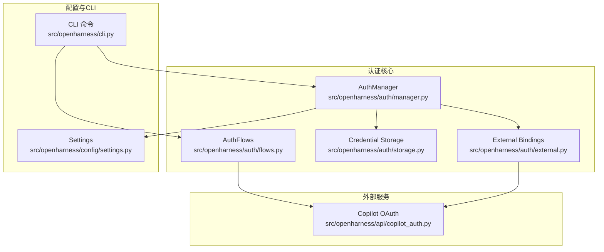
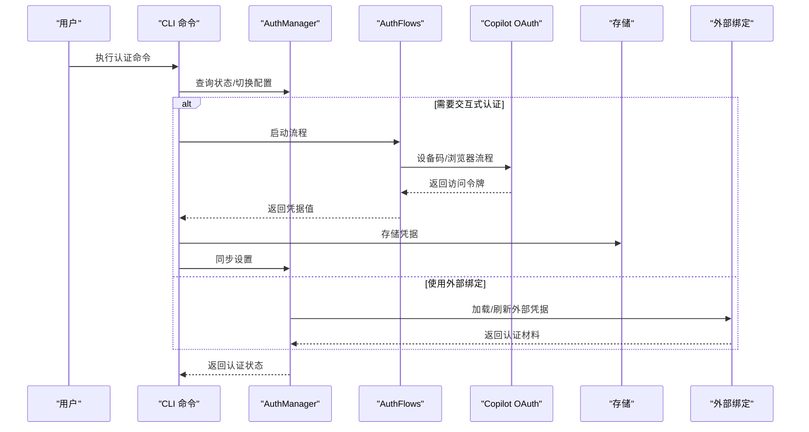
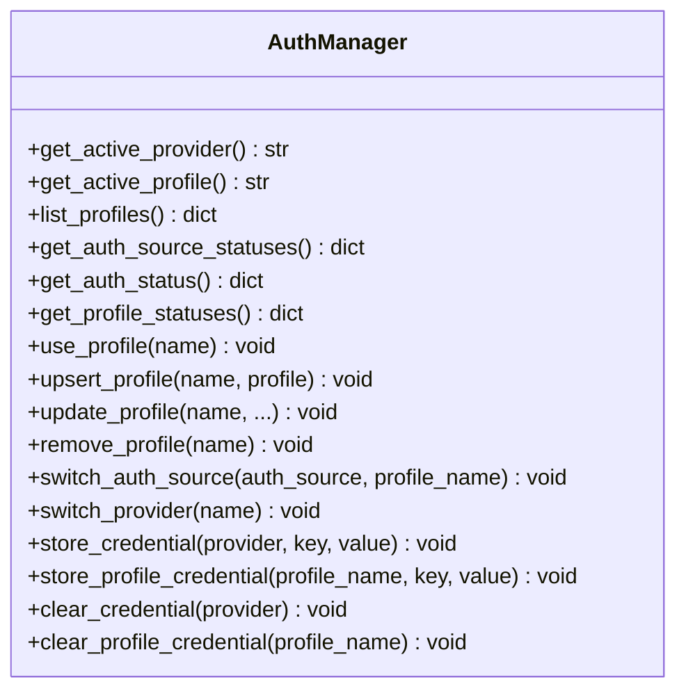
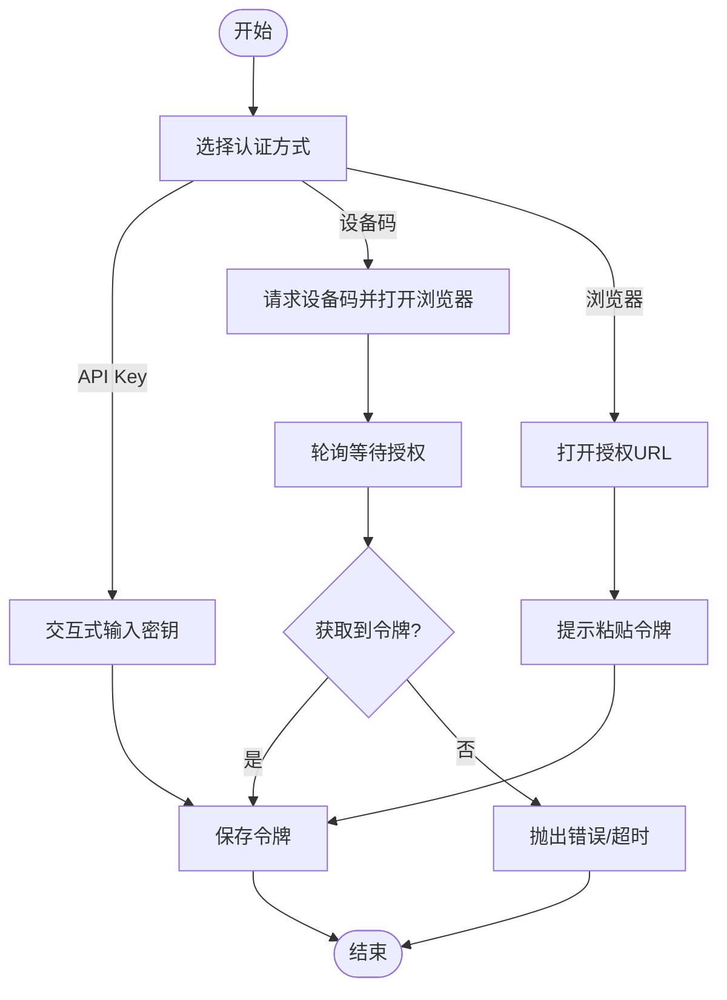
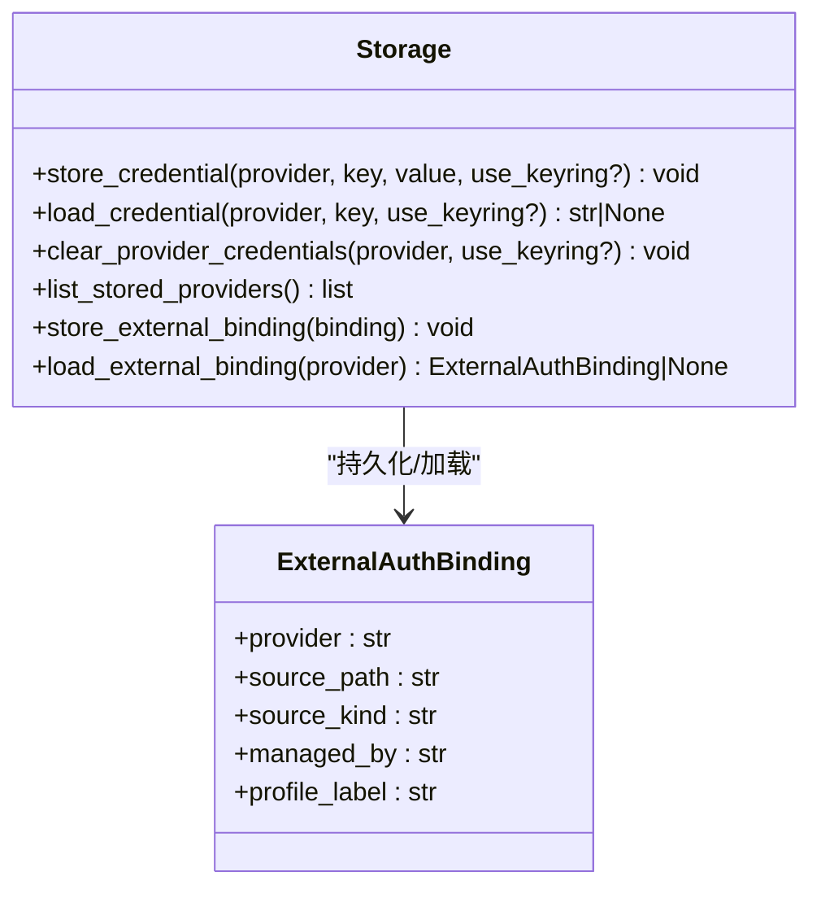
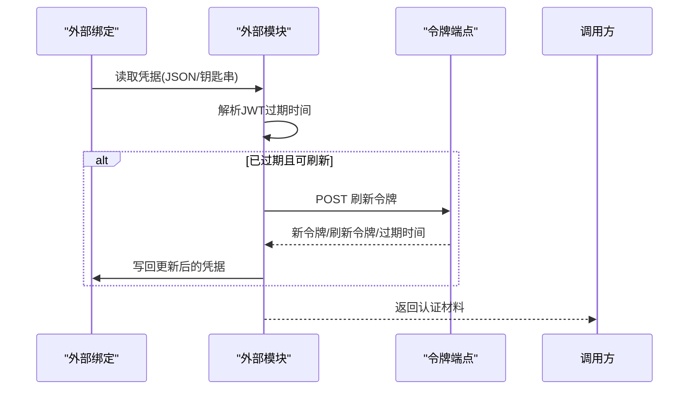
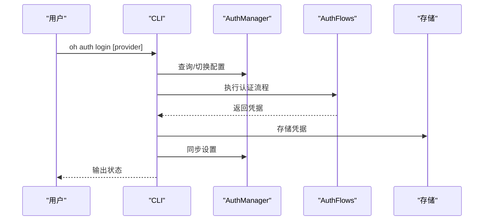
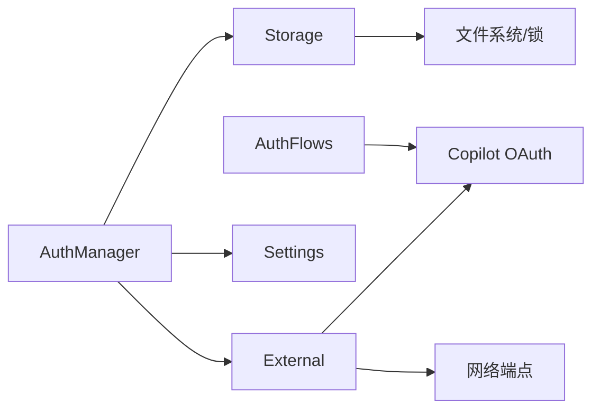

# 认证API

<cite>
**本文引用的文件**
- [src/openharness/auth/manager.py](file://src/openharness/auth/manager.py)
- [src/openharness/auth/flows.py](file://src/openharness/auth/flows.py)
- [src/openharness/auth/external.py](file://src/openharness/auth/external.py)
- [src/openharness/auth/storage.py](file://src/openharness/auth/storage.py)
- [src/openharness/api/copilot_auth.py](file://src/openharness/api/copilot_auth.py)
- [src/openharness/cli.py](file://src/openharness/cli.py)
- [src/openharness/config/settings.py](file://src/openharness/config/settings.py)
- [tests/test_auth/test_external.py](file://tests/test_auth/test_external.py)
- [tests/test_auth/test_flows.py](file://tests/test_auth/test_flows.py)
</cite>

## 目录
1. [简介](#简介)
2. [项目结构](#项目结构)
3. [核心组件](#核心组件)
4. [架构总览](#架构总览)
5. [详细组件分析](#详细组件分析)
6. [依赖分析](#依赖分析)
7. [性能考虑](#性能考虑)
8. [故障排查指南](#故障排查指南)
9. [结论](#结论)
10. [附录](#附录)

## 简介
本文件为 OpenHarness 认证子系统的权威API与安全机制文档。内容覆盖：
- 认证管理器 AuthManager 的公共接口与认证流程
- 外部认证提供商（OAuth、订阅凭据）的集成接口
- 认证令牌的获取、刷新与验证机制
- 配置示例与安全最佳实践
- 失败处理、会话管理与安全防护

## 项目结构
认证相关模块围绕“管理器-流-存储-外部绑定-设置”协同工作，CLI 提供统一入口。

**图表来源**
- [src/openharness/auth/manager.py:71-483](file://src/openharness/auth/manager.py#L71-L483)
- [src/openharness/auth/flows.py:21-190](file://src/openharness/auth/flows.py#L21-L190)
- [src/openharness/auth/storage.py:122-270](file://src/openharness/auth/storage.py#L122-L270)
- [src/openharness/auth/external.py:116-343](file://src/openharness/auth/external.py#L116-L343)
- [src/openharness/api/copilot_auth.py:153-241](file://src/openharness/api/copilot_auth.py#L153-L241)
- [src/openharness/config/settings.py:109-143](file://src/openharness/config/settings.py#L109-L143)
- [src/openharness/cli.py:1794-1900](file://src/openharness/cli.py#L1794-L1900)

**章节来源**
- [src/openharness/auth/manager.py:71-483](file://src/openharness/auth/manager.py#L71-L483)
- [src/openharness/auth/flows.py:21-190](file://src/openharness/auth/flows.py#L21-L190)
- [src/openharness/auth/storage.py:122-270](file://src/openharness/auth/storage.py#L122-L270)
- [src/openharness/auth/external.py:116-343](file://src/openharness/auth/external.py#L116-L343)
- [src/openharness/api/copilot_auth.py:153-241](file://src/openharness/api/copilot_auth.py#L153-L241)
- [src/openharness/config/settings.py:109-143](file://src/openharness/config/settings.py#L109-L143)
- [src/openharness/cli.py:1794-1900](file://src/openharness/cli.py#L1794-L1900)

## 核心组件
- AuthManager：集中式认证状态与凭据管理，负责活动提供者、配置文件、认证源状态查询与切换、凭据存取等。
- AuthFlows：认证流程抽象与实现，支持 API Key 流程与设备码/浏览器流程。
- Credential Storage：本地凭据存储（文件+可选系统钥匙串），支持原子写入与加锁。
- External Bindings：外部CLI订阅凭据（如 Codex/Claude）的读取、刷新与状态描述。
- Copilot OAuth：GitHub Copilot 设备码OAuth流程与持久化。
- Settings：认证材料归一化（ResolvedAuth）、认证源映射与模型解析等。

**章节来源**
- [src/openharness/auth/manager.py:71-483](file://src/openharness/auth/manager.py#L71-L483)
- [src/openharness/auth/flows.py:21-190](file://src/openharness/auth/flows.py#L21-L190)
- [src/openharness/auth/storage.py:122-270](file://src/openharness/auth/storage.py#L122-L270)
- [src/openharness/auth/external.py:116-343](file://src/openharness/auth/external.py#L116-L343)
- [src/openharness/api/copilot_auth.py:153-241](file://src/openharness/api/copilot_auth.py#L153-L241)
- [src/openharness/config/settings.py:109-143](file://src/openharness/config/settings.py#L109-L143)

## 架构总览
认证系统通过 CLI 统一入口调用 AuthManager；AuthManager 调用存储与外部绑定模块；OAuth 场景由 AuthFlows 与 Copilot OAuth 协作完成。

**图表来源**
- [src/openharness/cli.py:1794-1900](file://src/openharness/cli.py#L1794-L1900)
- [src/openharness/auth/manager.py:186-318](file://src/openharness/auth/manager.py#L186-L318)
- [src/openharness/auth/flows.py:117-159](file://src/openharness/auth/flows.py#L117-L159)
- [src/openharness/api/copilot_auth.py:153-241](file://src/openharness/api/copilot_auth.py#L153-L241)
- [src/openharness/auth/storage.py:122-191](file://src/openharness/auth/storage.py#L122-L191)
- [src/openharness/auth/external.py:116-343](file://src/openharness/auth/external.py#L116-L343)

## 详细组件分析

### AuthManager 类与认证流程
- 主要职责
  - 获取/切换活动提供者与配置文件
  - 列出可用配置文件与认证源状态
  - 查询各提供商的认证状态（环境变量/文件/外部）
  - 更新/创建/删除配置文件
  - 存取凭据（文件或系统钥匙串）
- 关键方法
  - get_active_provider/get_active_profile/list_profiles
  - get_auth_source_statuses/get_auth_status/get_profile_statuses
  - use_profile/upsert_profile/update_profile/remove_profile
  - switch_auth_source/switch_provider
  - store_credential/store_profile_credential/clear_credential/clear_profile_credential
- 认证流程要点
  - 认证源状态聚合：优先检查环境变量，其次文件存储，再外部绑定
  - 外部绑定（Claude/Codex）支持过期检测与自动刷新
  - Copilot OAuth 通过设备码流程获取访问令牌并持久化

**图表来源**
- [src/openharness/auth/manager.py:104-483](file://src/openharness/auth/manager.py#L104-L483)

**章节来源**
- [src/openharness/auth/manager.py:104-483](file://src/openharness/auth/manager.py#L104-L483)

### 认证流程与外部提供商集成
- API Key 流程
  - 交互式提示输入密钥，校验非空后返回
- 设备码/浏览器流程
  - 设备码流程：请求设备码、打开浏览器、轮询获取访问令牌
  - 浏览器流程：打开URL并提示粘贴令牌
- 外部绑定（Codex/Claude）
  - 默认绑定位置与来源识别
  - 从JSON或系统钥匙串加载凭据
  - 过期检测与刷新（Claude OAuth）
  - 描述外部状态（缺失/无效/已过期/可刷新/已配置）

**图表来源**
- [src/openharness/auth/flows.py:34-190](file://src/openharness/auth/flows.py#L34-L190)
- [src/openharness/api/copilot_auth.py:153-241](file://src/openharness/api/copilot_auth.py#L153-L241)

**章节来源**
- [src/openharness/auth/flows.py:34-190](file://src/openharness/auth/flows.py#L34-L190)
- [src/openharness/api/copilot_auth.py:153-241](file://src/openharness/api/copilot_auth.py#L153-L241)

### 凭据存储与安全模型
- 文件存储
  - 默认凭据文件位于配置目录，模式0o600
  - 原子写入与独占锁，避免并发破坏
- 系统钥匙串
  - 可选后端，若不可用则回退文件存储
  - 探测可用性并缓存结果
- 外部绑定元数据
  - 记录外部CLI管理的凭据来源与类型
- 安全说明
  - 文件存储仅受POSIX权限保护，不等同加密
  - 非机密数据可用轻量混淆工具，秘密必须使用钥匙串或受保护文件

**图表来源**
- [src/openharness/auth/storage.py:122-270](file://src/openharness/auth/storage.py#L122-L270)

**章节来源**
- [src/openharness/auth/storage.py:122-270](file://src/openharness/auth/storage.py#L122-L270)

### 外部认证提供商（OAuth与订阅）
- Claude OAuth
  - 支持多端点刷新，自动探测可用端点
  - 过期检测与自动刷新，支持钥匙串与JSON文件两种来源
  - 生成请求头（含Beta能力、会话ID等）
- Codex 订阅
  - 从 Codex 配置目录加载凭据，支持JWT过期时间解析
- Copilot OAuth
  - 设备码流程，支持公有与企业部署
  - 持久化GitHub访问令牌与企业URL

**图表来源**
- [src/openharness/auth/external.py:116-343](file://src/openharness/auth/external.py#L116-L343)
- [src/openharness/api/copilot_auth.py:153-241](file://src/openharness/api/copilot_auth.py#L153-L241)

**章节来源**
- [src/openharness/auth/external.py:116-343](file://src/openharness/auth/external.py#L116-L343)
- [src/openharness/api/copilot_auth.py:153-241](file://src/openharness/api/copilot_auth.py#L153-L241)

### 认证令牌的获取、刷新与验证
- 获取
  - API Key：交互式输入
  - 设备码：用户在浏览器完成授权后轮询获取
  - 外部绑定：直接读取JSON/钥匙串
- 刷新
  - Claude OAuth：基于refresh_token向多个端点尝试刷新
  - 过期判定：基于JWT中exp或外部提供的过期时间戳
- 验证
  - JWT载荷解析与过期时间转换
  - 外部状态描述（缺失/无效/过期/可刷新/已配置）

**章节来源**
- [src/openharness/auth/external.py:413-476](file://src/openharness/auth/external.py#L413-L476)
- [src/openharness/auth/external.py:580-611](file://src/openharness/auth/external.py#L580-L611)
- [src/openharness/auth/external.py:295-343](file://src/openharness/auth/external.py#L295-L343)

### CLI 认证命令与工作流
- auth login：交互式登录，支持 Copilot、Codex/Claude 订阅、API Key
- auth status：展示认证源与配置文件状态
- auth logout：清除指定提供者的认证
- auth switch：切换活动配置或认证源
- setup：统一设置流程（选择工作流→认证→设置模型）

**图表来源**
- [src/openharness/cli.py:1794-1900](file://src/openharness/cli.py#L1794-L1900)
- [src/openharness/auth/manager.py:186-318](file://src/openharness/auth/manager.py#L186-L318)
- [src/openharness/auth/flows.py:117-159](file://src/openharness/auth/flows.py#L117-L159)
- [src/openharness/auth/storage.py:122-191](file://src/openharness/auth/storage.py#L122-L191)

**章节来源**
- [src/openharness/cli.py:1794-1900](file://src/openharness/cli.py#L1794-L1900)

## 依赖分析
- 模块耦合
  - AuthManager 依赖 Settings、Storage、External、Copilot OAuth
  - AuthFlows 依赖 Copilot OAuth 与平台浏览器打开逻辑
  - Storage 依赖配置路径与文件锁
  - External 依赖系统钥匙串与HTTP刷新端点
- 外部依赖
  - httpx（OAuth轮询）
  - keyring（可选）
  - platform/subprocess/os（跨平台浏览器打开与钥匙串）

**图表来源**
- [src/openharness/auth/manager.py:78-93](file://src/openharness/auth/manager.py#L78-L93)
- [src/openharness/auth/storage.py:122-191](file://src/openharness/auth/storage.py#L122-L191)
- [src/openharness/auth/external.py:413-476](file://src/openharness/auth/external.py#L413-L476)
- [src/openharness/api/copilot_auth.py:153-241](file://src/openharness/api/copilot_auth.py#L153-L241)

**章节来源**
- [src/openharness/auth/manager.py:78-93](file://src/openharness/auth/manager.py#L78-L93)
- [src/openharness/auth/storage.py:122-191](file://src/openharness/auth/storage.py#L122-L191)
- [src/openharness/auth/external.py:413-476](file://src/openharness/auth/external.py#L413-L476)
- [src/openharness/api/copilot_auth.py:153-241](file://src/openharness/api/copilot_auth.py#L153-L241)

## 性能考虑
- 存储层采用原子写入与独占锁，避免并发冲突与损坏
- 键盘串后端按需探测并缓存可用性，减少重复开销
- 设备码轮询带安全余量，避免触发服务端限流
- 外部绑定刷新优先使用可用端点，失败时快速回退

[本节为通用指导，无需特定文件分析]

## 故障排查指南
- 设备码流程失败
  - 检查网络连通与端点可达性
  - 观察轮询间隔与超时设置
  - 参考测试用例对“超时/拒绝”场景的断言
- 外部绑定缺失或无效
  - 确认默认绑定路径与来源类型
  - 检查JSON格式与字段完整性
  - 对于钥匙串，确认服务名与账户存在
- 凭据无法读取
  - 若启用钥匙串，确认后端可用
  - 检查文件权限与原子写入是否成功
- 刷新失败
  - Claude OAuth：检查refresh_token有效性与端点返回
  - 过期判定：确保时间戳单位一致（毫秒）

**章节来源**
- [tests/test_auth/test_flows.py:55-125](file://tests/test_auth/test_flows.py#L55-L125)
- [tests/test_auth/test_external.py:35-200](file://tests/test_auth/test_external.py#L35-L200)
- [src/openharness/api/copilot_auth.py:200-241](file://src/openharness/api/copilot_auth.py#L200-L241)
- [src/openharness/auth/external.py:413-476](file://src/openharness/auth/external.py#L413-L476)

## 结论
OpenHarness 认证体系以 AuthManager 为核心，结合本地存储、系统钥匙串与外部CLI绑定，提供统一的认证状态管理与多提供商支持。通过标准化的流程与严格的错误处理，系统在易用性与安全性之间取得平衡。建议在生产环境中优先使用系统钥匙串，并对敏感凭据进行最小化暴露与定期轮换。

[本节为总结，无需特定文件分析]

## 附录

### 认证源与提供商映射
- 已知提供商：anthropic、anthropic_claude、openai、openai_codex、copilot、dashscope、bedrock、vertex、moonshot、gemini、minimax、modelscope
- 认证源：anthropic_api_key、openai_api_key、codex_subscription、claude_subscription、copilot_oauth、dashscope_api_key、bedrock_api_key、vertex_api_key、moonshot_api_key、gemini_api_key、minimax_api_key、modelscope_api_key

**章节来源**
- [src/openharness/auth/manager.py:28-68](file://src/openharness/auth/manager.py#L28-L68)

### 配置示例与最佳实践
- 环境变量优先：通过环境变量注入API Key，避免明文落盘
- 使用系统钥匙串：在桌面/服务器环境启用keyring，提升安全性
- 外部绑定：Codex/Claude 使用官方CLI管理，保持凭据同步与刷新
- 最小权限：为不同提供商配置独立的凭据槽位与模型白名单
- 定期轮换：对外部绑定与OAuth刷新令牌进行周期性轮换
- 会话隔离：不同项目/租户使用独立配置文件与凭据命名空间

[本节为通用指导，无需特定文件分析]