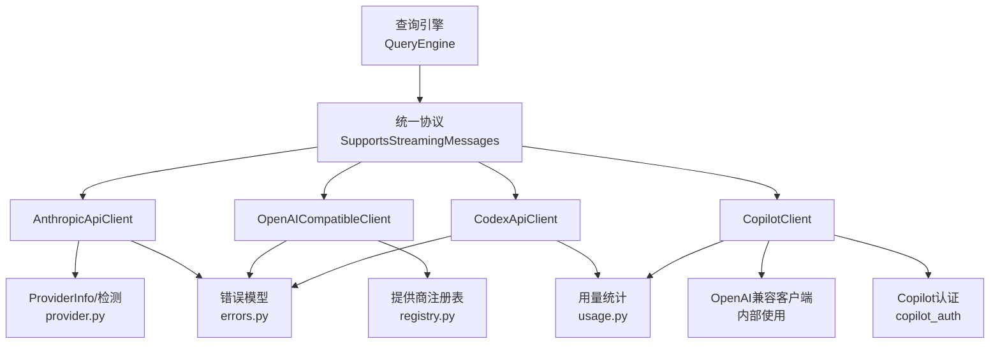
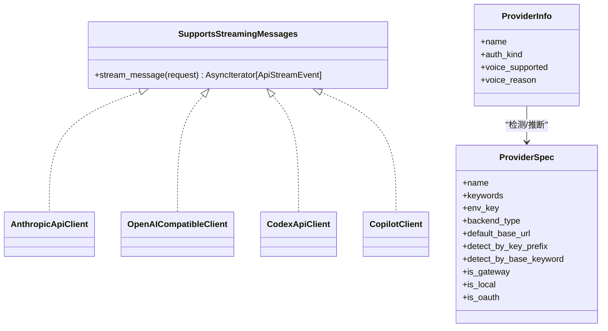
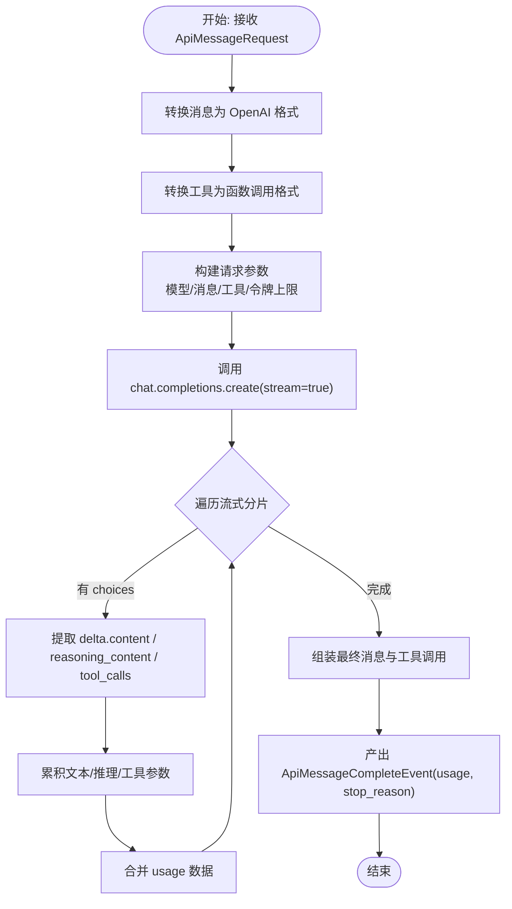
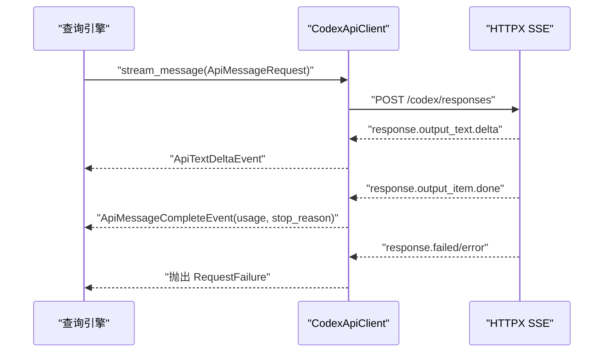
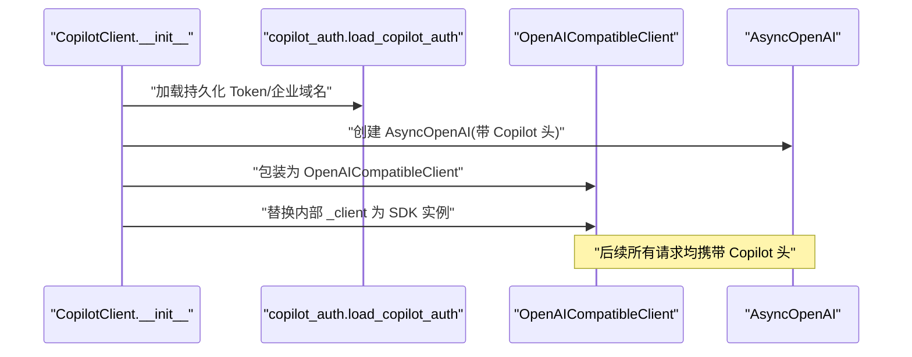
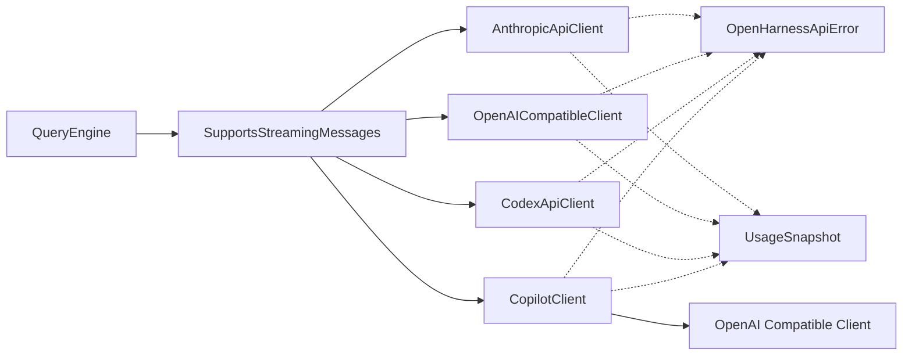

# API客户端

<cite>
**本文档引用的文件**
- [client.py](file://src/openharness/api/client.py)
- [openai_client.py](file://src/openharness/api/openai_client.py)
- [codex_client.py](file://src/openharness/api/codex_client.py)
- [copilot_client.py](file://src/openharness/api/copilot_client.py)
- [copilot_auth.py](file://src/openharness/api/copilot_auth.py)
- [provider.py](file://src/openharness/api/provider.py)
- [registry.py](file://src/openharness/api/registry.py)
- [errors.py](file://src/openharness/api/errors.py)
- [usage.py](file://src/openharness/api/usage.py)
- [manager.py](file://src/openharness/auth/manager.py)
- [query_engine.py](file://src/openharness/engine/query_engine.py)
- [test_client.py](file://tests/test_api/test_client.py)
- [test_openai_client.py](file://tests/test_api/test_openai_client.py)
- [test_codex_client.py](file://tests/test_api/test_codex_client.py)
- [test_copilot_client.py](file://tests/test_api/test_copilot_client.py)
</cite>

## 目录
1. [简介](#简介)
2. [项目结构](#项目结构)
3. [核心组件](#核心组件)
4. [架构总览](#架构总览)
5. [详细组件分析](#详细组件分析)
6. [依赖关系分析](#依赖关系分析)
7. [性能考虑](#性能考虑)
8. [故障排除指南](#故障排除指南)
9. [结论](#结论)
10. [附录](#附录)

## 简介
本文件为 OpenHarness API 客户端系统的全面技术文档，涵盖统一接口设计、提供商抽象与客户端工厂模式，详细说明多提供商支持（Anthropic 兼容 API、OpenAI 兼容 API、Codex 订阅、GitHub Copilot 等），认证机制（API 密钥管理、OAuth 流程、凭据存储），以及错误处理、重试机制、超时配置、流式响应与异步调用模式。同时提供自定义 API 客户端开发指南与使用限制、速率控制、成本估算说明。

## 项目结构
OpenHarness 的 API 客户端位于 `src/openharness/api/` 目录，采用“协议 + 多实现”的架构设计：
- 统一协议：`SupportsStreamingMessages`，确保不同提供商客户端可被查询引擎以一致方式消费。
- 核心客户端：
  - AnthropicApiClient：基于官方异步 SDK 的封装，支持 OAuth 与 Claude 订阅身份信息注入。
  - OpenAICompatibleClient：通用 OpenAI 兼容 API 客户端，负责消息与工具格式转换、流式解析与令牌统计。
  - CodexApiClient：ChatGPT/Codex 订阅响应 API 客户端，支持 SSE 流式事件解析。
  - CopilotClient：GitHub Copilot 客户端，复用 OpenAI 兼容客户端并注入 Copilot 特定头部。
- 认证与提供商检测：
  - Copilot OAuth 设备流程与凭据持久化。
  - ProviderInfo 与 detect_provider 提供提供商能力检测与状态描述。
  - ProviderSpec 注册表用于自动识别提供商类型与默认参数。
- 错误模型与用量统计：统一的错误类型与用量快照模型。
- 查询引擎集成：QueryEngine 通过 SupportsStreamingMessages 协议与任意客户端交互。



图表来源
- [query_engine.py:19-108](file://src/openharness/engine/query_engine.py#L19-L108)
- [client.py:79-84](file://src/openharness/api/client.py#L79-L84)
- [openai_client.py:228-246](file://src/openharness/api/openai_client.py#L228-L246)
- [codex_client.py:212-243](file://src/openharness/api/codex_client.py#L212-L243)
- [copilot_client.py:48-111](file://src/openharness/api/copilot_client.py#L48-L111)
- [provider.py:42-94](file://src/openharness/api/provider.py#L42-L94)
- [registry.py:17-49](file://src/openharness/api/registry.py#L17-L49)
- [usage.py:8-18](file://src/openharness/api/usage.py#L8-L18)
- [errors.py:6-20](file://src/openharness/api/errors.py#L6-L20)

章节来源
- [client.py:1-267](file://src/openharness/api/client.py#L1-L267)
- [openai_client.py:1-449](file://src/openharness/api/openai_client.py#L1-L449)
- [codex_client.py:1-396](file://src/openharness/api/codex_client.py#L1-L396)
- [copilot_client.py:1-131](file://src/openharness/api/copilot_client.py#L1-L131)
- [provider.py:1-187](file://src/openharness/api/provider.py#L1-L187)
- [registry.py:1-438](file://src/openharness/api/registry.py#L1-L438)
- [usage.py:1-18](file://src/openharness/api/usage.py#L1-L18)
- [errors.py:1-20](file://src/openharness/api/errors.py#L1-L20)
- [query_engine.py:1-200](file://src/openharness/engine/query_engine.py#L1-L200)

## 核心组件
- 统一协议与事件模型
  - SupportsStreamingMessages：定义 stream_message(request) -> AsyncIterator[ApiStreamEvent]，保证不同客户端的一致性。
  - ApiMessageRequest：请求参数载体（模型、消息、系统提示、最大令牌数、工具）。
  - ApiTextDeltaEvent / ApiMessageCompleteEvent / ApiRetryEvent：流式事件类型，分别表示增量文本、完整消息与重试事件。
- 错误模型
  - OpenHarnessApiError 基类，派生出 AuthenticationFailure、RateLimitFailure、RequestFailure。
- 用量统计
  - UsageSnapshot：记录输入/输出令牌数与总数。

章节来源
- [client.py:39-76](file://src/openharness/api/client.py#L39-L76)
- [client.py:117-267](file://src/openharness/api/client.py#L117-L267)
- [errors.py:6-20](file://src/openharness/api/errors.py#L6-L20)
- [usage.py:8-18](file://src/openharness/api/usage.py#L8-L18)

## 架构总览
OpenHarness 将“提供商抽象”与“客户端实现”解耦：
- ProviderSpec 注册表：集中管理提供商元数据（名称、关键词、环境变量、默认 Base URL、是否网关/本地/OAuth 等），用于自动识别与路由。
- ProviderInfo：根据设置与注册表推断当前活动提供商及其认证方式与能力。
- 客户端工厂：查询引擎仅依赖 SupportsStreamingMessages 协议，具体客户端由配置选择（Anthropic、OpenAI 兼容、Codex、Copilot）。



图表来源
- [client.py:79-84](file://src/openharness/api/client.py#L79-L84)
- [openai_client.py:228-246](file://src/openharness/api/openai_client.py#L228-L246)
- [codex_client.py:212-243](file://src/openharness/api/codex_client.py#L212-L243)
- [copilot_client.py:48-111](file://src/openharness/api/copilot_client.py#L48-L111)
- [provider.py:32-94](file://src/openharness/api/provider.py#L32-L94)
- [registry.py:17-49](file://src/openharness/api/registry.py#L17-L49)

章节来源
- [provider.py:42-94](file://src/openharness/api/provider.py#L42-L94)
- [registry.py:408-438](file://src/openharness/api/registry.py#L408-L438)

## 详细组件分析

### AnthropicApiClient 分析
- 功能要点
  - 支持 API Key 与 OAuth（含 Claude 订阅）两种认证方式；OAuth 模式下自动注入身份与会话头。
  - 内置指数退避 + 抖动的重试逻辑，自动处理 429/5xx 与网络异常；支持从上游 Retry-After 头调整延迟。
  - 流式响应解析：逐块产出 ApiTextDeltaEvent，最终产出 ApiMessageCompleteEvent 并附带用量与停止原因。
  - 对 Claude OAuth 场景注入 attribution 头与 betas、metadata、extra_headers 等。
- 关键流程（重试与流式）
```mermaid
sequenceDiagram
participant QE as "查询引擎"
participant AC as "AnthropicApiClient"
participant SDK as "AsyncAnthropic"
QE->>AC : "stream_message(ApiMessageRequest)"
loop "最多3次尝试"
AC->>AC : "_refresh_client_auth()"
AC->>SDK : "messages.stream(...)"
SDK-->>AC : "content_block_delta(text_delta)"
AC-->>QE : "ApiTextDeltaEvent"
SDK-->>AC : "final_message"
AC-->>QE : "ApiMessageCompleteEvent(usage, stop_reason)"
AC-->>QE : "结束"
and "异常且可重试"
AC-->>QE : "ApiRetryEvent(延迟)"
AC->>AC : "sleep(指数退避)"
end
```

图表来源
- [client.py:160-197](file://src/openharness/api/client.py#L160-L197)
- [client.py:198-258](file://src/openharness/api/client.py#L198-L258)

章节来源
- [client.py:117-267](file://src/openharness/api/client.py#L117-L267)

### OpenAICompatibleClient 分析
- 功能要点
  - 将内部消息/工具格式转换为 OpenAI 兼容格式，处理系统提示、用户多模态内容、助手工具调用与工具结果消息。
  - 自动区分 max_tokens 与 max_completion_tokens（针对特定模型族）。
  - 流式解析：累积文本增量、工具调用参数、reasoning 内容（剥离<think>块）、usage 数据。
  - 统一错误翻译：401/403 -> 认证失败，429 -> 速率限制，其他 -> 请求失败。
- 转换与流式处理流程


图表来源
- [openai_client.py:279-398](file://src/openharness/api/openai_client.py#L279-L398)

章节来源
- [openai_client.py:228-449](file://src/openharness/api/openai_client.py#L228-L449)
- [test_openai_client.py:1-438](file://tests/test_api/test_openai_client.py#L1-L438)

### CodexApiClient 分析
- 功能要点
  - 通过 ChatGPT/Codex 订阅的后台 API 发送请求，使用 SSE 流式事件。
  - 自动解析 SSE 事件类型：output_text.delta、output_item.done、completed、failed、error。
  - 工具调用与文本输出混合处理，最终生成 UsageSnapshot 与 stop_reason。
  - JWT 解析与账号标识注入，URL 规范化至 /codex/responses。
- 流式事件解析


图表来源
- [codex_client.py:244-344](file://src/openharness/api/codex_client.py#L244-L344)

章节来源
- [codex_client.py:212-396](file://src/openharness/api/codex_client.py#L212-L396)
- [test_codex_client.py:1-242](file://tests/test_api/test_codex_client.py#L1-L242)

### CopilotClient 分析
- 功能要点
  - 使用已保存的 GitHub OAuth Token 直接作为 Bearer Token 调用 Copilot API。
  - 自动选择公共或企业 Copilot API Base URL，并注入 User-Agent 与 OpenAI Intent 头。
  - 复用 OpenAICompatibleClient 进行消息与工具格式转换，仅替换底层 SDK 客户端以应用 Copilot 头部。
- 初始化与委托流程


图表来源
- [copilot_client.py:67-111](file://src/openharness/api/copilot_client.py#L67-L111)

章节来源
- [copilot_client.py:48-131](file://src/openharness/api/copilot_client.py#L48-L131)
- [copilot_auth.py:1-241](file://src/openharness/api/copilot_auth.py#L1-L241)
- [test_copilot_client.py:1-141](file://tests/test_api/test_copilot_client.py#L1-L141)

### 认证与提供商检测
- ProviderSpec 注册表：集中定义提供商名称、关键词、环境变量、默认 Base URL、检测前缀/关键字、是否网关/本地/OAuth 等。
- ProviderInfo：根据设置与注册表推断当前提供商、认证方式与语音支持状态。
- 认证状态：AuthManager 提供统一认证状态查询与切换，支持多种外部绑定与凭据存储后端。

章节来源
- [registry.py:17-368](file://src/openharness/api/registry.py#L17-L368)
- [provider.py:42-127](file://src/openharness/api/provider.py#L42-L127)
- [manager.py:116-184](file://src/openharness/auth/manager.py#L116-L184)

## 依赖关系分析
- 协议与实现解耦：QueryEngine 仅依赖 SupportsStreamingMessages，不关心具体提供商实现。
- 客户端内部依赖：
  - AnthropicApiClient 依赖 anthropic 异步 SDK、OAuth 头构造与会话 ID 获取。
  - OpenAICompatibleClient 依赖 openai SDK，负责格式转换与流式解析。
  - CodexApiClient 依赖 httpx 与 SSE 解析。
  - CopilotClient 依赖 copilot_auth 与 OpenAI 兼容客户端。
- 错误与用量：统一错误模型与用量快照在各客户端中复用。



图表来源
- [query_engine.py:19-108](file://src/openharness/engine/query_engine.py#L19-L108)
- [client.py:117-267](file://src/openharness/api/client.py#L117-L267)
- [openai_client.py:228-449](file://src/openharness/api/openai_client.py#L228-L449)
- [codex_client.py:212-396](file://src/openharness/api/codex_client.py#L212-L396)
- [copilot_client.py:48-131](file://src/openharness/api/copilot_client.py#L48-L131)
- [errors.py:6-20](file://src/openharness/api/errors.py#L6-L20)
- [usage.py:8-18](file://src/openharness/api/usage.py#L8-L18)

章节来源
- [query_engine.py:1-200](file://src/openharness/engine/query_engine.py#L1-L200)
- [client.py:1-267](file://src/openharness/api/client.py#L1-L267)
- [openai_client.py:1-449](file://src/openharness/api/openai_client.py#L1-L449)
- [codex_client.py:1-396](file://src/openharness/api/codex_client.py#L1-L396)
- [copilot_client.py:1-131](file://src/openharness/api/copilot_client.py#L1-L131)

## 性能考虑
- 重试策略
  - 指数退避 + 抖动，最大延迟限制，尊重上游 Retry-After 头。
  - 可重试状态码：429、500、502、503、529；网络连接/超时/OS 错误。
- 流式处理
  - 低延迟增量文本输出，避免等待完整响应；合理缓冲与清理<think>块。
- 超时配置
  - OpenAI 兼容客户端支持传入 timeout 参数；Codex 默认 60 秒；Anthropic 客户端使用 SDK 默认。
- 令牌限制
  - 针对特定模型族使用 max_completion_tokens；其余模型使用 max_tokens。
- 用量统计
  - 各客户端在流式过程中聚合 usage 数据，最终汇总到 UsageSnapshot。

章节来源
- [client.py:31-36](file://src/openharness/api/client.py#L31-L36)
- [client.py:96-114](file://src/openharness/api/client.py#L96-L114)
- [openai_client.py:39-56](file://src/openharness/api/openai_client.py#L39-L56)
- [codex_client.py:25-27](file://src/openharness/api/codex_client.py#L25-L27)

## 故障排除指南
- 常见错误类型
  - 认证失败：401/403，检查 API Key/OAuth Token 是否正确与有效。
  - 速率限制：429，触发重试或降低请求频率。
  - 请求失败：网络/超时/上游错误，检查 Base URL、代理与防火墙。
- 诊断步骤
  - 使用 provider.py 中的 auth_status/detect_provider 输出当前提供商与认证状态。
  - 检查各客户端的错误翻译逻辑，定位具体错误类别。
  - 对 Copilot：确认持久化 Token 与企业域名配置正确。
- 单元测试参考
  - Anthropic：OAuth Beta 头注入、Claude 身份头与会话元数据、令牌刷新。
  - OpenAI：消息/工具格式转换、max_tokens/max_completion_tokens 选择、SSE 流式解析。
  - Codex：SSE 事件解析、JWT 账号解析、错误消息格式化。
  - Copilot：初始化认证、企业域名解析、委托 OpenAI 兼容客户端。

章节来源
- [provider.py:97-127](file://src/openharness/api/provider.py#L97-L127)
- [errors.py:6-20](file://src/openharness/api/errors.py#L6-L20)
- [test_client.py:7-194](file://tests/test_api/test_client.py#L7-L194)
- [test_openai_client.py:1-438](file://tests/test_api/test_openai_client.py#L1-L438)
- [test_codex_client.py:1-242](file://tests/test_api/test_codex_client.py#L1-L242)
- [test_copilot_client.py:1-141](file://tests/test_api/test_copilot_client.py#L1-L141)

## 结论
OpenHarness API 客户端系统通过统一协议与提供商注册表实现了高度可扩展的多提供商支持，结合完善的认证、重试、流式处理与用量统计机制，既满足了生产级稳定性要求，又为自定义客户端扩展提供了清晰的接口与最佳实践路径。

## 附录

### 多提供商支持与配置示例
- Anthropic
  - 认证方式：API Key 或 OAuth（Claude 订阅）。
  - 关键参数：api_key、auth_token、base_url、claude_oauth、auth_token_resolver。
  - 参考：[client.py:120-150](file://src/openharness/api/client.py#L120-L150)
- OpenAI 兼容
  - 认证方式：API Key（Bearer 头）。
  - 关键参数：api_key、base_url、timeout。
  - 参考：[openai_client.py:235-245](file://src/openharness/api/openai_client.py#L235-L245)
- Codex 订阅
  - 认证方式：Codex JWT Token（含 chatgpt_account_id）。
  - 关键参数：auth_token、base_url。
  - 参考：[codex_client.py:215-219](file://src/openharness/api/codex_client.py#L215-L219)
- GitHub Copilot
  - 认证方式：GitHub OAuth Token（Bearer）。
  - 关键参数：github_token、enterprise_url、model。
  - 参考：[copilot_client.py:67-87](file://src/openharness/api/copilot_client.py#L67-L87)

### 认证机制与凭据存储
- ProviderSpec 注册表：集中管理提供商元数据与检测规则。
  - 参考：[registry.py:55-368](file://src/openharness/api/registry.py#L55-L368)
- ProviderInfo：根据设置与注册表推断提供商与认证方式。
  - 参考：[provider.py:42-94](file://src/openharness/api/provider.py#L42-L94)
- Copilot OAuth：设备流程、Token 持久化与加载。
  - 参考：[copilot_auth.py:153-241](file://src/openharness/api/copilot_auth.py#L153-L241)
- 统一认证状态查询：AuthManager 提供认证源状态与切换。
  - 参考：[manager.py:116-184](file://src/openharness/auth/manager.py#L116-L184)

### 错误处理、重试与超时
- 重试策略：指数退避 + 抖动，尊重 Retry-After，最大延迟限制。
  - 参考：[client.py:96-114](file://src/openharness/api/client.py#L96-L114)
- 错误翻译：401/403 -> 认证失败，429 -> 速率限制，其他 -> 请求失败。
  - 参考：[openai_client.py:409-417](file://src/openharness/api/openai_client.py#L409-L417)，[codex_client.py:386-395](file://src/openharness/api/codex_client.py#L386-L395)
- 超时配置：OpenAI 兼容客户端支持 timeout；Codex 默认 60 秒。
  - 参考：[openai_client.py:243-245](file://src/openharness/api/openai_client.py#L243-L245)，[codex_client.py:264-264](file://src/openharness/api/codex_client.py#L264-L264)

### 流式响应与异步调用
- 流式事件：ApiTextDeltaEvent、ApiMessageCompleteEvent、ApiRetryEvent。
  - 参考：[client.py:50-76](file://src/openharness/api/client.py#L50-L76)
- 流式解析：Anthropic（content_block_delta）、OpenAI（choices.delta）、Codex（SSE 事件）。
  - 参考：[client.py:232-257](file://src/openharness/api/client.py#L232-L257)，[openai_client.py:308-398](file://src/openharness/api/openai_client.py#L308-L398)，[codex_client.py:346-371](file://src/openharness/api/codex_client.py#L346-L371)

### 自定义 API 客户端开发指南
- 实现 SupportsStreamingMessages 协议，提供 stream_message(request) -> AsyncIterator[ApiStreamEvent]。
- 明确错误类型映射：认证失败、速率限制、请求失败。
- 支持重试与超时：遵循指数退避策略与最大延迟限制。
- 处理流式事件：按提供商规范解析增量文本、工具调用与用量。
- 参考实现：
  - [client.py:79-84](file://src/openharness/api/client.py#L79-L84)
  - [openai_client.py:228-246](file://src/openharness/api/openai_client.py#L228-L246)
  - [codex_client.py:212-243](file://src/openharness/api/codex_client.py#L212-L243)
  - [copilot_client.py:48-111](file://src/openharness/api/copilot_client.py#L48-L111)

### 使用限制、速率控制与成本估算
- 速率控制
  - 依据上游返回的 Retry-After 头动态调整延迟；默认重试码：429、500、502、503、529。
  - 参考：[client.py:101-114](file://src/openharness/api/client.py#L101-L114)
- 成本估算
  - 各客户端在流式过程中收集 input_tokens/output_tokens，最终汇总到 UsageSnapshot。
  - 参考：[usage.py:8-18](file://src/openharness/api/usage.py#L8-L18)，[openai_client.py:391-398](file://src/openharness/api/openai_client.py#L391-L398)，[codex_client.py:334-344](file://src/openharness/api/codex_client.py#L334-L344)