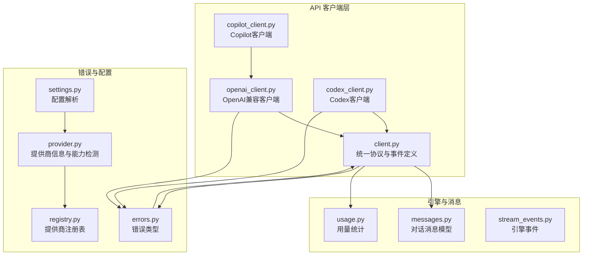
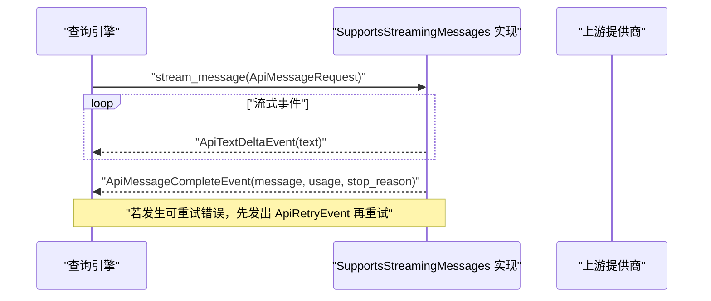
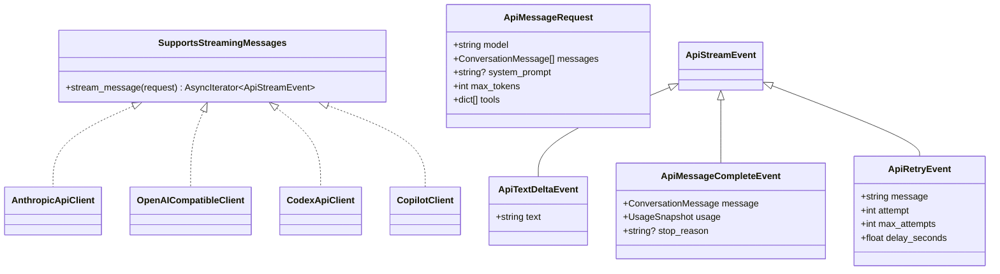
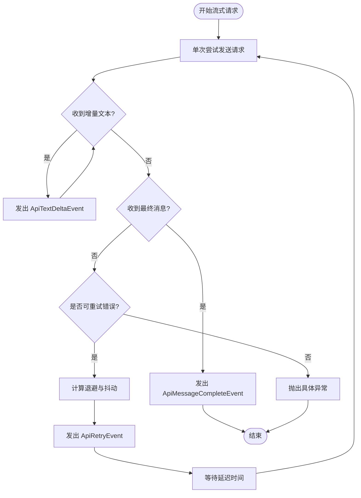
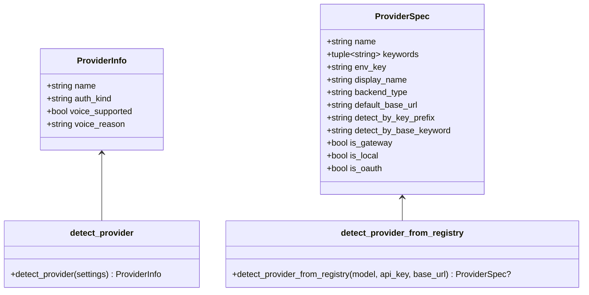
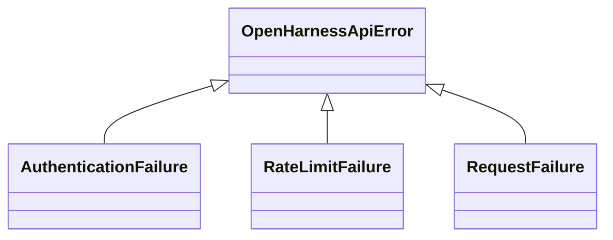
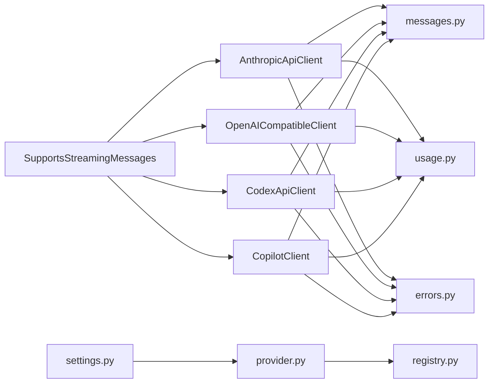

# API客户端架构

<cite>
**本文引用的文件**
- [client.py](file://src/openharness/api/client.py)
- [openai_client.py](file://src/openharness/api/openai_client.py)
- [codex_client.py](file://src/openharness/api/codex_client.py)
- [copilot_client.py](file://src/openharness/api/copilot_client.py)
- [errors.py](file://src/openharness/api/errors.py)
- [provider.py](file://src/openharness/api/provider.py)
- [registry.py](file://src/openharness/api/registry.py)
- [messages.py](file://src/openharness/engine/messages.py)
- [usage.py](file://src/openharness/api/usage.py)
- [stream_events.py](file://src/openharness/engine/stream_events.py)
- [settings.py](file://src/openharness/config/settings.py)
- [test_client.py](file://tests/test_api/test_client.py)
- [test_openai_client.py](file://tests/test_api/test_openai_client.py)
- [test_codex_client.py](file://tests/test_api/test_codex_client.py)
</cite>

## 目录
1. [简介](#简介)
2. [项目结构](#项目结构)
3. [核心组件](#核心组件)
4. [架构总览](#架构总览)
5. [详细组件分析](#详细组件分析)
6. [依赖分析](#依赖分析)
7. [性能考虑](#性能考虑)
8. [故障排查指南](#故障排查指南)
9. [结论](#结论)
10. [附录](#附录)

## 简介
本文件系统化梳理 OpenHarness 的统一 API 客户端架构，重点覆盖以下方面：
- 统一 API 客户端接口设计：SupportsStreamingMessages 协议与 ApiMessageRequest 数据结构
- 流式事件模型：ApiTextDeltaEvent、ApiMessageCompleteEvent、ApiRetryEvent 的用途与传递机制
- 客户端工厂模式与提供商抽象层：多后端（Anthropic、OpenAI 兼容、Codex、Copilot）的统一接入
- 错误处理架构：OpenHarnessApiError 基类与特定异常类型的分类映射
- 客户端初始化配置与参数传递最佳实践
- 异步流式处理实现细节与性能优化建议

## 项目结构
OpenHarness 的 API 客户端位于 src/openharness/api 目录，围绕统一协议与事件模型构建，同时通过 provider/registry 模块实现对多提供商的抽象与检测。

图表来源
- [client.py:1-267](file://src/openharness/api/client.py#L1-L267)
- [openai_client.py:1-449](file://src/openharness/api/openai_client.py#L1-L449)
- [codex_client.py:1-396](file://src/openharness/api/codex_client.py#L1-L396)
- [copilot_client.py:1-131](file://src/openharness/api/copilot_client.py#L1-L131)
- [errors.py:1-20](file://src/openharness/api/errors.py#L1-L20)
- [provider.py:1-187](file://src/openharness/api/provider.py#L1-L187)
- [registry.py:1-438](file://src/openharness/api/registry.py#L1-L438)
- [messages.py:1-222](file://src/openharness/engine/messages.py#L1-L222)
- [usage.py:1-18](file://src/openharness/api/usage.py#L1-L18)
- [stream_events.py:1-90](file://src/openharness/engine/stream_events.py#L1-L90)
- [settings.py:1-965](file://src/openharness/config/settings.py#L1-L965)

章节来源
- [client.py:1-267](file://src/openharness/api/client.py#L1-L267)
- [openai_client.py:1-449](file://src/openharness/api/openai_client.py#L1-L449)
- [codex_client.py:1-396](file://src/openharness/api/codex_client.py#L1-L396)
- [copilot_client.py:1-131](file://src/openharness/api/copilot_client.py#L1-L131)
- [errors.py:1-20](file://src/openharness/api/errors.py#L1-L20)
- [provider.py:1-187](file://src/openharness/api/provider.py#L1-L187)
- [registry.py:1-438](file://src/openharness/api/registry.py#L1-L438)
- [messages.py:1-222](file://src/openharness/engine/messages.py#L1-L222)
- [usage.py:1-18](file://src/openharness/api/usage.py#L1-L18)
- [stream_events.py:1-90](file://src/openharness/engine/stream_events.py#L1-L90)
- [settings.py:1-965](file://src/openharness/config/settings.py#L1-L965)

## 核心组件
- 统一协议与事件模型
  - SupportsStreamingMessages 协议：定义 stream_message(ApiMessageRequest) -> AsyncIterator[ApiStreamEvent] 的统一接口
  - ApiMessageRequest：请求输入参数，包含 model、messages、system_prompt、max_tokens、tools
  - ApiStreamEvent 联合类型：ApiTextDeltaEvent | ApiMessageCompleteEvent | ApiRetryEvent
  - ApiTextDeltaEvent：增量文本事件
  - ApiMessageCompleteEvent：最终完整消息事件，携带用量与停止原因
  - ApiRetryEvent：可恢复上游失败的重试事件
- 多客户端实现
  - AnthropicApiClient：基于官方 SDK 的流式实现，支持 OAuth 与会话标识头
  - OpenAICompatibleClient：通用 OpenAI 兼容接口，支持多模型 token 参数差异与 thinking 模型的 reasoning_content 处理
  - CodexApiClient：ChatGPT/Codex 订阅响应流式客户端，基于 SSE
  - CopilotClient：在 OpenAI 兼容客户端基础上注入 Copilot 特定头部
- 错误体系
  - OpenHarnessApiError 基类
  - AuthenticationFailure、RateLimitFailure、RequestFailure 子类
- 提供商抽象
  - ProviderInfo：名称、认证方式、语音能力等元信息
  - detect_provider：根据配置与注册表推断当前提供商
  - ProviderSpec/registry：提供商注册表与匹配逻辑
- 消息与用量
  - ConversationMessage、ContentBlock（Text/Image/ToolUse/ToolResult）
  - UsageSnapshot：输入/输出 token 统计

章节来源
- [client.py:39-77](file://src/openharness/api/client.py#L39-L77)
- [client.py:79-84](file://src/openharness/api/client.py#L79-L84)
- [client.py:117-267](file://src/openharness/api/client.py#L117-L267)
- [openai_client.py:228-449](file://src/openharness/api/openai_client.py#L228-L449)
- [codex_client.py:212-396](file://src/openharness/api/codex_client.py#L212-L396)
- [copilot_client.py:48-131](file://src/openharness/api/copilot_client.py#L48-L131)
- [errors.py:6-20](file://src/openharness/api/errors.py#L6-L20)
- [provider.py:32-94](file://src/openharness/api/provider.py#L32-L94)
- [registry.py:17-49](file://src/openharness/api/registry.py#L17-L49)
- [messages.py:64-116](file://src/openharness/engine/messages.py#L64-L116)
- [usage.py:8-18](file://src/openharness/api/usage.py#L8-L18)

## 架构总览
统一协议确保不同提供商的客户端可被查询引擎以一致方式消费；事件模型将流式增量文本、最终消息与重试通知解耦为独立事件，便于上层 UI 与业务逻辑处理。

图表来源
- [client.py:160-197](file://src/openharness/api/client.py#L160-L197)
- [openai_client.py:247-278](file://src/openharness/api/openai_client.py#L247-L278)
- [codex_client.py:220-242](file://src/openharness/api/codex_client.py#L220-L242)

## 详细组件分析

### 统一协议与事件模型
- SupportsStreamingMessages 协议
  - 作用：屏蔽底层提供商差异，统一返回 ApiStreamEvent 序列
  - 返回值：AsyncIterator[ApiStreamEvent]，保证异步流式消费
- ApiMessageRequest
  - 字段：model、messages（ConversationMessage 列表）、system_prompt、max_tokens、tools
  - 语义：承载一次模型调用的完整输入
- ApiStreamEvent 三事件
  - ApiTextDeltaEvent：用于 UI 实时渲染文本增量
  - ApiMessageCompleteEvent：一次性返回完整消息与用量统计
  - ApiRetryEvent：在可重试错误时发出，包含尝试次数与延迟信息

图表来源
- [client.py:79-84](file://src/openharness/api/client.py#L79-L84)
- [client.py:39-77](file://src/openharness/api/client.py#L39-L77)
- [client.py:117-267](file://src/openharness/api/client.py#L117-L267)
- [openai_client.py:228-449](file://src/openharness/api/openai_client.py#L228-L449)
- [codex_client.py:212-396](file://src/openharness/api/codex_client.py#L212-L396)
- [copilot_client.py:48-131](file://src/openharness/api/copilot_client.py#L48-L131)

章节来源
- [client.py:39-84](file://src/openharness/api/client.py#L39-L84)
- [client.py:117-197](file://src/openharness/api/client.py#L117-L197)
- [openai_client.py:228-278](file://src/openharness/api/openai_client.py#L228-L278)
- [codex_client.py:212-242](file://src/openharness/api/codex_client.py#L212-L242)
- [copilot_client.py:48-131](file://src/openharness/api/copilot_client.py#L48-L131)

### 流式事件传递机制
- 文本增量 ApiTextDeltaEvent
  - Anthropic：从 SDK 事件中提取 content_block_delta/delta/text_delta
  - OpenAI 兼容：从流式 chunk 中提取 delta.content 并剥离 thinking 区块
  - Codex：从 SSE 事件中解析 response.output_text.delta
- 最终消息与用量 ApiMessageCompleteEvent
  - Anthropic：从 SDK 的最终消息对象转换为 ConversationMessage，并收集 usage
  - OpenAI 兼容：聚合已接收的文本与工具调用，构造最终消息与用量
  - Codex：从 response.completed 事件解析完成状态与用量
- 可恢复错误 ApiRetryEvent
  - 在指数退避与抖动后发出，包含尝试次数与延迟秒数，随后等待再试

图表来源
- [client.py:160-197](file://src/openharness/api/client.py#L160-L197)
- [openai_client.py:279-398](file://src/openharness/api/openai_client.py#L279-L398)
- [codex_client.py:244-344](file://src/openharness/api/codex_client.py#L244-L344)

章节来源
- [client.py:160-257](file://src/openharness/api/client.py#L160-L257)
- [openai_client.py:279-398](file://src/openharness/api/openai_client.py#L279-L398)
- [codex_client.py:244-344](file://src/openharness/api/codex_client.py#L244-L344)

### 客户端工厂模式与提供商抽象层
- 抽象层
  - SupportsStreamingMessages 协议作为“工厂”产出的统一接口
  - ProviderInfo/detect_provider：根据配置与注册表推断提供商与认证方式
  - ProviderSpec/registry：集中管理提供商元数据与匹配规则
- 工厂模式
  - 查询引擎不直接依赖具体客户端，而是通过协议与配置选择合适的实现
  - CopilotClient 通过组合 OpenAICompatibleClient 并注入特定头部，体现“装饰器式工厂”

图表来源
- [provider.py:32-94](file://src/openharness/api/provider.py#L32-L94)
- [registry.py:17-49](file://src/openharness/api/registry.py#L17-L49)
- [registry.py:408-437](file://src/openharness/api/registry.py#L408-L437)

章节来源
- [provider.py:42-94](file://src/openharness/api/provider.py#L42-L94)
- [registry.py:55-368](file://src/openharness/api/registry.py#L55-L368)
- [registry.py:408-437](file://src/openharness/api/registry.py#L408-L437)

### 错误处理架构
- OpenHarnessApiError 基类
- 子类映射
  - AuthenticationFailure：认证失败（如 401/403）
  - RateLimitFailure：速率限制（如 429）
  - RequestFailure：通用请求或传输失败
- 客户端内部翻译
  - AnthropicApiClient：将上游 APIError 映射到子类
  - OpenAICompatibleClient：根据状态码映射
  - CodexApiClient：基于 HTTP 状态码与 SSE 错误事件映射

图表来源
- [errors.py:6-20](file://src/openharness/api/errors.py#L6-L20)
- [client.py:260-267](file://src/openharness/api/client.py#L260-L267)
- [openai_client.py:409-417](file://src/openharness/api/openai_client.py#L409-L417)
- [codex_client.py:204-209](file://src/openharness/api/codex_client.py#L204-L209)

章节来源
- [errors.py:6-20](file://src/openharness/api/errors.py#L6-L20)
- [client.py:260-267](file://src/openharness/api/client.py#L260-L267)
- [openai_client.py:409-417](file://src/openharness/api/openai_client.py#L409-L417)
- [codex_client.py:204-209](file://src/openharness/api/codex_client.py#L204-L209)

### 客户端初始化配置与参数传递最佳实践
- 配置来源与优先级
  - Settings：提供统一配置模型，含 api_key、model、base_url、timeout、api_format、provider 等字段
  - 解析顺序：实例值 > 环境变量 > 配置文件 > 默认值
  - 认证解析：resolve_auth/resolve_api_key 支持多种外部绑定与环境变量
- 客户端参数传递
  - AnthropicApiClient：支持 api_key、auth_token、base_url、claude_oauth、auth_token_resolver
  - OpenAICompatibleClient：api_key、base_url、timeout
  - CodexApiClient：auth_token、base_url
  - CopilotClient：github_token、enterprise_url、model
- 最佳实践
  - 使用 ProviderInfo/detect_provider 推断当前提供商，避免硬编码
  - 将认证凭据通过 resolve_auth 获取，确保外部绑定与刷新逻辑生效
  - 对 OpenAI 兼容模型，按模型前缀自动选择 max_tokens 或 max_completion_tokens
  - 对 thinking 模型，注意 reasoning_content 的处理与流式剥离

章节来源
- [settings.py:496-800](file://src/openharness/config/settings.py#L496-L800)
- [client.py:120-159](file://src/openharness/api/client.py#L120-L159)
- [openai_client.py:235-245](file://src/openharness/api/openai_client.py#L235-L245)
- [codex_client.py:215-218](file://src/openharness/api/codex_client.py#L215-L218)
- [copilot_client.py:67-110](file://src/openharness/api/copilot_client.py#L67-L110)
- [openai_client.py:45-56](file://src/openharness/api/openai_client.py#L45-L56)

### 异步流式处理实现细节与性能优化
- 异步流式
  - 所有客户端均采用 async/await 与 AsyncIterator，确保高并发下的低阻塞
  - OpenAI 兼容客户端在工具调用场景下移除 stream_options，避免触发模型侧思考模式
- 重试策略
  - 指数退避 + 抖动，最大延迟上限控制
  - 优先检查 Retry-After 头部，其次使用默认退避
- 文本剥离
  - OpenAI 兼容客户端对 thinking 区块进行跨 chunk 缓冲与剥离，保证用户可见文本纯净
- 性能建议
  - 合理设置 max_tokens/max_completion_tokens，减少不必要的 token 消耗
  - 使用 base_url 规范化，避免重复路径拼接带来的额外开销
  - 在 Copilot/OAuth 场景下，尽量复用已建立的连接与令牌，减少握手成本

章节来源
- [client.py:97-114](file://src/openharness/api/client.py#L97-L114)
- [openai_client.py:289-297](file://src/openharness/api/openai_client.py#L289-L297)
- [openai_client.py:425-449](file://src/openharness/api/openai_client.py#L425-L449)
- [openai_client.py:212-226](file://src/openharness/api/openai_client.py#L212-L226)

## 依赖分析
- 协议与事件
  - SupportsStreamingMessages 由四个客户端实现，统一事件类型 ApiStreamEvent
- 消息与用量
  - ConversationMessage/ContentBlock 由 engine/messages 提供，所有客户端在最终消息构造中使用
  - UsageSnapshot 由 api/usage 提供，用于记录输入/输出 token
- 错误体系
  - 四个客户端均依赖 api/errors 进行异常分类与翻译
- 提供商检测
  - provider.py 依赖 registry.py 进行提供商匹配
  - settings.py 通过 resolve_auth/resolve_api_key 与外部认证系统交互

图表来源
- [client.py:79-84](file://src/openharness/api/client.py#L79-L84)
- [client.py:117-267](file://src/openharness/api/client.py#L117-L267)
- [openai_client.py:228-449](file://src/openharness/api/openai_client.py#L228-L449)
- [codex_client.py:212-396](file://src/openharness/api/codex_client.py#L212-L396)
- [copilot_client.py:48-131](file://src/openharness/api/copilot_client.py#L48-L131)
- [messages.py:64-116](file://src/openharness/engine/messages.py#L64-L116)
- [usage.py:8-18](file://src/openharness/api/usage.py#L8-L18)
- [errors.py:6-20](file://src/openharness/api/errors.py#L6-L20)
- [provider.py:42-94](file://src/openharness/api/provider.py#L42-L94)
- [registry.py:408-437](file://src/openharness/api/registry.py#L408-L437)
- [settings.py:683-791](file://src/openharness/config/settings.py#L683-L791)

章节来源
- [client.py:79-267](file://src/openharness/api/client.py#L79-L267)
- [openai_client.py:228-449](file://src/openharness/api/openai_client.py#L228-L449)
- [codex_client.py:212-396](file://src/openharness/api/codex_client.py#L212-L396)
- [copilot_client.py:48-131](file://src/openharness/api/copilot_client.py#L48-L131)
- [messages.py:64-222](file://src/openharness/engine/messages.py#L64-L222)
- [usage.py:8-18](file://src/openharness/api/usage.py#L8-L18)
- [errors.py:6-20](file://src/openharness/api/errors.py#L6-L20)
- [provider.py:42-94](file://src/openharness/api/provider.py#L42-L94)
- [registry.py:408-437](file://src/openharness/api/registry.py#L408-L437)
- [settings.py:683-791](file://src/openharness/config/settings.py#L683-L791)

## 性能考虑
- 流式处理
  - 优先使用增量事件进行 UI 渲染，降低首屏延迟
  - 对 thinking 模型的 reasoning 内容进行剥离，减少用户感知的噪声
- 重试与退避
  - 合理设置最大重试次数与最大延迟，避免雪崩效应
  - 优先读取上游 Retry-After 头部，提升恢复速度
- 请求参数
  - 根据模型前缀自动选择 max_tokens/max_completion_tokens，避免无效参数导致的错误重试
  - 对 OpenAI 兼容接口，必要时移除 stream_options 以避免触发模型侧特殊行为

## 故障排查指南
- 认证失败
  - 检查 resolve_auth 是否正确加载外部绑定与令牌刷新
  - 确认 ProviderInfo.auth_kind 与实际提供商匹配
- 速率限制
  - 观察 ApiRetryEvent 的延迟与尝试次数，确认是否达到上限
  - 检查上游返回的 Retry-After 头部
- 文本显示异常
  - 对 OpenAI 兼容客户端，确认 thinking 区块剥离逻辑未被禁用
- SSE 流异常（Codex）
  - 检查 SSE 事件类型与 payload 结构，确保错误事件被正确解析

章节来源
- [errors.py:10-19](file://src/openharness/api/errors.py#L10-L19)
- [client.py:160-197](file://src/openharness/api/client.py#L160-L197)
- [openai_client.py:425-449](file://src/openharness/api/openai_client.py#L425-L449)
- [codex_client.py:346-372](file://src/openharness/api/codex_client.py#L346-L372)

## 结论
OpenHarness 的 API 客户端架构通过统一协议与事件模型，实现了对多提供商的无缝抽象；配合完善的错误分类与重试策略，既保证了稳定性，又兼顾了性能与可维护性。借助 ProviderSpec/registry 与 ProviderInfo/detect_provider，系统能够自动识别与适配不同提供商，为上层查询引擎与 UI 提供一致的交互体验。

## 附录
- 单元测试参考
  - Anthropic 客户端：OAuth 头注入、图像序列化、令牌刷新
  - OpenAI 兼容客户端：工具与消息格式转换、thinking 区块剥离、URL 规范化
  - Codex 客户端：SSE 事件解析、工具调用与用量统计

章节来源
- [test_client.py:7-194](file://tests/test_api/test_client.py#L7-L194)
- [test_openai_client.py:29-438](file://tests/test_api/test_openai_client.py#L29-L438)
- [test_codex_client.py:69-242](file://tests/test_api/test_codex_client.py#L69-L242)