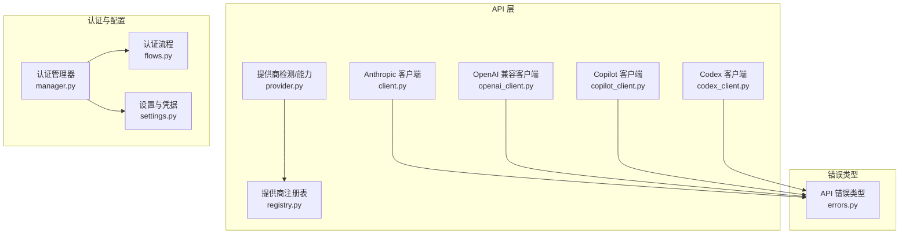
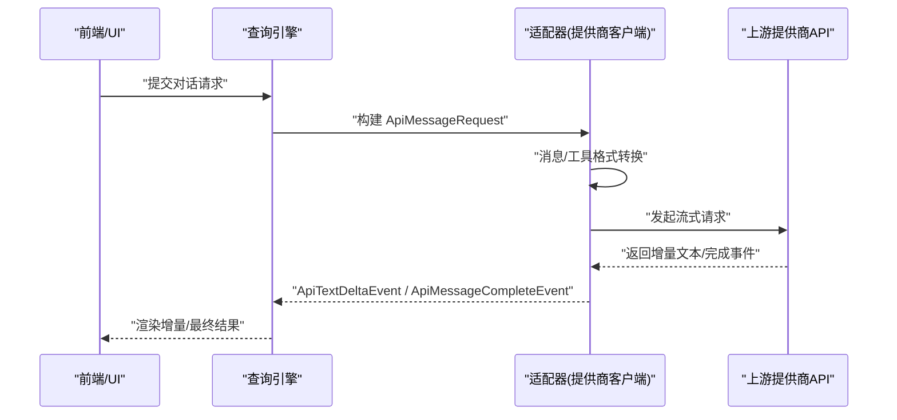
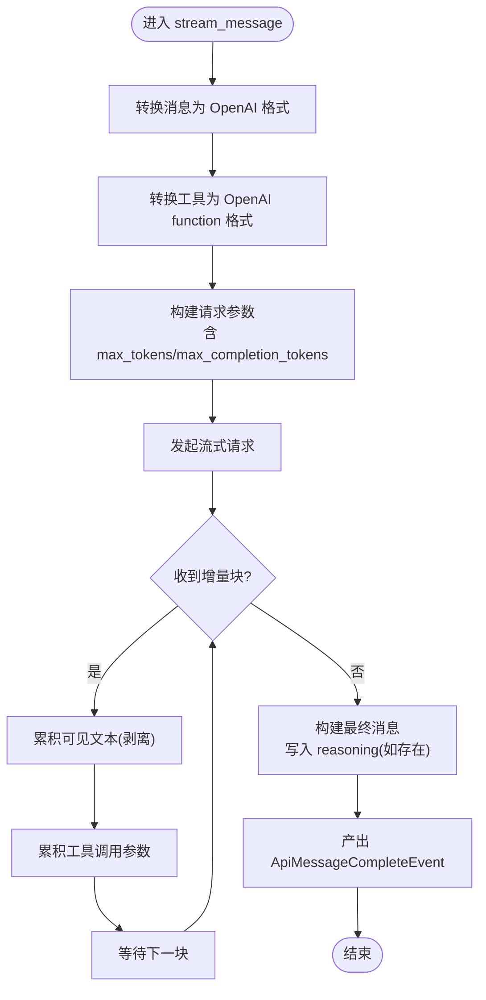
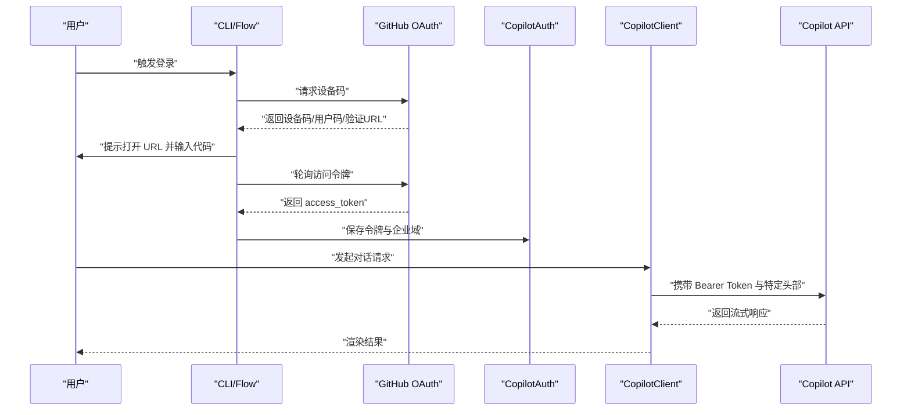
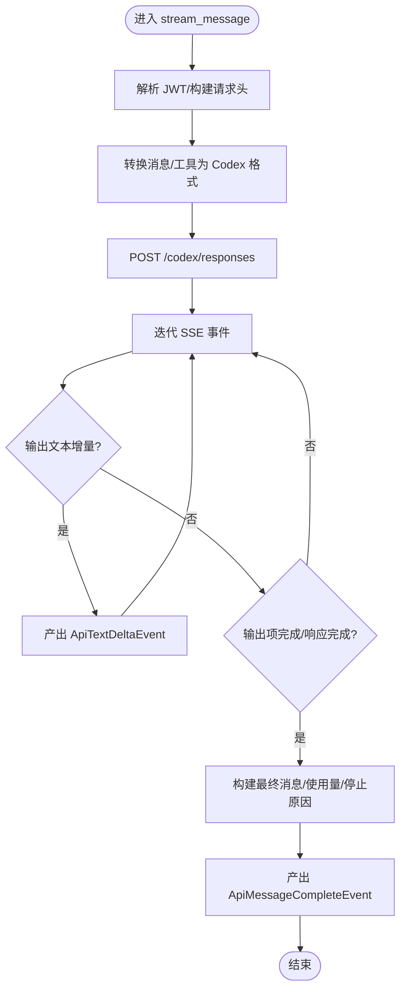
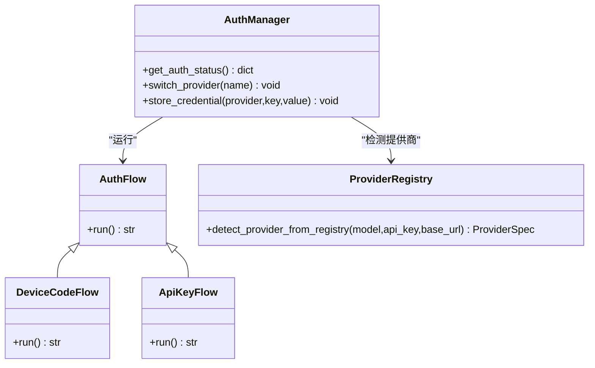
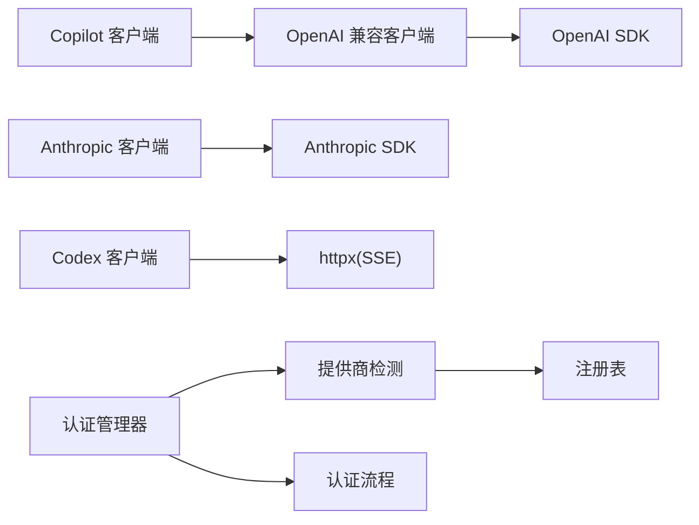

# 多提供商支持

<cite>
**本文引用的文件**
- [provider.py](file://src/openharness/api/provider.py)
- [client.py](file://src/openharness/api/client.py)
- [openai_client.py](file://src/openharness/api/openai_client.py)
- [codex_client.py](file://src/openharness/api/codex_client.py)
- [copilot_client.py](file://src/openharness/api/copilot_client.py)
- [copilot_auth.py](file://src/openharness/api/copilot_auth.py)
- [registry.py](file://src/openharness/api/registry.py)
- [errors.py](file://src/openharness/api/errors.py)
- [flows.py](file://src/openharness/auth/flows.py)
- [manager.py](file://src/openharness/auth/manager.py)
- [settings.py](file://src/openharness/config/settings.py)
- [test_openai_client.py](file://tests/test_api/test_openai_client.py)
- [test_copilot_client.py](file://tests/test_api/test_copilot_client.py)
- [test_codex_client.py](file://tests/test_api/test_codex_client.py)
</cite>

## 目录
1. [简介](#简介)
2. [项目结构](#项目结构)
3. [核心组件](#核心组件)
4. [架构总览](#架构总览)
5. [详细组件分析](#详细组件分析)
6. [依赖分析](#依赖分析)
7. [性能考量](#性能考量)
8. [故障排查指南](#故障排查指南)
9. [结论](#结论)
10. [附录](#附录)

## 简介
本文件面向多提供商支持系统，围绕以下目标展开：  
- OpenAI 兼容 API 客户端实现与 GPT 模型支持、函数调用与工具集成  
- GitHub Codex 订阅客户端的配置与使用  
- GitHub Copilot 客户端的认证流程与 API 调用模式  
- 各提供商配置参数对比与迁移指南  
- 提供商选择策略与负载均衡考虑  
- 跨提供商的统一接口封装与兼容性处理  
- 故障转移与降级策略实现方案  

该系统通过统一的协议与消息模型，屏蔽不同提供商的差异，为上层查询引擎与前端交互提供一致的体验。

## 项目结构
多提供商支持主要集中在以下模块：
- API 层：提供统一的流式消息协议与各提供商客户端（Anthropic、OpenAI 兼容、GitHub Copilot、GitHub Codex）
- 认证与配置：提供认证流程、凭据管理、配置解析与提供商注册表
- 测试：覆盖消息格式转换、URL 规范化、流式事件解析等关键逻辑

图表来源
- [client.py:117-267](file://src/openharness/api/client.py#L117-L267)
- [openai_client.py:228-449](file://src/openharness/api/openai_client.py#L228-L449)
- [copilot_client.py:48-131](file://src/openharness/api/copilot_client.py#L48-L131)
- [codex_client.py:212-396](file://src/openharness/api/codex_client.py#L212-L396)
- [provider.py:42-94](file://src/openharness/api/provider.py#L42-L94)
- [registry.py:17-368](file://src/openharness/api/registry.py#L17-L368)
- [flows.py:21-190](file://src/openharness/auth/flows.py#L21-L190)
- [manager.py:71-483](file://src/openharness/auth/manager.py#L71-L483)
- [errors.py:6-20](file://src/openharness/api/errors.py#L6-L20)

章节来源
- [provider.py:1-187](file://src/openharness/api/provider.py#L1-L187)
- [registry.py:1-438](file://src/openharness/api/registry.py#L1-L438)

## 核心组件
- 统一流式消息协议与事件类型：定义请求、文本增量、完整消息、重试事件等，确保各提供商客户端遵循相同接口
- Anthropic 客户端：封装异步 SDK，支持重试、OAuth 2025 Beta、会话元数据与使用量统计
- OpenAI 兼容客户端：统一消息与工具格式转换、流式解析、令牌限制参数适配、思维模型推理内容剥离
- GitHub Copilot 客户端：基于 OpenAI 兼容客户端，注入 Copilot 特定头部与企业域支持
- GitHub Codex 客户端：基于 SSE 的响应流，支持图片输入、工具调用、使用量统计与状态判断
- 认证与配置：设备码流程、凭据存储、提供商注册表与自动检测、统一状态展示

章节来源
- [client.py:39-267](file://src/openharness/api/client.py#L39-L267)
- [openai_client.py:228-449](file://src/openharness/api/openai_client.py#L228-L449)
- [copilot_client.py:48-131](file://src/openharness/api/copilot_client.py#L48-L131)
- [codex_client.py:212-396](file://src/openharness/api/codex_client.py#L212-L396)
- [flows.py:55-159](file://src/openharness/auth/flows.py#L55-L159)
- [manager.py:71-483](file://src/openharness/auth/manager.py#L71-L483)
- [errors.py:6-20](file://src/openharness/api/errors.py#L6-L20)

## 架构总览
系统采用“统一协议 + 多提供商适配器”的分层设计：
- 协议层：ApiMessageRequest/ApiStreamEvent 抽象消息与事件
- 适配层：各提供商客户端实现流式消息协议
- 适配层之上：查询引擎与 UI 使用统一接口
- 配置与认证：注册表与凭据管理贯穿适配层

图表来源
- [client.py:160-257](file://src/openharness/api/client.py#L160-L257)
- [openai_client.py:247-398](file://src/openharness/api/openai_client.py#L247-L398)
- [codex_client.py:220-344](file://src/openharness/api/codex_client.py#L220-L344)
- [copilot_client.py:112-130](file://src/openharness/api/copilot_client.py#L112-L130)

## 详细组件分析

### OpenAI 兼容客户端（GPT 模型、函数调用与工具集成）
- 功能要点
  - 消息格式转换：将内部 ConversationMessage 转换为 OpenAI chat 格式；工具调用在助手消息中以 tool_calls 表示；用户消息中的工具结果映射为独立的 tool 角色消息
  - 工具格式转换：将 Anthropic 工具 schema 转为 OpenAI function 类型
  - 令牌限制参数：针对 GPT-5/o1/o3/o4 系列使用 max_completion_tokens，其他模型使用 max_tokens
  - 思维模型兼容：从 reasoning_content 中收集推理内容并在后续回传时复原
  - 流式解析：逐块解析 delta，剥离 <think>…</think> 块，聚合工具调用参数
  - 重试与错误翻译：根据状态码分类认证失败、限流与通用请求失败
- 关键路径
  - 请求构建与发送：[openai_client.py:279-308](file://src/openharness/api/openai_client.py#L279-L308)
  - 文本增量与工具聚合：[openai_client.py:309-383](file://src/openharness/api/openai_client.py#L309-L383)
  - 错误翻译与重试：[openai_client.py:400-417](file://src/openharness/api/openai_client.py#L400-L417)

图表来源
- [openai_client.py:279-398](file://src/openharness/api/openai_client.py#L279-L398)

章节来源
- [openai_client.py:228-449](file://src/openharness/api/openai_client.py#L228-L449)
- [test_openai_client.py:1-438](file://tests/test_api/test_openai_client.py#L1-L438)

### GitHub Copilot 客户端（认证与 API 调用）
- 认证流程
  - 设备码流程：请求设备码、打开浏览器、轮询访问令牌；支持公共 GitHub 与企业域
  - 凭据持久化：保存到配置目录下的 copilot_auth.json
- API 调用
  - 直接使用 GitHub OAuth Token 作为 Bearer，无需二次交换
  - 注入特定头部（User-Agent、Openai-Intent）与企业域 API Base
  - 将默认模型与请求模型进行协商（若构造时指定默认模型）
- 关键路径
  - 设备码与轮询：[copilot_auth.py:153-240](file://src/openharness/api/copilot_auth.py#L153-L240)
  - 客户端初始化与头部注入：[copilot_client.py:67-110](file://src/openharness/api/copilot_client.py#L67-L110)
  - 流式转发：[copilot_client.py:112-130](file://src/openharness/api/copilot_client.py#L112-L130)

图表来源
- [copilot_auth.py:153-240](file://src/openharness/api/copilot_auth.py#L153-L240)
- [copilot_client.py:67-130](file://src/openharness/api/copilot_client.py#L67-L130)

章节来源
- [copilot_auth.py:1-241](file://src/openharness/api/copilot_auth.py#L1-L241)
- [copilot_client.py:1-131](file://src/openharness/api/copilot_client.py#L1-L131)
- [test_copilot_client.py:1-141](file://tests/test_api/test_copilot_client.py#L1-L141)

### GitHub Codex 客户端（订阅式响应流）
- 功能要点
  - 基于 SSE 的响应流，事件类型包括输出文本增量、输出项完成、响应完成/失败
  - 支持图片输入（data URL）、工具调用与工具结果
  - 使用 JWT 解析 chatgpt_account_id，注入账户头信息
  - 响应完成后计算使用量与停止原因（包含工具调用场景）
- 关键路径
  - URL 规范化与头部构建：[codex_client.py:49-74](file://src/openharness/api/codex_client.py#L49-L74)
  - 消息与工具转换：[codex_client.py:77-133](file://src/openharness/api/codex_client.py#L77-L133)
  - SSE 事件迭代与错误格式化：[codex_client.py:346-395](file://src/openharness/api/codex_client.py#L346-L395)

图表来源
- [codex_client.py:220-344](file://src/openharness/api/codex_client.py#L220-L344)

章节来源
- [codex_client.py:1-396](file://src/openharness/api/codex_client.py#L1-L396)
- [test_codex_client.py:1-242](file://tests/test_api/test_codex_client.py#L1-L242)

### 认证与配置（统一管理与提供商检测）
- 认证流程
  - 设备码流程：封装为 AuthFlow，支持浏览器打开与进度回调
  - API Key 流程：直接提示输入并持久化
- 认证管理器
  - 列举与切换配置文件中的提供商配置
  - 查询各认证源状态（环境变量、文件、外部绑定等）
  - 更新/删除配置文件中的凭据
- 提供商检测与注册
  - 通过关键字、前缀与 base_url 关键词匹配提供商
  - 自动推断当前活跃提供商与能力（语音支持等）

图表来源
- [flows.py:21-190](file://src/openharness/auth/flows.py#L21-L190)
- [manager.py:71-483](file://src/openharness/auth/manager.py#L71-L483)
- [registry.py:408-437](file://src/openharness/api/registry.py#L408-L437)

章节来源
- [flows.py:1-190](file://src/openharness/auth/flows.py#L1-L190)
- [manager.py:1-483](file://src/openharness/auth/manager.py#L1-L483)
- [registry.py:1-438](file://src/openharness/api/registry.py#L1-L438)
- [provider.py:42-187](file://src/openharness/api/provider.py#L42-L187)
- [settings.py:109-132](file://src/openharness/config/settings.py#L109-L132)

## 依赖分析
- 组件耦合
  - OpenAI 兼容客户端与 Anthropic 客户端共享统一协议，便于替换
  - Copilot 客户端以内置 OpenAI 兼容客户端实现，仅注入头部与企业域
  - Codex 客户端自成一套 SSE 流解析，但同样遵循统一事件模型
- 外部依赖
  - Anthropic SDK（异步）、OpenAI SDK（异步）、httpx（SSE）
- 可能的循环依赖
  - 认证模块与 API 模块解耦良好，通过配置与注册表间接关联

图表来源
- [openai_client.py:12-35](file://src/openharness/api/openai_client.py#L12-L35)
- [client.py:12-26](file://src/openharness/api/client.py#L12-L26)
- [copilot_client.py:17-28](file://src/openharness/api/copilot_client.py#L17-L28)
- [codex_client.py:10-21](file://src/openharness/api/codex_client.py#L10-L21)
- [registry.py:17-49](file://src/openharness/api/registry.py#L17-L49)
- [manager.py:71-115](file://src/openharness/auth/manager.py#L71-L115)

章节来源
- [openai_client.py:1-449](file://src/openharness/api/openai_client.py#L1-L449)
- [client.py:1-267](file://src/openharness/api/client.py#L1-L267)
- [copilot_client.py:1-131](file://src/openharness/api/copilot_client.py#L1-L131)
- [codex_client.py:1-396](file://src/openharness/api/codex_client.py#L1-L396)
- [registry.py:1-438](file://src/openharness/api/registry.py#L1-L438)
- [manager.py:1-483](file://src/openharness/auth/manager.py#L1-L483)

## 性能考量
- 重试与退避
  - 统一指数退避与抖动，避免雪崩；优先处理可重试状态码（429/5xx）
- 流式解析
  - 仅在必要时聚合工具调用参数，减少内存占用
  - 对思维模型的推理内容进行缓冲与剥离，避免影响用户可见文本
- 连接与超时
  - OpenAI 兼容客户端支持显式超时；Codex 客户端设置合理超时与跟随重定向
- 令牌限制
  - 针对新系列模型使用 max_completion_tokens，避免参数不兼容导致的失败

章节来源
- [client.py:86-114](file://src/openharness/api/client.py#L86-L114)
- [openai_client.py:39-42](file://src/openharness/api/openai_client.py#L39-L42)
- [codex_client.py:25-27](file://src/openharness/api/codex_client.py#L25-L27)

## 故障排查指南
- 认证失败
  - 检查凭据来源（环境变量/文件/外部绑定），查看认证状态
  - Copilot：确认已保存的令牌与企业域；Codex：确认 JWT 结构与账户信息
- 速率限制
  - 观察重试事件与延迟；适当降低并发或调整模型参数
- 流式解析异常
  - 检查 SSE 事件类型与 JSON 解析；确认 <think> 标签边界处理
- 模型参数不兼容
  - 确认是否为 GPT-5/o1/o3/o4 系列，使用 max_completion_tokens 参数

章节来源
- [errors.py:6-20](file://src/openharness/api/errors.py#L6-L20)
- [client.py:260-267](file://src/openharness/api/client.py#L260-L267)
- [openai_client.py:410-417](file://src/openharness/api/openai_client.py#L410-L417)
- [codex_client.py:387-395](file://src/openharness/api/codex_client.py#L387-L395)
- [manager.py:116-184](file://src/openharness/auth/manager.py#L116-L184)

## 结论
该多提供商支持系统通过统一协议与适配器模式，有效屏蔽了不同提供商的差异，实现了：
- 一致的流式消息体验与工具调用支持
- 明确的认证流程与凭据管理
- 可扩展的提供商注册与自动检测
- 清晰的错误分类与重试机制

建议在生产环境中结合负载均衡与故障转移策略，进一步提升可用性与稳定性。

## 附录

### 各提供商配置参数对比与迁移指南
- OpenAI 兼容（多云/本地）
  - 认证：API Key（环境变量或文件）
  - 关键字/前缀：按注册表匹配（如 gpt-, o1-, o3-, o4-）
  - 迁移建议：保持模型名与 base_url 一致；注意 max_tokens/max_completion_tokens 差异
- Anthropic
  - 认证：API Key 或订阅 OAuth（外部绑定）
  - 关键字：claude-
  - 迁移建议：保留模型别名映射；注意系统提示与工具调用格式差异
- GitHub Copilot
  - 认证：OAuth 设备码（保存至 copilot_auth.json）
  - 企业域：copilot-api.<domain>
  - 迁移建议：统一头部与默认模型；注意工具调用在回传时的 reasoning_content
- GitHub Codex
  - 认证：订阅 JWT（解析 chatgpt_account_id）
  - 企业域：不适用
  - 迁移建议：使用 /codex/responses 接口；注意 SSE 事件类型与工具调用

章节来源
- [registry.py:55-368](file://src/openharness/api/registry.py#L55-L368)
- [provider.py:42-94](file://src/openharness/api/provider.py#L42-L94)
- [copilot_auth.py:48-57](file://src/openharness/api/copilot_auth.py#L48-L57)
- [codex_client.py:23-58](file://src/openharness/api/codex_client.py#L23-L58)

### 负载均衡与故障转移策略
- 负载均衡
  - 在多个提供商之间轮询或按权重分配请求
  - 基于模型可用性与上下文窗口动态选择
- 故障转移
  - 当上游返回 429/5xx 时自动重试；超过最大重试次数后切换到备用提供商
  - 若工具调用失败，尝试回退到非工具调用模式或简化提示
- 降级策略
  - 降低 max_tokens 或切换更小模型
  - 禁用高开销功能（如多模态、思维模型）

[本节为通用指导，无需具体文件引用]