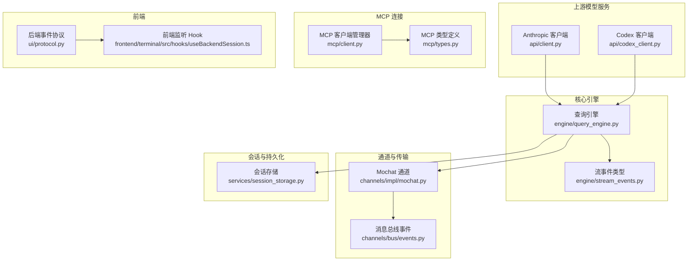
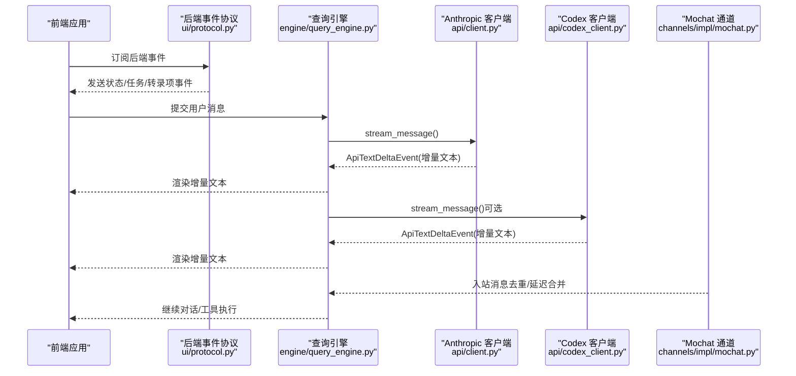
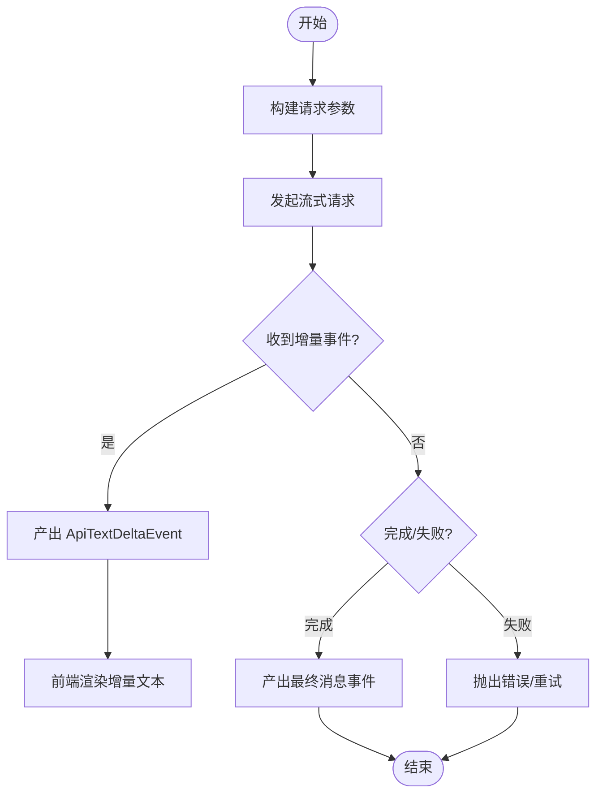
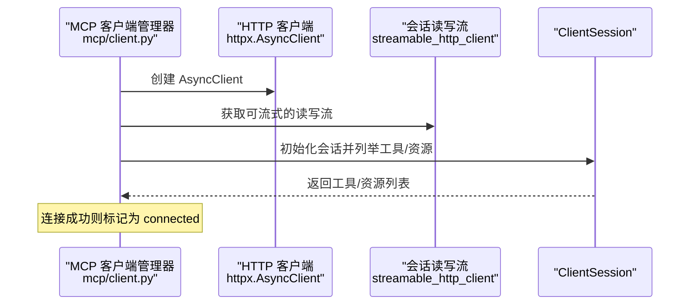
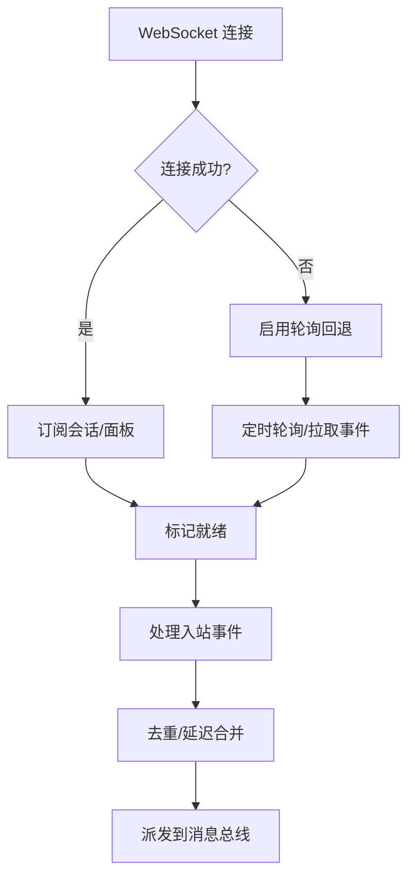
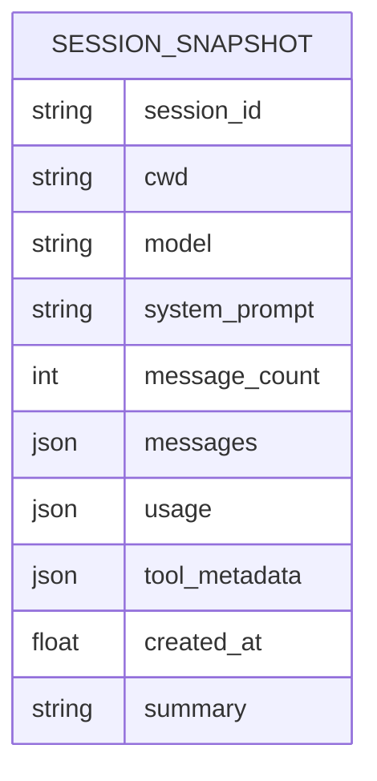
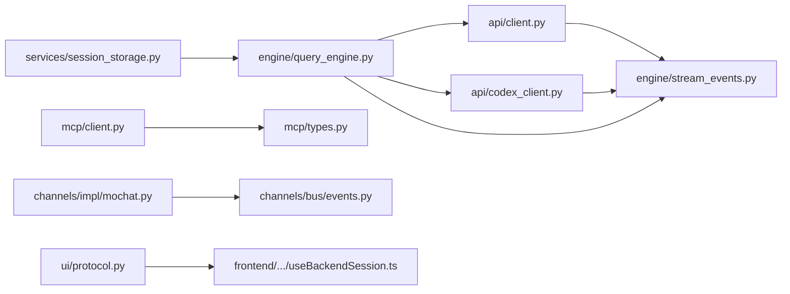

# 流式处理

<cite>
**本文引用的文件**
- [src/openharness/engine/stream_events.py](file://src/openharness/engine/stream_events.py)
- [src/openharness/engine/query_engine.py](file://src/openharness/engine/query_engine.py)
- [src/openharness/api/client.py](file://src/openharness/api/client.py)
- [src/openharness/api/codex_client.py](file://src/openharness/api/codex_client.py)
- [src/openharness/api/errors.py](file://src/openharness/api/errors.py)
- [src/openharness/mcp/client.py](file://src/openharness/mcp/client.py)
- [src/openharness/mcp/types.py](file://src/openharness/mcp/types.py)
- [src/openharness/channels/impl/mochat.py](file://src/openharness/channels/impl/mochat.py)
- [src/openharness/channels/bus/events.py](file://src/openharness/channels/bus/events.py)
- [src/openharness/services/session_storage.py](file://src/openharness/services/session_storage.py)
- [src/openharness/ui/protocol.py](file://src/openharness/ui/protocol.py)
- [frontend/terminal/src/hooks/useBackendSession.ts](file://frontend/terminal/src/hooks/useBackendSession.ts)
</cite>

## 目录
1. [简介](#简介)
2. [项目结构](#项目结构)
3. [核心组件](#核心组件)
4. [架构总览](#架构总览)
5. [详细组件分析](#详细组件分析)
6. [依赖分析](#依赖分析)
7. [性能考量](#性能考量)
8. [故障排查指南](#故障排查指南)
9. [结论](#结论)
10. [附录](#附录)

## 简介
本文件系统性阐述 OpenHarness 的流式处理体系，重点覆盖以下方面：
- 异步流式响应的实现原理：事件驱动与流式数据处理
- 文本增量事件 ApiTextDeltaEvent 的处理逻辑与缓冲机制
- 流式连接的重连策略与错误恢复机制
- 流式 API 的性能监控与调试技巧
- 背压处理与内存管理
- 超时控制与取消机制
- 流式事件的序列化与持久化方案

## 项目结构
从整体上看，流式处理由“上游模型服务（Anthropic、Codex）”、“查询引擎（QueryEngine）”、“事件模型（stream_events）”、“通道适配层（Mochat 等）”、“会话存储（session_storage）”以及“前端协议与监听（UI 协议与前端 Hook）”构成。

图表来源
- [src/openharness/engine/query_engine.py:19-215](file://src/openharness/engine/query_engine.py#L19-L215)
- [src/openharness/engine/stream_events.py:1-90](file://src/openharness/engine/stream_events.py#L1-L90)
- [src/openharness/api/client.py:117-267](file://src/openharness/api/client.py#L117-L267)
- [src/openharness/api/codex_client.py:212-396](file://src/openharness/api/codex_client.py#L212-L396)
- [src/openharness/channels/impl/mochat.py:217-800](file://src/openharness/channels/impl/mochat.py#L217-L800)
- [src/openharness/channels/bus/events.py:8-39](file://src/openharness/channels/bus/events.py#L8-L39)
- [src/openharness/mcp/client.py:29-299](file://src/openharness/mcp/client.py#L29-L299)
- [src/openharness/mcp/types.py:11-77](file://src/openharness/mcp/types.py#L11-L77)
- [src/openharness/services/session_storage.py:63-108](file://src/openharness/services/session_storage.py#L63-L108)
- [src/openharness/ui/protocol.py:126-166](file://src/openharness/ui/protocol.py#L126-L166)
- [frontend/terminal/src/hooks/useBackendSession.ts:213-253](file://frontend/terminal/src/hooks/useBackendSession.ts#L213-L253)

章节来源
- [src/openharness/engine/query_engine.py:1-215](file://src/openharness/engine/query_engine.py#L1-L215)
- [src/openharness/engine/stream_events.py:1-90](file://src/openharness/engine/stream_events.py#L1-L90)

## 核心组件
- 流事件模型：定义了增量文本、工具执行、状态、错误、压缩进度等事件类型，作为跨模块统一的数据契约。
- 上游客户端：封装 Anthropic 与 Codex 的流式接口，统一产出 ApiTextDeltaEvent 与最终完成事件。
- 查询引擎：协调工具调用与模型对话，按流式事件推进对话循环。
- 通道适配：以 Mochat 为例，实现 WebSocket 优先、HTTP 轮询回退的事件接收与去重/延迟合并。
- MCP 管理：管理 MCP 服务器连接、重连与失败标记。
- 会话存储：将对话快照与元数据持久化，支持恢复与导出。
- 前端协议：将后端状态与事件序列化为前端可消费的事件流。

章节来源
- [src/openharness/engine/stream_events.py:12-90](file://src/openharness/engine/stream_events.py#L12-L90)
- [src/openharness/api/client.py:50-76](file://src/openharness/api/client.py#L50-L76)
- [src/openharness/api/codex_client.py:212-344](file://src/openharness/api/codex_client.py#L212-L344)
- [src/openharness/engine/query_engine.py:147-192](file://src/openharness/engine/query_engine.py#L147-L192)
- [src/openharness/channels/impl/mochat.py:44-766](file://src/openharness/channels/impl/mochat.py#L44-L766)
- [src/openharness/mcp/client.py:29-299](file://src/openharness/mcp/client.py#L29-L299)
- [src/openharness/services/session_storage.py:63-108](file://src/openharness/services/session_storage.py#L63-L108)
- [src/openharness/ui/protocol.py:126-166](file://src/openharness/ui/protocol.py#L126-L166)

## 架构总览
下图展示从上游模型到前端的完整流式路径，包括事件生成、处理、缓冲与渲染。

图表来源
- [src/openharness/ui/protocol.py:126-166](file://src/openharness/ui/protocol.py#L126-L166)
- [frontend/terminal/src/hooks/useBackendSession.ts:213-253](file://frontend/terminal/src/hooks/useBackendSession.ts#L213-L253)
- [src/openharness/engine/query_engine.py:147-192](file://src/openharness/engine/query_engine.py#L147-L192)
- [src/openharness/api/client.py:160-257](file://src/openharness/api/client.py#L160-L257)
- [src/openharness/api/codex_client.py:220-344](file://src/openharness/api/codex_client.py#L220-L344)
- [src/openharness/channels/impl/mochat.py:665-766](file://src/openharness/channels/impl/mochat.py#L665-L766)

## 详细组件分析

### 组件一：文本增量事件与缓冲机制（ApiTextDeltaEvent）
- 事件来源
  - Anthropic 客户端在流式响应中逐条产出 content_block_delta 中的 text_delta，包装为 ApiTextDeltaEvent。
  - Codex 客户端通过 SSE 解析 response.output_text.delta，同样包装为 ApiTextDeltaEvent。
- 处理逻辑
  - 查询引擎对 ApiTextDeltaEvent 进行透传或聚合，结合工具执行与权限检查推进对话。
  - 前端 Hook 对后端事件进行稳定字符串化比较，避免重复渲染。
- 缓冲与去重
  - Mochat 通道对入站消息进行去重（基于消息 ID 集合与队列）与延迟合并（按目标与时间窗口），减少抖动与风暴。
  - 合并后的消息体按发送者标签拼接，再进入处理流程。

图表来源
- [src/openharness/api/client.py:230-257](file://src/openharness/api/client.py#L230-L257)
- [src/openharness/api/codex_client.py:271-344](file://src/openharness/api/codex_client.py#L271-L344)
- [src/openharness/engine/stream_events.py:50-63](file://src/openharness/engine/stream_events.py#L50-L63)

章节来源
- [src/openharness/api/client.py:50-76](file://src/openharness/api/client.py#L50-L76)
- [src/openharness/api/codex_client.py:212-344](file://src/openharness/api/codex_client.py#L212-L344)
- [src/openharness/engine/stream_events.py:12-63](file://src/openharness/engine/stream_events.py#L12-L63)
- [frontend/terminal/src/hooks/useBackendSession.ts:213-253](file://frontend/terminal/src/hooks/useBackendSession.ts#L213-L253)

### 组件二：流式连接的重连策略与错误恢复（MCP 与 Mochat）
- MCP 连接
  - 支持 STDIO 与 HTTP 两种传输；连接成功后初始化会话并列举工具/资源；失败时记录状态并可重连。
  - 提供统一的 reconnect_all/close 接口，便于在运行时重建连接。
- Mochat 通道
  - WebSocket 优先，自动重连（次数与延迟可配置）；断开时切换到轮询回退模式，定时刷新订阅目标。
  - 会话/面板分别维护独立的回退任务，确保在弱网或断线场景下的持续可用性。

图表来源
- [src/openharness/mcp/client.py:218-299](file://src/openharness/mcp/client.py#L218-L299)
- [src/openharness/mcp/types.py:11-37](file://src/openharness/mcp/types.py#L11-L37)

图表来源
- [src/openharness/channels/impl/mochat.py:347-418](file://src/openharness/channels/impl/mochat.py#L347-L418)
- [src/openharness/channels/impl/mochat.py:569-631](file://src/openharness/channels/impl/mochat.py#L569-L631)
- [src/openharness/channels/impl/mochat.py:665-766](file://src/openharness/channels/impl/mochat.py#L665-L766)

章节来源
- [src/openharness/mcp/client.py:45-114](file://src/openharness/mcp/client.py#L45-L114)
- [src/openharness/channels/impl/mochat.py:347-418](file://src/openharness/channels/impl/mochat.py#L347-L418)
- [src/openharness/channels/impl/mochat.py:569-631](file://src/openharness/channels/impl/mochat.py#L569-L631)

### 组件三：流式 API 的性能监控与调试技巧
- 指标与事件
  - 使用 ApiRetryEvent 在可重试错误时向下游暴露重试信息（尝试次数、最大次数、延迟秒数）。
  - 使用 CompactProgressEvent 记录会话压缩过程中的阶段、触发方式、尝试次数与检查点。
- 调试建议
  - 前端 Hook 对后端事件做稳定字符串化快照，仅在变化时更新状态，降低渲染压力。
  - 后端事件协议将状态、任务、转录项等打包为事件，前端按类型分流处理。
  - 对于 MCP，使用 list_statuses 输出各服务器状态、工具数量与资源数量，辅助诊断。

章节来源
- [src/openharness/api/client.py:67-76](file://src/openharness/api/client.py#L67-L76)
- [src/openharness/services/compact/__init__.py:187-212](file://src/openharness/services/compact/__init__.py#L187-L212)
- [src/openharness/ui/protocol.py:126-166](file://src/openharness/ui/protocol.py#L126-L166)
- [frontend/terminal/src/hooks/useBackendSession.ts:213-253](file://frontend/terminal/src/hooks/useBackendSession.ts#L213-L253)

### 组件四：背压处理与内存管理
- 背压策略
  - 流式客户端按事件逐条产出，避免一次性缓存全部内容；前端按增量渲染，降低峰值内存占用。
  - Mochat 通道对入站消息采用延迟合并与去重，限制并发锁与定时器数量，防止风暴。
- 内存管理
  - 去重集合与队列长度上限（如 MAX_SEEN_MESSAGE_IDS）限制历史消息 ID 存储规模。
  - 查询引擎在每轮对话结束后更新消息历史，配合成本跟踪与可选的会话压缩，控制上下文窗口。

章节来源
- [src/openharness/channels/impl/mochat.py:36-37](file://src/openharness/channels/impl/mochat.py#L36-L37)
- [src/openharness/channels/impl/mochat.py:713-722](file://src/openharness/channels/impl/mochat.py#L713-L722)
- [src/openharness/engine/query_engine.py:147-192](file://src/openharness/engine/query_engine.py#L147-L192)

### 组件五：超时控制与取消机制
- 超时
  - Codex 客户端设置请求超时；Mochat 通道对 HTTP 请求与 WebSocket 连接设置超时参数。
  - MCP 连接建立与会话初始化调用均设置超时，避免阻塞。
- 取消
  - MCP 连接过程中捕获取消异常，进行清理并标记失败。
  - Mochat 回退任务在停止时取消，确保资源释放。
  - 前端 Hook 在组件卸载时可中断事件订阅链路。

章节来源
- [src/openharness/api/codex_client.py:264-264](file://src/openharness/api/codex_client.py#L264-L264)
- [src/openharness/channels/impl/mochat.py:260-260](file://src/openharness/channels/impl/mochat.py#L260-L260)
- [src/openharness/mcp/client.py:201-216](file://src/openharness/mcp/client.py#L201-L216)
- [src/openharness/channels/impl/mochat.py:270-281](file://src/openharness/channels/impl/mochat.py#L270-L281)

### 组件六：流式事件的序列化与持久化
- 序列化
  - 后端事件协议将状态、任务、桥接会话等结构化为事件对象，前端 Hook 以稳定字符串化比较避免无效更新。
- 持久化
  - 会话存储将消息、使用量、工具元数据与摘要等写入 JSON 文件，支持按 ID 与最新快照保存，并提供导出 Markdown 转录能力。

图表来源
- [src/openharness/services/session_storage.py:85-96](file://src/openharness/services/session_storage.py#L85-L96)

章节来源
- [src/openharness/ui/protocol.py:126-166](file://src/openharness/ui/protocol.py#L126-L166)
- [frontend/terminal/src/hooks/useBackendSession.ts:213-253](file://frontend/terminal/src/hooks/useBackendSession.ts#L213-L253)
- [src/openharness/services/session_storage.py:63-108](file://src/openharness/services/session_storage.py#L63-L108)
- [src/openharness/services/session_storage.py:210-231](file://src/openharness/services/session_storage.py#L210-L231)

## 依赖分析
- 模块耦合
  - QueryEngine 依赖 SupportsStreamingMessages（协议）以解耦上游客户端；同时依赖工具注册表与权限检查器。
  - 流事件模型被上游客户端与引擎共同使用，形成稳定的契约层。
  - MCP 客户端管理器与类型定义分离，便于扩展新传输。
- 外部依赖
  - httpx 用于流式 HTTP 请求与 SSE 解析。
  - socketio 用于 WebSocket 事件订阅与自动重连。
  - pydantic 用于 MCP 配置模型校验。

图表来源
- [src/openharness/api/client.py:117-267](file://src/openharness/api/client.py#L117-L267)
- [src/openharness/api/codex_client.py:212-396](file://src/openharness/api/codex_client.py#L212-L396)
- [src/openharness/engine/stream_events.py:81-90](file://src/openharness/engine/stream_events.py#L81-L90)
- [src/openharness/engine/query_engine.py:19-71](file://src/openharness/engine/query_engine.py#L19-L71)
- [src/openharness/mcp/client.py:29-128](file://src/openharness/mcp/client.py#L29-L128)
- [src/openharness/mcp/types.py:11-77](file://src/openharness/mcp/types.py#L11-L77)
- [src/openharness/channels/impl/mochat.py:217-250](file://src/openharness/channels/impl/mochat.py#L217-L250)
- [src/openharness/channels/bus/events.py:8-39](file://src/openharness/channels/bus/events.py#L8-L39)
- [src/openharness/services/session_storage.py:63-108](file://src/openharness/services/session_storage.py#L63-L108)
- [src/openharness/ui/protocol.py:126-166](file://src/openharness/ui/protocol.py#L126-L166)
- [frontend/terminal/src/hooks/useBackendSession.ts:213-253](file://frontend/terminal/src/hooks/useBackendSession.ts#L213-L253)

## 性能考量
- 流式输出：客户端逐条产出增量事件，前端增量渲染，显著降低首帧延迟与内存峰值。
- 去重与合并：Mochat 通道通过去重集合与延迟定时器，抑制重复与风暴消息，提升吞吐。
- 超时与重试：合理设置超时与指数退避+抖动，避免雪崩；对可重试错误发出 ApiRetryEvent，便于前端反馈。
- 资源回收：停止阶段取消回退任务、关闭会话与 HTTP 客户端，防止资源泄漏。

## 故障排查指南
- 认证与限流
  - 当上游返回认证失败或速率限制错误时，抛出对应异常类型，前端可据此提示用户或降速重试。
- 重试与退避
  - 客户端内置最大重试次数与指数退避，期间发出 ApiRetryEvent；若仍失败，转换为通用请求失败。
- 连接失败
  - MCP 连接失败时记录状态详情；Mochat 断线后自动启用轮询回退，等待网络恢复。
- 事件不显示
  - 检查前端 Hook 是否对事件做了稳定字符串化快照；确认后端事件协议是否正确序列化状态/任务/转录项。

章节来源
- [src/openharness/api/errors.py:6-20](file://src/openharness/api/errors.py#L6-L20)
- [src/openharness/api/client.py:86-114](file://src/openharness/api/client.py#L86-L114)
- [src/openharness/mcp/client.py:86-101](file://src/openharness/mcp/client.py#L86-L101)
- [src/openharness/channels/impl/mochat.py:375-381](file://src/openharness/channels/impl/mochat.py#L375-L381)

## 结论
OpenHarness 的流式处理以事件驱动为核心，通过统一的流事件模型与多路客户端适配，实现了从上游模型到前端的高效、稳健的增量交互。通道层的去重与延迟合并有效缓解背压，MCP 与 Mochat 的重连策略保障了连接韧性。配合完善的持久化与前端事件协议，系统在性能、可观测性与可维护性上达到良好平衡。

## 附录
- 关键事件类型参考
  - AssistantTextDelta：增量文本
  - AssistantTurnComplete：整轮完成
  - ToolExecutionStarted/ToolExecutionCompleted：工具执行
  - ErrorEvent/StatusEvent：错误与状态
  - CompactProgressEvent：压缩进度
- 前端事件订阅要点
  - 对后端事件做稳定字符串化快照，仅在变化时更新状态，避免不必要的重渲染。

章节来源
- [src/openharness/engine/stream_events.py:12-89](file://src/openharness/engine/stream_events.py#L12-L89)
- [src/openharness/ui/protocol.py:126-166](file://src/openharness/ui/protocol.py#L126-L166)
- [frontend/terminal/src/hooks/useBackendSession.ts:213-253](file://frontend/terminal/src/hooks/useBackendSession.ts#L213-L253)