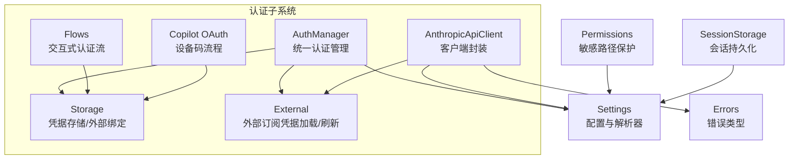
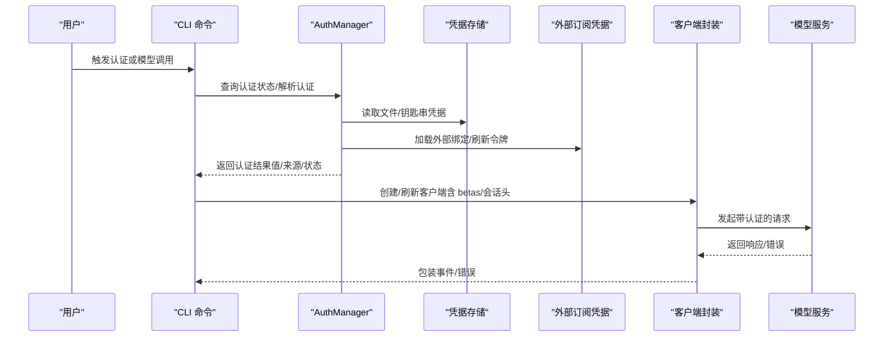
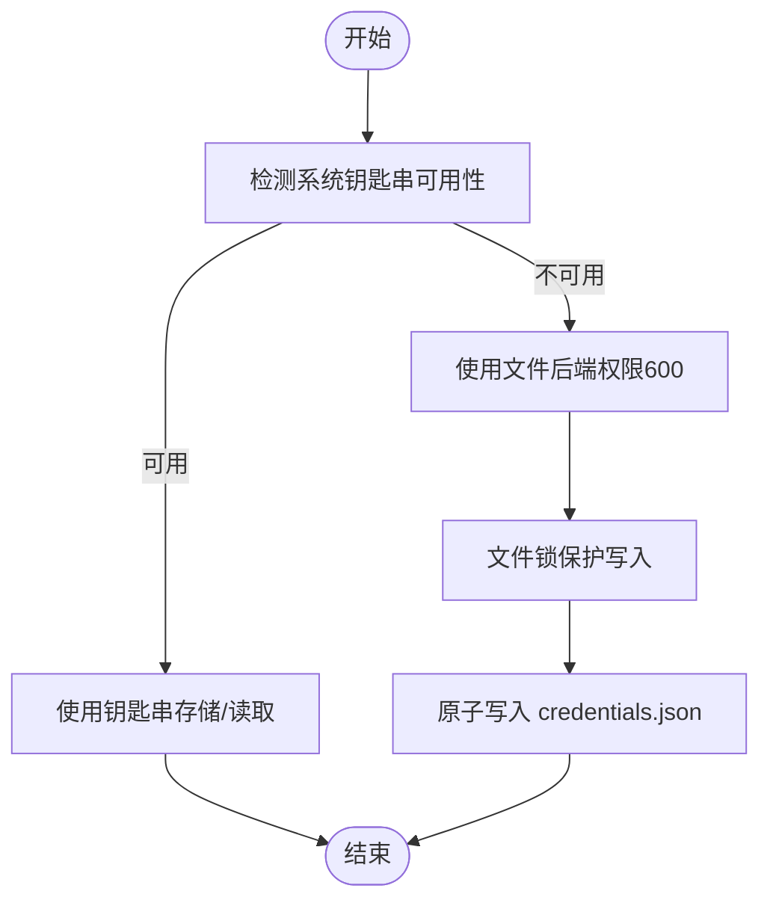
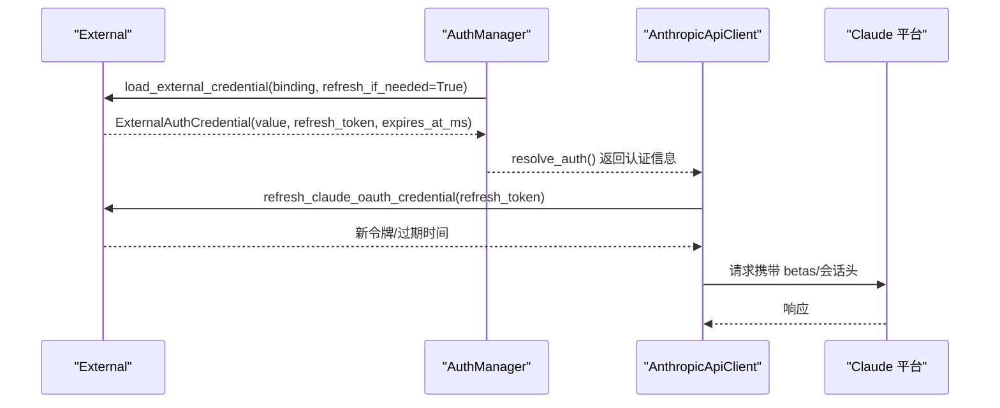
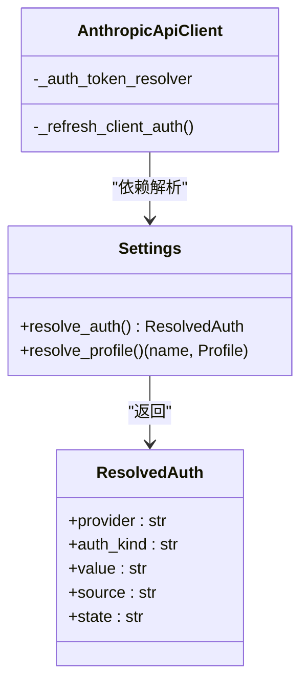
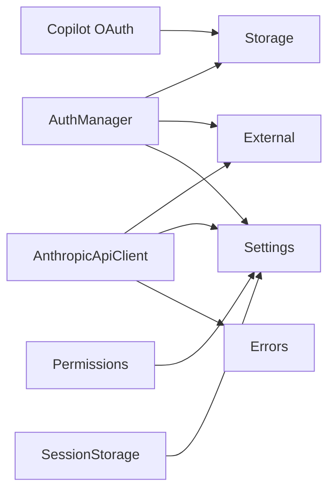

# 认证机制

<cite>
**本文引用的文件**
- [auth/__init__.py](file://src/openharness/auth/__init__.py)
- [auth/manager.py](file://src/openharness/auth/manager.py)
- [auth/storage.py](file://src/openharness/auth/storage.py)
- [auth/flows.py](file://src/openharness/auth/flows.py)
- [auth/external.py](file://src/openharness/auth/external.py)
- [api/copilot_auth.py](file://src/openharness/api/copilot_auth.py)
- [api/client.py](file://src/openharness/api/client.py)
- [api/errors.py](file://src/openharness/api/errors.py)
- [config/settings.py](file://src/openharness/config/settings.py)
- [services/session_storage.py](file://src/openharness/services/session_storage.py)
- [permissions/checker.py](file://src/openharness/permissions/checker.py)
- [cli.py](file://src/openharness/cli.py)
</cite>

## 目录
1. [简介](#简介)
2. [项目结构](#项目结构)
3. [核心组件](#核心组件)
4. [架构总览](#架构总览)
5. [详细组件分析](#详细组件分析)
6. [依赖分析](#依赖分析)
7. [性能考虑](#性能考虑)
8. [故障排查指南](#故障排查指南)
9. [结论](#结论)
10. [附录](#附录)

## 简介
本文件系统化阐述 OpenHarness 的认证机制，覆盖以下关键主题：
- API 密钥管理：存储、轮换与安全传输
- OAuth 认证流程：重点为 Claude OAuth 的实现细节与 betas 头配置
- 凭据解析器模式与动态令牌刷新机制
- 不同提供商的认证配置示例与最佳实践
- 认证失败处理策略与安全审计日志
- 多租户环境下的认证隔离与权限控制
- 认证缓存与会话管理的实现方案

## 项目结构
认证相关代码主要分布在如下模块：
- 认证管理与状态：auth/manager.py、auth/__init__.py
- 凭据存储与外部绑定：auth/storage.py、auth/external.py
- 认证流（交互式）：auth/flows.py
- OAuth 设备码流程（Copilot）：api/copilot_auth.py
- 客户端与错误类型：api/client.py、api/errors.py
- 配置与解析器：config/settings.py
- 会话持久化：services/session_storage.py
- 权限与敏感路径保护：permissions/checker.py
- CLI 命令入口：cli.py

图示来源
- [auth/manager.py:71-483](file://src/openharness/auth/manager.py#L71-L483)
- [auth/storage.py:122-227](file://src/openharness/auth/storage.py#L122-L227)
- [auth/external.py:116-236](file://src/openharness/auth/external.py#L116-L236)
- [auth/flows.py:34-190](file://src/openharness/auth/flows.py#L34-L190)
- [api/copilot_auth.py:153-241](file://src/openharness/api/copilot_auth.py#L153-L241)
- [api/client.py:117-258](file://src/openharness/api/client.py#L117-L258)
- [config/settings.py:683-791](file://src/openharness/config/settings.py#L683-L791)
- [api/errors.py:6-20](file://src/openharness/api/errors.py#L6-L20)
- [permissions/checker.py:18-37](file://src/openharness/permissions/checker.py#L18-L37)
- [services/session_storage.py:63-107](file://src/openharness/services/session_storage.py#L63-L107)

章节来源
- [auth/__init__.py:1-30](file://src/openharness/auth/__init__.py#L1-L30)
- [auth/manager.py:71-483](file://src/openharness/auth/manager.py#L71-L483)
- [auth/storage.py:1-270](file://src/openharness/auth/storage.py#L1-L270)
- [auth/external.py:1-611](file://src/openharness/auth/external.py#L1-L611)
- [auth/flows.py:1-190](file://src/openharness/auth/flows.py#L1-L190)
- [api/copilot_auth.py:1-241](file://src/openharness/api/copilot_auth.py#L1-L241)
- [api/client.py:1-267](file://src/openharness/api/client.py#L1-L267)
- [config/settings.py:1-965](file://src/openharness/config/settings.py#L1-L965)
- [api/errors.py:1-20](file://src/openharness/api/errors.py#L1-L20)
- [permissions/checker.py:1-201](file://src/openharness/permissions/checker.py#L1-L201)
- [services/session_storage.py:1-231](file://src/openharness/services/session_storage.py#L1-L231)
- [cli.py:1823-1855](file://src/openharness/cli.py#L1823-L1855)

## 核心组件
- 统一认证管理器（AuthManager）
  - 聚合配置与存储，提供认证源状态查询、活动提供者/配置文件切换、凭据增删改等能力
  - 关键方法：get_auth_source_statuses、get_auth_status、get_profile_statuses、use_profile、update_profile、store_credential、clear_credential 等
- 凭据存储（Storage）
  - 文件后端（默认，权限 600）与可选系统钥匙串后端（keyring）
  - 支持 store/load/clear 操作；支持外部绑定元数据存储
- 外部订阅凭据（External）
  - 加载/描述外部绑定（Codex/Claude CLI），支持 Claude OAuth 刷新、过期判断、会话标识生成、betas 头构建
- 认证流（Flows）
  - ApiKeyFlow：直接输入并存储 API Key
  - DeviceCodeFlow：通用 GitHub OAuth 设备码流程（复用 Copilot 实现）
  - BrowserFlow：打开浏览器完成授权后回填令牌
- Copilot OAuth
  - 设备码请求、轮询获取访问令牌、企业版域名适配、持久化到 copilot_auth.json
- 客户端封装（AnthropicApiClient）
  - 基于官方 SDK 的异步封装，内置重试、可选 Claude OAuth betas 头与会话标识、动态令牌刷新
- 配置与解析器（Settings）
  - 提供 ProviderProfile、认证源映射、凭据槽位、运行时认证解析（含外部订阅桥接）
- 错误类型（Errors）
  - 统一上游 API 错误分类：认证失败、速率限制、请求失败
- 权限与敏感路径保护（Permissions）
  - 内置敏感路径白名单，防止 LLM 或提示注入访问凭证文件
- 会话持久化（SessionStorage）
  - 会话快照保存/加载，支持项目级隔离

章节来源
- [auth/manager.py:116-483](file://src/openharness/auth/manager.py#L116-L483)
- [auth/storage.py:122-227](file://src/openharness/auth/storage.py#L122-L227)
- [auth/external.py:116-476](file://src/openharness/auth/external.py#L116-L476)
- [auth/flows.py:34-190](file://src/openharness/auth/flows.py#L34-L190)
- [api/copilot_auth.py:153-241](file://src/openharness/api/copilot_auth.py#L153-L241)
- [api/client.py:117-258](file://src/openharness/api/client.py#L117-L258)
- [config/settings.py:683-791](file://src/openharness/config/settings.py#L683-L791)
- [api/errors.py:6-20](file://src/openharness/api/errors.py#L6-L20)
- [permissions/checker.py:18-37](file://src/openharness/permissions/checker.py#L18-L37)
- [services/session_storage.py:63-107](file://src/openharness/services/session_storage.py#L63-L107)

## 架构总览
下图展示从用户触发到认证解析与调用的关键交互：

图示来源
- [auth/manager.py:186-318](file://src/openharness/auth/manager.py#L186-L318)
- [auth/storage.py:147-164](file://src/openharness/auth/storage.py#L147-L164)
- [auth/external.py:116-236](file://src/openharness/auth/external.py#L116-L236)
- [api/client.py:117-258](file://src/openharness/api/client.py#L117-L258)
- [config/settings.py:683-791](file://src/openharness/config/settings.py#L683-L791)

## 详细组件分析

### API 密钥管理策略
- 存储后端
  - 文件后端：默认使用 ~/.openharness/credentials.json，文件权限 600；支持并发写入锁
  - 钥匙串后端：优先探测可用系统钥匙串（如 macOS Keychain），不可用则回退文件后端
- 轮换与安全传输
  - 文件后端仅通过 POSIX 权限提供基础保护，不建议在容器/WSL 环境中存放高敏密钥
  - 令牌刷新通过外部绑定实现（Claude OAuth），避免明文密钥长期驻留本地
- 凭据槽位与作用域
  - 自定义兼容型配置可设置 credential_slot，使用命名空间前缀 "profile:<slot>" 进行隔离存储

图示来源
- [auth/storage.py:87-144](file://src/openharness/auth/storage.py#L87-L144)

章节来源
- [auth/storage.py:1-270](file://src/openharness/auth/storage.py#L1-L270)
- [config/settings.py:366-376](file://src/openharness/config/settings.py#L366-L376)

### OAuth 认证流程（Claude OAuth）
- 外部绑定与加载
  - 默认绑定来源：Codex（auth.json）、Claude CLI（~/.claude 或 macOS Keychain）
  - 支持自定义 source_path/source_kind，描述“由谁维护”（managed_by）
- 令牌刷新与过期判断
  - 从外部凭据提取 refresh_token 与 expiresAt
  - 过期时自动刷新，成功后写回原文件或 Keychain
- betas 头与会话标识
  - 构建 anthropic-beta 列表（含 OAuth 特定版本）
  - 附加 X-Claude-Code-Session-Id、用户代理、系统提示头等
- 客户端集成
  - AnthropicApiClient 在每次请求前检查并动态更新 auth_token，确保长期会话可用

图示来源
- [auth/external.py:116-236](file://src/openharness/auth/external.py#L116-L236)
- [auth/external.py:413-476](file://src/openharness/auth/external.py#L413-L476)
- [api/client.py:117-258](file://src/openharness/api/client.py#L117-L258)
- [config/settings.py:683-791](file://src/openharness/config/settings.py#L683-L791)

章节来源
- [auth/external.py:1-611](file://src/openharness/auth/external.py#L1-L611)
- [api/client.py:1-267](file://src/openharness/api/client.py#L1-L267)
- [config/settings.py:683-791](file://src/openharness/config/settings.py#L683-L791)

### 凭据解析器模式与动态令牌刷新
- 解析器职责
  - Settings.resolve_auth：按优先级解析当前活动配置的认证材料
  - 支持外部订阅桥接（Codex/Claude），返回标准化 ResolvedAuth
- 动态刷新
  - AnthropicApiClient._refresh_client_auth：在每次请求前检查 auth_token 变化并重建客户端
  - 外部订阅场景下，refresh_claude_oauth_credential 会在过期时自动刷新并写回

图示来源
- [config/settings.py:683-791](file://src/openharness/config/settings.py#L683-L791)
- [api/client.py:117-159](file://src/openharness/api/client.py#L117-L159)

章节来源
- [config/settings.py:683-791](file://src/openharness/config/settings.py#L683-L791)
- [api/client.py:117-159](file://src/openharness/api/client.py#L117-L159)
- [auth/external.py:413-476](file://src/openharness/auth/external.py#L413-L476)

### 不同提供商的认证配置示例与最佳实践
- Anthropic API Key
  - 优先级：环境变量 > 设置文件 > 文件存储
  - 最佳实践：生产环境使用环境变量或系统钥匙串；禁用明文文件
- Copilot OAuth（GitHub 设备码）
  - 使用 DeviceCodeFlow 启动，浏览器授权后轮询获取令牌
  - 企业版支持通过 copilot_api_base 适配
- Codex 订阅
  - 通过外部绑定加载 auth.json，支持 refresh_token 自动续期
- Claude 订阅（第三方端点）
  - 仅支持直连 Anthropic/Claude 端点；第三方兼容需使用 API Key 方案

章节来源
- [auth/manager.py:186-288](file://src/openharness/auth/manager.py#L186-L288)
- [api/copilot_auth.py:48-128](file://src/openharness/api/copilot_auth.py#L48-L128)
- [auth/external.py:76-113](file://src/openharness/auth/external.py#L76-L113)
- [config/settings.py:695-699](file://src/openharness/config/settings.py#L695-L699)

### 认证失败处理策略与安全审计日志
- 错误分类
  - AuthenticationFailure：认证错误（如 401/403）
  - RateLimitFailure：速率限制
  - RequestFailure：网络/传输错误
- 处理策略
  - 客户端封装内置指数退避与抖动重试，对可重试状态码自动重试
  - 认证错误不重试，直接抛出对应异常
- 审计与可观测性
  - 日志记录：存储/加载失败、钥匙串不可用、外部绑定缺失或过期
  - CLI status 命令输出认证源与配置文件状态，便于诊断

章节来源
- [api/errors.py:6-20](file://src/openharness/api/errors.py#L6-L20)
- [api/client.py:86-115](file://src/openharness/api/client.py#L86-L115)
- [auth/storage.py:97-110](file://src/openharness/auth/storage.py#L97-L110)
- [auth/external.py:295-343](file://src/openharness/auth/external.py#L295-L343)
- [cli.py:1823-1850](file://src/openharness/cli.py#L1823-L1850)

### 多租户环境下的认证隔离与权限控制
- 认证隔离
  - 凭据槽位：通过 credential_slot 与 "profile:<slot>" 命名空间实现多租户隔离
  - 外部绑定：每个 provider 有独立绑定元数据，避免跨租户混用
- 权限控制
  - 敏感路径保护：内置对 SSH/AWS/GCP/Azure/Docker/K8s/OpenHarness 凭据文件的匹配规则
  - 工具执行权限：基于模式（全自动/计划/默认）与路径规则进行决策

章节来源
- [config/settings.py:366-376](file://src/openharness/config/settings.py#L366-L376)
- [permissions/checker.py:18-37](file://src/openharness/permissions/checker.py#L18-L37)
- [permissions/checker.py:75-156](file://src/openharness/permissions/checker.py#L75-L156)

### 认证缓存与会话管理
- 认证缓存
  - 外部订阅令牌在内存中按进程缓存版本号与会话 ID，减少重复刷新
- 会话管理
  - 会话快照按项目目录隔离保存，支持最新与指定 ID 的加载
  - 会话导出为 Markdown，便于审计与复盘

章节来源
- [auth/external.py:356-386](file://src/openharness/auth/external.py#L356-L386)
- [services/session_storage.py:54-107](file://src/openharness/services/session_storage.py#L54-L107)
- [services/session_storage.py:194-231](file://src/openharness/services/session_storage.py#L194-L231)

## 依赖分析
- 组件耦合
  - AuthManager 依赖 Settings、Storage、External；对外暴露统一接口
  - AnthropicApiClient 依赖 External 与 Settings 的解析结果
  - Copilot OAuth 与 AuthManager 的外部绑定协同工作
- 外部依赖
  - keyring 包（可选）
  - httpx（OAuth 轮询）
  - anthropic SDK（消息流）

图示来源
- [auth/manager.py:18-25](file://src/openharness/auth/manager.py#L18-L25)
- [api/client.py:20-26](file://src/openharness/api/client.py#L20-L26)
- [api/copilot_auth.py:26-29](file://src/openharness/api/copilot_auth.py#L26-L29)
- [permissions/checker.py:9-10](file://src/openharness/permissions/checker.py#L9-L10)
- [services/session_storage.py:12-15](file://src/openharness/services/session_storage.py#L12-L15)

章节来源
- [auth/manager.py:18-25](file://src/openharness/auth/manager.py#L18-L25)
- [api/client.py:20-26](file://src/openharness/api/client.py#L20-L26)
- [api/copilot_auth.py:26-29](file://src/openharness/api/copilot_auth.py#L26-L29)
- [permissions/checker.py:9-10](file://src/openharness/permissions/checker.py#L9-L10)
- [services/session_storage.py:12-15](file://src/openharness/services/session_storage.py#L12-L15)

## 性能考虑
- 存储层
  - 文件写入采用原子写与独占锁，避免竞态；建议批量操作合并写入
  - 钥匙串后端在不可用时回退文件后端，避免阻塞
- 客户端重试
  - 指数退避 + 抖动，尊重上游 Retry-After；对认证错误不重试
- 外部订阅刷新
  - 仅在过期时刷新，减少不必要的网络往返

## 故障排查指南
- 常见问题定位
  - 认证源缺失：使用 CLI status 查看各认证源状态与来源
  - 外部绑定无效：检查 external_binding 是否存在、JSON 是否合法、Keychain 是否可用
  - 钥匙串不可用：确认 keyring 包安装且后端可用；容器/WSL 环境建议改用文件后端
- 具体步骤
  - 查看认证状态：oh auth status
  - 清理会话/凭据：oh auth logout 或清除对应文件
  - 检查敏感路径保护：确认工具未尝试访问 ~/.openharness/credentials.json 等

章节来源
- [cli.py:1823-1850](file://src/openharness/cli.py#L1823-L1850)
- [auth/storage.py:198-227](file://src/openharness/auth/storage.py#L198-L227)
- [permissions/checker.py:18-37](file://src/openharness/permissions/checker.py#L18-L37)

## 结论
OpenHarness 的认证体系以“统一管理 + 多源解析 + 外部桥接 + 安全保护”为核心设计：
- 通过 AuthManager 将多种认证源（API Key、OAuth、外部订阅）统一抽象
- Storage 提供灵活的后端选择与隔离能力
- External 与 AnthropicApiClient 实现动态令牌刷新与 betas 头配置
- Permissions 与敏感路径保护强化了安全边界
- CLI 与会话持久化完善了可观测性与可恢复性

## 附录
- CLI 命令
  - 认证状态：oh auth status
  - 登出：oh auth logout
- 关键实现参考
  - [AuthManager.get_auth_source_statuses:116-184](file://src/openharness/auth/manager.py#L116-L184)
  - [store_credential/load_credential:122-164](file://src/openharness/auth/storage.py#L122-L164)
  - [load_external_credential/refresh_claude_oauth_credential:116-476](file://src/openharness/auth/external.py#L116-L476)
  - [request_device_code/poll_for_access_token:153-241](file://src/openharness/api/copilot_auth.py#L153-L241)
  - [AnthropicApiClient.stream_message:160-258](file://src/openharness/api/client.py#L160-L258)
  - [Settings.resolve_auth:683-791](file://src/openharness/config/settings.py#L683-L791)
  - [敏感路径保护规则:18-37](file://src/openharness/permissions/checker.py#L18-L37)
  - [会话快照保存/加载:63-107](file://src/openharness/services/session_storage.py#L63-L107)