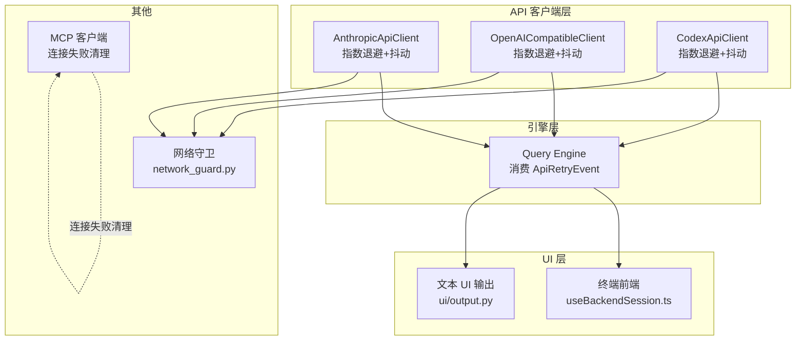
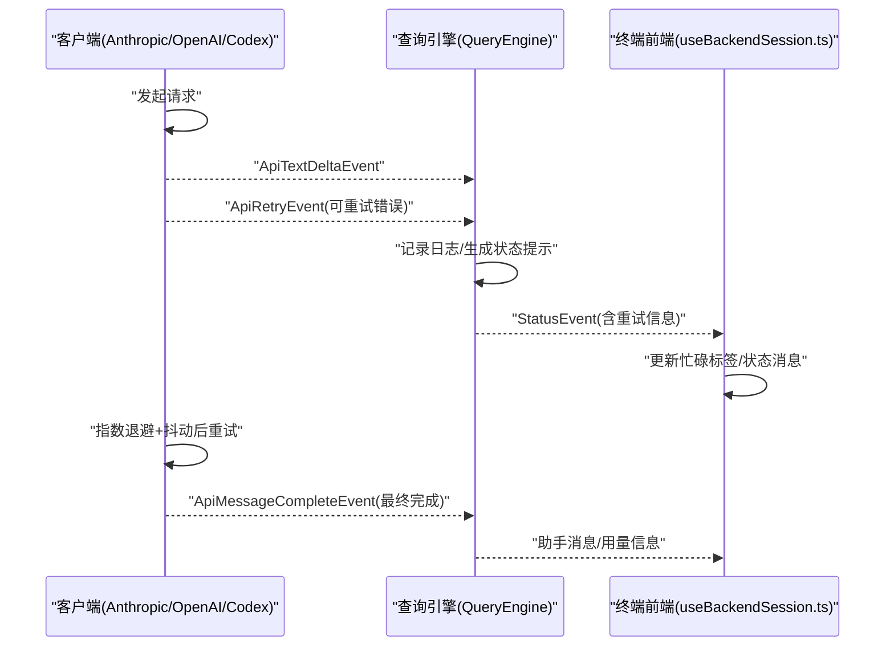
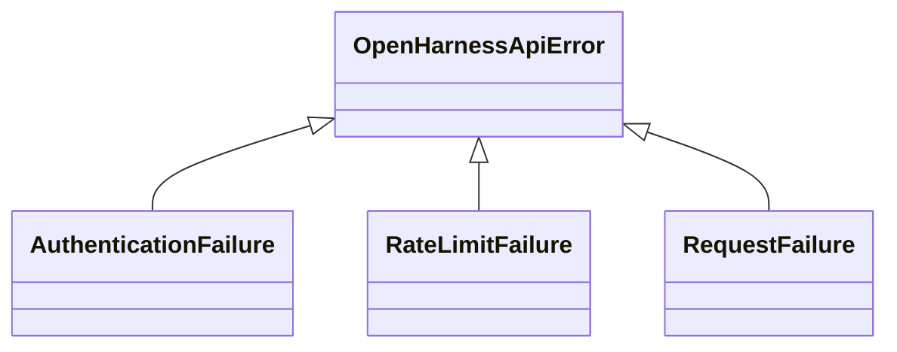
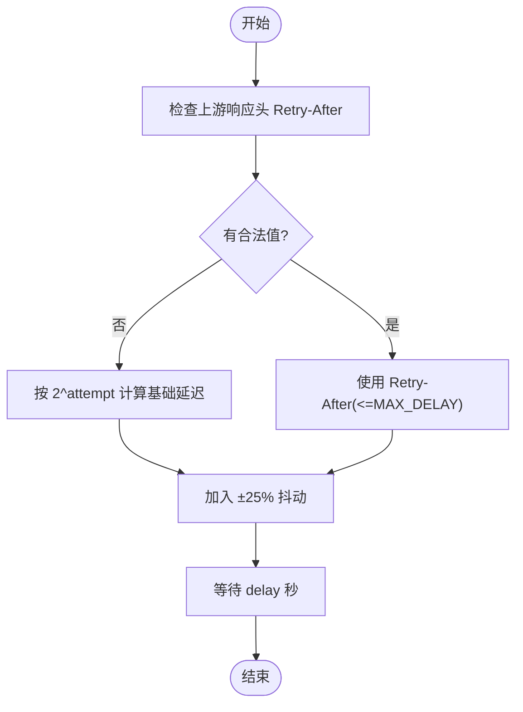
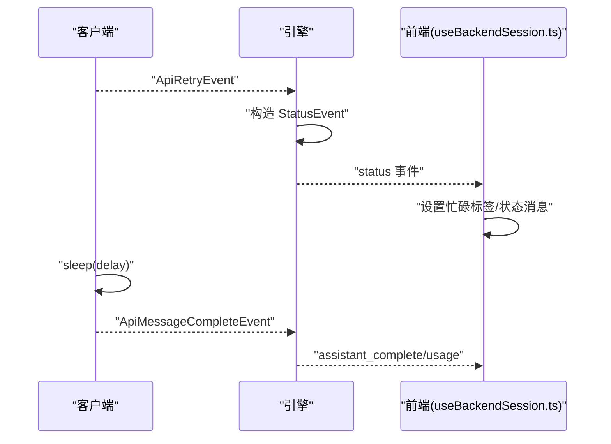
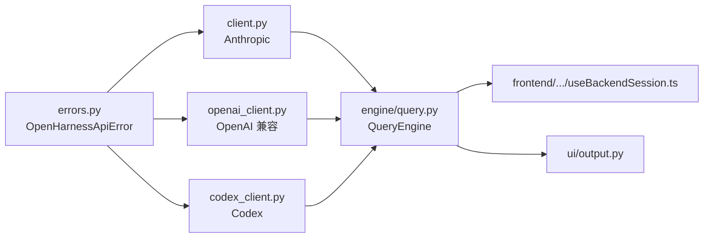

# 错误处理与重试

<cite>
**本文引用的文件**
- [src/openharness/api/errors.py](file://src/openharness/api/errors.py)
- [src/openharness/api/client.py](file://src/openharness/api/client.py)
- [src/openharness/api/codex_client.py](file://src/openharness/api/codex_client.py)
- [src/openharness/api/openai_client.py](file://src/openharness/api/openai_client.py)
- [src/openharness/engine/query.py](file://src/openharness/engine/query.py)
- [src/openharness/ui/output.py](file://src/openharness/ui/output.py)
- [frontend/terminal/src/hooks/useBackendSession.ts](file://frontend/terminal/src/hooks/useBackendSession.ts)
- [src/openharness/mcp/client.py](file://src/openharness/mcp/client.py)
- [src/openharness/utils/network_guard.py](file://src/openharness/utils/network_guard.py)
- [scripts/test_harness_features.py](file://scripts/test_harness_features.py)
- [tests/test_engine/test_query_engine.py](file://tests/test_engine/test_query_engine.py)
- [tests/test_api/test_client.py](file://tests/test_api/test_client.py)
- [tests/test_api/test_openai_client.py](file://tests/test_api/test_openai_client.py)
</cite>

## 目录
1. [简介](#简介)
2. [项目结构](#项目结构)
3. [核心组件](#核心组件)
4. [架构总览](#架构总览)
5. [详细组件分析](#详细组件分析)
6. [依赖关系分析](#依赖关系分析)
7. [性能考量](#性能考量)
8. [故障排查指南](#故障排查指南)
9. [结论](#结论)
10. [附录](#附录)

## 简介
本文件系统化阐述 OpenHarness 的错误处理与重试机制，覆盖以下主题：
- OpenHarnessApiError 体系：AuthenticationFailure、RateLimitFailure、RequestFailure 等异常类型及其语义边界
- 指数退避与抖动：延迟计算策略、Retry-After 头优先级、最大延迟上限
- 可重试错误判定：状态码映射、异常类型映射、关键字匹配
- 重试事件 ApiRetryEvent 的产生与传播路径，以及 UI 层的反馈机制
- 超时配置与连接池/会话管理策略（按各客户端实现）
- 错误日志记录与监控指标采集建议
- 故障诊断与问题排查方法论

## 项目结构
围绕错误处理与重试的关键模块分布如下：
- API 客户端层：Anthropic、OpenAI 兼容、Codex 客户端均内置统一的重试逻辑与事件产出
- 引擎层：消费 ApiRetryEvent 并转化为用户态状态提示
- UI 层：终端前端监听事件并展示“正在重试”等状态
- MCP 客户端：连接失败时进行清理与状态登记
- 网络安全工具：网络访问前的安全校验

图表来源
- [src/openharness/api/client.py:117-196](file://src/openharness/api/client.py#L117-L196)
- [src/openharness/api/openai_client.py:228-277](file://src/openharness/api/openai_client.py#L228-L277)
- [src/openharness/api/codex_client.py:212-242](file://src/openharness/api/codex_client.py#L212-L242)
- [src/openharness/engine/query.py:739-745](file://src/openharness/engine/query.py#L739-L745)
- [frontend/terminal/src/hooks/useBackendSession.ts:250-324](file://frontend/terminal/src/hooks/useBackendSession.ts#L250-L324)
- [src/openharness/ui/output.py:70-100](file://src/openharness/ui/output.py#L70-L100)
- [src/openharness/mcp/client.py:78-101](file://src/openharness/mcp/client.py#L78-L101)
- [src/openharness/utils/network_guard.py:53-89](file://src/openharness/utils/network_guard.py#L53-L89)

章节来源
- [src/openharness/api/client.py:117-196](file://src/openharness/api/client.py#L117-L196)
- [src/openharness/api/openai_client.py:228-277](file://src/openharness/api/openai_client.py#L228-L277)
- [src/openharness/api/codex_client.py:212-242](file://src/openharness/api/codex_client.py#L212-L242)
- [src/openharness/engine/query.py:739-745](file://src/openharness/engine/query.py#L739-L745)
- [frontend/terminal/src/hooks/useBackendSession.ts:250-324](file://frontend/terminal/src/hooks/useBackendSession.ts#L250-L324)
- [src/openharness/ui/output.py:70-100](file://src/openharness/ui/output.py#L70-L100)
- [src/openharness/mcp/client.py:78-101](file://src/openharness/mcp/client.py#L78-L101)
- [src/openharness/utils/network_guard.py:53-89](file://src/openharness/utils/network_guard.py#L53-L89)

## 核心组件
- OpenHarnessApiError 体系
  - 基类：OpenHarnessApiError
  - 认证失败：AuthenticationFailure（如 401/403）
  - 速率限制：RateLimitFailure（如 429）
  - 请求失败：RequestFailure（通用传输/网络/超时等）
- 重试事件 ApiRetryEvent
  - 字段：message、attempt、max_attempts、delay_seconds
  - 由各客户端在检测到可重试错误时产出
- 指数退避与抖动
  - 默认基础延迟、最大延迟、最大重试次数
  - 优先使用上游返回的 Retry-After 头；否则按 2^attempt 计算并叠加随机抖动
- 可重试错误判定
  - 状态码集合：429、500、502、503、504（部分客户端还包含 529、504）
  - 异常类型：APIStatusError、APIError、连接/超时/系统错误
  - 关键字匹配：timeout/connect/network/rate/overloaded
- UI 反馈
  - 引擎层将 ApiRetryEvent 转换为 StatusEvent 提示
  - 终端前端监听事件并更新忙碌标签与状态消息

章节来源
- [src/openharness/api/errors.py:6-19](file://src/openharness/api/errors.py#L6-L19)
- [src/openharness/api/client.py:66-76](file://src/openharness/api/client.py#L66-L76)
- [src/openharness/api/client.py:97-114](file://src/openharness/api/client.py#L97-L114)
- [src/openharness/api/client.py:86-94](file://src/openharness/api/client.py#L86-L94)
- [src/openharness/api/codex_client.py:373-384](file://src/openharness/api/codex_client.py#L373-L384)
- [src/openharness/api/openai_client.py:400-407](file://src/openharness/api/openai_client.py#L400-L407)
- [src/openharness/engine/query.py:739-745](file://src/openharness/engine/query.py#L739-L745)
- [frontend/terminal/src/hooks/useBackendSession.ts:250-324](file://frontend/terminal/src/hooks/useBackendSession.ts#L250-L324)

## 架构总览
下图展示了从 API 客户端到引擎再到 UI 的完整重试事件流。

图表来源
- [src/openharness/api/client.py:160-196](file://src/openharness/api/client.py#L160-L196)
- [src/openharness/api/openai_client.py:247-277](file://src/openharness/api/openai_client.py#L247-L277)
- [src/openharness/api/codex_client.py:220-242](file://src/openharness/api/codex_client.py#L220-L242)
- [src/openharness/engine/query.py:739-745](file://src/openharness/engine/query.py#L739-L745)
- [frontend/terminal/src/hooks/useBackendSession.ts:250-324](file://frontend/terminal/src/hooks/useBackendSession.ts#L250-L324)

## 详细组件分析

### OpenHarnessApiError 体系
- 语义边界
  - AuthenticationFailure：认证凭据被拒绝（如 401/403）
  - RateLimitFailure：速率限制触发（如 429）
  - RequestFailure：通用网络/传输/超时等错误
- 客户端翻译
  - Anthropic：根据 APIError 类名映射
  - OpenAI/Codex：根据 HTTP 状态码映射
  - 非 API 错误：统一包装为 RequestFailure

图表来源
- [src/openharness/api/errors.py:6-19](file://src/openharness/api/errors.py#L6-L19)

章节来源
- [src/openharness/api/errors.py:6-19](file://src/openharness/api/errors.py#L6-L19)
- [src/openharness/api/client.py:260-266](file://src/openharness/api/client.py#L260-L266)
- [src/openharness/api/openai_client.py:410-417](file://src/openharness/api/openai_client.py#L410-L417)
- [src/openharness/api/codex_client.py:387-395](file://src/openharness/api/codex_client.py#L387-L395)

### 指数退避与抖动实现
- 配置参数
  - 最大重试次数、基础延迟、最大延迟
- 计算流程
  - 优先读取上游响应头 Retry-After（若存在且合法则截断至最大延迟）
  - 否则按 2^attempt 计算基础延迟并加随机抖动（最多±25%）
- 客户端差异
  - Anthropic 客户端支持从 APIStatusError 中提取 Retry-After
  - OpenAI/Codex 客户端采用固定公式与 sleep 实现

图表来源
- [src/openharness/api/client.py:97-114](file://src/openharness/api/client.py#L97-L114)
- [src/openharness/api/openai_client.py:263-274](file://src/openharness/api/openai_client.py#L263-L274)
- [src/openharness/api/codex_client.py:231-240](file://src/openharness/api/codex_client.py#L231-L240)

章节来源
- [src/openharness/api/client.py:31-36](file://src/openharness/api/client.py#L31-L36)
- [src/openharness/api/client.py:97-114](file://src/openharness/api/client.py#L97-L114)
- [src/openharness/api/openai_client.py:39-42](file://src/openharness/api/openai_client.py#L39-L42)
- [src/openharness/api/openai_client.py:263-274](file://src/openharness/api/openai_client.py#L263-L274)
- [src/openharness/api/codex_client.py:25-27](file://src/openharness/api/codex_client.py#L25-L27)
- [src/openharness/api/codex_client.py:231-240](file://src/openharness/api/codex_client.py#L231-L240)

### 可重试错误判定与状态码映射
- Anthropic 客户端
  - 状态码集合：429、500、502、503、529
  - 异常类型：APIError、连接/超时/系统错误
- OpenAI/Codex 客户端
  - 状态码集合：429、500、502、503、504
  - 异常类型：HTTPStatusError、RateLimitFailure、RequestFailure（关键字匹配）
  - 关键字：timeout、connect、network、rate、overloaded
- 认证失败与非重试错误
  - 认证失败直接抛出，不参与重试
  - 其他错误在达到最大重试次数或不可重试时转换为 RequestFailure

章节来源
- [src/openharness/api/client.py:86-94](file://src/openharness/api/client.py#L86-L94)
- [src/openharness/api/client.py:35-35](file://src/openharness/api/client.py#L35-L35)
- [src/openharness/api/codex_client.py:373-384](file://src/openharness/api/codex_client.py#L373-L384)
- [src/openharness/api/openai_client.py:400-407](file://src/openharness/api/openai_client.py#L400-L407)

### 重试事件 ApiRetryEvent 的使用与 UI 反馈
- 事件产生
  - 客户端在捕获可重试异常后，产出 ApiRetryEvent 并等待退避时间
- 引擎消费
  - 将 ApiRetryEvent 转换为 StatusEvent，向 UI 层推送“正在重试”的状态提示
- 终端前端
  - 监听事件类型 status/compact_progress/assistant_*，动态更新忙碌标签与状态消息
- 测试验证
  - 单测中模拟“先重试再成功”的场景，验证事件顺序与 UI 行为

图表来源
- [src/openharness/engine/query.py:739-745](file://src/openharness/engine/query.py#L739-L745)
- [frontend/terminal/src/hooks/useBackendSession.ts:250-324](file://frontend/terminal/src/hooks/useBackendSession.ts#L250-L324)
- [tests/test_engine/test_query_engine.py:81-89](file://tests/test_engine/test_query_engine.py#L81-L89)

章节来源
- [src/openharness/engine/query.py:739-745](file://src/openharness/engine/query.py#L739-L745)
- [frontend/terminal/src/hooks/useBackendSession.ts:250-324](file://frontend/terminal/src/hooks/useBackendSession.ts#L250-L324)
- [tests/test_engine/test_query_engine.py:81-89](file://tests/test_engine/test_query_engine.py#L81-L89)

### 超时配置与连接池/会话管理策略
- Anthropic 客户端
  - 使用官方 AsyncAnthropic，默认未显式注入超时参数
  - 支持 OAuth 场景下的会话刷新与头信息注入
- OpenAI 兼容客户端
  - 支持自定义 base_url 与 timeout 参数，传入底层 AsyncOpenAI
  - 底层使用 httpx.AsyncClient，遵循其默认连接与超时行为
- Codex 客户端
  - 显式设置超时为 60 秒，follow_redirects=True
  - 使用 httpx.AsyncClient 进行 SSE 流式解析
- MCP 客户端
  - 连接失败时通过 AsyncExitStack 清理未完成的资源栈
  - 记录失败状态（transport、认证配置、错误详情），便于诊断

章节来源
- [src/openharness/api/client.py:137-150](file://src/openharness/api/client.py#L137-L150)
- [src/openharness/api/openai_client.py:235-245](file://src/openharness/api/openai_client.py#L235-L245)
- [src/openharness/api/openai_client.py:308-308](file://src/openharness/api/openai_client.py#L308-L308)
- [src/openharness/api/codex_client.py:264-264](file://src/openharness/api/codex_client.py#L264-L264)
- [src/openharness/mcp/client.py:78-101](file://src/openharness/mcp/client.py#L78-L101)
- [src/openharness/mcp/client.py:218-234](file://src/openharness/mcp/client.py#L218-L234)

### 错误日志记录与监控指标采集
- 日志记录
  - 客户端在每次重试前输出警告日志，包含尝试次数、状态码、延迟秒数与异常摘要
  - 引擎在发生网络错误时输出“网络错误”提示
- 监控指标建议
  - 重试次数、重试延迟分布、错误类型分布（认证/限流/请求）
  - 成功/失败率、P50/P90 延迟、上游状态码分布
  - 可结合现有日志结构化输出，接入外部监控系统

章节来源
- [src/openharness/api/client.py:181-184](file://src/openharness/api/client.py#L181-L184)
- [src/openharness/api/openai_client.py:264-267](file://src/openharness/api/openai_client.py#L264-L267)
- [src/openharness/api/codex_client.py:233-239](file://src/openharness/api/codex_client.py#L233-L239)
- [src/openharness/engine/query.py:776-779](file://src/openharness/engine/query.py#L776-L779)

## 依赖关系分析
- 客户端对错误类型的依赖
  - Anthropic：基于 APIStatusError/APIError 判定
  - OpenAI/Codex：基于 httpx.HTTPStatusError/httpx.HTTPError 判定
- 引擎对事件的依赖
  - 消费 ApiRetryEvent 并转换为 StatusEvent
- UI 对事件的依赖
  - 监听 status/compact_progress/assistant_* 事件以更新界面

图表来源
- [src/openharness/api/errors.py:6-19](file://src/openharness/api/errors.py#L6-L19)
- [src/openharness/api/client.py:14-19](file://src/openharness/api/client.py#L14-L19)
- [src/openharness/api/openai_client.py:21-26](file://src/openharness/api/openai_client.py#L21-L26)
- [src/openharness/api/codex_client.py:19-19](file://src/openharness/api/codex_client.py#L19-L19)
- [src/openharness/engine/query.py:739-745](file://src/openharness/engine/query.py#L739-L745)
- [frontend/terminal/src/hooks/useBackendSession.ts:250-324](file://frontend/terminal/src/hooks/useBackendSession.ts#L250-L324)
- [src/openharness/ui/output.py:70-100](file://src/openharness/ui/output.py#L70-L100)

章节来源
- [src/openharness/api/errors.py:6-19](file://src/openharness/api/errors.py#L6-L19)
- [src/openharness/api/client.py:14-19](file://src/openharness/api/client.py#L14-L19)
- [src/openharness/api/openai_client.py:21-26](file://src/openharness/api/openai_client.py#L21-L26)
- [src/openharness/api/codex_client.py:19-19](file://src/openharness/api/codex_client.py#L19-L19)
- [src/openharness/engine/query.py:739-745](file://src/openharness/engine/query.py#L739-L745)
- [frontend/terminal/src/hooks/useBackendSession.ts:250-324](file://frontend/terminal/src/hooks/useBackendSession.ts#L250-L324)
- [src/openharness/ui/output.py:70-100](file://src/openharness/ui/output.py#L70-L100)

## 性能考量
- 指数退避与抖动
  - 降低雪崩效应，提升整体可用性
  - 抖动避免“惊群效应”，均匀分散重试时间点
- 最大延迟与重试次数
  - 控制单次调用最长等待时间，避免阻塞主流程
- 连接与超时
  - 合理设置超时可避免长时间挂起
  - 使用连接复用（httpx.AsyncClient）减少握手开销
- UI 刷新节流
  - 前端对增量消息进行缓冲与刷新控制，避免频繁渲染

## 故障排查指南
- 快速定位
  - 查看重试事件与状态提示，确认是否进入重试循环
  - 检查日志中的状态码与异常摘要
- 常见场景
  - 429 限流：优先检查 Retry-After 头是否被正确使用
  - 5xx 服务端错误：确认指数退避是否生效
  - 认证失败：确认凭据有效与头信息正确注入
  - 网络错误：检查本地网络、代理与 DNS 解析
- 工具与脚本
  - 使用网络守卫工具确保目标地址为公网地址
  - 单元测试验证重试配置与延迟计算
- 方法论
  - 重现步骤 → 读取错误 → 定位代码路径 → 假设验证 → 修复最小变更 → 回归测试

章节来源
- [src/openharness/utils/network_guard.py:53-89](file://src/openharness/utils/network_guard.py#L53-L89)
- [scripts/test_harness_features.py:45-61](file://scripts/test_harness_features.py#L45-L61)
- [tests/test_api/test_client.py:98-185](file://tests/test_api/test_client.py#L98-L185)
- [tests/test_api/test_openai_client.py:304-314](file://tests/test_api/test_openai_client.py#L304-L314)

## 结论
OpenHarness 在 API 客户端层实现了统一的可重试错误判定与指数退避+抖动策略，并通过 ApiRetryEvent 将重试过程透明地传递到引擎与 UI 层。配合日志记录与网络安全工具，形成从底层到上层的闭环错误处理与可观测性体系。建议在生产环境中结合监控指标进一步优化重试阈值与 UI 反馈节奏。

## 附录
- 配置项参考
  - 最大重试次数、基础延迟、最大延迟、可重试状态码集合
- 事件与 UI 映射
  - ApiRetryEvent → StatusEvent → 前端忙碌标签/状态消息
- 测试用例参考
  - 验证重试配置与延迟计算
  - 验证“先重试再成功”的事件序列

章节来源
- [src/openharness/api/client.py:31-36](file://src/openharness/api/client.py#L31-L36)
- [src/openharness/api/openai_client.py:39-42](file://src/openharness/api/openai_client.py#L39-L42)
- [src/openharness/api/codex_client.py:25-27](file://src/openharness/api/codex_client.py#L25-L27)
- [src/openharness/engine/query.py:739-745](file://src/openharness/engine/query.py#L739-L745)
- [frontend/terminal/src/hooks/useBackendSession.ts:250-324](file://frontend/terminal/src/hooks/useBackendSession.ts#L250-L324)
- [scripts/test_harness_features.py:45-71](file://scripts/test_harness_features.py#L45-L71)
- [tests/test_engine/test_query_engine.py:81-89](file://tests/test_engine/test_query_engine.py#L81-L89)