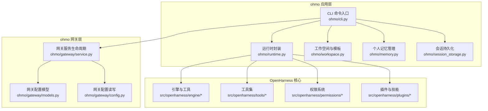
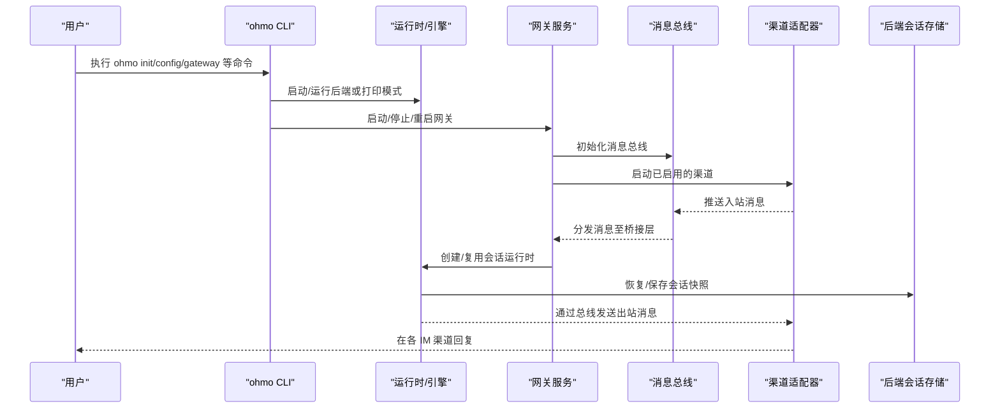
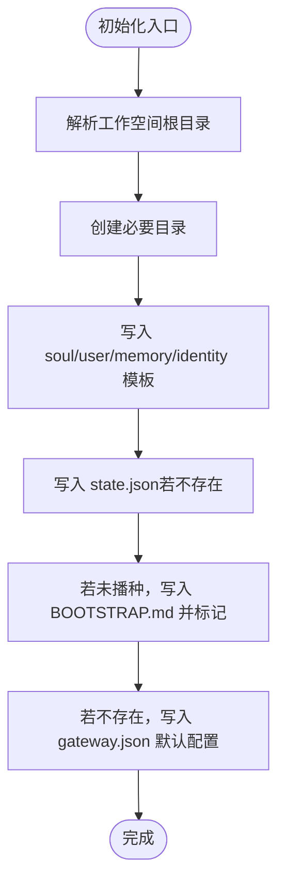
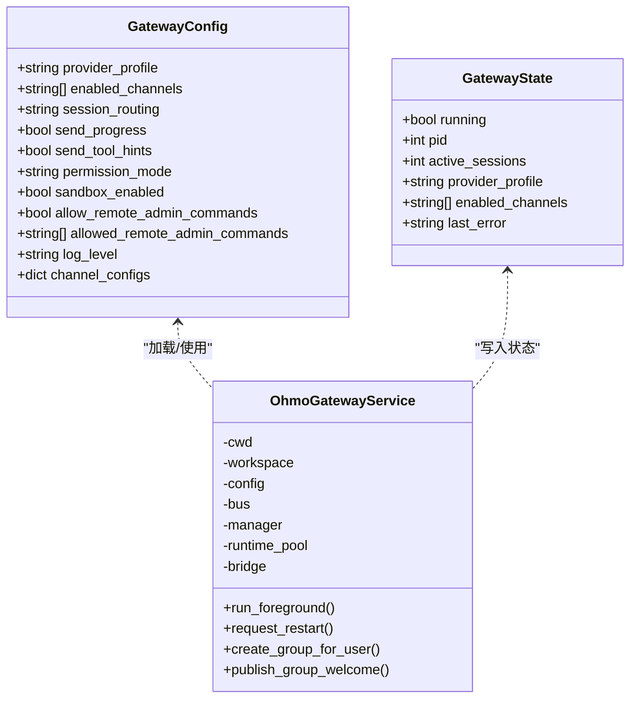
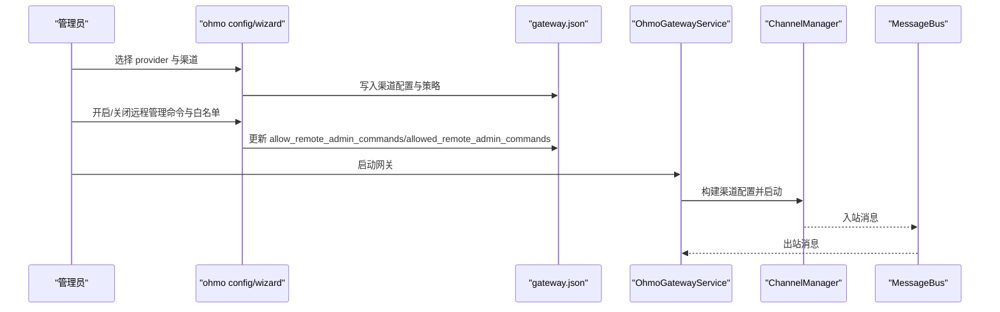
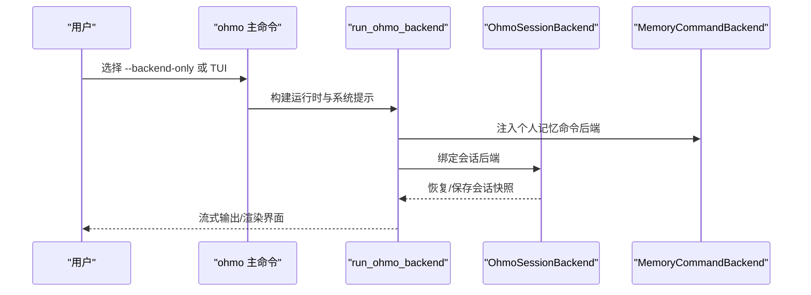
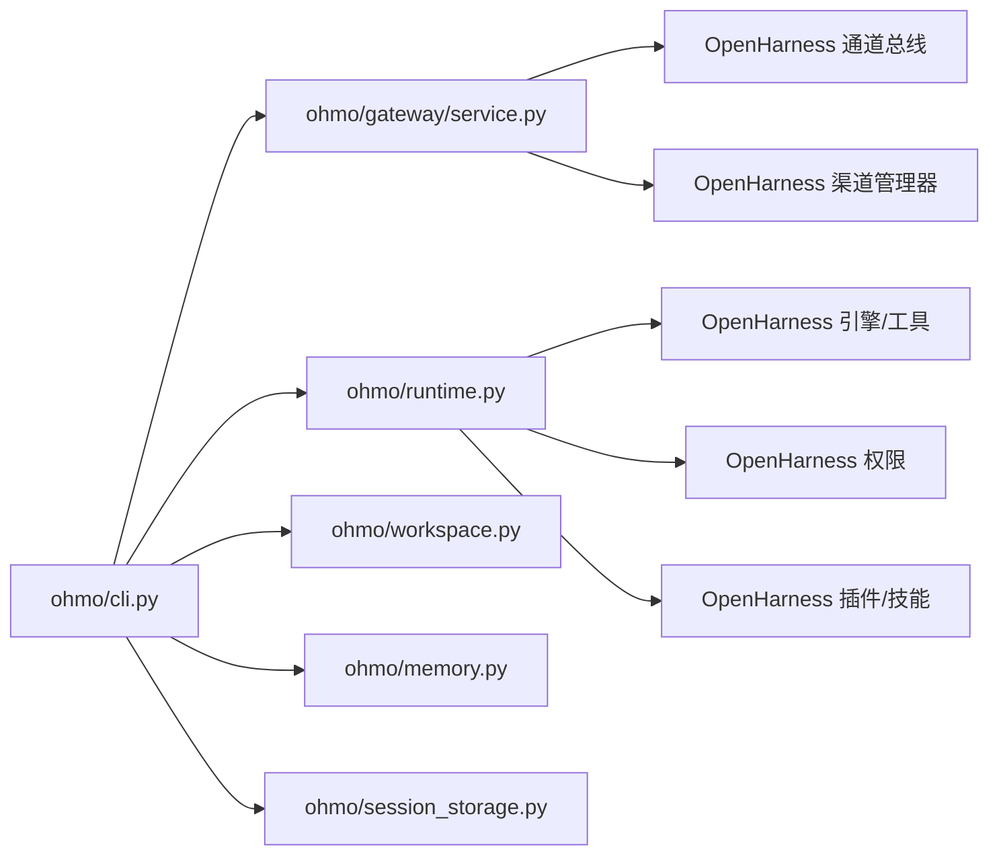

# ohmo个人代理

<cite>
**本文引用的文件**
- [ohmo/__init__.py](file://ohmo/__init__.py)
- [ohmo/__main__.py](file://ohmo/__main__.py)
- [ohmo/cli.py](file://ohmo/cli.py)
- [ohmo/runtime.py](file://ohmo/runtime.py)
- [ohmo/workspace.py](file://ohmo/workspace.py)
- [ohmo/memory.py](file://ohmo/memory.py)
- [ohmo/session_storage.py](file://ohmo/session_storage.py)
- [ohmo/gateway/__init__.py](file://ohmo/gateway/__init__.py)
- [ohmo/gateway/config.py](file://ohmo/gateway/config.py)
- [ohmo/gateway/models.py](file://ohmo/gateway/models.py)
- [ohmo/gateway/service.py](file://ohmo/gateway/service.py)
- [README.md](file://README.md)
- [docs/SHOWCASE.md](file://docs/SHOWCASE.md)
- [src/openharness/skills/bundled/content/plan.md](file://src/openharness/skills/bundled/content/plan.md)
- [src/openharness/skills/bundled/content/test.md](file://src/openharness/skills/bundled/content/test.md)
- [src/openharness/skills/bundled/content/review.md](file://src/openharness/skills/bundled/content/review.md)
- [src/openharness/skills/bundled/content/commit.md](file://src/openharness/skills/bundled/content/commit.md)
</cite>

## 目录
1. [简介](#简介)
2. [项目结构](#项目结构)
3. [核心组件](#核心组件)
4. [架构总览](#架构总览)
5. [详细组件分析](#详细组件分析)
6. [依赖关系分析](#依赖关系分析)
7. [性能考量](#性能考量)
8. [故障排查指南](#故障排查指南)
9. [结论](#结论)
10. [附录](#附录)

## 简介
ohmo 是一个基于 OpenHarness 的个人 AI 代理应用，旨在通过长期对话与自动化工作流，成为用户的“助理而非聊天机器人”。它支持在多个即时通讯渠道（Telegram、Slack、Discord、Feishu）中与用户交互，并能执行分支管理、代码编写、测试运行、PR 创建等实际开发任务。ohmo 的设计理念强调：
- 长期性：通过工作空间与记忆系统维持连续性
- 多渠道：统一网关适配不同 IM 平台
- 自动化：结合工具与技能，实现端到端的工程任务执行
- 安全与可治理：权限模式、路径规则与交互式确认

## 项目结构
ohmo 位于仓库的 ohmo 子目录下，围绕工作空间、网关、运行时与会话持久化组织模块；同时与 OpenHarness 的引擎、工具、权限、插件等子系统深度集成。

**图表来源**
- [ohmo/cli.py:1-676](file://ohmo/cli.py#L1-L676)
- [ohmo/runtime.py:1-203](file://ohmo/runtime.py#L1-L203)
- [ohmo/workspace.py:1-320](file://ohmo/workspace.py#L1-L320)
- [ohmo/memory.py:1-85](file://ohmo/memory.py#L1-L85)
- [ohmo/session_storage.py:1-203](file://ohmo/session_storage.py#L1-L203)
- [ohmo/gateway/models.py:1-34](file://ohmo/gateway/models.py#L1-L34)
- [ohmo/gateway/config.py:1-42](file://ohmo/gateway/config.py#L1-L42)
- [ohmo/gateway/service.py:1-429](file://ohmo/gateway/service.py#L1-L429)

**章节来源**
- [ohmo/cli.py:1-676](file://ohmo/cli.py#L1-L676)
- [ohmo/runtime.py:1-203](file://ohmo/runtime.py#L1-L203)
- [ohmo/workspace.py:1-320](file://ohmo/workspace.py#L1-L320)
- [ohmo/memory.py:1-85](file://ohmo/memory.py#L1-L85)
- [ohmo/session_storage.py:1-203](file://ohmo/session_storage.py#L1-L203)
- [ohmo/gateway/models.py:1-34](file://ohmo/gateway/models.py#L1-L34)
- [ohmo/gateway/config.py:1-42](file://ohmo/gateway/config.py#L1-L42)
- [ohmo/gateway/service.py:1-429](file://ohmo/gateway/service.py#L1-L429)

## 核心组件
- CLI 与命令入口：提供初始化、配置、医生检查、内存与 soul/user 文件管理、网关启停与状态查询等命令。
- 运行时：封装后端引擎与前端 TUI，支持打印模式与交互模式，注入系统提示与工作空间扩展。
- 工作空间：标准化 .ohmo 目录结构，生成 soul.md、user.md、identity.md、BOOTSTRAP.md、memory/、skills/、plugins/ 等模板与索引。
- 网关：统一管理渠道适配器、消息路由、状态持久化与重启通知，支持前台运行与后台进程管理。
- 会话存储：以原子写入方式保存会话快照、最新会话、按会话键恢复，导出 Markdown 转录。
- 个人记忆：对 MEMORY.md 与个人记忆条目进行增删查与内容注入。

**章节来源**
- [ohmo/cli.py:1-676](file://ohmo/cli.py#L1-L676)
- [ohmo/runtime.py:1-203](file://ohmo/runtime.py#L1-L203)
- [ohmo/workspace.py:1-320](file://ohmo/workspace.py#L1-L320)
- [ohmo/gateway/service.py:1-429](file://ohmo/gateway/service.py#L1-L429)
- [ohmo/session_storage.py:1-203](file://ohmo/session_storage.py#L1-L203)
- [ohmo/memory.py:1-85](file://ohmo/memory.py#L1-L85)

## 架构总览
ohmo 的整体架构由“CLI/运行时”、“工作空间/记忆/会话”和“网关服务”三层组成，向上复用 OpenHarness 的引擎、工具、权限与插件生态，向下对接多渠道 IM。

**图表来源**
- [ohmo/cli.py:414-676](file://ohmo/cli.py#L414-L676)
- [ohmo/runtime.py:28-203](file://ohmo/runtime.py#L28-L203)
- [ohmo/gateway/service.py:39-233](file://ohmo/gateway/service.py#L39-L233)
- [ohmo/session_storage.py:151-203](file://ohmo/session_storage.py#L151-L203)

## 详细组件分析

### 工作空间与引导文件
- 工作空间根目录：默认 ~/.ohmo，可通过环境变量或参数覆盖。
- 模板文件：
  - soul.md：长期人格与行为边界，指导代理如何表现与决策。
  - identity.md：代理身份形状与签名。
  - user.md：用户画像、偏好与上下文。
  - BOOTSTRAP.md：首次接触的落地流程，完成后可删除。
  - memory/MEMORY.md：个人记忆索引与条目集合。
  - skills/、plugins/、groups/、sessions/、logs/、attachments/：扩展与运行所需目录。
- 初始化逻辑：确保目录存在、写入模板、生成 state.json 与 gateway.json 默认值。

**图表来源**
- [ohmo/workspace.py:252-301](file://ohmo/workspace.py#L252-L301)

**章节来源**
- [ohmo/workspace.py:1-320](file://ohmo/workspace.py#L1-L320)

### 网关系统（渠道适配、路由与状态）
- 配置模型：包含 provider_profile、启用渠道列表、会话路由策略、进度与工具提示开关、权限模式、沙箱开关、远程管理命令策略、日志级别与各渠道配置字典。
- 配置读写：从 .ohmo/gateway.json 加载/保存；构建渠道兼容配置对象。
- 服务生命周期：
  - 前台运行：启动桥接层与渠道管理器，发布重启提示，信号处理优雅退出。
  - 后台进程：detached 子进程启动，记录 pid 与日志文件，支持查询/停止/重启。
  - 状态持久化：state.json 记录运行态、活跃会话数、错误信息等。
- 桥接层职责：将入站消息路由到运行时池，处理重启请求与群组欢迎消息发布。

**图表来源**
- [ohmo/gateway/models.py:8-34](file://ohmo/gateway/models.py#L8-L34)
- [ohmo/gateway/service.py:39-144](file://ohmo/gateway/service.py#L39-L144)

**章节来源**
- [ohmo/gateway/models.py:1-34](file://ohmo/gateway/models.py#L1-L34)
- [ohmo/gateway/config.py:1-42](file://ohmo/gateway/config.py#L1-L42)
- [ohmo/gateway/service.py:1-429](file://ohmo/gateway/service.py#L1-L429)

### 渠道配置与交互流程（Telegram/Slack/Discord/Feishu）
- 可交互渠道：telegram、slack、discord、feishu。
- 配置向导：逐渠道询问启用与否、允许来源（用户/群组 ID 列表）、令牌与策略（如 Slack 的 socket 模式、回复线程、群组策略；Discord 的 gateway URL 与 intents；Feishu 的 app_id/secret/encrypt_key/verification_token、反应表情、群组策略与 bot 名称/open_id）。
- 远程管理命令：可选择性开启并指定允许的斜杠命令白名单，仅在明确授权时生效。
- 日志级别：根据 gateway.json 中 log_level 设置前台日志等级。

**图表来源**
- [ohmo/cli.py:194-360](file://ohmo/cli.py#L194-L360)
- [ohmo/gateway/config.py:29-42](file://ohmo/gateway/config.py#L29-L42)
- [ohmo/gateway/service.py:39-74](file://ohmo/gateway/service.py#L39-L74)

**章节来源**
- [ohmo/cli.py:194-360](file://ohmo/cli.py#L194-L360)
- [ohmo/gateway/config.py:1-42](file://ohmo/gateway/config.py#L1-L42)
- [ohmo/gateway/service.py:1-144](file://ohmo/gateway/service.py#L1-L144)

### 运行时与会话生命周期
- 后端运行：构建系统提示（含工作空间注入）、会话后端、额外技能与插件目录、内存命令后端，支持最大轮次与模型覆盖。
- React TUI 启动：检测/安装前端依赖，传递后端命令给 TSX 运行器，实现交互式体验。
- 打印模式：单次提示输出助手文本，适合脚本与管道。
- 会话存储：保存最新会话、按会话键恢复、列出历史、导出 Markdown 转录，使用原子写入保证一致性。

**图表来源**
- [ohmo/runtime.py:28-139](file://ohmo/runtime.py#L28-L139)
- [ohmo/session_storage.py:151-203](file://ohmo/session_storage.py#L151-L203)
- [ohmo/memory.py:74-85](file://ohmo/memory.py#L74-L85)

**章节来源**
- [ohmo/runtime.py:1-203](file://ohmo/runtime.py#L1-L203)
- [ohmo/session_storage.py:1-203](file://ohmo/session_storage.py#L1-L203)
- [ohmo/memory.py:1-85](file://ohmo/memory.py#L1-L85)

### 个人记忆与个性化
- 个人记忆：以 MEMORY.md 为索引，新增条目自动追加到索引；删除条目同步移除索引项。
- 记忆注入：在系统提示中拼接 MEMORY.md 与若干条目内容，帮助模型获得稳定上下文。
- 个性化：通过 soul.md 与 user.md 描述代理的人格、边界与用户画像，影响对话风格与决策。

**章节来源**
- [ohmo/memory.py:1-85](file://ohmo/memory.py#L1-L85)
- [ohmo/workspace.py:11-154](file://ohmo/workspace.py#L11-L154)

### 日常使用场景（基于技能与工具）
- 规划设计：使用 plan 技能进行需求理解、探索代码库、设计步骤与验证方案。
- 编写与运行测试：使用 test 技能遵循项目测试范式，编写独立、确定且快速的测试，并运行验证。
- 代码审查：使用 review 技能从缺陷、安全、性能、测试与风格维度进行反馈。
- 提交与 PR：使用 commit 技能进行干净的提交与 PR 准备，遵循最佳实践。

**章节来源**
- [src/openharness/skills/bundled/content/plan.md:1-35](file://src/openharness/skills/bundled/content/plan.md#L1-L35)
- [src/openharness/skills/bundled/content/test.md:1-32](file://src/openharness/skills/bundled/content/test.md#L1-L32)
- [src/openharness/skills/bundled/content/review.md:1-27](file://src/openharness/skills/bundled/content/review.md#L1-L27)
- [src/openharness/skills/bundled/content/commit.md:1-26](file://src/openharness/skills/bundled/content/commit.md#L1-L26)

## 依赖关系分析
- ohmo/cli.py 依赖：
  - OpenHarness 认证与设置加载（用于 provider profile 状态）
  - ohmo/gateway.config 与 models（网关配置）
  - ohmo/gateway.service（网关生命周期）
  - ohmo.runtime（后端/前端运行）
  - ohmo.session_storage（会话后端）
  - ohmo.workspace（工作空间路径与健康检查）
- ohmo/runtime.py 依赖：
  - OpenHarness 引擎事件与 UI 后端主机
  - ohmo.memory（个人记忆命令后端）
  - ohmo.session_storage（会话后端）
  - ohmo.workspace（扩展技能/插件目录）
- ohmo/gateway/service.py 依赖：
  - OpenHarness 通道总线与渠道管理器
  - ohmo.gateway.config 与 models
  - ohmo.gateway.runtime（会话运行时池）

**图表来源**
- [ohmo/cli.py:12-34](file://ohmo/cli.py#L12-L34)
- [ohmo/runtime.py:11-20](file://ohmo/runtime.py#L11-L20)
- [ohmo/gateway/service.py:19-33](file://ohmo/gateway/service.py#L19-L33)

**章节来源**
- [ohmo/cli.py:1-676](file://ohmo/cli.py#L1-L676)
- [ohmo/runtime.py:1-203](file://ohmo/runtime.py#L1-L203)
- [ohmo/gateway/service.py:1-429](file://ohmo/gateway/service.py#L1-L429)

## 性能考量
- 上下文压缩与自动紧凑：在长时间会话中保持任务状态与通道日志，减少频繁清理带来的中断。
- 并行工具执行：提升多任务并发效率。
- 原子写入与最小化磁盘争用：会话快照与记忆索引采用原子写入，降低竞态风险。
- 前端依赖按需安装：React TUI 在首次运行时安装依赖，避免重复安装成本。
- 进程级网关管理：后台进程分离与信号处理，便于在资源受限环境下稳定运行。

[本节为通用性能建议，不直接分析具体文件]

## 故障排查指南
- 医生检查：使用 doctor 命令输出工作空间、关键文件与可用 provider profile 的健康状态，定位缺失项。
- 网关状态：status 命令显示运行态、PID、活跃会话数与最后错误；若无前台进程，尝试重启。
- 重启通知：当网关因配置变更需要重启时，桥接层会先发布“已恢复”的提示，再触发重启。
- 进程管理：stop_gateway_process 会扫描并终止匹配的网关进程，清理 pid 文件；gateway_status 会清理无效 pid 并更新状态。
- 日志级别：通过 gateway.json 的 log_level 控制前台日志详细程度。

**章节来源**
- [ohmo/cli.py:536-560](file://ohmo/cli.py#L536-L560)
- [ohmo/gateway/service.py:394-429](file://ohmo/gateway/service.py#L394-L429)

## 结论
ohmo 将 OpenHarness 的引擎、工具与治理能力整合为一个可长期演进的个人代理。通过标准化的工作空间、强大的网关与渠道适配、完善的会话与记忆系统，ohmo 能够在多平台环境中持续为用户提供从规划、编码、测试到提交的全流程自动化支持。其可配置的 provider profile 与远程管理命令白名单，既满足灵活性也保障了安全性。

[本节为总结，不直接分析具体文件]

## 附录

### ohmo 的日常使用场景（示例）
- 规划阶段：要求代理先理解需求、探索代码库、设计实现步骤与验证方法。
- 测试阶段：编写符合项目范式的单元测试，确保独立、确定与快速，并运行验证。
- 审查阶段：对变更进行全面的质量与安全评估，给出具体、可操作的反馈。
- 提交流程：准备干净的提交信息与 PR，遵循团队规范与最佳实践。

**章节来源**
- [src/openharness/skills/bundled/content/plan.md:1-35](file://src/openharness/skills/bundled/content/plan.md#L1-L35)
- [src/openharness/skills/bundled/content/test.md:1-32](file://src/openharness/skills/bundled/content/test.md#L1-L32)
- [src/openharness/skills/bundled/content/review.md:1-27](file://src/openharness/skills/bundled/content/review.md#L1-L27)
- [src/openharness/skills/bundled/content/commit.md:1-26](file://src/openharness/skills/bundled/content/commit.md#L1-L26)

### 使用参考与更多示例
- 快速开始与 ohmo 个人代理介绍：参见 README 的“Quick Start”与“ohmo Personal Agent”章节。
- 展示案例与可复现实战：参见 docs/SHOWCASE.md。

**章节来源**
- [README.md:243-251](file://README.md#L243-L251)
- [README.md:647-703](file://README.md#L647-L703)
- [docs/SHOWCASE.md:1-81](file://docs/SHOWCASE.md#L1-L81)