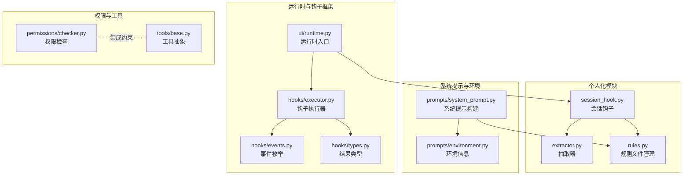
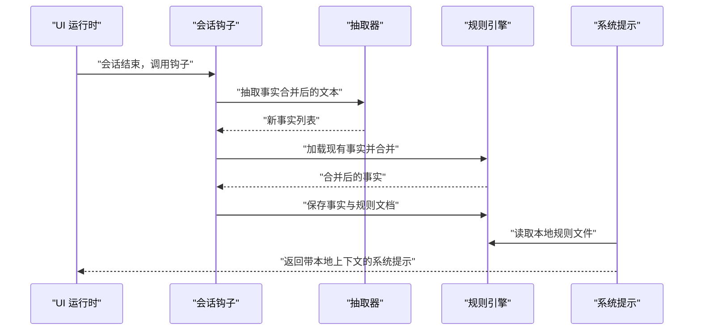
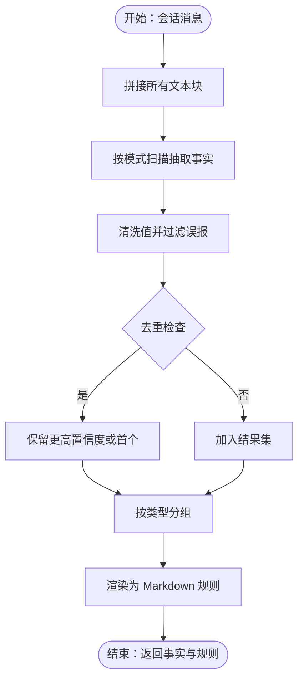
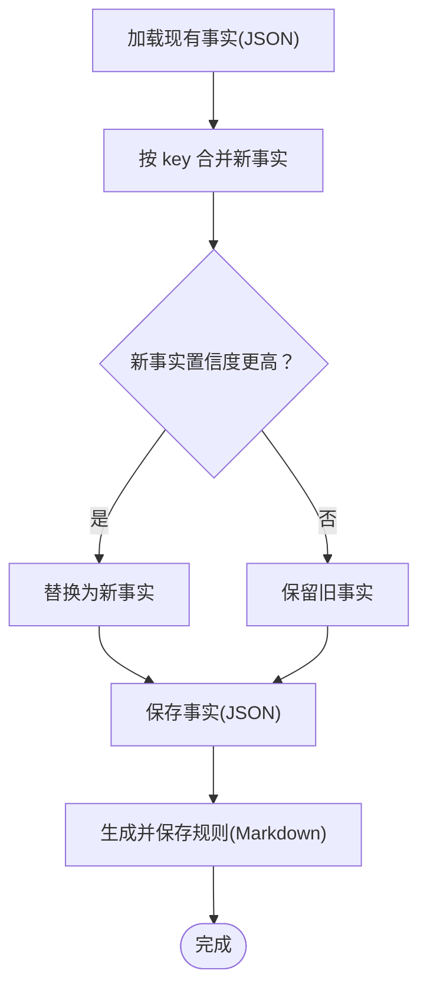
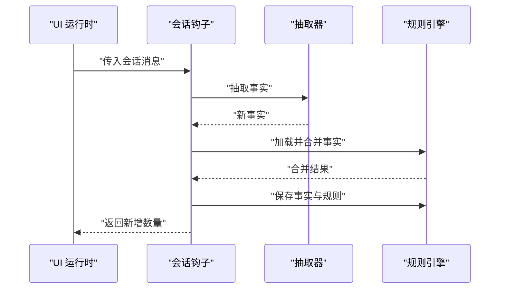
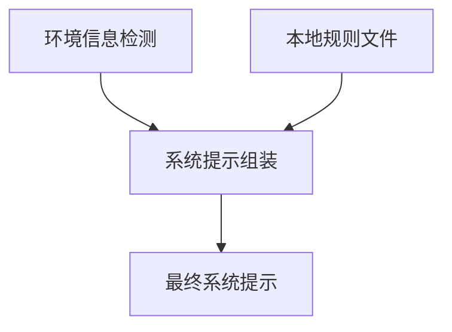
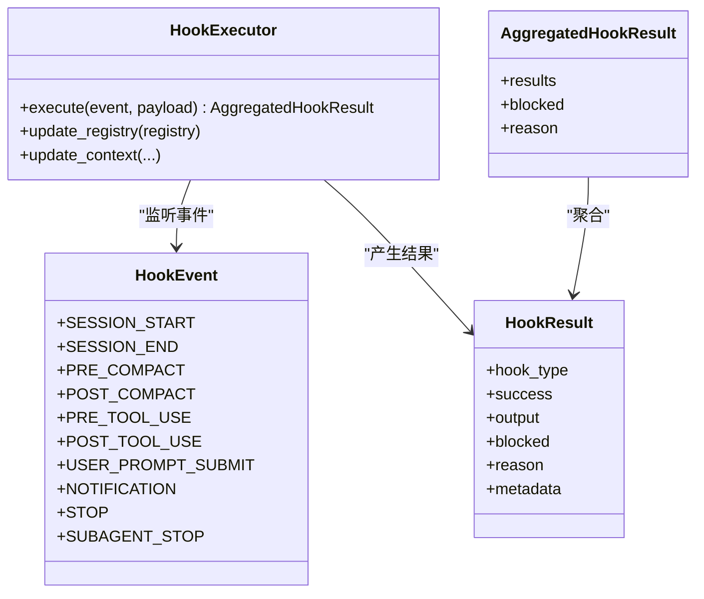
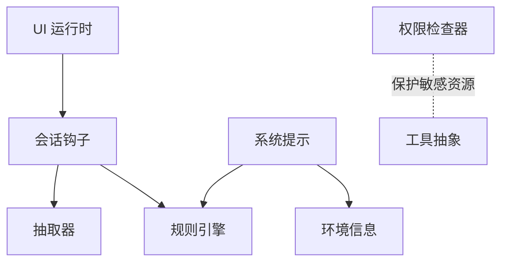

# 个人化系统

<cite>
**本文引用的文件**
- [src/openharness/personalization/__init__.py](file://src/openharness/personalization/__init__.py)
- [src/openharness/personalization/extractor.py](file://src/openharness/personalization/extractor.py)
- [src/openharness/personalization/rules.py](file://src/openharness/personalization/rules.py)
- [src/openharness/personalization/session_hook.py](file://src/openharness/personalization/session_hook.py)
- [src/openharness/ui/runtime.py](file://src/openharness/ui/runtime.py)
- [src/openharness/hooks/events.py](file://src/openharness/hooks/events.py)
- [src/openharness/hooks/executor.py](file://src/openharness/hooks/executor.py)
- [src/openharness/hooks/types.py](file://src/openharness/hooks/types.py)
- [src/openharness/prompts/system_prompt.py](file://src/openharness/prompts/system_prompt.py)
- [src/openharness/prompts/environment.py](file://src/openharness/prompts/environment.py)
- [src/openharness/permissions/checker.py](file://src/openharness/permissions/checker.py)
- [src/openharness/tools/base.py](file://src/openharness/tools/base.py)
- [tests/test_personalization/test_extractor.py](file://tests/test_personalization/test_extractor.py)
- [tests/test_prompts/test_claudemd.py](file://tests/test_prompts/test_claudemd.py)
</cite>

## 目录
1. [简介](#简介)
2. [项目结构](#项目结构)
3. [核心组件](#核心组件)
4. [架构总览](#架构总览)
5. [详细组件分析](#详细组件分析)
6. [依赖分析](#依赖分析)
7. [性能考虑](#性能考虑)
8. [故障排查指南](#故障排查指南)
9. [结论](#结论)
10. [附录：配置与最佳实践](#附录配置与最佳实践)

## 简介
本文件系统性阐述 OpenHarness 的个人化系统，涵盖个人化提取器、规则引擎与个人化会话钩子的设计与实现；解释个人化数据（用户偏好、行为模式、上下文信息）的提取机制；说明本地规则的定义与合并策略；阐述个人化会话钩子在生命周期中的工作原理与应用场景；给出配置示例与最佳实践；说明与权限系统、工具系统的集成方式；并讨论隐私保护与安全处理、效果评估与优化方法，以及自定义个人化规则的开发指南。

## 项目结构
个人化系统位于 src/openharness/personalization 目录，围绕“抽取—持久化—会话钩子—系统提示集成”形成闭环。UI 运行时在会话结束阶段调用个人化钩子，将对话历史转换为本地规则，并写入本地文件，供后续系统提示构建使用。

**图表来源**
- [src/openharness/personalization/extractor.py:1-139](file://src/openharness/personalization/extractor.py#L1-L139)
- [src/openharness/personalization/rules.py:1-65](file://src/openharness/personalization/rules.py#L1-L65)
- [src/openharness/personalization/session_hook.py:1-66](file://src/openharness/personalization/session_hook.py#L1-L66)
- [src/openharness/ui/runtime.py:403-422](file://src/openharness/ui/runtime.py#L403-L422)
- [src/openharness/hooks/executor.py:1-243](file://src/openharness/hooks/executor.py#L1-L243)
- [src/openharness/hooks/events.py:1-21](file://src/openharness/hooks/events.py#L1-L21)
- [src/openharness/hooks/types.py:1-39](file://src/openharness/hooks/types.py#L1-L39)
- [src/openharness/prompts/system_prompt.py:1-110](file://src/openharness/prompts/system_prompt.py#L1-L110)
- [src/openharness/prompts/environment.py:1-136](file://src/openharness/prompts/environment.py#L1-L136)
- [src/openharness/permissions/checker.py:1-201](file://src/openharness/permissions/checker.py#L1-L201)
- [src/openharness/tools/base.py:1-81](file://src/openharness/tools/base.py#L1-L81)

**章节来源**
- [src/openharness/personalization/__init__.py:1-7](file://src/openharness/personalization/__init__.py#L1-L7)
- [src/openharness/personalization/extractor.py:1-139](file://src/openharness/personalization/extractor.py#L1-L139)
- [src/openharness/personalization/rules.py:1-65](file://src/openharness/personalization/rules.py#L1-L65)
- [src/openharness/personalization/session_hook.py:1-66](file://src/openharness/personalization/session_hook.py#L1-L66)
- [src/openharness/ui/runtime.py:403-422](file://src/openharness/ui/runtime.py#L403-L422)

## 核心组件
- 个人化抽取器：从会话消息中抽取事实（如 SSH 主机、IP、数据路径、Conda 环境、Python 版本、API 端点、环境变量、Git 远端、Ray 集群、计划任务等），并进行去重与置信度管理。
- 规则引擎：负责本地规则文件（Markdown）与事实（JSON）的读写、合并与去重，支持按 key 去重与置信度更新策略。
- 个人化会话钩子：在会话结束时自动抽取并持久化规则，生成规则文档，并记录日志统计新增数量。
- 系统提示集成：系统提示构建器可读取本地规则文件，将其注入到系统提示中，使模型在后续交互中获得本地化上下文。
- 权限与工具：权限检查器对敏感路径与命令进行保护，工具抽象提供统一的工具接口，二者共同保障个人化数据的安全使用。

**章节来源**
- [src/openharness/personalization/extractor.py:46-139](file://src/openharness/personalization/extractor.py#L46-L139)
- [src/openharness/personalization/rules.py:18-65](file://src/openharness/personalization/rules.py#L18-L65)
- [src/openharness/personalization/session_hook.py:22-66](file://src/openharness/personalization/session_hook.py#L22-L66)
- [src/openharness/prompts/system_prompt.py:88-110](file://src/openharness/prompts/system_prompt.py#L88-L110)
- [src/openharness/permissions/checker.py:14-37](file://src/openharness/permissions/checker.py#L14-L37)
- [src/openharness/tools/base.py:35-81](file://src/openharness/tools/base.py#L35-L81)

## 架构总览
个人化系统通过“抽取—合并—落盘—提示注入”的链路实现自动化的本地规则沉淀与复用。运行时在会话结束阶段触发个人化钩子，将对话文本汇总后交由抽取器识别事实，再与已有事实合并并持久化，最后生成规则文档。系统提示构建器在组装提示时读取本地规则，确保模型具备本地上下文。

**图表来源**
- [src/openharness/ui/runtime.py:408-413](file://src/openharness/ui/runtime.py#L408-L413)
- [src/openharness/personalization/session_hook.py:22-66](file://src/openharness/personalization/session_hook.py#L22-L66)
- [src/openharness/personalization/extractor.py:46-98](file://src/openharness/personalization/extractor.py#L46-L98)
- [src/openharness/personalization/rules.py:18-47](file://src/openharness/personalization/rules.py#L18-L47)
- [src/openharness/prompts/system_prompt.py:88-110](file://src/openharness/prompts/system_prompt.py#L88-L110)

## 详细组件分析

### 抽取器（extractor）
- 功能要点
  - 将会话消息中的文本块拼接为单一字符串，统一交给正则模式库抽取事实。
  - 内置多类事实模式（SSH 主机、IP、数据路径、Conda 环境、Python 版本、API 端点、环境变量、Git 远端、Ray 集群、计划任务等）。
  - 对抽取结果进行去重（基于 key）、过滤（如跳过常见回环地址）、置信度标注与分组输出。
  - 提供将事实转为 Markdown 规则文档的能力，便于人工审阅与维护。
- 关键流程
  - 文本聚合 → 正则扫描 → 值清洗与过滤 → 去重与置信度比较 → 结果分组与渲染。

**图表来源**
- [src/openharness/personalization/extractor.py:46-98](file://src/openharness/personalization/extractor.py#L46-L98)
- [src/openharness/personalization/extractor.py:101-139](file://src/openharness/personalization/extractor.py#L101-L139)

**章节来源**
- [src/openharness/personalization/extractor.py:10-43](file://src/openharness/personalization/extractor.py#L10-L43)
- [src/openharness/personalization/extractor.py:46-76](file://src/openharness/personalization/extractor.py#L46-L76)
- [src/openharness/personalization/extractor.py:101-139](file://src/openharness/personalization/extractor.py#L101-L139)
- [tests/test_personalization/test_extractor.py:7-58](file://tests/test_personalization/test_extractor.py#L7-L58)

### 规则引擎（rules）
- 功能要点
  - 统一管理本地规则目录与文件（规则 Markdown 与事实 JSON），提供加载、保存、合并与去重能力。
  - 合并策略：以 key 为唯一标识，若新事实置信度更高则替换旧事实；否则保留旧事实。
  - 记录最后更新时间，便于审计与版本感知。
- 关键流程
  - 加载现有事实 → 合并新事实 → 写回事实与规则文件。

**图表来源**
- [src/openharness/personalization/rules.py:18-47](file://src/openharness/personalization/rules.py#L18-L47)
- [src/openharness/personalization/rules.py:49-65](file://src/openharness/personalization/rules.py#L49-L65)

**章节来源**
- [src/openharness/personalization/rules.py:9-11](file://src/openharness/personalization/rules.py#L9-L11)
- [src/openharness/personalization/rules.py:18-47](file://src/openharness/personalization/rules.py#L18-L47)
- [src/openharness/personalization/rules.py:49-65](file://src/openharness/personalization/rules.py#L49-L65)
- [tests/test_personalization/test_extractor.py:60-79](file://tests/test_personalization/test_extractor.py#L60-L79)

### 个人化会话钩子（session_hook）
- 功能要点
  - 在会话结束时被 UI 运行时调用，自动抽取并持久化本地规则。
  - 收集消息中的文本块，合并后交给抽取器；若无新事实则直接返回。
  - 合并与落盘后，记录日志统计新增数量，保证不影响会话关闭流程。
- 调用链
  - UI 运行时在关闭阶段调用钩子 → 钩子执行抽取与合并 → 保存事实与规则 → 返回新增计数。

**图表来源**
- [src/openharness/ui/runtime.py:408-413](file://src/openharness/ui/runtime.py#L408-L413)
- [src/openharness/personalization/session_hook.py:22-66](file://src/openharness/personalization/session_hook.py#L22-L66)
- [src/openharness/personalization/extractor.py:46-98](file://src/openharness/personalization/extractor.py#L46-L98)
- [src/openharness/personalization/rules.py:18-47](file://src/openharness/personalization/rules.py#L18-L47)

**章节来源**
- [src/openharness/personalization/session_hook.py:22-66](file://src/openharness/personalization/session_hook.py#L22-L66)
- [src/openharness/ui/runtime.py:408-413](file://src/openharness/ui/runtime.py#L408-L413)

### 系统提示集成（system_prompt 与 environment）
- 功能要点
  - 系统提示构建器在组装提示时读取环境信息与本地规则文件，将环境与本地规则注入提示，提升模型对当前工作空间的理解与适配能力。
  - 环境信息包括操作系统、架构、Shell、工作目录、日期、Python 版本、虚拟环境、Git 仓库与分支等。
- 安全注意
  - 测试覆盖了敏感变量（如密钥）不会被写入规则或提示，体现了对隐私与安全的关注。

**图表来源**
- [src/openharness/prompts/system_prompt.py:88-110](file://src/openharness/prompts/system_prompt.py#L88-L110)
- [src/openharness/prompts/environment.py:104-136](file://src/openharness/prompts/environment.py#L104-L136)
- [tests/test_prompts/test_claudemd.py:127-147](file://tests/test_prompts/test_claudemd.py#L127-L147)

**章节来源**
- [src/openharness/prompts/system_prompt.py:88-110](file://src/openharness/prompts/system_prompt.py#L88-L110)
- [src/openharness/prompts/environment.py:18-36](file://src/openharness/prompts/environment.py#L18-L36)
- [tests/test_prompts/test_claudemd.py:127-147](file://tests/test_prompts/test_claudemd.py#L127-L147)

### 钩子框架与事件（hooks）
- 功能要点
  - 事件枚举定义了 SESSION_START、SESSION_END 等生命周期事件。
  - 钩子执行器支持命令、HTTP、提示型与代理型钩子，统一执行与结果聚合。
  - 个人化钩子属于会话生命周期的一部分，可在 SESSION_END 事件中被调用。
- 结果类型
  - HookResult 与 AggregatedHookResult 提供成功/失败、阻断原因与元数据，便于上层决策。

**图表来源**
- [src/openharness/hooks/events.py:8-21](file://src/openharness/hooks/events.py#L8-L21)
- [src/openharness/hooks/executor.py:41-79](file://src/openharness/hooks/executor.py#L41-L79)
- [src/openharness/hooks/types.py:9-39](file://src/openharness/hooks/types.py#L9-L39)

**章节来源**
- [src/openharness/hooks/events.py:8-21](file://src/openharness/hooks/events.py#L8-L21)
- [src/openharness/hooks/executor.py:64-78](file://src/openharness/hooks/executor.py#L64-L78)
- [src/openharness/hooks/types.py:9-39](file://src/openharness/hooks/types.py#L9-L39)

## 依赖分析
- 模块内聚与耦合
  - 抽取器与规则引擎低耦合：抽取器专注事实抽取，规则引擎专注持久化与合并，职责清晰。
  - 会话钩子作为编排者，依赖抽取器与规则引擎，但不暴露内部细节。
  - UI 运行时仅在会话结束阶段调用钩子，避免阻塞主流程。
- 外部依赖与集成点
  - 系统提示构建器依赖环境信息与本地规则文件，形成“环境 + 本地规则”的上下文。
  - 权限检查器对敏感路径与命令进行保护，防止个人化数据被不当访问或泄露。
  - 工具抽象提供统一接口，确保工具调用在受控模式下进行。

**图表来源**
- [src/openharness/personalization/session_hook.py:1-17](file://src/openharness/personalization/session_hook.py#L1-L17)
- [src/openharness/personalization/extractor.py:1-139](file://src/openharness/personalization/extractor.py#L1-L139)
- [src/openharness/personalization/rules.py:1-65](file://src/openharness/personalization/rules.py#L1-L65)
- [src/openharness/ui/runtime.py:408-413](file://src/openharness/ui/runtime.py#L408-L413)
- [src/openharness/prompts/system_prompt.py:88-110](file://src/openharness/prompts/system_prompt.py#L88-L110)
- [src/openharness/prompts/environment.py:104-136](file://src/openharness/prompts/environment.py#L104-L136)
- [src/openharness/permissions/checker.py:14-37](file://src/openharness/permissions/checker.py#L14-L37)
- [src/openharness/tools/base.py:35-81](file://src/openharness/tools/base.py#L35-L81)

**章节来源**
- [src/openharness/personalization/session_hook.py:1-17](file://src/openharness/personalization/session_hook.py#L1-L17)
- [src/openharness/ui/runtime.py:408-413](file://src/openharness/ui/runtime.py#L408-L413)
- [src/openharness/prompts/system_prompt.py:88-110](file://src/openharness/prompts/system_prompt.py#L88-L110)

## 性能考虑
- 抽取复杂度
  - 正则扫描线性于文本长度，模式数量有限，整体近似 O(n)。
  - 去重与合并使用字典映射，平均 O(1) 查找，整体 O(m)（m 为抽取事实数）。
- I/O 成本
  - 规则文件与事实文件读写为小文件，I/O 成本较低；建议在会话结束阶段异步或后台处理，避免阻塞主线程。
- 日志与可观测性
  - 会话钩子记录新增事实数量，便于监控与容量规划。

[本节为通用性能讨论，无需具体文件分析]

## 故障排查指南
- 无新事实
  - 若会话中未出现可识别的事实，钩子将返回 0；检查消息内容是否包含目标模式或是否被过滤。
- 规则未生效
  - 确认系统提示构建器已正确读取本地规则文件；检查规则文件是否存在且格式正确。
- 权限问题
  - 若涉及敏感路径或命令，权限检查器可能阻止工具执行；调整权限模式或规则后再试。
- 隐私与安全
  - 确保敏感信息（如密钥）未被写入规则；测试覆盖了密钥不落入提示的场景。

**章节来源**
- [src/openharness/personalization/session_hook.py:41-66](file://src/openharness/personalization/session_hook.py#L41-L66)
- [src/openharness/prompts/system_prompt.py:88-110](file://src/openharness/prompts/system_prompt.py#L88-L110)
- [src/openharness/permissions/checker.py:88-98](file://src/openharness/permissions/checker.py#L88-L98)
- [tests/test_prompts/test_claudemd.py:134-147](file://tests/test_prompts/test_claudemd.py#L134-L147)

## 结论
OpenHarness 的个人化系统通过抽取器、规则引擎与会话钩子实现了“自动抽取—持久化—提示注入”的闭环，既提升了模型对本地环境的理解，又通过权限与安全策略保障了数据隐私。该设计具备良好的扩展性与可维护性，适合在多场景下持续演进。

[本节为总结，无需具体文件分析]

## 附录：配置与最佳实践

### 个人化配置示例
- 规则文件位置
  - 规则 Markdown 文件与事实 JSON 文件默认存储在用户主目录下的固定路径，可通过环境变量或设置进行覆盖（若存在）。
- 规则内容
  - 自动生成的规则文档按类别分段展示，便于人工审阅与维护；建议定期清理重复与过期条目。

**章节来源**
- [src/openharness/personalization/rules.py:9-11](file://src/openharness/personalization/rules.py#L9-L11)
- [src/openharness/personalization/extractor.py:101-139](file://src/openharness/personalization/extractor.py#L101-L139)

### 最佳实践
- 保持会话钩子为“尽力而为”：即使个人化失败也不应阻塞会话关闭。
- 定期审查与清理规则：避免规则膨胀影响系统提示体积与加载性能。
- 严格控制敏感信息：确保密钥、令牌等不被写入规则或提示。
- 分类管理事实：优先保留高置信度与高频使用的事实，降低误报影响。

**章节来源**
- [src/openharness/ui/runtime.py:412-413](file://src/openharness/ui/runtime.py#L412-L413)
- [src/openharness/personalization/rules.py:49-65](file://src/openharness/personalization/rules.py#L49-L65)
- [tests/test_prompts/test_claudemd.py:134-147](file://tests/test_prompts/test_claudemd.py#L134-L147)

### 与权限系统、工具系统的集成
- 权限系统
  - 对敏感路径与命令进行内置保护，防止个人化过程中的工具调用导致凭证泄露。
- 工具系统
  - 工具抽象提供统一接口，确保工具在不同权限模式下可控执行；个人化规则仅作为提示上下文，不直接驱动工具调用。

**章节来源**
- [src/openharness/permissions/checker.py:14-37](file://src/openharness/permissions/checker.py#L14-L37)
- [src/openharness/tools/base.py:35-81](file://src/openharness/tools/base.py#L35-L81)

### 隐私保护与安全处理
- 敏感信息过滤：抽取器对常见误报（如回环地址）进行过滤；规则引擎与系统提示构建器避免将密钥等敏感信息写入规则或提示。
- 权限控制：权限检查器对高价值凭证路径进行强制保护，拒绝 LLM 或提示注入驱动的访问。

**章节来源**
- [src/openharness/personalization/extractor.py:58-65](file://src/openharness/personalization/extractor.py#L58-L65)
- [src/openharness/permissions/checker.py:14-37](file://src/openharness/permissions/checker.py#L14-L37)
- [tests/test_prompts/test_claudemd.py:134-147](file://tests/test_prompts/test_claudemd.py#L134-L147)

### 个人化效果评估与优化
- 指标建议
  - 新增事实数量趋势、规则命中率、会话任务成功率、用户反馈评分。
- 优化方向
  - 调整正则模式权重与阈值，减少误报；引入置信度学习；定期清理无效规则；结合用户行为与任务类型动态调整规则优先级。

[本节为通用指导，无需具体文件分析]

### 自定义个人化规则开发指南
- 扩展抽取模式
  - 在抽取器中添加新的正则模式与标签，确保值清洗与去重逻辑一致。
- 自定义规则文件
  - 通过规则引擎提供的接口读写规则文件，遵循现有命名与目录约定。
- 集成到会话钩子
  - 在会话结束阶段调用钩子，确保异常不影响会话关闭；记录日志以便追踪。
- 安全与合规
  - 严格过滤敏感信息；遵守权限策略；在测试中验证规则不泄露敏感数据。

**章节来源**
- [src/openharness/personalization/extractor.py:10-43](file://src/openharness/personalization/extractor.py#L10-L43)
- [src/openharness/personalization/rules.py:18-47](file://src/openharness/personalization/rules.py#L18-L47)
- [src/openharness/personalization/session_hook.py:22-66](file://src/openharness/personalization/session_hook.py#L22-L66)
- [tests/test_personalization/test_extractor.py:7-58](file://tests/test_personalization/test_extractor.py#L7-L58)