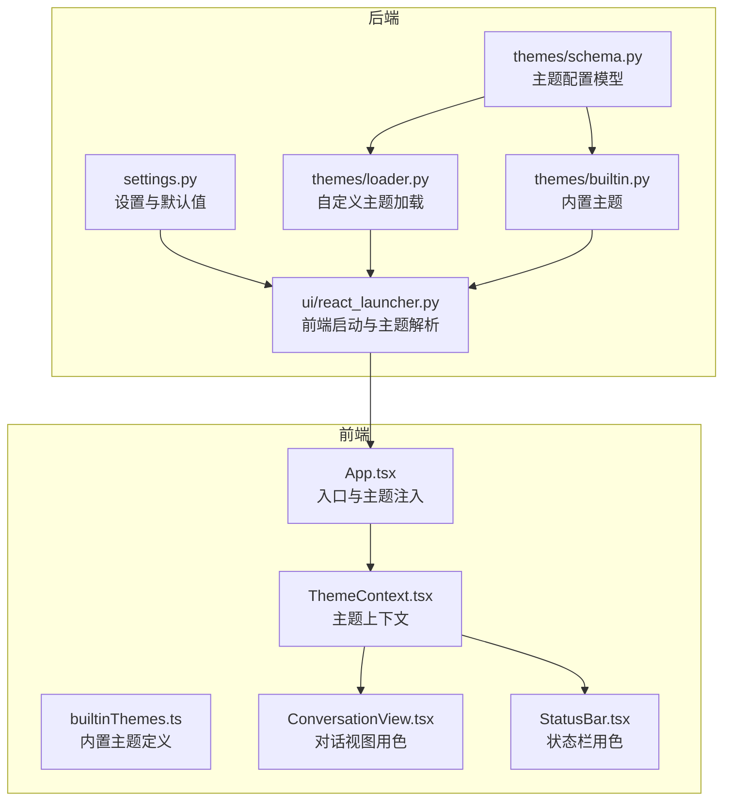
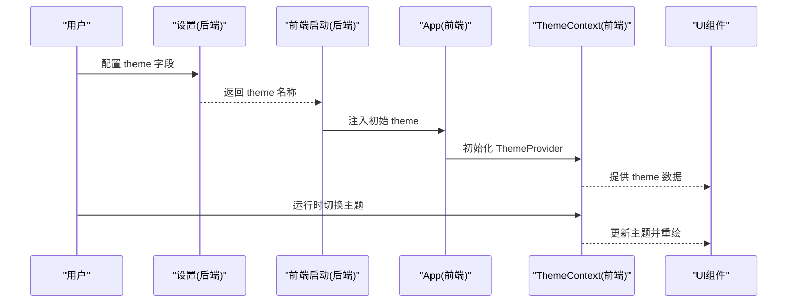
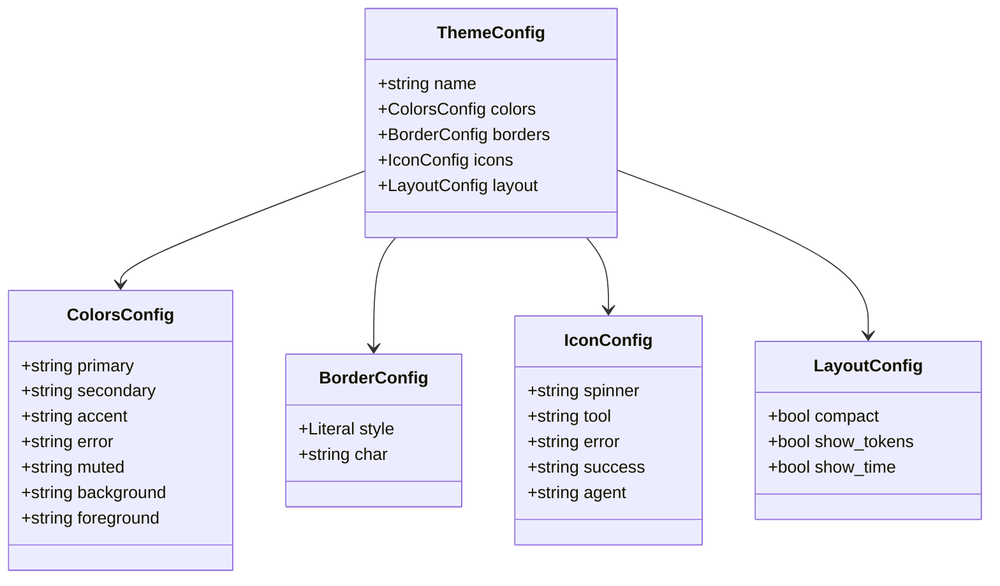
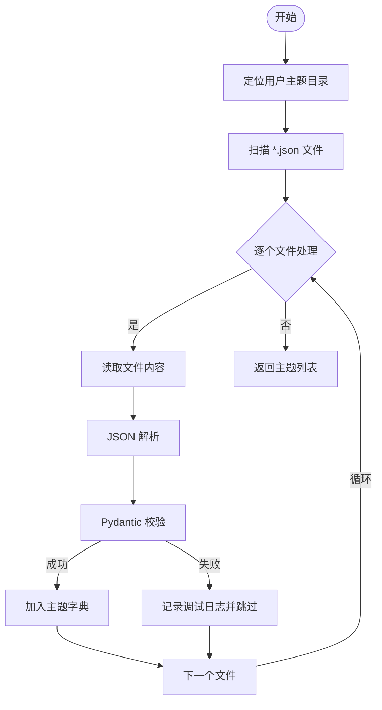
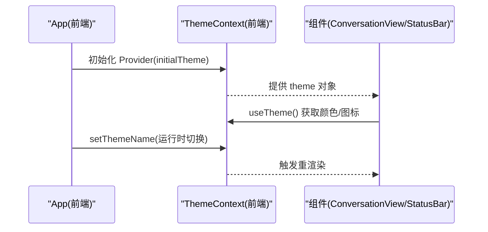
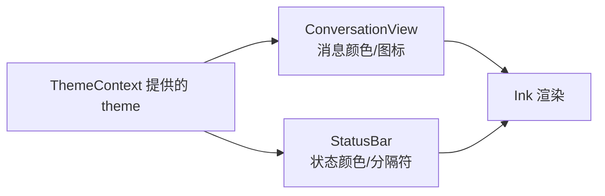
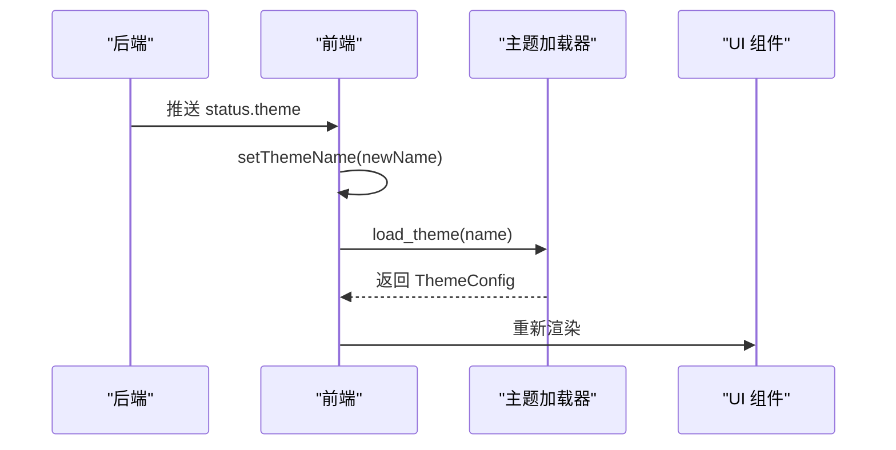
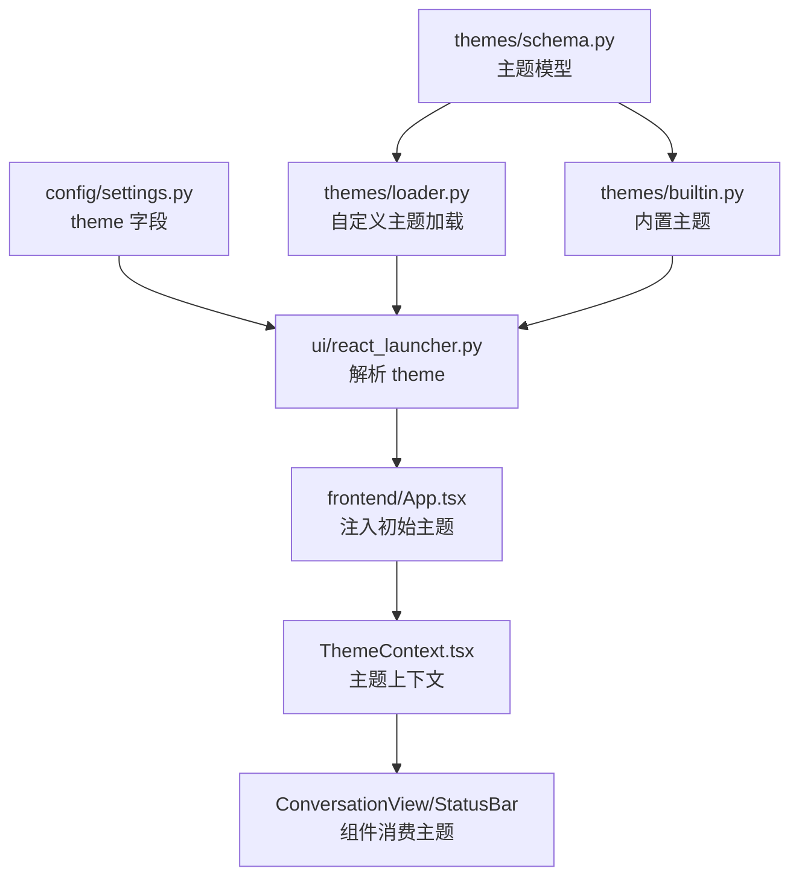

# 主题系统

<cite>
**本文引用的文件**
- [themes/__init__.py](file://src/openharness/themes/__init__.py)
- [themes/schema.py](file://src/openharness/themes/schema.py)
- [themes/builtin.py](file://src/openharness/themes/builtin.py)
- [themes/loader.py](file://src/openharness/themes/loader.py)
- [config/settings.py](file://src/openharness/config/settings.py)
- [ui/react_launcher.py](file://src/openharness/ui/react_launcher.py)
- [ui/app.py](file://src/openharness/ui/app.py)
- [frontend/terminal/src/theme/ThemeContext.tsx](file://frontend/terminal/src/theme/ThemeContext.tsx)
- [frontend/terminal/src/theme/builtinThemes.ts](file://frontend/terminal/src/theme/builtinThemes.ts)
- [frontend/terminal/src/components/ConversationView.tsx](file://frontend/terminal/src/components/ConversationView.tsx)
- [frontend/terminal/src/components/StatusBar.tsx](file://frontend/terminal/src/components/StatusBar.tsx)
</cite>

## 目录
1. [简介](#简介)
2. [项目结构](#项目结构)
3. [核心组件](#核心组件)
4. [架构总览](#架构总览)
5. [详细组件分析](#详细组件分析)
6. [依赖分析](#依赖分析)
7. [性能考虑](#性能考虑)
8. [故障排查指南](#故障排查指南)
9. [结论](#结论)
10. [附录](#附录)

## 简介
本文件系统性阐述 OpenHarness 的主题系统，覆盖主题架构设计、主题加载器、内置主题与主题模式；详解主题结构与配置格式（颜色方案、图标与边框、布局选项）；说明动态加载与运行时切换机制；给出内置主题介绍与使用示例；提供自定义主题开发指南（文件创建、颜色定义与样式规则）；解释主题与界面组件的集成方式；总结最佳实践与设计原则，并说明扩展方法与第三方主题集成路径。

## 项目结构
主题系统由后端 Python 模块与前端 React 终端两部分组成：
- 后端：提供主题配置模型、内置主题集合、自定义主题加载与查找逻辑，并通过设置项与前端交互。
- 前端：提供主题上下文、内置主题定义与运行时切换能力，将主题应用于终端 UI 组件。

**图表来源**
- [config/settings.py:528-529](file://src/openharness/config/settings.py#L528-L529)
- [themes/loader.py:15-56](file://src/openharness/themes/loader.py#L15-L56)
- [themes/builtin.py:13-90](file://src/openharness/themes/builtin.py#L13-L90)
- [themes/schema.py:10-55](file://src/openharness/themes/schema.py#L10-L55)
- [ui/react_launcher.py:13-20](file://src/openharness/ui/react_launcher.py#L13-L20)
- [frontend/terminal/src/theme/ThemeContext.tsx:17-41](file://frontend/terminal/src/theme/ThemeContext.tsx#L17-L41)
- [frontend/terminal/src/theme/builtinThemes.ts:159-162](file://frontend/terminal/src/theme/builtinThemes.ts#L159-L162)
- [frontend/terminal/src/App.tsx:51-58](file://frontend/terminal/src/App.tsx#L51-L58)
- [frontend/terminal/src/components/ConversationView.tsx:40-92](file://frontend/terminal/src/components/ConversationView.tsx#L40-L92)
- [frontend/terminal/src/components/StatusBar.tsx:57-112](file://frontend/terminal/src/components/StatusBar.tsx#L57-L112)

**章节来源**
- [themes/__init__.py:1-22](file://src/openharness/themes/__init__.py#L1-L22)
- [themes/schema.py:10-55](file://src/openharness/themes/schema.py#L10-L55)
- [themes/builtin.py:13-90](file://src/openharness/themes/builtin.py#L13-L90)
- [themes/loader.py:15-56](file://src/openharness/themes/loader.py#L15-L56)
- [config/settings.py:528-529](file://src/openharness/config/settings.py#L528-L529)
- [ui/react_launcher.py:13-20](file://src/openharness/ui/react_launcher.py#L13-L20)
- [frontend/terminal/src/theme/ThemeContext.tsx:17-41](file://frontend/terminal/src/theme/ThemeContext.tsx#L17-L41)
- [frontend/terminal/src/theme/builtinThemes.ts:159-162](file://frontend/terminal/src/theme/builtinThemes.ts#L159-L162)
- [frontend/terminal/src/App.tsx:51-58](file://frontend/terminal/src/App.tsx#L51-L58)
- [frontend/terminal/src/components/ConversationView.tsx:40-92](file://frontend/terminal/src/components/ConversationView.tsx#L40-L92)
- [frontend/terminal/src/components/StatusBar.tsx:57-112](file://frontend/terminal/src/components/StatusBar.tsx#L57-L112)

## 核心组件
- 主题配置模型：定义颜色、边框、图标与布局等字段，确保前后端一致的配置契约。
- 内置主题：提供默认、深色、极简、赛博朋克、太阳化五种风格，覆盖常见视觉偏好。
- 自定义主题加载器：从用户目录读取 JSON 文件，进行校验与合并，支持覆盖内置主题。
- 前端主题上下文：提供主题选择与全局状态，驱动 UI 组件渲染。
- 设置与启动：从设置中解析当前主题，传递给前端；前端可响应后端推送的主题变更事件。

**章节来源**
- [themes/schema.py:10-55](file://src/openharness/themes/schema.py#L10-L55)
- [themes/builtin.py:13-90](file://src/openharness/themes/builtin.py#L13-L90)
- [themes/loader.py:22-56](file://src/openharness/themes/loader.py#L22-L56)
- [config/settings.py:528-529](file://src/openharness/config/settings.py#L528-L529)
- [ui/react_launcher.py:13-20](file://src/openharness/ui/react_launcher.py#L13-L20)
- [frontend/terminal/src/theme/ThemeContext.tsx:17-41](file://frontend/terminal/src/theme/ThemeContext.tsx#L17-L41)

## 架构总览
主题系统采用“后端配置 + 前端渲染”的分层架构：
- 后端负责主题数据的来源与验证（内置 + 自定义），并通过设置项暴露主题名称。
- 前端负责主题上下文管理与组件级应用，支持初始主题与运行时切换。

**图表来源**
- [config/settings.py:528-529](file://src/openharness/config/settings.py#L528-L529)
- [ui/react_launcher.py:13-20](file://src/openharness/ui/react_launcher.py#L13-L20)
- [frontend/terminal/src/App.tsx:51-58](file://frontend/terminal/src/App.tsx#L51-L58)
- [frontend/terminal/src/theme/ThemeContext.tsx:17-41](file://frontend/terminal/src/theme/ThemeContext.tsx#L17-L41)

## 详细组件分析

### 后端主题模型与内置主题
- 主题模型包含颜色、边框、图标与布局四个维度，字段均具备合理默认值，便于扩展与兼容。
- 内置主题提供五套风格，覆盖对比度、简洁与风格化场景，满足不同使用环境与偏好。

**图表来源**
- [themes/schema.py:10-55](file://src/openharness/themes/schema.py#L10-L55)

**章节来源**
- [themes/schema.py:10-55](file://src/openharness/themes/schema.py#L10-L55)
- [themes/builtin.py:13-90](file://src/openharness/themes/builtin.py#L13-L90)

### 自定义主题加载与发现
- 自定义主题位于用户主目录下的特定子目录，按 JSON 文件命名加载。
- 加载过程对每个文件进行解析与校验，失败则跳过并记录调试日志。
- 列表函数会合并内置与自定义主题名，避免重复。

**图表来源**
- [themes/loader.py:15-56](file://src/openharness/themes/loader.py#L15-L56)

**章节来源**
- [themes/loader.py:15-56](file://src/openharness/themes/loader.py#L15-L56)

### 前端主题上下文与组件应用
- 前端提供主题上下文，支持初始化主题与运行时切换。
- UI 组件通过上下文读取主题颜色与图标，实现统一风格渲染。
- App 层监听后端推送的主题变更事件，动态更新当前主题。

**图表来源**
- [frontend/terminal/src/App.tsx:60-87](file://frontend/terminal/src/App.tsx#L60-L87)
- [frontend/terminal/src/theme/ThemeContext.tsx:17-41](file://frontend/terminal/src/theme/ThemeContext.tsx#L17-L41)
- [frontend/terminal/src/components/ConversationView.tsx:40-92](file://frontend/terminal/src/components/ConversationView.tsx#L40-L92)
- [frontend/terminal/src/components/StatusBar.tsx:57-112](file://frontend/terminal/src/components/StatusBar.tsx#L57-L112)

**章节来源**
- [frontend/terminal/src/theme/ThemeContext.tsx:17-41](file://frontend/terminal/src/theme/ThemeContext.tsx#L17-L41)
- [frontend/terminal/src/App.tsx:60-87](file://frontend/terminal/src/App.tsx#L60-L87)
- [frontend/terminal/src/components/ConversationView.tsx:40-92](file://frontend/terminal/src/components/ConversationView.tsx#L40-L92)
- [frontend/terminal/src/components/StatusBar.tsx:57-112](file://frontend/terminal/src/components/StatusBar.tsx#L57-L112)

### 主题与界面组件的集成
- 对话视图根据角色与输出风格选择颜色与图标，保证一致性。
- 状态栏展示模型、令牌、任务与 MCP 等信息，并使用主题色突出关键状态。
- 组件通过上下文直接消费主题对象，无需感知具体颜色值来源。

**图表来源**
- [frontend/terminal/src/components/ConversationView.tsx:105-174](file://frontend/terminal/src/components/ConversationView.tsx#L105-L174)
- [frontend/terminal/src/components/StatusBar.tsx:78-107](file://frontend/terminal/src/components/StatusBar.tsx#L78-L107)

**章节来源**
- [frontend/terminal/src/components/ConversationView.tsx:105-174](file://frontend/terminal/src/components/ConversationView.tsx#L105-L174)
- [frontend/terminal/src/components/StatusBar.tsx:78-107](file://frontend/terminal/src/components/StatusBar.tsx#L78-L107)

### 动态加载与切换机制
- 启动阶段：前端从设置中解析主题名，作为初始主题注入上下文。
- 运行时切换：后端可通过事件推送新的主题名，前端监听并更新当前主题。
- 自定义主题优先：加载器优先匹配自定义主题，否则回退到内置主题。

**图表来源**
- [ui/react_launcher.py:13-20](file://src/openharness/ui/react_launcher.py#L13-L20)
- [themes/loader.py:44-56](file://src/openharness/themes/loader.py#L44-L56)
- [frontend/terminal/src/App.tsx:82-86](file://frontend/terminal/src/App.tsx#L82-L86)

**章节来源**
- [ui/react_launcher.py:13-20](file://src/openharness/ui/react_launcher.py#L13-L20)
- [themes/loader.py:44-56](file://src/openharness/themes/loader.py#L44-L56)
- [frontend/terminal/src/App.tsx:82-86](file://frontend/terminal/src/App.tsx#L82-L86)

### 内置主题介绍与使用示例
- 默认：面向通用场景的颜色与边框风格，适合大多数用户。
- 深色：低亮度背景与高对比前景，减轻视觉疲劳。
- 极简：最小化装饰，强调内容，适合专注阅读。
- 赛博朋克：高亮与霓虹风格，适合创意与个性化场景。
- 太阳化：基于经典配色的柔和风格，平衡可读性与舒适度。

使用示例（通过设置项指定主题名）：
- 在设置中将 theme 设为内置主题之一，启动后前端即应用对应风格。

**章节来源**
- [themes/builtin.py:13-90](file://src/openharness/themes/builtin.py#L13-L90)
- [config/settings.py:528-529](file://src/openharness/config/settings.py#L528-L529)

### 自定义主题开发指南
- 创建位置：在用户主目录的主题目录下创建 JSON 文件，文件名为主题名。
- 配置格式：遵循主题模型字段，仅需提供需要覆盖的键值。
- 校验与合并：加载器使用配置模型进行校验，自定义主题将与内置主题合并，同名键以自定义为准。
- 建议字段：优先定义颜色与图标，保持与现有组件约定一致；边框与布局按需调整。

**章节来源**
- [themes/loader.py:15-32](file://src/openharness/themes/loader.py#L15-L32)
- [themes/schema.py:10-55](file://src/openharness/themes/schema.py#L10-L55)

### 主题系统扩展与第三方集成
- 扩展点：新增主题只需提供符合模型的 JSON 文件；如需新图标或边框样式，可在前端层面补充。
- 第三方主题：建议以独立仓库发布，提供 JSON 定义与安装说明，用户可直接复制到主题目录生效。
- 兼容性：保持字段命名与类型不变，避免破坏现有组件渲染。

**章节来源**
- [themes/schema.py:10-55](file://src/openharness/themes/schema.py#L10-L55)
- [themes/loader.py:22-56](file://src/openharness/themes/loader.py#L22-L56)

## 依赖分析
主题系统的关键依赖关系如下：
- 前端主题上下文依赖内置主题定义与后端提供的初始主题名。
- 后端主题加载器依赖内置主题与用户自定义主题目录。
- 设置模块提供主题名的默认值与来源，贯穿启动流程。

**图表来源**
- [config/settings.py:528-529](file://src/openharness/config/settings.py#L528-L529)
- [ui/react_launcher.py:13-20](file://src/openharness/ui/react_launcher.py#L13-L20)
- [frontend/terminal/src/App.tsx:51-58](file://frontend/terminal/src/App.tsx#L51-L58)
- [frontend/terminal/src/theme/ThemeContext.tsx:17-41](file://frontend/terminal/src/theme/ThemeContext.tsx#L17-L41)
- [themes/schema.py:10-55](file://src/openharness/themes/schema.py#L10-L55)
- [themes/builtin.py:13-90](file://src/openharness/themes/builtin.py#L13-L90)
- [themes/loader.py:22-56](file://src/openharness/themes/loader.py#L22-L56)

**章节来源**
- [config/settings.py:528-529](file://src/openharness/config/settings.py#L528-L529)
- [ui/react_launcher.py:13-20](file://src/openharness/ui/react_launcher.py#L13-L20)
- [frontend/terminal/src/App.tsx:51-58](file://frontend/terminal/src/App.tsx#L51-L58)
- [frontend/terminal/src/theme/ThemeContext.tsx:17-41](file://frontend/terminal/src/theme/ThemeContext.tsx#L17-L41)
- [themes/schema.py:10-55](file://src/openharness/themes/schema.py#L10-L55)
- [themes/builtin.py:13-90](file://src/openharness/themes/builtin.py#L13-L90)
- [themes/loader.py:22-56](file://src/openharness/themes/loader.py#L22-L56)

## 性能考虑
- 自定义主题加载：仅在启动时扫描与解析 JSON 文件，通常开销较小；建议控制主题数量与文件大小。
- 前端渲染：主题切换触发组件重渲染，但主题对象为轻量数据结构，影响有限。
- 建议：避免频繁切换主题；在大量组件共享同一主题时，尽量复用上下文，减少重复消费。

## 故障排查指南
- 主题未生效
  - 检查设置中的主题名是否正确，确认后端已解析到该名称。
  - 确认前端已将初始主题注入上下文。
- 自定义主题不生效
  - 检查 JSON 文件是否位于正确的用户目录且命名正确。
  - 确认 JSON 结构符合主题模型，必要时启用调试日志查看解析错误。
- 运行时切换无效
  - 确认后端确实推送了新的主题名。
  - 检查前端监听逻辑是否正常执行主题更新。

**章节来源**
- [themes/loader.py:22-32](file://src/openharness/themes/loader.py#L22-L32)
- [frontend/terminal/src/App.tsx:82-86](file://frontend/terminal/src/App.tsx#L82-L86)

## 结论
OpenHarness 的主题系统通过清晰的模型、内置与自定义主题的协同，以及前后端一体化的运行时切换机制，实现了灵活而稳定的外观定制能力。开发者可快速创建自定义主题并无缝集成到终端 UI 中，同时保持良好的可维护性与扩展性。

## 附录
- 主题配置字段参考
  - 颜色：primary、secondary、accent、error、muted、background、foreground
  - 边框：style（rounded/single/double/none）、char
  - 图标：spinner、tool、error、success、agent
  - 布局：compact、show_tokens、show_time

**章节来源**
- [themes/schema.py:10-55](file://src/openharness/themes/schema.py#L10-L55)