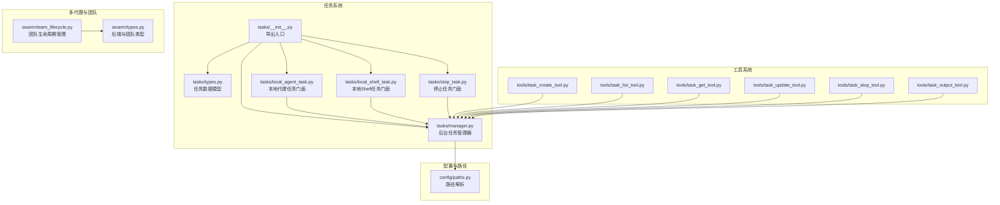
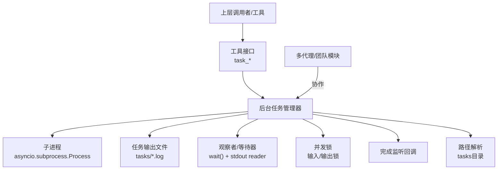
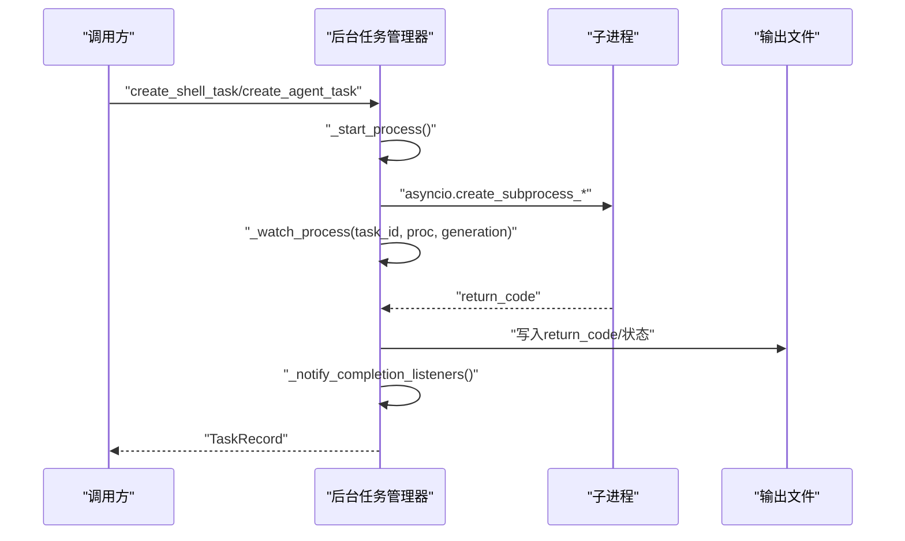
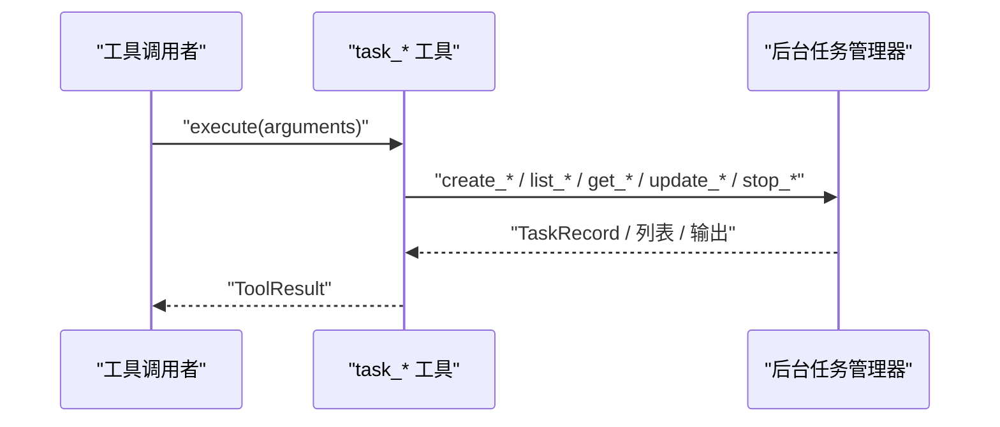
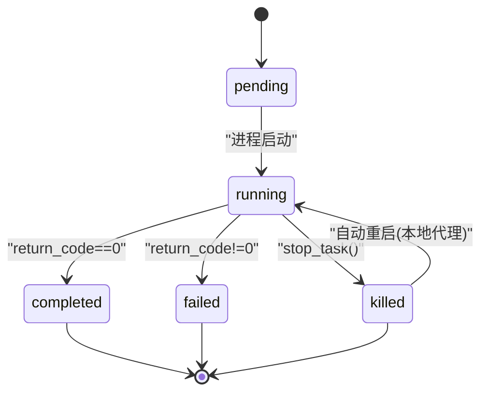
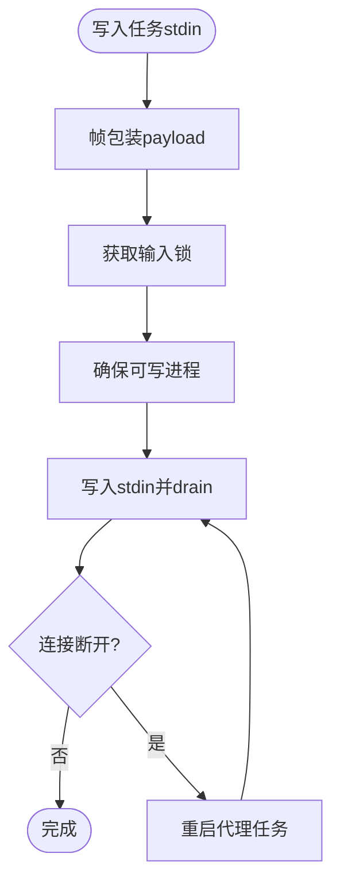
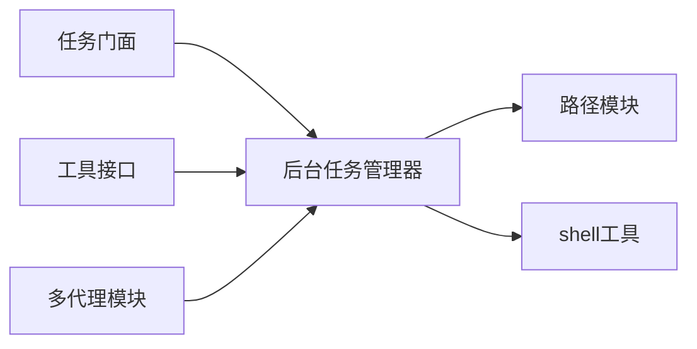

# 任务管理系统

<cite>
**本文引用的文件**
- [src/openharness/tasks/__init__.py](file://src/openharness/tasks/__init__.py)
- [src/openharness/tasks/manager.py](file://src/openharness/tasks/manager.py)
- [src/openharness/tasks/types.py](file://src/openharness/tasks/types.py)
- [src/openharness/tasks/local_agent_task.py](file://src/openharness/tasks/local_agent_task.py)
- [src/openharness/tasks/local_shell_task.py](file://src/openharness/tasks/local_shell_task.py)
- [src/openharness/tasks/stop_task.py](file://src/openharness/tasks/stop_task.py)
- [src/openharness/tools/task_create_tool.py](file://src/openharness/tools/task_create_tool.py)
- [src/openharness/tools/task_list_tool.py](file://src/openharness/tools/task_list_tool.py)
- [src/openharness/tools/task_get_tool.py](file://src/openharness/tools/task_get_tool.py)
- [src/openharness/tools/task_update_tool.py](file://src/openharness/tools/task_update_tool.py)
- [src/openharness/tools/task_stop_tool.py](file://src/openharness/tools/task_stop_tool.py)
- [src/openharness/tools/task_output_tool.py](file://src/openharness/tools/task_output_tool.py)
- [src/openharness/swarm/types.py](file://src/openharness/swarm/types.py)
- [src/openharness/swarm/team_lifecycle.py](file://src/openharness/swarm/team_lifecycle.py)
- [src/openharness/config/paths.py](file://src/openharness/config/paths.py)
- [tests/test_tasks/test_manager.py](file://tests/test_tasks/test_manager.py)
</cite>

## 目录
1. [简介](#简介)
2. [项目结构](#项目结构)
3. [核心组件](#核心组件)
4. [架构总览](#架构总览)
5. [详细组件分析](#详细组件分析)
6. [依赖分析](#依赖分析)
7. [性能考虑](#性能考虑)
8. [故障排查指南](#故障排查指南)
9. [结论](#结论)
10. [附录](#附录)

## 简介
本文件为 OpenHarness 任务管理系统提供全面文档，覆盖任务架构设计、任务类型与生命周期管理、后台任务执行机制（本地代理任务、本地 Shell 任务等）、状态管理与调度策略、并发控制、操作指南（创建/查询/更新/停止）、与工具系统的集成、持久化与恢复能力、监控与调试方法、扩展指南以及与多代理协调系统的协作机制。

## 项目结构
任务系统位于 src/openharness/tasks 下，围绕后台任务管理器与任务类型模型构建，并通过工具模块对外暴露统一的 API。路径解析由配置模块提供，任务输出日志落盘于数据目录下的 tasks 子目录。



图表来源
- [src/openharness/tasks/__init__.py:1-19](file://src/openharness/tasks/__init__.py#L1-L19)
- [src/openharness/tasks/manager.py:1-474](file://src/openharness/tasks/manager.py#L1-L474)
- [src/openharness/tasks/types.py:1-33](file://src/openharness/tasks/types.py#L1-L33)
- [src/openharness/tasks/local_agent_task.py:1-29](file://src/openharness/tasks/local_agent_task.py#L1-L29)
- [src/openharness/tasks/local_shell_task.py:1-18](file://src/openharness/tasks/local_shell_task.py#L1-L18)
- [src/openharness/tasks/stop_task.py:1-12](file://src/openharness/tasks/stop_task.py#L1-L12)
- [src/openharness/tools/task_create_tool.py:1-57](file://src/openharness/tools/task_create_tool.py#L1-L57)
- [src/openharness/tools/task_list_tool.py:1-36](file://src/openharness/tools/task_list_tool.py#L1-L36)
- [src/openharness/tools/task_get_tool.py:1-34](file://src/openharness/tools/task_get_tool.py#L1-L34)
- [src/openharness/tools/task_update_tool.py:1-51](file://src/openharness/tools/task_update_tool.py#L1-L51)
- [src/openharness/tools/task_stop_tool.py:1-31](file://src/openharness/tools/task_stop_tool.py#L1-L31)
- [src/openharness/tools/task_output_tool.py:1-36](file://src/openharness/tools/task_output_tool.py#L1-L36)
- [src/openharness/config/paths.py:78-82](file://src/openharness/config/paths.py#L78-L82)
- [src/openharness/swarm/types.py:12-399](file://src/openharness/swarm/types.py#L12-L399)
- [src/openharness/swarm/team_lifecycle.py:780-911](file://src/openharness/swarm/team_lifecycle.py#L780-L911)

章节来源
- [src/openharness/tasks/__init__.py:1-19](file://src/openharness/tasks/__init__.py#L1-L19)
- [src/openharness/config/paths.py:78-82](file://src/openharness/config/paths.py#L78-L82)

## 核心组件
- 后台任务管理器：负责任务创建、进程启动与观察、输入输出写入、状态变更、完成监听、清理与重启等。
- 任务类型与记录：定义任务类型枚举与运行时记录的数据结构。
- 任务门面函数：提供 spawn_local_agent_task、spawn_shell_task、stop_task 的便捷调用。
- 工具接口：task_create、task_list、task_get、task_update、task_stop、task_output 将任务能力以工具形式暴露给上层系统。
- 路径与存储：任务输出日志文件存放在 tasks 目录，路径由配置模块解析。
- 多代理与团队：swarm 模块定义了后端类型、团队成员与生命周期管理，便于与任务系统协同。

章节来源
- [src/openharness/tasks/manager.py:49-474](file://src/openharness/tasks/manager.py#L49-L474)
- [src/openharness/tasks/types.py:10-33](file://src/openharness/tasks/types.py#L10-L33)
- [src/openharness/tasks/local_agent_task.py:11-29](file://src/openharness/tasks/local_agent_task.py#L11-L29)
- [src/openharness/tasks/local_shell_task.py:11-18](file://src/openharness/tasks/local_shell_task.py#L11-L18)
- [src/openharness/tasks/stop_task.py:9-12](file://src/openharness/tasks/stop_task.py#L9-L12)
- [src/openharness/tools/task_create_tool.py:23-57](file://src/openharness/tools/task_create_tool.py#L23-L57)
- [src/openharness/tools/task_list_tool.py:17-36](file://src/openharness/tools/task_list_tool.py#L17-L36)
- [src/openharness/tools/task_get_tool.py:17-34](file://src/openharness/tools/task_get_tool.py#L17-L34)
- [src/openharness/tools/task_update_tool.py:20-51](file://src/openharness/tools/task_update_tool.py#L20-L51)
- [src/openharness/tools/task_stop_tool.py:17-31](file://src/openharness/tools/task_stop_tool.py#L17-L31)
- [src/openharness/tools/task_output_tool.py:18-36](file://src/openharness/tools/task_output_tool.py#L18-L36)
- [src/openharness/config/paths.py:78-82](file://src/openharness/config/paths.py#L78-L82)
- [src/openharness/swarm/types.py:12-399](file://src/openharness/swarm/types.py#L12-L399)
- [src/openharness/swarm/team_lifecycle.py:780-911](file://src/openharness/swarm/team_lifecycle.py#L780-L911)

## 架构总览
任务系统采用“管理器 + 类型模型 + 工具接口”的分层设计。管理器负责底层子进程生命周期与 I/O；类型模型提供强类型约束；工具接口将任务能力封装为可被上层调用的工具；路径模块提供统一的数据目录解析；swarm 模块提供多代理与团队协作所需的类型与生命周期管理。



图表来源
- [src/openharness/tasks/manager.py:49-474](file://src/openharness/tasks/manager.py#L49-L474)
- [src/openharness/config/paths.py:78-82](file://src/openharness/config/paths.py#L78-L82)
- [src/openharness/swarm/types.py:12-399](file://src/openharness/swarm/types.py#L12-L399)

## 详细组件分析

### 数据模型与类型
- 任务类型：local_bash、local_agent、remote_agent、in_process_teammate。
- 任务状态：pending、running、completed、failed、killed。
- 任务记录：包含标识、类型、状态、描述、工作目录、输出文件路径、命令/参数、时间戳、返回码、元数据、环境变量等字段。

```mermaid
classDiagram
class TaskRecord {
+string id
+TaskType type
+TaskStatus status
+string description
+string cwd
+Path output_file
+string|None command
+string|None prompt
+float created_at
+float|None started_at
+float|None ended_at
+int|None return_code
+dict metadata
+dict|None env
+list|None argv
}
class TaskType {
<<literal>>
"local_bash"
"local_agent"
"remote_agent"
"in_process_teammate"
}
class TaskStatus {
<<literal>>
"pending"
"running"
"completed"
"failed"
"killed"
}
TaskRecord --> TaskType : "type"
TaskRecord --> TaskStatus : "status"
```

图表来源
- [src/openharness/tasks/types.py:10-33](file://src/openharness/tasks/types.py#L10-L33)

章节来源
- [src/openharness/tasks/types.py:10-33](file://src/openharness/tasks/types.py#L10-L33)

### 后台任务管理器
- 创建任务
  - 本地 Shell 任务：支持 command 或 argv 两种启动方式；argv 直接执行，避免跨平台 shell 引用问题。
  - 本地代理任务：默认从环境注入 API 密钥与模型参数，或显式传入 command/argv。
- 进程管理
  - 使用 asyncio.subprocess 启动子进程，合并任务环境变量；stdout 读取与输出文件追加异步进行。
  - 观察者等待进程退出，设置状态与结束时间，触发完成监听回调。
- 输入输出
  - 写入任务 stdin 时对多行提示进行帧包装；断开后自动重启本地代理类任务并保留元数据。
  - 读取输出时支持最大字节数限制，避免一次性读取过大。
- 并发控制
  - 每个任务拥有独立的输入锁与输出锁，保证并发安全。
  - 生成计数用于区分重启后的进程代际，防止旧等待器影响新进程。
- 停止与清理
  - 支持优雅终止与强制杀死；关闭 stdin 并等待进程退出；异步/同步关闭接口。
- 单例管理器
  - 基于 tasks 目录键值的单例，切换目录会重置管理器实例。



图表来源
- [src/openharness/tasks/manager.py:248-271](file://src/openharness/tasks/manager.py#L248-L271)
- [src/openharness/tasks/manager.py:289-332](file://src/openharness/tasks/manager.py#L289-L332)

章节来源
- [src/openharness/tasks/manager.py:49-474](file://src/openharness/tasks/manager.py#L49-L474)

### 任务门面与工具接口
- 门面函数
  - spawn_local_agent_task：创建本地代理任务。
  - spawn_shell_task：创建本地 Shell 任务。
  - stop_task：停止指定任务。
- 工具接口
  - task_create：根据类型创建任务。
  - task_list：列出任务并可按状态过滤。
  - task_get：获取任务详情。
  - task_update：更新任务描述、进度与状态备注。
  - task_stop：停止任务。
  - task_output：读取任务输出日志。



图表来源
- [src/openharness/tools/task_create_tool.py:30-57](file://src/openharness/tools/task_create_tool.py#L30-L57)
- [src/openharness/tools/task_list_tool.py:28-36](file://src/openharness/tools/task_list_tool.py#L28-L36)
- [src/openharness/tools/task_get_tool.py:28-34](file://src/openharness/tools/task_get_tool.py#L28-L34)
- [src/openharness/tools/task_update_tool.py:27-51](file://src/openharness/tools/task_update_tool.py#L27-L51)
- [src/openharness/tools/task_stop_tool.py:24-31](file://src/openharness/tools/task_stop_tool.py#L24-L31)
- [src/openharness/tools/task_output_tool.py:29-36](file://src/openharness/tools/task_output_tool.py#L29-L36)

章节来源
- [src/openharness/tasks/local_agent_task.py:11-29](file://src/openharness/tasks/local_agent_task.py#L11-L29)
- [src/openharness/tasks/local_shell_task.py:11-18](file://src/openharness/tasks/local_shell_task.py#L11-L18)
- [src/openharness/tasks/stop_task.py:9-12](file://src/openharness/tasks/stop_task.py#L9-L12)
- [src/openharness/tools/task_create_tool.py:23-57](file://src/openharness/tools/task_create_tool.py#L23-L57)
- [src/openharness/tools/task_list_tool.py:17-36](file://src/openharness/tools/task_list_tool.py#L17-L36)
- [src/openharness/tools/task_get_tool.py:17-34](file://src/openharness/tools/task_get_tool.py#L17-L34)
- [src/openharness/tools/task_update_tool.py:20-51](file://src/openharness/tools/task_update_tool.py#L20-L51)
- [src/openharness/tools/task_stop_tool.py:17-31](file://src/openharness/tools/task_stop_tool.py#L17-L31)
- [src/openharness/tools/task_output_tool.py:18-36](file://src/openharness/tools/task_output_tool.py#L18-L36)

### 生命周期与状态流转
- pending：创建后初始状态。
- running：进程已启动，I/O 正在进行。
- completed/failed：进程退出，根据返回码确定成功与否。
- killed：被外部停止。
- 重启：本地代理类任务在输入断开后自动重启，保留元数据并记录重启次数与提示。



图表来源
- [src/openharness/tasks/manager.py:259-271](file://src/openharness/tasks/manager.py#L259-L271)
- [src/openharness/tasks/manager.py:345-362](file://src/openharness/tasks/manager.py#L345-L362)

章节来源
- [src/openharness/tasks/manager.py:248-271](file://src/openharness/tasks/manager.py#L248-L271)
- [src/openharness/tasks/manager.py:345-362](file://src/openharness/tasks/manager.py#L345-L362)

### 并发控制与输入输出协议
- 锁机制：每个任务维护独立的输入锁与输出锁，确保并发安全。
- 帧包装：向代理任务写入时，多行提示会被包装为结构化消息，避免换行导致的协议问题。
- 断线重启：当写入失败且任务类型为本地/远程代理或进程内队友时，自动重启并记录重启信息。



图表来源
- [src/openharness/tasks/manager.py:214-229](file://src/openharness/tasks/manager.py#L214-L229)
- [src/openharness/tasks/manager.py:334-343](file://src/openharness/tasks/manager.py#L334-L343)
- [src/openharness/tasks/manager.py:345-362](file://src/openharness/tasks/manager.py#L345-L362)

章节来源
- [src/openharness/tasks/manager.py:214-229](file://src/openharness/tasks/manager.py#L214-L229)
- [src/openharness/tasks/manager.py:334-343](file://src/openharness/tasks/manager.py#L334-L343)
- [src/openharness/tasks/manager.py:345-362](file://src/openharness/tasks/manager.py#L345-L362)

### 任务与工具系统的集成
- 工具到管理器：所有工具最终通过 get_task_manager 获取单例并调用相应方法。
- 参数校验：工具对必填参数进行检查，错误时返回 ToolResult 并标记 is_error=True。
- 只读工具：task_list、task_get、task_output 仅读取，不修改状态。

章节来源
- [src/openharness/tools/task_create_tool.py:30-57](file://src/openharness/tools/task_create_tool.py#L30-L57)
- [src/openharness/tools/task_list_tool.py:24-36](file://src/openharness/tools/task_list_tool.py#L24-L36)
- [src/openharness/tools/task_get_tool.py:24-34](file://src/openharness/tools/task_get_tool.py#L24-L34)
- [src/openharness/tools/task_update_tool.py:27-51](file://src/openharness/tools/task_update_tool.py#L27-L51)
- [src/openharness/tools/task_stop_tool.py:24-31](file://src/openharness/tools/task_stop_tool.py#L24-L31)
- [src/openharness/tools/task_output_tool.py:25-36](file://src/openharness/tools/task_output_tool.py#L25-L36)

### 任务持久化与恢复
- 输出持久化：任务输出以纯文本形式写入 tasks 目录下的日志文件，支持尾部读取与大小限制。
- 目录解析：tasks 目录由配置模块解析，受 OPENHARNESS_DATA_DIR 环境变量影响。
- 团队生命周期：团队文件（team.json）持久化在 ~/.openharness/teams/<name>/ 下，提供团队成员、权限、工作树等信息的持久化与清理。

章节来源
- [src/openharness/config/paths.py:78-82](file://src/openharness/config/paths.py#L78-L82)
- [src/openharness/swarm/team_lifecycle.py:263-280](file://src/openharness/swarm/team_lifecycle.py#L263-L280)
- [src/openharness/swarm/team_lifecycle.py:746-773](file://src/openharness/swarm/team_lifecycle.py#L746-L773)

### 与多代理协调系统的协作
- 后端类型：支持 subprocess、in_process、tmux、iterm2 等后端类型，用于在不同终端环境中运行代理。
- 面板后端：tmux 与 iTerm2 提供面板管理能力，支持创建、隐藏/显示、标题与边框颜色设置、重平衡等。
- 队员配置：TeammateSpawnConfig 定义了 spawn 所需的提示、工作目录、父会话、颜色、权限、计划模式等。
- 生命周期：TeamLifecycleManager 提供团队的创建、读取、更新、删除与会话清理（含孤儿面板清理与工作树销毁）。

章节来源
- [src/openharness/swarm/types.py:16-399](file://src/openharness/swarm/types.py#L16-L399)
- [src/openharness/swarm/team_lifecycle.py:780-911](file://src/openharness/swarm/team_lifecycle.py#L780-L911)

## 依赖分析
- 组件耦合
  - 任务门面与工具均依赖 get_task_manager 单例，降低上层与实现细节耦合。
  - 管理器依赖路径模块解析 tasks 目录，依赖 shell 工具创建子进程。
  - 多代理模块与任务系统通过任务类型（local_agent、remote_agent、in_process_teammate）形成协作。
- 外部依赖
  - asyncio.subprocess：用于子进程管理。
  - json：用于帧包装与团队文件序列化。
  - pathlib：用于路径解析与文件操作。



图表来源
- [src/openharness/tasks/manager.py:15-17](file://src/openharness/tasks/manager.py#L15-L17)
- [src/openharness/config/paths.py:78-82](file://src/openharness/config/paths.py#L78-L82)
- [src/openharness/swarm/types.py:16-399](file://src/openharness/swarm/types.py#L16-L399)

章节来源
- [src/openharness/tasks/manager.py:15-17](file://src/openharness/tasks/manager.py#L15-L17)
- [src/openharness/config/paths.py:78-82](file://src/openharness/config/paths.py#L78-L82)
- [src/openharness/swarm/types.py:16-399](file://src/openharness/swarm/types.py#L16-L399)

## 性能考虑
- I/O 异步化：stdout 读取与输出文件写入采用异步流式处理，避免阻塞事件循环。
- 锁粒度：每任务独立锁，减少争用；仅在必要时持有锁。
- 日志截断：输出读取支持最大字节限制，避免超大日志一次性读取造成内存压力。
- 进程复用：单例管理器在目录不变时复用同一实例，减少重复初始化成本。

## 故障排查指南
- 无法创建任务
  - 检查是否同时提供了 command 与 argv，或两者均未提供。
  - 本地代理任务缺少 API 密钥时会报错。
- 任务无输出
  - 确认任务状态为 completed/failed；使用 task_output 工具读取最近输出。
  - 检查 tasks 目录权限与磁盘空间。
- 任务卡住
  - 使用 task_stop 停止任务；若进程仍存在，检查是否有僵尸进程。
- 代理任务断线
  - 系统会自动重启并记录重启信息；如频繁断线，检查代理进程稳定性与网络。
- 监听回调未触发
  - 确认注册的监听器未被异常中断；查看日志中监听器异常记录。

章节来源
- [tests/test_tasks/test_manager.py:142-163](file://tests/test_tasks/test_manager.py#L142-L163)
- [tests/test_tasks/test_manager.py:197-210](file://tests/test_tasks/test_manager.py#L197-L210)
- [tests/test_tasks/test_manager.py:213-234](file://tests/test_tasks/test_manager.py#L213-L234)

## 结论
OpenHarness 任务系统以后台任务管理器为核心，结合类型模型与工具接口，实现了对本地 Shell 与本地代理任务的高效管理；通过异步 I/O、锁机制与自动重启策略保障了可靠性与并发安全；配合路径解析与团队生命周期管理，形成了从任务创建到输出持久化的完整闭环。该设计易于扩展，便于接入更多任务类型与后端执行环境。

## 附录

### 操作指南（创建/查询/更新/停止）
- 创建任务
  - 本地 Shell：提供 command 或 argv。
  - 本地代理：提供 prompt，或提供 command/argv 显式覆盖。
- 查询任务
  - 列表：按状态过滤。
  - 获取：按任务 ID 获取详情。
  - 输出：读取最近输出日志。
- 更新任务
  - 更新描述、进度百分比与状态备注。
- 停止任务
  - 通过任务 ID 停止运行中的任务。

章节来源
- [src/openharness/tools/task_create_tool.py:30-57](file://src/openharness/tools/task_create_tool.py#L30-L57)
- [src/openharness/tools/task_list_tool.py:28-36](file://src/openharness/tools/task_list_tool.py#L28-L36)
- [src/openharness/tools/task_get_tool.py:28-34](file://src/openharness/tools/task_get_tool.py#L28-L34)
- [src/openharness/tools/task_output_tool.py:29-36](file://src/openharness/tools/task_output_tool.py#L29-L36)
- [src/openharness/tools/task_update_tool.py:27-51](file://src/openharness/tools/task_update_tool.py#L27-L51)
- [src/openharness/tools/task_stop_tool.py:24-31](file://src/openharness/tools/task_stop_tool.py#L24-L31)

### 扩展指南与自定义任务类型
- 新增任务类型
  - 在类型模型中添加新的 TaskType 字面量。
  - 在管理器中扩展 _start_process 与相关逻辑，支持新类型的启动方式与环境传递。
  - 在工具层新增对应工具或扩展现有工具的类型分支。
- 新增后端执行环境
  - 参考 swarm/types 中的 BackendType 与 TeammateExecutor 协议，实现新的执行后端。
  - 在 TeammateSpawnConfig 中扩展配置项，使任务类型与后端类型匹配。

章节来源
- [src/openharness/tasks/types.py:10-11](file://src/openharness/tasks/types.py#L10-L11)
- [src/openharness/tasks/manager.py:289-332](file://src/openharness/tasks/manager.py#L289-L332)
- [src/openharness/swarm/types.py:16-399](file://src/openharness/swarm/types.py#L16-L399)