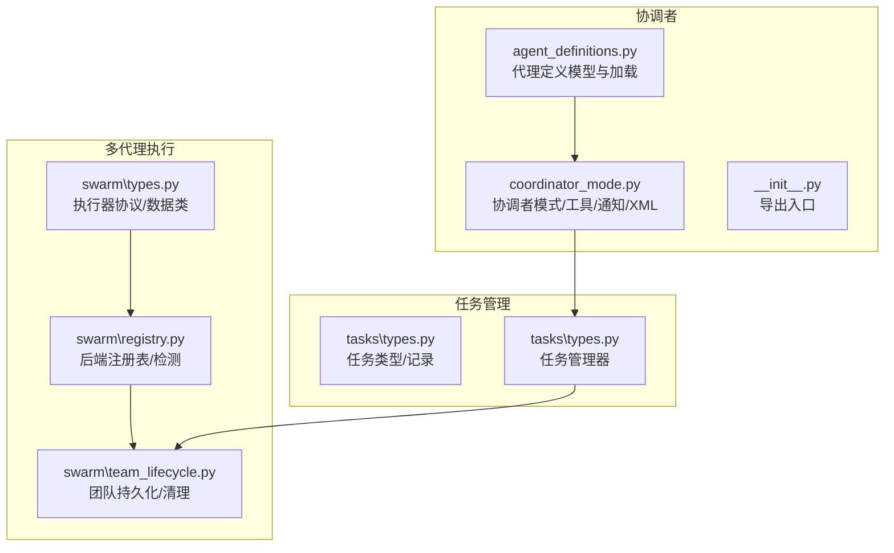
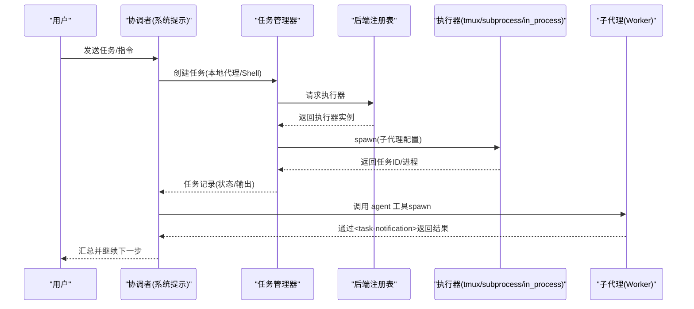
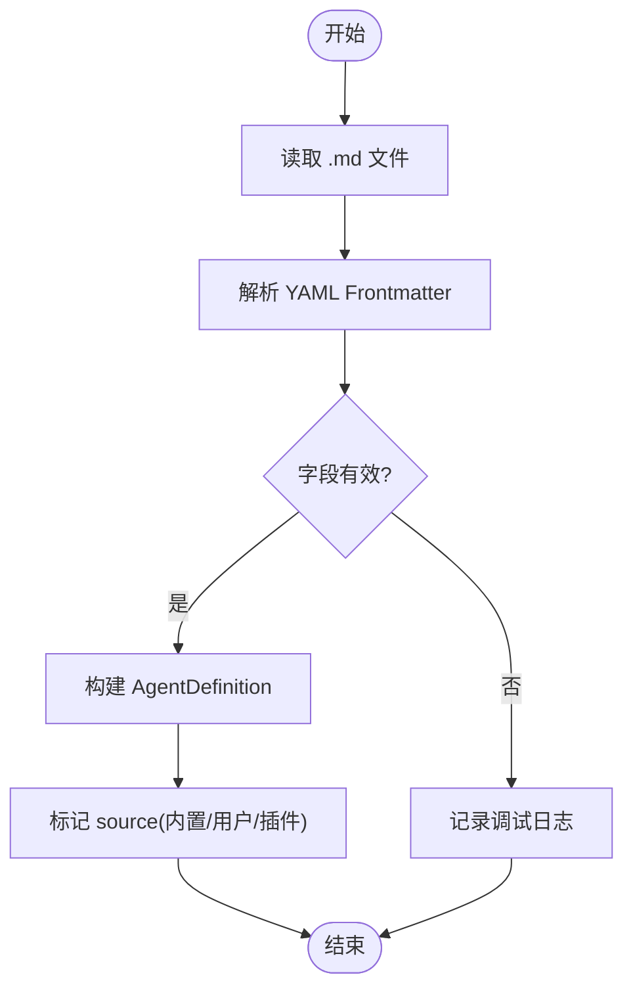
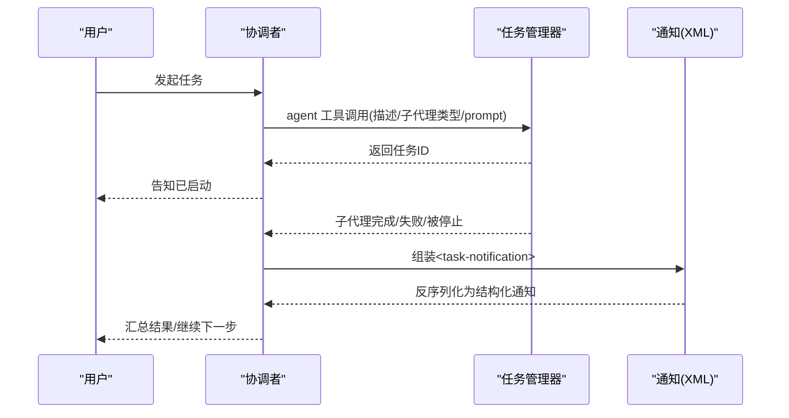
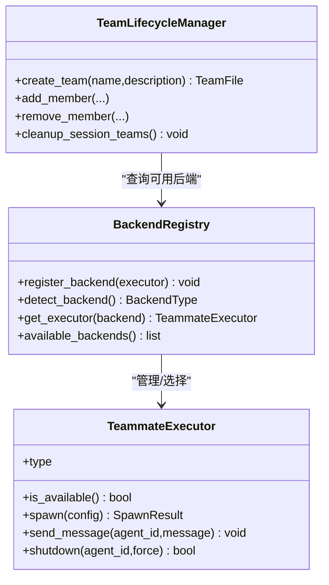
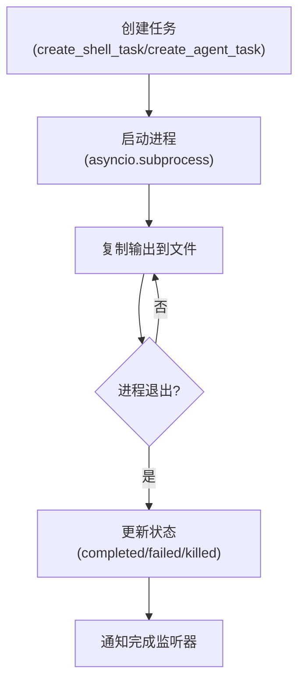
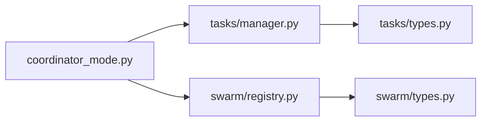

# 协调者系统

<cite>
**本文引用的文件**
- [src\openharness\coordinator\__init__.py](file://src\openharness\coordinator\__init__.py)
- [src\openharness\coordinator\agent_definitions.py](file://src\openharness\coordinator\agent_definitions.py)
- [src\openharness\coordinator\coordinator_mode.py](file://src\openharness\coordinator\coordinator_mode.py)
- [src\openharness\swarm\types.py](file://src\openharness\swarm\types.py)
- [src\openharness\swarm\registry.py](file://src\openharness\swarm\registry.py)
- [src\openharness\swarm\team_lifecycle.py](file://src\openharness\swarm\team_lifecycle.py)
- [src\openharness\tasks\manager.py](file://src\openharness\tasks\manager.py)
- [src\openharness\tasks\types.py](file://src\openharness\tasks\types.py)
- [tests\test_coordinator\test_agent_definitions.py](file://tests\test_coordinator\test_agent_definitions.py)
- [tests\test_coordinator\test_coordinator_mode.py](file://tests\test_coordinator\test_coordinator_mode.py)
- [tests\test_swarm\test_registry.py](file://tests\test_swarm\test_registry.py)
- [README.md](file://README.md)
</cite>

## 目录
1. [简介](#简介)
2. [项目结构](#项目结构)
3. [核心组件](#核心组件)
4. [架构总览](#架构总览)
5. [详细组件分析](#详细组件分析)
6. [依赖分析](#依赖分析)
7. [性能考虑](#性能考虑)
8. [故障排除指南](#故障排除指南)
9. [结论](#结论)
10. [附录](#附录)

## 简介
本文件系统化阐述 OpenHarness 的“协调者系统”，涵盖以下主题：
- 协调者架构设计：代理定义管理、团队注册表、任务通知与工作流
- 代理定义的结构与配置项：字段语义、默认值、约束与来源（内置/用户/插件）
- 协调者模式：环境检测、工具保留集、用户上下文注入、系统提示
- 多代理系统集成：子代理生成、后台任务生命周期、团队持久化与清理
- 配置与使用示例：如何启用协调者模式、如何spawn/继续/停止子代理
- 任务分配与资源管理：并发策略、权限模式、工具可用性
- 扩展性与自定义：如何开发自定义代理定义、如何扩展后端执行器
- 性能与最佳实践：并发、重启与输出追踪、日志与可观测性
- 故障排除与调试：XML 通知解析、环境变量开关、后端检测与回退

## 项目结构
协调者系统位于 openharness/coordinator 子模块，配合 swarm 后端执行与 tasks 任务管理共同构成多代理编排能力。

图表来源
- [src\openharness\coordinator\agent_definitions.py:60-135](file://src\openharness\coordinator\agent_definitions.py#L60-L135)
- [src\openharness\coordinator\coordinator_mode.py:163-401](file://src\openharness\coordinator\coordinator_mode.py#L163-L401)
- [src\openharness\swarm\types.py:35-399](file://src\openharness\swarm\types.py#L35-L399)
- [src\openharness\swarm\registry.py:97-391](file://src\openharness\swarm\registry.py#L97-L391)
- [src\openharness\swarm\team_lifecycle.py:780-911](file://src\openharness\swarm\team_lifecycle.py#L780-L911)
- [src\openharness\tasks\types.py:14-33](file://src\openharness\tasks\types.py#L14-L33)
- [src\openharness\tasks\manager.py:49-474](file://src\openharness\tasks\manager.py#L49-L474)

章节来源
- [src\openharness\coordinator\__init__.py:1-13](file://src\openharness\coordinator\__init__.py#L1-L13)
- [src\openharness\coordinator\agent_definitions.py:1-976](file://src\openharness\coordinator\agent_definitions.py#L1-L976)
- [src\openharness\coordinator\coordinator_mode.py:1-521](file://src\openharness\coordinator\coordinator_mode.py#L1-L521)
- [src\openharness\swarm\types.py:1-399](file://src\openharness\swarm\types.py#L1-L399)
- [src\openharness\swarm\registry.py:1-411](file://src\openharness\swarm\registry.py#L1-L411)
- [src\openharness\swarm\team_lifecycle.py:1-911](file://src\openharness\swarm\team_lifecycle.py#L1-L911)
- [src\openharness\tasks\types.py:1-33](file://src\openharness\tasks\types.py#L1-L33)
- [src\openharness\tasks\manager.py:1-474](file://src\openharness\tasks\manager.py#L1-L474)

## 核心组件
- 代理定义模型与加载
  - AgentDefinition：统一描述代理名称、描述、系统提示、工具集合、权限模式、记忆范围、隔离模式等
  - 内置代理：通用、探索、规划、工人、验证等
  - 用户代理：从 .md 文件加载，支持 YAML frontmatter 解析
- 协调者模式
  - 环境检测：是否处于协调者模式
  - 工具保留集：agent/send_message/task_stop
  - 用户上下文注入：工作区工具清单、MCP 服务器、临时目录
  - 系统提示：任务阶段、并发策略、提示写作规范
  - 任务通知：XML 结构化结果，包含状态、摘要、可选结果与用量
- 多代理执行与团队管理
  - 执行器协议：spawn/send_message/shutdown
  - 后端注册表：自动检测 tmux/iTerm2/subprocess/in_process
  - 团队生命周期：团队元数据持久化、成员管理、会话清理、工作树清理
- 任务管理
  - 任务类型：本地 Shell、本地代理、远程代理、进程内队友
  - 任务记录：状态、命令/参数、输出文件、元数据
  - 任务管理器：异步子进程、输入/输出锁、重启与完成监听

章节来源
- [src\openharness\coordinator\agent_definitions.py:60-135](file://src\openharness\coordinator\agent_definitions.py#L60-L135)
- [src\openharness\coordinator\coordinator_mode.py:186-401](file://src\openharness\coordinator\coordinator_mode.py#L186-L401)
- [src\openharness\swarm\types.py:35-399](file://src\openharness\swarm\types.py#L35-L399)
- [src\openharness\swarm\registry.py:97-391](file://src\openharness\swarm\registry.py#L97-L391)
- [src\openharness\swarm\team_lifecycle.py:780-911](file://src\openharness\swarm\team_lifecycle.py#L780-L911)
- [src\openharness\tasks\types.py:14-33](file://src\openharness\tasks\types.py#L14-L33)
- [src\openharness\tasks\manager.py:49-474](file://src\openharness\tasks\manager.py#L49-L474)

## 架构总览
协调者系统通过“模式注入 + 代理定义 + 执行器 + 任务管理”的组合实现多代理编排。

图表来源
- [src\openharness\coordinator\coordinator_mode.py:252-401](file://src\openharness\coordinator\coordinator_mode.py#L252-L401)
- [src\openharness\tasks\manager.py:114-158](file://src\openharness\tasks\manager.py#L114-L158)
- [src\openharness\swarm\registry.py:270-291](file://src\openharness\swarm\registry.py#L270-L291)
- [src\openharness\swarm\types.py:357-399](file://src\openharness\swarm\types.py#L357-L399)

## 详细组件分析

### 代理定义模型与加载
- 字段概览
  - 必填：name、description
  - 提示与工具：system_prompt、tools/disallowed_tools
  - 模型与努力：model、effort
  - 权限：permission_mode
  - 循环控制：max_turns
  - 技能与MCP：skills、mcp_servers、required_mcp_servers
  - 钩子：hooks
  - UI：color
  - 生命周期：background、initial_prompt、memory、isolation
  - 元数据：filename/base_dir、critical_system_reminder、pending_snapshot_update、omit_claude_md
  - Python特定：permissions、subagent_type、source
- 内置代理
  - general-purpose、Explore、Plan、worker、verification、statusline-setup、claude-code-guide
  - 内置系统提示与工具限制体现不同角色职责
- 加载流程
  - 从目录读取 .md 文件，解析 YAML frontmatter，正文作为 system_prompt
  - 支持 tools/disallowed_tools/model/effort/permission_mode/maxTurns/skills/mcpServers/hooks/color/background/initialPrompt/memory/isolation/omitClaudeMd/criticalSystemReminder/requiredMcpServers/permissions/subagent_type 等字段
  - 对 effort/permissionMode/maxTurns 进行有效性校验

图表来源
- [src\openharness\coordinator\agent_definitions.py:695-820](file://src\openharness\coordinator\agent_definitions.py#L695-L820)

章节来源
- [src\openharness\coordinator\agent_definitions.py:60-135](file://src\openharness\coordinator\agent_definitions.py#L60-L135)
- [src\openharness\coordinator\agent_definitions.py:510-620](file://src\openharness\coordinator\agent_definitions.py#L510-L620)
- [src\openharness\coordinator\agent_definitions.py:695-820](file://src\openharness\coordinator\agent_definitions.py#L695-L820)
- [tests\test_coordinator\test_agent_definitions.py:1-223](file://tests\test_coordinator\test_agent_definitions.py#L1-L223)

### 协调者模式与工作流
- 模式检测
  - 通过环境变量判断是否处于协调者模式
  - 与会话存储的模式对齐，必要时切换
- 工具保留集
  - agent：spawn 子代理
  - send_message：向已有子代理继续发送消息
  - task_stop：终止运行中的子代理
- 用户上下文
  - 注入可用工具清单、MCP 服务器列表、scratchpad 目录
- 系统提示
  - 角色定位、工具使用、任务阶段、并发策略、提示写作规范、失败处理与停止操作
- 任务通知
  - XML 结构：task-id/status/summary/result/usage(total_tokens/tool_uses/duration_ms)
  - 序列化/反序列化，支持可选字段

图表来源
- [src\openharness\coordinator\coordinator_mode.py:186-401](file://src\openharness\coordinator\coordinator_mode.py#L186-L401)
- [src\openharness\coordinator\coordinator_mode.py:109-157](file://src\openharness\coordinator\coordinator_mode.py#L109-L157)

章节来源
- [src\openharness\coordinator\coordinator_mode.py:186-401](file://src\openharness\coordinator\coordinator_mode.py#L186-L401)
- [src\openharness\coordinator\coordinator_mode.py:109-157](file://src\openharness\coordinator\coordinator_mode.py#L109-L157)
- [tests\test_coordinator\test_coordinator_mode.py:1-200](file://tests\test_coordinator\test_coordinator_mode.py#L1-L200)

### 多代理执行与团队管理
- 执行器协议
  - TeammateExecutor：spawn/send_message/shutdown
  - PaneBackend：tmux/iterm2 的面板管理抽象
- 后端注册表
  - 自动检测优先级：in_process(回退)/tmux(会话内)/subprocess(安全回退)
  - 支持注册自定义执行器
- 团队生命周期
  - 团队元数据持久化到 team.json
  - 成员管理、权限模式同步、活动状态、隐藏面板、会话清理、工作树清理

图表来源
- [src\openharness\swarm\types.py:357-399](file://src\openharness\swarm\types.py#L357-L399)
- [src\openharness\swarm\registry.py:97-391](file://src\openharness\swarm\registry.py#L97-L391)
- [src\openharness\swarm\team_lifecycle.py:780-911](file://src\openharness\swarm\team_lifecycle.py#L780-L911)

章节来源
- [src\openharness\swarm\types.py:35-399](file://src\openharness\swarm\types.py#L35-L399)
- [src\openharness\swarm\registry.py:97-391](file://src\openharness\swarm\registry.py#L97-L391)
- [src\openharness\swarm\team_lifecycle.py:780-911](file://src\openharness\swarm\team_lifecycle.py#L780-L911)
- [tests\test_swarm\test_registry.py:1-115](file://tests\test_swarm\test_registry.py#L1-L115)

### 任务管理与后台执行
- 任务类型
  - local_bash、local_agent、remote_agent、in_process_teammate
- 任务记录
  - id/type/status/description/cwd/output_file/command/prompt/created_at/started_at/ended_at/return_code/metadata/env/argv
- 任务管理器
  - 异步子进程、stdin/stdout 锁、编码输入负载、重启与完成监听
  - 输出尾部读取、错误处理与优雅关闭

图表来源
- [src\openharness\tasks\manager.py:289-373](file://src\openharness\tasks\manager.py#L289-L373)
- [src\openharness\tasks\types.py:14-33](file://src\openharness\tasks\types.py#L14-L33)

章节来源
- [src\openharness\tasks\types.py:14-33](file://src\openharness\tasks\types.py#L14-L33)
- [src\openharness\tasks\manager.py:49-474](file://src\openharness\tasks\manager.py#L49-L474)

## 依赖分析
- 模块耦合
  - coordinator 依赖 tasks（任务管理）、swarm（执行器/团队）
  - swarm 依赖平台能力与后端实现
  - tasks 依赖配置路径与 shell 工具
- 关键依赖链
  - coordinator_mode -> tasks(types/manager) -> tasks(types)
  - coordinator_mode -> swarm(registry/types)
  - swarm(registry) -> swarm(types)

图表来源
- [src\openharness\coordinator\coordinator_mode.py:1-521](file://src\openharness\coordinator\coordinator_mode.py#L1-L521)
- [src\openharness\tasks\manager.py:1-474](file://src\openharness\tasks\manager.py#L1-L474)
- [src\openharness\tasks\types.py:1-33](file://src\openharness\tasks\types.py#L1-L33)
- [src\openharness\swarm\registry.py:1-411](file://src\openharness\swarm\registry.py#L1-L411)
- [src\openharness\swarm\types.py:1-399](file://src\openharness\swarm\types.py#L1-L399)

章节来源
- [src\openharness\coordinator\coordinator_mode.py:1-521](file://src\openharness\coordinator\coordinator_mode.py#L1-L521)
- [src\openharness\tasks\manager.py:1-474](file://src\openharness\tasks\manager.py#L1-L474)
- [src\openharness\swarm\registry.py:1-411](file://src\openharness\swarm\registry.py#L1-L411)

## 性能考虑
- 并发与并行
  - 读取类任务可并行；写入类任务需串行以避免冲突
  - 子代理异步执行，协调者通过通知聚合结果
- 重启与上下文
  - 本地代理任务重启会丢失交互上下文，管理器记录重启次数与状态注记
- 输出追踪
  - 任务输出文件采用增量写入，提供尾部读取接口
- 后端选择
  - 优先 tmux/iterm2 面板后端，不可用时回退 subprocess/in_process
- 日志与可观测性
  - 各模块使用标准日志记录检测与异常路径

章节来源
- [src\openharness\coordinator\coordinator_mode.py:363-401](file://src\openharness\coordinator\coordinator_mode.py#L363-L401)
- [src\openharness\tasks\manager.py:345-362](file://src\openharness\tasks\manager.py#L345-L362)
- [src\openharness\swarm\registry.py:128-183](file://src\openharness\swarm\registry.py#L128-L183)

## 故障排除指南
- 协调者模式未生效
  - 检查环境变量开关，确认 is_coordinator_mode 返回 True
  - 使用 match_session_mode 对齐会话存储的模式
- 任务通知解析失败
  - 确认 XML 结构完整，可选字段缺失时应容错
  - 使用 format_task_notification/parse_task_notification 进行往返测试
- 后端不可用或检测异常
  - 查看 BackendRegistry 的健康检查与可用后端列表
  - 在 iTerm2 且缺少 it2 CLI 时，按提示安装或回退 tmux
- 任务无法输入/重启失败
  - 检查任务类型是否接受输入
  - 本地代理任务重启会丢失上下文，注意提示信息
- 团队清理异常
  - 确保会话退出时调用 cleanup_session_teams
  - 工作树清理尝试 git worktree remove --force，失败则回退 rmtree

章节来源
- [tests\test_coordinator\test_coordinator_mode.py:85-144](file://tests\test_coordinator\test_coordinator_mode.py#L85-L144)
- [src\openharness\coordinator\coordinator_mode.py:109-157](file://src\openharness\coordinator\coordinator_mode.py#L109-L157)
- [src\openharness\swarm\registry.py:340-362](file://src\openharness\swarm\registry.py#L340-L362)
- [src\openharness\tasks\manager.py:214-229](file://src\openharness\tasks\manager.py#L214-L229)
- [src\openharness\swarm\team_lifecycle.py:671-693](file://src\openharness\swarm\team_lifecycle.py#L671-L693)

## 结论
OpenHarness 的协调者系统通过“代理定义 + 协调者模式 + 执行器 + 任务管理”的分层设计，提供了可扩展、可观测、可回退的多代理编排能力。内置代理与灵活的 frontmatter 配置使用户可以快速定制角色；后端注册表与团队生命周期管理确保了跨平台与长会话的稳定性；任务管理器与通知机制保障了异步执行与结果聚合。结合测试覆盖与故障排除建议，该系统适合在研究、实验与生产环境中演进。

## 附录

### 配置与使用示例（步骤说明）
- 启用协调者模式
  - 设置环境变量进入协调者模式
  - 使用 match_session_mode 对齐会话存储的模式
- 注入用户上下文
  - get_coordinator_user_context 注入可用工具、MCP 服务器、scratchpad 目录
- 定义代理
  - 在目录中编写 .md 文件，使用 YAML frontmatter 描述代理
  - 支持 tools/disallowed_tools/model/effort/permission_mode/maxTurns/skills/mcpServers/hooks/color/background/initialPrompt/memory/isolation/omitClaudeMd/criticalSystemReminder/requiredMcpServers/permissions/subagent_type
- spawn/继续/停止子代理
  - 使用 agent 工具 spawn 子代理
  - 使用 send_message 继续已有子代理
  - 使用 task_stop 终止运行中的子代理
- 任务管理
  - 通过任务管理器创建本地代理/Shell 任务
  - 监听完成事件，读取输出文件进行后续处理

章节来源
- [src\openharness\coordinator\coordinator_mode.py:186-401](file://src\openharness\coordinator\coordinator_mode.py#L186-L401)
- [src\openharness\coordinator\agent_definitions.py:695-820](file://src\openharness\coordinator\agent_definitions.py#L695-L820)
- [src\openharness\tasks\manager.py:114-158](file://src\openharness\tasks\manager.py#L114-L158)

### 最佳实践
- 明确任务阶段：先研究再合成再实现再验证
- 合理并发：读取类任务并行，写入类任务串行
- 清晰提示：每个子代理提示必须自包含，避免“基于你的发现”这类委托式表述
- 权限模式：根据任务规模选择 default/auto/plan
- 输出与日志：定期读取任务输出，关注重启与失败重试

章节来源
- [src\openharness\coordinator\coordinator_mode.py:403-488](file://src\openharness\coordinator\coordinator_mode.py#L403-L488)
- [README.md:446-502](file://README.md#L446-L502)