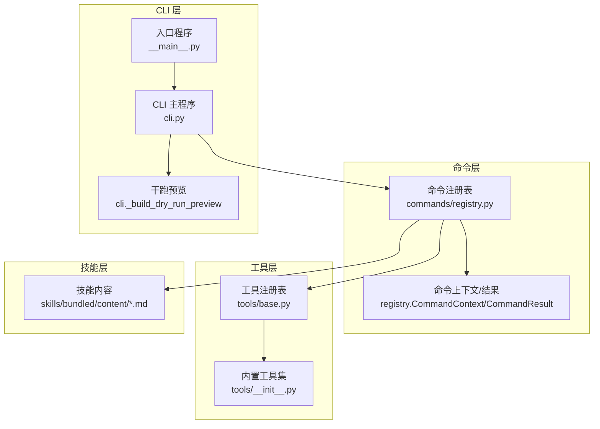
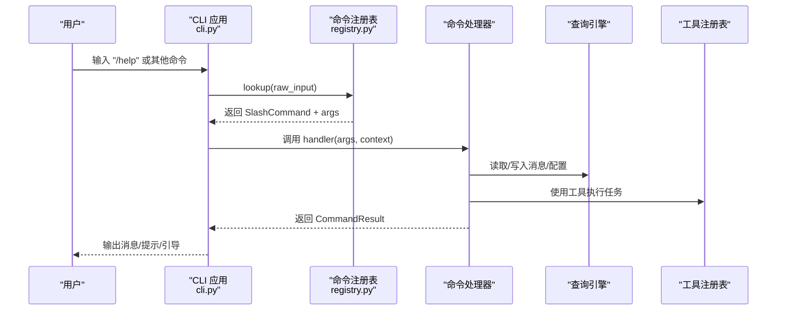
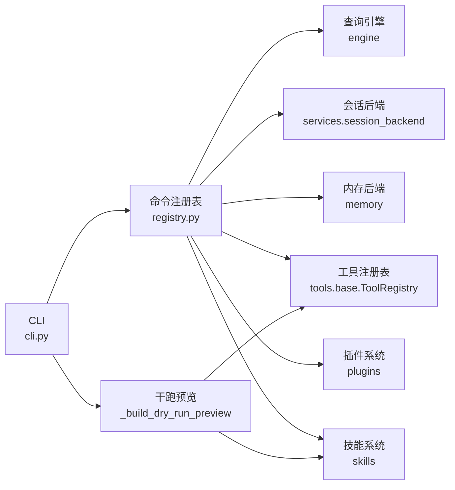

# 命令系统

<cite>
**本文引用的文件**
- [src/openharness/commands/__init__.py](file://src/openharness/commands/__init__.py)
- [src/openharness/commands/registry.py](file://src/openharness/commands/registry.py)
- [src/openharness/cli.py](file://src/openharness/cli.py)
- [src/openharness/__main__.py](file://src/openharness/__main__.py)
- [src/openharness/tools/__init__.py](file://src/openharness/tools/__init__.py)
- [src/openharness/tools/base.py](file://src/openharness/tools/base.py)
- [src/openharness/skills/bundled/content/commit.md](file://src/openharness/skills/bundled/content/commit.md)
- [src/openharness/skills/bundled/content/plan.md](file://src/openharness/skills/bundled/content/plan.md)
- [src/openharness/skills/bundled/content/review.md](file://src/openharness/skills/bundled/content/review.md)
- [src/openharness/skills/bundled/content/test.md](file://src/openharness/skills/bundled/content/test.md)
- [src/openharness/skills/bundled/content/debug.md](file://src/openharness/skills/bundled/content/debug.md)
- [tests/test_commands/test_cli.py](file://tests/test_commands/test_cli.py)
- [tests/test_commands/test_registry.py](file://tests/test_commands/test_registry.py)
- [tests/test_commands/test_command_flows.py](file://tests/test_commands/test_command_flows.py)
</cite>

## 目录
1. [简介](#简介)
2. [项目结构](#项目结构)
3. [核心组件](#核心组件)
4. [架构总览](#架构总览)
5. [详细组件分析](#详细组件分析)
6. [依赖分析](#依赖分析)
7. [性能考虑](#性能考虑)
8. [故障排除指南](#故障排除指南)
9. [结论](#结论)
10. [附录](#附录)

## 简介
本文件系统性阐述 OpenHarness 的命令系统，重点覆盖：
- 命令架构设计：命令注册机制、命令解析与执行流程
- 内置命令分类与功能：帮助、状态、会话、记忆、任务、模型、权限、插件、MCP、Autopilot、提交、计划、恢复等
- 斜杠命令的使用与交互模式
- 参数解析、校验与错误处理机制
- 扩展指南：自定义命令开发、注册与测试
- 命令与工具系统的集成关系
- 最佳实践、常见用法示例与调试排障方法

## 项目结构
命令系统主要由以下模块构成：
- 命令注册与运行时：commands/registry.py
- CLI 入口与干跑预览：cli.py
- 命令导出入口：commands/__init__.py
- 工具系统：tools/__init__.py、tools/base.py
- 技能内容（用于内置技能命令）：skills/bundled/content/*.md
- 测试：tests/test_commands/*

图表来源
- [src/openharness/commands/registry.py](file://src/openharness/commands/registry.py)
- [src/openharness/cli.py](file://src/openharness/cli.py)
- [src/openharness/__main__.py](file://src/openharness/__main__.py)
- [src/openharness/tools/base.py](file://src/openharness/tools/base.py)
- [src/openharness/tools/__init__.py](file://src/openharness/tools/__init__.py)
- [src/openharness/skills/bundled/content/commit.md](file://src/openharness/skills/bundled/content/commit.md)

章节来源
- [src/openharness/commands/__init__.py](file://src/openharness/commands/__init__.py)
- [src/openharness/commands/registry.py](file://src/openharness/commands/registry.py)
- [src/openharness/cli.py](file://src/openharness/cli.py)
- [src/openharness/__main__.py](file://src/openharness/__main__.py)

## 核心组件
- 命令注册表：维护斜杠命令到处理器的映射，支持别名与帮助输出
- 命令上下文：向命令处理器提供引擎、工具、会话后端、内存后端等运行时信息
- 命令结果：统一返回消息、退出控制、屏幕清空、重放对话、继续回合、刷新运行时、提交提示等
- 干跑预览：在不实际执行的情况下，对输入进行分类、行为标注、推荐匹配与就绪度评估

章节来源
- [src/openharness/commands/registry.py](file://src/openharness/commands/registry.py)
- [src/openharness/cli.py](file://src/openharness/cli.py)

## 架构总览
命令系统采用“注册表 + 上下文 + 结果”的解耦设计。CLI 在启动时构建默认命令注册表，并根据输入判断是斜杠命令还是模型请求；对于斜杠命令，通过注册表查找处理器并执行；处理器可直接返回消息，或返回“提交提示”以触发模型执行。

图表来源
- [src/openharness/cli.py](file://src/openharness/cli.py)
- [src/openharness/commands/registry.py](file://src/openharness/commands/registry.py)

## 详细组件分析

### 命令注册与解析
- 注册表：保存命令字典、规范名称列表，支持别名指向同一处理器
- 解析：以“/”开头识别斜杠命令，分割命令名与参数
- 帮助：按规范名排序输出可用命令摘要

章节来源
- [src/openharness/commands/registry.py](file://src/openharness/commands/registry.py)

### 命令上下文与结果
- 上下文字段：引擎、钩子/MCP/插件摘要、工作目录、工具注册表、应用状态、会话后端/ID、额外技能/插件根目录、内存后端、是否包含项目内存
- 结果字段：消息、是否退出、清屏、重放消息、继续挂起、继续回合数、刷新运行时、提交提示与模型

章节来源
- [src/openharness/commands/registry.py](file://src/openharness/commands/registry.py)

### 内置命令分类与功能
以下为常用内置命令的功能概览（名称与描述来自注册表）：

- 基础信息与状态
  - /help：显示可用命令列表
  - /version：显示版本
  - /status：显示消息数、用量、当前配置档、努力/轮次
  - /context：显示运行时系统提示
  - /hooks：显示已配置钩子摘要
  - /stats：显示会话统计（消息、估算token、工具数、内存文件数、后台任务数、输出样式）
  - /usage：显示实际用量与估算
  - /cost：显示模型与估算费用

- 会话与历史
  - /clear：清空对话并清屏
  - /resume：恢复指定或最新会话，支持列出最近会话
  - /session/show|ls|path|tag|clear：管理会话目录与快照
  - /export：导出 Markdown 转录
  - /share：生成可分享转录快照

- 记忆与文件
  - /memory：列出/显示/添加/删除记忆条目，含路径越界保护
  - /files：按关键词/数量限制列出文件或目录

- 模型与输出
  - /model：切换/列出/添加/移除/清空/默认模型（受配置档允许列表约束）
  - /output-style：设置输出样式
  - /theme：主题切换
  - /turns：设置最大轮次（含无限制）

- 权限与安全
  - /permissions：设置权限模式（本地仅限）
  - /provider：切换配置档（本地仅限）
  - /login|/logout：登录/登出（本地仅限）
  - /config：显示配置（敏感信息脱敏）
  - /keybindings：键位绑定

- 工具与任务
  - /tasks：创建/获取/列出/停止/读取输出/更新任务
  - /sleep：延时
  - /brief：简报
  - /cron：增删查切 Cron 任务
  - /remote-trigger：远程触发

- 技能与插件
  - /skills：列出技能（含项目级）
  - /plugin：安装/启用/禁用/卸载插件
  - /reload-plugins：重载插件
  - /mcp：管理 MCP 服务器
  - /agents：列出/查看子代理任务

- Autopilot
  - /autopilot：添加/列出/下一步/完成/导出仪表盘/状态

- 提交、计划、恢复、测试、调试
  - /commit：基于内置技能内容生成提交建议
  - /plan：基于内置技能内容设计实现计划
  - /review：基于内置技能内容进行代码审查
  - /test：基于内置技能内容编写与运行测试
  - /debug：基于内置技能内容系统化调试

章节来源
- [src/openharness/commands/registry.py](file://src/openharness/commands/registry.py)
- [src/openharness/skills/bundled/content/commit.md](file://src/openharness/skills/bundled/content/commit.md)
- [src/openharness/skills/bundled/content/plan.md](file://src/openharness/skills/bundled/content/plan.md)
- [src/openharness/skills/bundled/content/review.md](file://src/openharness/skills/bundled/content/review.md)
- [src/openharness/skills/bundled/content/test.md](file://src/openharness/skills/bundled/content/test.md)
- [src/openharness/skills/bundled/content/debug.md](file://src/openharness/skills/bundled/content/debug.md)

### 斜杠命令使用与交互模式
- 交互模式：默认启动交互会话，输入以“/”开头的斜杠命令触发命令执行
- 非交互模式：使用“-p/--print”传入提示，或“--dry-run”进行干跑预览
- 干跑预览：自动分类入口点（斜杠命令/模型请求/交互会话），评估就绪度，给出建议与匹配推荐

章节来源
- [src/openharness/cli.py](file://src/openharness/cli.py)

### 参数解析、校验与错误处理
- 参数解析：空格分隔，支持数字、布尔、字面量枚举等类型转换
- 校验策略：数值范围、布尔值集合、枚举白名单、路径越界保护、敏感信息脱敏
- 错误处理：返回明确消息，必要时刷新运行时或引导修复步骤

章节来源
- [src/openharness/commands/registry.py](file://src/openharness/commands/registry.py)

### 命令与工具系统的集成
- 工具注册表：集中注册内置工具，暴露 API Schema 供干跑预览与推荐
- 命令上下文：注入工具注册表，使命令处理器可调用工具执行文件操作、网络检索、任务管理等
- MCP 集成：通过工具适配器与 MCP 管理器对接，动态注册 MCP 工具

章节来源
- [src/openharness/tools/base.py](file://src/openharness/tools/base.py)
- [src/openharness/tools/__init__.py](file://src/openharness/tools/__init__.py)
- [src/openharness/cli.py](file://src/openharness/cli.py)

### 自定义命令开发、注册与测试
- 开发步骤
  - 定义命令处理器：接收 args 与 CommandContext，返回 CommandResult
  - 可选：注册为斜杠命令，或作为插件命令参与发现
  - 可选：渲染提示并返回 submit_prompt/submit_model 以触发模型执行
- 注册方式
  - 默认注册表：在创建默认注册表时添加命令
  - 插件命令：通过插件 manifest 注入，运行时动态注册
- 测试要点
  - 断言命令可被解析与执行
  - 断言行为标记（本地仅限/管理员可选）
  - 断言敏感信息脱敏
  - 断言路径越界防护
  - 断言与工具/会话/任务等子系统交互正确

章节来源
- [src/openharness/commands/registry.py](file://src/openharness/commands/registry.py)
- [tests/test_commands/test_registry.py](file://tests/test_commands/test_registry.py)
- [tests/test_commands/test_command_flows.py](file://tests/test_commands/test_command_flows.py)

### 最佳实践与常见用法
- 使用 /help 快速浏览可用命令
- 使用 /dry-run 预览输入将如何被处理（斜杠命令/模型请求/交互会话）
- 使用 /context 查看系统提示，结合 /summary 与 /compact 控制上下文长度
- 使用 /memory 管理知识库条目，配合 /files 快速定位
- 使用 /tasks 管理后台任务，结合 /agents 查看子代理状态
- 使用 /plugin 与 /reload-plugins 管理插件生态
- 使用 /model 列出/切换模型，确保符合配置档允许列表
- 使用 /permissions 与 /provider 管理安全与配置档
- 使用 /session 与 /resume 管理会话快照，便于回溯

章节来源
- [src/openharness/cli.py](file://src/openharness/cli.py)
- [src/openharness/commands/registry.py](file://src/openharness/commands/registry.py)

## 依赖分析
命令系统与工具系统、配置系统、会话存储、插件系统存在紧密耦合。

图表来源
- [src/openharness/commands/registry.py](file://src/openharness/commands/registry.py)
- [src/openharness/cli.py](file://src/openharness/cli.py)
- [src/openharness/tools/base.py](file://src/openharness/tools/base.py)

章节来源
- [src/openharness/commands/registry.py](file://src/openharness/commands/registry.py)
- [src/openharness/cli.py](file://src/openharness/cli.py)

## 性能考虑
- 干跑预览避免实际执行，显著降低开销
- 对长对话使用 /summary 与 /compact 控制上下文长度，减少 token 消耗
- 合理使用 /memory 与 /files，避免一次性列举过多文件
- 使用 /tasks 与 /agents 异步处理后台工作，避免阻塞交互

## 故障排除指南
- 命令无法识别
  - 检查是否以“/”开头，确认命令名拼写
  - 使用 /help 查看可用命令
- 会话恢复失败
  - 使用 /resume 列出会话，确认会话 ID 正确
  - 检查会话目录是否存在
- 内存访问异常
  - 确认路径未越界，避免使用相对路径穿越
- 模型切换失败
  - 使用 /model list 查看允许模型列表，确保目标模型在允许列表中
- 权限问题
  - 使用 /permissions 设置权限模式，必要时使用管理员可选标记
- 干跑阻塞
  - 根据就绪度评估与建议修复认证、MCP 配置或提供提示

章节来源
- [src/openharness/cli.py](file://src/openharness/cli.py)
- [src/openharness/commands/registry.py](file://src/openharness/commands/registry.py)
- [tests/test_commands/test_cli.py](file://tests/test_commands/test_cli.py)
- [tests/test_commands/test_registry.py](file://tests/test_commands/test_registry.py)

## 结论
OpenHarness 命令系统以注册表为核心，围绕上下文与结果抽象，实现了清晰的命令解析、执行与反馈闭环。通过与工具系统、会话存储、插件与技能的深度集成，命令系统既能满足日常交互需求，又能通过干跑预览与行为标注保障安全性与可预测性。遵循本文的最佳实践与扩展指南，可高效地开发与维护自定义命令。

## 附录
- CLI 入口与主程序
  - 入口程序：通过 __main__.py 调用 cli.py 的 Typer 应用
  - 主程序：提供子命令组（mcp/plugin/auth/provider/cron/autopilot），以及干跑预览与入口点分类

章节来源
- [src/openharness/__main__.py](file://src/openharness/__main__.py)
- [src/openharness/cli.py](file://src/openharness/cli.py)