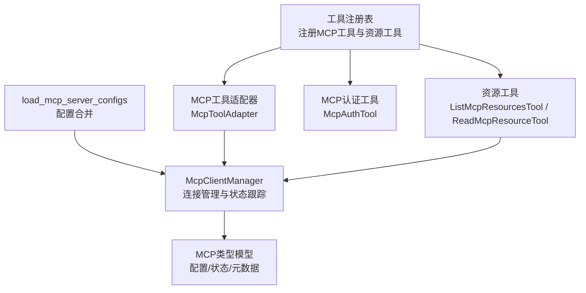
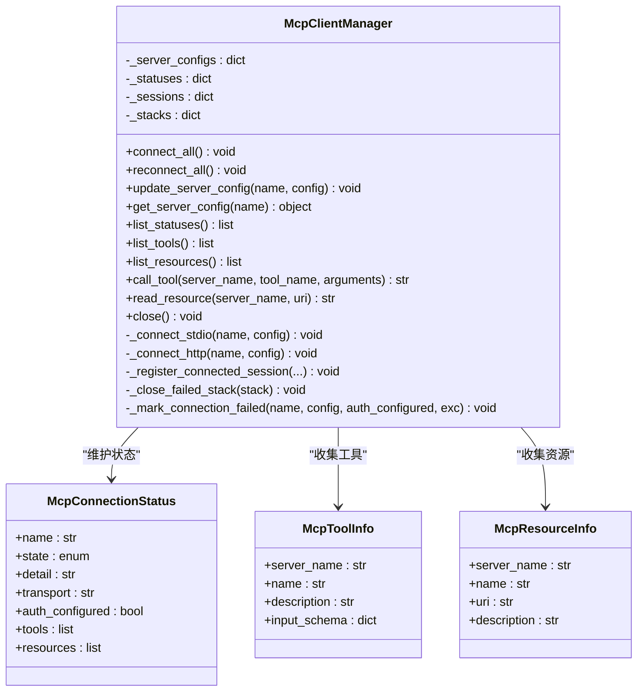
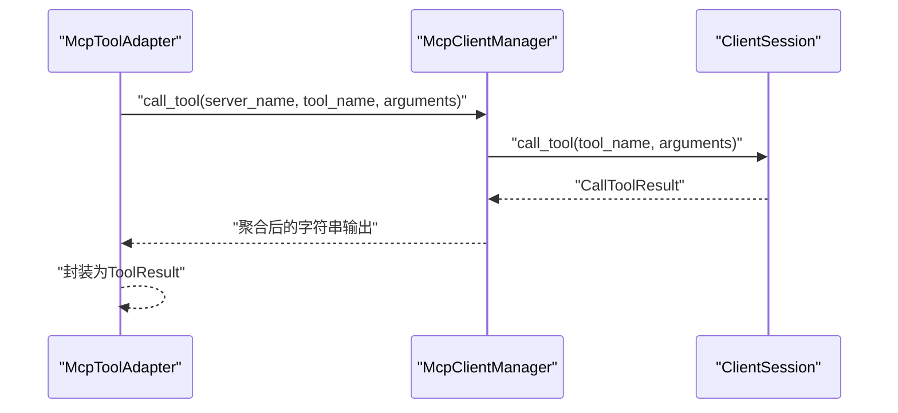
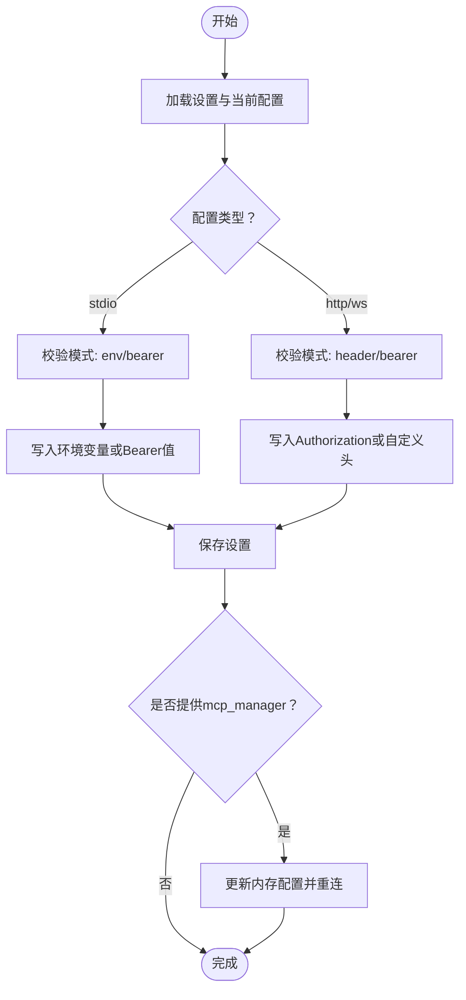
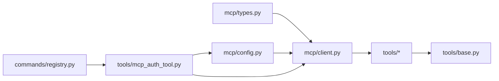
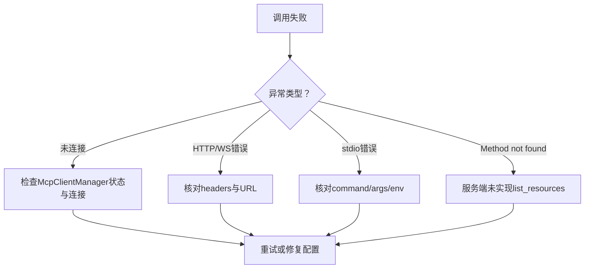

# MCP协议工具

<cite>
**本文档引用的文件**
- [mcp/__init__.py](file://src/openharness/mcp/__init__.py)
- [mcp/client.py](file://src/openharness/mcp/client.py)
- [mcp/config.py](file://src/openharness/mcp/config.py)
- [mcp/types.py](file://src/openharness/mcp/types.py)
- [tools/mcp_tool.py](file://src/openharness/tools/mcp_tool.py)
- [tools/mcp_auth_tool.py](file://src/openharness/tools/mcp_auth_tool.py)
- [tools/list_mcp_resources_tool.py](file://src/openharness/tools/list_mcp_resources_tool.py)
- [tools/read_mcp_resource_tool.py](file://src/openharness/tools/read_mcp_resource_tool.py)
- [tools/base.py](file://src/openharness/tools/base.py)
- [tools/__init__.py](file://src/openharness/tools/__init__.py)
- [commands/registry.py](file://src/openharness/commands/registry.py)
- [test_mcp/test_integration.py](file://tests/test_mcp/test_integration.py)
- [test_mcp/test_http_flow.py](file://tests/test_mcp/test_http_flow.py)
- [test_mcp/test_client_errors.py](file://tests/test_mcp/test_client_errors.py)
- [fixtures/fake_mcp_server.py](file://tests/fixtures/fake_mcp_server.py)
</cite>

## 目录
1. [简介](#简介)
2. [项目结构](#项目结构)
3. [核心组件](#核心组件)
4. [架构总览](#架构总览)
5. [详细组件分析](#详细组件分析)
6. [依赖关系分析](#依赖关系分析)
7. [性能考虑](#性能考虑)
8. [故障排除指南](#故障排除指南)
9. [结论](#结论)
10. [附录](#附录)

## 简介
本文件系统性阐述OpenHarness中MCP（Model Context Protocol）协议工具的实现与使用方法。内容涵盖MCP客户端架构、连接管理、消息处理流程；通用MCP调用工具mcp_tool、身份认证工具mcp_auth_tool，以及资源访问工具list_mcp_resources_tool与read_mcp_resource_tool的功能与集成方式；同时解释MCP服务器配置、协议握手过程与错误处理机制，并给出实际集成示例与安全、性能优化建议。

## 项目结构
MCP相关代码主要分布在以下模块：
- mcp：MCP客户端管理器、配置加载与类型定义
- tools：MCP工具适配器与资源访问工具
- commands：命令行入口对MCP认证的支持
- tests：MCP集成与端到端测试

```mermaid
graph TB
subgraph "MCP模块"
MCPInit["mcp/__init__.py"]
MCPClient["mcp/client.py"]
MCPConfig["mcp/config.py"]
MCPTypes["mcp/types.py"]
end
subgraph "工具模块"
ToolsBase["tools/base.py"]
ToolsInit["tools/__init__.py"]
ToolMCP["tools/mcp_tool.py"]
ToolAuth["tools/mcp_auth_tool.py"]
ToolListRes["tools/list_mcp_resources_tool.py"]
ToolReadRes["tools/read_mcp_resource_tool.py"]
end
subgraph "命令行"
CmdRegistry["commands/registry.py"]
end
subgraph "测试"
TestInt["test_mcp/test_integration.py"]
TestHTTP["test_mcp/test_http_flow.py"]
TestErr["test_mcp/test_client_errors.py"]
Fixture["fixtures/fake_mcp_server.py"]
end
MCPInit --> MCPClient
MCPInit --> MCPConfig
MCPInit --> MCPTypes
ToolsInit --> ToolMCP
ToolsInit --> ToolAuth
ToolsInit --> ToolListRes
ToolsInit --> ToolReadRes
ToolsInit --> MCPClient
CmdRegistry --> ToolAuth
CmdRegistry --> MCPConfig
TestInt --> MCPClient
TestInt --> ToolMCP
TestHTTP --> MCPClient
TestErr --> MCPClient
Fixture --> MCPClient
```

**图表来源**
- [mcp/__init__.py:1-80](file://src/openharness/mcp/__init__.py#L1-L80)
- [mcp/client.py:1-299](file://src/openharness/mcp/client.py#L1-L299)
- [mcp/config.py:1-17](file://src/openharness/mcp/config.py#L1-L17)
- [mcp/types.py:1-77](file://src/openharness/mcp/types.py#L1-L77)
- [tools/base.py:1-81](file://src/openharness/tools/base.py#L1-L81)
- [tools/__init__.py:89-105](file://src/openharness/tools/__init__.py#L89-L105)
- [tools/mcp_tool.py:1-73](file://src/openharness/tools/mcp_tool.py#L1-L73)
- [tools/mcp_auth_tool.py:1-72](file://src/openharness/tools/mcp_auth_tool.py#L1-L72)
- [tools/list_mcp_resources_tool.py:1-37](file://src/openharness/tools/list_mcp_resources_tool.py#L1-L37)
- [tools/read_mcp_resource_tool.py:1-39](file://src/openharness/tools/read_mcp_resource_tool.py#L1-L39)
- [commands/registry.py:1185-1237](file://src/openharness/commands/registry.py#L1185-L1237)
- [test_mcp/test_integration.py:1-80](file://tests/test_mcp/test_integration.py#L1-L80)
- [test_mcp/test_http_flow.py:40-75](file://tests/test_mcp/test_http_flow.py#L40-L75)
- [test_mcp/test_client_errors.py:148-192](file://tests/test_mcp/test_client_errors.py#L148-L192)
- [fixtures/fake_mcp_server.py:1-22](file://tests/fixtures/fake_mcp_server.py#L1-L22)

**章节来源**
- [mcp/__init__.py:1-80](file://src/openharness/mcp/__init__.py#L1-L80)
- [mcp/client.py:1-299](file://src/openharness/mcp/client.py#L1-L299)
- [mcp/config.py:1-17](file://src/openharness/mcp/config.py#L1-L17)
- [mcp/types.py:1-77](file://src/openharness/mcp/types.py#L1-L77)
- [tools/base.py:1-81](file://src/openharness/tools/base.py#L1-L81)
- [tools/__init__.py:89-105](file://src/openharness/tools/__init__.py#L89-L105)
- [tools/mcp_tool.py:1-73](file://src/openharness/tools/mcp_tool.py#L1-L73)
- [tools/mcp_auth_tool.py:1-72](file://src/openharness/tools/mcp_auth_tool.py#L1-L72)
- [tools/list_mcp_resources_tool.py:1-37](file://src/openharness/tools/list_mcp_resources_tool.py#L1-L37)
- [tools/read_mcp_resource_tool.py:1-39](file://src/openharness/tools/read_mcp_resource_tool.py#L1-L39)
- [commands/registry.py:1185-1237](file://src/openharness/commands/registry.py#L1185-L1237)
- [test_mcp/test_integration.py:1-80](file://tests/test_mcp/test_integration.py#L1-L80)
- [test_mcp/test_http_flow.py:40-75](file://tests/test_mcp/test_http_flow.py#L40-L75)
- [test_mcp/test_client_errors.py:148-192](file://tests/test_mcp/test_client_errors.py#L148-L192)
- [fixtures/fake_mcp_server.py:1-22](file://tests/fixtures/fake_mcp_server.py#L1-L22)

## 核心组件
- MCP客户端管理器：负责多服务器连接、状态跟踪、工具与资源发现、调用与读取操作
- MCP配置加载器：从设置与插件合并MCP服务器配置
- MCP类型定义：标准化服务器配置、连接状态、工具与资源元数据
- 工具适配器：将MCP工具转换为OpenHarness标准工具接口
- 身份认证工具：持久化并应用MCP认证配置，支持重新连接
- 资源访问工具：列出与读取MCP资源
- 基础工具抽象：统一工具接口、执行上下文与结果格式

**章节来源**
- [mcp/client.py:29-299](file://src/openharness/mcp/client.py#L29-L299)
- [mcp/config.py:8-17](file://src/openharness/mcp/config.py#L8-L17)
- [mcp/types.py:11-77](file://src/openharness/mcp/types.py#L11-L77)
- [tools/mcp_tool.py:14-73](file://src/openharness/tools/mcp_tool.py#L14-L73)
- [tools/mcp_auth_tool.py:21-72](file://src/openharness/tools/mcp_auth_tool.py#L21-L72)
- [tools/list_mcp_resources_tool.py:15-37](file://src/openharness/tools/list_mcp_resources_tool.py#L15-L37)
- [tools/read_mcp_resource_tool.py:18-39](file://src/openharness/tools/read_mcp_resource_tool.py#L18-L39)
- [tools/base.py:35-81](file://src/openharness/tools/base.py#L35-L81)

## 架构总览
下图展示MCP客户端在系统中的位置与交互关系：

**图表来源**
- [mcp/client.py:29-299](file://src/openharness/mcp/client.py#L29-L299)
- [mcp/types.py:11-77](file://src/openharness/mcp/types.py#L11-L77)
- [mcp/config.py:8-17](file://src/openharness/mcp/config.py#L8-L17)
- [tools/__init__.py:89-105](file://src/openharness/tools/__init__.py#L89-L105)
- [tools/mcp_tool.py:14-73](file://src/openharness/tools/mcp_tool.py#L14-L73)
- [tools/mcp_auth_tool.py:21-72](file://src/openharness/tools/mcp_auth_tool.py#L21-L72)
- [tools/list_mcp_resources_tool.py:15-37](file://src/openharness/tools/list_mcp_resources_tool.py#L15-L37)
- [tools/read_mcp_resource_tool.py:18-39](file://src/openharness/tools/read_mcp_resource_tool.py#L18-L39)

## 详细组件分析

### MCP客户端管理器（McpClientManager）
职责与特性：
- 统一管理多个MCP服务器连接（stdio、http）
- 记录每个服务器的连接状态、工具列表与资源列表
- 提供工具调用与资源读取的统一封装
- 支持重连与配置更新
- 异常处理：未连接时抛出明确错误

关键流程：
- 连接建立：根据配置类型选择stdio或http路径，初始化会话并调用list_tools与list_resources
- 工具调用：将参数序列化后调用session.call_tool，聚合返回内容
- 资源读取：调用session.read_resource并聚合响应内容
- 错误处理：捕获异常并标记失败状态，提供可诊断的detail信息

**图表来源**
- [mcp/client.py:29-299](file://src/openharness/mcp/client.py#L29-L299)
- [mcp/types.py:66-77](file://src/openharness/mcp/types.py#L66-L77)
- [mcp/types.py:46-64](file://src/openharness/mcp/types.py#L46-L64)

**章节来源**
- [mcp/client.py:29-299](file://src/openharness/mcp/client.py#L29-L299)
- [mcp/types.py:46-77](file://src/openharness/mcp/types.py#L46-L77)

### MCP配置加载器（load_mcp_server_configs）
- 合并settings.mcp_servers与已启用插件的mcp_servers
- 插件配置键名采用“插件名:配置名”的命名空间避免冲突
- 返回最终服务器配置字典供客户端管理器使用

**章节来源**
- [mcp/config.py:8-17](file://src/openharness/mcp/config.py#L8-L17)
- [test_mcp/test_integration.py:35-50](file://tests/test_mcp/test_integration.py#L35-L50)

### MCP类型定义
- 服务器配置：McpStdioServerConfig、McpHttpServerConfig、McpWebSocketServerConfig
- 配置文件结构：McpJsonConfig（含mcpServers字段）
- 运行时状态：McpConnectionStatus（包含tools与resources列表）
- 元数据：McpToolInfo、McpResourceInfo

**章节来源**
- [mcp/types.py:11-77](file://src/openharness/mcp/types.py#L11-L77)

### MCP工具适配器（McpToolAdapter）
- 将MCP工具元数据转换为OpenHarness工具名称与输入模型
- 执行时通过McpClientManager调用对应工具并返回字符串化结果
- 输入模型基于MCP工具的JSON Schema动态生成

**图表来源**
- [tools/mcp_tool.py:26-36](file://src/openharness/tools/mcp_tool.py#L26-L36)
- [mcp/client.py:129-154](file://src/openharness/mcp/client.py#L129-L154)

**章节来源**
- [tools/mcp_tool.py:14-73](file://src/openharness/tools/mcp_tool.py#L14-L73)
- [mcp/client.py:129-154](file://src/openharness/mcp/client.py#L129-L154)

### MCP认证工具（McpAuthTool）
- 支持三种模式：bearer、header、env
- 根据服务器类型自动选择合适的认证字段（HTTP使用headers，WS同HTTP，stdio使用env）
- 更新设置后可尝试更新内存配置并重连所有服务器
- 提供清晰的错误提示与回退行为

**图表来源**
- [tools/mcp_auth_tool.py:28-72](file://src/openharness/tools/mcp_auth_tool.py#L28-L72)

**章节来源**
- [tools/mcp_auth_tool.py:21-72](file://src/openharness/tools/mcp_auth_tool.py#L21-L72)
- [commands/registry.py:1185-1237](file://src/openharness/commands/registry.py#L1185-L1237)

### 资源访问工具
- 列出资源：遍历所有已连接服务器的资源元数据并格式化输出
- 读取资源：通过McpClientManager调用read_resource并返回字符串化内容

**章节来源**
- [tools/list_mcp_resources_tool.py:15-37](file://src/openharness/tools/list_mcp_resources_tool.py#L15-L37)
- [tools/read_mcp_resource_tool.py:18-39](file://src/openharness/tools/read_mcp_resource_tool.py#L18-L39)
- [mcp/client.py:156-178](file://src/openharness/mcp/client.py#L156-L178)

### 工具注册与默认注册表
- 默认注册表在存在McpClientManager时自动注册资源工具与所有MCP工具适配器
- 每个MCP工具被转换为以“mcp__{server}__{tool}”命名的OpenHarness工具

**章节来源**
- [tools/__init__.py:89-105](file://src/openharness/tools/__init__.py#L89-L105)
- [test_mcp/test_integration.py:52-80](file://tests/test_mcp/test_integration.py#L52-L80)

## 依赖关系分析
- McpClientManager依赖mcp.types中的配置与状态模型
- 工具适配器与资源工具依赖McpClientManager提供的统一接口
- McpAuthTool依赖配置加载与保存逻辑，并可触发McpClientManager的重连
- 命令行入口提供对MCP认证的便捷操作

**图表来源**
- [mcp/types.py:11-77](file://src/openharness/mcp/types.py#L11-L77)
- [mcp/client.py:29-299](file://src/openharness/mcp/client.py#L29-L299)
- [mcp/config.py:8-17](file://src/openharness/mcp/config.py#L8-L17)
- [tools/base.py:35-81](file://src/openharness/tools/base.py#L35-L81)
- [tools/mcp_auth_tool.py:21-72](file://src/openharness/tools/mcp_auth_tool.py#L21-L72)
- [commands/registry.py:1185-1237](file://src/openharness/commands/registry.py#L1185-L1237)

**章节来源**
- [mcp/types.py:11-77](file://src/openharness/mcp/types.py#L11-L77)
- [mcp/client.py:29-299](file://src/openharness/mcp/client.py#L29-L299)
- [mcp/config.py:8-17](file://src/openharness/mcp/config.py#L8-L17)
- [tools/base.py:35-81](file://src/openharness/tools/base.py#L35-L81)
- [tools/mcp_auth_tool.py:21-72](file://src/openharness/tools/mcp_auth_tool.py#L21-L72)
- [commands/registry.py:1185-1237](file://src/openharness/commands/registry.py#L1185-L1237)

## 性能考虑
- 连接复用：McpClientManager为每个服务器维护独立会话，避免重复握手开销
- 并发控制：连接建立与工具调用均采用异步模式，减少阻塞
- 资源聚合：工具与资源返回内容按类型聚合，减少后续处理成本
- 失败快速反馈：连接失败时记录状态与详细信息，便于快速定位问题
- 配置缓存：内存中的服务器配置可直接更新，避免频繁I/O

[本节为通用性能讨论，无需特定文件分析]

## 故障排除指南
常见问题与处理：
- 未连接错误：当服务器未连接或会话丢失时，工具调用与资源读取会抛出明确异常，需检查连接状态与网络
- 连接失败：查看McpConnectionStatus.detail，确认传输类型与认证配置
- HTTP握手失败：核对headers与URL，确保服务端支持流式HTTP
- stdio启动失败：检查command、args与env配置，确认可执行文件可用
- 资源方法不存在：当服务端未实现list_resources时，客户端会忽略并继续运行

**图表来源**
- [mcp/client.py:86-101](file://src/openharness/mcp/client.py#L86-L101)
- [mcp/client.py:266-270](file://src/openharness/mcp/client.py#L266-L270)
- [test_mcp/test_client_errors.py:163-192](file://tests/test_mcp/test_client_errors.py#L163-L192)

**章节来源**
- [mcp/client.py:86-101](file://src/openharness/mcp/client.py#L86-L101)
- [mcp/client.py:266-270](file://src/openharness/mcp/client.py#L266-L270)
- [test_mcp/test_client_errors.py:163-192](file://tests/test_mcp/test_client_errors.py#L163-L192)

## 结论
OpenHarness的MCP工具体系提供了完整的客户端管理、配置合并、工具与资源适配、认证与错误处理能力。通过McpClientManager统一调度，配合工具注册表与命令行入口，用户可以方便地集成多种MCP服务器，实现安全、高效的工具扩展与资源访问。

[本节为总结性内容，无需特定文件分析]

## 附录

### MCP服务器配置与协议握手
- 配置来源：settings.mcp_servers与已启用插件的mcp_servers
- 握手流程：建立连接后初始化会话，调用list_tools与list_resources获取元数据
- 认证：HTTP/WS使用headers，stdio使用env，支持bearer与自定义键

**章节来源**
- [mcp/config.py:8-17](file://src/openharness/mcp/config.py#L8-L17)
- [mcp/client.py:252-299](file://src/openharness/mcp/client.py#L252-L299)
- [mcp/types.py:21-35](file://src/openharness/mcp/types.py#L21-L35)

### 实际集成示例
- 自定义资源定义：在服务端使用装饰器声明资源，客户端通过list_mcp_resources_tool与read_mcp_resource_tool访问
- 工具扩展：在服务端注册工具，客户端自动发现并通过McpToolAdapter暴露为OpenHarness工具
- 命令行认证：通过命令行工具快速更新认证配置并提示重启会话

**章节来源**
- [test_mcp/test_integration.py:52-80](file://tests/test_mcp/test_integration.py#L52-L80)
- [fixtures/fake_mcp_server.py:10-18](file://tests/fixtures/fake_mcp_server.py#L10-L18)
- [commands/registry.py:1185-1237](file://src/openharness/commands/registry.py#L1185-L1237)

### 安全考虑
- 认证字段隔离：HTTP/WS与stdio分别使用headers与env，避免混淆
- 令牌注入：支持Bearer模式，自动添加Authorization头或环境变量
- 配置持久化：通过设置文件保存认证信息，避免明文硬编码

**章节来源**
- [tools/mcp_auth_tool.py:39-56](file://src/openharness/tools/mcp_auth_tool.py#L39-L56)
- [commands/registry.py:1189-1228](file://src/openharness/commands/registry.py#L1189-L1228)