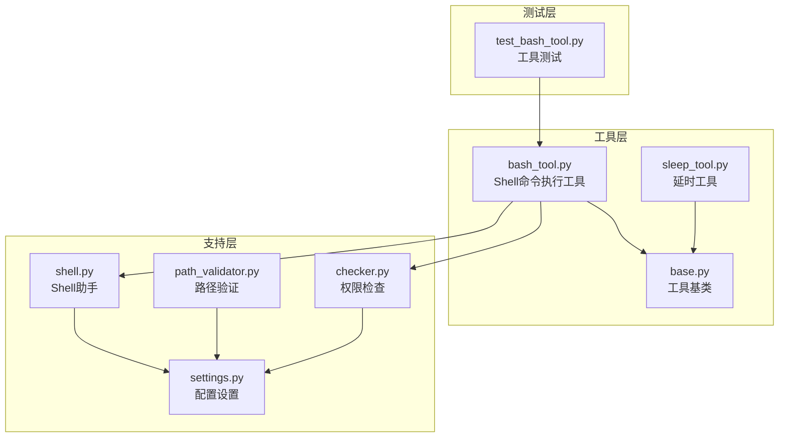
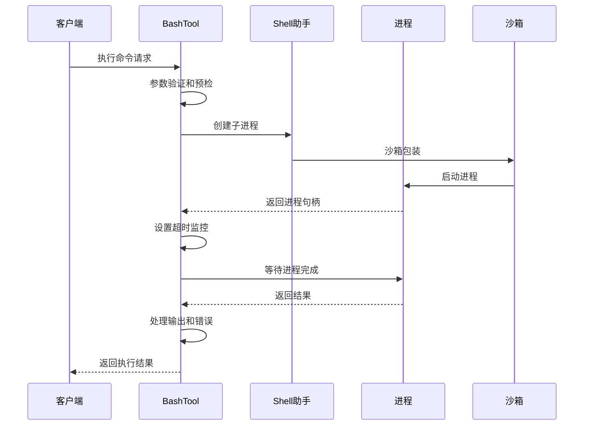
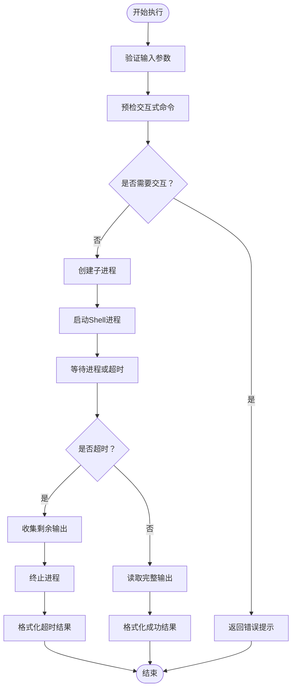
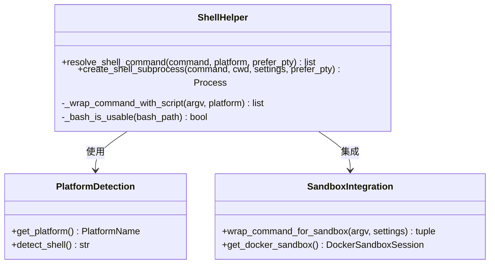
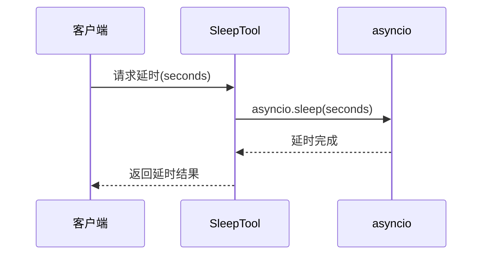
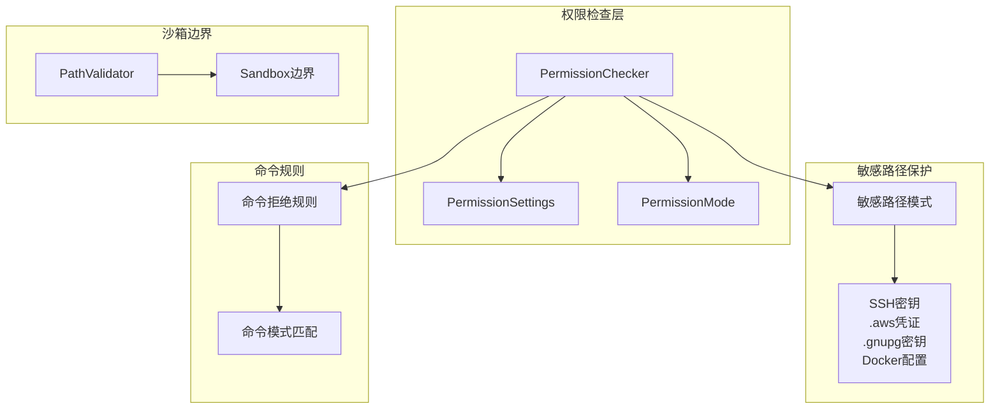
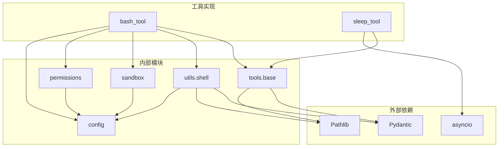
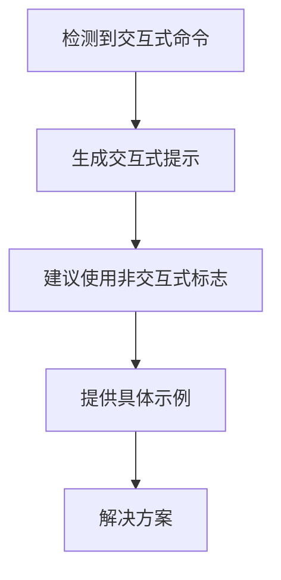

# Shell命令工具

<cite>
**本文档引用的文件**
- [bash_tool.py](file://src/openharness/tools/bash_tool.py)
- [sleep_tool.py](file://src/openharness/tools/sleep_tool.py)
- [shell.py](file://src/openharness/utils/shell.py)
- [path_validator.py](file://src/openharness/sandbox/path_validator.py)
- [base.py](file://src/openharness/tools/base.py)
- [settings.py](file://src/openharness/config/settings.py)
- [checker.py](file://src/openharness/permissions/checker.py)
- [test_bash_tool.py](file://tests/test_tools/test_bash_tool.py)
- [system_prompt.py](file://src/openharness/prompts/system_prompt.py)
</cite>

## 目录
1. [简介](#简介)
2. [项目结构](#项目结构)
3. [核心组件](#核心组件)
4. [架构概览](#架构概览)
5. [详细组件分析](#详细组件分析)
6. [依赖关系分析](#依赖关系分析)
7. [性能考虑](#性能考虑)
8. [故障排除指南](#故障排除指南)
9. [结论](#结论)
10. [附录](#附录)

## 简介

OpenHarness项目提供了强大的Shell命令执行能力，通过两个核心工具实现了安全、可靠的命令执行环境。本文档深入解析bash_tool的命令执行功能和sleep_tool的延时功能，涵盖参数传递、输出捕获、错误处理和超时控制等关键特性。

## 项目结构

OpenHarness的Shell工具位于`src/openharness/tools/`目录下，采用模块化设计，每个工具都有独立的实现文件和测试用例。

**图表来源**
- [bash_tool.py:1-219](file://src/openharness/tools/bash_tool.py#L1-L219)
- [sleep_tool.py:1-33](file://src/openharness/tools/sleep_tool.py#L1-L33)
- [shell.py:1-148](file://src/openharness/utils/shell.py#L1-L148)

**章节来源**
- [bash_tool.py:1-219](file://src/openharness/tools/bash_tool.py#L1-L219)
- [sleep_tool.py:1-33](file://src/openharness/tools/sleep_tool.py#L1-L33)
- [shell.py:1-148](file://src/openharness/utils/shell.py#L1-L148)

## 核心组件

### BashTool - Shell命令执行工具

BashTool是OpenHarness的核心Shell执行工具，提供了完整的命令执行生命周期管理：

- **命令参数传递**：支持命令字符串、工作目录覆盖和超时配置
- **输出捕获**：统一捕获stdout和stderr，支持实时流式输出
- **错误处理**：智能错误分类，包括超时、交互式命令检测和沙箱错误
- **超时控制**：可配置的超时机制，确保长时间运行命令的安全性

### SleepTool - 延时工具

SleepTool提供了精确的延时功能，支持微秒级精度的时间控制：

- **参数验证**：范围限制在0到30秒之间
- **异步执行**：基于asyncio的非阻塞延时
- **只读特性**：明确标记为只读工具，无需权限检查

**章节来源**
- [bash_tool.py:27-85](file://src/openharness/tools/bash_tool.py#L27-L85)
- [sleep_tool.py:18-33](file://src/openharness/tools/sleep_tool.py#L18-L33)

## 架构概览

OpenHarness的Shell工具架构采用了分层设计，确保了功能的模块化和安全性。

**图表来源**
- [bash_tool.py:34-85](file://src/openharness/tools/bash_tool.py#L34-L85)
- [shell.py:51-105](file://src/openharness/utils/shell.py#L51-L105)

## 详细组件分析

### BashTool执行流程

BashTool的执行流程体现了OpenHarness对Shell命令执行的深度封装：

**图表来源**
- [bash_tool.py:34-85](file://src/openharness/tools/bash_tool.py#L34-L85)
- [bash_tool.py:103-152](file://src/openharness/tools/bash_tool.py#L103-L152)

#### 参数传递机制

BashTool支持灵活的参数传递：

- **command**：必需的Shell命令字符串
- **cwd**：可选的工作目录覆盖，支持用户展开
- **timeout_seconds**：可配置的超时时间，默认600秒

#### 输出捕获策略

工具实现了多层次的输出捕获：

- **实时流式输出**：使用异步流读取，避免内存溢出
- **合并输出**：将stdout和stderr合并为统一输出
- **截断处理**：超过12000字符的输出自动截断

#### 错误处理机制

BashTool提供了完善的错误处理：

- **超时错误**：超时后收集部分输出并返回详细信息
- **交互式命令检测**：识别可能需要用户交互的命令
- **沙箱不可用错误**：Docker沙箱不可用时的优雅降级

**章节来源**
- [bash_tool.py:19-25](file://src/openharness/tools/bash_tool.py#L19-L25)
- [bash_tool.py:34-85](file://src/openharness/tools/bash_tool.py#L34-L85)
- [bash_tool.py:135-152](file://src/openharness/tools/bash_tool.py#L135-L152)

### Shell助手功能

Shell助手提供了跨平台的Shell选择和进程管理：

**图表来源**
- [shell.py:17-48](file://src/openharness/utils/shell.py#L17-L48)
- [shell.py:51-105](file://src/openharness/utils/shell.py#L51-L105)

#### 平台适配策略

Shell助手支持多平台适配：

- **Windows平台**：优先bash，否则PowerShell，最后cmd
- **Unix/Linux平台**：优先bash，回退sh
- **WSL环境检测**：避免使用不可用的WSL bash

#### 沙箱集成

通过沙箱集成实现安全的命令执行：

- **Docker后端**：支持Docker容器内的命令执行
- **脚本包装**：在某些平台上使用script命令包装
- **清理机制**：进程退出后的资源清理

**章节来源**
- [shell.py:17-48](file://src/openharness/utils/shell.py#L17-L48)
- [shell.py:51-105](file://src/openharness/utils/shell.py#L51-L105)

### SleepTool实现

SleepTool虽然简单，但体现了OpenHarness工具设计的一致性：

**图表来源**
- [sleep_tool.py:29-32](file://src/openharness/tools/sleep_tool.py#L29-L32)

#### 只读特性

SleepTool明确标记为只读工具，这影响了权限检查和执行行为：

- **权限豁免**：不需要权限检查
- **安全保证**：不会修改任何系统状态
- **资源占用**：最小化的CPU和内存占用

**章节来源**
- [sleep_tool.py:25-27](file://src/openharness/tools/sleep_tool.py#L25-L27)
- [sleep_tool.py:29-32](file://src/openharness/tools/sleep_tool.py#L29-L32)

### 安全限制与权限控制

OpenHarness实现了多层次的安全防护：

**图表来源**
- [checker.py:57-156](file://src/openharness/permissions/checker.py#L57-L156)
- [path_validator.py:8-37](file://src/openharness/sandbox/path_validator.py#L8-L37)

#### 敏感路径保护

内置的敏感路径保护机制：

- **SSH密钥保护**：阻止访问`~/.ssh/*`目录
- **云凭证保护**：保护AWS、GCP、Azure等云服务凭证
- **Docker配置保护**：防止访问Docker认证配置
- **Kubernetes配置保护**：保护集群访问配置

#### 路径验证机制

PathValidator确保文件操作在沙箱边界内：

- **主边界检查**：确保路径在工作目录范围内
- **额外允许路径**：支持配置额外的允许路径
- **符号链接保护**：防止通过符号链接绕过边界

**章节来源**
- [checker.py:14-37](file://src/openharness/permissions/checker.py#L14-L37)
- [path_validator.py:8-37](file://src/openharness/sandbox/path_validator.py#L8-L37)

## 依赖关系分析

OpenHarness的Shell工具依赖关系体现了清晰的分层架构：

**图表来源**
- [bash_tool.py:9-13](file://src/openharness/tools/bash_tool.py#L9-L13)
- [sleep_tool.py:7-9](file://src/openharness/tools/sleep_tool.py#L7-L9)

### 关键依赖关系

- **Pydantic验证**：所有工具输入都经过严格的类型验证
- **asyncio异步**：支持非阻塞的并发执行
- **Pathlib路径处理**：统一的跨平台路径处理
- **沙箱集成**：Docker沙箱的无缝集成

**章节来源**
- [bash_tool.py:9-13](file://src/openharness/tools/bash_tool.py#L9-L13)
- [sleep_tool.py:7-9](file://src/openharness/tools/sleep_tool.py#L7-L9)

## 性能考虑

OpenHarness在性能方面采用了多项优化策略：

### 异步I/O优化

- **流式读取**：使用异步流读取避免内存峰值
- **超时控制**：精确的超时机制防止资源泄漏
- **进程管理**：智能的进程生命周期管理

### 内存管理

- **输出缓冲**：动态调整输出缓冲大小
- **截断策略**：长输出自动截断，避免内存溢出
- **资源清理**：进程退出后的自动清理

### 并发执行

- **并行工具调用**：支持多个工具的并行执行
- **事件循环优化**：高效的事件循环调度
- **连接池管理**：复用网络连接减少开销

## 故障排除指南

### 常见问题诊断

#### 交互式命令问题

当遇到需要用户交互的命令时，BashTool会返回明确的错误信息：

**图表来源**
- [bash_tool.py:155-176](file://src/openharness/tools/bash_tool.py#L155-L176)

#### 超时问题

超时处理机制确保系统稳定性：

- **部分输出收集**：超时前的输出会被完整收集
- **进程强制终止**：超时后自动终止进程
- **详细错误报告**：包含超时时间和部分输出

#### 沙箱问题

Docker沙箱不可用时的降级处理：

- **自动降级**：从Docker切换到本地执行
- **错误传播**：向用户报告具体的沙箱错误
- **配置检查**：指导用户检查Docker配置

**章节来源**
- [bash_tool.py:53-58](file://src/openharness/tools/bash_tool.py#L53-L58)
- [bash_tool.py:62-74](file://src/openharness/tools/bash_tool.py#L62-L74)

### 测试验证

项目提供了全面的测试覆盖：

- **单元测试**：每个功能点都有对应的测试用例
- **集成测试**：模拟真实使用场景
- **边界测试**：测试极端情况和异常处理

**章节来源**
- [test_bash_tool.py:75-216](file://tests/test_tools/test_bash_tool.py#L75-L216)

## 结论

OpenHarness的Shell命令工具展现了现代AI代理基础设施的设计理念：

### 技术优势

- **安全性优先**：多层次的安全防护机制
- **可靠性保障**：完善的错误处理和超时控制
- **性能优化**：异步I/O和资源管理优化
- **可扩展性**：模块化设计支持功能扩展

### 应用价值

这些工具为AI代理提供了强大的系统操作能力，支持从简单的文件操作到复杂的系统管理任务。

## 附录

### 使用场景示例

#### 系统信息查询
- 获取系统版本信息
- 查询磁盘使用情况  
- 检查网络连接状态

#### 文件操作自动化
- 批量文件处理
- 日志文件分析
- 配置文件生成

#### 进程管理
- 进程状态监控
- 服务启动停止
- 系统资源监控

### 最佳实践

#### 安全最佳实践
- 始终使用非交互式命令标志
- 配置适当的超时时间
- 启用沙箱执行环境
- 定期更新权限配置

#### 性能优化建议
- 合理设置超时值
- 使用流式处理大文件
- 避免频繁的小命令调用
- 利用并行执行提高效率