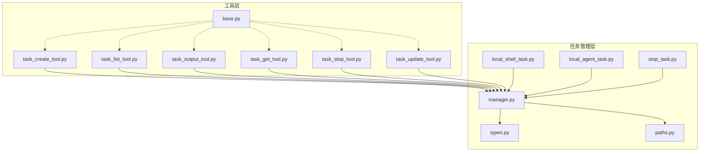
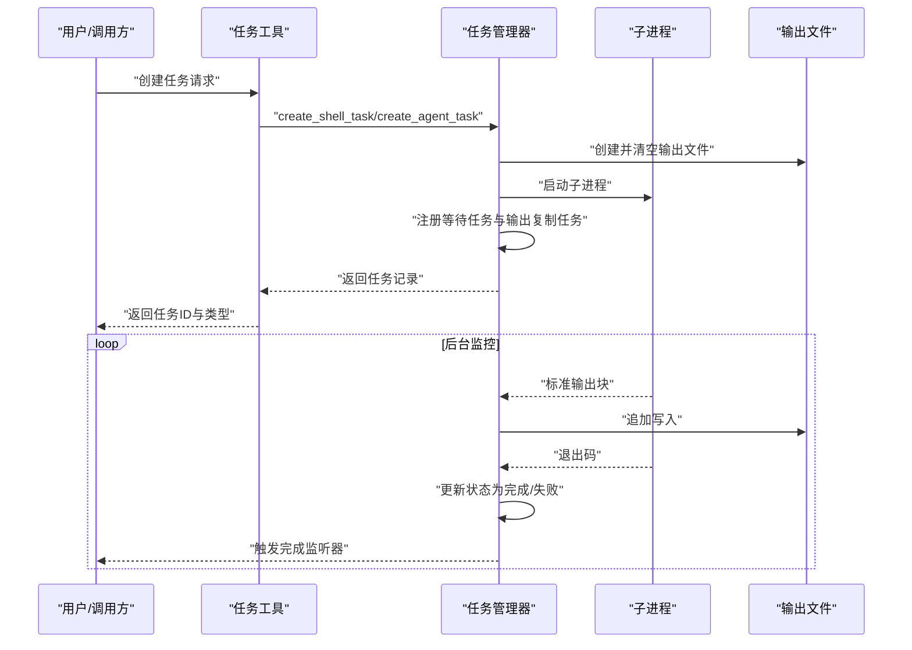
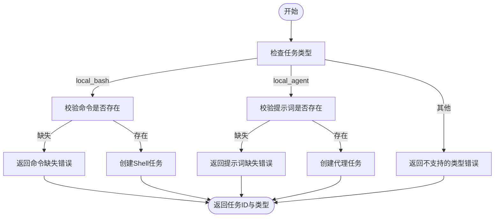
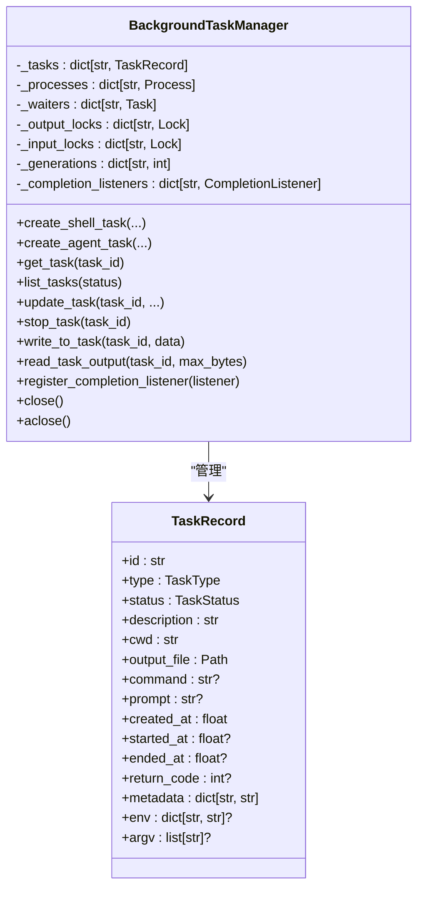
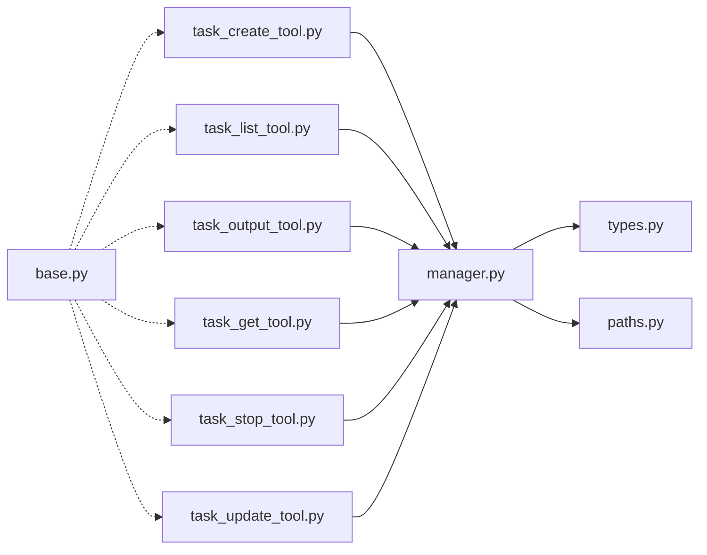

# 任务管理工具

<cite>
**本文引用的文件**
- [task_create_tool.py](file://src/openharness/tools/task_create_tool.py)
- [task_list_tool.py](file://src/openharness/tools/task_list_tool.py)
- [task_output_tool.py](file://src/openharness/tools/task_output_tool.py)
- [task_get_tool.py](file://src/openharness/tools/task_get_tool.py)
- [task_stop_tool.py](file://src/openharness/tools/task_stop_tool.py)
- [task_update_tool.py](file://src/openharness/tools/task_update_tool.py)
- [manager.py](file://src/openharness/tasks/manager.py)
- [types.py](file://src/openharness/tasks/types.py)
- [local_shell_task.py](file://src/openharness/tasks/local_shell_task.py)
- [local_agent_task.py](file://src/openharness/tasks/local_agent_task.py)
- [stop_task.py](file://src/openharness/tasks/stop_task.py)
- [base.py](file://src/openharness/tools/base.py)
- [paths.py](file://src/openharness/config/paths.py)
- [test_task_tools.py](file://tests/test_tools/test_task_tools.py)
</cite>

## 目录
1. [简介](#简介)
2. [项目结构](#项目结构)
3. [核心组件](#核心组件)
4. [架构总览](#架构总览)
5. [详细组件分析](#详细组件分析)
6. [依赖关系分析](#依赖关系分析)
7. [性能考量](#性能考量)
8. [故障排查指南](#故障排查指南)
9. [结论](#结论)
10. [附录](#附录)

## 简介
本文件为任务管理工具的综合技术文档，围绕五类任务工具展开：任务创建、任务列表、任务输出查看、任务详情获取、任务停止与任务更新。文档将系统阐述任务状态管理、生命周期控制、并发处理机制，并结合后台任务执行、进度跟踪与结果收集的实际示例，说明任务优先级、超时处理与错误恢复策略的设计与实现。

## 项目结构
任务管理功能由“工具层”和“任务管理层”共同构成：
- 工具层：提供面向用户的任务操作接口（task_create_tool、task_list_tool、task_output_tool、task_get_tool、task_stop_tool、task_update_tool），统一通过工具基类与执行上下文进行调用。
- 任务管理层：负责后台子进程的创建、监控、输出写入、状态变更与完成通知，同时维护任务记录与元数据。

图表来源
- [task_create_tool.py:1-57](file://src/openharness/tools/task_create_tool.py#L1-L57)
- [task_list_tool.py:1-36](file://src/openharness/tools/task_list_tool.py#L1-L36)
- [task_output_tool.py:1-36](file://src/openharness/tools/task_output_tool.py#L1-L36)
- [task_get_tool.py:1-34](file://src/openharness/tools/task_get_tool.py#L1-L34)
- [task_stop_tool.py:1-31](file://src/openharness/tools/task_stop_tool.py#L1-L31)
- [task_update_tool.py:1-51](file://src/openharness/tools/task_update_tool.py#L1-L51)
- [manager.py:1-474](file://src/openharness/tasks/manager.py#L1-L474)
- [types.py:1-33](file://src/openharness/tasks/types.py#L1-L33)
- [local_shell_task.py:1-18](file://src/openharness/tasks/local_shell_task.py#L1-L18)
- [local_agent_task.py:1-29](file://src/openharness/tasks/local_agent_task.py#L1-L29)
- [stop_task.py:1-12](file://src/openharness/tasks/stop_task.py#L1-L12)
- [base.py:1-81](file://src/openharness/tools/base.py#L1-L81)
- [paths.py:1-161](file://src/openharness/config/paths.py#L1-L161)

章节来源
- [task_create_tool.py:1-57](file://src/openharness/tools/task_create_tool.py#L1-L57)
- [task_list_tool.py:1-36](file://src/openharness/tools/task_list_tool.py#L1-L36)
- [task_output_tool.py:1-36](file://src/openharness/tools/task_output_tool.py#L1-L36)
- [task_get_tool.py:1-34](file://src/openharness/tools/task_get_tool.py#L1-L34)
- [task_stop_tool.py:1-31](file://src/openharness/tools/task_stop_tool.py#L1-L31)
- [task_update_tool.py:1-51](file://src/openharness/tools/task_update_tool.py#L1-L51)
- [manager.py:1-474](file://src/openharness/tasks/manager.py#L1-L474)
- [types.py:1-33](file://src/openharness/tasks/types.py#L1-L33)
- [local_shell_task.py:1-18](file://src/openharness/tasks/local_shell_task.py#L1-L18)
- [local_agent_task.py:1-29](file://src/openharness/tasks/local_agent_task.py#L1-L29)
- [stop_task.py:1-12](file://src/openharness/tasks/stop_task.py#L1-L12)
- [base.py:1-81](file://src/openharness/tools/base.py#L1-L81)
- [paths.py:1-161](file://src/openharness/config/paths.py#L1-L161)

## 核心组件
- 任务类型与状态
  - 类型：本地 Shell 任务、本地代理任务、远程代理任务、进程内队友任务。
  - 状态：待定、运行中、已完成、失败、已终止。
- 任务记录：包含标识、类型、状态、描述、工作目录、输出文件路径、命令或参数、时间戳、返回码、元数据、环境变量与 argv 列表等。
- 工具基类：统一的工具名称、描述、输入模型、只读判定与执行接口；工具注册表提供按名检索与 API 模式导出。
- 路径配置：任务输出目录位于数据目录下的 tasks 子目录，支持环境变量覆盖。

章节来源
- [types.py:10-33](file://src/openharness/tasks/types.py#L10-L33)
- [base.py:17-81](file://src/openharness/tools/base.py#L17-L81)
- [paths.py:78-82](file://src/openharness/config/paths.py#L78-L82)

## 架构总览
任务管理采用“单例任务管理器 + 子进程异步监控”的架构设计。工具层通过统一的执行上下文调用管理器方法，管理器负责：
- 创建任务：生成任务记录、初始化输出文件、启动子进程、注册等待任务与输出复制任务。
- 进程监控：异步读取标准输出并写入文件，等待进程退出后更新状态并触发完成监听器。
- 输入写入：对可写入的任务（如代理任务）提供线程安全的输入写入能力，必要时自动重启。
- 输出读取：按最大字节限制返回输出尾部内容。
- 停止任务：优雅终止，超时则强制杀死，清理 stdin 并标记状态。
- 元数据更新：支持描述、进度百分比与状态备注的更新。

图表来源
- [manager.py:61-112](file://src/openharness/tasks/manager.py#L61-L112)
- [manager.py:248-282](file://src/openharness/tasks/manager.py#L248-L282)
- [manager.py:289-332](file://src/openharness/tasks/manager.py#L289-L332)

章节来源
- [manager.py:49-474](file://src/openharness/tasks/manager.py#L49-L474)

## 详细组件分析

### 任务创建工具（task_create）
- 功能：创建本地 Shell 或本地代理两类后台任务。
- 参数校验：local_bash 需提供命令；local_agent 需提供提示词；若缺少必要参数则返回错误。
- 执行流程：
  - 获取任务管理器实例。
  - 对 local_bash：校验命令后创建 Shell 任务。
  - 对 local_agent：校验提示词并尝试创建代理任务（可选模型与 API 密钥）。
  - 返回创建成功的任务 ID 与类型。
- 错误处理：参数缺失或类型不支持时返回错误结果。

图表来源
- [task_create_tool.py:30-56](file://src/openharness/tools/task_create_tool.py#L30-L56)
- [manager.py:61-112](file://src/openharness/tasks/manager.py#L61-L112)
- [manager.py:114-158](file://src/openharness/tasks/manager.py#L114-L158)

章节来源
- [task_create_tool.py:1-57](file://src/openharness/tools/task_create_tool.py#L1-L57)
- [manager.py:61-158](file://src/openharness/tasks/manager.py#L61-L158)

### 任务列表工具（task_list）
- 功能：列出所有任务，支持按状态过滤。
- 执行流程：获取任务管理器，查询任务列表并格式化输出；若无任务返回提示信息。

章节来源
- [task_list_tool.py:1-36](file://src/openharness/tools/task_list_tool.py#L1-L36)
- [manager.py:164-169](file://src/openharness/tasks/manager.py#L164-L169)

### 任务输出查看工具（task_output）
- 功能：读取指定任务的输出日志尾部内容，支持最大字节数限制。
- 执行流程：获取任务管理器，读取任务输出文件尾部内容；若任务不存在返回错误。

章节来源
- [task_output_tool.py:1-36](file://src/openharness/tools/task_output_tool.py#L1-L36)
- [manager.py:230-236](file://src/openharness/tasks/manager.py#L230-L236)

### 任务详情获取工具（task_get）
- 功能：返回指定任务的完整状态信息。
- 执行流程：获取任务管理器，查询任务记录；若不存在返回错误。

章节来源
- [task_get_tool.py:1-34](file://src/openharness/tools/task_get_tool.py#L1-L34)
- [manager.py:160-162](file://src/openharness/tasks/manager.py#L160-L162)

### 任务停止工具（task_stop）
- 功能：终止运行中的任务。
- 执行流程：获取任务管理器，调用停止逻辑；若任务未运行或不存在返回错误；终止后更新状态并清理 stdin。

章节来源
- [task_stop_tool.py:1-31](file://src/openharness/tools/task_stop_tool.py#L1-L31)
- [manager.py:193-212](file://src/openharness/tasks/manager.py#L193-L212)

### 任务更新工具（task_update）
- 功能：更新任务描述、进度百分比与状态备注。
- 执行流程：获取任务管理器，更新任务元数据；返回更新后的摘要信息。

章节来源
- [task_update_tool.py:1-51](file://src/openharness/tools/task_update_tool.py#L1-L51)
- [manager.py:171-191](file://src/openharness/tasks/manager.py#L171-L191)

### 任务管理器（BackgroundTaskManager）
- 单例管理器：基于任务输出目录键值缓存，确保同一数据目录下的任务状态一致。
- 并发与锁：为每个任务维护独立的输出写入锁与输入写入锁，避免竞态。
- 生命周期：
  - 创建：生成任务记录、初始化输出文件、启动子进程、注册等待任务与输出复制任务。
  - 监控：异步读取标准输出并写入文件，等待进程退出，更新状态并触发完成监听器。
  - 输入：对可写入任务写入数据，必要时自动重启代理任务。
  - 停止：终止进程，超时则强制杀死，清理 stdin 并标记状态。
  - 关闭：取消等待任务并清理进程，支持同步与异步关闭。
- 完成监听：注册回调，在任务进入终止状态时触发。

图表来源
- [manager.py:49-474](file://src/openharness/tasks/manager.py#L49-L474)
- [types.py:14-33](file://src/openharness/tasks/types.py#L14-L33)

章节来源
- [manager.py:49-474](file://src/openharness/tasks/manager.py#L49-L474)
- [types.py:10-33](file://src/openharness/tasks/types.py#L10-L33)

### 任务类型与辅助入口
- 本地 Shell 任务入口：封装了通过管理器创建 Shell 任务的便捷函数。
- 本地代理任务入口：封装了通过管理器创建代理任务的便捷函数。
- 停止任务辅助：封装了通过默认管理器停止任务的便捷函数。

章节来源
- [local_shell_task.py:1-18](file://src/openharness/tasks/local_shell_task.py#L1-L18)
- [local_agent_task.py:1-29](file://src/openharness/tasks/local_agent_task.py#L1-L29)
- [stop_task.py:1-12](file://src/openharness/tasks/stop_task.py#L1-L12)

## 依赖关系分析
- 工具到管理器：各任务工具均通过统一的管理器获取器访问后台任务管理器。
- 管理器到类型：管理器使用任务类型与状态枚举，以及任务记录数据结构。
- 管理器到路径：任务输出文件位于数据目录的 tasks 子目录。
- 工具基类：提供统一的工具模式、只读判定与 API 模式导出。

图表来源
- [task_create_tool.py:9-10](file://src/openharness/tools/task_create_tool.py#L9-L10)
- [task_list_tool.py:7-8](file://src/openharness/tools/task_list_tool.py#L7-L8)
- [task_output_tool.py:7-8](file://src/openharness/tools/task_output_tool.py#L7-L8)
- [task_get_tool.py:7-8](file://src/openharness/tools/task_get_tool.py#L7-L8)
- [task_stop_tool.py:7-8](file://src/openharness/tools/task_stop_tool.py#L7-L8)
- [task_update_tool.py:7-8](file://src/openharness/tools/task_update_tool.py#L7-L8)
- [manager.py:15-16](file://src/openharness/tasks/manager.py#L15-L16)
- [types.py:10-11](file://src/openharness/tasks/types.py#L10-L11)
- [paths.py:78-82](file://src/openharness/config/paths.py#L78-L82)
- [base.py:60-81](file://src/openharness/tools/base.py#L60-L81)

章节来源
- [task_create_tool.py:9-10](file://src/openharness/tools/task_create_tool.py#L9-L10)
- [task_list_tool.py:7-8](file://src/openharness/tools/task_list_tool.py#L7-L8)
- [task_output_tool.py:7-8](file://src/openharness/tools/task_output_tool.py#L7-L8)
- [task_get_tool.py:7-8](file://src/openharness/tools/task_get_tool.py#L7-L8)
- [task_stop_tool.py:7-8](file://src/openharness/tools/task_stop_tool.py#L7-L8)
- [task_update_tool.py:7-8](file://src/openharness/tools/task_update_tool.py#L7-L8)
- [manager.py:15-16](file://src/openharness/tasks/manager.py#L15-L16)
- [types.py:10-11](file://src/openharness/tasks/types.py#L10-L11)
- [paths.py:78-82](file://src/openharness/config/paths.py#L78-L82)
- [base.py:60-81](file://src/openharness/tools/base.py#L60-L81)

## 性能考量
- 异步 I/O：输出复制与进程等待采用异步方式，避免阻塞事件循环。
- 流式输出：标准输出分块读取并追加写入，降低内存占用。
- 锁粒度：按任务维度分配输入/输出锁，减少不必要的串行化。
- 资源回收：提供同步与异步关闭接口，确保子进程与等待任务得到妥善清理。
- 文件大小限制：输出读取支持最大字节数限制，防止一次性读取过大内容。

章节来源
- [manager.py:272-282](file://src/openharness/tasks/manager.py#L272-L282)
- [manager.py:374-418](file://src/openharness/tasks/manager.py#L374-L418)
- [task_output_tool.py:14-15](file://src/openharness/tools/task_output_tool.py#L14-L15)

## 故障排查指南
- 任务创建失败
  - local_bash 缺少命令或 local_agent 缺少提示词会导致错误返回。
  - 代理任务需提供 API 密钥或显式命令/argv。
- 任务不存在
  - 查询任务详情、输出或停止任务时，若任务不存在会返回错误。
- 任务未运行
  - 尝试停止非运行中的任务会报错；请先确认任务状态。
- 代理任务输入异常
  - 若任务不接受输入，写入会抛出错误；对于可写入任务，系统会在断开后自动重启并重试。
- 输出为空或截断
  - 输出读取可能因大小限制被截断；适当增大最大字节数或检查任务是否仍在运行。
- 完成监听未触发
  - 确认任务确实进入终止状态；检查监听器注册与异常处理。

章节来源
- [task_create_tool.py:32-54](file://src/openharness/tools/task_create_tool.py#L32-L54)
- [manager.py:135-143](file://src/openharness/tasks/manager.py#L135-L143)
- [manager.py:193-200](file://src/openharness/tasks/manager.py#L193-L200)
- [manager.py:214-228](file://src/openharness/tasks/manager.py#L214-L228)
- [task_output_tool.py:31-35](file://src/openharness/tools/task_output_tool.py#L31-L35)
- [manager.py:230-236](file://src/openharness/tasks/manager.py#L230-L236)
- [manager.py:364-372](file://src/openharness/tasks/manager.py#L364-L372)

## 结论
该任务管理工具体系以统一的工具接口与强大的后台任务管理器为核心，实现了对本地 Shell 与本地代理任务的全生命周期管理。通过异步 I/O、细粒度锁与完善的资源回收机制，系统在保证并发安全的同时具备良好的性能与可维护性。配合进度更新与完成监听，能够满足后台任务执行、进度跟踪与结果收集的典型场景需求。

## 附录

### 实际示例与最佳实践
- 后台任务执行与进度跟踪
  - 使用任务创建工具启动任务，随后通过任务列表与任务详情工具轮询状态。
  - 使用任务更新工具定期上报进度与状态备注，便于前端或协调器展示。
- 结果收集
  - 在任务完成后使用任务输出工具读取尾部输出；若任务仍在运行，可定时轮询以获取增量输出。
- 优先级与超时
  - 当前实现未内置任务优先级字段；可通过元数据扩展自定义优先级策略。
  - 停止任务时采用超时策略：先尝试优雅终止，超时后强制杀死，确保资源及时释放。
- 错误恢复
  - 对于可写入任务（如代理任务），在写入失败时自动重启并保留重启次数与状态备注，便于诊断。

章节来源
- [test_task_tools.py:31-57](file://tests/test_tools/test_task_tools.py#L31-L57)
- [test_task_tools.py:69-99](file://tests/test_tools/test_task_tools.py#L69-L99)
- [manager.py:204-207](file://src/openharness/tasks/manager.py#L204-L207)
- [manager.py:345-362](file://src/openharness/tasks/manager.py#L345-L362)
- [manager.py:171-191](file://src/openharness/tasks/manager.py#L171-L191)