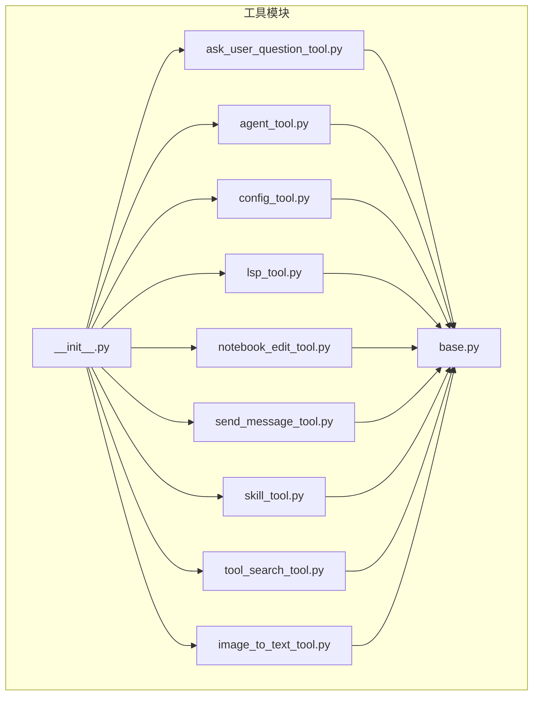
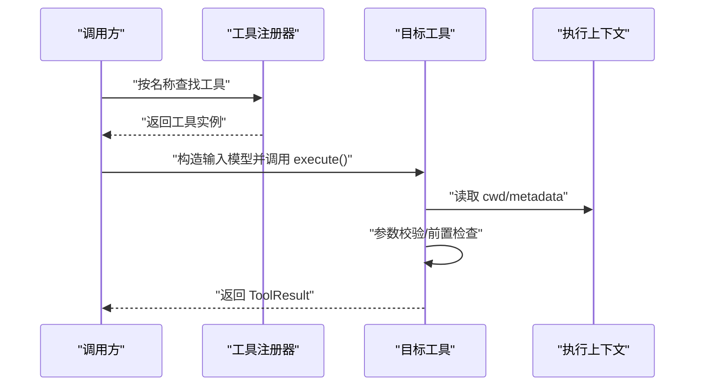
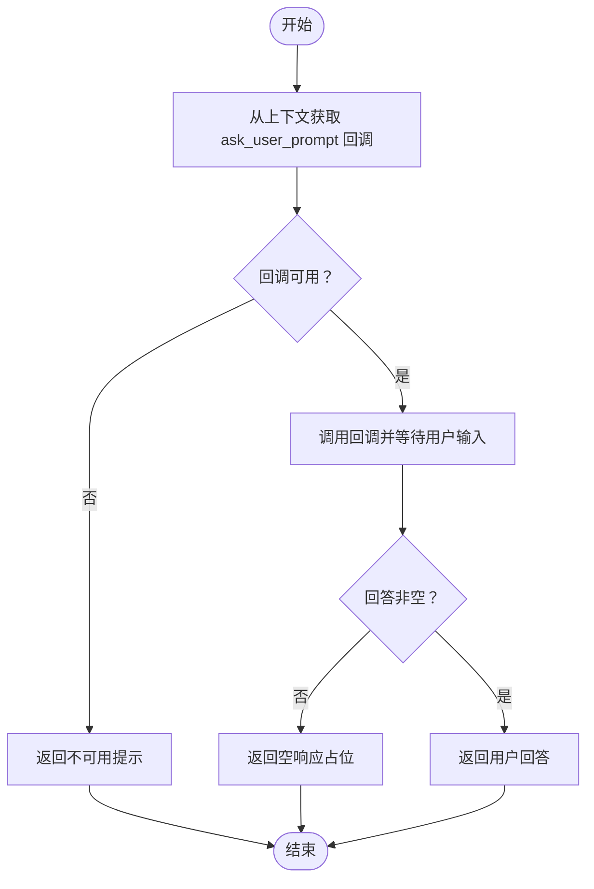
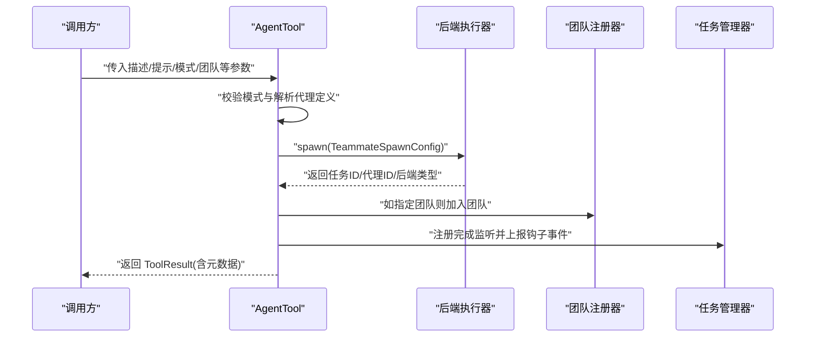
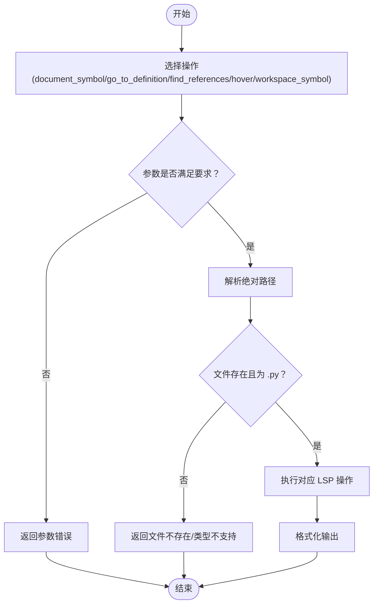
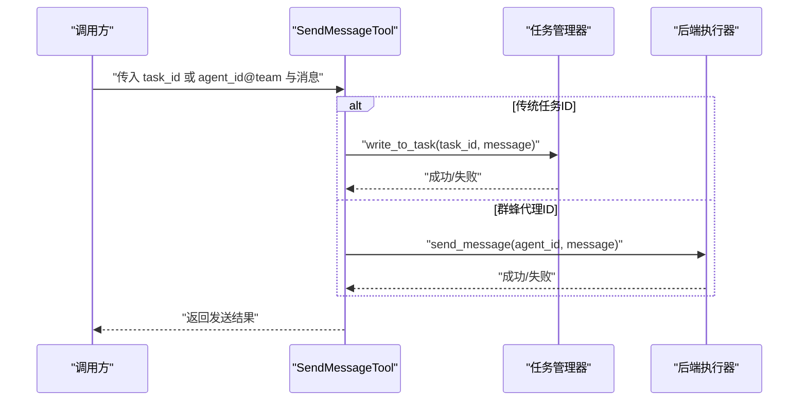
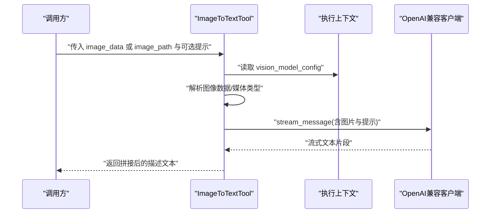
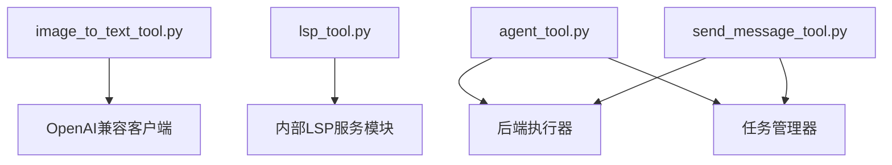

# 其他专用工具

<cite>
**本文引用的文件**
- [ask_user_question_tool.py](file://src/openharness/tools/ask_user_question_tool.py)
- [agent_tool.py](file://src/openharness/tools/agent_tool.py)
- [config_tool.py](file://src/openharness/tools/config_tool.py)
- [lsp_tool.py](file://src/openharness/tools/lsp_tool.py)
- [notebook_edit_tool.py](file://src/openharness/tools/notebook_edit_tool.py)
- [send_message_tool.py](file://src/openharness/tools/send_message_tool.py)
- [skill_tool.py](file://src/openharness/tools/skill_tool.py)
- [tool_search_tool.py](file://src/openharness/tools/tool_search_tool.py)
- [image_to_text_tool.py](file://src/openharness/tools/image_to_text_tool.py)
- [base.py](file://src/openharness/tools/base.py)
- [__init__.py](file://src/openharness/tools/__init__.py)
- [test_image_to_text_tool.py](file://tests/test_tools/test_image_to_text_tool.py)
</cite>

## 目录
1. [简介](#简介)
2. [项目结构](#项目结构)
3. [核心组件](#核心组件)
4. [架构总览](#架构总览)
5. [详细组件分析](#详细组件分析)
6. [依赖分析](#依赖分析)
7. [性能考虑](#性能考虑)
8. [故障排查指南](#故障排查指南)
9. [结论](#结论)
10. [附录](#附录)

## 简介
本章节面向“其他专用工具”的使用与集成，系统性介绍以下工具：ask_user_question_tool（用户交互）、agent_tool（代理通信）、config_tool（配置管理）、lsp_tool（代码智能服务）、notebook_edit_tool（Jupyter 笔记本编辑）、send_message_tool（消息发送）、skill_tool（技能调用）、tool_search_tool（工具搜索）以及 image_to_text_tool（图像识别）。我们将从功能定位、适用场景、调用流程、错误处理与最佳实践等维度展开说明，并提供可操作的集成建议。

## 项目结构
这些工具均位于工具子模块中，统一通过工具基类与注册机制对外暴露能力；默认注册器会集中注册内置工具，便于在运行时按名称检索与调用。

**图示来源**
- [__init__.py:47-96](file://src/openharness/tools/__init__.py#L47-L96)
- [base.py:35-81](file://src/openharness/tools/base.py#L35-L81)

**章节来源**
- [__init__.py:1-106](file://src/openharness/tools/__init__.py#L1-L106)
- [base.py:1-81](file://src/openharness/tools/base.py#L1-L81)

## 核心组件
- 工具基类与执行上下文
  - 工具统一继承自抽象基类，具备标准化的输入模型、执行接口与只读标记。
  - 执行上下文包含工作目录、元数据与钩子执行器，用于跨工具共享环境信息。
- 工具注册器
  - 默认注册器集中注册常用工具，支持按名称检索与导出 API 规范。

关键要点
- 工具的 is_read_only 可覆盖以声明只读语义，便于上层策略控制。
- ToolResult 统一输出格式，包含结果文本、错误标记与元数据字典。

**章节来源**
- [base.py:17-50](file://src/openharness/tools/base.py#L17-L50)
- [base.py:51-81](file://src/openharness/tools/base.py#L51-L81)

## 架构总览
下图展示工具调用链路：外部请求经由工具注册器解析到具体工具实现，工具在执行前进行参数校验与前置检查，随后根据自身职责完成读取或写入操作，并返回标准化结果。

**图示来源**
- [base.py:60-81](file://src/openharness/tools/base.py#L60-L81)
- [base.py:35-50](file://src/openharness/tools/base.py#L35-L50)

## 详细组件分析

### 用户交互工具：ask_user_question_tool
- 功能概述
  - 通过回调式提示函数向交互用户提出后续问题，并返回用户的回答。
  - 若会话未提供可调用的提示回调，则返回不可用提示。
- 关键行为
  - 读模式：仅读取用户输入，不产生副作用。
  - 输入模型包含问题文本字段。
- 适用场景
  - 需要分步澄清需求、收集上下文或确认下一步动作的对话式流程。
- 使用注意
  - 必须在会话元数据中注入可调用的 ask_user_prompt 回调。
  - 对空回答有明确的占位处理。

**图示来源**
- [ask_user_question_tool.py:32-46](file://src/openharness/tools/ask_user_question_tool.py#L32-L46)

**章节来源**
- [ask_user_question_tool.py:1-47](file://src/openharness/tools/ask_user_question_tool.py#L1-L47)

### 代理通信工具：agent_tool
- 功能概述
  - 在本地或进程内启动子代理任务，支持指定团队、模型、命令与模式（本地/远程/进程内）。
  - 将子代理注册到后台任务管理器，以便被任务工具轮询与控制。
- 关键行为
  - 模式校验：仅允许三种模式之一。
  - 定义解析：若提供子代理类型，将按定义填充系统提示与权限。
  - 团队绑定：可选地将代理加入指定团队。
  - 钩子事件：监听任务完成状态并通过钩子执行器上报。
- 适用场景
  - 多代理协作、任务委派、团队化编排与生命周期管理。
- 使用注意
  - 进程内任务无法被任务工具查询，推荐使用子进程后端。
  - 团队不存在时自动创建并添加代理。

**图示来源**
- [agent_tool.py:45-141](file://src/openharness/tools/agent_tool.py#L45-L141)

**章节来源**
- [agent_tool.py:1-142](file://src/openharness/tools/agent_tool.py#L1-L142)

### 配置管理工具：config_tool
- 功能概述
  - 读取或更新 OpenHarness 设置项，支持显示当前配置与设置键值。
- 关键行为
  - 显示：输出当前设置的 JSON 表示。
  - 设置：校验键是否存在，赋值并持久化保存。
- 适用场景
  - 运行期动态调整行为开关、路径与凭据等。
- 使用注意
  - 仅支持已知键名，未知键会返回错误。

**章节来源**
- [config_tool.py:1-38](file://src/openharness/tools/config_tool.py#L1-L38)

### 代码智能服务工具：lsp_tool
- 功能概述
  - 提供 Python 源码符号、定义跳转、引用查找与悬停信息等轻量级 LSP 能力。
- 关键行为
  - 读模式：仅读取，不修改文件。
  - 文件过滤：当前版本仅支持 .py 文件。
  - 参数校验：不同操作需要不同的参数组合（如文件路径、符号名、行列号等）。
- 适用场景
  - 快速定位符号、查看签名与文档字符串、发现引用位置。
- 使用注意
  - workspace_symbol 查询必须提供子串查询词。
  - 文档符号与定义/引用/悬停需提供文件路径与符号或行列位置。

**图示来源**
- [lsp_tool.py:65-118](file://src/openharness/tools/lsp_tool.py#L65-L118)

**章节来源**
- [lsp_tool.py:1-155](file://src/openharness/tools/lsp_tool.py#L1-L155)

### Jupyter 笔记本编辑工具：notebook_edit_tool
- 功能概述
  - 在不依赖完整 nbformat 的前提下，创建或编辑 .ipynb 单元格内容。
- 关键行为
  - 路径解析：支持相对路径与绝对路径，自动补齐用户目录。
  - 单元格类型：支持 code 与 markdown，默认 code。
  - 编辑模式：替换或追加源码。
  - 自动创建：当目标文件不存在且允许时创建空笔记本。
- 适用场景
  - 快速生成演示脚本、记录实验步骤或自动化生成分析报告。
- 使用注意
  - 会自动确保必要的单元格结构（如 outputs、execution_count）。

**章节来源**
- [notebook_edit_tool.py:1-98](file://src/openharness/tools/notebook_edit_tool.py#L1-L98)

### 消息发送工具：send_message_tool
- 功能概述
  - 向正在运行的任务或群蜂代理发送后续消息，支持传统任务 ID 与新式 agent_id@team 格式。
- 关键行为
  - 任务 ID：直接写入任务标准输入。
  - 群蜂代理：通过后端执行器路由消息，内部维护 agent_id 到 task_id 的映射。
- 适用场景
  - 与子代理持续对话、推送上下文或触发二次处理。
- 使用注意
  - 对于群蜂代理，需确保其由 AgentTool 启动以建立映射关系。

**图示来源**
- [send_message_tool.py:31-58](file://src/openharness/tools/send_message_tool.py#L31-L58)

**章节来源**
- [send_message_tool.py:1-59](file://src/openharness/tools/send_message_tool.py#L1-L59)

### 技能调用工具：skill_tool
- 功能概述
  - 根据名称读取已加载的技能内容，支持内置、用户、项目与插件技能。
- 关键行为
  - 名称匹配：大小写不敏感的近似匹配。
  - 禁止模型直呼：若技能禁止模型直接调用，返回提示需由用户以命令形式触发。
- 适用场景
  - 在对话中动态注入技能内容，作为知识库或模板使用。
- 使用注意
  - 需要在上下文元数据中提供额外技能目录与插件根目录（可选）。

**章节来源**
- [skill_tool.py:1-44](file://src/openharness/tools/skill_tool.py#L1-L44)

### 工具搜索工具：tool_search_tool
- 功能概述
  - 在工具注册表中按名称或描述进行子串匹配，返回候选列表。
- 关键行为
  - 读模式：仅检索，不修改任何内容。
  - 匹配：大小写不敏感。
- 适用场景
  - 帮助用户在众多工具中快速定位所需能力。
- 使用注意
  - 需要上下文提供工具注册表实例。

**章节来源**
- [tool_search_tool.py:1-39](file://src/openharness/tools/tool_search_tool.py#L1-L39)

### 图像识别工具：image_to_text_tool
- 功能概述
  - 当当前模型不支持图像输入时，借助外部分配套视觉模型对图像进行文本描述。
- 关键行为
  - 输入解析：支持 base64 数据或本地文件路径，自动推断媒体类型。
  - 配置校验：从上下文元数据读取视觉模型配置（模型名、API 密钥、基础地址），缺失时给出明确提示。
  - 视觉模型调用：通过兼容 OpenAI 的客户端流式获取描述文本。
  - 只读特性：该工具仅读取与转发，不产生副作用。
- 适用场景
  - 屏幕截图、图表、UI 截图、手写笔记等非文本内容的文本化理解。
- 使用注意
  - 必须正确配置视觉模型参数，否则会返回错误。
  - 测试用例验证了多模态模型识别、输入校验与注册器集成。

**图示来源**
- [image_to_text_tool.py:73-130](file://src/openharness/tools/image_to_text_tool.py#L73-L130)
- [image_to_text_tool.py:182-237](file://src/openharness/tools/image_to_text_tool.py#L182-L237)

**章节来源**
- [image_to_text_tool.py:1-238](file://src/openharness/tools/image_to_text_tool.py#L1-L238)
- [test_image_to_text_tool.py:129-279](file://tests/test_tools/test_image_to_text_tool.py#L129-L279)

## 依赖分析
- 工具间耦合
  - 除 image_to_text_tool 依赖外部视觉模型客户端外，其余工具均为纯本地逻辑，耦合度低。
  - agent_tool 与 send_message_tool 在群蜂代理场景下通过后端执行器与任务管理器协同。
- 外部依赖
  - image_to_text_tool 依赖 OpenAI 兼容客户端与外部视觉模型服务。
  - lsp_tool 依赖内部 LSP 服务模块（符号、定义、引用、悬停等）。
- 注册与发现
  - 默认注册器集中注册所有内置工具，便于统一导出与检索。

**图示来源**
- [image_to_text_tool.py:183-237](file://src/openharness/tools/image_to_text_tool.py#L183-L237)
- [lsp_tool.py:10-16](file://src/openharness/tools/lsp_tool.py#L10-L16)
- [agent_tool.py:65-82](file://src/openharness/tools/agent_tool.py#L65-L82)
- [send_message_tool.py:42-58](file://src/openharness/tools/send_message_tool.py#L42-L58)

**章节来源**
- [__init__.py:47-96](file://src/openharness/tools/__init__.py#L47-L96)

## 性能考虑
- 只读工具优先
  - ask_user_question_tool、lsp_tool、skill_tool、tool_search_tool、image_to_text_tool 均为只读，适合高频调用与缓存策略。
- I/O 与网络
  - image_to_text_tool 存在外部网络调用，建议：
    - 合理设置最大令牌数上限；
    - 对重复输入进行去重与缓存；
    - 在高并发场景下限制并发请求数。
- 文件操作
  - notebook_edit_tool 写入文件，建议：
    - 在事务性环境中进行（必要时先备份）；
    - 控制写入频率，避免频繁落盘。
- 代理与消息
  - agent_tool 与 send_message_tool 的开销主要来自进程/线程管理与后端路由，建议：
    - 合理复用已存在的代理；
    - 对消息队列化处理，避免阻塞主流程。

## 故障排查指南
- ask_user_question_tool
  - 现象：返回“此会话不可用”。
  - 排查：确认上下文是否注入了可调用的 ask_user_prompt。
- agent_tool
  - 现象：模式非法或启动失败。
  - 排查：检查模式参数是否为 local_agent/remote_agent/in_process_teammate 之一；查看后端执行器日志。
- config_tool
  - 现象：设置未知键失败。
  - 排查：确认键名是否存在于设置模型中。
- lsp_tool
  - 现象：文件不存在或类型不支持。
  - 排查：确认文件扩展名为 .py；检查路径解析是否正确。
- notebook_edit_tool
  - 现象：目标路径不存在且不允许创建。
  - 排查：开启 create_if_missing 或手动创建文件。
- send_message_tool
  - 现象：消息发送失败。
  - 排查：确认任务 ID 或 agent_id@team 是否有效；检查后端执行器映射。
- skill_tool
  - 现象：技能未找到或禁止模型直呼。
  - 排查：确认技能名称大小写不敏感匹配是否命中；检查技能禁用标志。
- tool_search_tool
  - 现象：返回“工具注册表上下文不可用”。
  - 排查：确认上下文元数据中提供了工具注册表实例。
- image_to_text_tool
  - 现象：返回“视觉模型未配置/调用失败”。
  - 排查：检查 vision_model_config 的完整性；核对环境变量与设置文件；确认网络连通性与凭据有效。

**章节来源**
- [ask_user_question_tool.py:37-46](file://src/openharness/tools/ask_user_question_tool.py#L37-L46)
- [agent_tool.py:46-50](file://src/openharness/tools/agent_tool.py#L46-L50)
- [agent_tool.py:81-88](file://src/openharness/tools/agent_tool.py#L81-L88)
- [config_tool.py:32-36](file://src/openharness/tools/config_tool.py#L32-L36)
- [lsp_tool.py:73-76](file://src/openharness/tools/lsp_tool.py#L73-L76)
- [notebook_edit_tool.py:39-40](file://src/openharness/tools/notebook_edit_tool.py#L39-L40)
- [send_message_tool.py:38-40](file://src/openharness/tools/send_message_tool.py#L38-L40)
- [skill_tool.py:35-43](file://src/openharness/tools/skill_tool.py#L35-L43)
- [tool_search_tool.py:29-30](file://src/openharness/tools/tool_search_tool.py#L29-L30)
- [image_to_text_tool.py:93-106](file://src/openharness/tools/image_to_text_tool.py#L93-L106)
- [image_to_text_tool.py:119-124](file://src/openharness/tools/image_to_text_tool.py#L119-L124)

## 结论
上述专用工具覆盖了用户交互、代理编排、配置管理、代码智能、笔记本编辑、消息通信、技能检索、工具发现与图像理解等多样化场景。它们通过统一的工具基类与注册机制实现解耦与可扩展，既可独立使用，也可在更高层的编排系统中协同工作。建议在生产环境中结合只读策略、缓存与限流等手段优化性能，并完善配置与错误处理以提升稳定性。

## 附录
- 工具选择指南
  - 需要用户确认：优先 ask_user_question_tool。
  - 需要多代理协作：优先 agent_tool + send_message_tool。
  - 需要动态配置：优先 config_tool。
  - 需要代码导航：优先 lsp_tool。
  - 需要生成/编辑 Jupyter 笔记本：优先 notebook_edit_tool。
  - 需要注入技能内容：优先 skill_tool。
  - 需要查找可用工具：优先 tool_search_tool。
  - 需要图像理解：优先 image_to_text_tool。
- 最佳实践
  - 在上下文元数据中提供必要的回调与配置（如 ask_user_prompt、vision_model_config、extra_skill_dirs 等）。
  - 对只读工具采用缓存策略，减少重复计算与 I/O。
  - 对外部服务调用（如图像识别）增加超时与重试机制。
  - 对文件写入类工具（如笔记本编辑）做好幂等与回滚准备。
  - 在群蜂代理场景下，确保代理由 AgentTool 启动以建立消息路由映射。