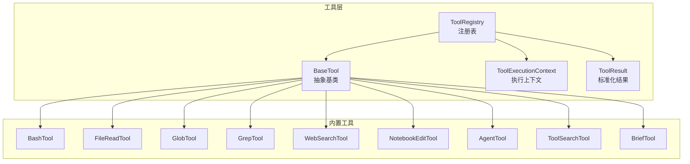
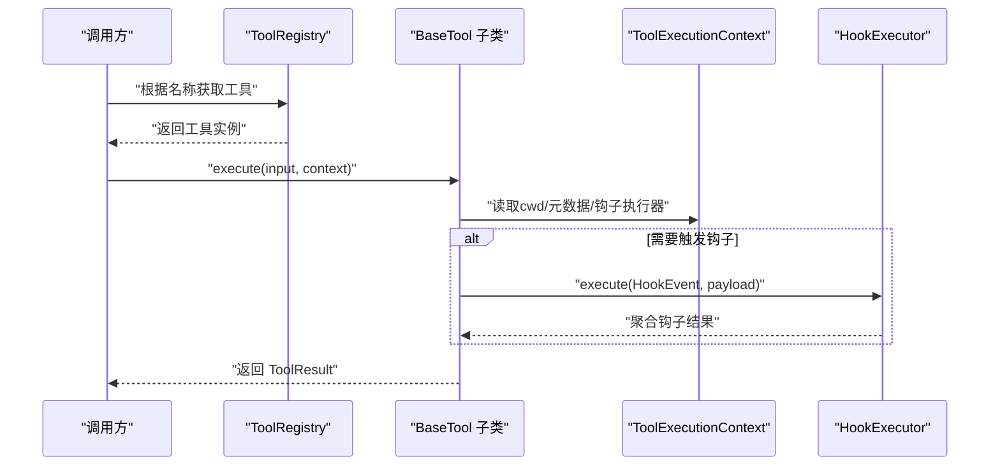
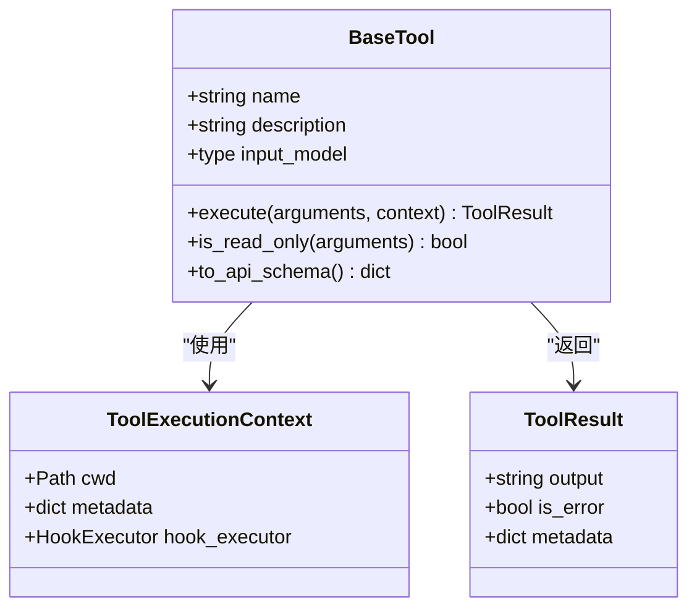
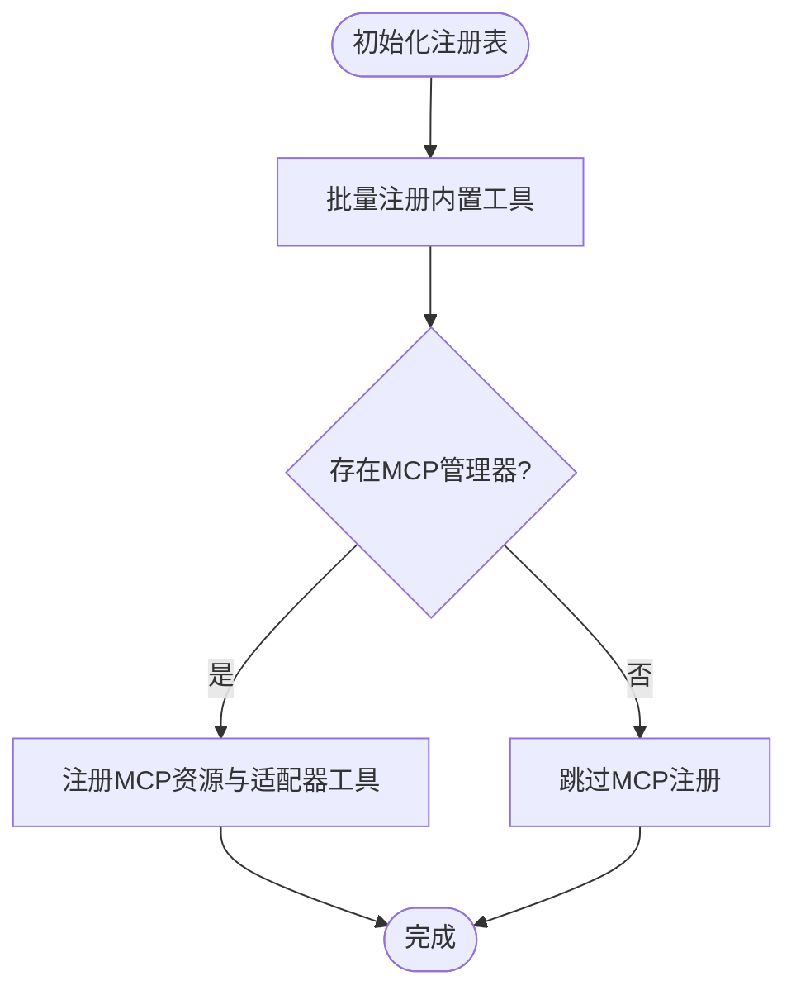
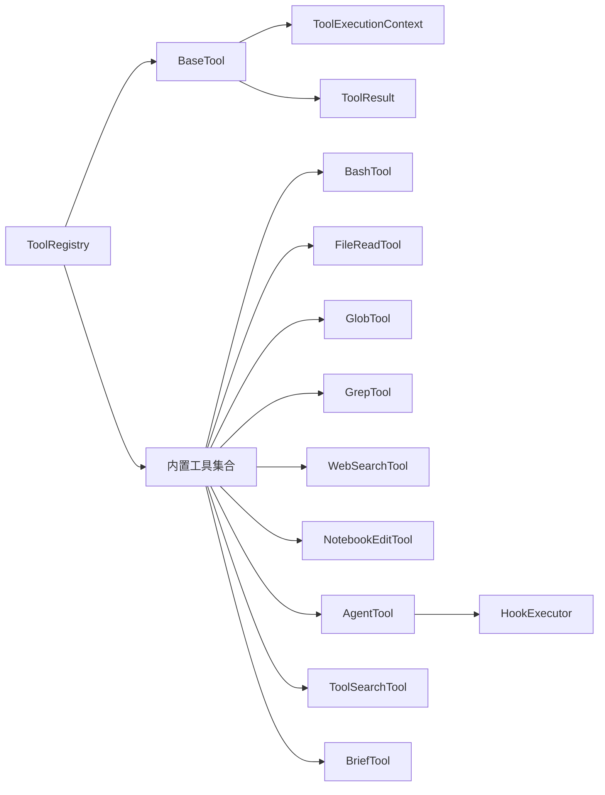

# 工具架构设计

<cite>
**本文引用的文件**
- [src/openharness/tools/base.py](file://src/openharness/tools/base.py)
- [src/openharness/tools/__init__.py](file://src/openharness/tools/__init__.py)
- [src/openharness/tools/brief_tool.py](file://src/openharness/tools/brief_tool.py)
- [src/openharness/tools/glob_tool.py](file://src/openharness/tools/glob_tool.py)
- [src/openharness/tools/grep_tool.py](file://src/openharness/tools/grep_tool.py)
- [src/openharness/tools/web_search_tool.py](file://src/openharness/tools/web_search_tool.py)
- [src/openharness/tools/file_read_tool.py](file://src/openharness/tools/file_read_tool.py)
- [src/openharness/tools/notebook_edit_tool.py](file://src/openharness/tools/notebook_edit_tool.py)
- [src/openharness/tools/agent_tool.py](file://src/openharness/tools/agent_tool.py)
- [src/openharness/tools/tool_search_tool.py](file://src/openharness/tools/tool_search_tool.py)
- [src/openharness/hooks/executor.py](file://src/openharness/hooks/executor.py)
- [tests/test_tools/test_core_tools.py](file://tests/test_tools/test_core_tools.py)
</cite>

## 目录
1. [引言](#引言)
2. [项目结构](#项目结构)
3. [核心组件](#核心组件)
4. [架构总览](#架构总览)
5. [详细组件分析](#详细组件分析)
6. [依赖分析](#依赖分析)
7. [性能考虑](#性能考虑)
8. [故障排查指南](#故障排查指南)
9. [结论](#结论)
10. [附录：最佳实践与示例路径](#附录最佳实践与示例路径)

## 引言
本文件系统性阐述 OpenHarness 的工具架构设计，重点围绕以下主题：
- BaseTool 抽象基类的设计理念：工具接口规范、输入模型定义、执行上下文。
- ToolResult 标准化结果格式与 ToolExecutionContext 共享执行上下文的作用。
- ToolRegistry 工具注册机制：注册、查找与 API 模式生成。
- 工具开发最佳实践：继承方式、输入验证、异步执行、错误处理。
- 提供可直接参考的代码示例路径，帮助快速创建自定义工具。

## 项目结构
OpenHarness 将“工具”作为可插拔能力单元，统一通过 BaseTool 抽象层对外暴露一致的接口，并由 ToolRegistry 进行集中管理。默认工具集合在 tools 包中按功能模块组织，每个工具均实现标准的 execute(arguments, context) 签名，并通过 to_api_schema() 输出符合外部 API（如 Messages API）期望的模式。

图表来源
- [src/openharness/tools/base.py:35-81](file://src/openharness/tools/base.py#L35-L81)
- [src/openharness/tools/__init__.py:47-96](file://src/openharness/tools/__init__.py#L47-L96)

章节来源
- [src/openharness/tools/base.py:1-81](file://src/openharness/tools/base.py#L1-L81)
- [src/openharness/tools/__init__.py:1-106](file://src/openharness/tools/__init__.py#L1-L106)

## 核心组件
- BaseTool：定义工具名称、描述、输入模型类型以及异步执行接口；提供只读判定与 API 模式导出。
- ToolExecutionContext：跨工具共享的执行上下文，包含工作目录、元数据字典、钩子执行器等。
- ToolResult：标准化输出，包含文本输出、是否错误标记与附加元数据。
- ToolRegistry：工具注册表，负责注册、查询、列出工具及生成 API 模式列表。

章节来源
- [src/openharness/tools/base.py:17-81](file://src/openharness/tools/base.py#L17-L81)

## 架构总览
下图展示了工具调用链路：上层通过 ToolRegistry 获取具体工具实例，传入标准化输入模型与 ToolExecutionContext，工具内部进行输入校验、资源访问与执行，最终返回 ToolResult。部分工具会利用上下文中的 HookExecutor 触发生命周期钩子事件。

图表来源
- [src/openharness/tools/base.py:35-81](file://src/openharness/tools/base.py#L35-L81)
- [src/openharness/hooks/executor.py:41-79](file://src/openharness/hooks/executor.py#L41-L79)

## 详细组件分析

### BaseTool 抽象基类与接口规范
- 接口规范
  - 必须实现异步 execute(arguments, context) 方法，返回 ToolResult。
  - 可选覆盖 is_read_only(arguments) 判定是否为只读操作。
  - 必须提供 name、description、input_model 三个属性。
- 输入模型
  - 使用 Pydantic BaseModel 定义，支持字段描述、别名、范围约束等，确保输入校验与 API 模式生成。
- API 模式
  - to_api_schema() 返回符合外部 API（如 Messages API）期望的模式，包含名称、描述与 input_schema（基于 Pydantic JSON Schema）。

图表来源
- [src/openharness/tools/base.py:17-58](file://src/openharness/tools/base.py#L17-L58)

章节来源
- [src/openharness/tools/base.py:35-58](file://src/openharness/tools/base.py#L35-L58)

### ToolExecutionContext 执行上下文
- 关键字段
  - cwd：当前工作目录，用于相对路径解析与沙箱定位。
  - metadata：任意键值对，承载工具间共享信息（如注册表、额外技能目录、插件根目录等）。
  - hook_executor：可选的钩子执行器，用于在工具执行过程中触发生命周期事件。
- 典型用途
  - 文件工具通过 cwd 解析相对路径。
  - 搜索工具通过 metadata 获取 ToolRegistry 实例。
  - Agent 工具通过 hook_executor 发出子代理生命周期事件。

章节来源
- [src/openharness/tools/base.py:17-24](file://src/openharness/tools/base.py#L17-L24)
- [src/openharness/tools/agent_tool.py:45-142](file://src/openharness/tools/agent_tool.py#L45-L142)
- [src/openharness/tools/tool_search_tool.py:27-39](file://src/openharness/tools/tool_search_tool.py#L27-L39)

### ToolResult 标准化结果格式
- 字段语义
  - output：工具产生的文本输出。
  - is_error：是否表示错误状态（例如超时、权限拒绝、命令失败）。
  - metadata：附加信息（如 returncode、timed_out、交互提示标志等）。
- 设计价值
  - 统一上层消费逻辑，简化错误处理与日志记录。
  - 便于 UI 层或下游工具对结果进行分类展示。

章节来源
- [src/openharness/tools/base.py:26-33](file://src/openharness/tools/base.py#L26-L33)
- [src/openharness/tools/bash_tool.py:66-85](file://src/openharness/tools/bash_tool.py#L66-L85)
- [src/openharness/tools/grep_tool.py:140-150](file://src/openharness/tools/grep_tool.py#L140-L150)

### ToolRegistry 工具注册机制
- 注册流程
  - create_default_tool_registry() 创建默认注册表，批量注册内置工具实例。
  - 支持动态注册 MCP 工具适配器与资源工具。
- 查找与模式
  - get(name)：按名称获取工具实例。
  - list_tools()：返回所有已注册工具。
  - to_api_schema()：生成所有工具的 API 模式列表，供外部模型选择工具时使用。

图表来源
- [src/openharness/tools/__init__.py:47-96](file://src/openharness/tools/__init__.py#L47-L96)

章节来源
- [src/openharness/tools/__init__.py:47-96](file://src/openharness/tools/__init__.py#L47-L96)
- [src/openharness/tools/base.py:60-81](file://src/openharness/tools/base.py#L60-L81)

### 典型工具实现与最佳实践

#### 文件读取工具（FileReadTool）
- 输入模型：包含路径、偏移行号、读取行数限制。
- 最佳实践要点
  - 路径解析：优先使用 cwd 进行相对路径解析，避免越界。
  - 沙箱安全：在容器沙箱中启用路径合法性校验。
  - 错误处理：文件不存在、目录、二进制文件等情况明确返回错误。
  - 输出格式：带行号编号的文本片段，空范围返回提示。

章节来源
- [src/openharness/tools/file_read_tool.py:12-73](file://src/openharness/tools/file_read_tool.py#L12-L73)

#### 搜索工具（GlobTool/GrepTool）
- GlobTool：支持别名字段与绝对/相对模式解析，优先使用 ripgrep（若可用），否则回退到 Python glob。
- GrepTool：正则搜索，支持大小写敏感、文件通配、超时控制与限流，优先使用 ripgrep 并具备超时标记。
- 最佳实践要点
  - 输入校验：使用 Pydantic Field 的 ge/le、alias 等约束保证参数合法。
  - 性能优化：在大仓库中优先使用 ripgrep，避免遍历隐藏与忽略目录导致的性能问题。
  - 超时与取消：合理设置超时时间，捕获 CancelledError 并清理进程。
  - 输出截断：长输出进行截断，避免 UI 或下游处理压力。

章节来源
- [src/openharness/tools/glob_tool.py:14-176](file://src/openharness/tools/glob_tool.py#L14-L176)
- [src/openharness/tools/grep_tool.py:15-364](file://src/openharness/tools/grep_tool.py#L15-L364)

#### 命令执行工具（BashTool）
- 功能：在本地沙箱中以非交互方式运行 shell 命令，捕获 stdout/stderr。
- 最佳实践要点
  - 预检交互式命令：识别 scaffolding 类命令并提示非交互参数。
  - 超时处理：超时后尝试读取剩余输出并强制终止进程。
  - 取消处理：正确响应 asyncio.CancelledError 并清理进程。
  - 输出格式化：对空输出、超长输出进行友好展示。

章节来源
- [src/openharness/tools/bash_tool.py:19-219](file://src/openharness/tools/bash_tool.py#L19-L219)

#### 网页搜索工具（WebSearchTool）
- 功能：调用公共搜索端点，解析标题、URL、摘要，限制最大结果数量。
- 最佳实践要点
  - 网络防护：通过网络守卫模块限制公网访问风险。
  - 错误处理：HTTP 错误与网络守卫异常统一转换为 ToolResult 错误。
  - 结果清洗：HTML 解析与 URL 归一化，避免重定向链接误导。

章节来源
- [src/openharness/tools/web_search_tool.py:16-119](file://src/openharness/tools/web_search_tool.py#L16-L119)

#### 笔记本编辑工具（NotebookEditTool）
- 功能：无需 nbformat 库即可创建或编辑 .ipynb 单元格，支持追加/替换模式。
- 最佳实践要点
  - 路径解析与创建：自动创建缺失目录与空笔记本结构。
  - 单元格规范化：兼容字符串与列表两种 source 表达形式。

章节来源
- [src/openharness/tools/notebook_edit_tool.py:14-98](file://src/openharness/tools/notebook_edit_tool.py#L14-L98)

#### 子代理工具（AgentTool）
- 功能：在子进程中启动本地/远程/同进程代理，支持团队编排与生命周期事件通知。
- 最佳实践要点
  - 后端选择：优先使用 subprocess 后端，确保任务可被任务工具轮询。
  - 团队注册：支持将子代理加入指定团队。
  - 钩子集成：通过 HookExecutor 发出子代理停止事件，携带任务状态与返回码等元数据。

章节来源
- [src/openharness/tools/agent_tool.py:20-142](file://src/openharness/tools/agent_tool.py#L20-L142)
- [src/openharness/hooks/executor.py:41-79](file://src/openharness/hooks/executor.py#L41-L79)

#### 工具检索工具（ToolSearchTool）
- 功能：在 ToolExecutionContext 中提供的 ToolRegistry 上按名称/描述检索工具。
- 最佳实践要点
  - 只读工具：is_read_only 返回 True，避免模型误调用。
  - 上下文依赖：需要 registry 对象存在于 metadata 中。

章节来源
- [src/openharness/tools/tool_search_tool.py:10-39](file://src/openharness/tools/tool_search_tool.py#L10-L39)

#### 简述工具（BriefTool）
- 功能：对文本进行截断简述，支持最大字符数限制。
- 最佳实践要点
  - 边界处理：原文小于阈值时直接返回，避免多余省略号。

章节来源
- [src/openharness/tools/brief_tool.py:10-34](file://src/openharness/tools/brief_tool.py#L10-L34)

## 依赖分析
- 组件耦合
  - BaseTool 与 ToolExecutionContext/ToolResult 强耦合，确保所有工具遵循统一契约。
  - ToolRegistry 与各工具实例弱耦合，仅通过名称索引关联。
  - 部分工具依赖外部 CLI（如 ripgrep、shell）与网络服务（如 DuckDuckGo HTML）。
- 外部依赖与集成点
  - 沙箱与路径校验：在文件/搜索工具中体现。
  - 钩子系统：AgentTool 与 HookExecutor 协作，形成事件驱动扩展点。

图表来源
- [src/openharness/tools/base.py:35-81](file://src/openharness/tools/base.py#L35-L81)
- [src/openharness/tools/__init__.py:47-96](file://src/openharness/tools/__init__.py#L47-L96)
- [src/openharness/hooks/executor.py:41-79](file://src/openharness/hooks/executor.py#L41-L79)

章节来源
- [src/openharness/tools/base.py:35-81](file://src/openharness/tools/base.py#L35-L81)
- [src/openharness/tools/__init__.py:47-96](file://src/openharness/tools/__init__.py#L47-L96)

## 性能考虑
- I/O 与 CPU 密集型工具
  - 优先使用 ripgrep 进行文件扫描与内容搜索，避免 Python 层递归遍历导致的性能瓶颈。
  - 对超长输出进行截断，减少内存与传输开销。
- 异步与超时
  - 命令执行与网络请求均设置合理超时，超时后主动终止进程或中断请求。
  - 在工具内部妥善处理 asyncio.CancelledError，确保资源释放。
- 路径与沙箱
  - 在容器沙箱中严格校验路径合法性，避免越界访问带来的安全与性能问题。

## 故障排查指南
- 常见错误形态
  - 命令超时：检查 BashTool 的超时配置与输出缓冲区读取策略。
  - 搜索超时：确认 ripgrep 是否可用，必要时回退到 Python 实现。
  - 文件读取失败：核对路径解析、沙箱权限与二进制文件检测。
  - 网络搜索失败：检查网络守卫规则与目标站点可达性。
- 调试建议
  - 使用 ToolResult.metadata 中的 returncode/timed_out 等字段辅助定位问题。
  - 在 AgentTool 中通过 HookExecutor 观察子代理生命周期事件，确认任务状态与返回码。

章节来源
- [src/openharness/tools/bash_tool.py:60-85](file://src/openharness/tools/bash_tool.py#L60-L85)
- [src/openharness/tools/grep_tool.py:140-150](file://src/openharness/tools/grep_tool.py#L140-L150)
- [src/openharness/tools/file_read_tool.py:36-55](file://src/openharness/tools/file_read_tool.py#L36-L55)
- [src/openharness/tools/web_search_tool.py:43-59](file://src/openharness/tools/web_search_tool.py#L43-L59)
- [src/openharness/tools/agent_tool.py:98-129](file://src/openharness/tools/agent_tool.py#L98-L129)

## 结论
OpenHarness 的工具架构以 BaseTool 为核心，通过标准化的输入模型、执行上下文与结果格式，实现了工具的高内聚、低耦合与可扩展性。ToolRegistry 提供了统一的注册与发现机制，并能生成外部 API 所需的工具模式。内置工具在性能与安全性方面做了充分权衡，为构建复杂自动化流程提供了坚实基础。

## 附录：最佳实践与示例路径
- 工具类继承与命名
  - 继承 BaseTool，设置 name/description/input_model，实现异步 execute。
  - 示例路径：[src/openharness/tools/brief_tool.py:17-34](file://src/openharness/tools/brief_tool.py#L17-L34)
- 输入验证与模式生成
  - 使用 Pydantic BaseModel 定义输入，配合 Field 的 ge/le/alias 等约束。
  - 示例路径：[src/openharness/tools/glob_tool.py:14-23](file://src/openharness/tools/glob_tool.py#L14-L23)
- 异步执行与超时处理
  - 对外部进程与网络请求设置超时，捕获 CancelledError 并清理资源。
  - 示例路径：[src/openharness/tools/bash_tool.py:60-85](file://src/openharness/tools/bash_tool.py#L60-L85)
- 错误处理与结果格式化
  - 将异常转换为 ToolResult，设置 is_error 与 metadata。
  - 示例路径：[src/openharness/tools/grep_tool.py:140-150](file://src/openharness/tools/grep_tool.py#L140-L150)
- 工具注册与 API 模式
  - 通过 create_default_tool_registry 注册内置工具，to_api_schema 生成外部可用模式。
  - 示例路径：[src/openharness/tools/__init__.py:47-96](file://src/openharness/tools/__init__.py#L47-L96)
- 使用 ToolExecutionContext 共享上下文
  - 在工具中读取 cwd、metadata，并可选使用 hook_executor 触发事件。
  - 示例路径：[src/openharness/tools/agent_tool.py:45-142](file://src/openharness/tools/agent_tool.py#L45-L142)
- 测试参考
  - 参考测试用例了解工具调用与结果断言方式。
  - 示例路径：[tests/test_tools/test_core_tools.py:33-327](file://tests/test_tools/test_core_tools.py#L33-L327)