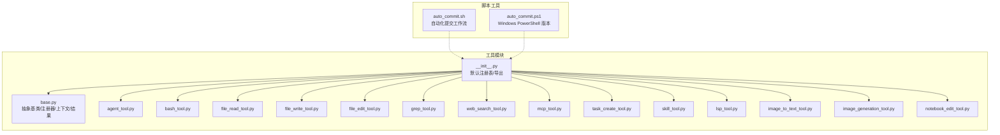
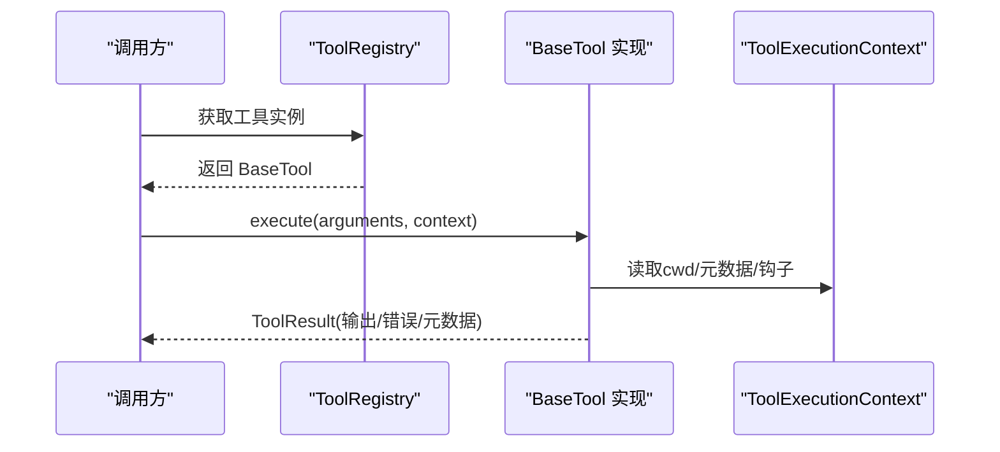
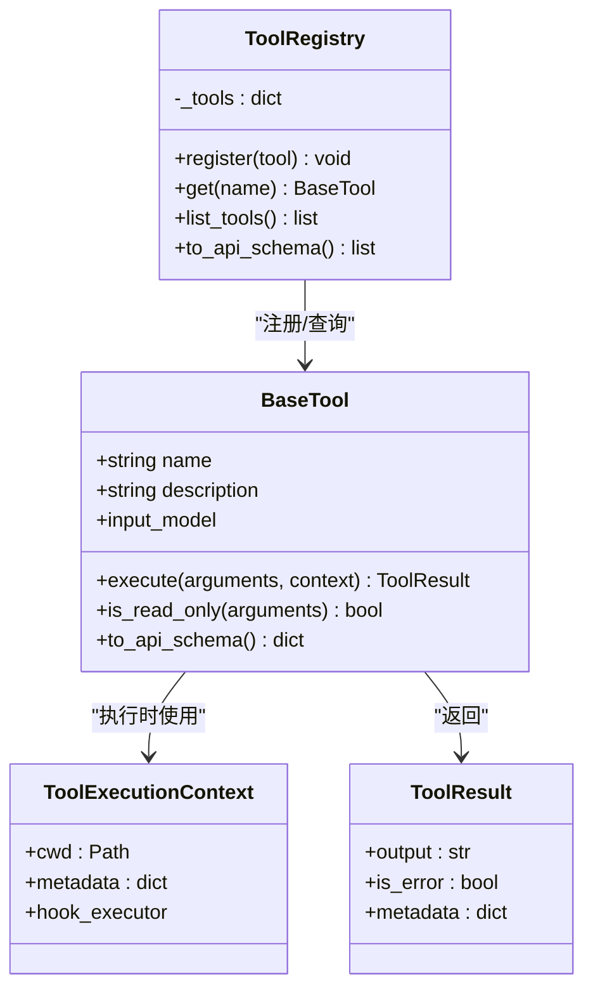

# 工具系统

<cite>
**本文引用的文件**
- [src/openharness/tools/base.py](file://src/openharness/tools/base.py)
- [src/openharness/tools/__init__.py](file://src/openharness/tools/__init__.py)
- [src/openharness/tools/agent_tool.py](file://src/openharness/tools/agent_tool.py)
- [src/openharness/tools/bash_tool.py](file://src/openharness/tools/bash_tool.py)
- [src/openharness/tools/file_read_tool.py](file://src/openharness/tools/file_read_tool.py)
- [src/openharness/tools/file_write_tool.py](file://src/openharness/tools/file_write_tool.py)
- [src/openharness/tools/file_edit_tool.py](file://src/openharness/tools/file_edit_tool.py)
- [src/openharness/tools/grep_tool.py](file://src/openharness/tools/grep_tool.py)
- [src/openharness/tools/web_search_tool.py](file://src/openharness/tools/web_search_tool.py)
- [src/openharness/tools/mcp_tool.py](file://src/openharness/tools/mcp_tool.py)
- [src/openharness/tools/task_create_tool.py](file://src/openharness/tools/task_create_tool.py)
- [src/openharness/tools/skill_tool.py](file://src/openharness/tools/skill_tool.py)
- [src/openharness/tools/lsp_tool.py](file://src/openharness/tools/lsp_tool.py)
- [src/openharness/tools/image_to_text_tool.py](file://src/openharness/tools/image_to_text_tool.py)
- [src/openharness/tools/image_generation_tool.py](file://src/openharness/tools/image_generation_tool.py)
- [src/openharness/tools/notebook_edit_tool.py](file://src/openharness/tools/notebook_edit_tool.py)
- [scripts/auto_commit.sh](file://scripts/auto_commit.sh)
- [scripts/auto_commit.ps1](file://scripts/auto_commit.ps1)
</cite>

## 目录
1. [简介](#简介)
2. [项目结构](#项目结构)
3. [核心组件](#核心组件)
4. [架构总览](#架构总览)
5. [详细组件分析](#详细组件分析)
6. [依赖关系分析](#依赖关系分析)
7. [性能考量](#性能考量)
8. [故障排查指南](#故障排查指南)
9. [结论](#结论)
10. [附录：自定义工具开发指南](#附录自定义工具开发指南)

## 简介
本文件系统性梳理 OpenHarness 的工具体系，覆盖抽象基类与注册机制、工具执行流程、43+ 内置工具的分类与用法、输入校验与权限检查、钩子支持与错误处理，并提供自定义工具开发指南。目标是帮助开发者快速理解工具架构、正确使用内置工具、安全扩展新工具。

## 项目结构
工具系统位于 openharness 代码树的 tools 子模块中，采用"按功能分文件"的组织方式，每个工具一个文件，统一通过工具注册入口集中注册。核心抽象与注册器位于基础模块，具体工具在各自文件中实现。新增的自动化提交工作流工具位于 scripts 目录，可配置图像生成工具位于 tools 子模块。

**图表来源**
- [src/openharness/tools/base.py:1-81](file://src/openharness/tools/base.py#L1-L81)
- [src/openharness/tools/__init__.py:1-108](file://src/openharness/tools/__init__.py#L1-L108)
- [scripts/auto_commit.sh:1-121](file://scripts/auto_commit.sh#L1-L121)
- [scripts/auto_commit.ps1:1-123](file://scripts/auto_commit.ps1#L1-L123)

**章节来源**
- [src/openharness/tools/base.py:1-81](file://src/openharness/tools/base.py#L1-L81)
- [src/openharness/tools/__init__.py:1-108](file://src/openharness/tools/__init__.py#L1-L108)

## 核心组件
- 抽象基类 BaseTool：定义工具名称、描述、输入模型类型以及异步执行接口；提供只读判定与 API 模式 Schema 导出能力。
- 执行上下文 ToolExecutionContext：包含工作目录、元数据字典、钩子执行器。
- 执行结果 ToolResult：标准化输出文本、错误标记、附加元数据。
- 工具注册器 ToolRegistry：维护名称到工具实例的映射，支持注册、查询、枚举与 API Schema 导出。

**章节来源**
- [src/openharness/tools/base.py:17-81](file://src/openharness/tools/base.py#L17-L81)

## 架构总览
工具系统遵循"统一抽象 + 可插拔实现 + 集中式注册"的模式。默认注册表会批量注册内置工具；当存在 MCP 管理器时，还会动态注册 MCP 资源与工具适配器。工具执行时接收标准化上下文，返回标准化结果，便于上层统一处理与展示。

**图表来源**
- [src/openharness/tools/base.py:35-58](file://src/openharness/tools/base.py#L35-L58)
- [src/openharness/tools/base.py:60-81](file://src/openharness/tools/base.py#L60-L81)

**章节来源**
- [src/openharness/tools/base.py:35-81](file://src/openharness/tools/base.py#L35-L81)
- [src/openharness/tools/__init__.py:47-96](file://src/openharness/tools/__init__.py#L47-L96)

## 详细组件分析

### 文件操作工具
- read_file（只读）
  - 功能：按行号读取本地仓库中的文本文件，支持偏移与限制。
  - 输入模型字段：路径、起始行偏移、行数限制。
  - 安全：沙箱环境下进行路径合法性校验；二进制文件拒绝读取；不存在或为目录时返回错误。
  - 输出：带行号的文本块。
  - 最佳实践：优先使用相对路径并结合工作目录；大文件建议设置合理 limit。
  
  **章节来源**
  - [src/openharness/tools/file_read_tool.py:12-73](file://src/openharness/tools/file_read_tool.py#L12-L73)

- write_file
  - 功能：创建或覆盖文本文件，可自动创建父目录。
  - 输入模型字段：路径、完整内容、是否自动创建目录。
  - 安全：沙箱路径校验；绝对/相对路径解析。
  - 输出：写入成功提示。
  - 最佳实践：写入前先 read_file 校验预期；必要时开启 create_directories。
  
  **章节来源**
  - [src/openharness/tools/file_write_tool.py:12-54](file://src/openharness/tools/file_write_tool.py#L12-L54)

- edit_file
  - 功能：在现有文件中替换字符串，支持全部替换或单次替换。
  - 输入模型字段：路径、旧字符串、新字符串、是否全部替换。
  - 安全：沙箱路径校验；文件存在性检查；未找到旧字符串时报错。
  - 输出：更新成功提示。
  - 最佳实践：先 grep 精确定位再 edit；谨慎使用 replace_all。
  
  **章节来源**
  - [src/openharness/tools/file_edit_tool.py:12-65](file://src/openharness/tools/file_edit_tool.py#L12-L65)

- grep（只读）
  - 功能：基于 ripgrep 或纯 Python 回退方案搜索正则表达式，支持大小写敏感、限制数量、超时控制。
  - 输入模型字段：正则模式、搜索根目录、文件通配符、大小写敏感、限制、超时。
  - 性能：优先使用 ripgrep；超时返回部分匹配并标注。
  - 输出：匹配行列表，必要时包含超时信息。
  - 最佳实践：复杂模式建议使用锚点；大范围搜索设置合理 limit 与超时。
  
  **章节来源**
  - [src/openharness/tools/grep_tool.py:15-364](file://src/openharness/tools/grep_tool.py#L15-L364)

- notebook_edit
  - 功能：无需 nbformat 库即可编辑 Jupyter Notebook 单元格，支持追加或替换。
  - 输入模型字段：路径、单元格索引、新源码、单元格类型、模式、缺失时创建。
  - 输出：更新提示。
  - 最佳实践：首次创建时启用 create_if_missing；注意代码/Markdown 类型差异。
  
  **章节来源**
  - [src/openharness/tools/notebook_edit_tool.py:14-98](file://src/openharness/tools/notebook_edit_tool.py#L14-L98)

### Shell 命令工具
- bash
  - 功能：在本地仓库运行非交互式 shell 命令，捕获标准输出/错误合并输出。
  - 输入模型字段：命令、工作目录覆盖、超时秒数。
  - 安全：检测可能需要交互的脚手架命令并提示非交互标志；沙箱不可用时直接报错；超时强制终止并返回部分输出。
  - 输出：完整或截断输出，错误时返回 returncode 与超时标记。
  - 最佳实践：优先使用 --yes/-y/--skip-install 等非交互标志；长耗时命令设置合理超时。
  
  **章节来源**
  - [src/openharness/tools/bash_tool.py:19-219](file://src/openharness/tools/bash_tool.py#L19-L219)

### Web 搜索工具
- web_search（只读）
  - 功能：调用公共搜索端点返回标题、URL 与摘要。
  - 输入模型字段：查询词、最大结果数、可选搜索端点覆盖。
  - 安全：通过网络防护模块访问公网；异常统一转为错误输出。
  - 输出：格式化结果列表。
  - 最佳实践：复杂问题拆分为多个短查询；必要时指定私有搜索后端。
  
  **章节来源**
  - [src/openharness/tools/web_search_tool.py:16-119](file://src/openharness/tools/web_search_tool.py#L16-L119)

### 自动化提交工作流工具
- auto_commit（脚本工具）
  - 功能：自动化 Git 提交流程，包括暂存区管理、提交信息生成、自动推送。
  - 支持平台：Linux/macOS Bash 脚本和 Windows PowerShell 版本。
  - 参数选项：
    - -d, --dry-run：仅生成提交信息并展示，不执行 git commit
    - -n, --no-ai：不调用 claude，使用兜底提交信息
    - -h, --help：显示帮助信息
  - 智能提交信息生成：集成 Claude AI，根据 staged 变更生成符合 Conventional Commits 规范的中文提交信息。
  - 安全检查：验证当前目录为 Git 仓库，检查暂存区状态，防止空提交。
  - 输出：详细的执行过程信息和最终结果。
  - 最佳实践：在 CI/CD 环境中使用 --dry-run 预览提交信息；在本地开发中使用 --no-ai 确保稳定。
  
  **章节来源**
  - [scripts/auto_commit.sh:1-121](file://scripts/auto_commit.sh#L1-L121)
  - [scripts/auto_commit.ps1:1-123](file://scripts/auto_commit.ps1#L1-L123)

### 可配置图像生成工具
- image_generation（只读）
  - 功能：支持多种图像生成提供商的可配置图像生成工具，包括生成和编辑功能。
  - 支持提供商：
    - auto：自动选择（优先 Codex，否则 OpenAI）
    - openai：OpenAI 兼容 API
    - codex：Codex 托管图像生成服务
  - 输入模型字段：
    - prompt：图像生成或编辑提示词
    - provider：提供商选择（auto/openai/codex）
    - image_paths：本地图像路径列表（用于编辑或作为参考）
    - mask_path：OpenAI 编辑模式的可选 PNG 掩码路径
    - output_path：输出文件路径（可选）
    - output_dir：输出目录（默认 "generated_images"）
    - model：OpenAI 图像模型覆盖
    - n：生成图像数量（1-10，默认 1）
    - size：OpenAI 图像尺寸（如 1024x1024）
    - quality：OpenAI 图像质量（low/medium/high/auto）
    - background：背景模式（transparent/opaque/auto）
    - output_format：输出图像格式（png/jpeg/webp，默认 png）
    - output_compression：输出压缩级别（0-100）
    - input_fidelity：编辑输入保真度（low/high）
    - moderation：OpenAI 审核设置
    - overwrite：是否覆盖现有输出文件
  - 配置方式：通过 ToolExecutionContext.metadata 中的 image_generation_config 提供配置。
  - 输出：生成的图像文件路径列表和元数据。
  - 最佳实践：合理设置输出格式和质量以平衡文件大小和视觉效果；使用多图像生成时注意存储空间。
  
  **章节来源**
  - [src/openharness/tools/image_generation_tool.py:1-357](file://src/openharness/tools/image_generation_tool.py#L1-L357)

### MCP 协议工具
- mcp__{server}__{tool}（适配器）
  - 功能：将 MCP 服务器暴露的工具以 OpenHarness 工具形式调用。
  - 输入模型：根据 MCP 工具的 JSON Schema 动态生成。
  - 错误处理：连接失败时返回错误；调用异常统一包装。
  - 输出：MCP 服务器返回的原始输出。
  - 最佳实践：确保 MCP 服务已连接；注意输入字段命名与类型。
  
  **章节来源**
  - [src/openharness/tools/mcp_tool.py:14-73](file://src/openharness/tools/mcp_tool.py#L14-L73)

### 任务管理工具
- task_create
  - 功能：创建后台任务（本地 Shell 或本地 Agent）。
  - 输入模型字段：任务类型（local_bash/local_agent）、简要描述、Shell 命令或 Agent 提示词、模型。
  - 输出：任务 ID 与类型。
  - 最佳实践：local_bash 必须提供命令；local_agent 必须提供提示词；Agent 任务需配置 API Key。
  
  **章节来源**
  - [src/openharness/tools/task_create_tool.py:13-57](file://src/openharness/tools/task_create_tool.py#L13-L57)

### 代码智能工具
- lsp（只读）
  - 功能：Python 工作区符号检索、跳转定义、引用查找、悬停信息。
  - 输入模型字段：操作类型、文件路径、符号名、行列位置、工作区查询。
  - 安全：仅支持 .py 文件；严格参数校验。
  - 输出：符号/引用/悬停信息的格式化结果。
  - 最佳实践：定位符号时提供 file_path 与 symbol 或行列；工作区查询提供 query。
  
  **章节来源**
  - [src/openharness/tools/lsp_tool.py:20-155](file://src/openharness/tools/lsp_tool.py#L20-L155)

### 多模态工具
- image_to_text（只读）
  - 功能：通过兼容 OpenAI 的视觉模型将图像转换为文本描述。
  - 输入模型字段：base64 图像数据或本地路径、媒体类型、自定义提示、最大令牌数。
  - 配置：从上下文元数据读取视觉模型配置；未配置时返回错误。
  - 输出：模型返回的描述文本。
  - 最佳实践：优先使用本地路径；确保环境变量或设置中配置了视觉模型。
  
  **章节来源**
  - [src/openharness/tools/image_to_text_tool.py:33-238](file://src/openharness/tools/image_to_text_tool.py#L33-L238)

### 其他内置工具
以下工具均已在默认注册表中注册，具备只读或特定用途属性，适合在不同场景下组合使用：
- agent：本地/远程/进程内 Agent 子代理 Spawn，支持团队编组与钩子事件。
- skill：按名称读取技能内容，支持多级查找与禁用模型调用提示。
- 其他：brief、sleep、enter/exit_plan_mode、enter/exit_worktree、todo_write、cron_*、remote_trigger、task_*、team_*、send_message 等。

**章节来源**
- [src/openharness/tools/agent_tool.py:20-142](file://src/openharness/tools/agent_tool.py#L20-L142)
- [src/openharness/tools/skill_tool.py:11-44](file://src/openharness/tools/skill_tool.py#L11-L44)
- [src/openharness/tools/__init__.py:47-96](file://src/openharness/tools/__init__.py#L47-L96)

## 依赖关系分析
- 工具注册：默认注册表集中导入并注册所有内置工具；若传入 MCP 管理器，则额外注册 MCP 资源与工具适配器。
- 执行链路：工具执行依赖上下文（工作目录、元数据、钩子），部分工具依赖沙箱路径校验、网络访问、外部进程等。
- 组件耦合：工具与任务管理、Swarm 后端、MCP 客户端、网络防护等模块存在松耦合依赖，通过接口与类型约束解耦。

**图表来源**
- [src/openharness/tools/base.py:35-81](file://src/openharness/tools/base.py#L35-L81)

**章节来源**
- [src/openharness/tools/base.py:35-81](file://src/openharness/tools/base.py#L35-L81)
- [src/openharness/tools/__init__.py:47-96](file://src/openharness/tools/__init__.py#L47-L96)

## 性能考量
- 搜索与扫描
  - grep 优先使用 ripgrep；在无可用时回退纯 Python 实现，性能较低但保证可用性。建议安装 ripgrep 并在大仓库中合理设置 file_glob 与 limit。
- Shell 执行
  - bash 使用 pty 优先策略与超时控制；长时间运行命令应设置合理 timeout_seconds，并避免交互式脚手架命令。
- 网络请求
  - web_search 通过网络防护模块访问公网，建议设置合理超时与重试策略。
- 图像生成
  - image_generation_tool 支持多种提供商，Codex 和 OpenAI 的性能表现不同；合理设置图像质量和尺寸以平衡生成速度与质量。
- I/O 与编码
  - 文件读写统一 UTF-8 解码与替换策略；大文本截断长度限制，避免内存压力。

## 故障排查指南
- 沙箱路径错误
  - 症状：Sandbox: …
  - 排查：确认路径在允许范围内；使用绝对路径或相对于工作目录的路径。
  - 参考：文件读写/编辑工具在沙箱激活时进行路径校验。
- 命令交互提示
  - 症状：提示命令需要交互输入
  - 排查：添加 --yes/-y/--skip-install 等非交互标志；或在外部终端先行执行。
  - 参考：bash 工具预检逻辑。
- 超时与中断
  - 症状：返回超时信息与部分输出
  - 排查：增大 timeout_seconds；检查命令是否阻塞；必要时强制终止。
  - 参考：bash 工具超时处理。
- 网络异常
  - 症状：web_search 失败
  - 排查：检查网络防护规则与代理；更换 search_url；确认端点可达。
  - 参考：web_search 工具错误处理。
- MCP 连接失败
  - 症状：MCP 服务器未连接
  - 排查：启动 MCP 服务；确认服务器名称与工具名称一致。
  - 参考：mcp_tool 适配器。
- 任务创建失败
  - 症状：缺少必要参数或不支持的任务类型
  - 排查：local_bash 提供 command；local_agent 提供 prompt；检查模型配置。
  - 参考：task_create 工具。
- 图像生成配置错误
  - 症状：image_generation 失败
  - 排查：检查 image_generation_config 配置；确保 API key 或认证令牌正确；验证提供商设置。
  - 参考：image_generation_tool 配置处理。
- 自动化提交失败
  - 症状：auto_commit 执行失败
  - 排查：检查 Git 仓库状态；验证 claude 命令可用性；确认网络连接；查看详细错误信息。
  - 参考：auto_commit.sh/auto_commit.ps1 错误处理。

**章节来源**
- [src/openharness/tools/file_read_tool.py:38-55](file://src/openharness/tools/file_read_tool.py#L38-L55)
- [src/openharness/tools/bash_tool.py:155-219](file://src/openharness/tools/bash_tool.py#L155-L219)
- [src/openharness/tools/web_search_tool.py:43-66](file://src/openharness/tools/web_search_tool.py#L43-L66)
- [src/openharness/tools/mcp_tool.py:26-36](file://src/openharness/tools/mcp_tool.py#L26-L36)
- [src/openharness/tools/task_create_tool.py:30-57](file://src/openharness/tools/task_create_tool.py#L30-L57)
- [src/openharness/tools/image_generation_tool.py:128-151](file://src/openharness/tools/image_generation_tool.py#L128-L151)
- [scripts/auto_commit.sh:32-47](file://scripts/auto_commit.sh#L32-L47)
- [scripts/auto_commit.ps1:22-39](file://scripts/auto_commit.ps1#L22-L39)

## 结论
OpenHarness 工具系统以清晰的抽象与注册机制为基础，覆盖文件、Shell、搜索、MCP、任务、代码智能、多模态和自动化工作流等广泛场景。通过标准化的执行上下文与结果封装，工具可在统一框架下安全、可控地执行。新增的自动化提交工作流工具和可配置图像生成工具进一步增强了系统的实用性和灵活性。建议在生产环境中结合沙箱、网络防护与超时策略，确保稳定性与安全性。

## 附录：自定义工具开发指南
- 创建工具类
  - 继承 BaseTool，设置 name/description/input_model 字段。
  - 实现异步 execute 方法，接收 arguments 与 context，返回 ToolResult。
  - 如为只读操作，覆写 is_read_only 返回 True。
- 输入模型定义
  - 使用 Pydantic BaseModel 定义输入字段，配合 Field 描述与约束（如 ge/le/default）。
  - 对于 MCP 工具，可参考 mcp_tool 的动态模型生成方法。
- 执行逻辑实现
  - 读取 context.cwd 与 context.metadata，必要时触发钩子事件。
  - 进行输入校验与权限检查（如沙箱路径、网络访问、进程执行）。
  - 正常输出使用 ToolResult.output；错误使用 is_error=True 并在 metadata 中附加诊断信息。
- 注册与导出
  - 在 tools/__init__.py 的默认注册表中添加实例，或在上层应用中自行构建 ToolRegistry。
  - 若需对外暴露 API Schema，可调用 to_api_schema 或 to_api_schema(registry)。

**章节来源**
- [src/openharness/tools/base.py:35-58](file://src/openharness/tools/base.py#L35-L58)
- [src/openharness/tools/mcp_tool.py:49-73](file://src/openharness/tools/mcp_tool.py#L49-L73)
- [src/openharness/tools/__init__.py:47-96](file://src/openharness/tools/__init__.py#L47-L96)