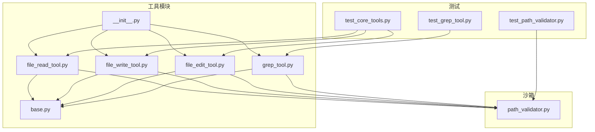
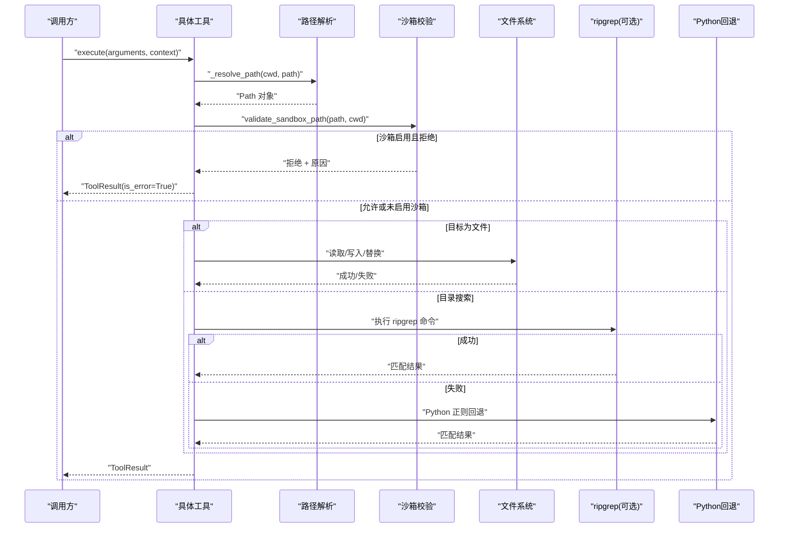
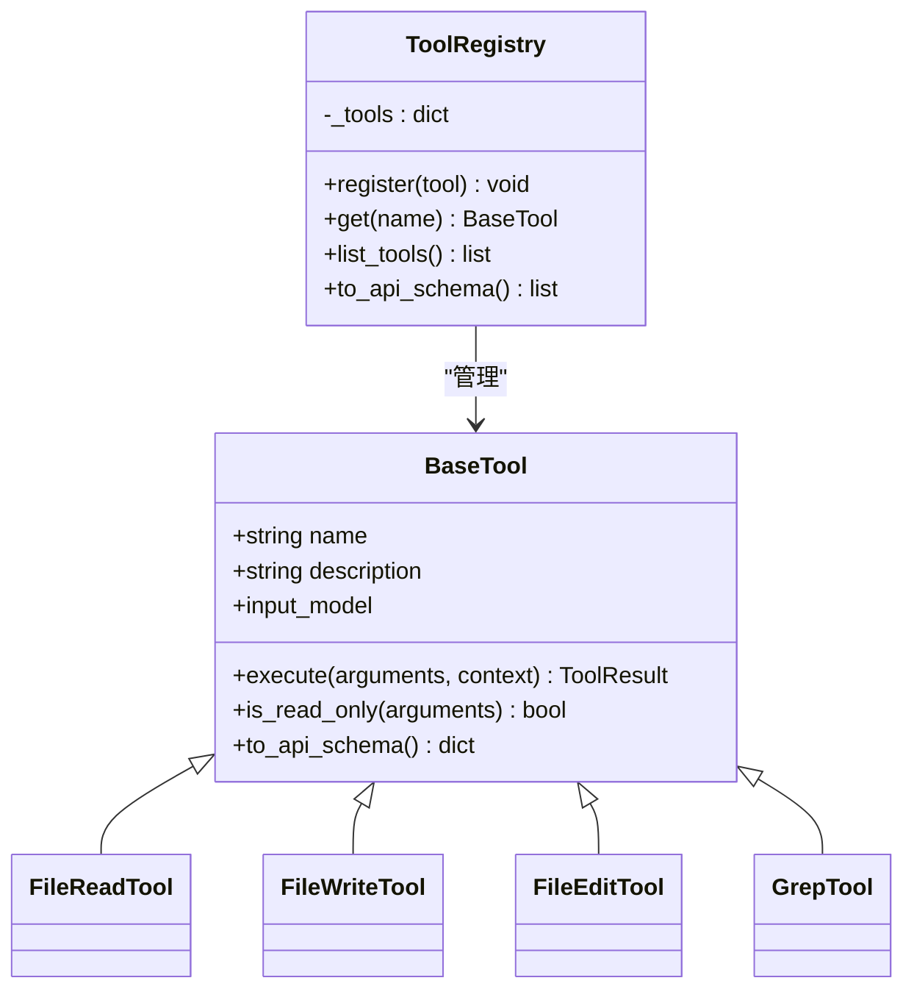
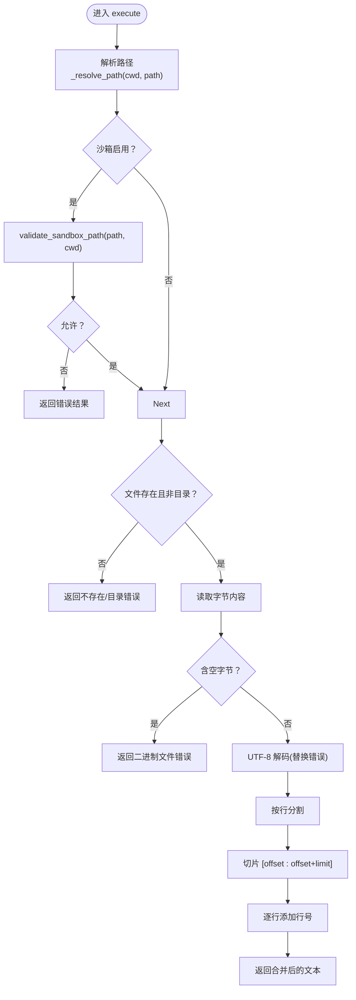
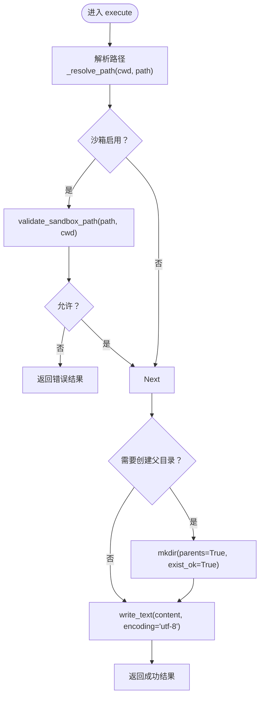
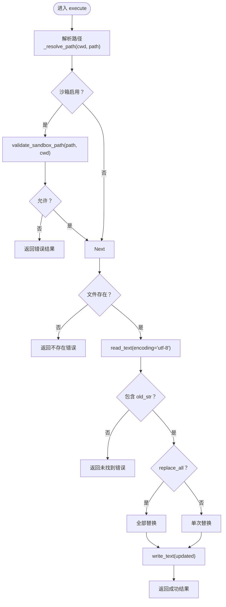
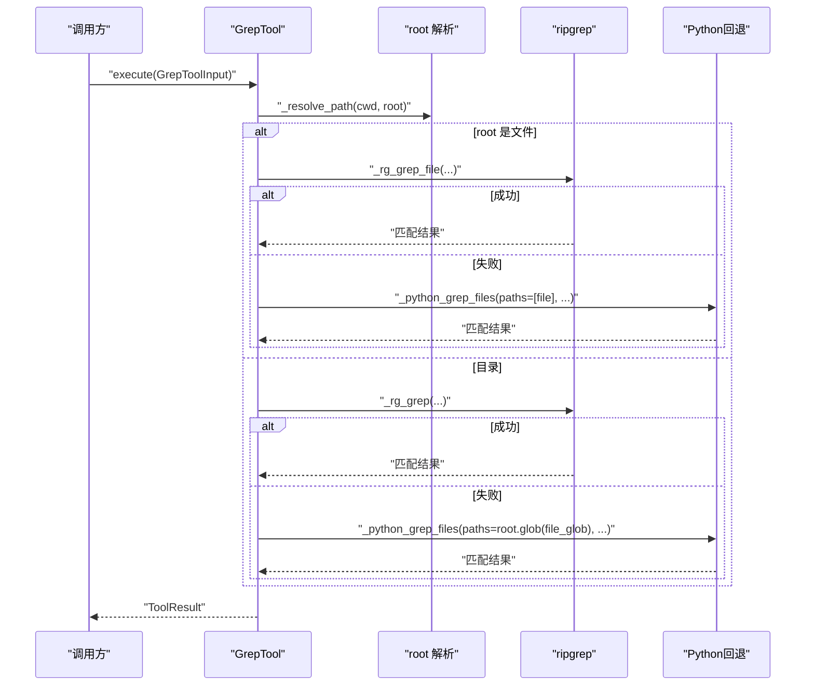
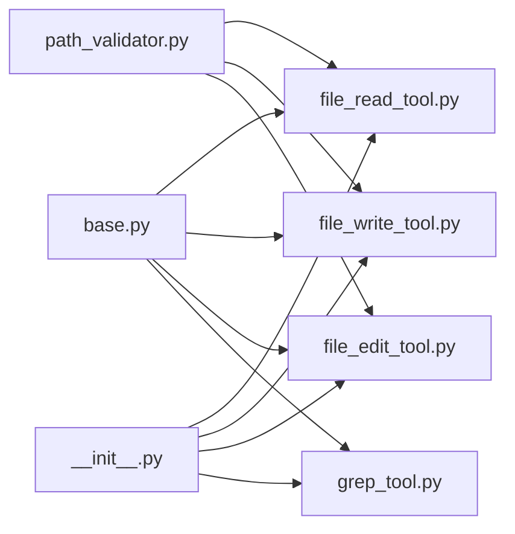

# 文件操作工具

<cite>
**本文引用的文件**
- [file_read_tool.py](file://src/openharness/tools/file_read_tool.py)
- [file_write_tool.py](file://src/openharness/tools/file_write_tool.py)
- [file_edit_tool.py](file://src/openharness/tools/file_edit_tool.py)
- [grep_tool.py](file://src/openharness/tools/grep_tool.py)
- [base.py](file://src/openharness/tools/base.py)
- [path_validator.py](file://src/openharness/sandbox/path_validator.py)
- [__init__.py](file://src/openharness/tools/__init__.py)
- [test_grep_tool.py](file://tests/test_tools/test_grep_tool.py)
- [test_core_tools.py](file://tests/test_tools/test_core_tools.py)
- [test_path_validator.py](file://tests/test_sandbox/test_path_validator.py)
- [system_prompt.py](file://src/openharness/prompts/system_prompt.py)
</cite>

## 目录
1. [简介](#简介)
2. [项目结构](#项目结构)
3. [核心组件](#核心组件)
4. [架构总览](#架构总览)
5. [详细组件分析](#详细组件分析)
6. [依赖关系分析](#依赖关系分析)
7. [性能考量](#性能考量)
8. [故障排查指南](#故障排查指南)
9. [结论](#结论)
10. [附录](#附录)

## 简介
本文件操作工具集包含四种核心工具：
- file_read_tool：读取本地仓库中的文本文件，支持偏移与行数限制，输出带行号的文本片段
- file_write_tool：创建或覆盖文本文件，支持自动创建父目录
- file_edit_tool：在现有文件中进行字符串替换，支持单次或全部替换
- grep_tool：基于正则表达式搜索文件内容，优先使用 ripgrep，不可用时回退到纯 Python 实现

这些工具均遵循统一的工具抽象层，具备只读标记、执行上下文、结果标准化等能力；在沙箱模式下会进行路径边界校验，确保操作范围受限于工作目录及允许的附加路径。

## 项目结构
文件操作工具位于工具模块中，与通用工具抽象、沙箱路径验证、工具注册机制协同工作。

图表来源
- [file_read_tool.py:1-73](file://src/openharness/tools/file_read_tool.py#L1-L73)
- [file_write_tool.py:1-54](file://src/openharness/tools/file_write_tool.py#L1-L54)
- [file_edit_tool.py:1-65](file://src/openharness/tools/file_edit_tool.py#L1-L65)
- [grep_tool.py:1-364](file://src/openharness/tools/grep_tool.py#L1-L364)
- [base.py:1-81](file://src/openharness/tools/base.py#L1-L81)
- [path_validator.py:1-38](file://src/openharness/sandbox/path_validator.py#L1-L38)
- [__init__.py:1-106](file://src/openharness/tools/__init__.py#L1-L106)
- [test_grep_tool.py:1-166](file://tests/test_tools/test_grep_tool.py#L1-L166)
- [test_core_tools.py:1-128](file://tests/test_tools/test_core_tools.py#L1-L128)
- [test_path_validator.py:1-89](file://tests/test_sandbox/test_path_validator.py#L1-L89)

章节来源
- [file_read_tool.py:1-73](file://src/openharness/tools/file_read_tool.py#L1-L73)
- [file_write_tool.py:1-54](file://src/openharness/tools/file_write_tool.py#L1-L54)
- [file_edit_tool.py:1-65](file://src/openharness/tools/file_edit_tool.py#L1-L65)
- [grep_tool.py:1-364](file://src/openharness/tools/grep_tool.py#L1-L364)
- [base.py:1-81](file://src/openharness/tools/base.py#L1-L81)
- [path_validator.py:1-38](file://src/openharness/sandbox/path_validator.py#L1-L38)
- [__init__.py:1-106](file://src/openharness/tools/__init__.py#L1-L106)

## 核心组件
- 工具抽象层：定义工具名称、描述、输入模型、执行接口与只读标记，以及工具注册表
- 路径解析与沙箱校验：统一解析相对/绝对路径，结合沙箱边界验证确保安全
- 文件读取：按行号范围读取文本，自动检测二进制文件并以 UTF-8 解码
- 文件写入：创建或覆盖文本文件，可自动创建父目录
- 文件编辑：在现有文件中替换字符串，支持单次或全部替换
- 文本搜索：优先使用 ripgrep，失败时回退到纯 Python 正则实现，支持超时控制与流缓冲优化

章节来源
- [base.py:35-81](file://src/openharness/tools/base.py#L35-L81)
- [path_validator.py:8-38](file://src/openharness/sandbox/path_validator.py#L8-L38)
- [file_read_tool.py:20-73](file://src/openharness/tools/file_read_tool.py#L20-L73)
- [file_write_tool.py:20-54](file://src/openharness/tools/file_write_tool.py#L20-L54)
- [file_edit_tool.py:21-65](file://src/openharness/tools/file_edit_tool.py#L21-L65)
- [grep_tool.py:26-364](file://src/openharness/tools/grep_tool.py#L26-L364)

## 架构总览
工具执行流程遵循统一模式：解析路径 → 沙箱校验（可选）→ 执行业务逻辑 → 返回标准化结果。grep 工具在目录搜索与文件搜索时分别采用不同的命令参数与标准错误处理策略。

图表来源
- [file_read_tool.py:31-65](file://src/openharness/tools/file_read_tool.py#L31-L65)
- [file_write_tool.py:27-46](file://src/openharness/tools/file_write_tool.py#L27-L46)
- [file_edit_tool.py:28-57](file://src/openharness/tools/file_edit_tool.py#L28-L57)
- [grep_tool.py:37-83](file://src/openharness/tools/grep_tool.py#L37-L83)
- [grep_tool.py:153-226](file://src/openharness/tools/grep_tool.py#L153-L226)
- [grep_tool.py:228-298](file://src/openharness/tools/grep_tool.py#L228-L298)
- [grep_tool.py:94-131](file://src/openharness/tools/grep_tool.py#L94-L131)

## 详细组件分析

### 工具抽象与注册
- 抽象基类提供统一的工具接口、只读标记与 API 规范化输出
- 注册表负责工具命名映射与 API 模式导出
- 默认注册器集中注册所有内置工具，包括文件读写编辑与 grep

图表来源
- [base.py:35-81](file://src/openharness/tools/base.py#L35-L81)
- [__init__.py:47-96](file://src/openharness/tools/__init__.py#L47-L96)

章节来源
- [base.py:17-81](file://src/openharness/tools/base.py#L17-L81)
- [__init__.py:47-96](file://src/openharness/tools/__init__.py#L47-L96)

### 文件读取工具（file_read_tool）
- 功能特性
  - 读取 UTF-8 文本文件，自动检测二进制文件并拒绝
  - 支持偏移起始行与返回行数限制，输出带行号的文本
  - 在沙箱模式下进行路径边界校验
- 参数配置
  - path：目标文件路径（支持相对路径与波浪号展开）
  - offset：从零开始的起始行号，默认 0
  - limit：返回行数，默认 200，最小 1，最大 2000
- 使用场景
  - 查看源码片段、日志片段、配置文件片段
  - 结合只读标记与沙箱校验保障安全
- 安全与限制
  - 二进制文件检测，避免损坏输出
  - UTF-8 解码，错误字符替换
  - 沙箱边界外访问直接拒绝

图表来源
- [file_read_tool.py:31-65](file://src/openharness/tools/file_read_tool.py#L31-L65)
- [file_read_tool.py:68-73](file://src/openharness/tools/file_read_tool.py#L68-L73)

章节来源
- [file_read_tool.py:12-29](file://src/openharness/tools/file_read_tool.py#L12-L29)
- [file_read_tool.py:31-65](file://src/openharness/tools/file_read_tool.py#L31-L65)
- [file_read_tool.py:68-73](file://src/openharness/tools/file_read_tool.py#L68-L73)

### 文件写入工具（file_write_tool）
- 功能特性
  - 创建或覆盖文本文件，UTF-8 编码
  - 可选择自动创建父目录
  - 在沙箱模式下进行路径边界校验
- 参数配置
  - path：目标文件路径
  - content：完整文件内容
  - create_directories：是否自动创建父目录，默认开启
- 使用场景
  - 新建配置文件、生成临时文件、批量写入
- 安全与限制
  - 沙箱边界外访问直接拒绝
  - 自动创建目录时使用递归创建，避免权限问题

图表来源
- [file_write_tool.py:27-46](file://src/openharness/tools/file_write_tool.py#L27-L46)
- [file_write_tool.py:49-54](file://src/openharness/tools/file_write_tool.py#L49-L54)

章节来源
- [file_write_tool.py:12-25](file://src/openharness/tools/file_write_tool.py#L12-L25)
- [file_write_tool.py:27-46](file://src/openharness/tools/file_write_tool.py#L27-L46)
- [file_write_tool.py:49-54](file://src/openharness/tools/file_write_tool.py#L49-L54)

### 文件编辑工具（file_edit_tool）
- 功能特性
  - 在现有文件中替换字符串
  - 支持单次替换或全部替换
  - 在沙箱模式下进行路径边界校验
- 参数配置
  - path：目标文件路径
  - old_str：要被替换的旧文本
  - new_str：替换后的新文本
  - replace_all：是否替换全部，默认关闭
- 使用场景
  - 修改配置项、替换标识符、批量改名
- 安全与限制
  - 仅对已存在文件生效
  - 未找到旧文本时返回错误
  - 沙箱边界外访问直接拒绝

图表来源
- [file_edit_tool.py:28-57](file://src/openharness/tools/file_edit_tool.py#L28-L57)
- [file_edit_tool.py:60-65](file://src/openharness/tools/file_edit_tool.py#L60-L65)

章节来源
- [file_edit_tool.py:12-26](file://src/openharness/tools/file_edit_tool.py#L12-L26)
- [file_edit_tool.py:28-57](file://src/openharness/tools/file_edit_tool.py#L28-L57)
- [file_edit_tool.py:60-65](file://src/openharness/tools/file_edit_tool.py#L60-L65)

### 文本搜索工具（grep_tool）
- 功能特性
  - 基于正则表达式搜索文件内容
  - 优先使用 ripgrep，失败时回退到纯 Python 实现
  - 支持大小写敏感/不敏感、文件通配、结果数量限制、超时控制
  - 支持对单个文件与目录两种搜索模式
- 参数配置
  - pattern：正则表达式
  - root：搜索根目录（可选），默认当前工作目录
  - file_glob：文件通配符，默认 "**/*"
  - case_sensitive：是否大小写敏感，默认 True
  - limit：最大匹配数，默认 200，最小 1，最大 2000
  - timeout_seconds：超时秒数，默认 20，最小 1，最大 120
- 使用场景
  - 快速定位代码片段、查找配置项、审计日志
- 性能与安全
  - 使用流式读取与大缓冲限制，避免长行导致内存溢出
  - 超时后终止进程，必要时强制杀死
  - 标准错误重定向，减少噪声输出
  - 沙箱模式下通过容器会话执行命令

图表来源
- [grep_tool.py:37-83](file://src/openharness/tools/grep_tool.py#L37-L83)
- [grep_tool.py:153-226](file://src/openharness/tools/grep_tool.py#L153-L226)
- [grep_tool.py:228-298](file://src/openharness/tools/grep_tool.py#L228-L298)
- [grep_tool.py:94-131](file://src/openharness/tools/grep_tool.py#L94-L131)

章节来源
- [grep_tool.py:15-36](file://src/openharness/tools/grep_tool.py#L15-L36)
- [grep_tool.py:37-83](file://src/openharness/tools/grep_tool.py#L37-L83)
- [grep_tool.py:153-226](file://src/openharness/tools/grep_tool.py#L153-L226)
- [grep_tool.py:228-298](file://src/openharness/tools/grep_tool.py#L228-L298)
- [grep_tool.py:94-131](file://src/openharness/tools/grep_tool.py#L94-L131)

## 依赖关系分析
- 工具间耦合度低，均通过抽象基类与注册表解耦
- 路径解析函数在各工具内复用，避免重复逻辑
- 沙箱校验作为横切关注点，在读写编辑工具中统一应用
- grep 工具对 ripgrep 的依赖是可选的，保证在无外部依赖环境下的可用性

图表来源
- [base.py:35-81](file://src/openharness/tools/base.py#L35-L81)
- [path_validator.py:8-38](file://src/openharness/sandbox/path_validator.py#L8-L38)
- [__init__.py:47-96](file://src/openharness/tools/__init__.py#L47-L96)

章节来源
- [base.py:35-81](file://src/openharness/tools/base.py#L35-L81)
- [path_validator.py:8-38](file://src/openharness/sandbox/path_validator.py#L8-L38)
- [__init__.py:47-96](file://src/openharness/tools/__init__.py#L47-L96)

## 性能考量
- 流式处理与缓冲限制
  - grep 工具在子进程流读取时设置较大的每行缓冲上限，避免长行导致的 LimitOverrunError
  - 单次读取完成后立即终止进程，防止资源泄漏
- 超时与中断
  - 统一的超时控制与取消处理，超时后发送特定标记并在必要时强制杀死进程
- 回退策略
  - 无 ripgrep 时自动切换到纯 Python 正则实现，保证功能可用性
- I/O 优化
  - 读取时按行处理，避免一次性加载大文件
  - 写入时直接以 UTF-8 写入，减少中间转换成本

章节来源
- [grep_tool.py:204-226](file://src/openharness/tools/grep_tool.py#L204-L226)
- [grep_tool.py:272-298](file://src/openharness/tools/grep_tool.py#L272-L298)
- [grep_tool.py:304-357](file://src/openharness/tools/grep_tool.py#L304-L357)
- [test_grep_tool.py:71-95](file://tests/test_tools/test_grep_tool.py#L71-L95)

## 故障排查指南
- 路径越界与权限问题
  - 沙箱启用时，若路径超出工作目录或链接指向外部，将返回拒绝原因
  - 建议使用相对路径或工作目录内的绝对路径
- 二进制文件读取
  - 读取工具检测到空字节时会拒绝读取并提示为二进制文件
- 正则表达式无效
  - Python 回退实现会在无效正则时返回错误信息，包含具体异常描述
- 超时与性能
  - grep 工具在超时后会返回超时标记并终止进程，建议调整超时时间或缩小搜索范围
- 权限不足
  - 写入/编辑失败通常由权限不足引起，检查目标文件与父目录权限

章节来源
- [path_validator.py:8-38](file://src/openharness/sandbox/path_validator.py#L8-L38)
- [test_path_validator.py:22-44](file://tests/test_sandbox/test_path_validator.py#L22-L44)
- [test_grep_tool.py:152-166](file://tests/test_tools/test_grep_tool.py#L152-L166)
- [grep_tool.py:140-150](file://src/openharness/tools/grep_tool.py#L140-L150)

## 结论
文件操作工具集提供了安全、高效、可扩展的文件读写与搜索能力。通过统一的抽象层、路径解析与沙箱校验，确保在受限环境中安全地执行文件操作。grep 工具的双实现策略兼顾性能与可用性，适合多种部署环境。配合工具注册机制，用户可以轻松组合使用这些工具完成复杂的文件处理任务。

## 附录

### 最佳实践指南
- 文件大小限制
  - 读取工具默认限制返回行数，避免一次性输出过大内容
  - 写入与编辑工具适用于中小文件，大文件建议分块处理
- 编码处理
  - 统一使用 UTF-8 编码，避免跨平台编码差异
  - 二进制文件应避免使用文本读取工具
- 错误恢复策略
  - 对于可能失败的操作（如网络/权限），先进行预检查
  - 使用只读工具进行预览后再执行写入/编辑
  - 合理设置 grep 的超时与结果限制，避免长时间阻塞
- 路径处理
  - 优先使用相对路径或工作目录内的绝对路径
  - 避免使用 .. 进行路径穿越
  - 沙箱模式下确保目标路径在允许范围内

章节来源
- [file_read_tool.py:16-17](file://src/openharness/tools/file_read_tool.py#L16-L17)
- [grep_tool.py:22-23](file://src/openharness/tools/grep_tool.py#L22-L23)
- [system_prompt.py:42-48](file://src/openharness/prompts/system_prompt.py#L42-L48)

### 使用示例（路径指引）
- 文件读取
  - [test_core_tools.py:44-49](file://tests/test_tools/test_core_tools.py#L44-L49)
- 文件写入
  - [test_core_tools.py:37-42](file://tests/test_tools/test_core_tools.py#L37-L42)
- 文件编辑
  - [test_core_tools.py:51-56](file://tests/test_tools/test_core_tools.py#L51-L56)
- grep 搜索
  - [test_grep_tool.py:46-67](file://tests/test_tools/test_grep_tool.py#L46-L67)
  - [test_grep_tool.py:152-166](file://tests/test_tools/test_grep_tool.py#L152-L166)