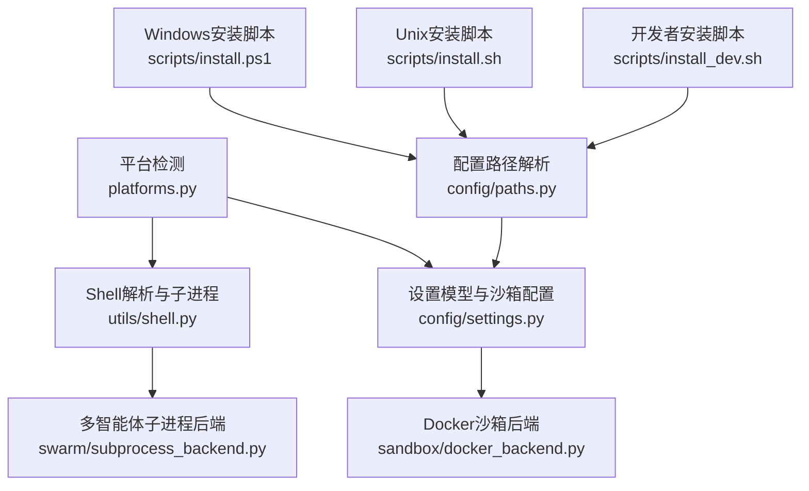
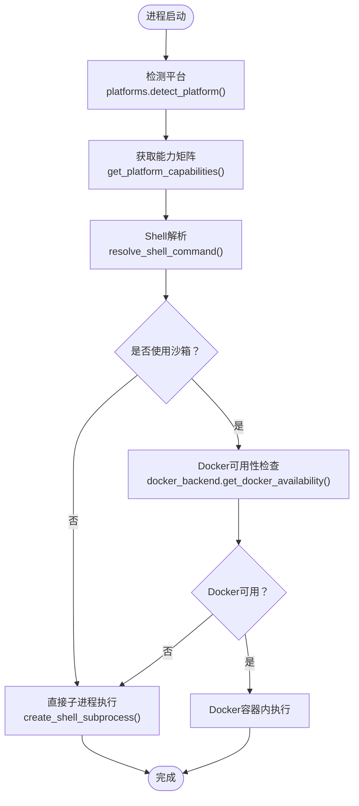
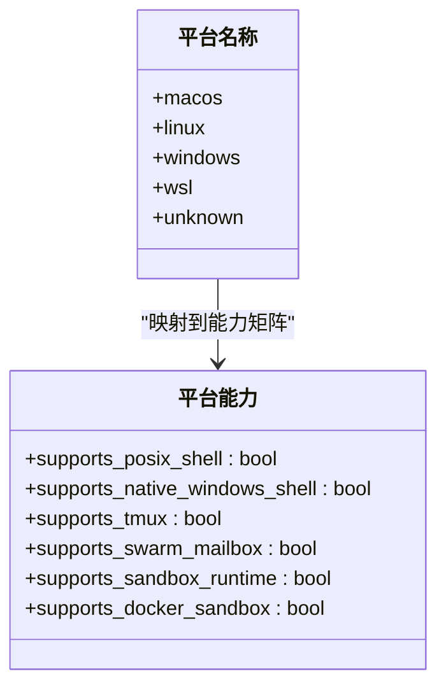
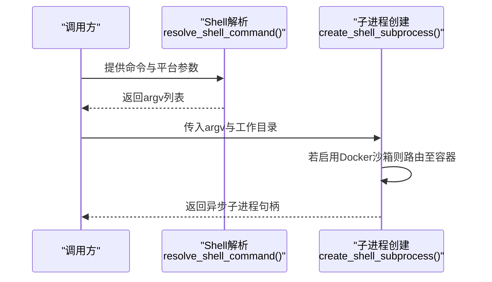
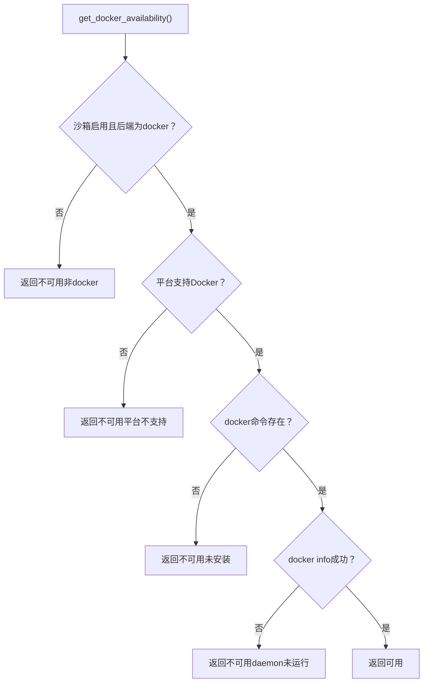
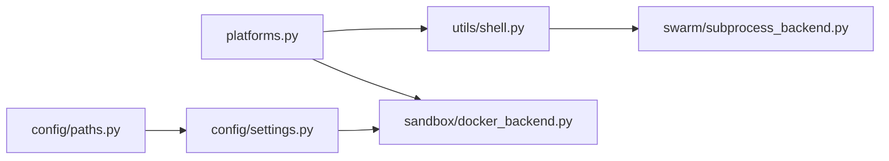

# 平台支持

<cite>
**本文引用的文件**
- [platforms.py](file://src/openharness/platforms.py)
- [shell.py](file://src/openharness/utils/shell.py)
- [paths.py](file://src/openharness/config/paths.py)
- [settings.py](file://src/openharness/config/settings.py)
- [docker_backend.py](file://src/openharness/sandbox/docker_backend.py)
- [subprocess_backend.py](file://src/openharness/swarm/subprocess_backend.py)
- [install.ps1](file://scripts/install.ps1)
- [install.sh](file://scripts/install.sh)
- [install_dev.sh](file://scripts/install_dev.sh)
- [test_platforms.py](file://tests/test_platforms.py)
- [test_shell.py](file://tests/test_utils/test_shell.py)
- [test_mailbox.py](file://tests/test_swarm/test_mailbox.py)
</cite>

## 目录
1. [简介](#简介)
2. [项目结构](#项目结构)
3. [核心组件](#核心组件)
4. [架构总览](#架构总览)
5. [详细组件分析](#详细组件分析)
6. [依赖分析](#依赖分析)
7. [性能考虑](#性能考虑)
8. [故障排除指南](#故障排除指南)
9. [结论](#结论)
10. [附录](#附录)

## 简介
本文件面向OpenHarness平台支持与跨平台适配，系统化阐述平台检测、能力矩阵、Shell与子进程选择策略、沙箱与多智能体后端在不同平台上的差异，以及安装脚本对Windows/Linux/macOS/WSL的适配方式。文档同时提供配置与优化建议、兼容性测试与验证方法、常见问题与解决方案，以及扩展新平台的步骤指引。

## 项目结构
围绕平台支持的关键模块与文件：
- 平台检测与能力矩阵：src/openharness/platforms.py
- Shell解析与子进程执行：src/openharness/utils/shell.py
- 配置目录与路径解析：src/openharness/config/paths.py
- 设置模型（含沙箱配置）：src/openharness/config/settings.py
- Docker沙箱后端：src/openharness/sandbox/docker_backend.py
- 多智能体子进程后端：src/openharness/swarm/subprocess_backend.py
- 安装脚本（Windows/Unix）：scripts/install.ps1、scripts/install.sh、scripts/install_dev.sh
- 平台与Shell相关测试：tests/test_platforms.py、tests/test_utils/test_shell.py、tests/test_swarm/test_mailbox.py

**图表来源**
- [platforms.py:1-87](file://src/openharness/platforms.py#L1-L87)
- [shell.py:1-148](file://src/openharness/utils/shell.py#L1-L148)
- [settings.py:496-642](file://src/openharness/config/settings.py#L496-L642)
- [docker_backend.py:1-233](file://src/openharness/sandbox/docker_backend.py#L1-L233)
- [subprocess_backend.py:1-172](file://src/openharness/swarm/subprocess_backend.py#L1-L172)
- [paths.py:1-161](file://src/openharness/config/paths.py#L1-L161)
- [install.ps1:1-330](file://scripts/install.ps1#L1-L330)
- [install.sh:1-388](file://scripts/install.sh#L1-L388)
- [install_dev.sh:1-182](file://scripts/install_dev.sh#L1-L182)

**章节来源**
- [platforms.py:1-87](file://src/openharness/platforms.py#L1-L87)
- [shell.py:1-148](file://src/openharness/utils/shell.py#L1-L148)
- [paths.py:1-161](file://src/openharness/config/paths.py#L1-L161)
- [settings.py:496-642](file://src/openharness/config/settings.py#L496-L642)
- [docker_backend.py:1-233](file://src/openharness/sandbox/docker_backend.py#L1-L233)
- [subprocess_backend.py:1-172](file://src/openharness/swarm/subprocess_backend.py#L1-L172)
- [install.ps1:1-330](file://scripts/install.ps1#L1-L330)
- [install.sh:1-388](file://scripts/install.sh#L1-L388)
- [install_dev.sh:1-182](file://scripts/install_dev.sh#L1-L182)

## 核心组件
- 平台检测与能力矩阵
  - 支持平台：macos、linux、windows、wsl、unknown
  - 能力字段：POSIX Shell支持、原生Windows Shell支持、tmux支持、多智能体邮箱支持、沙箱运行时支持、Docker沙箱支持
  - 检测逻辑：基于系统名、内核版本关键字与WSL环境变量
- Shell解析与子进程执行
  - Windows优先选择可用的bash（若不可用则PowerShell/cmd），POSIX平台优先bash；可选通过script命令包装以启用PTY
- 配置与路径
  - 默认配置目录：~/.openharness，支持环境变量覆盖
  - 数据、日志、会话、任务等子目录按需创建
- 沙箱与多智能体
  - Docker沙箱仅在支持平台启用，且需要Docker可用
  - 多智能体子进程后端在所有平台可用，Windows下避免Git Bash直接exec Windows路径导致的问题

**章节来源**
- [platforms.py:11-87](file://src/openharness/platforms.py#L11-L87)
- [shell.py:17-48](file://src/openharness/utils/shell.py#L17-L48)
- [paths.py:15-106](file://src/openharness/config/paths.py#L15-L106)
- [settings.py:97-106](file://src/openharness/config/settings.py#L97-L106)
- [docker_backend.py:19-58](file://src/openharness/sandbox/docker_backend.py#L19-L58)
- [subprocess_backend.py:68-85](file://src/openharness/swarm/subprocess_backend.py#L68-L85)

## 架构总览
OpenHarness在不同平台上的关键决策链路如下：

**图表来源**
- [platforms.py:27-86](file://src/openharness/platforms.py#L27-L86)
- [shell.py:17-105](file://src/openharness/utils/shell.py#L17-L105)
- [docker_backend.py:19-58](file://src/openharness/sandbox/docker_backend.py#L19-L58)

## 详细组件分析

### 组件A：平台检测与能力矩阵
- 平台识别规则
  - Darwin → macos
  - Windows → windows
  - Linux + 包含“microsoft”或WSL环境变量 → wsl
  - 其他Linux → linux
  - 其他 → unknown
- 能力矩阵
  - POSIX平台（macos/linux/wsl）：支持POSIX Shell、tmux、多智能体邮箱、沙箱运行时、Docker沙箱
  - Windows：仅支持原生Windows Shell，禁用tmux、多智能体邮箱、沙箱运行时与Docker沙箱
  - 其他：全部禁用

**图表来源**
- [platforms.py:11-87](file://src/openharness/platforms.py#L11-L87)

**章节来源**
- [platforms.py:27-87](file://src/openharness/platforms.py#L27-L87)
- [test_platforms.py:8-25](file://tests/test_platforms.py#L8-L25)

### 组件B：Shell解析与子进程执行
- Windows
  - 优先：可用的bash（经可用性检测）
  - 其次：PowerShell（pwsh或powershell）
  - 最后：cmd
- POSIX平台
  - 优先：bash -lc
  - 可选：通过script包装以启用PTY（macOS不使用script）
- 可用性检测
  - Windows上对bash进行短命令测试，避免WSL未安装时的不可用bash误选

**图表来源**
- [shell.py:17-105](file://src/openharness/utils/shell.py#L17-L105)

**章节来源**
- [shell.py:17-148](file://src/openharness/utils/shell.py#L17-L148)
- [test_shell.py:15-127](file://tests/test_utils/test_shell.py#L15-L127)

### 组件C：Docker沙箱后端
- 后端启用条件
  - settings.sandbox.enabled为真且backend为docker
- 平台支持检查
  - 通过平台能力矩阵判断是否支持Docker沙箱
- 可用性检查
  - 检查docker命令是否存在
  - 执行docker info以确认守护进程状态
- 执行流程
  - 在容器中以只读挂载当前工作目录执行命令
  - 支持CPU/内存限制与额外挂载

**图表来源**
- [docker_backend.py:19-58](file://src/openharness/sandbox/docker_backend.py#L19-L58)

**章节来源**
- [docker_backend.py:19-233](file://src/openharness/sandbox/docker_backend.py#L19-L233)
- [settings.py:97-106](file://src/openharness/config/settings.py#L97-L106)

### 组件D：多智能体子进程后端
- 后端可用性
  - 总是可用（subprocess）
- 关键注意点
  - Windows下避免Git Bash直接exec Windows路径导致的问题，必要时使用argv列表而非字符串
  - 通过任务管理器创建后台任务，stdin/stdout通信

**章节来源**
- [subprocess_backend.py:43-115](file://src/openharness/swarm/subprocess_backend.py#L43-L115)

### 组件E：配置与路径解析
- 配置目录
  - 默认：~/.openharness
  - 可通过OPENHARNESS_CONFIG_DIR覆盖
- 数据/日志/会话/任务等子目录自动创建
- 日志与会话存储位置

**章节来源**
- [paths.py:15-106](file://src/openharness/config/paths.py#L15-L106)

### 组件F：安装脚本与平台适配
- Windows（PowerShell）
  - 检查PowerShell版本、Python 3.10+、Node.js（可选）
  - 创建用户级虚拟环境与PATH集成
  - 可从源码安装或pip安装
- Unix（Bash）
  - 检测OS类型（含WSL），检查Python 3.10+与Node.js（可选）
  - 创建用户级虚拟环境与全局命令链接
  - 自动将~/.local/bin加入PATH
- 开发者安装
  - 支持本地仓库可编辑安装与前端依赖安装

**章节来源**
- [install.ps1:48-330](file://scripts/install.ps1#L48-L330)
- [install.sh:67-388](file://scripts/install.sh#L67-L388)
- [install_dev.sh:62-182](file://scripts/install_dev.sh#L62-L182)

## 依赖分析
- 平台层依赖
  - 平台检测被Shell解析与沙箱后端共同依赖
  - 能力矩阵决定后续功能可用性
- 配置层依赖
  - 设置模型中的沙箱配置影响Docker后端可用性
  - 路径解析为配置与数据目录提供统一入口
- 运行时依赖
  - Docker后端依赖Docker CLI与守护进程
  - POSIX平台PTY通过script命令实现

**图表来源**
- [platforms.py:1-87](file://src/openharness/platforms.py#L1-L87)
- [shell.py:1-148](file://src/openharness/utils/shell.py#L1-L148)
- [settings.py:496-642](file://src/openharness/config/settings.py#L496-L642)
- [docker_backend.py:1-233](file://src/openharness/sandbox/docker_backend.py#L1-L233)
- [paths.py:1-161](file://src/openharness/config/paths.py#L1-L161)
- [subprocess_backend.py:1-172](file://src/openharness/swarm/subprocess_backend.py#L1-L172)

**章节来源**
- [platforms.py:1-87](file://src/openharness/platforms.py#L1-L87)
- [shell.py:1-148](file://src/openharness/utils/shell.py#L1-L148)
- [settings.py:496-642](file://src/openharness/config/settings.py#L496-L642)
- [docker_backend.py:1-233](file://src/openharness/sandbox/docker_backend.py#L1-L233)
- [paths.py:1-161](file://src/openharness/config/paths.py#L1-L161)
- [subprocess_backend.py:1-172](file://src/openharness/swarm/subprocess_backend.py#L1-L172)

## 性能考虑
- Shell选择与PTY
  - POSIX平台启用PTY可改善交互体验，但script包装带来额外开销；仅在需要时开启prefer_pty
- Docker沙箱
  - 容器启动与网络隔离有成本；仅在需要强隔离时启用
  - CPU/内存限制应结合实际资源合理配置
- 子进程后端
  - 多智能体场景下，stdin/stdout同步与消息序列化开销可控，建议避免不必要的字符串拼接

[本节为通用指导，无需列出具体文件来源]

## 故障排除指南
- Windows无法找到可用bash
  - 现象：Windows平台选择PowerShell或cmd
  - 原因：WSL未安装或Git Bash不可用
  - 解决：安装WSL或确保Git Bash可用，并通过可用性检测
- Docker沙箱不可用
  - 现象：提示Docker未安装或守护进程未运行
  - 原因：docker命令不存在或docker info失败
  - 解决：安装Docker Desktop/Engine并启动守护进程
- POSIX平台PTY无效
  - 现象：请求PTY但script不存在或包装失败
  - 原因：script命令缺失或argv格式不符
  - 解决：安装script或关闭prefer_pty
- 多智能体邮箱不可用
  - 现象：Windows平台禁用邮箱功能
  - 原因：平台能力矩阵禁用
  - 解决：在支持平台使用邮箱；或改用其他通信方式
- 安装后命令不可用
  - 现象：oh/ohmo不在PATH
  - 原因：PATH未更新或终端未重载
  - 解决：按安装脚本提示刷新PATH并重启终端

**章节来源**
- [shell.py:124-140](file://src/openharness/utils/shell.py#L124-L140)
- [docker_backend.py:35-56](file://src/openharness/sandbox/docker_backend.py#L35-L56)
- [test_shell.py:91-127](file://tests/test_utils/test_shell.py#L91-L127)
- [test_platforms.py:21-25](file://tests/test_platforms.py#L21-L25)
- [install.ps1:240-330](file://scripts/install.ps1#L240-L330)
- [install.sh:318-388](file://scripts/install.sh#L318-L388)

## 结论
OpenHarness通过统一的平台检测与能力矩阵，为Shell选择、沙箱与多智能体后端在不同平台上的行为提供清晰的决策依据。Windows受限于原生Shell与安全策略，采用降级方案；POSIX平台（含WSL）则充分利用POSIX生态与容器能力。安装脚本针对各平台提供一致的体验与路径集成。建议在生产环境中优先启用Docker沙箱以获得更强隔离，并根据平台特性合理配置PTY与邮箱功能。

[本节为总结性内容，无需列出具体文件来源]

## 附录

### 平台支持与特性对照表
- macOS
  - POSIX Shell：支持
  - 原生Windows Shell：不适用
  - tmux：支持
  - 多智能体邮箱：支持
  - 沙箱运行时：支持
  - Docker沙箱：支持
- Linux
  - POSIX Shell：支持
  - 原生Windows Shell：不适用
  - tmux：支持
  - 多智能体邮箱：支持
  - 沙箱运行时：支持
  - Docker沙箱：支持
- Windows
  - POSIX Shell：不支持
  - 原生Windows Shell：支持
  - tmux：不支持
  - 多智能体邮箱：不支持
  - 沙箱运行时：不支持
  - Docker沙箱：不支持
- WSL
  - POSIX Shell：支持
  - 原生Windows Shell：不适用
  - tmux：支持
  - 多智能体邮箱：支持
  - 沙箱运行时：支持
  - Docker沙箱：支持

**章节来源**
- [platforms.py:55-87](file://src/openharness/platforms.py#L55-L87)

### 平台相关配置与优化建议
- 配置目录
  - 使用OPENHARNESS_CONFIG_DIR覆盖默认配置目录
  - 使用OPENHARNESS_DATA_DIR、OPENHARNESS_LOGS_DIR分别覆盖数据与日志目录
- 沙箱配置
  - Docker沙箱：设置镜像、CPU/内存限制、额外挂载与环境变量
  - 失败回退：fail_if_unavailable控制未就绪时的行为
- Shell与PTY
  - POSIX平台按需启用prefer_pty以提升交互体验
  - Windows避免直接exec Windows路径，优先使用可用的bash或PowerShell

**章节来源**
- [paths.py:22-67](file://src/openharness/config/paths.py#L22-L67)
- [settings.py:86-106](file://src/openharness/config/settings.py#L86-L106)
- [shell.py:37-47](file://src/openharness/utils/shell.py#L37-L47)

### 平台兼容性测试与验证方法
- 单元测试
  - 平台检测：验证WSL与Windows识别
  - Shell解析：验证Windows优先PowerShell、POSIX优先bash、PTY包装行为
  - 多智能体邮箱：验证消息写入/读取/标记/清理
- 测试用例参考
  - 平台识别：[test_platforms.py:8-25](file://tests/test_platforms.py#L8-L25)
  - Shell解析：[test_shell.py:15-127](file://tests/test_utils/test_shell.py#L15-L127)
  - 邮箱功能：[test_mailbox.py:24-47](file://tests/test_swarm/test_mailbox.py#L24-L47)

**章节来源**
- [test_platforms.py:8-25](file://tests/test_platforms.py#L8-L25)
- [test_shell.py:15-127](file://tests/test_utils/test_shell.py#L15-L127)
- [test_mailbox.py:24-47](file://tests/test_swarm/test_mailbox.py#L24-L47)

### 已知问题与解决方案
- Windows平台多智能体邮箱与沙箱禁用
  - 由于平台能力矩阵限制，该功能在Windows上不可用
  - 方案：在支持平台使用邮箱与沙箱；或通过其他机制实现团队通信
- Windows上Git Bash不可用
  - 现象：bash存在但不可用，回退到PowerShell/cmd
  - 方案：安装WSL或修复Git Bash环境
- POSIX平台PTY包装失败
  - 现象：script不存在或argv格式不符
  - 方案：安装script或关闭prefer_pty

**章节来源**
- [platforms.py:55-87](file://src/openharness/platforms.py#L55-L87)
- [shell.py:124-140](file://src/openharness/utils/shell.py#L124-L140)
- [test_shell.py:91-127](file://tests/test_utils/test_shell.py#L91-L127)

### 扩展与新增平台的方法
- 新增平台步骤
  - 在平台检测函数中增加新的系统名分支与WSL判定逻辑
  - 在能力矩阵中为新平台赋值相应布尔值
  - 在Shell解析中补充新平台的Shell选择策略
  - 在安装脚本中增加新平台的前置检查与路径集成
- 验证流程
  - 编写单元测试覆盖新平台识别与能力矩阵
  - 在目标平台上验证Shell解析与安装脚本行为

**章节来源**
- [platforms.py:27-87](file://src/openharness/platforms.py#L27-L87)
- [shell.py:17-48](file://src/openharness/utils/shell.py#L17-L48)
- [install.sh:67-85](file://scripts/install.sh#L67-L85)