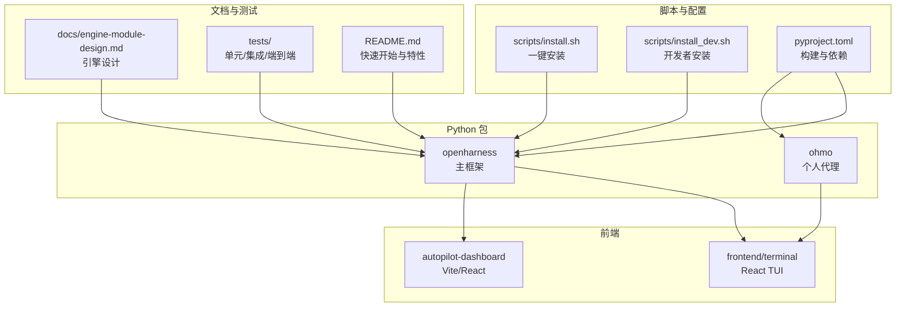
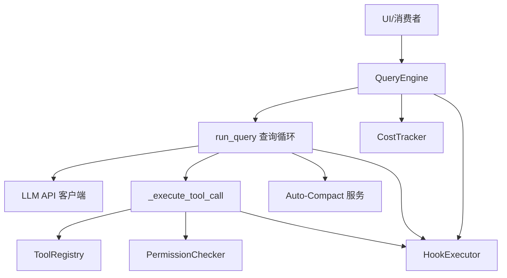
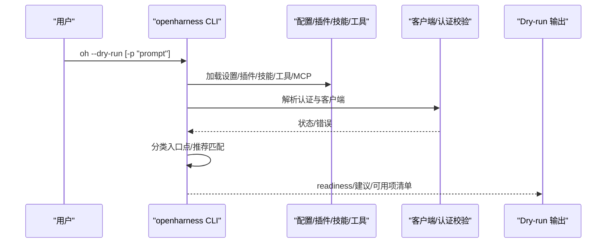
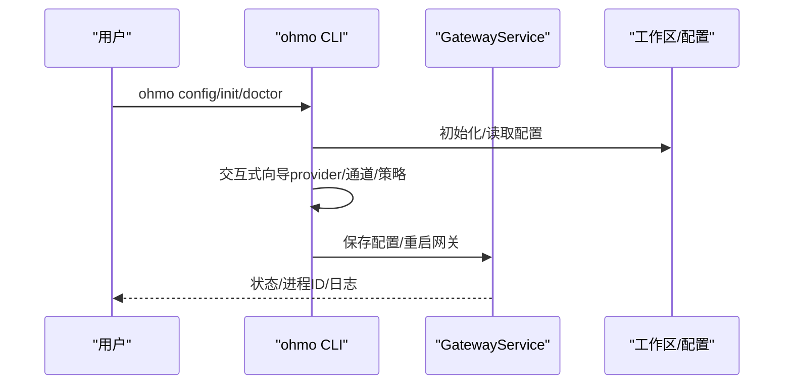
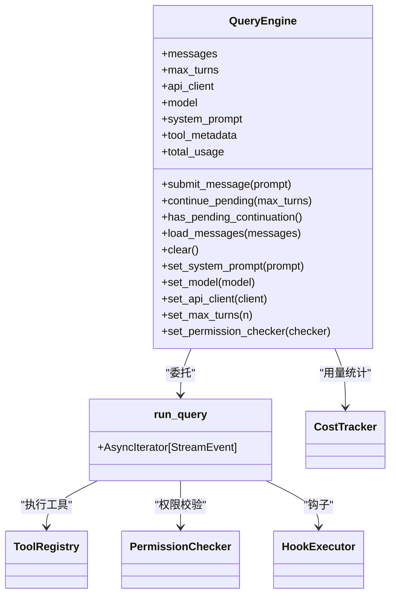
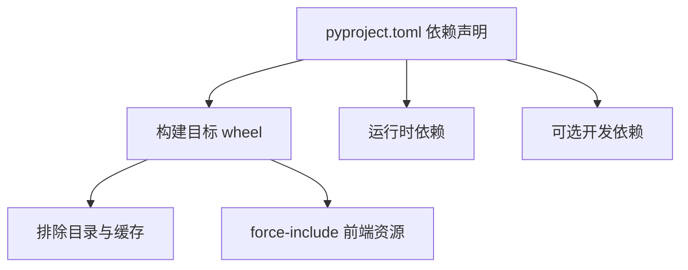

# 开发指南

<cite>
**本文引用的文件**   
- [README.md](file://README.md)
- [CONTRIBUTING.md](file://CONTRIBUTING.md)
- [pyproject.toml](file://pyproject.toml)
- [scripts/install.sh](file://scripts/install.sh)
- [scripts/install_dev.sh](file://scripts/install_dev.sh)
- [.github/PULL_REQUEST_TEMPLATE.md](file://.github/PULL_REQUEST_TEMPLATE.md)
- [src/openharness/cli.py](file://src/openharness/cli.py)
- [ohmo/cli.py](file://ohmo/cli.py)
- [src/openharness/__main__.py](file://src/openharness/__main__.py)
- [ohmo/__main__.py](file://ohmo/__main__.py)
- [docs/engine-module-design.md](file://docs/engine-module-design.md)
- [frontend/terminal/package.json](file://frontend/terminal/package.json)
- [autopilot-dashboard/package.json](file://autopilot-dashboard/package.json)
- [CHANGELOG.md](file://CHANGELOG.md)
</cite>

## 目录
1. [简介](#简介)
2. [项目结构](#项目结构)
3. [核心组件](#核心组件)
4. [架构总览](#架构总览)
5. [详细组件分析](#详细组件分析)
6. [依赖分析](#依赖分析)
7. [性能考虑](#性能考虑)
8. [故障排查指南](#故障排查指南)
9. [结论](#结论)
10. [附录](#附录)

## 简介
本开发指南面向希望参与 OpenHarness 与 ohmo 个人代理开发的工程师与研究者。内容覆盖开发环境搭建、代码结构与开发规范、贡献流程、构建与打包、调试方法、新功能开发指导、版本与发布流程，以及最佳实践与常见问题。

## 项目结构
仓库采用“多子包 + 多入口”的组织方式：
- Python 包：src/openharness（主框架）、ohmo（个人代理应用）
- 前端：frontend/terminal（React/TUI）、autopilot-dashboard（Vite/React）
- 脚本：scripts/（安装与开发脚本）
- 文档：docs/（引擎设计等）
- 测试：tests/（单元/集成/端到端）
- GitHub 工作流与模板：.github/

图示来源
- [pyproject.toml:54-74](file://pyproject.toml#L54-L74)
- [scripts/install.sh:182-238](file://scripts/install.sh#L182-L238)
- [scripts/install_dev.sh:95-125](file://scripts/install_dev.sh#L95-L125)

章节来源
- [README.md:197-284](file://README.md#L197-L284)
- [pyproject.toml:54-74](file://pyproject.toml#L54-L74)

## 核心组件
- CLI 入口与命令体系
  - openharness 主 CLI：src/openharness/cli.py，Typer 驱动，提供 dry-run、provider、plugin、auth、mcp、cron、autopilot 等子命令与交互式会话。
  - ohmo 个人代理 CLI：ohmo/cli.py，Typer 驱动，提供 init/config/doctor/memory/soul/user/gateway 等子命令。
  - 模块入口：src/openharness/__main__.py 与 ohmo/__main__.py，分别调用对应 app。
- 引擎与核心模块
  - engine 子系统：消息建模、查询循环、工具执行、权限钩子、成本追踪、流式事件等，详见 docs/engine-module-design.md。
- 前端与可视化
  - React TUI（frontend/terminal）与仪表盘（autopilot-dashboard），分别通过各自 package.json 管理依赖与脚本。
- 安装与开发脚本
  - scripts/install.sh：一键安装（pip 或源码可选），虚拟环境隔离，命令链接至 ~/.local/bin。
  - scripts/install_dev.sh：开发者安装（可选渠道依赖），创建/激活虚拟环境，安装前端依赖，注册全局命令。

章节来源
- [src/openharness/cli.py:749-777](file://src/openharness/cli.py#L749-L777)
- [ohmo/cli.py:37-51](file://ohmo/cli.py#L37-L51)
- [src/openharness/__main__.py:1-7](file://src/openharness/__main__.py#L1-L7)
- [ohmo/__main__.py:1-9](file://ohmo/__main__.py#L1-L9)
- [docs/engine-module-design.md:19-45](file://docs/engine-module-design.md#L19-L45)
- [frontend/terminal/package.json:1-22](file://frontend/terminal/package.json#L1-L22)
- [autopilot-dashboard/package.json:1-23](file://autopilot-dashboard/package.json#L1-L23)
- [scripts/install.sh:182-238](file://scripts/install.sh#L182-L238)
- [scripts/install_dev.sh:95-125](file://scripts/install_dev.sh#L95-L125)

## 架构总览
OpenHarness 的核心是“工具感知的智能体循环”，由 QueryEngine 驱动，结合工具注册表、权限与钩子、自动压缩与成本追踪，形成可扩展的 Agent Harness。

图示来源
- [docs/engine-module-design.md:21-45](file://docs/engine-module-design.md#L21-L45)
- [docs/engine-module-design.md:107-126](file://docs/engine-module-design.md#L107-L126)

章节来源
- [docs/engine-module-design.md:19-45](file://docs/engine-module-design.md#L19-L45)

## 详细组件分析

### CLI 与命令体系（openharness）
- 子命令分组：mcp、plugin、auth、provider、cron、autopilot，统一由 Typer 注册。
- dry-run 预览：解析设置、认证状态、插件/技能/工具发现、MCP 配置校验、入口点分类（交互式/模型提示/斜杠命令），输出 readiness 与建议动作。
- 输出格式：支持文本、JSON、stream-json；支持 --dry-run 与 --bare 等高级选项。

图示来源
- [src/openharness/cli.py:396-595](file://src/openharness/cli.py#L396-L595)
- [src/openharness/cli.py:598-740](file://src/openharness/cli.py#L598-L740)

章节来源
- [src/openharness/cli.py:749-777](file://src/openharness/cli.py#L749-L777)
- [src/openharness/cli.py:396-595](file://src/openharness/cli.py#L396-L595)

### 个人代理 CLI（ohmo）
- 子命令分组：memory、soul、user、gateway，支持工作区初始化、通道配置、网关运行/启动/停止/重启/状态查询。
- 交互式配置：提供 provider 选择、通道启用/配置、远程管理员命令白名单等向导式流程。
- 网关服务：前台运行、进程管理、日志级别配置。

图示来源
- [ohmo/cli.py:414-490](file://ohmo/cli.py#L414-L490)
- [ohmo/cli.py:522-533](file://ohmo/cli.py#L522-L533)
- [ohmo/cli.py:628-675](file://ohmo/cli.py#L628-L675)

章节来源
- [ohmo/cli.py:37-51](file://ohmo/cli.py#L37-L51)
- [ohmo/cli.py:414-490](file://ohmo/cli.py#L414-L490)

### 引擎模块设计（engine）
- 模块组成：messages（消息与内容块）、query（查询循环）、query_engine（会话持有者）、cost_tracker（用量统计）、stream_events（流式事件）。
- 设计要点：异步生成器流式输出、判别联合内容块、懒加载公共 API、并发工具执行、响应式压缩、延续元数据注入、会话续传。

图示来源
- [docs/engine-module-design.md:149-194](file://docs/engine-module-design.md#L149-L194)
- [docs/engine-module-design.md:107-126](file://docs/engine-module-design.md#L107-L126)

章节来源
- [docs/engine-module-design.md:19-45](file://docs/engine-module-design.md#L19-L45)
- [docs/engine-module-design.md:107-126](file://docs/engine-module-design.md#L107-L126)

### 前端与可视化
- React TUI（frontend/terminal）：依赖 ink、react、marked 等，提供终端内富文本渲染、Markdown 渲染、输入与状态栏。
- 仪表盘（autopilot-dashboard）：Vite + React，用于展示与交互。

章节来源
- [frontend/terminal/package.json:1-22](file://frontend/terminal/package.json#L1-L22)
- [autopilot-dashboard/package.json:1-23](file://autopilot-dashboard/package.json#L1-L23)

## 依赖分析
- 构建与打包
  - 使用 hatchling 作为构建后端，wheel 目标包含 src/openharness 与 ohmo。
  - 排除 .git、.venv、.openharness-venv、.openharness、缓存与构建产物目录。
  - 前端静态资源通过 force-include 注入包内。
- 依赖与可选开发依赖
  - 运行时依赖：anthropic、openai、rich、prompt-toolkit、textual、typer、pydantic、httpx、websockets、mcp、pyyaml、questionary、watchfiles、croniter、IM SDKs 等。
  - 开发依赖：pytest、pytest-asyncio、pytest-cov、ruff、mypy。
- 前端依赖
  - React TUI：react、ink、marked、tsx、typescript。
  - 仪表盘：react、react-dom、vite、@vitejs/plugin-react、typescript。

图示来源
- [pyproject.toml:1-86](file://pyproject.toml#L1-L86)

章节来源
- [pyproject.toml:1-86](file://pyproject.toml#L1-L86)

## 性能考虑
- 并发工具执行：单轮次多工具调用通过 gather 并发执行，提升吞吐。
- 响应式压缩：检测上下文过长与补全令牌限制，自动压缩或重试，减少失败率。
- 工具输出卸载：大型工具输出落盘并附带内联预览，避免上下文膨胀。
- 流式事件：异步生成器增量输出，降低 UI 阻塞与内存占用。
- 前端渲染优化：TUI 在特定输出样式下减少高频刷新，降低重绘压力。

章节来源
- [docs/engine-module-design.md:253-270](file://docs/engine-module-design.md#L253-L270)

## 故障排查指南
- 安装与路径问题
  - 一键安装脚本会在 ~/.openharness-venv 创建虚拟环境，命令链接至 ~/.local/bin；若未识别命令，检查 PATH 是否包含 ~/.local/bin。
  - 开发者安装脚本支持 --global-venv 与前端依赖安装，确保 Node.js 版本满足要求。
- 认证与 Provider
  - 使用 oh provider list / use / add 管理配置；oh auth status 查看认证状态；oh setup 提供交互式向导。
- Dry-run 预览
  - 通过 --dry-run 预览设置解析、认证状态、技能/工具/命令发现、MCP 配置与入口点分类，获得 readiness 与 next actions。
- 前端问题
  - React TUI 依赖 Node.js >= 18；TypeScript 类型检查可通过 npx tsc --noEmit 运行。
- 日志与诊断
  - ohmo doctor 输出工作区健康度、项目目录、工作区状态、网关配置与可用 Provider 状态。

章节来源
- [scripts/install.sh:280-313](file://scripts/install.sh#L280-L313)
- [scripts/install_dev.sh:104-125](file://scripts/install_dev.sh#L104-L125)
- [src/openharness/cli.py:333-394](file://src/openharness/cli.py#L333-L394)
- [ohmo/cli.py:536-559](file://ohmo/cli.py#L536-L559)

## 结论
本指南从环境搭建、代码结构、开发规范、贡献流程、构建打包、调试方法、新功能开发、版本与发布到最佳实践与常见问题，提供了端到端的开发参考。建议在贡献前先阅读 CONTRIBUTING.md 与 README.md 的快速开始部分，再深入查阅各模块设计文档与 CLI 源码，以确保改动与整体架构一致。

## 附录

### 开发环境搭建
- Python 环境
  - Python >= 3.10；推荐使用虚拟环境（脚本会自动创建/激活）。
- 依赖安装
  - 一键安装：scripts/install.sh（pip 安装或源码可选）。
  - 开发者安装：scripts/install_dev.sh（可选前端依赖、全局命令链接）。
- 前端依赖
  - React TUI：Node.js >= 18；在 frontend/terminal 目录执行 npm install。
  - 仪表盘：在 autopilot-dashboard 目录执行 npm install。

章节来源
- [scripts/install.sh:88-128](file://scripts/install.sh#L88-L128)
- [scripts/install_dev.sh:62-82](file://scripts/install_dev.sh#L62-L82)
- [frontend/terminal/package.json:1-22](file://frontend/terminal/package.json#L1-L22)
- [autopilot-dashboard/package.json:1-23](file://autopilot-dashboard/package.json#L1-L23)

### 代码结构与开发规范
- 目录组织
  - src/openharness：核心框架，按子系统划分（engine、tools、skills、plugins、permissions、hooks、commands、mcp、memory、tasks、coordinator、prompts、config、ui、utils、vim、voice）。
  - ohmo：个人代理应用，包含网关、会话存储、工作区管理等。
  - tests：覆盖 API、认证、桥接、通道、命令、配置、协调器、引擎、入口点、MCP、记忆、ohmo、权限、个人化、插件、提示、沙箱、服务、技能、群系、任务、工具、UI、实用工具等。
- 命名与模块化
  - 模块按职责拆分，公共 API 通过 __init__.py 懒加载导出，避免循环导入。
  - CLI 使用 Typer，子命令分组清晰，便于扩展。

章节来源
- [README.md:446-466](file://README.md#L446-L466)
- [src/openharness/__main__.py:1-7](file://src/openharness/__main__.py#L1-L7)
- [ohmo/__main__.py:1-9](file://ohmo/__main__.py#L1-L9)

### 贡献指南
- 贡献方式
  - 修复运行时边界情况、改进文档与示例、新增测试、贡献新技能/插件/兼容性改进、分享真实使用案例。
- 本地检查
  - uv run ruff check src tests scripts
  - uv run pytest -q
  - 前端：cd frontend/terminal && npx tsc --noEmit
- PR 期望
  - PR 范围明确、包含问题、变更与验证说明、更新测试与文档、在 CHANGELOG.md 添加用户可见变更条目。
- 模板与流程
  - .github/PULL_REQUEST_TEMPLATE.md 提供标准化摘要、验证清单与备注字段。

章节来源
- [CONTRIBUTING.md:5-69](file://CONTRIBUTING.md#L5-L69)
- [.github/PULL_REQUEST_TEMPLATE.md:1-16](file://.github/PULL_REQUEST_TEMPLATE.md#L1-L16)

### 构建与打包
- 构建后端：hatchling
- 打包目标：wheel，包含 src/openharness 与 ohmo
- 排除：.git、.venv、.openharness-venv、.openharness、缓存与构建目录
- 前端资源：通过 force-include 注入包内

章节来源
- [pyproject.toml:1-86](file://pyproject.toml#L1-L86)

### 调试方法与工具
- CLI 调试
  - 使用 --debug 输出更详细日志；--dry-run 安全预览；--bare 简化输出。
- 前端调试
  - React TUI：tsx 启动；TypeScript 类型检查；Markdown 渲染与输入交互。
- ohmo 调试
  - doctor 命令检查工作区与 Provider 状态；gateway run 前台运行以便观察日志。

章节来源
- [src/openharness/cli.py:640-642](file://src/openharness/cli.py#L640-L642)
- [frontend/terminal/package.json:5-7](file://frontend/terminal/package.json#L5-L7)
- [ohmo/cli.py:628-636](file://ohmo/cli.py#L628-L636)

### 新功能开发指导
- 模块设计
  - 遵循现有子系统划分，优先在对应目录添加代码；通过公共 API 懒加载导出。
- 接口定义
  - 工具：继承 BaseTool，定义输入模型与执行逻辑；注册到 ToolRegistry。
  - 技能：在用户/项目/ohmo 目录放置 SKILL.md，遵循 frontmatter 与内容结构。
  - 插件：在 .openharness/plugins 下创建插件目录，提供 commands/hooks/agents/mcp_servers 等。
- 测试编写
  - 针对新增功能补充单元/集成测试；对 CLI 行为增加端到端脚本验证。
- 文档更新
  - 更新 README/SHOWCASE.md 示例；必要时补充设计文档。

章节来源
- [README.md:725-780](file://README.md#L725-L780)
- [docs/engine-module-design.md:228-235](file://docs/engine-module-design.md#L228-L235)

### 版本管理与发布流程
- 版本号与变更记录
  - 版本号在 pyproject.toml 中维护；变更记录在 CHANGELOG.md，遵循 Unreleased -> 发布版本的格式。
- 发布准备
  - 运行本地检查（lint、测试、前端类型检查）；更新 CHANGELOG.md；确保 README 与示例有效。
- 发布执行
  - 使用构建系统生成 wheel；上传至 PyPI；更新 GitHub Release 与标签。

章节来源
- [pyproject.toml:6-8](file://pyproject.toml#L6-L8)
- [CHANGELOG.md:1-96](file://CHANGELOG.md#L1-L96)