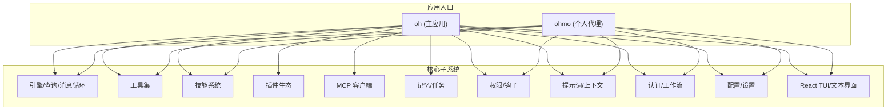
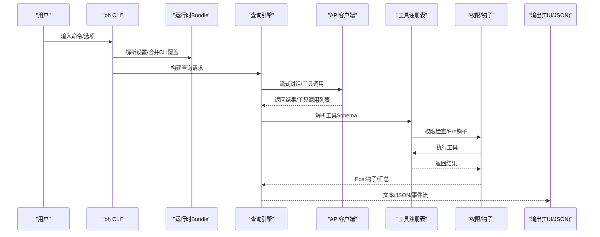
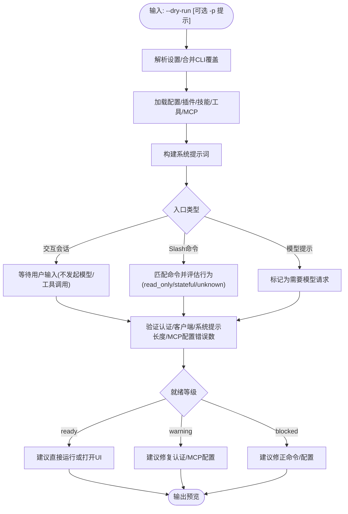
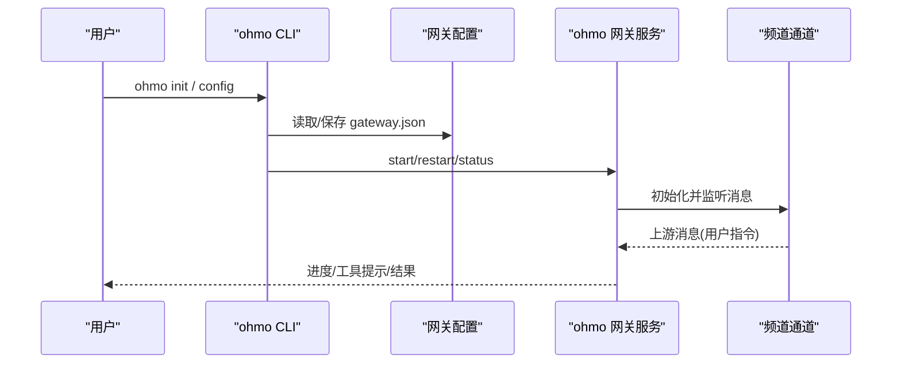
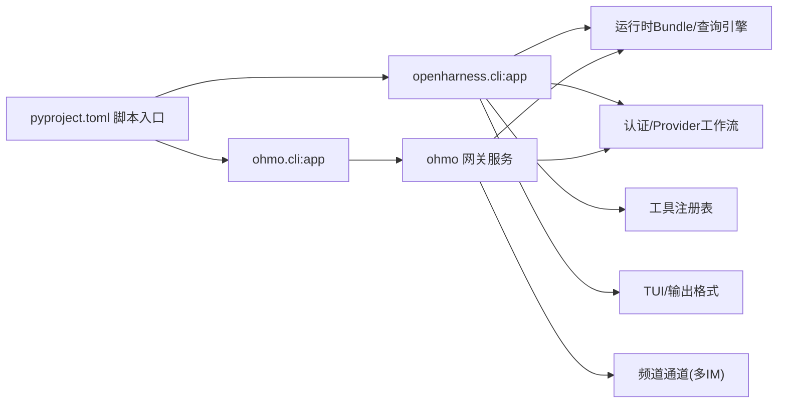

# 快速开始

<cite>
**本文引用的文件**
- [README.md](file://README.md)
- [scripts/install.sh](file://scripts/install.sh)
- [scripts/install.ps1](file://scripts/install.ps1)
- [pyproject.toml](file://pyproject.toml)
- [src/openharness/cli.py](file://src/openharness/cli.py)
- [src/openharness/__main__.py](file://src/openharness/__main__.py)
- [src/openharness/auth/manager.py](file://src/openharness/auth/manager.py)
- [src/openharness/config/settings.py](file://src/openharness/config/settings.py)
- [ohmo/cli.py](file://ohmo/cli.py)
- [ohmo/__main__.py](file://ohmo/__main__.py)
- [ohmo/gateway/service.py](file://ohmo/gateway/service.py)
</cite>

## 目录
1. [简介](#简介)
2. [项目结构](#项目结构)
3. [核心组件](#核心组件)
4. [架构总览](#架构总览)
5. [详细组件解析](#详细组件解析)
6. [依赖关系分析](#依赖关系分析)
7. [性能与可用性建议](#性能与可用性建议)
8. [故障排查指南](#故障排查指南)
9. [结论](#结论)
10. [附录：常用命令速查](#附录常用命令速查)

## 简介
OpenHarness 是一个开源的轻量级智能体基础设施，支持工具调用、技能加载、上下文记忆与多智能体协作。它提供统一的 CLI 入口“oh”，以及基于其构建的个人代理“ohmo”。通过交互式终端界面或非交互模式（管道/脚本），你可以快速完成从代码阅读、补丁编写到自动化测试与 PR 提交等任务。

本快速开始指南面向初学者，覆盖以下内容：
- 多平台安装（Linux/macOS/WSL 与 Windows）
- 配置流程（oh setup 交互式向导）
- 基本使用（交互会话、非交互输出、干运行预览）
- ohmo 个人代理的初始化与配置
- 常见使用场景与命令示例

## 项目结构
OpenHarness 采用模块化分层设计，核心子系统包括引擎、工具集、技能系统、权限控制、插件生态、MCP 协议、记忆与任务管理、UI 终端等。oh 与 ohmo 分别作为主应用与个人代理入口，共享底层能力。

图示来源
- [src/openharness/cli.py](file://src/openharness/cli.py)
- [ohmo/cli.py](file://ohmo/cli.py)

章节来源
- [README.md](file://README.md)
- [pyproject.toml](file://pyproject.toml)

## 核心组件
- CLI 入口与命令体系：oh 主应用提供交互会话、非交互输出、干运行预览、Provider/认证/MCP/插件/任务等子命令。
- 认证与 Provider 工作流：统一的认证管理器支持多种后端（Anthropic/OpenAI/Claude/Codex/Copilot 等）与工作流切换。
- 干运行预览：在不执行模型/工具的前提下，静态解析配置、权限状态、技能/工具/命令发现与 MCP 配置问题，给出“就绪”等级与后续建议。
- ohmo 个人代理：独立的工作空间与网关服务，支持 Telegram/Slack/Discord/Feishu 等渠道接入，可长期会话与远程指令。

章节来源
- [src/openharness/cli.py](file://src/openharness/cli.py)
- [src/openharness/auth/manager.py](file://src/openharness/auth/manager.py)
- [src/openharness/config/settings.py](file://src/openharness/config/settings.py)
- [ohmo/cli.py](file://ohmo/cli.py)

## 架构总览
下图展示 oh 在 CLI 层面的典型调用链路：从命令行参数解析到运行时 Bundle 的组装、查询引擎、工具执行、权限与钩子、以及 UI 输出。

图示来源
- [src/openharness/cli.py](file://src/openharness/cli.py)

章节来源
- [src/openharness/cli.py](file://src/openharness/cli.py)

## 详细组件解析

### 安装与环境准备
- Linux/macOS/WSL
  - 推荐使用一键安装脚本；也可通过 pip 安装发布包。
  - 脚本会自动创建虚拟环境、安装前端依赖、创建配置目录，并将 oh/ohmo/openharness 命令链接到本地 bin 目录，同时尝试将该路径加入 shell PATH。
- Windows
  - 支持原生安装（PowerShell）。同样会创建虚拟环境、安装依赖、配置 PATH，并在可用时提供 openh/oh/ohmo 三个入口。
  - 注意：PowerShell 中“oh”可能与内置 Out-Host 别名冲突，推荐使用“openharness”或“oh.exe”。

章节来源
- [scripts/install.sh](file://scripts/install.sh)
- [scripts/install.ps1](file://scripts/install.ps1)
- [pyproject.toml](file://pyproject.toml)

### 配置与认证（oh setup 交互式向导）
- 使用 oh setup 启动交互式向导，选择 Provider 工作流（如 Anthropic-Compatible API、OpenAI-Compatible API、Claude/Codex 订阅、Copilot 等），随后进行认证配置。
- 认证状态由统一的 AuthManager 管理，支持环境变量、文件存储、外部绑定等多种来源。
- 可通过 oh provider list/show/use 查看与切换已配置的 Provider Profile。

章节来源
- [src/openharness/cli.py](file://src/openharness/cli.py)
- [src/openharness/auth/manager.py](file://src/openharness/auth/manager.py)
- [src/openharness/config/settings.py](file://src/openharness/config/settings.py)

### 基本使用示例

#### 交互式会话
- 直接运行 oh 进入交互式终端，支持命令面板（/ 开头）、权限弹窗、会话恢复、键盘快捷键等。
- 适合日常开发、调试与探索性任务。

章节来源
- [src/openharness/cli.py](file://src/openharness/cli.py)

#### 非交互模式（管道与脚本）
- 单次提示直接输出：oh -p "解释这个代码库"
- 结构化输出用于程序消费：oh -p "列出 main.py 中的所有函数" --output-format json
- 实时事件流：oh -p "修复这个 bug" --output-format stream-json

章节来源
- [README.md](file://README.md)

#### 干运行预览（安全预览）
- oh --dry-run 预览当前会话设置、认证状态、技能/工具/命令发现、MCP 配置问题，并给出“ready/warning/blocked”的就绪等级与下一步建议。
- 可结合 -p 预览单个提示或 Slash 命令路径，便于在执行前确认行为。

图示来源
- [src/openharness/cli.py](file://src/openharness/cli.py)

章节来源
- [src/openharness/cli.py](file://src/openharness/cli.py)

### ohmo 个人代理初始化与配置
- 初始化工作空间：ohmo init
- 配置 Provider 与频道：ohmo config（交互式向导，支持 Telegram/Slack/Discord/Feishu）
- 启动网关：ohmo gateway start（前台运行/后台守护）
- 健康检查：ohmo doctor 检查工作区、Provider 就绪状态与配置文件位置

图示来源
- [ohmo/cli.py](file://ohmo/cli.py)
- [ohmo/gateway/service.py](file://ohmo/gateway/service.py)

章节来源
- [ohmo/cli.py](file://ohmo/cli.py)
- [ohmo/__main__.py](file://ohmo/__main__.py)
- [ohmo/gateway/service.py](file://ohmo/gateway/service.py)

## 依赖关系分析
- 应用入口
  - oh/openharness/openh 由 pyproject.toml 注册为脚本入口，指向 openharness.cli:app。
  - ohmo 由 pyproject.toml 注册为脚本入口，指向 ohmo.cli:app。
- 运行时与子系统
  - CLI 通过运行时 Bundle 组装查询引擎、工具注册表、权限与钩子、提示词上下文等。
  - 认证与 Provider 工作流由 AuthManager 统一管理，支持多后端与多配置文件。
  - ohmo 独立工作空间与网关服务，复用底层引擎与工具集。

图示来源
- [pyproject.toml](file://pyproject.toml)
- [src/openharness/cli.py](file://src/openharness/cli.py)
- [ohmo/cli.py](file://ohmo/cli.py)

章节来源
- [pyproject.toml](file://pyproject.toml)
- [src/openharness/cli.py](file://src/openharness/cli.py)
- [ohmo/cli.py](file://ohmo/cli.py)

## 性能与可用性建议
- 干运行预览优先：在复杂场景或生产环境，先使用 --dry-run 检查配置与入口路径，避免不必要的模型调用与工具执行。
- 选择合适的输出格式：非交互脚本中优先使用 --output-format json 或 stream-json，便于下游处理。
- 权限模式与路径规则：根据团队安全策略调整权限模式与路径规则，减少高风险操作。
- React TUI：若 Node.js 版本满足要求（>=18），可获得更丰富的终端体验；否则仍可通过纯文本模式使用。

## 故障排查指南
- 安装后命令不可用
  - 检查 PATH 是否包含安装脚本创建的 bin 目录（Linux/macOS/WSL 会在 ~/.local/bin；Windows 在用户级 PATH 的虚拟环境 Scripts 目录）。
  - 重新加载 shell 配置或重启终端。
- Windows 中“oh”冲突
  - PowerShell 中“oh”可能被 Out-Host 别名覆盖，建议使用 openharness 或 oh.exe。
- 认证失败或 Provider 未就绪
  - 使用 oh provider list 查看各 Profile 的配置状态；必要时使用 oh auth 子命令更新凭据。
- ohmo 频道无响应
  - 使用 ohmo doctor 检查工作区、配置文件与 Provider 就绪状态；确认 gateway.json 中的频道令牌与 allow_from 设置。
  - 若网关已在运行，修改配置后可使用 ohmo gateway restart 应用变更。

章节来源
- [scripts/install.sh](file://scripts/install.sh)
- [scripts/install.ps1](file://scripts/install.ps1)
- [src/openharness/auth/manager.py](file://src/openharness/auth/manager.py)
- [ohmo/cli.py](file://ohmo/cli.py)

## 结论
通过本快速开始指南，你可以在多平台上完成 OpenHarness 的安装与配置，掌握交互式与非交互模式的基本用法，并利用干运行预览提升安全性与可维护性。ohmo 个人代理则为你提供了跨频道的长期会话与远程指令能力。建议在实际项目中结合权限策略与输出格式，逐步扩展到插件、技能与多智能体协作场景。

## 附录：常用命令速查
- 安装
  - Linux/macOS/WSL：一键脚本或 pip 安装
  - Windows：PowerShell 一键脚本或 pip 安装
- 配置
  - oh setup：交互式 Provider 与认证配置
  - oh provider list/show/use：查看/切换 Provider Profile
  - oh auth：登录/登出/状态检查
- 运行
  - oh：进入交互式会话
  - oh -p "<提示>"：非交互一次性输出
  - oh -p "<提示>" --output-format json/stream-json：结构化输出
  - oh --dry-run：干运行预览
- ohmo
  - ohmo init：初始化个人工作空间
  - ohmo config：配置 Provider 与频道
  - ohmo gateway start/restart/status：启动/重启/查看网关状态
  - ohmo doctor：健康检查

章节来源
- [README.md](file://README.md)
- [src/openharness/cli.py](file://src/openharness/cli.py)
- [ohmo/cli.py](file://ohmo/cli.py)