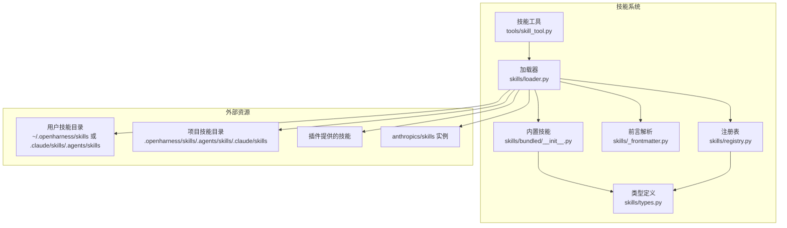
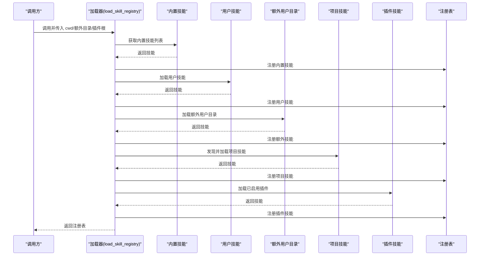
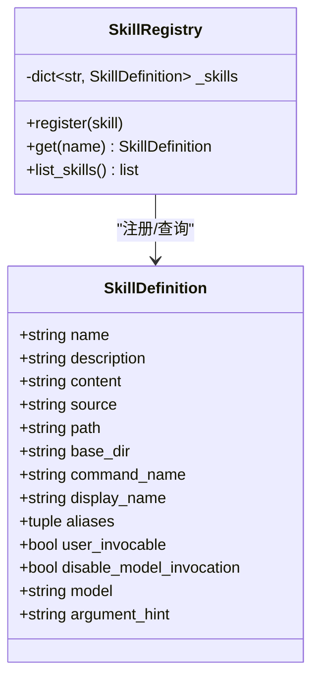
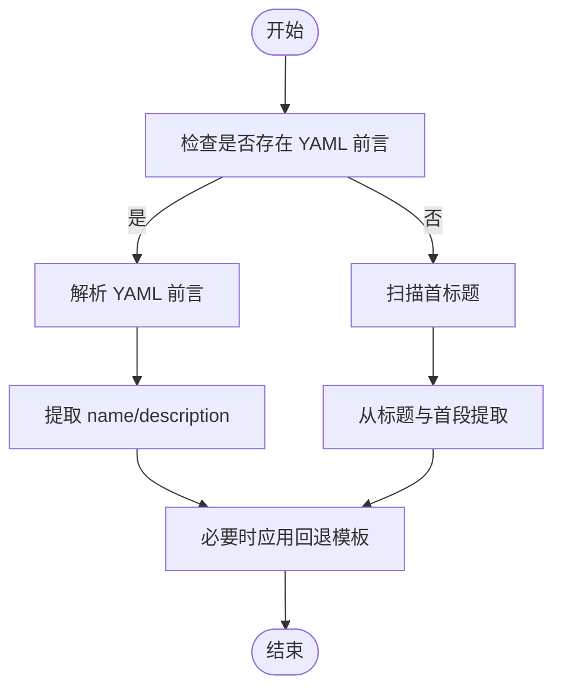
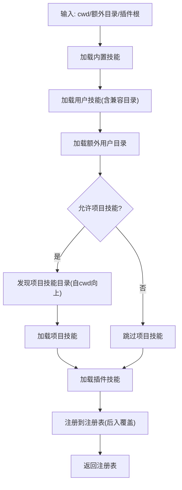
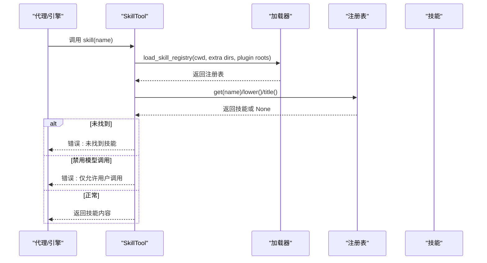
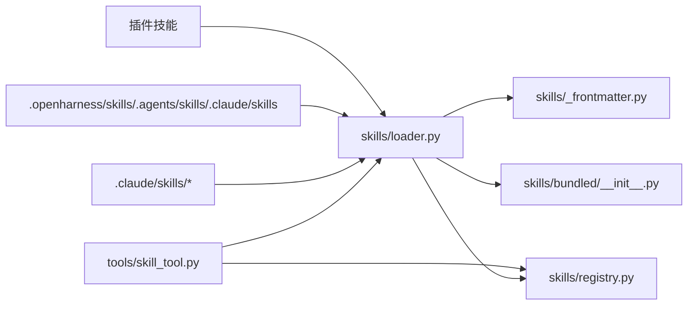

# 技能系统

<cite>
**本文引用的文件**
- [skills/__init__.py](file://src/openharness/skills/__init__.py)
- [skills/loader.py](file://src/openharness/skills/loader.py)
- [skills/registry.py](file://src/openharness/skills/registry.py)
- [skills/types.py](file://src/openharness/skills/types.py)
- [skills/_frontmatter.py](file://src/openharness/skills/_frontmatter.py)
- [skills/bundled/__init__.py](file://src/openharness/skills/bundled/__init__.py)
- [skills/bundled/content/commit.md](file://src/openharness/skills/bundled/content/commit.md)
- [skills/bundled/content/review.md](file://src/openharness/skills/bundled/content/review.md)
- [skills/bundled/content/debug.md](file://src/openharness/skills/bundled/content/debug.md)
- [skills/bundled/content/plan.md](file://src/openharness/skills/bundled/content/plan.md)
- [skills/bundled/content/test.md](file://src/openharness/skills/bundled/content/test.md)
- [skills/bundled/content/simplify.md](file://src/openharness/skills/bundled/content/simplify.md)
- [.claude/skills/harness-eval/SKILL.md](file://.claude/skills/harness-eval/SKILL.md)
- [.claude/skills/pr-merge/SKILL.md](file://.claude/skills/pr-merge/SKILL.md)
- [tools/skill_tool.py](file://src/openharness/tools/skill_tool.py)
- [scripts/test_real_skills_plugins.py](file://scripts/test_real_skills_plugins.py)
- [tests/test_hooks_skills_plugins_real.py](file://tests/test_hooks_skills_plugins_real.py)
</cite>

## 目录
1. [简介](#简介)
2. [项目结构](#项目结构)
3. [核心组件](#核心组件)
4. [架构总览](#架构总览)
5. [详细组件分析](#详细组件分析)
6. [依赖关系分析](#依赖关系分析)
7. [性能考量](#性能考量)
8. [故障排查指南](#故障排查指南)
9. [结论](#结论)
10. [附录](#附录)

## 简介
本文件系统化阐述 OpenHarness 的“技能系统”，重点解释以下方面：
- 技能作为“按需知识”的概念：技能以可执行的知识单元形式存在，按需加载并在运行时被模型或用户调用。
- 动态加载机制与生命周期管理：从内置、用户、项目到插件的多级发现与注册，支持覆盖与确定性优先级。
- 内置技能清单与使用场景：commit、review、debug、plan、test、simplify 等，结合其工作流与规则说明。
- 技能文件结构与元数据：SKILL.md 格式、前言元数据定义与工作流描述。
- 发现机制：用户级别、项目级别、插件级别的技能加载顺序与优先级。
- 开发指南：编写规范、工作流设计与最佳实践。
- 与 anthropics/skills 生态兼容性：实测加载真实技能并验证内容质量。

## 项目结构
技能系统主要由以下模块构成：
- 类型与注册表：定义技能数据结构与注册表行为。
- 前言解析器：统一解析 SKILL.md 的 YAML 前言与回退标题/段落。
- 加载器：负责从多源目录加载技能，构建注册表。
- 内置技能：打包在仓库内的基础技能集合。
- 工具：对外暴露的技能读取工具，供引擎或代理调用。
- 示例技能：来自 anthropics/skills 的真实技能样例，用于兼容性测试。

图表来源
- [skills/loader.py:42-75](file://src/openharness/skills/loader.py#L42-L75)
- [skills/bundled/__init__.py:18-43](file://src/openharness/skills/bundled/__init__.py#L18-L43)
- [skills/registry.py:8-29](file://src/openharness/skills/registry.py#L8-L29)
- [skills/_frontmatter.py:34-82](file://src/openharness/skills/_frontmatter.py#L34-L82)
- [tools/skill_tool.py:28-43](file://src/openharness/tools/skill_tool.py#L28-L43)

章节来源
- [skills/__init__.py:11-44](file://src/openharness/skills/__init__.py#L11-L44)
- [skills/loader.py:42-75](file://src/openharness/skills/loader.py#L42-L75)
- [skills/bundled/__init__.py:18-43](file://src/openharness/skills/bundled/__init__.py#L18-L43)
- [skills/registry.py:8-29](file://src/openharness/skills/registry.py#L8-L29)
- [skills/_frontmatter.py:34-82](file://src/openharness/skills/_frontmatter.py#L34-L82)
- [tools/skill_tool.py:17-43](file://src/openharness/tools/skill_tool.py#L17-L43)

## 核心组件
- 技能定义（SkillDefinition）：包含名称、描述、内容、来源、路径、命令名、显示名、别名、是否允许用户调用、是否禁用模型调用、目标模型、参数提示等字段。
- 注册表（SkillRegistry）：以名称/命令名/显示名/别名为键存储技能，支持按名检索与去重排序。
- 前言解析（parse_skill_metadata/frontmatter 解析器）：解析 YAML 前言，回退到标题与首段，确保名称与描述可用。
- 加载器（load_skill_registry）：聚合内置、用户、项目与插件技能，按优先级注册；支持额外目录与插件根目录扩展。
- 技能工具（SkillTool）：根据名称查询技能内容，处理禁用模型调用的策略。

章节来源
- [skills/types.py:8-25](file://src/openharness/skills/types.py#L8-L25)
- [skills/registry.py:8-29](file://src/openharness/skills/registry.py#L8-L29)
- [skills/_frontmatter.py:34-97](file://src/openharness/skills/_frontmatter.py#L34-L97)
- [skills/loader.py:42-75](file://src/openharness/skills/loader.py#L42-L75)
- [tools/skill_tool.py:17-43](file://src/openharness/tools/skill_tool.py#L17-L43)

## 架构总览
技能系统采用“多源发现 + 统一注册”的架构。加载流程如下：
- 首先加载内置技能；
- 然后加载用户技能（含兼容目录）；
- 可选加载额外用户目录；
- 在启用项目技能的前提下，向上遍历目录树发现项目技能目录并加载；
- 最后加载已启用插件提供的技能；
- 每个技能通过注册表进行去重与覆盖，后续层级可覆盖更广泛的技能。

图表来源
- [skills/loader.py:42-75](file://src/openharness/skills/loader.py#L42-L75)
- [skills/bundled/__init__.py:18-43](file://src/openharness/skills/bundled/__init__.py#L18-L43)
- [skills/registry.py:14-18](file://src/openharness/skills/registry.py#L14-L18)

章节来源
- [skills/loader.py:42-75](file://src/openharness/skills/loader.py#L42-L75)

## 详细组件分析

### 技能定义与注册表
- SkillDefinition 字段覆盖了技能的标识、来源、可调用性与元信息，便于工具层与引擎层统一消费。
- 注册表以多种键名映射同一技能，保证大小写不敏感与别名命中；同时提供去重与排序能力。

图表来源
- [skills/types.py:8-25](file://src/openharness/skills/types.py#L8-L25)
- [skills/registry.py:8-29](file://src/openharness/skills/registry.py#L8-L29)

章节来源
- [skills/types.py:8-25](file://src/openharness/skills/types.py#L8-L25)
- [skills/registry.py:8-29](file://src/openharness/skills/registry.py#L8-L29)

### 前言解析与元数据提取
- 支持 YAML 前言（三短横线分隔），并安全解析块标量、引号值等；
- 回退逻辑：若无有效前言，则从首标题与首段提取名称与描述；
- 提供布尔与字符串类型的前言解析辅助函数，确保配置项的容错与默认值。

图表来源
- [skills/_frontmatter.py:34-82](file://src/openharness/skills/_frontmatter.py#L34-L82)

章节来源
- [skills/_frontmatter.py:13-31](file://src/openharness/skills/_frontmatter.py#L13-L31)
- [skills/_frontmatter.py:34-97](file://src/openharness/skills/_frontmatter.py#L34-L97)

### 加载器与发现机制
- 用户级别：默认用户技能目录与兼容目录（.claude/skills、.agents/skills）。
- 项目级别：从 cwd 向上遍历至 Git 根或家目录，收集相对路径下的技能目录，按层级从低到高排列，后出现的覆盖更广的技能。
- 插件级别：加载已启用插件，并注册其提供的技能。
- 其他扩展：支持额外用户目录与插件根目录参数。

图表来源
- [skills/loader.py:42-75](file://src/openharness/skills/loader.py#L42-L75)
- [skills/loader.py:83-123](file://src/openharness/skills/loader.py#L83-L123)
- [skills/loader.py:153-206](file://src/openharness/skills/loader.py#L153-L206)

章节来源
- [skills/loader.py:30-34](file://src/openharness/skills/loader.py#L30-L34)
- [skills/loader.py:37-39](file://src/openharness/skills/loader.py#L37-L39)
- [skills/loader.py:42-75](file://src/openharness/skills/loader.py#L42-L75)
- [skills/loader.py:83-123](file://src/openharness/skills/loader.py#L83-L123)
- [skills/loader.py:153-206](file://src/openharness/skills/loader.py#L153-L206)

### 内置技能与使用场景
内置技能位于 bundled/content 下，每个技能以 SKILL.md 形式提供工作流与规则。典型技能包括：
- commit：创建干净、结构化的提交，包含状态检查、分类、消息撰写、分阶段提交与规则约束。
- review：对代码进行缺陷、安全、性能、测试与风格审查，强调具体反馈与严重性分级。
- debug：系统化诊断与修复，遵循重现、读取错误、定位、假设、验证、修复、测试的闭环。
- plan：在编码前设计实现计划，强调需求理解、探索现有模式、设计步骤与验证方案。
- test：编写与运行测试，遵循框架一致性、独立性、确定性与快速性原则。
- simplify：重构简化代码，减少复杂度与冗余，保持行为不变。

章节来源
- [skills/bundled/content/commit.md:1-26](file://src/openharness/skills/bundled/content/commit.md#L1-L26)
- [skills/bundled/content/review.md:1-27](file://src/openharness/skills/bundled/content/review.md#L1-L27)
- [skills/bundled/content/debug.md:1-26](file://src/openharness/skills/bundled/content/debug.md#L1-L26)
- [skills/bundled/content/plan.md:1-35](file://src/openharness/skills/bundled/content/plan.md#L1-L35)
- [skills/bundled/content/test.md:1-32](file://src/openharness/skills/bundled/content/test.md#L1-L32)
- [skills/bundled/content/simplify.md:1-27](file://src/openharness/skills/bundled/content/simplify.md#L1-L27)

### 技能工具与调用流程
- SkillTool 提供按名称读取技能内容的能力；
- 在上下文中加载注册表，支持 cwd、额外技能目录与插件根目录；
- 若技能禁用模型调用，则仅允许用户通过命令方式触发；
- 返回技能内容或错误信息。

图表来源
- [tools/skill_tool.py:28-43](file://src/openharness/tools/skill_tool.py#L28-L43)
- [skills/loader.py:42-75](file://src/openharness/skills/loader.py#L42-L75)

章节来源
- [tools/skill_tool.py:17-43](file://src/openharness/tools/skill_tool.py#L17-L43)

### 与 anthropics/skills 生态兼容性
- 通过测试脚本与集成测试验证：能够安装并加载来自 anthropics/skills 的真实技能，校验内容长度与描述完整性，并在系统提示中可见。
- 测试覆盖包括：复制真实技能、加载验证、内容质量检查、工具调用与系统提示集成。

章节来源
- [scripts/test_real_skills_plugins.py:49-108](file://scripts/test_real_skills_plugins.py#L49-L108)
- [scripts/test_real_skills_plugins.py:111-131](file://scripts/test_real_skills_plugins.py#L111-L131)
- [tests/test_hooks_skills_plugins_real.py:537-567](file://tests/test_hooks_skills_plugins_real.py#L537-L567)

## 依赖关系分析
- 模块内聚与耦合：
  - 加载器依赖前言解析与内置技能，同时与注册表交互；
  - 注册表依赖类型定义；
  - 技能工具依赖加载器与注册表；
  - 外部资源（用户/项目/插件/真实技能）通过加载器注入。
- 关键依赖链：
  - skills/loader.py → skills/_frontmatter.py, skills/bundled/__init__.py, skills/registry.py
  - tools/skill_tool.py → skills/loader.py, skills/registry.py
  - .claude/skills/* → skills/loader.py（通过用户目录）

图表来源
- [skills/loader.py:42-75](file://src/openharness/skills/loader.py#L42-L75)
- [skills/bundled/__init__.py:18-43](file://src/openharness/skills/bundled/__init__.py#L18-L43)
- [skills/_frontmatter.py:34-82](file://src/openharness/skills/_frontmatter.py#L34-L82)
- [skills/registry.py:8-29](file://src/openharness/skills/registry.py#L8-L29)
- [tools/skill_tool.py:28-43](file://src/openharness/tools/skill_tool.py#L28-L43)

章节来源
- [skills/loader.py:42-75](file://src/openharness/skills/loader.py#L42-L75)
- [tools/skill_tool.py:28-43](file://src/openharness/tools/skill_tool.py#L28-L43)

## 性能考量
- 加载策略：按层级顺序加载，后入覆盖前入，避免重复解析与注册，提升确定性与性能。
- 目录扫描：对用户/项目目录进行一次遍历与缓存，避免重复 IO。
- 前言解析：使用安全解析与最小回退逻辑，减少异常分支成本。
- 注册表查询：字典查找 O(1)，适合高频调用场景。

## 故障排查指南
- 技能未找到：
  - 检查名称大小写与别名是否正确；
  - 确认技能来源（内置/用户/项目/插件）是否启用；
  - 使用 list_skills() 查看已加载技能列表。
- 禁用模型调用：
  - 若技能设置为仅用户可调用，工具会返回错误提示；
  - 需要通过命令方式触发该技能。
- 项目技能未加载：
  - 检查 settings 中是否允许项目技能；
  - 确认项目技能目录相对路径合法且存在；
  - 确认目录层级顺序导致的覆盖关系。
- 前言解析失败：
  - 检查 YAML 语法与缩进；
  - 确保 name/description 至少有一处可解析。

章节来源
- [tools/skill_tool.py:34-42](file://src/openharness/tools/skill_tool.py#L34-L42)
- [skills/loader.py:58-65](file://src/openharness/skills/loader.py#L58-L65)
- [skills/_frontmatter.py:66-67](file://src/openharness/skills/_frontmatter.py#L66-L67)

## 结论
OpenHarness 的技能系统以“按需知识”为核心理念，通过统一的前言解析与注册表机制，实现了从内置、用户、项目到插件的多级动态加载与覆盖。内置技能提供了通用工作流与规则，真实生态技能验证了系统的兼容性与扩展能力。建议在实际使用中遵循统一的 SKILL.md 编写规范，合理设计工作流与元数据，以获得稳定、可维护的技能体系。

## 附录

### 技能文件结构与元数据
- 文件位置：每个技能以独立目录下的 SKILL.md 表达，目录名即命令名。
- 前言元数据（示例字段）：
  - name：技能名称（优先取自前言）
  - description：技能描述（优先取自前言）
  - user-invocable：是否允许用户直接调用（默认 true）
  - disable-model-invocation：是否禁止模型自动调用（默认 false）
  - model：指定使用的模型名称（可选）
  - argument-hint：参数提示（可选）
- 回退策略：若无有效前言，回退到首标题与首段；若仍无描述，使用模板生成。

章节来源
- [skills/_frontmatter.py:34-82](file://src/openharness/skills/_frontmatter.py#L34-L82)
- [skills/loader.py:209-229](file://src/openharness/skills/loader.py#L209-L229)

### 内置技能功能速览
- commit：提交工作流与规则
- review：代码审查工作流与规则
- debug：调试诊断工作流与规则
- plan：设计规划工作流与规则
- test：测试编写与运行工作流与规则
- simplify：简化重构工作流与规则

章节来源
- [skills/bundled/content/commit.md:1-26](file://src/openharness/skills/bundled/content/commit.md#L1-L26)
- [skills/bundled/content/review.md:1-27](file://src/openharness/skills/bundled/content/review.md#L1-L27)
- [skills/bundled/content/debug.md:1-26](file://src/openharness/skills/bundled/content/debug.md#L1-L26)
- [skills/bundled/content/plan.md:1-35](file://src/openharness/skills/bundled/content/plan.md#L1-L35)
- [skills/bundled/content/test.md:1-32](file://src/openharness/skills/bundled/content/test.md#L1-L32)
- [skills/bundled/content/simplify.md:1-27](file://src/openharness/skills/bundled/content/simplify.md#L1-L27)

### 发现机制与优先级
- 用户级别：默认用户目录 + 兼容目录（.claude/skills、.agents/skills）
- 项目级别：从 cwd 向上遍历，收集相对路径下的技能目录，层级越近优先级越高
- 插件级别：加载已启用插件并注册其技能
- 注册覆盖：后注册覆盖先前同名技能，确保局部覆盖全局

章节来源
- [skills/loader.py:30-34](file://src/openharness/skills/loader.py#L30-L34)
- [skills/loader.py:37-39](file://src/openharness/skills/loader.py#L37-L39)
- [skills/loader.py:58-65](file://src/openharness/skills/loader.py#L58-L65)
- [skills/loader.py:83-123](file://src/openharness/skills/loader.py#L83-L123)
- [skills/loader.py:153-206](file://src/openharness/skills/loader.py#L153-L206)

### 开发指南与最佳实践
- 编写规范：
  - 使用清晰的标题与分节组织工作流与规则；
  - 在前言中提供准确的 name 与 description；
  - 必要时设置 user-invocable/disable-model-invocation/model/argument-hint。
- 工作流设计：
  - 明确“何时使用”、“工作流步骤”、“规则约束”；
  - 保持步骤可执行、规则可验证。
- 最佳实践：
  - 将技能拆分为小而专的单元，便于组合与复用；
  - 优先使用项目/插件目录承载团队定制技能，保持仓库内聚；
  - 定期验证技能内容长度与描述质量，确保实用性。

章节来源
- [skills/_frontmatter.py:34-82](file://src/openharness/skills/_frontmatter.py#L34-L82)
- [skills/loader.py:209-229](file://src/openharness/skills/loader.py#L209-L229)