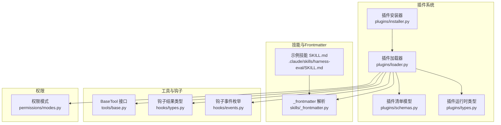
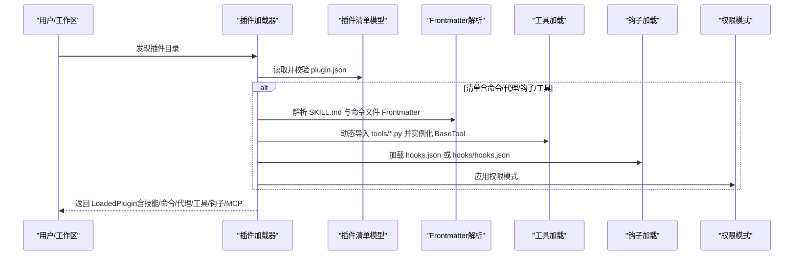
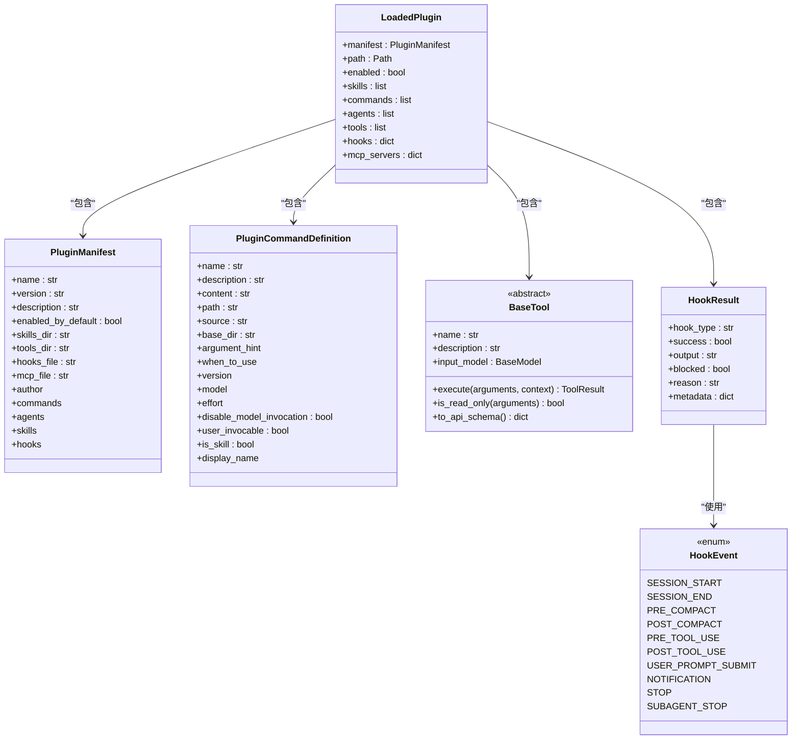

# 兼容性和迁移

<cite>
**本文引用的文件**
- [src/openharness/plugins/schemas.py](file://src/openharness/plugins/schemas.py)
- [src/openharness/plugins/types.py](file://src/openharness/plugins/types.py)
- [src/openharness/plugins/loader.py](file://src/openharness/plugins/loader.py)
- [src/openharness/plugins/installer.py](file://src/openharness/plugins/installer.py)
- [src/openharness/skills/_frontmatter.py](file://src/openharness/skills/_frontmatter.py)
- [src/openharness/tools/base.py](file://src/openharness/tools/base.py)
- [src/openharness/hooks/types.py](file://src/openharness/hooks/types.py)
- [src/openharness/hooks/events.py](file://src/openharness/hooks/events.py)
- [src/openharness/permissions/modes.py](file://src/openharness/permissions/modes.py)
- [.claude/skills/harness-eval/SKILL.md](file://.claude/skills/harness-eval/SKILL.md)
- [.claude/skills/pr-merge/SKILL.md](file://.claude/skills/pr-merge/SKILL.md)
- [.claude/skills/harness-eval/references/feature-matrix.md](file://.claude/skills/harness-eval/references/feature-matrix.md)
- [.claude/skills/harness-eval/references/test-patterns.md](file://.claude/skills/harness-eval/references/test-patterns.md)
</cite>

## 目录
1. [简介](#简介)
2. [项目结构](#项目结构)
3. [核心组件](#核心组件)
4. [架构总览](#架构总览)
5. [详细组件分析](#详细组件分析)
6. [依赖分析](#依赖分析)
7. [性能考量](#性能考量)
8. [故障排查指南](#故障排查指南)
9. [结论](#结论)
10. [附录](#附录)

## 简介
本文件面向从Claude Code插件生态迁移到OpenHarness插件系统的用户与维护者，系统阐述兼容性设计与迁移路径。重点覆盖以下方面：
- SKILL.md文件格式的兼容解析与字段映射
- 命令文件布局与命名空间映射
- 权限模式与钩子事件的兼容性
- 插件清单文件（plugin.json）的字段映射、默认值与向后兼容策略
- 从Claude Code插件到OpenHarness插件的迁移步骤与注意事项
- Frontmatter元数据的兼容处理（字段名转换、数据类型映射、缺失默认值）
- 插件工具的兼容性（BaseTool接口要求与工具方法适配）
- 插件钩子的兼容性（事件类型映射与钩子函数适配）
- 迁移自动化工具与脚本建议
- 兼容性测试方法与工具
- 已知限制与解决方案

## 项目结构
OpenHarness对Claude Code插件生态的兼容主要体现在插件发现、清单解析、技能与命令加载、工具与钩子装配等环节。下图展示与兼容性相关的核心模块及其交互。

**图表来源**
- [src/openharness/plugins/loader.py:1-731](file://src/openharness/plugins/loader.py#L1-L731)
- [src/openharness/plugins/schemas.py:1-25](file://src/openharness/plugins/schemas.py#L1-L25)
- [src/openharness/plugins/types.py:1-60](file://src/openharness/plugins/types.py#L1-L60)
- [src/openharness/plugins/installer.py:1-40](file://src/openharness/plugins/installer.py#L1-L40)
- [src/openharness/skills/_frontmatter.py:1-98](file://src/openharness/skills/_frontmatter.py#L1-L98)
- [src/openharness/tools/base.py:1-81](file://src/openharness/tools/base.py#L1-L81)
- [src/openharness/hooks/types.py:1-39](file://src/openharness/hooks/types.py#L1-L39)
- [src/openharness/hooks/events.py:1-21](file://src/openharness/hooks/events.py#L1-L21)
- [src/openharness/permissions/modes.py:1-14](file://src/openharness/permissions/modes.py#L1-L14)
- [.claude/skills/harness-eval/SKILL.md:1-194](file://.claude/skills/harness-eval/SKILL.md#L1-L194)

**章节来源**
- [src/openharness/plugins/loader.py:1-731](file://src/openharness/plugins/loader.py#L1-L731)
- [src/openharness/plugins/schemas.py:1-25](file://src/openharness/plugins/schemas.py#L1-L25)
- [src/openharness/plugins/types.py:1-60](file://src/openharness/plugins/types.py#L1-L60)
- [src/openharness/plugins/installer.py:1-40](file://src/openharness/plugins/installer.py#L1-L40)
- [src/openharness/skills/_frontmatter.py:1-98](file://src/openharness/skills/_frontmatter.py#L1-L98)
- [src/openharness/tools/base.py:1-81](file://src/openharness/tools/base.py#L1-L81)
- [src/openharness/hooks/types.py:1-39](file://src/openharness/hooks/types.py#L1-L39)
- [src/openharness/hooks/events.py:1-21](file://src/openharness/hooks/events.py#L1-L21)
- [src/openharness/permissions/modes.py:1-14](file://src/openharness/permissions/modes.py#L1-L14)
- [.claude/skills/harness-eval/SKILL.md:1-194](file://.claude/skills/harness-eval/SKILL.md#L1-L194)

## 核心组件
- 插件清单模型：定义plugin.json的字段与默认值，支持扩展字段（作者、命令、代理、技能、钩子等），用于统一识别与加载。
- 插件运行时类型：封装已加载插件的清单、路径、启用状态及贡献的艺术品（技能、命令、代理、工具、钩子、MCP服务器）。
- 插件加载器：负责发现与加载插件，解析Frontmatter、命令文件布局、代理与钩子配置，并实例化工具类。
- 技能Frontmatter解析：兼容SKILL.md的YAML Frontmatter解析，提供名称与描述提取、回退策略与错误容忍。
- 工具抽象：BaseTool接口定义了工具执行、只读判定与API Schema导出，确保与外部系统（如Anthropic Messages API）的兼容。
- 钩子类型与事件：定义钩子执行结果聚合、事件枚举，支撑插件钩子的兼容映射。
- 权限模式：提供默认、计划、全量自动三种权限模式，便于迁移后安全控制。

**章节来源**
- [src/openharness/plugins/schemas.py:8-25](file://src/openharness/plugins/schemas.py#L8-L25)
- [src/openharness/plugins/types.py:18-60](file://src/openharness/plugins/types.py#L18-L60)
- [src/openharness/plugins/loader.py:107-162](file://src/openharness/plugins/loader.py#L107-L162)
- [src/openharness/skills/_frontmatter.py:34-98](file://src/openharness/skills/_frontmatter.py#L34-L98)
- [src/openharness/tools/base.py:35-81](file://src/openharness/tools/base.py#L35-L81)
- [src/openharness/hooks/types.py:9-39](file://src/openharness/hooks/types.py#L9-L39)
- [src/openharness/hooks/events.py:8-21](file://src/openharness/hooks/events.py#L8-L21)
- [src/openharness/permissions/modes.py:8-14](file://src/openharness/permissions/modes.py#L8-L14)

## 架构总览
下图展示从Claude Code插件到OpenHarness插件的兼容性架构：通过统一的插件清单与加载流程，将SKILL.md、命令文件、代理与钩子等资源映射到OpenHarness的数据结构中。

**图表来源**
- [src/openharness/plugins/loader.py:107-162](file://src/openharness/plugins/loader.py#L107-L162)
- [src/openharness/plugins/schemas.py:8-25](file://src/openharness/plugins/schemas.py#L8-L25)
- [src/openharness/skills/_frontmatter.py:34-98](file://src/openharness/skills/_frontmatter.py#L34-L98)
- [src/openharness/tools/base.py:691-731](file://src/openharness/tools/base.py#L691-L731)
- [src/openharness/hooks/events.py:8-21](file://src/openharness/hooks/events.py#L8-L21)
- [src/openharness/permissions/modes.py:8-14](file://src/openharness/permissions/modes.py#L8-L14)

## 详细组件分析

### 插件清单与兼容性字段映射
- 字段映射
  - name/version/description/enabled_by_default：与Claude Code一致，提供默认值以保证向后兼容。
  - skills_dir/tools_dir/hooks_file/mcp_file：默认目录/文件名与Claude Code生态保持一致，便于直接迁移。
  - 扩展字段：author/commands/agents/skills/hooks 支持多种声明方式（字符串、列表、字典），增强灵活性。
- 默认值与兼容性
  - 未显式提供时采用合理默认（如 enabled_by_default=True、默认目录名等），避免迁移中断。
  - commands/agents/skills/hooks 支持字符串或结构化对象，兼容不同风格的清单写法。
- 向后兼容性
  - 兼容 .claude-plugin/plugin.json 与 plugin.json 双位置发现；兼容 hooks.json 与 hooks/hooks.json 结构化布局。

**章节来源**
- [src/openharness/plugins/schemas.py:8-25](file://src/openharness/plugins/schemas.py#L8-L25)
- [src/openharness/plugins/loader.py:50-58](file://src/openharness/plugins/loader.py#L50-L58)
- [src/openharness/plugins/loader.py:126-162](file://src/openharness/plugins/loader.py#L126-L162)
- [src/openharness/plugins/loader.py:621-677](file://src/openharness/plugins/loader.py#L621-L677)

### SKILL.md与Frontmatter兼容性
- 解析策略
  - 优先解析 YAML Frontmatter（三短横线分隔），支持折叠块、字面量块、引号等标准语法。
  - 当无可用Frontmatter时，回退到“标题 + 首个正文段落”，最终回退到模板。
- 字段映射与默认值
  - name/description：从Frontmatter提取，缺失时使用回退逻辑。
  - user_invocable/disable_model_invocation/model/argument_hint 等字段作为技能元信息参与技能定义。
- 示例参考
  - 示例技能 SKILL.md 展示了标准的Frontmatter结构与内容组织方式，可直接作为迁移模板。

**章节来源**
- [src/openharness/skills/_frontmatter.py:34-98](file://src/openharness/skills/_frontmatter.py#L34-L98)
- [.claude/skills/harness-eval/SKILL.md:1-194](file://.claude/skills/harness-eval/SKILL.md#L1-L194)
- [.claude/skills/pr-merge/SKILL.md:1-100](file://.claude/skills/pr-merge/SKILL.md#L1-L100)

### 命令文件布局与命名空间映射
- 文件遍历与去重
  - 按目录深度遍历，遇到包含 SKILL.md 的子树时停止递归，避免重复扫描。
  - 对同一目录内的多个文件进行去重与排序，优先选择 SKILL.md。
- 命令命名规则
  - 基于相对路径生成命名空间，形如 plugin:ns:name，若无命名空间则为 plugin:name。
  - 若文件名为 SKILL.md，则标记为技能命令（is_skill=True）。
- 元数据覆盖
  - 支持在清单中对命令的描述、参数提示、模型等进行覆盖，提升灵活性。

**章节来源**
- [src/openharness/plugins/loader.py:199-280](file://src/openharness/plugins/loader.py#L199-L280)
- [src/openharness/plugins/loader.py:220-250](file://src/openharness/plugins/loader.py#L220-L250)
- [src/openharness/plugins/loader.py:320-391](file://src/openharness/plugins/loader.py#L320-L391)
- [src/openharness/plugins/loader.py:393-477](file://src/openharness/plugins/loader.py#L393-L477)

### 权限模型与迁移注意
- 权限模式
  - 提供 default、plan、full_auto 三种模式，满足不同安全与自动化需求。
- 迁移建议
  - 从Claude Code迁移时，建议将默认权限模式设为 default 或 plan，逐步过渡到 full_auto。
  - 在插件清单中明确声明所需权限（如 required_mcp_servers、permissions 列表），确保运行期可控。

**章节来源**
- [src/openharness/permissions/modes.py:8-14](file://src/openharness/permissions/modes.py#L8-L14)
- [src/openharness/plugins/loader.py:517-618](file://src/openharness/plugins/loader.py#L517-L618)

### 插件工具的兼容性（BaseTool）
- 接口要求
  - 必须实现 execute(arguments, context) 异步方法；可选覆盖 is_read_only 以声明只读语义。
  - to_api_schema 提供标准化的输入Schema，便于与外部API对接。
- 实例化与注册
  - 加载器动态导入 tools/*.py 中的类，筛选继承自 BaseTool 的具体实现并实例化。
- 迁移要点
  - 工具类需具备 name 与 description 字段；输入模型应使用 Pydantic BaseModel。
  - 如需与Claude Code工具行为一致，保持 execute 的幂等性与错误返回的一致性。

**章节来源**
- [src/openharness/tools/base.py:35-81](file://src/openharness/tools/base.py#L35-L81)
- [src/openharness/plugins/loader.py:691-731](file://src/openharness/plugins/loader.py#L691-L731)

### 插件钩子的兼容性（事件与适配）
- 事件类型
  - 支持 session_start/session_end/pre_compact/post_compact/pre_tool_use/post_tool_use/user_prompt_submit/notification/stop/subagent_stop 等事件。
- 钩子定义与加载
  - 支持 hooks.json（扁平）与 hooks/hooks.json（结构化）两种格式。
  - 结构化格式允许使用 ${CLAUDE_PLUGIN_ROOT} 占位符替换为插件根目录，便于跨平台迁移。
- 迁移建议
  - 将Claude Code中的钩子类型映射到对应事件；确保命令匹配器（matcher）与超时设置合理。
  - 使用 HookExecutor 组织钩子执行上下文，保证阻断与原因传播。

**章节来源**
- [src/openharness/hooks/events.py:8-21](file://src/openharness/hooks/events.py#L8-L21)
- [src/openharness/hooks/types.py:9-39](file://src/openharness/hooks/types.py#L9-L39)
- [src/openharness/plugins/loader.py:621-677](file://src/openharness/plugins/loader.py#L621-L677)

### 从Claude Code插件迁移到OpenHarness的步骤与注意事项
- 步骤概览
  1. 准备工作区：确认 .claude/skills 与命令/代理/钩子目录结构清晰。
  2. 调整清单：将 plugin.json 放置在插件根目录或 .claude-plugin/plugin.json；确保 name、version、description 等字段齐全。
  3. Frontmatter规范化：SKILL.md 使用标准 YAML Frontmatter；命令文件使用 Frontmatter 提供描述、参数提示、模型等元信息。
  4. 工具迁移：将工具类改为继承 BaseTool，实现 execute 与输入模型；确保工具可被 tools/*.py 自动发现。
  5. 钩子迁移：将 hooks.json 或 hooks/hooks.json 转换为OpenHarness支持的格式；必要时使用 ${CLAUDE_PLUGIN_ROOT} 占位符。
  6. 权限与安全：根据需要调整权限模式与所需权限声明。
  7. 安装与验证：使用安装器或手动复制到用户插件目录；启动系统验证技能、命令、工具与钩子正常工作。
- 注意事项
  - 保持命令命名唯一且遵循 plugin:ns:name 规范。
  - 工具类需可实例化且不抛异常；否则会被忽略。
  - 钩子命令需在运行环境中可执行，避免路径与权限问题。

**章节来源**
- [src/openharness/plugins/installer.py:23-40](file://src/openharness/plugins/installer.py#L23-L40)
- [src/openharness/plugins/loader.py:107-162](file://src/openharness/plugins/loader.py#L107-L162)
- [src/openharness/skills/_frontmatter.py:34-98](file://src/openharness/skills/_frontmatter.py#L34-L98)
- [src/openharness/tools/base.py:35-81](file://src/openharness/tools/base.py#L35-L81)
- [src/openharness/hooks/events.py:8-21](file://src/openharness/hooks/events.py#L8-L21)

### 兼容性测试方法与工具
- 测试矩阵
  - 参考 feature-matrix.md 的测试条目，覆盖引擎、Swarm、钩子、技能、插件、内存、会话、配置与提供商兼容性。
- 测试模式
  - 参考 test-patterns.md 中的代码模板，快速搭建 Anthropic/OpenAI 引擎、收集事件、并发队友、会话保存与恢复等场景。
- 建议流程
  - 使用真实API与长轮次任务验证端到端链路。
  - 对钩子阻断与自适应行为进行回归测试。
  - 对插件提供的技能与工具进行集成测试。

**章节来源**
- [.claude/skills/harness-eval/references/feature-matrix.md:1-48](file://.claude/skills/harness-eval/references/feature-matrix.md#L1-L48)
- [.claude/skills/harness-eval/references/test-patterns.md:1-151](file://.claude/skills/harness-eval/references/test-patterns.md#L1-L151)

## 依赖分析
下图展示插件加载器与其依赖的关键类型之间的关系，体现兼容性设计的耦合与内聚。

**图表来源**
- [src/openharness/plugins/schemas.py:8-25](file://src/openharness/plugins/schemas.py#L8-L25)
- [src/openharness/plugins/types.py:18-60](file://src/openharness/plugins/types.py#L18-L60)
- [src/openharness/tools/base.py:35-81](file://src/openharness/tools/base.py#L35-L81)
- [src/openharness/hooks/types.py:9-39](file://src/openharness/hooks/types.py#L9-L39)
- [src/openharness/hooks/events.py:8-21](file://src/openharness/hooks/events.py#L8-L21)

**章节来源**
- [src/openharness/plugins/schemas.py:8-25](file://src/openharness/plugins/schemas.py#L8-L25)
- [src/openharness/plugins/types.py:18-60](file://src/openharness/plugins/types.py#L18-L60)
- [src/openharness/tools/base.py:35-81](file://src/openharness/tools/base.py#L35-L81)
- [src/openharness/hooks/types.py:9-39](file://src/openharness/hooks/types.py#L9-L39)
- [src/openharness/hooks/events.py:8-21](file://src/openharness/hooks/events.py#L8-L21)

## 性能考量
- 文件扫描与解析
  - 命令文件遍历采用按目录深度优先与遇到 SKILL.md 停止递归的策略，减少不必要的IO。
  - Frontmatter解析失败时记录调试日志但不中断整体加载流程，提高鲁棒性。
- 工具加载
  - 动态导入工具模块时捕获异常并跳过不可用实现，避免影响其他工具的加载。
- 钩子执行
  - 钩子结果聚合支持快速判断是否阻断，便于早期退出与错误传播。

[本节为通用指导，无需特定文件来源]

## 故障排查指南
- 插件未被发现
  - 检查 plugin.json 是否位于插件根目录或 .claude-plugin/plugin.json。
  - 确认清单字段完整且 enabled_by_default 设置合理。
- 技能/命令未加载
  - 确认 SKILL.md Frontmatter 正确；检查命令文件是否位于 commands 目录或清单声明的路径。
  - 若使用结构化钩子，请确认 hooks/hooks.json 格式正确。
- 工具无法实例化
  - 确保工具类继承 BaseTool 且具备 name/description；输入模型符合 Pydantic 规范。
- 钩子不生效
  - 检查事件类型是否匹配；确认命令匹配器与超时设置；验证命令可执行且路径正确。
- 权限相关问题
  - 根据实际需求调整权限模式；在清单中声明所需权限与MCP服务器。

**章节来源**
- [src/openharness/plugins/loader.py:50-58](file://src/openharness/plugins/loader.py#L50-L58)
- [src/openharness/plugins/loader.py:251-307](file://src/openharness/plugins/loader.py#L251-L307)
- [src/openharness/plugins/loader.py:320-391](file://src/openharness/plugins/loader.py#L320-L391)
- [src/openharness/tools/base.py:35-81](file://src/openharness/tools/base.py#L35-L81)
- [src/openharness/hooks/events.py:8-21](file://src/openharness/hooks/events.py#L8-L21)

## 结论
OpenHarness在设计上充分兼容Claude Code插件生态，通过统一的插件清单、Frontmatter解析、命令命名空间、工具接口与钩子事件体系，实现了从清单字段到文件布局再到运行时装配的无缝迁移。配合权限模式与测试矩阵，可确保迁移后的插件在新系统中稳定运行。建议在迁移过程中严格遵循字段映射与默认值策略，并利用测试模板与功能矩阵进行回归验证。

[本节为总结性内容，无需特定文件来源]

## 附录
- 迁移自动化建议
  - 使用安装器将插件目录复制到用户插件根目录，便于集中管理与版本控制。
  - 编写脚本批量扫描 .claude/skills 与命令/代理/钩子目录，生成标准化的 plugin.json 与 Frontmatter。
  - 对工具类进行接口适配与单元测试，确保 execute 与输入模型符合预期。
- 已知限制与解决方案
  - 命令文件布局差异：通过 transform 与命名空间映射解决；保持 SKILL.md 优先策略。
  - 钩子格式差异：支持 hooks.json 与 hooks/hooks.json；使用占位符替换根路径。
  - 权限模式差异：从Claude Code迁移时默认采用更保守的权限模式，逐步放宽。

**章节来源**
- [src/openharness/plugins/installer.py:23-40](file://src/openharness/plugins/installer.py#L23-L40)
- [src/openharness/plugins/loader.py:199-250](file://src/openharness/plugins/loader.py#L199-L250)
- [src/openharness/plugins/loader.py:649-677](file://src/openharness/plugins/loader.py#L649-L677)
- [src/openharness/permissions/modes.py:8-14](file://src/openharness/permissions/modes.py#L8-L14)