# 插件开发指南

<cite>
**本文档引用的文件**
- [src/openharness/plugins/__init__.py](file://src/openharness/plugins/__init__.py)
- [src/openharness/plugins/schemas.py](file://src/openharness/plugins/schemas.py)
- [src/openharness/plugins/types.py](file://src/openharness/plugins/types.py)
- [src/openharness/plugins/loader.py](file://src/openharness/plugins/loader.py)
- [src/openharness/plugins/installer.py](file://src/openharness/plugins/installer.py)
- [src/openharness/tools/base.py](file://src/openharness/tools/base.py)
- [src/openharness/hooks/__init__.py](file://src/openharness/hooks/__init__.py)
- [src/openharness/hooks/types.py](file://src/openharness/hooks/types.py)
- [src/openharness/mcp/types.py](file://src/openharness/mcp/types.py)
- [src/openharness/coordinator/agent_definitions.py](file://src/openharness/coordinator/agent_definitions.py)
- [tests/test_plugins/test_loader.py](file://tests/test_plugins/test_loader.py)
- [tests/test_plugins/test_lifecycle_flow.py](file://tests/test_plugins/test_lifecycle_flow.py)
- [tests/fixtures/fake_mcp_server.py](file://tests/fixtures/fake_mcp_server.py)
- [.claude/skills/harness-eval/SKILL.md](file://.claude/skills/harness-eval/SKILL.md)
- [.claude/skills/pr-merge/SKILL.md](file://.claude/skills/pr-merge/SKILL.md)
</cite>

## 目录
1. [简介](#简介)
2. [项目结构](#项目结构)
3. [核心组件](#核心组件)
4. [架构总览](#架构总览)
5. [详细组件分析](#详细组件分析)
6. [依赖关系分析](#依赖关系分析)
7. [性能考虑](#性能考虑)
8. [故障排查指南](#故障排查指南)
9. [结论](#结论)
10. [附录](#附录)

## 简介
本指南面向希望在 OpenHarness 中开发插件的开发者，覆盖从项目初始化、清单文件编写、命令与工具开发、钩子与代理插件、MCP 服务器配置，到测试、打包、分发与安装的完整流程。文档基于仓库中的插件加载器、工具抽象、钩子框架、代理定义与 MCP 类型等核心模块进行系统化梳理，并通过测试用例与示例技能文件展示实际使用方式。

## 项目结构
OpenHarness 的插件体系由以下关键部分组成：
- 插件清单与类型：定义插件清单字段、加载后的插件对象以及命令定义
- 插件发现与加载：扫描用户与项目插件目录，解析清单与贡献内容（技能、命令、代理、工具、钩子、MCP）
- 工具抽象：统一的 BaseTool 抽象与工具注册表
- 钩子系统：事件驱动的钩子注册与执行
- 代理定义：代理的声明式配置与运行时行为
- MCP 类型：MCP 服务器配置模型与连接状态

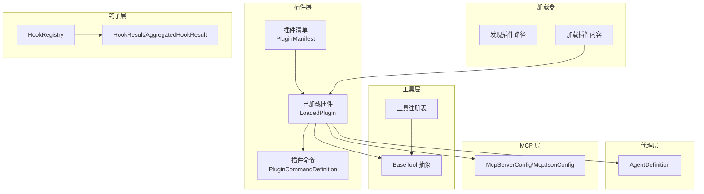

**图表来源**
- [src/openharness/plugins/schemas.py:8-25](file://src/openharness/plugins/schemas.py#L8-L25)
- [src/openharness/plugins/types.py:18-60](file://src/openharness/plugins/types.py#L18-L60)
- [src/openharness/plugins/loader.py:107-162](file://src/openharness/plugins/loader.py#L107-L162)
- [src/openharness/tools/base.py:35-81](file://src/openharness/tools/base.py#L35-L81)
- [src/openharness/hooks/types.py:9-39](file://src/openharness/hooks/types.py#L9-L39)
- [src/openharness/coordinator/agent_definitions.py:60-135](file://src/openharness/coordinator/agent_definitions.py#L60-L135)
- [src/openharness/mcp/types.py:11-77](file://src/openharness/mcp/types.py#L11-L77)

**章节来源**
- [src/openharness/plugins/__init__.py:11-52](file://src/openharness/plugins/__init__.py#L11-L52)
- [src/openharness/plugins/loader.py:61-104](file://src/openharness/plugins/loader.py#L61-L104)

## 核心组件
- 插件清单与类型
  - 清单字段：名称、版本、描述、启用默认值、目录配置（技能、工具、钩子、MCP）、扩展字段（作者、命令、代理、技能、钩子）
  - 加载后对象：包含清单、路径、启用状态、技能、命令、代理、工具、钩子、MCP 服务器配置
- 插件发现与加载
  - 用户与项目插件目录扫描、清单查找、按设置过滤、内容解析（技能、命令、代理、工具、钩子、MCP）
- 工具抽象
  - BaseTool 定义工具接口、只读判断、API 模式导出；ToolRegistry 提供注册与查询
- 钩子系统
  - HookResult/AggregatedHookResult 表达单次与聚合结果；HookRegistry 负责注册与加载
- 代理定义
  - AgentDefinition 支持工具白/黑名单、权限模式、努力级别、记忆范围、隔离模式、初始提示、关键提醒等
- MCP 类型
  - 支持 stdio/http/ws 三种传输；JSON 配置模型与连接状态

**章节来源**
- [src/openharness/plugins/schemas.py:8-25](file://src/openharness/plugins/schemas.py#L8-L25)
- [src/openharness/plugins/types.py:18-60](file://src/openharness/plugins/types.py#L18-L60)
- [src/openharness/plugins/loader.py:107-162](file://src/openharness/plugins/loader.py#L107-L162)
- [src/openharness/tools/base.py:35-81](file://src/openharness/tools/base.py#L35-L81)
- [src/openharness/hooks/types.py:9-39](file://src/openharness/hooks/types.py#L9-L39)
- [src/openharness/coordinator/agent_definitions.py:60-135](file://src/openharness/coordinator/agent_definitions.py#L60-L135)
- [src/openharness/mcp/types.py:11-77](file://src/openharness/mcp/types.py#L11-L77)

## 架构总览
下图展示了插件从发现到加载、再到被系统使用的端到端流程。

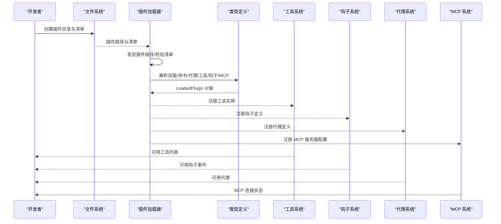

**图表来源**
- [src/openharness/plugins/loader.py:107-162](file://src/openharness/plugins/loader.py#L107-L162)
- [src/openharness/tools/base.py:60-81](file://src/openharness/tools/base.py#L60-L81)
- [src/openharness/hooks/__init__.py:24-50](file://src/openharness/hooks/__init__.py#L24-L50)
- [src/openharness/coordinator/agent_definitions.py:60-135](file://src/openharness/coordinator/agent_definitions.py#L60-L135)
- [src/openharness/mcp/types.py:40-77](file://src/openharness/mcp/types.py#L40-L77)

## 详细组件分析

### 插件清单与目录结构
- 必需文件
  - 清单文件：plugin.json 或 .claude-plugin/plugin.json
  - 可选目录：skills、tools、hooks、mcp.json/.mcp.json
- 清单字段说明
  - name：插件名称
  - version：版本号，默认 0.0.0
  - description：描述，默认空字符串
  - enabled_by_default：是否默认启用，默认 True
  - skills_dir：技能目录名，默认 skills
  - tools_dir：工具目录名，默认 tools
  - hooks_file：钩子文件名，默认 hooks.json
  - mcp_file：MCP 配置文件名，默认 mcp.json
  - 扩展字段：author、commands、agents、skills、hooks（可为字符串、数组或字典）

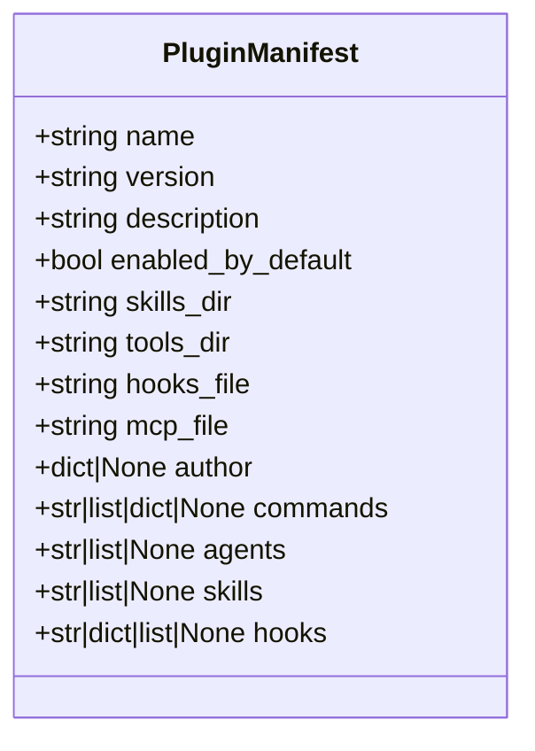

**图表来源**
- [src/openharness/plugins/schemas.py:8-25](file://src/openharness/plugins/schemas.py#L8-L25)

**章节来源**
- [src/openharness/plugins/schemas.py:8-25](file://src/openharness/plugins/schemas.py#L8-L25)
- [src/openharness/plugins/loader.py:50-58](file://src/openharness/plugins/loader.py#L50-L58)

### 插件发现与加载流程
- 发现路径
  - 用户插件目录：配置目录下的 plugins 子目录
  - 项目插件目录：工作区根目录下的 .openharness/plugins
  - 可通过额外根目录扩展
- 加载步骤
  - 查找清单文件
  - 校验清单有效性
  - 解析技能（SKILL.md）
  - 解析命令（commands 目录或清单中 commands 字段）
  - 解析代理（agents 目录或清单中 agents 字段）
  - 解析工具（tools 目录，动态导入 BaseTool 子类）
  - 解析钩子（hooks.json 或 hooks/hooks.json）
  - 解析 MCP（mcp.json 或 .mcp.json）

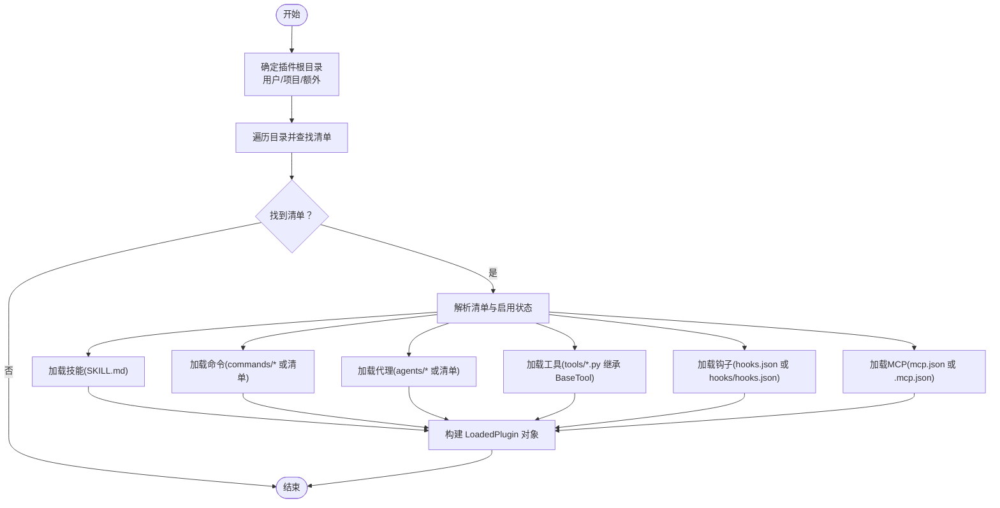

**图表来源**
- [src/openharness/plugins/loader.py:61-162](file://src/openharness/plugins/loader.py#L61-L162)

**章节来源**
- [src/openharness/plugins/loader.py:61-162](file://src/openharness/plugins/loader.py#L61-L162)

### 插件命令开发
- 命令来源
  - 默认目录：commands 下的 Markdown 文件（支持 SKILL.md）
  - 清单 commands 字段：可直接指定内容或指向文件/目录
- 命令命名规则
  - 基于插件名与相对路径生成，形如 plugin:namespace:name
  - SKILL.md 标记为 is_skill
- 前言元数据
  - 支持 description、argument-hint、model、user-invocable 等
- 参数解析与执行
  - 使用 Frontmatter 解析命令元信息
  - 执行时可结合上下文与权限控制

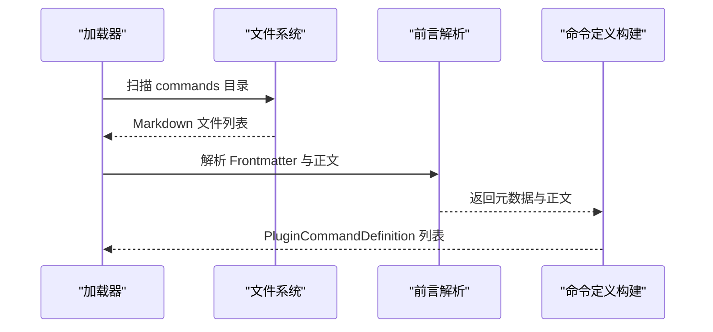

**图表来源**
- [src/openharness/plugins/loader.py:320-476](file://src/openharness/plugins/loader.py#L320-L476)

**章节来源**
- [src/openharness/plugins/loader.py:320-476](file://src/openharness/plugins/loader.py#L320-L476)

### 插件工具开发
- 继承 BaseTool
  - 必须实现 execute 方法
  - 可重写 is_read_only 控制只读语义
  - to_api_schema 导出工具模式
- 动态加载
  - tools 目录下以 .py 结尾的文件
  - 每个文件中定义 BaseTool 子类实例
  - 启用状态决定是否导入工具
- 上下文与结果
  - ToolExecutionContext 提供 cwd 与钩子执行器
  - ToolResult 规范化输出与错误标记

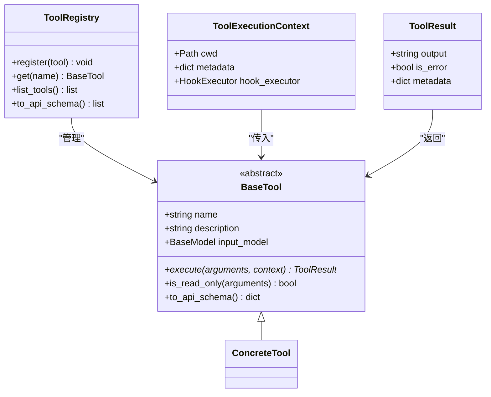

**图表来源**
- [src/openharness/tools/base.py:17-81](file://src/openharness/tools/base.py#L17-L81)

**章节来源**
- [src/openharness/tools/base.py:17-81](file://src/openharness/tools/base.py#L17-L81)
- [src/openharness/plugins/loader.py:691-730](file://src/openharness/plugins/loader.py#L691-L730)

### 钩子插件开发
- 钩子类型
  - 命令钩子、提示钩子、HTTP 钩子、代理钩子
- 配置方式
  - hooks.json（扁平格式）或 hooks/hooks.json（结构化格式）
  - 结构化格式支持 ${CLAUDE_PLUGIN_ROOT} 占位符替换
- 执行与聚合
  - HookResult 表达单次结果
  - AggregatedHookResult 聚合并判定阻断与原因

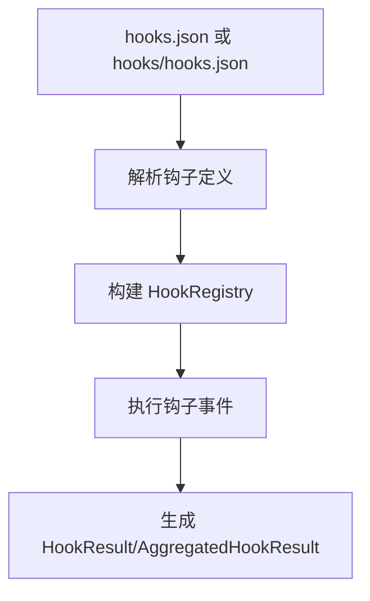

**图表来源**
- [src/openharness/plugins/loader.py:621-677](file://src/openharness/plugins/loader.py#L621-L677)
- [src/openharness/hooks/types.py:9-39](file://src/openharness/hooks/types.py#L9-L39)
- [src/openharness/hooks/__init__.py:24-50](file://src/openharness/hooks/__init__.py#L24-L50)

**章节来源**
- [src/openharness/plugins/loader.py:621-677](file://src/openharness/plugins/loader.py#L621-L677)
- [src/openharness/hooks/types.py:9-39](file://src/openharness/hooks/types.py#L9-L39)
- [src/openharness/hooks/__init__.py:24-50](file://src/openharness/hooks/__init__.py#L24-L50)

### 代理插件开发
- 代理来源
  - agents 目录下的 Markdown 文件（支持嵌套）
  - 清单 agents 字段可直接指定文件或目录
- 前言元数据
  - 支持 tools、disallowedTools、model、effort、permissionMode、maxTurns、skills、hooks、color、background、initialPrompt、memory、isolation、omitClaudeMd、criticalSystemReminder、requiredMcpServers、permissions、subagent_type 等
- AgentDefinition 字段
  - 包含系统提示、工具白/黑名单、权限模式、最大轮次、MCP 服务器引用、钩子、颜色、内存范围、隔离模式、关键提醒等

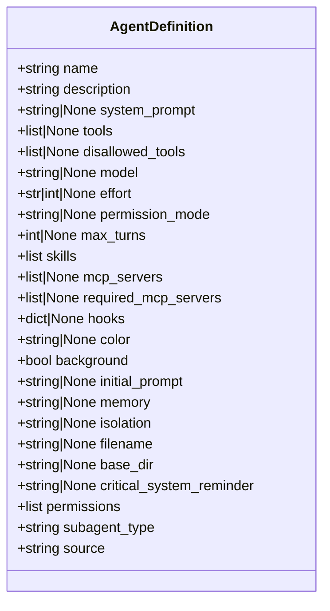

**图表来源**
- [src/openharness/coordinator/agent_definitions.py:60-135](file://src/openharness/coordinator/agent_definitions.py#L60-L135)

**章节来源**
- [src/openharness/plugins/loader.py:479-618](file://src/openharness/plugins/loader.py#L479-L618)
- [src/openharness/coordinator/agent_definitions.py:633-800](file://src/openharness/coordinator/agent_definitions.py#L633-L800)

### MCP 服务器插件开发
- 配置文件
  - mcp.json 或 .mcp.json，顶层字段为 mcpServers
- 支持传输
  - stdio：command + args + env + cwd
  - http：url + headers
  - ws：url + headers
- 运行时状态
  - McpConnectionStatus 记录连接状态、传输类型、认证配置、可用工具与资源

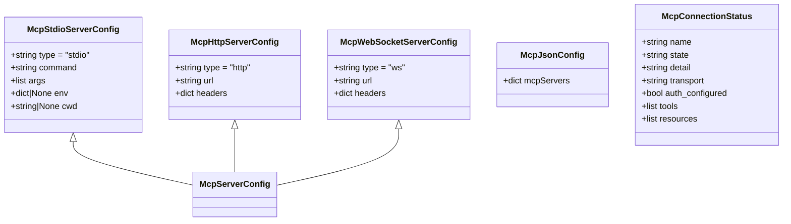

**图表来源**
- [src/openharness/mcp/types.py:11-77](file://src/openharness/mcp/types.py#L11-L77)

**章节来源**
- [src/openharness/plugins/loader.py:680-688](file://src/openharness/plugins/loader.py#L680-L688)
- [src/openharness/mcp/types.py:11-77](file://src/openharness/mcp/types.py#L11-L77)

### 插件测试与调试
- 单元测试
  - 测试插件加载：验证技能、命令、代理、钩子、MCP 是否正确加载
  - 测试工具加载：根据 enabled_by_default 决定是否导入工具
  - 测试项目插件默认禁用与警告
- 集成测试
  - 安装、加载、连接 MCP、调用工具、卸载全流程验证
  - 使用假 MCP 服务器进行端到端验证

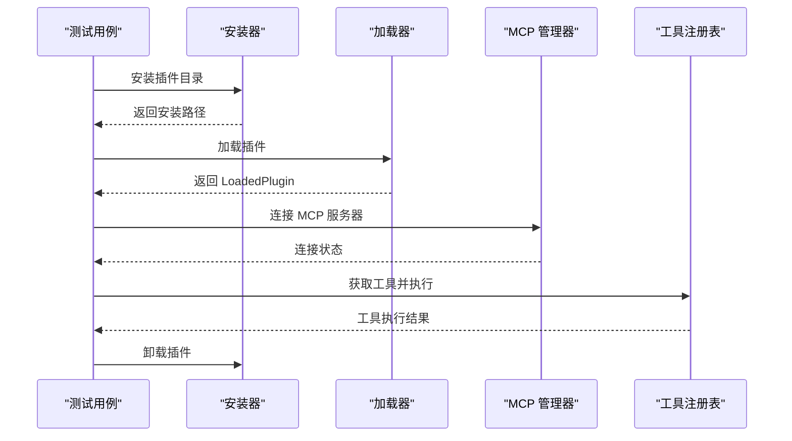

**图表来源**
- [tests/test_plugins/test_lifecycle_flow.py:55-95](file://tests/test_plugins/test_lifecycle_flow.py#L55-L95)
- [tests/test_plugins/test_loader.py:106-222](file://tests/test_plugins/test_loader.py#L106-L222)

**章节来源**
- [tests/test_plugins/test_loader.py:106-222](file://tests/test_plugins/test_loader.py#L106-L222)
- [tests/test_plugins/test_lifecycle_flow.py:55-95](file://tests/test_plugins/test_lifecycle_flow.py#L55-L95)
- [tests/fixtures/fake_mcp_server.py:1-22](file://tests/fixtures/fake_mcp_server.py#L1-L22)

### 插件打包、分发与安装
- 安装
  - 将插件目录复制到用户插件目录，自动以插件名作为子目录
- 卸载
  - 校验插件名合法性，删除对应子目录
- 分发建议
  - 提供清晰的 plugin.json 与目录结构
  - 在 README 中说明启用方式与依赖（如 MCP 服务器）

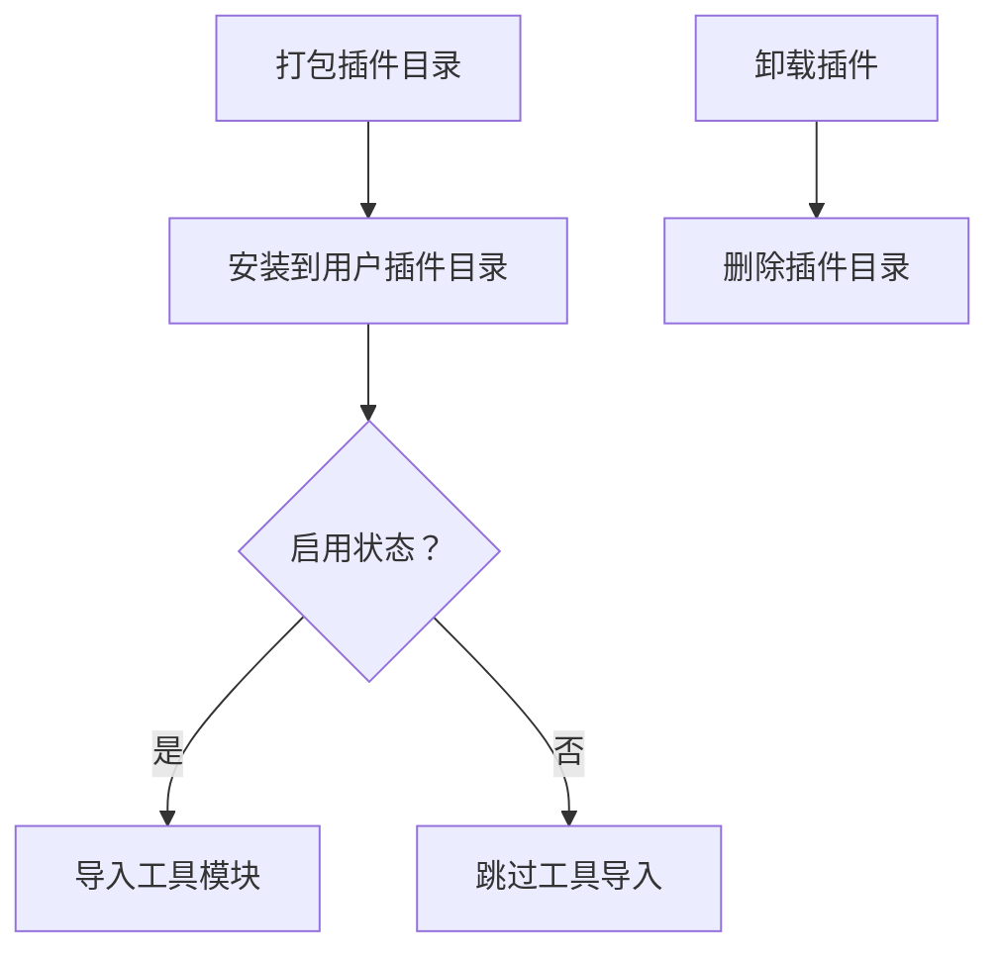

**图表来源**
- [src/openharness/plugins/installer.py:23-40](file://src/openharness/plugins/installer.py#L23-L40)
- [src/openharness/plugins/loader.py:691-730](file://src/openharness/plugins/loader.py#L691-L730)

**章节来源**
- [src/openharness/plugins/installer.py:23-40](file://src/openharness/plugins/installer.py#L23-L40)
- [src/openharness/plugins/loader.py:691-730](file://src/openharness/plugins/loader.py#L691-L730)

## 依赖关系分析
- 插件加载器依赖
  - 清单与类型：PluginManifest、LoadedPlugin、PluginCommandDefinition
  - 技能加载：_parse_skill_metadata
  - 代理加载：_parse_agent_frontmatter、常量集合（颜色、努力级别、权限模式、内存范围、隔离模式）
  - 钩子加载：hooks.schemas 的钩子定义模型
  - MCP 加载：mcp.types 的配置模型
  - 工具加载：动态导入 tools/*.py 并实例化 BaseTool 子类
- 外部依赖
  - YAML 解析用于 Frontmatter
  - JSON 解析用于 hooks.json 与 mcp.json
  - Pydantic 用于模型校验

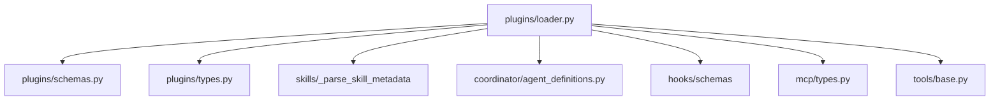

**图表来源**
- [src/openharness/plugins/loader.py:16-31](file://src/openharness/plugins/loader.py#L16-L31)
- [src/openharness/plugins/schemas.py:8-25](file://src/openharness/plugins/schemas.py#L8-L25)
- [src/openharness/plugins/types.py:9-12](file://src/openharness/plugins/types.py#L9-L12)
- [src/openharness/coordinator/agent_definitions.py:20-53](file://src/openharness/coordinator/agent_definitions.py#L20-L53)
- [src/openharness/mcp/types.py:40-44](file://src/openharness/mcp/types.py#L40-L44)
- [src/openharness/tools/base.py:35-50](file://src/openharness/tools/base.py#L35-L50)

**章节来源**
- [src/openharness/plugins/loader.py:16-31](file://src/openharness/plugins/loader.py#L16-L31)

## 性能考虑
- 插件发现与加载
  - 仅在需要时解析 Markdown 与 YAML，避免重复 IO
  - 工具模块按需导入，启用状态影响导入决策
- 钩子执行
  - 聚合结果快速判定阻断，减少后续处理开销
- MCP 连接
  - 按需连接与关闭，避免不必要的握手与资源占用

## 故障排查指南
- 插件未加载
  - 检查清单文件是否存在且可解析
  - 确认项目插件默认被禁用时是否开启 allow_project_plugins
- 工具未生效
  - 确认 enabled_by_default 与 settings 中的 enabled_plugins
  - 检查 tools/*.py 是否存在有效 BaseTool 子类
- 钩子不生效
  - 检查 hooks.json 或 hooks/hooks.json 格式与事件名
- MCP 无法连接
  - 校验 mcp.json 配置与服务器可达性
  - 查看 McpConnectionStatus 的状态与详情

**章节来源**
- [src/openharness/plugins/loader.py:107-123](file://src/openharness/plugins/loader.py#L107-L123)
- [src/openharness/plugins/loader.py:691-730](file://src/openharness/plugins/loader.py#L691-L730)
- [src/openharness/mcp/types.py:66-77](file://src/openharness/mcp/types.py#L66-L77)

## 结论
OpenHarness 的插件体系通过标准化的清单与目录结构、灵活的内容加载机制、统一的工具与钩子抽象，以及对代理与 MCP 的深度集成，为开发者提供了完整的插件开发与运行环境。遵循本文档的流程与最佳实践，可高效完成从开发到部署的全链路插件生命周期管理。

## 附录
- 示例技能文件
  - harness-eval：端到端功能验证技能
  - pr-merge：PR 合并与贡献者归属技能
- 开发建议
  - 使用 Frontmatter 明确命令与代理元信息
  - 为工具提供清晰的输入模式与错误处理
  - 为钩子提供明确的事件与匹配规则
  - 为 MCP 服务器提供稳定可复现的配置

**章节来源**
- [.claude/skills/harness-eval/SKILL.md:1-194](file://.claude/skills/harness-eval/SKILL.md#L1-L194)
- [.claude/skills/pr-merge/SKILL.md:1-100](file://.claude/skills/pr-merge/SKILL.md#L1-L100)