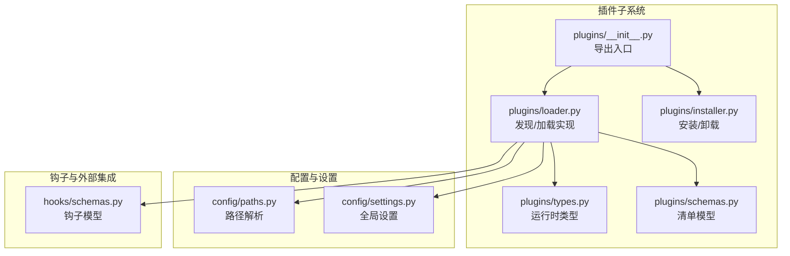
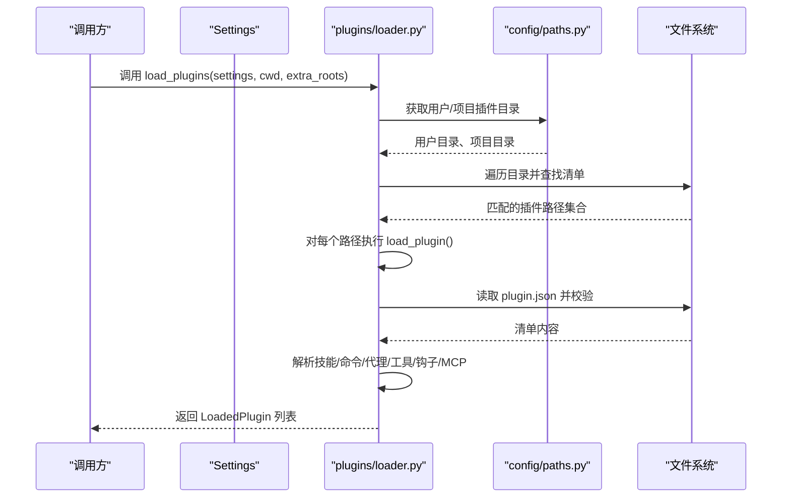
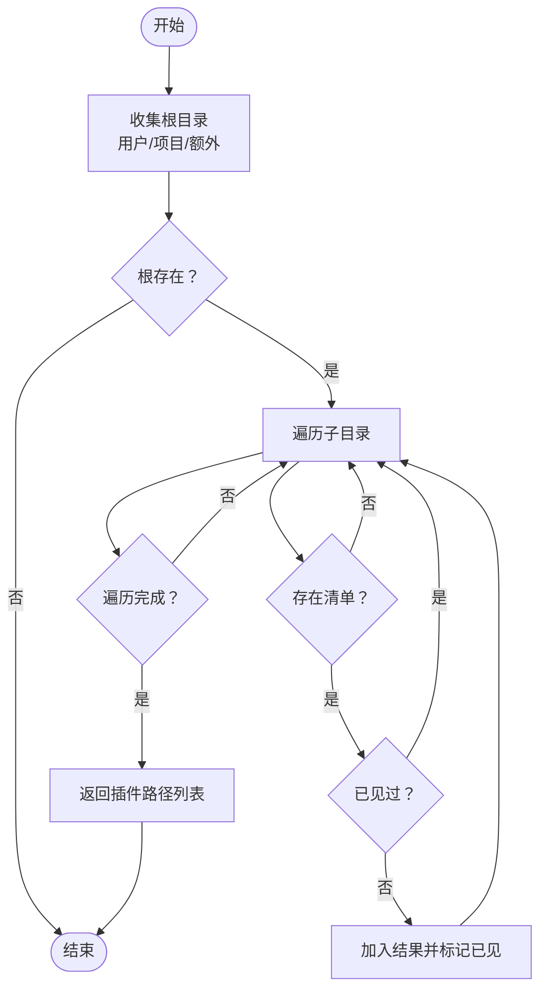
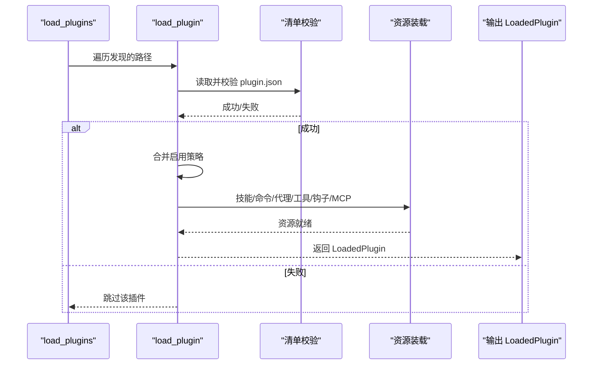
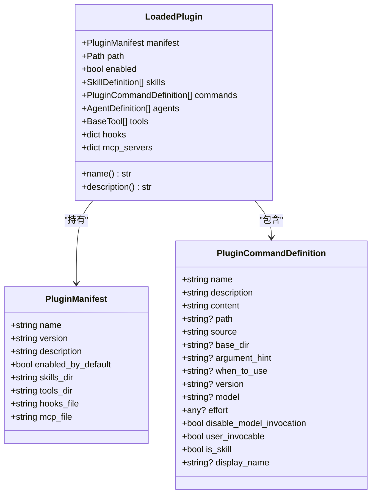
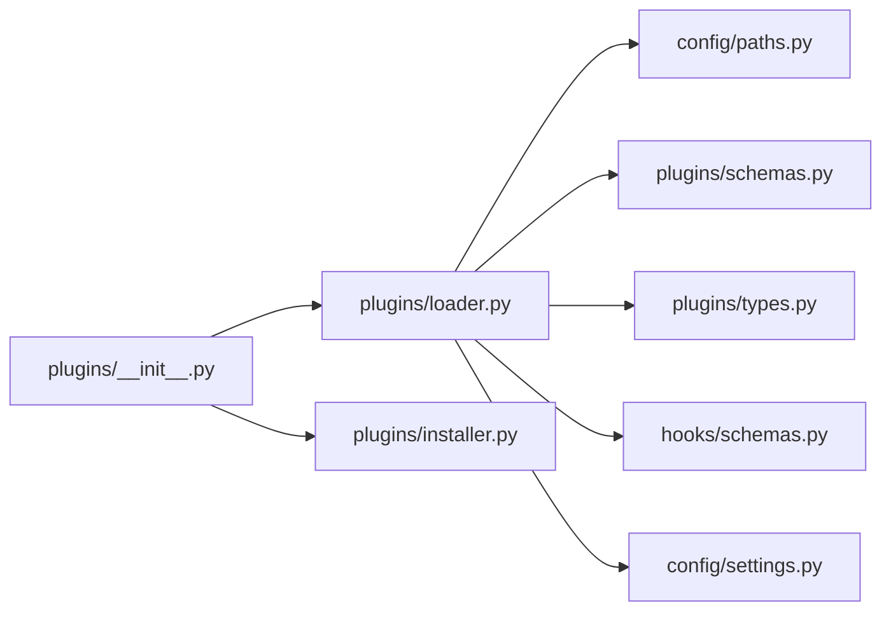
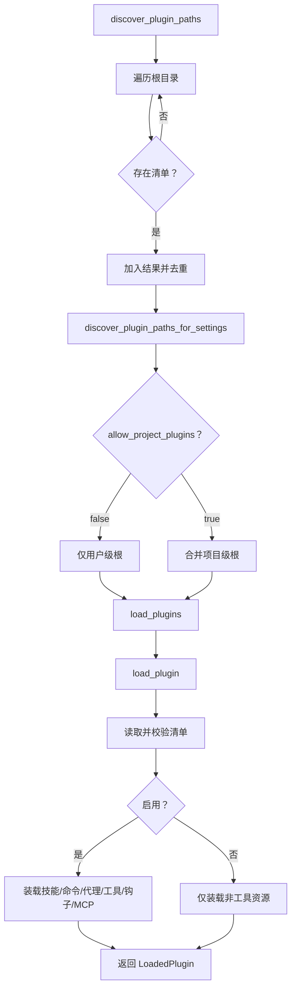

# 插件架构设计

<cite>
**本文引用的文件**
- [plugins/__init__.py](file://src/openharness/plugins/__init__.py)
- [plugins/loader.py](file://src/openharness/plugins/loader.py)
- [plugins/types.py](file://src/openharness/plugins/types.py)
- [plugins/schemas.py](file://src/openharness/plugins/schemas.py)
- [plugins/installer.py](file://src/openharness/plugins/installer.py)
- [config/paths.py](file://src/openharness/config/paths.py)
- [config/settings.py](file://src/openharness/config/settings.py)
- [hooks/schemas.py](file://src/openharness/hooks/schemas.py)
- [test_plugins/test_loader.py](file://tests/test_plugins/test_loader.py)
- [test_plugins/test_lifecycle_flow.py](file://tests/test_plugins/test_lifecycle_flow.py)
</cite>

## 目录
1. [引言](#引言)
2. [项目结构](#项目结构)
3. [核心组件](#核心组件)
4. [架构总览](#架构总览)
5. [详细组件分析](#详细组件分析)
6. [依赖分析](#依赖分析)
7. [性能考虑](#性能考虑)
8. [故障排查指南](#故障排查指南)
9. [结论](#结论)
10. [附录](#附录)

## 引言
本文件系统性阐述 OpenHarness 的插件架构设计，覆盖插件发现机制、加载流程与生命周期管理；解释插件目录结构与命名约定（标准 plugin.json 与 Claude Code 兼容 .claude-plugin/）；详解插件清单文件 PluginManifest 的结构与字段；说明插件启用/禁用机制与配置管理；给出核心数据结构 LoadedPlugin、PluginCommandDefinition 等的定义；最后提供插件发现算法与路径解析的技术细节。

## 项目结构
OpenHarness 将插件子系统置于 src/openharness/plugins 下，并通过 config 与 settings 提供路径与行为控制。测试位于 tests/test_plugins，验证插件发现、加载、工具导入、生命周期等关键流程。

**图表来源**
- [plugins/__init__.py:1-54](file://src/openharness/plugins/__init__.py#L1-L54)
- [plugins/loader.py:1-731](file://src/openharness/plugins/loader.py#L1-L731)
- [plugins/types.py:1-60](file://src/openharness/plugins/types.py#L1-L60)
- [plugins/schemas.py:1-25](file://src/openharness/plugins/schemas.py#L1-L25)
- [plugins/installer.py:1-40](file://src/openharness/plugins/installer.py#L1-L40)
- [config/paths.py:1-161](file://src/openharness/config/paths.py#L1-L161)
- [config/settings.py:1-965](file://src/openharness/config/settings.py#L1-L965)
- [hooks/schemas.py:1-59](file://src/openharness/hooks/schemas.py#L1-L59)

**章节来源**
- [plugins/__init__.py:1-54](file://src/openharness/plugins/__init__.py#L1-L54)
- [plugins/loader.py:61-124](file://src/openharness/plugins/loader.py#L61-L124)
- [config/paths.py:15-106](file://src/openharness/config/paths.py#L15-L106)
- [config/settings.py:519-525](file://src/openharness/config/settings.py#L519-L525)

## 核心组件
- 插件清单模型：PluginManifest，定义插件元信息与资源定位字段。
- 运行时类型：LoadedPlugin、PluginCommandDefinition，承载已加载插件及其贡献项。
- 发现与加载：discover_plugin_paths、load_plugins、load_plugin 等函数，负责路径解析、清单校验、内容装载。
- 安装与卸载：install_plugin_from_path、uninstall_plugin，提供用户级插件的安装/移除能力。
- 路径与设置：get_user_plugins_dir、get_project_plugins_dir、Settings.allow_project_plugins 等，决定插件可见范围与启用策略。

**章节来源**
- [plugins/schemas.py:8-25](file://src/openharness/plugins/schemas.py#L8-L25)
- [plugins/types.py:18-60](file://src/openharness/plugins/types.py#L18-L60)
- [plugins/loader.py:61-162](file://src/openharness/plugins/loader.py#L61-L162)
- [plugins/installer.py:23-40](file://src/openharness/plugins/installer.py#L23-L40)
- [config/paths.py:36-47](file://src/openharness/config/paths.py#L36-L47)
- [config/settings.py:519-520](file://src/openharness/config/settings.py#L519-L520)

## 架构总览
插件系统采用“清单驱动 + 多源发现”的架构：以 plugin.json 或 .claude-plugin/plugin.json 作为入口，扫描用户级与项目级插件根目录，按设置允许范围筛选后逐个加载。加载过程中解析技能、命令、代理、工具、钩子与 MCP 配置，并根据启用状态决定是否实例化工具模块。

**图表来源**
- [plugins/loader.py:107-123](file://src/openharness/plugins/loader.py#L107-L123)
- [plugins/loader.py:126-162](file://src/openharness/plugins/loader.py#L126-L162)
- [config/paths.py:36-47](file://src/openharness/config/paths.py#L36-L47)

## 详细组件分析

### 插件发现与路径解析
- 用户级与项目级根目录：
  - 用户级：~/.openharness/plugins（或 OPENHARNESS_CONFIG_DIR 下）
  - 项目级：工作区/.openharness/plugins
- 清单候选位置：
  - 标准：plugin.json
  - 兼容：.claude-plugin/plugin.json
- 发现算法要点：
  - 收集 roots = [用户目录, 项目目录(可选), 额外根目录]
  - 遍历每个根目录下的子目录，若存在上述任一清单则视为插件目录
  - 去重并返回有序路径列表
- 设置影响：
  - Settings.allow_project_plugins=false 时，默认不加载项目级插件，但会记录警告日志

**图表来源**
- [plugins/loader.py:61-78](file://src/openharness/plugins/loader.py#L61-L78)
- [plugins/loader.py:50-58](file://src/openharness/plugins/loader.py#L50-L58)
- [plugins/loader.py:81-104](file://src/openharness/plugins/loader.py#L81-L104)

**章节来源**
- [plugins/loader.py:61-104](file://src/openharness/plugins/loader.py#L61-L104)
- [plugins/loader.py:50-58](file://src/openharness/plugins/loader.py#L50-L58)
- [config/paths.py:36-47](file://src/openharness/config/paths.py#L36-L47)
- [config/settings.py:519-520](file://src/openharness/config/settings.py#L519-L520)

### 插件加载与生命周期
- 加载入口：load_plugins
  - 受 Settings.allow_project_plugins 控制，项目级插件默认禁用
  - 对每个发现的插件路径调用 load_plugin
- 单插件加载：load_plugin
  - 定位并读取清单（支持两种位置）
  - 校验失败则跳过
  - 合并启用策略：enabled_plugins[name] 优先于 manifest.enabled_by_default
  - 按需加载技能、命令、代理、工具、钩子、MCP
- 工具加载：仅在插件启用时实例化工具类
- 生命周期阶段：
  - 发现 → 校验清单 → 决策启用 → 装载内容 → 返回 LoadedPlugin

**图表来源**
- [plugins/loader.py:107-123](file://src/openharness/plugins/loader.py#L107-L123)
- [plugins/loader.py:126-162](file://src/openharness/plugins/loader.py#L126-L162)

**章节来源**
- [plugins/loader.py:107-162](file://src/openharness/plugins/loader.py#L107-L162)

### 插件清单文件 PluginManifest
- 字段概览（来自 Pydantic 模型）：
  - name、version、description、enabled_by_default
  - skills_dir、tools_dir、hooks_file、mcp_file
  - 扩展字段：author、commands、agents、skills、hooks
- 用途：
  - 作为插件元信息与资源定位依据
  - 控制工具启用默认值与资源目录名

**章节来源**
- [plugins/schemas.py:8-25](file://src/openharness/plugins/schemas.py#L8-L25)

### 插件目录结构与命名约定
- 标准布局（推荐）：
  - plugin.json（或 .claude-plugin/plugin.json）
  - skills/（或自定义 skills_dir）
  - commands/（或清单中 commands 指定）
  - agents/（或清单中 agents 指定）
  - tools/（或自定义 tools_dir，仅启用时加载）
  - hooks.json（或 hooks/hooks.json 结构化格式）
  - mcp.json（或 .mcp.json）
- 兼容性：
  - 支持 .claude-plugin/plugin.json 作为清单位置之一
- 命名与组织：
  - 命令与技能可通过目录层级与文件命名推导命令名
  - SKILL.md 用于技能定义与元数据

**章节来源**
- [plugins/loader.py:251-307](file://src/openharness/plugins/loader.py#L251-L307)
- [plugins/loader.py:320-476](file://src/openharness/plugins/loader.py#L320-L476)
- [plugins/loader.py:479-618](file://src/openharness/plugins/loader.py#L479-L618)
- [plugins/loader.py:621-677](file://src/openharness/plugins/loader.py#L621-L677)
- [plugins/loader.py:680-688](file://src/openharness/plugins/loader.py#L680-L688)

### 插件启用/禁用机制与配置管理
- 启用策略：
  - 优先使用 Settings.enabled_plugins[name] 显式开关
  - 若未显式配置，则使用 PluginManifest.enabled_by_default
- 项目级插件默认禁用：
  - Settings.allow_project_plugins=false 时，项目级插件不会被加载
  - 若检测到项目级插件，会记录警告提示开启
- 工具加载条件：
  - 仅当插件处于启用状态时，才会动态导入 tools/*.py 中的工具类

**章节来源**
- [plugins/loader.py:136](file://src/openharness/plugins/loader.py#L136)
- [plugins/loader.py:141](file://src/openharness/plugins/loader.py#L141)
- [plugins/loader.py:107-123](file://src/openharness/plugins/loader.py#L107-L123)
- [config/settings.py:519](file://src/openharness/config/settings.py#L519)

### 核心数据结构与类型定义
- LoadedPlugin：封装一个已加载插件与其贡献的所有内容（清单、路径、启用状态、技能、命令、代理、工具、钩子、MCP 服务器）
- PluginCommandDefinition：描述插件贡献的命令（含名称、描述、内容、元数据等）

**图表来源**
- [plugins/schemas.py:8-25](file://src/openharness/plugins/schemas.py#L8-L25)
- [plugins/types.py:18-60](file://src/openharness/plugins/types.py#L18-L60)

**章节来源**
- [plugins/types.py:18-60](file://src/openharness/plugins/types.py#L18-L60)
- [plugins/schemas.py:8-25](file://src/openharness/plugins/schemas.py#L8-L25)

### 安装与卸载
- 安装：install_plugin_from_path 将源插件目录复制到用户插件根目录
- 卸载：uninstall_plugin 删除用户插件目录中的指定子目录，带安全检查防止路径穿越
- 用户插件根目录解析：get_user_plugins_dir

**章节来源**
- [plugins/installer.py:23-40](file://src/openharness/plugins/installer.py#L23-L40)
- [plugins/installer.py:11-21](file://src/openharness/plugins/installer.py#L11-L21)
- [config/paths.py:36](file://src/openharness/config/paths.py#L36)

## 依赖分析
- 组件耦合：
  - loader 依赖 paths（路径）、schemas（清单模型）、types（运行时类型）、hooks.schemas（钩子模型）、mcp.types（MCP 配置）、skills.loader（技能元数据解析）
  - __init__ 采用延迟导入，降低启动时依赖
- 外部依赖：
  - Pydantic 用于模型校验
  - YAML/JSON 解析用于清单与钩子配置
  - Python importlib 用于动态加载工具模块

**图表来源**
- [plugins/loader.py:16-31](file://src/openharness/plugins/loader.py#L16-L31)
- [plugins/__init__.py:23-52](file://src/openharness/plugins/__init__.py#L23-L52)

**章节来源**
- [plugins/loader.py:16-31](file://src/openharness/plugins/loader.py#L16-L31)
- [plugins/__init__.py:23-52](file://src/openharness/plugins/__init__.py#L23-L52)

## 性能考虑
- 发现阶段：
  - 遍历多根目录并去重，时间复杂度近似 O(N)，N 为插件目录数量
  - 清单校验与文件读取为常数开销
- 加载阶段：
  - 工具模块动态导入涉及 importlib，建议插件工具数量不宜过多
  - 建议在 Settings 中显式启用必要插件，避免加载无关工具
- I/O 优化：
  - 使用 pathlib 与有序遍历，减少不必要的系统调用

## 故障排查指南
- 项目级插件未加载：
  - 检查 Settings.allow_project_plugins 是否为 true
  - 查看日志是否存在关于项目本地插件的警告
- 插件未被识别：
  - 确认清单路径：plugin.json 或 .claude-plugin/plugin.json
  - 确保插件根目录下存在清单文件
- 工具未加载：
  - 检查插件启用状态（enabled_by_default 与 Settings.enabled_plugins）
  - 确认 tools/*.py 符合工具类规范（继承 BaseTool，具备 name/description）
- 安装/卸载异常：
  - 卸载时传入非法名称会触发异常，确保仅传入合法子目录名

**章节来源**
- [plugins/loader.py:110-117](file://src/openharness/plugins/loader.py#L110-L117)
- [plugins/loader.py:136](file://src/openharness/plugins/loader.py#L136)
- [plugins/installer.py:11-21](file://src/openharness/plugins/installer.py#L11-L21)
- [test_plugins/test_loader.py:142-167](file://tests/test_plugins/test_loader.py#L142-L167)
- [test_plugins/test_loader.py:185-222](file://tests/test_plugins/test_loader.py#L185-L222)

## 结论
OpenHarness 的插件系统以清单为中心，结合用户级与项目级双根目录发现机制，配合 Settings 的启用策略与安全限制，实现了灵活而可控的插件生态。通过清晰的数据结构与模块化加载流程，系统既满足扩展需求，又兼顾安全性与性能。

## 附录

### 插件发现与加载流程图（代码级）

**图表来源**
- [plugins/loader.py:61-104](file://src/openharness/plugins/loader.py#L61-L104)
- [plugins/loader.py:107-123](file://src/openharness/plugins/loader.py#L107-L123)
- [plugins/loader.py:126-162](file://src/openharness/plugins/loader.py#L126-L162)