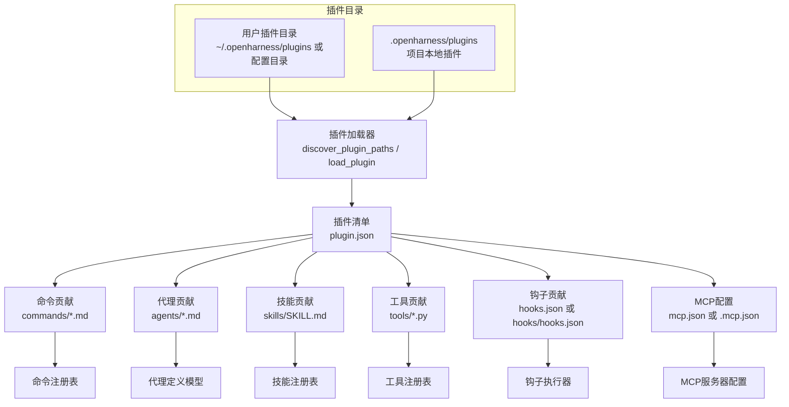
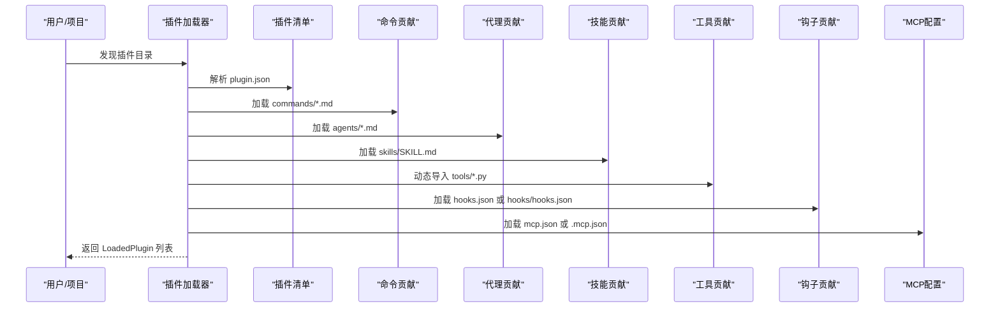
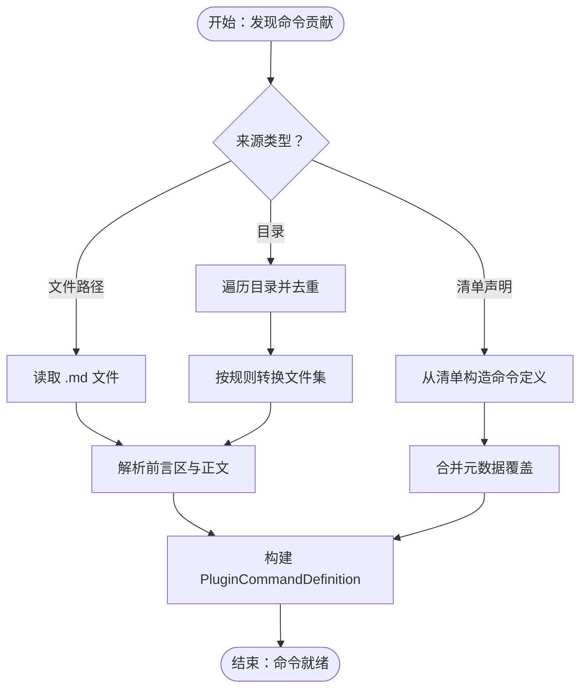
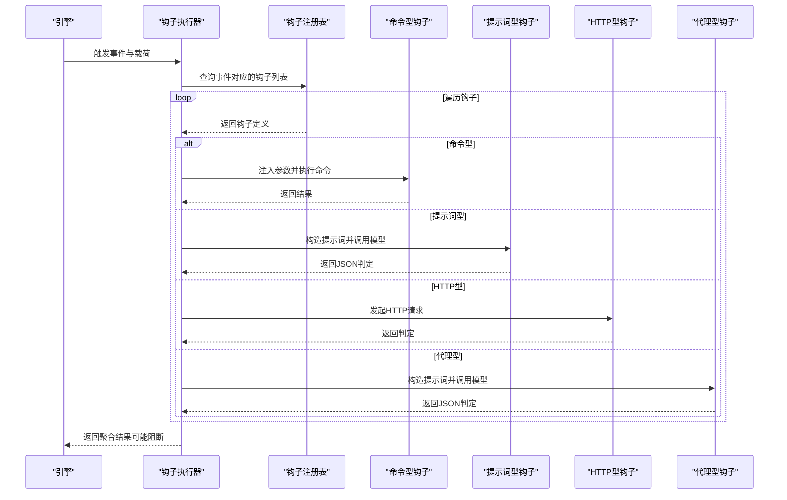
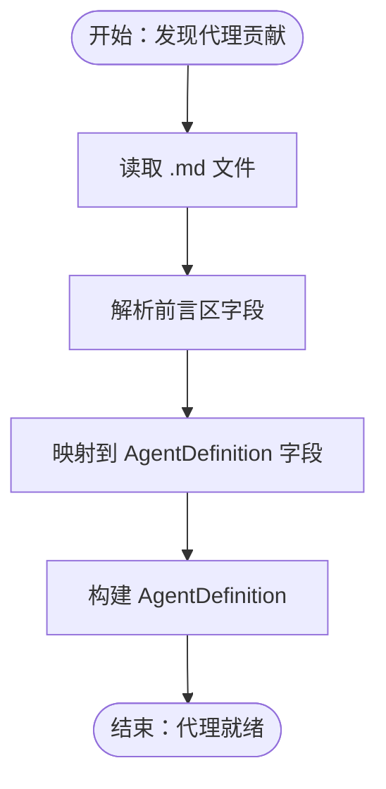
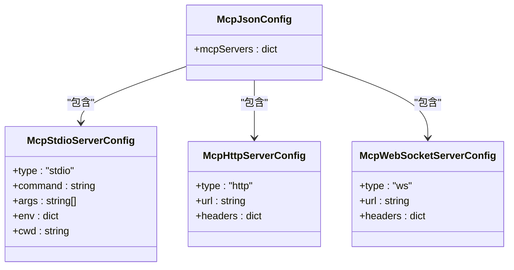
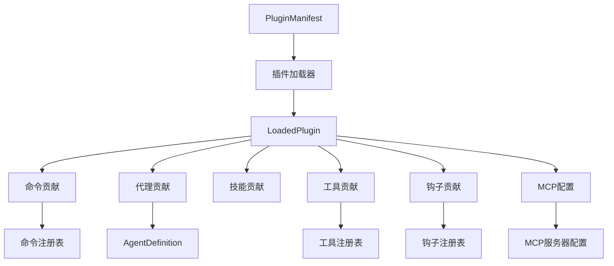

# 插件类型和用途

<cite>
**本文引用的文件**
- [src/openharness/plugins/types.py](file://src/openharness/plugins/types.py)
- [src/openharness/plugins/schemas.py](file://src/openharness/plugins/schemas.py)
- [src/openharness/plugins/loader.py](file://src/openharness/plugins/loader.py)
- [src/openharness/hooks/events.py](file://src/openharness/hooks/events.py)
- [src/openharness/hooks/types.py](file://src/openharness/hooks/types.py)
- [src/openharness/hooks/executor.py](file://src/openharness/hooks/executor.py)
- [src/openharness/mcp/types.py](file://src/openharness/mcp/types.py)
- [src/openharness/tools/base.py](file://src/openharness/tools/base.py)
- [src/openharness/coordinator/agent_definitions.py](file://src/openharness/coordinator/agent_definitions.py)
- [src/openharness/commands/registry.py](file://src/openharness/commands/registry.py)
- [tests/test_plugins/test_loader.py](file://tests/test_plugins/test_loader.py)
- [tests/test_plugins/test_lifecycle_flow.py](file://tests/test_plugins/test_lifecycle_flow.py)
- [tests/fixtures/fake_mcp_server.py](file://tests/fixtures/fake_mcp_server.py)
</cite>

## 目录
1. [简介](#简介)
2. [项目结构](#项目结构)
3. [核心组件](#核心组件)
4. [架构总览](#架构总览)
5. [详细组件分析](#详细组件分析)
6. [依赖分析](#依赖分析)
7. [性能考虑](#性能考虑)
8. [故障排查指南](#故障排查指南)
9. [结论](#结论)
10. [附录](#附录)

## 简介
本文件面向OpenHarness插件系统的使用者与开发者，系统性阐述四大核心插件类型及其用途、特点与适用场景：
- 命令插件：扩展CLI命令能力，通过Markdown定义命令、参数与执行内容。
- 钩子插件：基于生命周期事件的钩子机制，支持命令型与提示词型钩子，实现会话前后控制与条件拦截。
- 代理插件：声明式定义智能代理，含工具授权、权限模式、记忆范围、隔离模式等配置，并可声明所需MCP服务器。
- MCP服务器插件：声明多提供商协议（MCP）服务器配置，支持stdio/http/ws三种传输方式。

同时，文档提供各类型插件的配置要点、最佳实践以及插件间的协作与依赖关系说明，帮助读者在实际工程中高效落地。

## 项目结构
OpenHarness插件系统围绕“清单（manifest）+ 贡献物（commands/agents/skills/tools/hooks/mcp）”组织，加载器负责从用户与项目插件目录发现并解析这些贡献物，最终汇聚到运行时的LoadedPlugin对象中，供后续命令注册、代理编排、工具调度与钩子执行使用。

图示来源
- [src/openharness/plugins/loader.py:61-123](file://src/openharness/plugins/loader.py#L61-L123)
- [src/openharness/plugins/schemas.py:8-25](file://src/openharness/plugins/schemas.py#L8-L25)

章节来源
- [src/openharness/plugins/loader.py:61-123](file://src/openharness/plugins/loader.py#L61-L123)
- [src/openharness/plugins/schemas.py:8-25](file://src/openharness/plugins/schemas.py#L8-L25)

## 核心组件
- 插件清单（PluginManifest）：描述插件元数据与贡献物位置，默认字段包括名称、版本、描述、启用策略及各贡献物目录/文件名。
- 已加载插件（LoadedPlugin）：封装清单与所有贡献物（技能、命令、代理、工具、钩子、MCP服务器），并暴露便捷属性。
- 插件命令定义（PluginCommandDefinition）：命令级贡献物的数据结构，包含命令名、描述、内容、路径、参数提示、模型选择、是否允许用户调用等。
- 代理定义（AgentDefinition）：代理级贡献物的数据结构，包含工具白/黑名单、权限模式、记忆范围、隔离模式、初始提示、关键提醒、所需MCP服务器等。
- 工具基类（BaseTool）：所有插件工具的抽象基类，统一输入模型、执行接口与API Schema导出。
- 钩子类型（HookResult/AggregatedHookResult）：钩子执行结果的标准化表示，支持阻断与聚合判断。
- MCP类型（McpStdioServerConfig/McpHttpServerConfig/McpWebSocketServerConfig/McpJsonConfig）：MCP服务器配置模型，支持多种传输与JSON配置格式。

章节来源
- [src/openharness/plugins/schemas.py:8-25](file://src/openharness/plugins/schemas.py#L8-L25)
- [src/openharness/plugins/types.py:18-60](file://src/openharness/plugins/types.py#L18-L60)
- [src/openharness/coordinator/agent_definitions.py:60-135](file://src/openharness/coordinator/agent_definitions.py#L60-L135)
- [src/openharness/tools/base.py:35-81](file://src/openharness/tools/base.py#L35-L81)
- [src/openharness/hooks/types.py:9-39](file://src/openharness/hooks/types.py#L9-L39)
- [src/openharness/mcp/types.py:11-77](file://src/openharness/mcp/types.py#L11-L77)

## 架构总览
下图展示插件系统从发现到贡献物加载、再到运行时使用的整体流程与交互关系。

图示来源
- [src/openharness/plugins/loader.py:107-162](file://src/openharness/plugins/loader.py#L107-L162)
- [src/openharness/plugins/schemas.py:8-25](file://src/openharness/plugins/schemas.py#L8-L25)

## 详细组件分析

### 命令插件
命令插件用于扩展CLI命令功能，其核心由以下要素构成：
- 清单字段：commands可为字符串、列表或字典，指示命令来源；默认目录为commands/。
- 命令来源：支持直接从文件路径加载（.md）、从目录批量加载、或在清单中以键值对形式声明命令内容与元数据。
- 命令命名：采用“插件名:命名空间:基础名”的命名规则，确保唯一性；若文件名为SKILL.md，则标记为技能型命令。
- 元数据解析：从Markdown前言区提取描述、参数提示、模型、版本、使用时机、是否允许模型调用、是否允许用户调用等。
- 参数处理：支持argument_hint、model、when_to_use、version、effort等字段，便于UI与引擎理解命令意图与约束。
- 执行逻辑：命令内容作为纯文本，交由命令执行器按上下文渲染与执行。

图示来源
- [src/openharness/plugins/loader.py:320-477](file://src/openharness/plugins/loader.py#L320-L477)
- [src/openharness/plugins/types.py:18-37](file://src/openharness/plugins/types.py#L18-L37)

章节来源
- [src/openharness/plugins/loader.py:320-477](file://src/openharness/plugins/loader.py#L320-L477)
- [src/openharness/plugins/types.py:18-37](file://src/openharness/plugins/types.py#L18-L37)

最佳实践
- 使用前言区明确描述与参数提示，提升用户体验与可维护性。
- 对于复杂命令，建议拆分为多个子目录与SKILL.md，便于命名与复用。
- 控制命令数量与粒度，避免命令命名冲突，优先使用层级化命名空间。

### 钩子插件
钩子插件通过生命周期事件驱动，支持四类钩子定义：
- 命令型钩子：在事件发生时执行外部命令，可阻断后续流程。
- 提示词型钩子：通过模型判定条件是否满足，满足则放行，否则可阻断。
- HTTP型钩子：向远端服务发起请求进行判定。
- 代理型钩子：针对代理场景的条件判定。

钩子执行器根据事件类型与匹配器，串行执行钩子，聚合结果并决定是否阻断后续流程。

图示来源
- [src/openharness/hooks/executor.py:41-210](file://src/openharness/hooks/executor.py#L41-L210)
- [src/openharness/hooks/events.py:8-21](file://src/openharness/hooks/events.py#L8-L21)
- [src/openharness/hooks/types.py:9-39](file://src/openharness/hooks/types.py#L9-L39)

章节来源
- [src/openharness/hooks/executor.py:41-210](file://src/openharness/hooks/executor.py#L41-L210)
- [src/openharness/hooks/events.py:8-21](file://src/openharness/hooks/events.py#L8-L21)
- [src/openharness/hooks/types.py:9-39](file://src/openharness/hooks/types.py#L9-L39)

最佳实践
- 将阻断性逻辑置于命令型与提示词型钩子，减少对业务流程的侵入。
- 对提示词型钩子提供清晰的判定前缀与输出格式要求，确保模型稳定返回JSON。
- HTTP型钩子需设置合理超时与错误处理，避免阻塞主流程。

### 代理插件
代理插件通过Markdown定义代理，涵盖工具授权、权限模式、记忆范围、隔离模式、初始提示、关键提醒、所需MCP服务器等关键配置。加载器解析前言区字段并映射到AgentDefinition模型，最终参与代理编排与执行。

图示来源
- [src/openharness/plugins/loader.py:479-618](file://src/openharness/plugins/loader.py#L479-L618)
- [src/openharness/coordinator/agent_definitions.py:60-135](file://src/openharness/coordinator/agent_definitions.py#L60-L135)

章节来源
- [src/openharness/plugins/loader.py:479-618](file://src/openharness/plugins/loader.py#L479-L618)
- [src/openharness/coordinator/agent_definitions.py:60-135](file://src/openharness/coordinator/agent_definitions.py#L60-L135)

最佳实践
- 明确工具白/黑名单与权限模式，确保安全可控。
- 合理设置记忆范围与隔离模式，平衡效率与安全性。
- 对需要外部能力的代理，提前声明所需MCP服务器，避免运行期缺失。

### MCP服务器插件
MCP服务器插件通过mcp.json或.mcp.json声明多提供商协议服务器，支持stdio、http与ws三种传输方式。加载器解析JSON并验证为McpServerConfig集合，供代理与工具使用。

图示来源
- [src/openharness/mcp/types.py:11-77](file://src/openharness/mcp/types.py#L11-L77)

章节来源
- [src/openharness/mcp/types.py:11-77](file://src/openharness/mcp/types.py#L11-L77)

最佳实践
- 优先使用stdio进行本地开发与调试，http/ws适合远程或容器化部署。
- 在代理定义中声明requiredMcpServers，确保运行前校验可用性。
- 为MCP服务器配置合理的认证头与超时参数，提升稳定性。

## 依赖分析
插件系统的关键依赖关系如下：
- 插件清单（PluginManifest）决定贡献物位置与默认行为。
- 插件加载器（loader）负责发现与解析，产出LoadedPlugin。
- 命令与代理贡献物映射到命令注册表与代理定义模型。
- 工具贡献物动态导入并注册到工具注册表。
- 钩子贡献物被注册到钩子注册表，由钩子执行器在生命周期事件中触发。
- MCP配置被解析为McpServerConfig，供代理与工具使用。

图示来源
- [src/openharness/plugins/schemas.py:8-25](file://src/openharness/plugins/schemas.py#L8-L25)
- [src/openharness/plugins/loader.py:107-162](file://src/openharness/plugins/loader.py#L107-L162)
- [src/openharness/plugins/types.py:40-60](file://src/openharness/plugins/types.py#L40-L60)

章节来源
- [src/openharness/plugins/loader.py:107-162](file://src/openharness/plugins/loader.py#L107-L162)
- [src/openharness/plugins/types.py:40-60](file://src/openharness/plugins/types.py#L40-L60)

## 性能考虑
- 插件发现与加载：尽量将命令与代理贡献物按目录分层，减少不必要的文件扫描；仅在必要时解析大量Markdown。
- 工具动态导入：避免在热路径重复导入同一模块，保持模块缓存；仅在插件启用时加载工具。
- 钩子执行：命令型与提示词型钩子应尽量短小精悍；HTTP型钩子设置超时与重试策略，避免阻塞主流程。
- MCP服务器：优先使用本地stdio进行开发，远程连接需关注网络延迟与认证开销。

## 故障排查指南
- 插件未加载
  - 检查插件清单是否存在且可解析；确认插件目录位于用户或项目插件根目录。
  - 若为项目本地插件，默认不加载，需开启相应设置。
- 命令未出现
  - 确认命令文件位于commands目录或清单声明的路径；检查前言区描述与命名空间是否正确。
- 代理无法启动
  - 检查代理前言区字段（工具、权限、记忆、隔离、MCP服务器）是否合法；确认requiredMcpServers已配置。
- 钩子未生效
  - 确认事件名称有效；命令型钩子注意注入环境变量与参数；提示词型钩子确保输出为严格JSON。
- MCP服务器不可用
  - 检查mcp.json配置与传输类型；确认服务器进程或URL可达；核对认证头与超时设置。

章节来源
- [src/openharness/plugins/loader.py:107-123](file://src/openharness/plugins/loader.py#L107-L123)
- [src/openharness/hooks/executor.py:80-210](file://src/openharness/hooks/executor.py#L80-L210)
- [src/openharness/mcp/types.py:11-77](file://src/openharness/mcp/types.py#L11-L77)

## 结论
OpenHarness插件系统以清单驱动、贡献物解耦为核心设计，通过命令、钩子、代理与MCP四种类型插件，形成从CLI扩展、生命周期控制、智能体编排到外部能力接入的完整能力体系。遵循本文的最佳实践与依赖关系说明，可在保证安全与性能的前提下，快速构建可维护、可扩展的插件生态。

## 附录

### 配置示例与最佳实践摘要
- 命令插件
  - 清单字段：commands可为字符串、列表或字典，指示命令来源。
  - 前言区字段：description、argument-hint、model、when_to_use、version、effort等。
  - 命名规范：插件名:命名空间:基础名；SKILL.md自动标记为技能型命令。
- 钩子插件
  - 支持命令型、提示词型、HTTP型与代理型钩子。
  - 事件名称：会话开始/结束、工具使用前后、用户提交提示、通知、停止等。
  - 阻断策略：block_on_failure控制失败时是否阻断。
- 代理插件
  - 前言区字段：tools、disallowed-tools、model、effort、permission-mode、memory、isolation、initial-prompt、critical-system-reminder、required-mcp-servers、permissions等。
  - 与MCP：在代理定义中标注requiredMcpServers，确保运行前可用。
- MCP服务器插件
  - 支持stdio/http/ws三类配置；通过mcp.json或.mcp.json声明。
  - 建议在代理定义中声明requiredMcpServers，避免运行期缺失。

章节来源
- [src/openharness/plugins/schemas.py:8-25](file://src/openharness/plugins/schemas.py#L8-L25)
- [src/openharness/plugins/loader.py:320-477](file://src/openharness/plugins/loader.py#L320-L477)
- [src/openharness/hooks/events.py:8-21](file://src/openharness/hooks/events.py#L8-L21)
- [src/openharness/mcp/types.py:11-77](file://src/openharness/mcp/types.py#L11-L77)
- [src/openharness/coordinator/agent_definitions.py:60-135](file://src/openharness/coordinator/agent_definitions.py#L60-L135)

### 插件间协作与依赖关系
- 命令插件与代理插件：命令可作为代理的入口或前置步骤；代理可声明所需MCP服务器，命令工具也可调用MCP资源。
- 钩子插件与代理插件：钩子在代理生命周期内触发，可用于权限校验、资源准备与结果拦截。
- 工具插件与MCP服务器插件：工具可封装对MCP服务器的调用；代理可声明所需服务器，确保工具可用。
- 命令插件与工具插件：命令可直接调用工具；工具可进一步访问MCP资源。

章节来源
- [src/openharness/plugins/loader.py:680-731](file://src/openharness/plugins/loader.py#L680-L731)
- [src/openharness/tools/base.py:35-81](file://src/openharness/tools/base.py#L35-L81)
- [src/openharness/mcp/types.py:46-77](file://src/openharness/mcp/types.py#L46-L77)

### 测试参考
- 插件加载与贡献物合并：示例展示了命令、代理、钩子与MCP配置的加载与合并。
- 生命周期与工具调用：示例展示了插件工具在生命周期中的调用与结果断言。
- MCP服务器集成：示例展示了MCP服务器工具的调用与返回值断言。

章节来源
- [tests/test_plugins/test_loader.py:106-200](file://tests/test_plugins/test_loader.py#L106-L200)
- [tests/test_plugins/test_lifecycle_flow.py:76-95](file://tests/test_plugins/test_lifecycle_flow.py#L76-L95)
- [tests/fixtures/fake_mcp_server.py:10-21](file://tests/fixtures/fake_mcp_server.py#L10-L21)