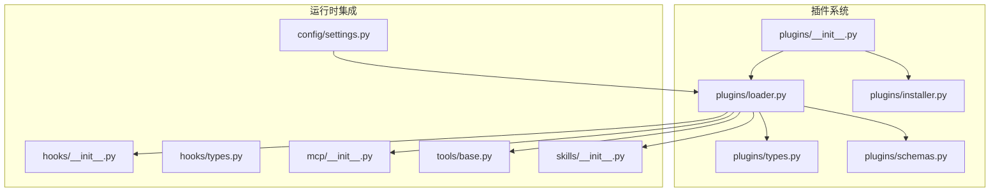
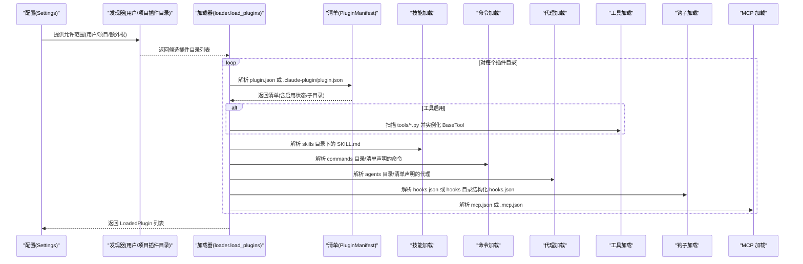
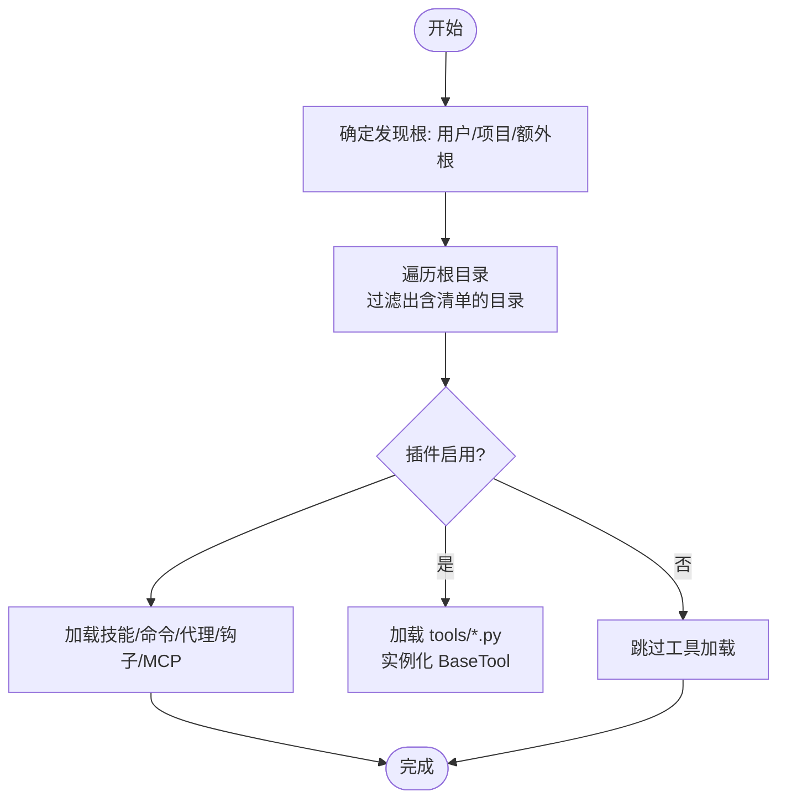
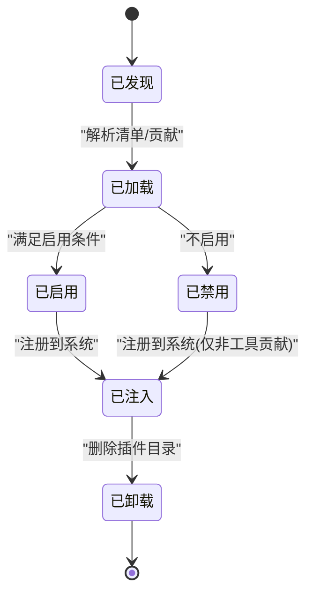
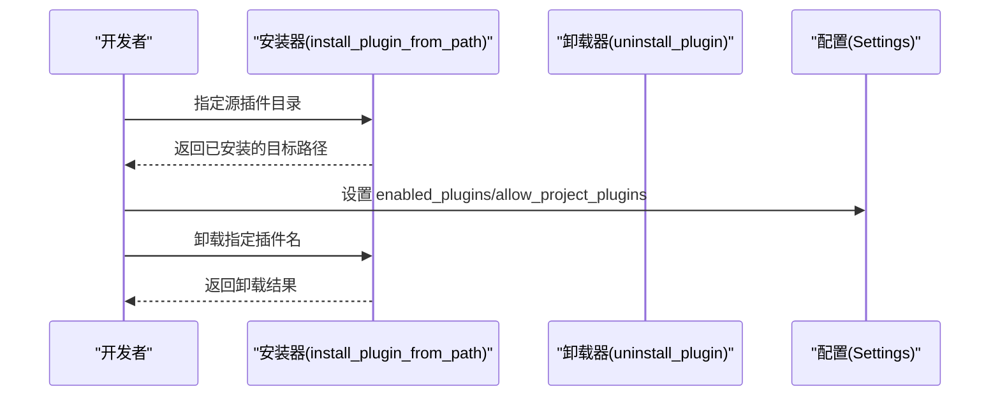
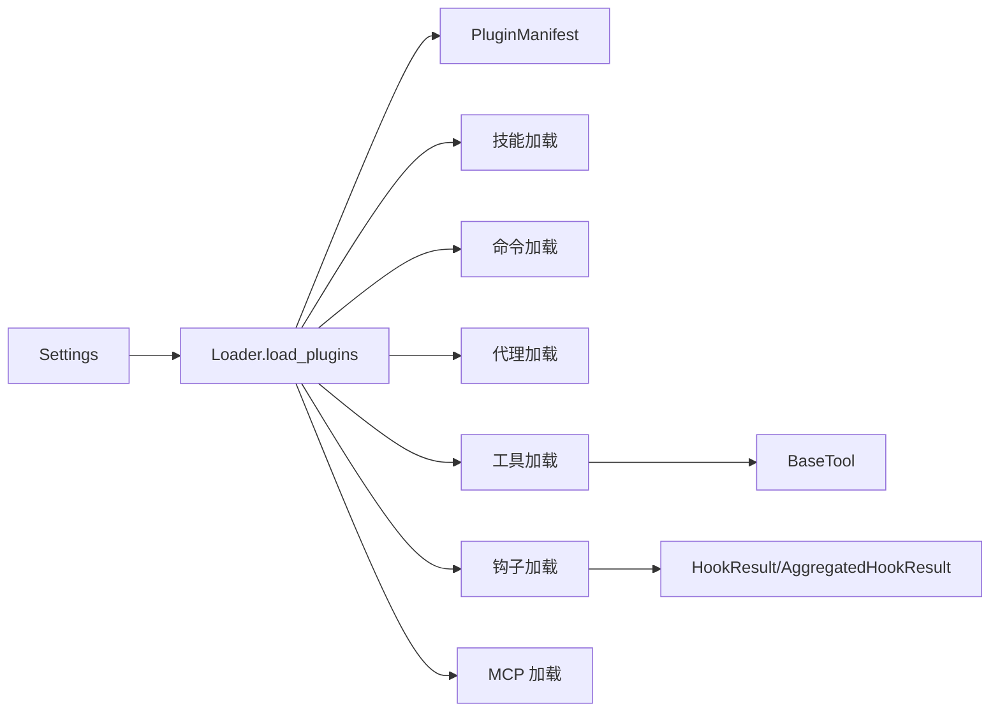

# 插件系统

<cite>
**本文引用的文件**
- [src/openharness/plugins/__init__.py](file://src/openharness/plugins/__init__.py)
- [src/openharness/plugins/loader.py](file://src/openharness/plugins/loader.py)
- [src/openharness/plugins/types.py](file://src/openharness/plugins/types.py)
- [src/openharness/plugins/schemas.py](file://src/openharness/plugins/schemas.py)
- [src/openharness/plugins/installer.py](file://src/openharness/plugins/installer.py)
- [src/openharness/hooks/__init__.py](file://src/openharness/hooks/__init__.py)
- [src/openharness/hooks/types.py](file://src/openharness/hooks/types.py)
- [src/openharness/mcp/__init__.py](file://src/openharness/mcp/__init__.py)
- [src/openharness/tools/base.py](file://src/openharness/tools/base.py)
- [src/openharness/skills/__init__.py](file://src/openharness/skills/__init__.py)
- [src/openharness/config/settings.py](file://src/openharness/config/settings.py)
- [tests/test_plugins/test_loader.py](file://tests/test_plugins/test_loader.py)
- [tests/test_plugins/test_lifecycle_flow.py](file://tests/test_plugins/test_lifecycle_flow.py)
</cite>

## 目录
1. [简介](#简介)
2. [项目结构](#项目结构)
3. [核心组件](#核心组件)
4. [架构总览](#架构总览)
5. [详细组件分析](#详细组件分析)
6. [依赖关系分析](#依赖关系分析)
7. [性能考量](#性能考量)
8. [故障排查指南](#故障排查指南)
9. [结论](#结论)
10. [附录](#附录)

## 简介
本文件系统化阐述 OpenHarness 的插件体系：插件发现与加载、生命周期管理、插件类型（命令、钩子、代理、MCP 服务器）、安装与管理、与 claude-code 生态的兼容与迁移、开发规范与最佳实践，以及测试与调试建议。目标是帮助开发者快速理解并高效扩展 OpenHarness 的能力边界。

## 项目结构
OpenHarness 将“插件”视为可发现、可加载、可启用的扩展单元，支持多来源（用户级、项目级）与多种贡献类型（技能、命令、代理、工具、钩子、MCP 服务器）。插件系统的核心位于 plugins 子模块，并与 hooks、mcp、tools、skills 等子系统协同工作。

图表来源
- [src/openharness/plugins/__init__.py:1-54](file://src/openharness/plugins/__init__.py#L1-L54)
- [src/openharness/plugins/loader.py:1-731](file://src/openharness/plugins/loader.py#L1-L731)
- [src/openharness/plugins/types.py:1-60](file://src/openharness/plugins/types.py#L1-L60)
- [src/openharness/plugins/schemas.py:1-25](file://src/openharness/plugins/schemas.py#L1-L25)
- [src/openharness/plugins/installer.py:1-40](file://src/openharness/plugins/installer.py#L1-L40)
- [src/openharness/hooks/__init__.py:1-51](file://src/openharness/hooks/__init__.py#L1-L51)
- [src/openharness/hooks/types.py:1-39](file://src/openharness/hooks/types.py#L1-L39)
- [src/openharness/mcp/__init__.py:1-80](file://src/openharness/mcp/__init__.py#L1-L80)
- [src/openharness/tools/base.py:1-81](file://src/openharness/tools/base.py#L1-L81)
- [src/openharness/skills/__init__.py:1-45](file://src/openharness/skills/__init__.py#L1-L45)
- [src/openharness/config/settings.py:496-526](file://src/openharness/config/settings.py#L496-L526)

章节来源
- [src/openharness/plugins/__init__.py:1-54](file://src/openharness/plugins/__init__.py#L1-L54)
- [src/openharness/plugins/loader.py:1-731](file://src/openharness/plugins/loader.py#L1-L731)
- [src/openharness/config/settings.py:496-526](file://src/openharness/config/settings.py#L496-L526)

## 核心组件
- 插件清单模型：用于描述插件元数据与贡献路径，默认字段包括名称、版本、描述、默认启用状态、各子资源目录名等。
- 已加载插件对象：封装清单、路径、启用状态及所有贡献项（技能、命令、代理、工具、钩子、MCP 服务器）。
- 插件命令定义：标准化命令条目，支持前端展示、权限控制与模型选择等。
- 插件发现与加载：从用户与项目根目录扫描插件，解析清单，按需加载技能、命令、代理、工具、钩子、MCP 配置。
- 安装与卸载：将本地插件目录复制到用户插件目录，或删除；提供安全校验防止路径穿越。

章节来源
- [src/openharness/plugins/schemas.py:8-25](file://src/openharness/plugins/schemas.py#L8-L25)
- [src/openharness/plugins/types.py:18-60](file://src/openharness/plugins/types.py#L18-L60)
- [src/openharness/plugins/loader.py:107-162](file://src/openharness/plugins/loader.py#L107-L162)
- [src/openharness/plugins/installer.py:23-40](file://src/openharness/plugins/installer.py#L23-L40)

## 架构总览
下图展示了插件从发现到加载、再到与其他子系统协作的整体流程。

图表来源
- [src/openharness/plugins/loader.py:107-162](file://src/openharness/plugins/loader.py#L107-L162)
- [src/openharness/plugins/schemas.py:8-25](file://src/openharness/plugins/schemas.py#L8-L25)
- [src/openharness/config/settings.py:519-520](file://src/openharness/config/settings.py#L519-L520)

## 详细组件分析

### 插件发现与加载流程
- 发现范围：用户插件目录（~/.openharness/plugins）与项目插件目录（./.openharness/plugins），支持额外根目录传入。
- 清单定位：优先在插件根目录与 .claude-plugin 子目录查找 plugin.json。
- 启用策略：以清单中的默认启用状态为准，同时受 Settings 中 enabled_plugins 覆盖；项目插件默认禁用，除非显式开启。
- 资源加载：
  - 技能：遵循 claude-code 的 SKILL.md 布局，支持直接目录或嵌套子目录。
  - 命令：支持 commands 目录扫描与清单中 commands 字段声明两种方式；支持 frontmatter 元信息与命名空间拼接。
  - 代理：支持 agents 目录扫描与清单中 agents 字段声明；支持命名空间与多层目录。
  - 工具：仅当插件启用时才加载 tools/*.py 中的 BaseTool 子类实例。
  - 钩子：支持 hooks.json（扁平）与 hooks 目录结构化 hooks.json（含 matcher 与变量替换）。
  - MCP：支持 mcp.json 与 .mcp.json，解析为 McpServerConfig 映射。

图表来源
- [src/openharness/plugins/loader.py:61-104](file://src/openharness/plugins/loader.py#L61-L104)
- [src/openharness/plugins/loader.py:126-162](file://src/openharness/plugins/loader.py#L126-L162)
- [src/openharness/plugins/loader.py:691-731](file://src/openharness/plugins/loader.py#L691-L731)

章节来源
- [src/openharness/plugins/loader.py:61-104](file://src/openharness/plugins/loader.py#L61-L104)
- [src/openharness/plugins/loader.py:107-162](file://src/openharness/plugins/loader.py#L107-L162)
- [src/openharness/plugins/loader.py:691-731](file://src/openharness/plugins/loader.py#L691-L731)

### 插件类型与贡献点
- 命令插件：通过 commands 目录或清单声明，支持 frontmatter 元信息（描述、参数提示、模型、是否允许模型调用等），最终生成可执行的命令定义。
- 钩子插件：通过 hooks.json 或 hooks 目录结构化配置，支持事件类型（命令、提示、HTTP、代理）与匹配器，用于拦截与增强行为。
- 代理插件：通过 agents 目录或清单声明，支持丰富的代理配置（工具集、权限模式、记忆域、隔离模式、初始提示、关键提醒等）。
- MCP 服务器插件：通过 mcp.json/.mcp.json 声明，支持标准/STDIO/WebSocket 等连接方式，便于外部资源接入。
- 代理插件：通过 skills 目录或清单声明，遵循 claude-code 的 SKILL.md 规范，支持用户可触发与模型可调用开关。

章节来源
- [src/openharness/plugins/loader.py:320-477](file://src/openharness/plugins/loader.py#L320-L477)
- [src/openharness/plugins/loader.py:479-618](file://src/openharness/plugins/loader.py#L479-L618)
- [src/openharness/plugins/loader.py:621-677](file://src/openharness/plugins/loader.py#L621-L677)
- [src/openharness/plugins/loader.py:680-689](file://src/openharness/plugins/loader.py#L680-L689)
- [src/openharness/plugins/loader.py:251-307](file://src/openharness/plugins/loader.py#L251-L307)

### 生命周期管理
- 发现阶段：根据配置决定允许的插件来源，扫描候选目录。
- 加载阶段：解析清单、合并 frontmatter 与清单元信息、构建贡献对象。
- 启用阶段：依据 Settings 的 enabled_plugins 与清单默认值决定是否加载工具。
- 协同阶段：将 LoadedPlugin 注入技能注册表、钩子注册表、MCP 客户端管理器等。
- 卸载阶段：移除用户插件目录中的对应子目录。

图表来源
- [src/openharness/plugins/loader.py:107-162](file://src/openharness/plugins/loader.py#L107-L162)
- [src/openharness/plugins/installer.py:33-40](file://src/openharness/plugins/installer.py#L33-L40)

章节来源
- [src/openharness/plugins/loader.py:107-162](file://src/openharness/plugins/loader.py#L107-L162)
- [src/openharness/plugins/installer.py:33-40](file://src/openharness/plugins/installer.py#L33-L40)

### 安装与管理流程
- 安装：将源插件目录复制到用户插件根目录，确保唯一性与原子性。
- 卸载：按名称解析到用户插件根目录的直接子目录，进行安全校验后删除。
- 启用机制：通过 Settings 的 enabled_plugins 字典覆盖具体插件的默认启用状态；项目插件默认关闭，除非显式开启 allow_project_plugins。

图表来源
- [src/openharness/plugins/installer.py:23-40](file://src/openharness/plugins/installer.py#L23-L40)
- [src/openharness/config/settings.py:519-520](file://src/openharness/config/settings.py#L519-L520)

章节来源
- [src/openharness/plugins/installer.py:23-40](file://src/openharness/plugins/installer.py#L23-L40)
- [src/openharness/config/settings.py:519-520](file://src/openharness/config/settings.py#L519-L520)

### claude-code 生态兼容与迁移
- 清单兼容：插件清单支持 claude-code 的 SKILL.md 布局与 frontmatter 元信息，便于复用现有技能资产。
- 目录布局：skills、commands、agents 目录与 claude-code 一致，便于迁移。
- 迁移建议：
  - 将 SKILL.md 放置于 skills 或其子目录；
  - 将命令文件放置于 commands 目录或通过清单 commands 字段声明；
  - 将代理定义放置于 agents 目录或通过清单 agents 字段声明；
  - 如需工具，请在 tools 目录下实现 BaseTool 子类并在插件启用时自动加载。

章节来源
- [src/openharness/plugins/loader.py:251-307](file://src/openharness/plugins/loader.py#L251-L307)
- [src/openharness/plugins/loader.py:320-477](file://src/openharness/plugins/loader.py#L320-L477)
- [src/openharness/plugins/loader.py:479-618](file://src/openharness/plugins/loader.py#L479-L618)
- [src/openharness/plugins/loader.py:691-731](file://src/openharness/plugins/loader.py#L691-L731)

### 开发规范与接口实现
- 插件目录结构（建议）：plugin.json、skills/、commands/、agents/、tools/、hooks.json 或 hooks/、mcp.json 或 .mcp.json。
- 清单字段：name、version、description、enabled_by_default、skills_dir、tools_dir、hooks_file、mcp_file、commands、agents、skills、hooks 等。
- 命令定义：frontmatter 支持 description、argument-hint、model、user-invocable、disable-model-invocation 等键。
- 工具实现：继承 BaseTool，实现 execute 方法与输入模型，注册到工具注册表后可被系统使用。
- 钩子实现：在 hooks.json 或 hooks 目录结构化配置中声明事件与动作，支持匹配器与超时控制。

章节来源
- [src/openharness/plugins/schemas.py:8-25](file://src/openharness/plugins/schemas.py#L8-L25)
- [src/openharness/plugins/loader.py:425-477](file://src/openharness/plugins/loader.py#L425-L477)
- [src/openharness/tools/base.py:35-58](file://src/openharness/tools/base.py#L35-L58)
- [src/openharness/hooks/__init__.py:24-50](file://src/openharness/hooks/__init__.py#L24-L50)

### 自定义插件开发指南
- 创建插件目录与清单：编写 plugin.json，设置 name、enabled_by_default 等。
- 定义命令：在 commands 下创建命令文件（支持 SKILL.md 与普通 Markdown），frontmatter 提供描述与参数提示。
- 实现工具：在 tools 下实现 BaseTool 子类，确保 name/description/input_model 正确，execute 返回 ToolResult。
- 定义代理：在 agents 下创建代理定义文件，frontmatter 提供工具、权限、记忆、隔离等配置。
- 配置钩子：在 hooks.json 或 hooks 目录结构化配置中声明事件与动作。
- 配置 MCP：在 mcp.json 或 .mcp.json 中声明服务器配置。

章节来源
- [src/openharness/plugins/loader.py:320-477](file://src/openharness/plugins/loader.py#L320-L477)
- [src/openharness/plugins/loader.py:479-618](file://src/openharness/plugins/loader.py#L479-L618)
- [src/openharness/plugins/loader.py:621-677](file://src/openharness/plugins/loader.py#L621-L677)
- [src/openharness/plugins/loader.py:680-689](file://src/openharness/plugins/loader.py#L680-L689)
- [src/openharness/tools/base.py:35-58](file://src/openharness/tools/base.py#L35-L58)

### 测试与调试最佳实践
- 单元测试：验证插件发现、加载、启用、工具导入、钩子注册、MCP 配置等关键路径。
- 集成测试：模拟安装、加载、连接 MCP、执行工具与技能的完整流程。
- 调试技巧：
  - 关注日志输出，尤其是加载失败与工具实例化异常；
  - 使用最小化插件结构验证流程；
  - 在 Settings 中临时开启 allow_project_plugins 以验证项目插件加载。

章节来源
- [tests/test_plugins/test_loader.py:106-222](file://tests/test_plugins/test_loader.py#L106-L222)
- [tests/test_plugins/test_lifecycle_flow.py:55-110](file://tests/test_plugins/test_lifecycle_flow.py#L55-L110)

## 依赖关系分析
- 插件加载器依赖配置系统（Settings）以决定启用范围与覆盖项。
- 插件加载器依赖技能、钩子、MCP、工具等子系统的解析与注册能力。
- 工具系统提供统一的 BaseTool 接口，使插件工具可被系统统一调度。
- 钩子系统提供事件驱动的拦截与增强能力，插件可通过 hooks.json 或 hooks 目录结构化配置参与。

图表来源
- [src/openharness/config/settings.py:519-520](file://src/openharness/config/settings.py#L519-L520)
- [src/openharness/plugins/loader.py:107-162](file://src/openharness/plugins/loader.py#L107-L162)
- [src/openharness/tools/base.py:35-58](file://src/openharness/tools/base.py#L35-L58)
- [src/openharness/hooks/types.py:9-39](file://src/openharness/hooks/types.py#L9-L39)

章节来源
- [src/openharness/plugins/loader.py:107-162](file://src/openharness/plugins/loader.py#L107-L162)
- [src/openharness/tools/base.py:35-58](file://src/openharness/tools/base.py#L35-L58)
- [src/openharness/hooks/types.py:9-39](file://src/openharness/hooks/types.py#L9-L39)

## 性能考量
- 插件扫描与解析：避免在大型仓库中频繁扫描不必要的目录，合理使用 extra_roots 与 Settings 的启用范围。
- 工具加载：仅在插件启用时加载 tools，减少不必要的模块导入与实例化开销。
- 日志与错误处理：对加载失败与工具实例化异常进行降级记录，避免阻塞主流程。
- MCP 连接：延迟连接与重连策略，避免在插件加载阶段阻塞。

## 故障排查指南
- 无法发现插件：确认插件目录存在 plugin.json 或 .claude-plugin/plugin.json，且不在禁用范围内。
- 项目插件未加载：检查 Settings.allow_project_plugins 是否为 true。
- 工具未生效：确认插件 enabled_by_default 为 true，或 Settings.enabled_plugins 中已启用该插件。
- 钩子未触发：检查 hooks.json 或 hooks 目录结构化配置的事件名与匹配器是否正确。
- MCP 未连接：检查 mcp.json/.mcp.json 的配置与可执行路径，确认连接类型与参数正确。

章节来源
- [src/openharness/plugins/loader.py:107-162](file://src/openharness/plugins/loader.py#L107-L162)
- [src/openharness/plugins/loader.py:621-677](file://src/openharness/plugins/loader.py#L621-L677)
- [src/openharness/plugins/loader.py:680-689](file://src/openharness/plugins/loader.py#L680-L689)
- [src/openharness/config/settings.py:519-520](file://src/openharness/config/settings.py#L519-L520)

## 结论
OpenHarness 的插件系统以清单驱动、按需加载为核心设计，兼容 claude-code 的技能与命令布局，提供命令、钩子、代理、工具与 MCP 服务器等多维贡献点。通过 Settings 的启用控制与安装器的简单操作，开发者可以快速扩展系统能力并进行安全可控的集成。

## 附录
- 快速参考
  - 插件清单字段：name、version、description、enabled_by_default、skills_dir、tools_dir、hooks_file、mcp_file、commands、agents、skills、hooks
  - 命令 frontmatter 常用键：description、argument-hint、model、user-invocable、disable-model-invocation
  - 工具基类：BaseTool，需实现 execute 与输入模型
  - 钩子结果：HookResult、AggregatedHookResult
  - MCP 导出：McpClientManager、McpServerConfig 等

章节来源
- [src/openharness/plugins/schemas.py:8-25](file://src/openharness/plugins/schemas.py#L8-L25)
- [src/openharness/plugins/loader.py:425-477](file://src/openharness/plugins/loader.py#L425-L477)
- [src/openharness/tools/base.py:35-58](file://src/openharness/tools/base.py#L35-L58)
- [src/openharness/hooks/types.py:9-39](file://src/openharness/hooks/types.py#L9-L39)
- [src/openharness/mcp/__init__.py:35-79](file://src/openharness/mcp/__init__.py#L35-L79)