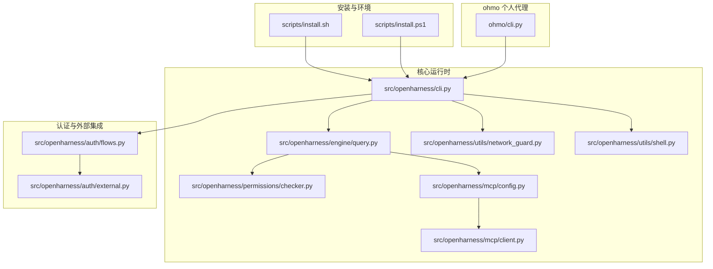
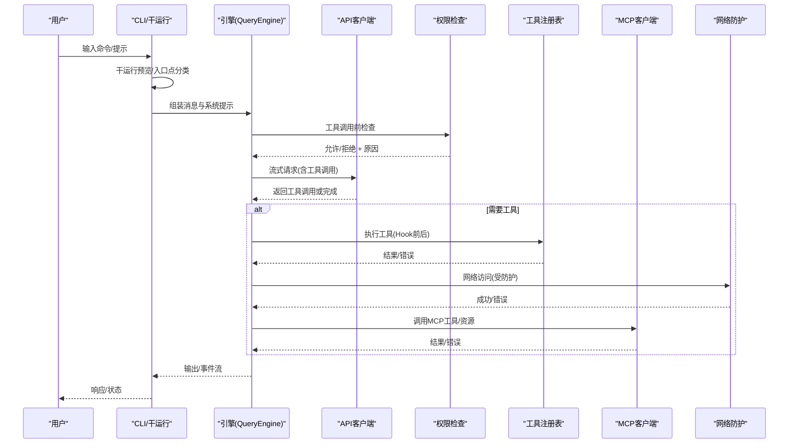
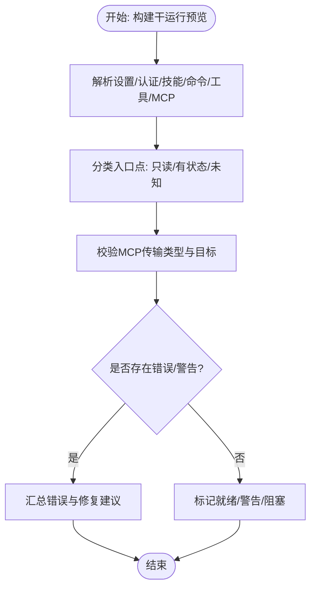
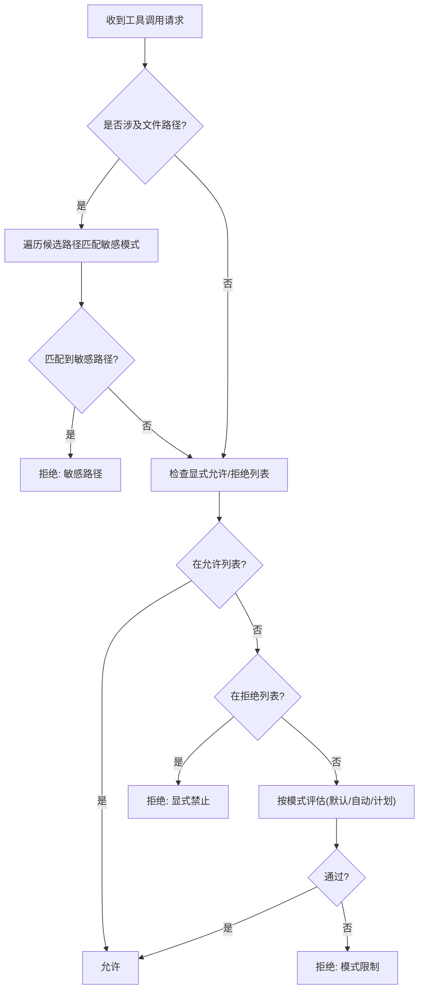
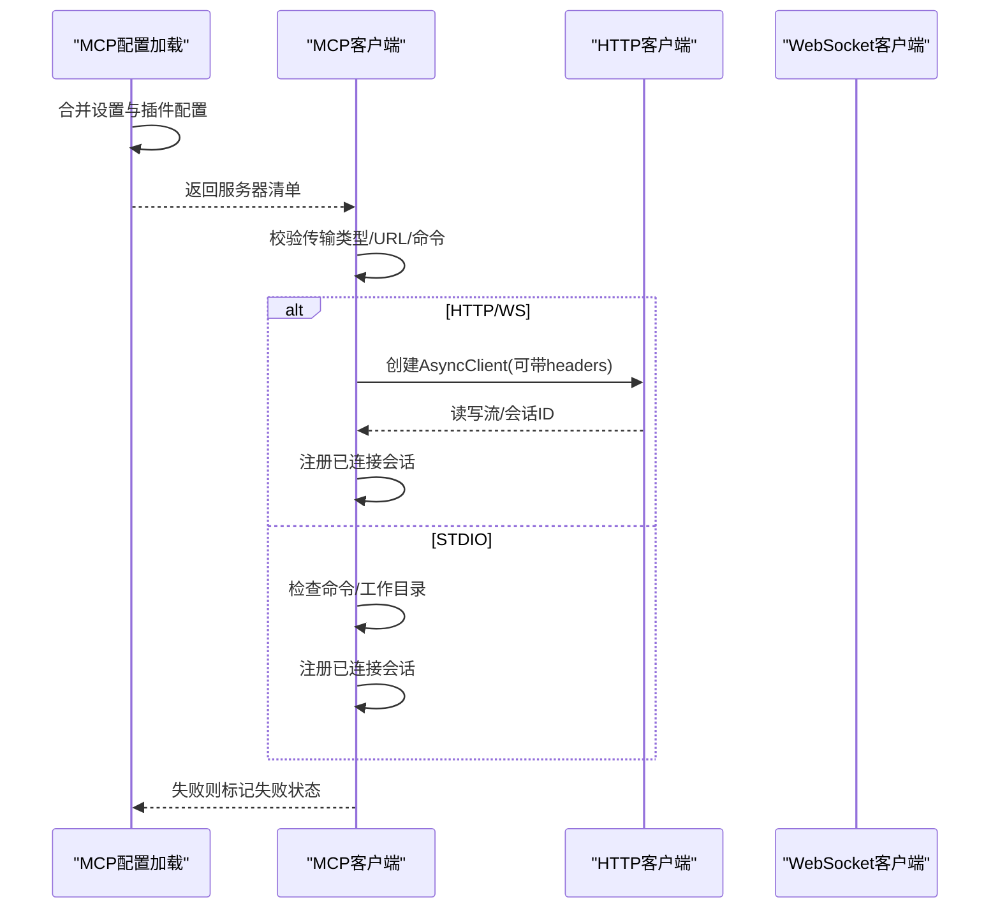
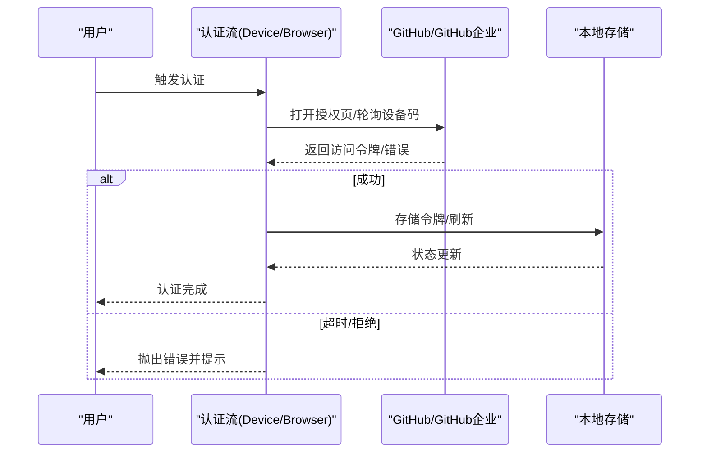
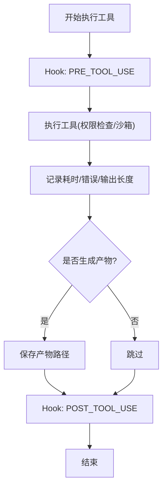
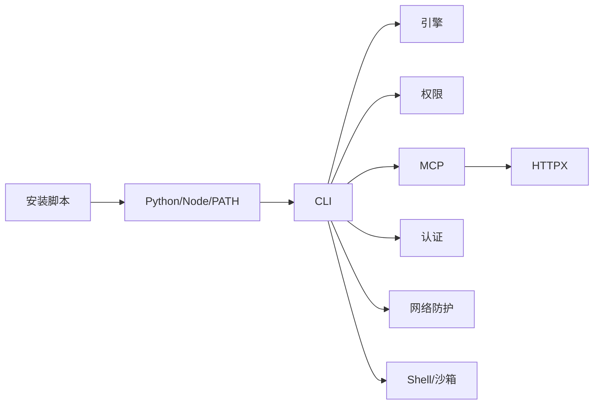

# 故障排除

<cite>
**本文引用的文件**
- [README.md](file://README.md)
- [CONTRIBUTING.md](file://CONTRIBUTING.md)
- [scripts/install.sh](file://scripts/install.sh)
- [scripts/install.ps1](file://scripts/install.ps1)
- [src/openharness/cli.py](file://src/openharness/cli.py)
- [src/openharness/utils/network_guard.py](file://src/openharness/utils/network_guard.py)
- [src/openharness/mcp/client.py](file://src/openharness/mcp/client.py)
- [src/openharness/mcp/config.py](file://src/openharness/mcp/config.py)
- [src/openharness/permissions/checker.py](file://src/openharness/permissions/checker.py)
- [src/openharness/auth/flows.py](file://src/openharness/auth/flows.py)
- [src/openharness/auth/external.py](file://src/openharness/auth/external.py)
- [src/openharness/engine/query.py](file://src/openharness/engine/query.py)
- [src/openharness/utils/shell.py](file://src/openharness/utils/shell.py)
- [tests/test_auth/test_external.py](file://tests/test_auth/test_external.py)
- [tests/test_commands/test_cli.py](file://tests/test_commands/test_cli.py)
- [tests/test_permissions/test_checker.py](file://tests/test_permissions/test_checker.py)
- [tests/test_api/test_copilot_auth.py](file://tests/test_api/test_copilot_auth.py)
- [tests/test_real_large_tasks.py](file://tests/test_real_large_tasks.py)
- [ohmo/cli.py](file://ohmo/cli.py)
</cite>

## 目录
1. [简介](#简介)
2. [项目结构](#项目结构)
3. [核心组件](#核心组件)
4. [架构总览](#架构总览)
5. [详细组件分析](#详细组件分析)
6. [依赖关系分析](#依赖关系分析)
7. [性能考量](#性能考量)
8. [故障排除指南](#故障排除指南)
9. [结论](#结论)
10. [附录](#附录)

## 简介
本指南面向使用 OpenHarness 的用户与维护者，系统化地梳理安装、配置、运行时与性能问题的排查流程与解决方案。内容覆盖：
- 安装与环境准备（Linux/macOS/Windows）
- 配置与认证（Provider、API 认证、MCP 服务器）
- 运行时故障（网络、权限、工具执行、ohmo 网关）
- 性能问题（并发、上下文压缩、工具输出大对象）
- 平台特有问题（Windows 别名冲突、WSL bash 可用性）
- 日志与错误解读、调试技巧与社区支持渠道
- 预防性维护与最佳实践

## 项目结构
OpenHarness 采用模块化子系统设计，核心子系统包括引擎、工具、技能、插件、权限、钩子、命令、MCP、记忆、任务、协调器、提示、配置、UI 等。安装脚本负责环境检测、虚拟环境与可执行链接、前端依赖安装与 PATH 注册。

图示来源
- [scripts/install.sh:1-388](file://scripts/install.sh#L1-L388)
- [scripts/install.ps1:1-330](file://scripts/install.ps1#L1-L330)
- [src/openharness/cli.py:1-200](file://src/openharness/cli.py#L1-L200)
- [src/openharness/engine/query.py:964-1001](file://src/openharness/engine/query.py#L964-L1001)
- [src/openharness/permissions/checker.py:79-107](file://src/openharness/permissions/checker.py#L79-L107)
- [src/openharness/mcp/config.py:1-16](file://src/openharness/mcp/config.py#L1-L16)
- [src/openharness/mcp/client.py:198-234](file://src/openharness/mcp/client.py#L198-L234)
- [src/openharness/utils/network_guard.py:78-127](file://src/openharness/utils/network_guard.py#L78-L127)
- [src/openharness/utils/shell.py:1-148](file://src/openharness/utils/shell.py#L1-L148)
- [src/openharness/auth/flows.py:133-189](file://src/openharness/auth/flows.py#L133-L189)
- [src/openharness/auth/external.py:420-452](file://src/openharness/auth/external.py#L420-L452)
- [ohmo/cli.py:194-222](file://ohmo/cli.py#L194-L222)

章节来源
- [README.md:197-444](file://README.md#L197-L444)
- [scripts/install.sh:1-388](file://scripts/install.sh#L1-L388)
- [scripts/install.ps1:1-330](file://scripts/install.ps1#L1-L330)

## 核心组件
- CLI 与干运行（Dry Run）：提供安全预览、入口点分类、MCP 配置校验与可读性建议。
- 引擎与工具执行：单次循环、流式响应、工具调用、Hook 生命周期、成本与令牌统计。
- 权限检查：内置敏感路径保护、显式允许/拒绝列表、模式控制。
- MCP：合并设置与插件配置、HTTP/WS/STDIO 传输、连接失败标记。
- 认证：设备码/浏览器流、OAuth 刷新、外部绑定（Claude/Codex）。
- 网络防护：重定向上限、主机解析、失败兜底。
- Shell 与沙箱：跨平台 shell 解析、PTY 包装、Docker 后端路由。
- ohmo：个人代理网关配置向导、通道启用与重启。

章节来源
- [src/openharness/cli.py:585-639](file://src/openharness/cli.py#L585-L639)
- [src/openharness/engine/query.py:964-1001](file://src/openharness/engine/query.py#L964-L1001)
- [src/openharness/permissions/checker.py:79-107](file://src/openharness/permissions/checker.py#L79-L107)
- [src/openharness/mcp/config.py:1-16](file://src/openharness/mcp/config.py#L1-L16)
- [src/openharness/mcp/client.py:198-234](file://src/openharness/mcp/client.py#L198-L234)
- [src/openharness/auth/flows.py:133-189](file://src/openharness/auth/flows.py#L133-L189)
- [src/openharness/auth/external.py:420-452](file://src/openharness/auth/external.py#L420-L452)
- [src/openharness/utils/network_guard.py:78-127](file://src/openharness/utils/network_guard.py#L78-L127)
- [src/openharness/utils/shell.py:1-148](file://src/openharness/utils/shell.py#L1-L148)
- [ohmo/cli.py:194-222](file://ohmo/cli.py#L194-L222)

## 架构总览
下图展示从 CLI 到模型请求、工具执行与 MCP 的关键交互路径，以及权限与网络防护在其中的作用。

图示来源
- [src/openharness/cli.py:585-639](file://src/openharness/cli.py#L585-L639)
- [src/openharness/engine/query.py:964-1001](file://src/openharness/engine/query.py#L964-L1001)
- [src/openharness/permissions/checker.py:79-107](file://src/openharness/permissions/checker.py#L79-L107)
- [src/openharness/utils/network_guard.py:78-127](file://src/openharness/utils/network_guard.py#L78-L127)
- [src/openharness/mcp/client.py:198-234](file://src/openharness/mcp/client.py#L198-L234)

## 详细组件分析

### 干运行与入口点分类
- 干运行会汇总设置、认证状态、技能、命令、工具与 MCP 配置，并给出“就绪级别”与“下一步操作”。
- 入口点分为只读类与有状态类，便于判断是否需要模型调用或会话变更。

图示来源
- [src/openharness/cli.py:585-639](file://src/openharness/cli.py#L585-L639)
- [src/openharness/cli.py:89-122](file://src/openharness/cli.py#L89-L122)
- [src/openharness/cli.py:124-200](file://src/openharness/cli.py#L124-L200)

章节来源
- [src/openharness/cli.py:585-639](file://src/openharness/cli.py#L585-L639)
- [src/openharness/cli.py:89-122](file://src/openharness/cli.py#L89-L122)
- [src/openharness/cli.py:124-200](file://src/openharness/cli.py#L124-L200)
- [tests/test_commands/test_cli.py:362-391](file://tests/test_commands/test_cli.py#L362-L391)

### 权限检查与敏感路径保护
- 内置敏感路径保护对所有模式生效，阻止访问常见凭证位置。
- 支持显式允许/拒绝列表与模式控制，拒绝决策包含明确原因。

图示来源
- [src/openharness/permissions/checker.py:79-107](file://src/openharness/permissions/checker.py#L79-L107)
- [tests/test_permissions/test_checker.py:127-160](file://tests/test_permissions/test_checker.py#L127-L160)

章节来源
- [src/openharness/permissions/checker.py:79-107](file://src/openharness/permissions/checker.py#L79-L107)
- [tests/test_permissions/test_checker.py:127-160](file://tests/test_permissions/test_checker.py#L127-L160)

### MCP 配置加载与连接
- 合并设置与插件 MCP 配置；HTTP/WS/STDIO 传输分别进行有效性校验。
- 连接失败时记录失败状态与认证配置情况，便于定位。

图示来源
- [src/openharness/mcp/config.py:1-16](file://src/openharness/mcp/config.py#L1-L16)
- [src/openharness/cli.py:89-122](file://src/openharness/cli.py#L89-L122)
- [src/openharness/mcp/client.py:198-234](file://src/openharness/mcp/client.py#L198-L234)

章节来源
- [src/openharness/mcp/config.py:1-16](file://src/openharness/mcp/config.py#L1-L16)
- [src/openharness/cli.py:89-122](file://src/openharness/cli.py#L89-L122)
- [src/openharness/mcp/client.py:198-234](file://src/openharness/mcp/client.py#L198-L234)

### 认证流程与外部绑定
- 设备码/浏览器流等待授权，超时与非重试错误会抛出异常。
- 外部绑定刷新 OAuth 时若出现无效授权，给出明确指引。

图示来源
- [src/openharness/auth/flows.py:133-189](file://src/openharness/auth/flows.py#L133-L189)
- [tests/test_api/test_copilot_auth.py:230-277](file://tests/test_api/test_copilot_auth.py#L230-L277)
- [src/openharness/auth/external.py:420-452](file://src/openharness/auth/external.py#L420-L452)
- [tests/test_auth/test_external.py:284-457](file://tests/test_auth/test_external.py#L284-L457)

章节来源
- [src/openharness/auth/flows.py:133-189](file://src/openharness/auth/flows.py#L133-L189)
- [tests/test_api/test_copilot_auth.py:230-277](file://tests/test_api/test_copilot_auth.py#L230-L277)
- [src/openharness/auth/external.py:420-452](file://src/openharness/auth/external.py#L420-L452)
- [tests/test_auth/test_external.py:284-457](file://tests/test_auth/test_external.py#L284-L457)

### 工具执行与日志
- 引擎记录每次工具执行耗时、是否错误与输出长度，便于性能与问题定位。
- Hook 前后事件用于扩展行为与审计。

图示来源
- [src/openharness/engine/query.py:964-1001](file://src/openharness/engine/query.py#L964-L1001)

章节来源
- [src/openharness/engine/query.py:964-1001](file://src/openharness/engine/query.py#L964-L1001)

### Shell 与沙箱
- 跨平台选择最优 shell，Windows 优先 PowerShell/cmd，避免不可用的 WSL bash。
- Docker 后端可用时通过容器执行命令，失败可按配置抛出异常或回退。

章节来源
- [src/openharness/utils/shell.py:17-48](file://src/openharness/utils/shell.py#L17-L48)
- [src/openharness/utils/shell.py:51-105](file://src/openharness/utils/shell.py#L51-L105)
- [src/openharness/utils/shell.py:108-148](file://src/openharness/utils/shell.py#L108-L148)

### ohmo 网关配置
- 交互式启用/配置通道（Telegram/Slack/Discord/Feishu），支持重启网关。
- 通过配置文件持久化通道参数与策略。

章节来源
- [ohmo/cli.py:194-222](file://ohmo/cli.py#L194-L222)

## 依赖关系分析
- 安装脚本依赖 Python 3.10+、Node.js 18+（可选）、虚拟环境与 PATH 注册。
- CLI 依赖引擎、权限、MCP、认证、网络防护与 Shell 工具。
- MCP 客户端依赖 HTTPX 与传输配置。
- 权限检查独立于用户设置，内置敏感路径规则。

图示来源
- [scripts/install.sh:88-128](file://scripts/install.sh#L88-L128)
- [scripts/install.ps1:62-96](file://scripts/install.ps1#L62-L96)
- [src/openharness/mcp/client.py:220-226](file://src/openharness/mcp/client.py#L220-L226)

章节来源
- [scripts/install.sh:88-128](file://scripts/install.sh#L88-L128)
- [scripts/install.ps1:62-96](file://scripts/install.ps1#L62-L96)
- [src/openharness/mcp/client.py:220-226](file://src/openharness/mcp/client.py#L220-L226)

## 性能考量
- 上下文压缩与自动紧凑：长时间会话中保留任务状态与通道日志，减少频繁清理带来的中断。
- 并行工具执行：在权限与 Hook 允许的前提下提升吞吐。
- 工具输出大对象：可离线落盘并内联短输出，降低内存压力。
- 大型任务端到端测试：提供多场景组合的耗时参考，便于识别瓶颈。

章节来源
- [README.md:164-168](file://README.md#L164-L168)
- [src/openharness/engine/query.py:964-1001](file://src/openharness/engine/query.py#L964-L1001)
- [tests/test_real_large_tasks.py:748-780](file://tests/test_real_large_tasks.py#L748-L780)

## 故障排除指南

### 一、安装与环境问题
- 症状：命令不可用或版本查询失败
  - 检查 PATH 是否包含虚拟环境 bin 目录（Linux/macOS/WSL 与 Windows 用户级 PATH）。
  - 重新加载 shell 或重启终端以使 PATH 生效。
  - 使用模块方式验证安装：python -m openharness --version。
- 症状：oh 命令在 Windows 中被 Out-Host 别名覆盖
  - 使用 openh 或 openharness 启动；或在 PowerShell 中使用 oh.exe。
- 症状：Node.js 版本过低导致 React TUI 不可用
  - 升级 Node.js 至 18+，或忽略 TUI 仅使用 CLI。

章节来源
- [scripts/install.sh:292-313](file://scripts/install.sh#L292-L313)
- [scripts/install.ps1:257-305](file://scripts/install.ps1#L257-L305)
- [README.md:221-222](file://README.md#L221-L222)

### 二、配置与认证问题
- 症状：Provider/认证状态异常
  - 使用认证状态命令查看各认证源与 Provider 配置状态。
  - 若为外部绑定（如 Claude/Codex），确认本地凭据存在且未过期。
- 症状：Copilot 登录超时或被拒绝
  - 设备码轮询超时会抛出运行时错误；用户需在浏览器完成授权或检查网络。
  - 非重试错误（如用户拒绝）会直接报错，需重新发起登录。
- 症状：ohmo 渠道无法启动或无响应
  - 通过配置向导启用/重配通道，必要时重启网关进程。

章节来源
- [src/openharness/cli.py:1823-1850](file://src/openharness/cli.py#L1823-L1850)
- [src/openharness/auth/flows.py:133-189](file://src/openharness/auth/flows.py#L133-L189)
- [tests/test_api/test_copilot_auth.py:247-277](file://tests/test_api/test_copilot_auth.py#L247-L277)
- [src/openharness/auth/external.py:420-452](file://src/openharness/auth/external.py#L420-L452)
- [tests/test_auth/test_external.py:284-457](file://tests/test_auth/test_external.py#L284-L457)
- [ohmo/cli.py:194-222](file://ohmo/cli.py#L194-L222)

### 三、运行时故障
- 症状：工具执行被拒
  - 查看权限决策原因，确认是否命中敏感路径或显式拒绝。
  - 在合适模式下调整策略或添加允许规则。
- 症状：MCP 服务器无法连接
  - 干运行会报告 MCP 服务器状态与具体问题（如命令不存在、URL 不合法）。
  - 按提示修复命令/路径/URL 或禁用问题服务器。
- 症状：网络请求失败或重定向过多
  - 网络防护会限制重定向次数并解析主机地址；检查 DNS、代理与目标可达性。
- 症状：Shell 命令在 Windows 下失败
  - 避免使用不可用的 WSL bash；优先 PowerShell/cmd。
  - Docker 后端不可用时按配置决定回退或报错。

章节来源
- [src/openharness/permissions/checker.py:79-107](file://src/openharness/permissions/checker.py#L79-L107)
- [src/openharness/cli.py:89-122](file://src/openharness/cli.py#L89-L122)
- [src/openharness/utils/network_guard.py:78-127](file://src/openharness/utils/network_guard.py#L78-L127)
- [src/openharness/utils/shell.py:17-48](file://src/openharness/utils/shell.py#L17-L48)
- [src/openharness/utils/shell.py:124-148](file://src/openharness/utils/shell.py#L124-L148)

### 四、性能问题
- 症状：长时间会话占用高
  - 启用自动紧凑与持久化记忆，减少上下文膨胀。
- 症状：工具输出过大导致内存压力
  - 将大输出落盘并通过内联短摘要返回，避免一次性加载。
- 症状：并发工具执行慢
  - 检查权限与 Hook 开销；在允许范围内并行执行。

章节来源
- [README.md:164-168](file://README.md#L164-L168)
- [src/openharness/engine/query.py:964-1001](file://src/openharness/engine/query.py#L964-L1001)

### 五、日志分析与错误解读
- 干运行输出包含“就绪级别”“下一步操作”“入口点类型/细节”“设置概览”等，优先按建议修复认证或 MCP 配置。
- 工具执行日志包含耗时、是否错误与输出长度，便于定位慢工具或错误工具。
- 认证轮询错误包含超时与非重试错误两类，前者可通过延长超时或重试，后者需用户干预。

章节来源
- [src/openharness/cli.py:585-639](file://src/openharness/cli.py#L585-L639)
- [src/openharness/engine/query.py:964-1001](file://src/openharness/engine/query.py#L964-L1001)
- [tests/test_api/test_copilot_auth.py:247-277](file://tests/test_api/test_copilot_auth.py#L247-L277)

### 六、平台特有问题
- Windows
  - oh 命令别名冲突：使用 openh 或 openharness；或使用 oh.exe。
  - PATH 更新后需重启终端或刷新环境变量。
- WSL/WSL2
  - bash 可能不可用：脚本会检测并回退到 PowerShell/cmd。
- macOS/Linux
  - Node.js 18+ 为可选项；若缺失，TUI 将被跳过但不影响 CLI。

章节来源
- [scripts/install.ps1:257-305](file://scripts/install.ps1#L257-L305)
- [scripts/install.sh:150-179](file://scripts/install.sh#L150-L179)
- [src/openharness/utils/shell.py:124-148](file://src/openharness/utils/shell.py#L124-L148)

### 七、网络连接与 API 认证
- 网络
  - 重定向过多会被拦截；检查目标 URL 与中间层代理。
  - 主机解析失败会抛出错误，检查 DNS 与防火墙。
- API 认证
  - Copilot 设备码轮询遵循服务端 interval；超时与拒绝会抛出异常。
  - 外部绑定刷新失败提示无效或过期，需重新登录官方 CLI 并再试。

章节来源
- [src/openharness/utils/network_guard.py:78-127](file://src/openharness/utils/network_guard.py#L78-L127)
- [src/openharness/auth/flows.py:133-189](file://src/openharness/auth/flows.py#L133-L189)
- [src/openharness/auth/external.py:420-452](file://src/openharness/auth/external.py#L420-L452)

### 八、权限问题
- 敏感路径保护：.ssh、.aws、.docker 等路径在任何模式下均被阻止。
- 显式允许/拒绝：根据团队策略配置工具白名单/黑名单。
- 模式控制：默认/自动/计划模式影响工具执行范围。

章节来源
- [src/openharness/permissions/checker.py:79-107](file://src/openharness/permissions/checker.py#L79-L107)
- [tests/test_permissions/test_checker.py:135-160](file://tests/test_permissions/test_checker.py#L135-L160)

### 九、ohmo 通道与网关
- 启用/重配通道：通过交互式向导输入令牌与策略，必要时重启网关。
- 状态检查：确认运行状态与 PID，按需重启。

章节来源
- [ohmo/cli.py:194-222](file://ohmo/cli.py#L194-L222)
- [tests/test_ohmo/test_cli.py:151-179](file://tests/test_ohmo/test_cli.py#L151-L179)

### 十、调试技巧与最佳实践
- 使用干运行快速定位配置与入口点问题。
- 逐步缩小范围：先检查认证与 MCP，再检查权限与网络。
- 记录工具耗时与错误，结合 Hook 事件定位异常。
- 对大型任务进行分步执行与结果验证，复现实验场景。

章节来源
- [src/openharness/cli.py:585-639](file://src/openharness/cli.py#L585-L639)
- [src/openharness/engine/query.py:964-1001](file://src/openharness/engine/query.py#L964-L1001)

## 结论
通过干运行、权限与网络防护、MCP 配置校验、认证流程与 Shell/沙箱适配，OpenHarness 提供了系统化的故障定位与修复路径。建议在日常使用中：
- 定期使用干运行预检
- 明确权限边界与敏感路径策略
- 保持 Node.js/Python/Provider 凭据最新
- 对大型任务进行分阶段验证与监控

## 附录

### 社区支持与问题报告
- 使用 Issue 模板提交问题，附带环境信息、命令与错误输出。
- 文档与维护相关需求请明确标注，便于归类为文档类 PR。

章节来源
- [CONTRIBUTING.md:63-69](file://CONTRIBUTING.md#L63-L69)