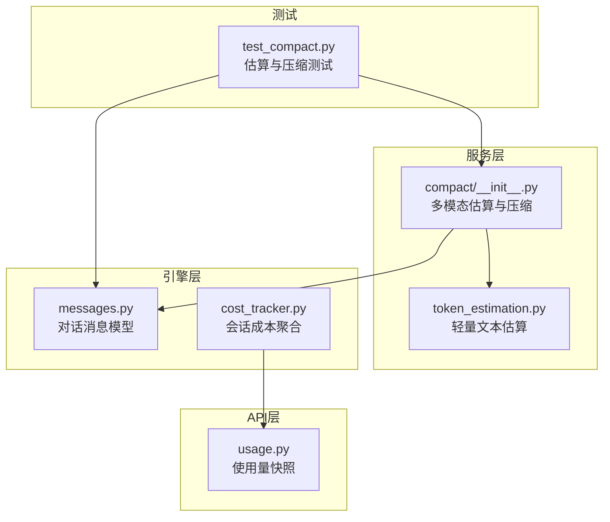
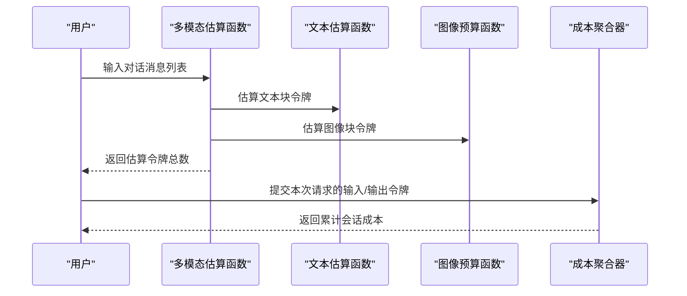
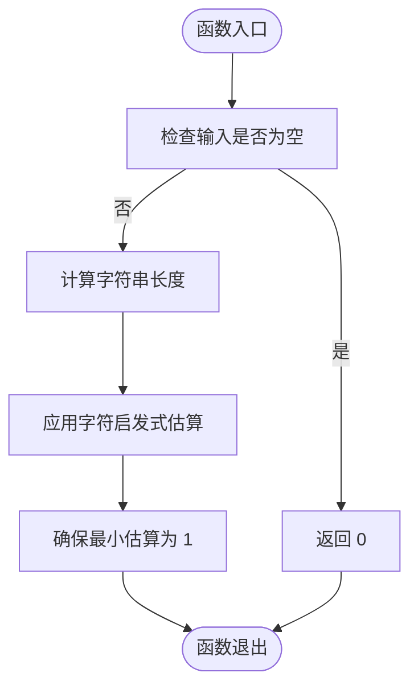
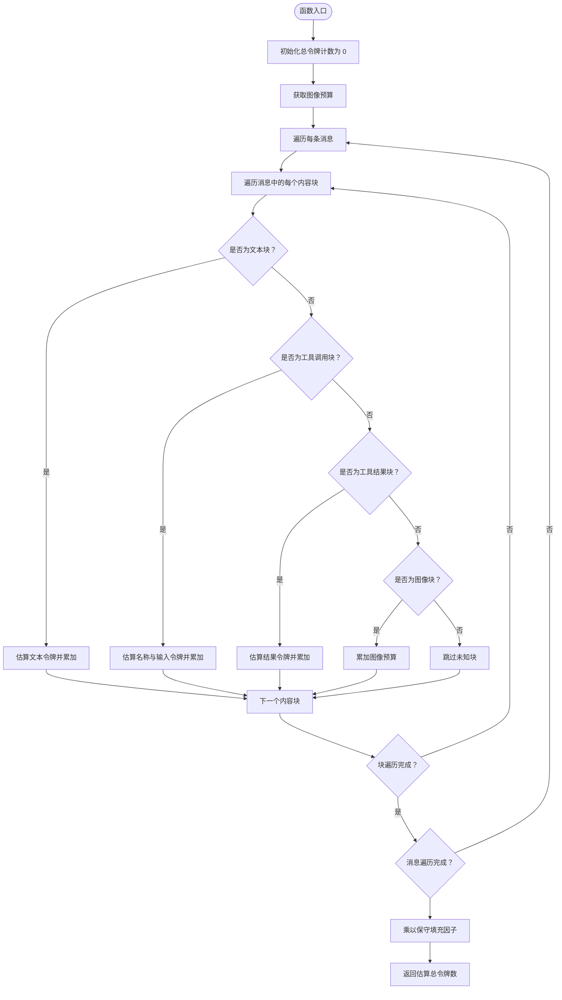
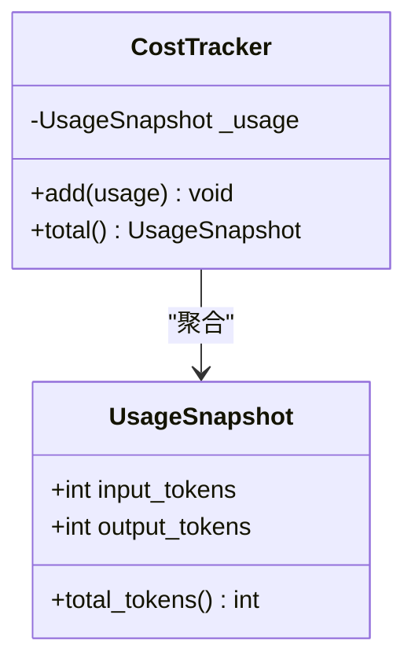
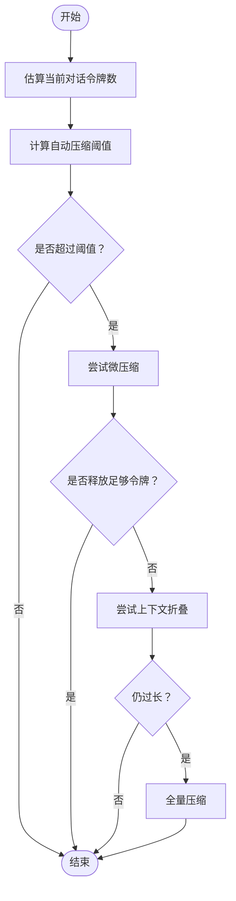
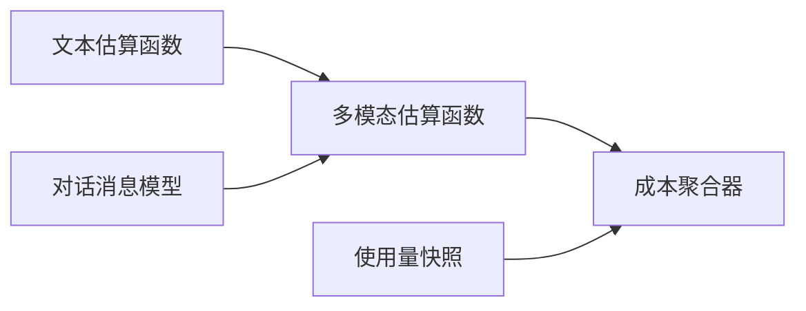

# 令牌估算服务

<cite>
**本文档引用的文件**
- [token_estimation.py](file://src/openharness/services/token_estimation.py)
- [compact/__init__.py](file://src/openharness/services/compact/__init__.py)
- [messages.py](file://src/openharness/engine/messages.py)
- [usage.py](file://src/openharness/api/usage.py)
- [cost_tracker.py](file://src/openharness/engine/cost_tracker.py)
- [test_compact.py](file://tests/test_services/test_compact.py)
</cite>

## 目录
1. [简介](#简介)
2. [项目结构](#项目结构)
3. [核心组件](#核心组件)
4. [架构概览](#架构概览)
5. [详细组件分析](#详细组件分析)
6. [依赖分析](#依赖分析)
7. [性能考虑](#性能考虑)
8. [故障排除指南](#故障排除指南)
9. [结论](#结论)
10. [附录](#附录)

## 简介
本文件为 OpenHarness 令牌估算服务的详细技术文档，涵盖以下主题：
- 令牌估算的算法与计算逻辑：包括文本长度计算、消息集合估算、多模态内容（文本、工具调用、工具结果、图像）的处理方式。
- 成本跟踪机制：输入/输出令牌的分别统计与总成本计算思路。
- 不同 AI 模型的令牌估算差异与兼容性处理：通过上下文窗口阈值、自动压缩触发策略实现跨模型兼容。
- 准确性保证与误差范围：基于字符启发式估算与保守填充因子的误差范围说明。
- 会话中的应用场景：预算控制、成本监控、自动压缩与上下文管理。
- 配置选项与自定义方法：环境变量、常量与扩展点。

## 项目结构
令牌估算服务主要分布在以下模块中：
- 轻量级文本估算：`src/openharness/services/token_estimation.py`
- 多模态对话估算与自动压缩：`src/openharness/services/compact/__init__.py`
- 对话消息数据模型：`src/openharness/engine/messages.py`
- 使用量跟踪模型：`src/openharness/api/usage.py`
- 会话级成本聚合器：`src/openharness/engine/cost_tracker.py`
- 测试用例：`tests/test_services/test_compact.py`

**图表来源**
- [token_estimation.py:1-16](file://src/openharness/services/token_estimation.py#L1-L16)
- [compact/__init__.py:116-151](file://src/openharness/services/compact/__init__.py#L116-L151)
- [messages.py:14-100](file://src/openharness/engine/messages.py#L14-L100)
- [usage.py:8-17](file://src/openharness/api/usage.py#L8-L17)
- [cost_tracker.py:8-25](file://src/openharness/engine/cost_tracker.py#L8-L25)
- [test_compact.py:1-200](file://tests/test_services/test_compact.py#L1-L200)

**章节来源**
- [token_estimation.py:1-16](file://src/openharness/services/token_estimation.py#L1-L16)
- [compact/__init__.py:116-151](file://src/openharness/services/compact/__init__.py#L116-L151)
- [messages.py:14-100](file://src/openharness/engine/messages.py#L14-L100)
- [usage.py:8-17](file://src/openharness/api/usage.py#L8-L17)
- [cost_tracker.py:8-25](file://src/openharness/engine/cost_tracker.py#L8-L25)
- [test_compact.py:1-200](file://tests/test_services/test_compact.py#L1-L200)

## 核心组件
- 文本令牌估算函数：基于字符长度的启发式估算，确保空字符串返回 0，非空最小估算为 1。
- 多模态对话令牌估算函数：支持文本块、工具调用块、工具结果块、图像块的加权估算，并应用保守填充因子。
- 图像估算预算：可通过环境变量进行覆盖，否则使用默认预算。
- 会话成本聚合器：累计输入/输出令牌，提供总令牌统计。
- 自动压缩触发：基于估算令牌数与上下文窗口阈值的比较，决定是否执行微压缩或全量压缩。

**章节来源**
- [token_estimation.py:6-15](file://src/openharness/services/token_estimation.py#L6-L15)
- [compact/__init__.py:116-151](file://src/openharness/services/compact/__init__.py#L116-L151)
- [compact/__init__.py:139-146](file://src/openharness/services/compact/__init__.py#L139-L146)
- [cost_tracker.py:8-25](file://src/openharness/engine/cost_tracker.py#L8-L25)

## 架构概览
令牌估算服务贯穿服务层与引擎层，形成从文本到多模态对话的估算链路，并与成本跟踪和自动压缩流程集成。

**图表来源**
- [compact/__init__.py:116-151](file://src/openharness/services/compact/__init__.py#L116-L151)
- [token_estimation.py:6-15](file://src/openharness/services/token_estimation.py#L6-L15)
- [compact/__init__.py:139-146](file://src/openharness/services/compact/__init__.py#L139-L146)
- [cost_tracker.py:14-24](file://src/openharness/engine/cost_tracker.py#L14-L24)

## 详细组件分析

### 组件A：文本令牌估算
- 算法描述：对纯文本进行字符长度估算，空字符串返回 0，非空最小估算为 1。
- 时间复杂度：O(n)，n 为字符串长度；空间复杂度：O(1)。
- 错误处理：对空输入安全，避免负数或零估算。
- 适用场景：快速估算纯文本片段的令牌数量，作为更复杂估算的基础。

**图表来源**
- [token_estimation.py:6-10](file://src/openharness/services/token_estimation.py#L6-L10)

**章节来源**
- [token_estimation.py:6-10](file://src/openharness/services/token_estimation.py#L6-L10)

### 组件B：多模态对话令牌估算
- 数据结构：对话消息由多种内容块组成（文本、工具调用、工具结果、图像），通过类型判别分别估算。
- 计算逻辑：
  - 文本块：使用文本估算函数。
  - 工具调用块：分别估算名称与输入参数的令牌数。
  - 工具结果块：估算结果文本的令牌数。
  - 图像块：使用图像预算函数估算固定令牌数。
  - 最终结果乘以保守填充因子，确保估算偏保守。
- 时间复杂度：O(N)，N 为所有内容块的数量；空间复杂度：O(1)。
- 错误处理：对无效输入进行安全估算，图像预算可被环境变量覆盖。

**图表来源**
- [compact/__init__.py:116-151](file://src/openharness/services/compact/__init__.py#L116-L151)
- [compact/__init__.py:139-146](file://src/openharness/services/compact/__init__.py#L139-L146)

**章节来源**
- [compact/__init__.py:116-151](file://src/openharness/services/compact/__init__.py#L116-L151)
- [compact/__init__.py:139-146](file://src/openharness/services/compact/__init__.py#L139-L146)

### 组件C：会话成本聚合
- 功能：累计输入/输出令牌，提供会话生命周期内的总使用量。
- 数据模型：使用快照对象记录输入/输出令牌数，并提供总令牌属性。
- 时间复杂度：每次添加为 O(1)；查询总成本为 O(1)。
- 适用场景：预算控制、成本监控与审计。

**图表来源**
- [usage.py:8-17](file://src/openharness/api/usage.py#L8-L17)
- [cost_tracker.py:8-25](file://src/openharness/engine/cost_tracker.py#L8-L25)

**章节来源**
- [usage.py:8-17](file://src/openharness/api/usage.py#L8-L17)
- [cost_tracker.py:8-25](file://src/openharness/engine/cost_tracker.py#L8-L25)

### 组件D：自动压缩与阈值控制
- 触发条件：当估算令牌数达到或超过阈值时触发自动压缩。
- 阈值来源：可手动覆盖或基于模型上下文窗口动态计算。
- 压缩策略：优先微压缩清理工具结果，其次尝试上下文折叠，最后进行全量压缩。
- 时间复杂度：估算 O(N)，压缩过程取决于具体策略与消息规模。

**图表来源**
- [compact/__init__.py:1071-1088](file://src/openharness/services/compact/__init__.py#L1071-L1088)
- [compact/__init__.py:1500-1636](file://src/openharness/services/compact/__init__.py#L1500-L1636)

**章节来源**
- [compact/__init__.py:1071-1088](file://src/openharness/services/compact/__init__.py#L1071-L1088)
- [compact/__init__.py:1500-1636](file://src/openharness/services/compact/__init__.py#L1500-L1636)

## 依赖分析
- 令牌估算函数依赖于对话消息模型（文本、工具调用、工具结果、图像块）。
- 多模态估算函数依赖于文本估算函数与图像预算函数。
- 成本聚合器依赖于使用量快照模型。
- 自动压缩流程依赖于估算函数与阈值计算。

**图表来源**
- [compact/__init__.py:116-151](file://src/openharness/services/compact/__init__.py#L116-L151)
- [messages.py:14-100](file://src/openharness/engine/messages.py#L14-L100)
- [cost_tracker.py:8-25](file://src/openharness/engine/cost_tracker.py#L8-L25)
- [usage.py:8-17](file://src/openharness/api/usage.py#L8-L17)

**章节来源**
- [compact/__init__.py:116-151](file://src/openharness/services/compact/__init__.py#L116-L151)
- [messages.py:14-100](file://src/openharness/engine/messages.py#L14-L100)
- [cost_tracker.py:8-25](file://src/openharness/engine/cost_tracker.py#L8-L25)
- [usage.py:8-17](file://src/openharness/api/usage.py#L8-L17)

## 性能考虑
- 估算复杂度：文本估算为 O(n)，多模态估算为 O(N)，适合实时使用。
- 填充因子：保守填充因子确保估算偏高，降低实际运行时超限风险。
- 缓存与复用：在高频调用场景可缓存最近估算结果，减少重复计算。
- 批量处理：对大量消息进行批量估算时，建议分批处理以控制内存峰值。

## 故障排除指南
- 估算结果异常偏低或偏高：
  - 检查输入是否包含图像块，确认图像预算是否正确设置。
  - 确认填充因子未被意外修改。
- 自动压缩未触发：
  - 检查阈值计算是否被手动覆盖，或模型上下文窗口是否过小。
  - 确认估算令牌数是否确实超过阈值。
- 成本统计不准确：
  - 确保每次请求都提交了正确的输入/输出令牌数。
  - 检查会话生命周期内是否遗漏了部分请求的成本。

**章节来源**
- [compact/__init__.py:139-146](file://src/openharness/services/compact/__init__.py#L139-L146)
- [compact/__init__.py:1071-1088](file://src/openharness/services/compact/__init__.py#L1071-L1088)
- [cost_tracker.py:14-24](file://src/openharness/engine/cost_tracker.py#L14-L24)

## 结论
OpenHarness 的令牌估算服务通过轻量文本估算与多模态对话估算相结合，提供了跨模型、跨场景的通用估算能力。配合保守填充因子与自动压缩策略，能够在保证稳定性的同时有效控制上下文长度与成本。会话级成本聚合器进一步增强了预算控制与成本监控的能力。通过环境变量与阈值配置，用户可以灵活适配不同模型与业务需求。

## 附录

### 配置选项与自定义方法
- 图像令牌估算预算（环境变量）：
  - 名称：OPENHARNESS_IMAGE_TOKEN_ESTIMATE
  - 行为：若设置为合法整数且不小于 64，则使用该值；否则使用默认值。
  - 默认值：参考代码中的默认常量。
- 保守填充因子：
  - 默认值：参考代码中的默认常量。
  - 作用：估算后乘以该因子，确保偏保守。
- 自动压缩阈值：
  - 可手动覆盖或基于模型上下文窗口动态计算。
  - 作用：决定何时触发微压缩、上下文折叠或全量压缩。

**章节来源**
- [compact/__init__.py:74-76](file://src/openharness/services/compact/__init__.py#L74-L76)
- [compact/__init__.py:139-146](file://src/openharness/services/compact/__init__.py#L139-L146)
- [compact/__init__.py:1071-1088](file://src/openharness/services/compact/__init__.py#L1071-L1088)

### 准确性保证与误差范围
- 文本估算采用字符启发式，适用于一般场景；对于高度结构化或特殊编码文本可能存在误差。
- 多模态估算对文本、工具调用、工具结果与图像分别估算，整体结果乘以保守填充因子，通常会偏高。
- 实际令牌数可能因模型分词器差异而有所不同，建议结合实际使用量进行校准。

**章节来源**
- [token_estimation.py:6-10](file://src/openharness/services/token_estimation.py#L6-L10)
- [compact/__init__.py:116-151](file://src/openharness/services/compact/__init__.py#L116-L151)

### 会话应用场景
- 预算控制：通过估算令牌数与阈值比较，提前触发压缩以避免超限。
- 成本监控：累计输入/输出令牌，生成会话成本报告。
- 上下文管理：在长对话中保持合理的上下文长度，提升响应质量与稳定性。

**章节来源**
- [compact/__init__.py:1071-1088](file://src/openharness/services/compact/__init__.py#L1071-L1088)
- [cost_tracker.py:14-24](file://src/openharness/engine/cost_tracker.py#L14-L24)