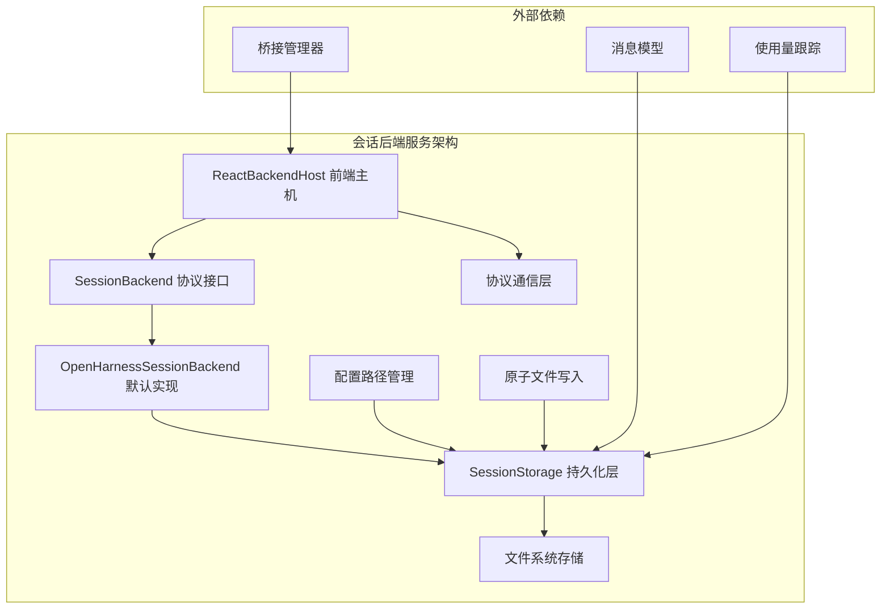
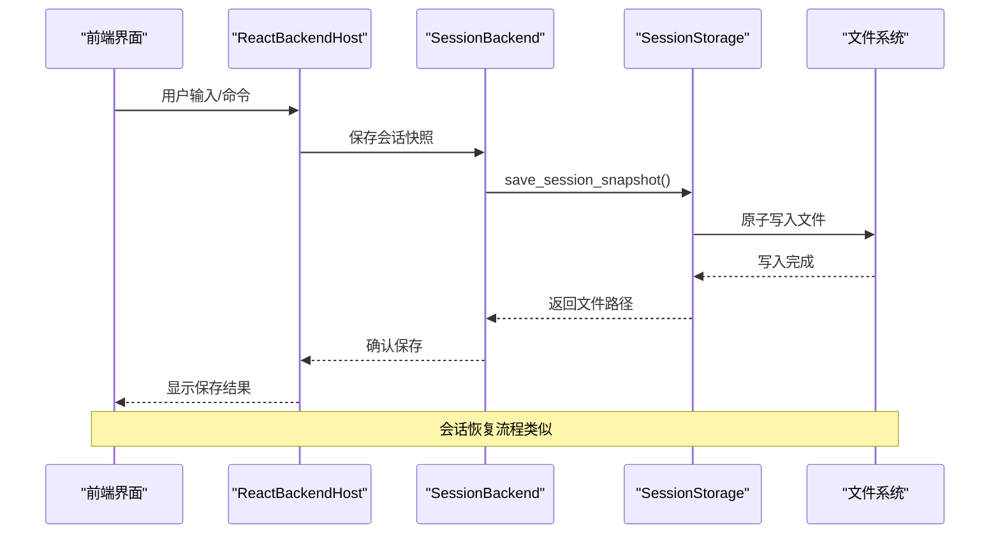
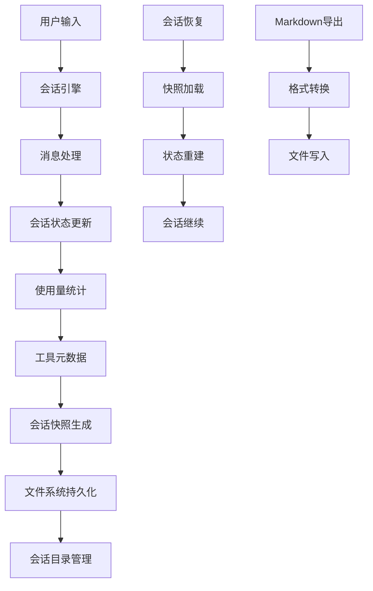
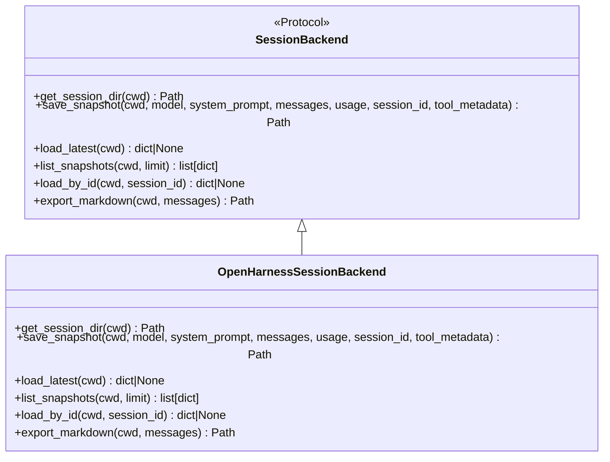
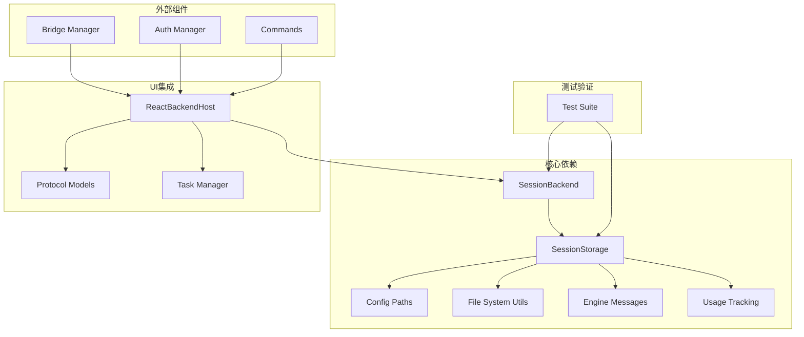

# 会话后端服务

<cite>
**本文档引用的文件**
- [session_backend.py](file://src/openharness/services/session_backend.py)
- [session_storage.py](file://src/openharness/services/session_storage.py)
- [backend_host.py](file://src/openharness/ui/backend_host.py)
- [protocol.py](file://src/openharness/ui/protocol.py)
- [paths.py](file://src/openharness/config/paths.py)
- [fs.py](file://src/openharness/utils/fs.py)
- [messages.py](file://src/openharness/engine/messages.py)
- [cost_tracker.py](file://src/openharness/engine/cost_tracker.py)
- [manager.py](file://src/openharness/bridge/manager.py)
- [test_session_storage.py](file://tests/test_services/test_session_storage.py)
</cite>

## 目录
1. [简介](#简介)
2. [项目结构](#项目结构)
3. [核心组件](#核心组件)
4. [架构概览](#架构概览)
5. [详细组件分析](#详细组件分析)
6. [依赖关系分析](#依赖关系分析)
7. [性能考虑](#性能考虑)
8. [故障排除指南](#故障排除指南)
9. [结论](#结论)
10. [附录](#附录)

## 简介

OpenHarness会话后端服务是整个系统中负责会话状态管理和持久化的核心组件。该服务提供了统一的会话存储抽象，支持会话快照的创建、加载、列表和导出功能，同时确保数据的一致性和完整性。

会话后端服务采用分层架构设计，通过协议接口定义抽象能力，通过默认实现提供具体功能，并通过前端主机与用户界面进行交互。该设计使得系统具有良好的可扩展性和可维护性。

## 项目结构

会话后端服务在项目中的组织结构如下：



**图表来源**
- [session_backend.py:14-97](file://src/openharness/services/session_backend.py#L14-L97)
- [backend_host.py:71-180](file://src/openharness/ui/backend_host.py#L71-L180)
- [paths.py:71-75](file://src/openharness/config/paths.py#L71-L75)

**章节来源**
- [session_backend.py:1-98](file://src/openharness/services/session_backend.py#L1-L98)
- [backend_host.py:1-840](file://src/openharness/ui/backend_host.py#L1-L840)

## 核心组件

### 会话后端协议接口

会话后端服务的核心是一个Python协议接口，定义了会话状态管理的标准操作：

- **会话目录管理**: `get_session_dir()` - 返回会话文件的存储目录
- **快照保存**: `save_snapshot()` - 持久化会话快照并返回文件路径
- **快照加载**: `load_latest()` 和 `load_by_id()` - 加载最新或指定ID的会话快照
- **快照列表**: `list_snapshots()` - 列出最近的会话快照
- **Markdown导出**: `export_markdown()` - 导出会话转录为Markdown格式

### 默认实现类

`OpenHarnessSessionBackend` 类提供了基于文件系统的默认实现，主要特点包括：

- **项目隔离**: 每个项目使用独立的会话目录，通过项目路径哈希生成唯一标识
- **原子写入**: 使用原子文件写入确保数据完整性
- **多重备份**: 同时保存为"latest.json"和"session-{id}.json"格式
- **元数据过滤**: 只保存允许的工具元数据键值

### 存储辅助函数

`session_storage` 模块提供了底层的存储操作：

- **目录管理**: 自动生成项目特定的会话目录
- **快照序列化**: 将会话状态转换为JSON格式
- **数据清理**: 清理历史空消息和不完整工具调用
- **兼容性处理**: 支持向前兼容的消息格式

**章节来源**
- [session_backend.py:14-97](file://src/openharness/services/session_backend.py#L14-L97)
- [session_storage.py:54-231](file://src/openharness/services/session_storage.py#L54-L231)

## 架构概览

会话后端服务采用分层架构，各层职责明确：



**图表来源**
- [backend_host.py:133-174](file://src/openharness/ui/backend_host.py#L133-L174)
- [session_backend.py:58-77](file://src/openharness/services/session_backend.py#L58-L77)
- [session_storage.py:63-107](file://src/openharness/services/session_storage.py#L63-L107)

### 数据流架构

会话数据在系统中的流转过程：



**图表来源**
- [backend_host.py:237-362](file://src/openharness/ui/backend_host.py#L237-L362)
- [session_storage.py:123-231](file://src/openharness/services/session_storage.py#L123-L231)

## 详细组件分析

### 会话后端协议设计

会话后端协议采用Python 3.8+的`typing.Protocol`特性，定义了会话状态管理的标准接口：



**图表来源**
- [session_backend.py:14-97](file://src/openharness/services/session_backend.py#L14-L97)

### 前端主机集成

ReactBackendHost类实现了会话后端与前端界面的集成：

- **请求处理**: 异步处理前端请求队列
- **事件发射**: 将会话状态变化转换为前端事件
- **权限管理**: 集成权限请求和响应机制
- **会话恢复**: 支持会话列表展示和选择恢复

### 存储系统设计

会话存储系统采用多层设计确保数据安全和一致性：

```mermaid
graph TB
subgraph "存储层次结构"
A[会话目录] --> B[latest.json 最新快照]
A --> C[session-{id}.json 具体快照]
A --> D[transcript.md Markdown导出]
E[项目隔离] --> F[路径哈希生成]
F --> G[唯一目录名]
H[原子写入] --> I[临时文件创建]
I --> J[数据写入]
J --> K[文件替换]
end
```

**图表来源**
- [session_storage.py:54-107](file://src/openharness/services/session_storage.py#L54-L107)
- [fs.py:69-77](file://src/openharness/utils/fs.py#L69-L77)

**章节来源**
- [backend_host.py:71-180](file://src/openharness/ui/backend_host.py#L71-L180)
- [session_storage.py:1-231](file://src/openharness/services/session_storage.py#L1-L231)

## 依赖关系分析

会话后端服务的依赖关系图：



**图表来源**
- [session_backend.py:11](file://src/openharness/services/session_backend.py#L11)
- [backend_host.py:38](file://src/openharness/ui/backend_host.py#L38)
- [manager.py:26](file://src/openharness/bridge/manager.py#L26)

### 组件耦合度分析

- **高内聚**: 会话后端协议与实现紧密耦合，职责单一
- **低耦合**: 通过协议接口与前端主机解耦
- **清晰边界**: 存储层与业务逻辑层分离
- **可替换性**: 支持不同的存储后端实现

**章节来源**
- [paths.py:1-161](file://src/openharness/config/paths.py#L1-L161)
- [messages.py:1-200](file://src/openharness/engine/messages.py#L1-L200)

## 性能考虑

### 文件系统优化

会话后端服务在文件系统层面采用了多项优化措施：

- **原子写入**: 使用临时文件+重命名的方式避免部分写入
- **目录结构**: 项目级别的目录隔离减少文件系统压力
- **增量更新**: 只保存必要的元数据，减少存储开销
- **缓存策略**: 利用文件系统缓存提高读取性能

### 并发控制

系统通过以下机制确保并发安全性：

- **异步锁**: 使用`asyncio.Lock`保护关键资源
- **请求队列**: 串行处理用户请求避免竞争条件
- **原子操作**: 文件写入的原子性保证
- **状态同步**: 应用状态的观察者模式

### 内存管理

- **消息清理**: 自动清理空消息和无效内容块
- **元数据过滤**: 只保存必要的工具元数据
- **内存映射**: 大文件使用内存映射技术

## 故障排除指南

### 常见问题诊断

#### 会话恢复失败

**症状**: `load_by_id()`返回None或抛出异常

**可能原因**:
- 会话文件损坏或格式错误
- 会话ID不存在或已过期
- 权限不足无法读取文件

**解决步骤**:
1. 检查会话目录是否存在
2. 验证JSON格式的正确性
3. 确认文件权限设置
4. 查看日志文件获取详细错误信息

#### 存储空间不足

**症状**: `save_snapshot()`操作失败

**解决方法**:
- 清理旧的会话快照
- 检查磁盘空间使用情况
- 调整会话保留策略

#### 并发冲突

**症状**: 多个进程同时写入导致数据不一致

**预防措施**:
- 使用原子文件写入
- 实施适当的锁机制
- 避免同时启动多个实例

### 调试工具和方法

#### 日志分析

系统提供了详细的日志记录机制：

- **调试级别**: 详细的执行流程日志
- **错误级别**: 错误和异常的完整堆栈跟踪
- **性能指标**: 关键操作的执行时间统计

#### 测试验证

通过单元测试确保功能正确性：

- **快照保存**: 验证数据完整性和格式正确性
- **快照加载**: 确保恢复功能正常工作
- **数据清理**: 测试历史数据的清理逻辑
- **兼容性**: 验证向前兼容性

**章节来源**
- [test_session_storage.py:18-94](file://tests/test_services/test_session_storage.py#L18-L94)

## 结论

OpenHarness会话后端服务通过精心设计的架构实现了可靠的会话状态管理。其主要优势包括：

1. **架构清晰**: 分层设计使得各组件职责明确，易于维护
2. **数据安全**: 原子文件写入和多重备份确保数据完整性
3. **扩展性强**: 协议接口设计支持多种存储后端实现
4. **用户体验**: 无缝的会话恢复和状态同步提升用户满意度

未来可以考虑的改进方向：
- 支持分布式存储后端
- 增加压缩和加密功能
- 实现增量同步机制
- 添加更多监控和告警功能

## 附录

### 配置选项

| 配置项 | 类型 | 默认值 | 描述 |
|--------|------|--------|------|
| OPENHARNESS_DATA_DIR | 环境变量 | ~/.openharness/data | 数据存储根目录 |
| session_id | 字符串 | 自动生成 | 会话唯一标识符 |
| limit | 整数 | 20 | 快照列表限制数量 |

### API参考

#### 会话后端接口

| 方法 | 参数 | 返回值 | 描述 |
|------|------|--------|------|
| get_session_dir | cwd: str \| Path | Path | 获取会话目录路径 |
| save_snapshot | cwd, model, system_prompt, messages, usage, session_id=None, tool_metadata=None | Path | 保存会话快照 |
| load_latest | cwd: str \| Path | dict \| None | 加载最新会话 |
| list_snapshots | cwd: str \| Path, limit: int=20 | list[dict] | 列出会话快照 |
| load_by_id | cwd: str \| Path, session_id: str | dict \| None | 按ID加载会话 |
| export_markdown | cwd: str \| Path, messages: list[ConversationMessage] | Path | 导出Markdown文件 |

### 开发指南

#### 自定义后端实现

要实现自定义会话后端，需要：

1. 实现`SessionBackend`协议接口
2. 处理会话数据的序列化和反序列化
3. 实现错误处理和异常管理
4. 确保线程安全和并发访问控制

#### 扩展点

- **存储后端**: 支持数据库、云存储等不同存储方式
- **加密机制**: 添加数据加密和解密功能
- **压缩算法**: 实现数据压缩以节省存储空间
- **同步机制**: 支持跨设备的会话同步