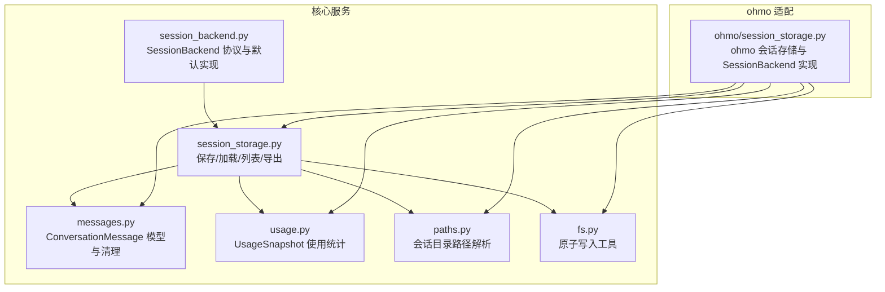
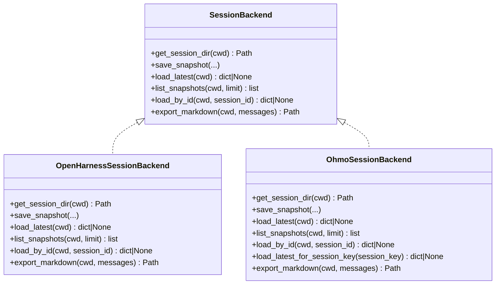
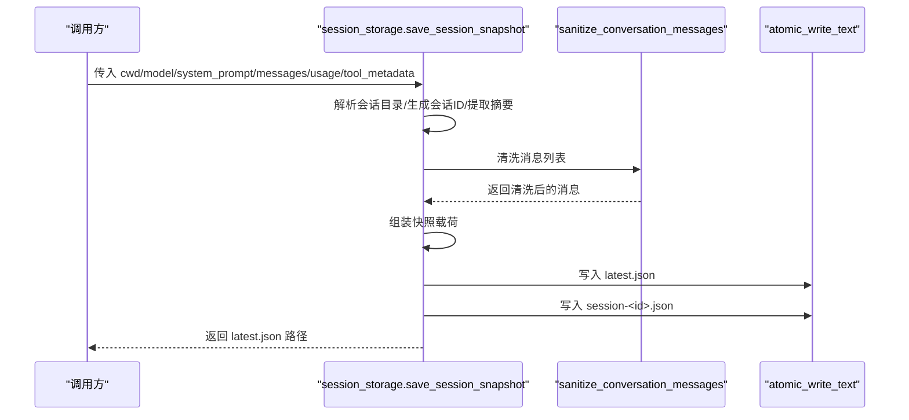
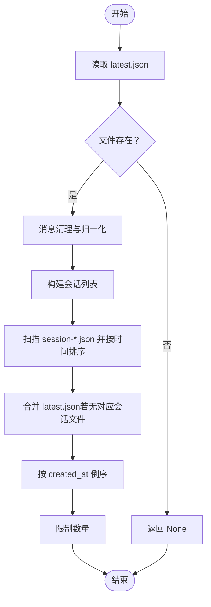
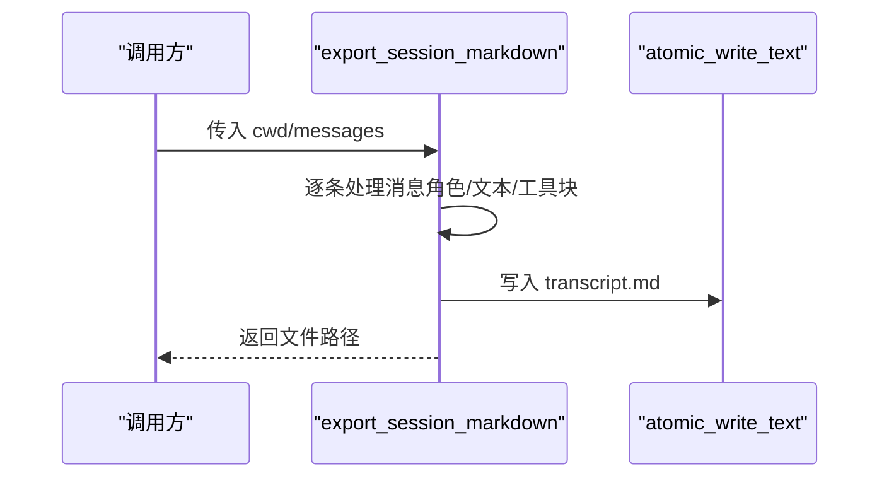
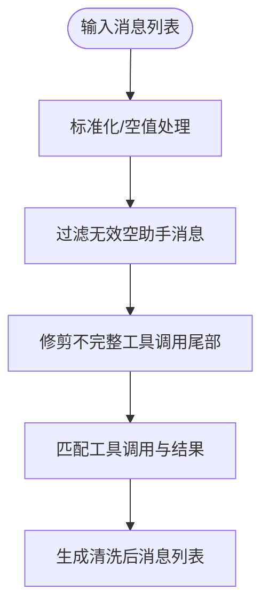
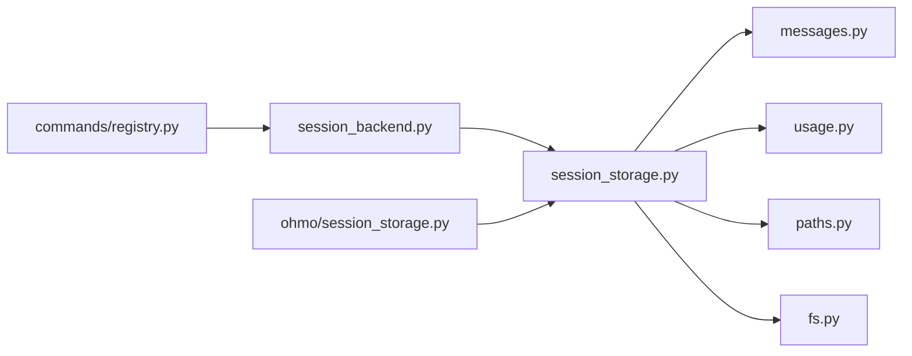

# 会话存储服务

<cite>
**本文引用的文件**
- [session_storage.py](file://src/openharness/services/session_storage.py)
- [session_backend.py](file://src/openharness/services/session_backend.py)
- [messages.py](file://src/openharness/engine/messages.py)
- [usage.py](file://src/openharness/api/usage.py)
- [paths.py](file://src/openharness/config/paths.py)
- [fs.py](file://src/openharness/utils/fs.py)
- [test_session_storage.py](file://tests/test_services/test_session_storage.py)
- [registry.py](file://src/openharness/commands/registry.py)
- [ohmo_session_storage.py](file://ohmo/session_storage.py)
</cite>

## 目录
1. [简介](#简介)
2. [项目结构](#项目结构)
3. [核心组件](#核心组件)
4. [架构总览](#架构总览)
5. [详细组件分析](#详细组件分析)
6. [依赖关系分析](#依赖关系分析)
7. [性能考量](#性能考量)
8. [故障排查指南](#故障排查指南)
9. [结论](#结论)
10. [附录](#附录)

## 简介
本文件系统性阐述 OpenHarness 的会话存储服务，覆盖会话快照的保存、加载与列表管理，消息清理与序列化机制，会话目录结构与命名规范，会话数据结构与字段说明，以及 Markdown 导出能力。同时提供最佳实践与性能优化建议，帮助开发者在保证数据一致性的同时提升稳定性与可维护性。

## 项目结构
会话存储服务由两套实现协同完成：
- 核心会话存储：面向通用场景，负责会话快照的持久化、读取、列表与导出。
- ohmo 专用会话存储：面向 ohmo 工作区，支持按会话键（session_key）区分“最新”快照，并提供统一的 SessionBackend 接口适配。

图表来源
- [session_storage.py:1-231](file://src/openharness/services/session_storage.py#L1-L231)
- [session_backend.py:1-97](file://src/openharness/services/session_backend.py#L1-L97)
- [messages.py:1-222](file://src/openharness/engine/messages.py#L1-L222)
- [usage.py:1-18](file://src/openharness/api/usage.py#L1-L18)
- [paths.py:71-75](file://src/openharness/config/paths.py#L71-L75)
- [fs.py:69-78](file://src/openharness/utils/fs.py#L69-L78)
- [ohmo_session_storage.py:1-203](file://ohmo/session_storage.py#L1-L203)

章节来源
- [session_storage.py:1-231](file://src/openharness/services/session_storage.py#L1-L231)
- [session_backend.py:1-97](file://src/openharness/services/session_backend.py#L1-L97)
- [messages.py:1-222](file://src/openharness/engine/messages.py#L1-L222)
- [usage.py:1-18](file://src/openharness/api/usage.py#L1-L18)
- [paths.py:71-75](file://src/openharness/config/paths.py#L71-L75)
- [fs.py:69-78](file://src/openharness/utils/fs.py#L69-L78)
- [ohmo_session_storage.py:1-203](file://ohmo/session_storage.py#L1-L203)

## 核心组件
- 会话快照保存：将当前对话、模型配置、使用统计、工具元数据与摘要等写入 JSON 文件，并同时维护“latest.json”与“session-<id>.json”。
- 会话快照加载：从“latest.json”或指定 ID 文件中读取并进行消息清理与兼容性归一化。
- 会话列表管理：列出项目下所有会话快照，按创建时间倒序，支持限制数量。
- 会话导出：将会话转录导出为 Markdown，便于分享与归档。
- 目录与命名：基于项目工作目录生成稳定目录名，避免跨平台与路径差异带来的冲突；会话文件采用“session-<id>.json”命名，便于检索与版本化。
- 原子写入：使用临时文件+重命名的方式确保写入过程的原子性，避免崩溃导致的半写入文件。

章节来源
- [session_storage.py:63-107](file://src/openharness/services/session_storage.py#L63-L107)
- [session_storage.py:123-191](file://src/openharness/services/session_storage.py#L123-L191)
- [session_storage.py:210-230](file://src/openharness/services/session_storage.py#L210-L230)
- [paths.py:71-75](file://src/openharness/config/paths.py#L71-L75)
- [fs.py:69-78](file://src/openharness/utils/fs.py#L69-L78)

## 架构总览
会话存储服务通过统一的 SessionBackend 接口对外提供能力，核心实现位于 session_storage.py，ohmo 适配位于 ohmo/session_storage.py。消息模型与使用统计分别由 messages.py 与 usage.py 提供，路径解析与原子写入分别由 paths.py 与 fs.py 提供。

图表来源
- [session_backend.py:14-97](file://src/openharness/services/session_backend.py#L14-L97)
- [ohmo_session_storage.py:151-203](file://ohmo/session_storage.py#L151-L203)

## 详细组件分析

### 会话快照保存流程
- 输入参数：工作目录、模型名称、系统提示词、消息列表、使用统计、会话ID（可选）、工具元数据（可选）。
- 处理步骤：
  - 计算会话目录（基于项目路径与哈希），确保存在。
  - 生成会话ID（若未提供）。
  - 清洗消息列表，移除无效空消息与不完整的工具调用尾部。
  - 从首个用户消息提取摘要。
  - 组装快照载荷（包含会话ID、工作目录、模型、系统提示、消息、使用统计、工具元数据、时间戳、摘要、消息计数）。
  - 写入“latest.json”与“session-<id>.json”，使用原子写入保障一致性。
- 输出：返回“latest.json”的路径。

图表来源
- [session_storage.py:63-107](file://src/openharness/services/session_storage.py#L63-L107)
- [messages.py:118-170](file://src/openharness/engine/messages.py#L118-L170)
- [fs.py:69-78](file://src/openharness/utils/fs.py#L69-L78)

章节来源
- [session_storage.py:63-107](file://src/openharness/services/session_storage.py#L63-L107)
- [messages.py:118-170](file://src/openharness/engine/messages.py#L118-L170)
- [fs.py:69-78](file://src/openharness/utils/fs.py#L69-L78)

### 会话快照加载与列表管理
- 加载最新快照：读取“latest.json”，进行消息清理与兼容性归一化。
- 列表管理：扫描“session-*.json”，按修改时间倒序，提取摘要、消息数、模型与创建时间；若存在“latest.json”且无对应会话文件，则将其也纳入列表。
- 按ID加载：优先查找“session-<id>.json”，否则回退到“latest.json”。

图表来源
- [session_storage.py:123-191](file://src/openharness/services/session_storage.py#L123-L191)

章节来源
- [session_storage.py:123-191](file://src/openharness/services/session_storage.py#L123-L191)

### 会话导出（Markdown）
- 将消息按角色分段输出，保留文本内容与工具调用/结果块，形成可读的 Markdown 转录文件。
- 导出路径位于会话目录下的“transcript.md”。

图表来源
- [session_storage.py:210-230](file://src/openharness/services/session_storage.py#L210-L230)
- [fs.py:69-78](file://src/openharness/utils/fs.py#L69-L78)

章节来源
- [session_storage.py:210-230](file://src/openharness/services/session_storage.py#L210-L230)
- [fs.py:69-78](file://src/openharness/utils/fs.py#L69-L78)

### 会话目录结构与命名规范
- 会话根目录：由数据目录下的“sessions”组成，默认位于用户主目录下的“.openharness/data/sessions”。
- 项目会话目录：以“项目名-路径哈希”的形式命名，确保不同工作区或同名项目在不同路径下的隔离。
- 文件命名：
  - “latest.json”：记录最近一次会话快照。
  - “session-<id>.json”：按会话ID命名的独立快照文件。
  - “transcript.md”：会话转录导出文件。
- ohmo 会话目录：位于 ohmo 工作区的“.ohmo/sessions”，支持“latest-<token>.json”按会话键区分的“最新”快照。

章节来源
- [paths.py:71-75](file://src/openharness/config/paths.py#L71-L75)
- [session_storage.py:54-60](file://src/openharness/services/session_storage.py#L54-L60)
- [session_storage.py:100-105](file://src/openharness/services/session_storage.py#L100-L105)
- [session_storage.py:216-217](file://src/openharness/services/session_storage.py#L216-L217)
- [ohmo_session_storage.py:24-28](file://ohmo/session_storage.py#L24-L28)
- [ohmo_session_storage.py:35-38](file://ohmo/session_storage.py#L35-L38)
- [ohmo_session_storage.py:79-84](file://ohmo/session_storage.py#L79-L84)

### 会话数据结构与字段说明
- 必填字段
  - session_id：会话唯一标识（短ID）。
  - cwd：工作目录绝对路径字符串。
  - model：所用模型名称。
  - system_prompt：系统提示词。
  - messages：消息数组，元素为 ConversationMessage 的序列化结果。
  - usage：UsageSnapshot 序列化结果。
- 可选字段
  - tool_metadata：工具元数据（仅持久化白名单键）。
  - created_at：创建时间戳。
  - summary：会话摘要（来自首个非空用户消息的前80字符）。
  - message_count：消息数量（用于列表展示与快速统计）。
- 元数据持久化白名单键
  - permission_mode、read_file_state、invoked_skills、async_agent_state、async_agent_tasks、recent_work_log、recent_verified_work、task_focus_state、compact_checkpoints、compact_last。

章节来源
- [session_storage.py:85-96](file://src/openharness/services/session_storage.py#L85-L96)
- [session_storage.py:18-29](file://src/openharness/services/session_storage.py#L18-L29)
- [messages.py:64-116](file://src/openharness/engine/messages.py#L64-L116)
- [usage.py:8-17](file://src/openharness/api/usage.py#L8-L17)

### 消息清理与序列化机制
- 消息清理（sanitize_conversation_messages）：
  - 过滤无效空助手消息。
  - 去除不完整工具调用尾部（当存在未匹配工具结果时，丢弃该轮助手消息）。
  - 保持消息顺序与角色交替的合理性，避免提供者拒绝恢复会话。
- 序列化：
  - ConversationMessage 使用 Pydantic 模型，支持 model_dump(mode="json") 输出。
  - 工具调用/结果块与图片块转换为标准字典结构，确保跨版本兼容。
- 反序列化与归一化：
  - 读取 JSON 后，使用 ConversationMessage.model_validate 构建对象，再经 sanitize_conversation_messages 归一化，更新 message_count。

图表来源
- [messages.py:118-170](file://src/openharness/engine/messages.py#L118-L170)
- [session_storage.py:110-120](file://src/openharness/services/session_storage.py#L110-L120)

章节来源
- [messages.py:118-170](file://src/openharness/engine/messages.py#L118-L170)
- [session_storage.py:110-120](file://src/openharness/services/session_storage.py#L110-L120)

### ohmo 会话存储扩展
- 支持 session_key 参数，生成“latest-<token>.json”以区分不同会话键的“最新”快照。
- 提供 SessionBackend 实现，统一对外接口，便于命令行与上层模块复用。

章节来源
- [ohmo_session_storage.py:41-85](file://ohmo/session_storage.py#L41-L85)
- [ohmo_session_storage.py:95-99](file://ohmo/session_storage.py#L95-L99)
- [ohmo_session_storage.py:151-203](file://ohmo/session_storage.py#L151-L203)

## 依赖关系分析
- 低耦合高内聚：会话存储逻辑集中在 session_storage.py，通过协议（SessionBackend）解耦上层调用。
- 关键依赖链：
  - session_storage.py 依赖：消息模型（messages.py）、使用统计（usage.py）、路径解析（paths.py）、原子写入（fs.py）。
  - ohmo 会话存储依赖：核心会话存储函数（_persistable_tool_metadata、_sanitize_snapshot_payload）。
  - 命令注册：/session 命令通过 DEFAULT_SESSION_BACKEND 调用保存与导出。

图表来源
- [session_storage.py:1-16](file://src/openharness/services/session_storage.py#L1-L16)
- [session_backend.py:1-12](file://src/openharness/services/session_backend.py#L1-L12)
- [ohmo_session_storage.py:15-19](file://ohmo/session_storage.py#L15-L19)
- [registry.py:673-696](file://src/openharness/commands/registry.py#L673-L696)

章节来源
- [session_storage.py:1-16](file://src/openharness/services/session_storage.py#L1-L16)
- [session_backend.py:1-12](file://src/openharness/services/session_backend.py#L1-L12)
- [ohmo_session_storage.py:15-19](file://ohmo/session_storage.py#L15-L19)
- [registry.py:673-696](file://src/openharness/commands/registry.py#L673-L696)

## 性能考量
- 原子写入降低 I/O 风险：使用临时文件+重命名，避免崩溃导致的半写入文件，减少后续解析失败与人工干预。
- 消息清理减少上下文体积：去除无效消息与不完整工具调用尾部，有助于控制上下文长度，降低模型调用成本。
- 列表限制与时间排序：通过 limit 与按修改时间排序，避免一次性加载过多文件造成性能问题。
- 目录命名稳定性：基于路径哈希的项目会话目录，避免频繁重命名与跨盘移动，提高文件系统操作效率。
- ohmo 会话键区分：按 session_key 维护多路“最新”快照，避免覆盖，适合多任务/多用户场景。

章节来源
- [fs.py:1-26](file://src/openharness/utils/fs.py#L1-L26)
- [session_storage.py:131-191](file://src/openharness/services/session_storage.py#L131-L191)
- [paths.py:54-60](file://src/openharness/config/paths.py#L54-L60)
- [ohmo_session_storage.py:31-38](file://ohmo/session_storage.py#L31-L38)

## 故障排查指南
- 读取失败（JSON 解析错误）
  - 现象：读取“latest.json”或“session-*.json”时报错。
  - 原因：文件损坏或被外部进程截断。
  - 处理：确认写入是否使用原子写入；检查磁盘空间与权限；必要时手动删除异常文件后重新保存。
- 消息不完整或顺序异常
  - 现象：恢复会话时出现工具调用未匹配或空助手消息。
  - 原因：会话在工具调用中途被打断。
  - 处理：依赖消息清理自动修剪不完整尾部；如仍异常，检查消息序列是否符合预期。
- 列表为空或缺失“latest.json”
  - 现象：/session list 显示为空。
  - 原因：会话目录不存在或尚未保存过快照。
  - 处理：先执行一次保存；确认环境变量 OPENHARNESS_DATA_DIR 是否正确。
- 导出文件缺失或内容为空
  - 现象：导出 Markdown 文件不存在或内容不完整。
  - 原因：消息列表为空或导出路径不可写。
  - 处理：检查 messages 参数与会话目录权限；确认导出路径存在。

章节来源
- [session_storage.py:123-191](file://src/openharness/services/session_storage.py#L123-L191)
- [messages.py:118-170](file://src/openharness/engine/messages.py#L118-L170)
- [fs.py:69-78](file://src/openharness/utils/fs.py#L69-L78)
- [test_session_storage.py:64-94](file://tests/test_services/test_session_storage.py#L64-L94)

## 结论
OpenHarness 的会话存储服务通过清晰的目录结构、稳定的命名规范、原子写入与消息清理机制，提供了可靠、可维护的会话持久化能力。结合 SessionBackend 接口与 ohmo 扩展，既满足通用场景，又支持多会话键区分的高级需求。遵循本文的最佳实践与性能建议，可在复杂工程中保持会话数据的一致性与高效访问。

## 附录
- 测试验证点
  - 保存与加载：校验模型名、使用统计与工具元数据。
  - Markdown 导出：校验标题、内容片段存在。
  - 消息清理：校验历史空助手消息被剔除，消息计数正确。

章节来源
- [test_session_storage.py:18-41](file://tests/test_services/test_session_storage.py#L18-L41)
- [test_session_storage.py:44-61](file://tests/test_services/test_session_storage.py#L44-L61)
- [test_session_storage.py:64-94](file://tests/test_services/test_session_storage.py#L64-L94)