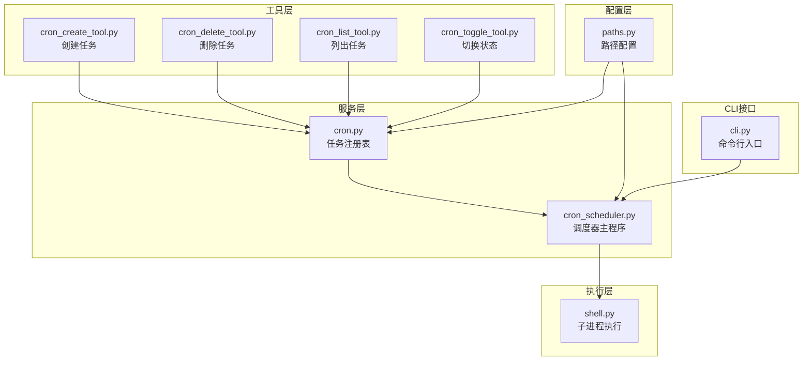
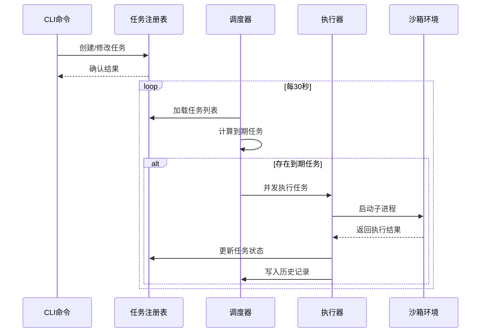
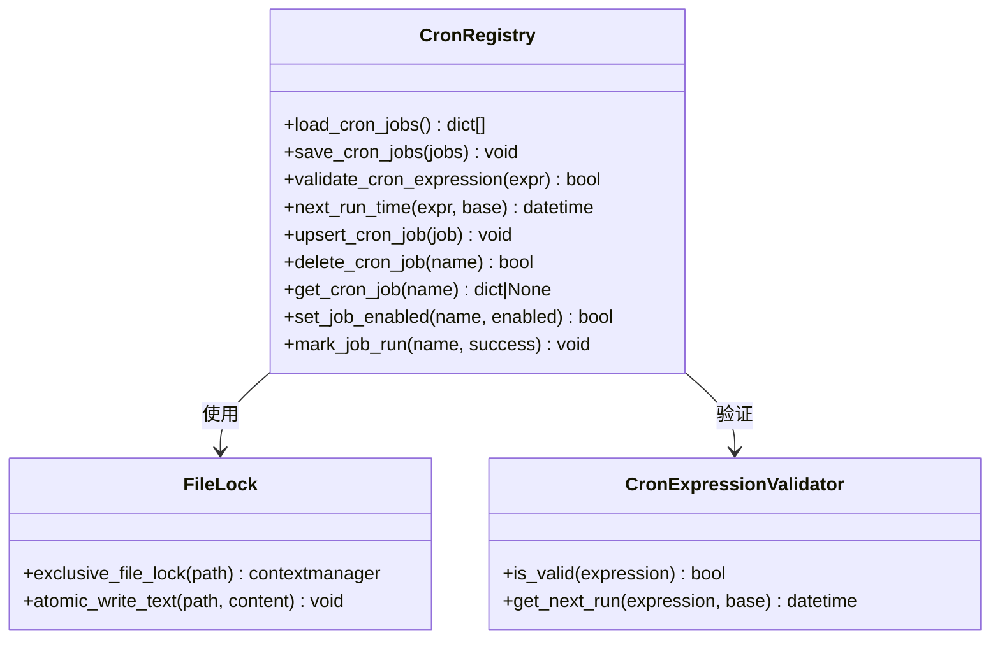
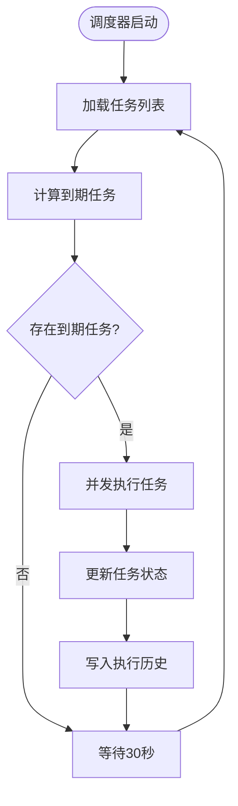
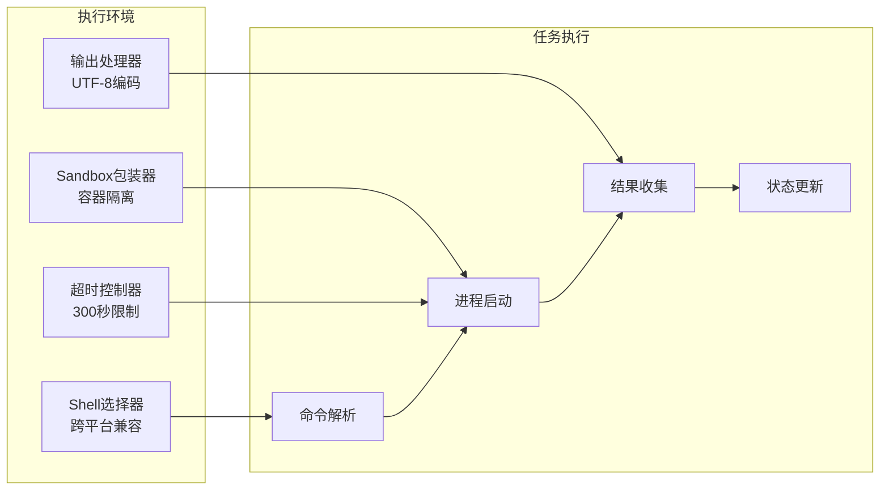
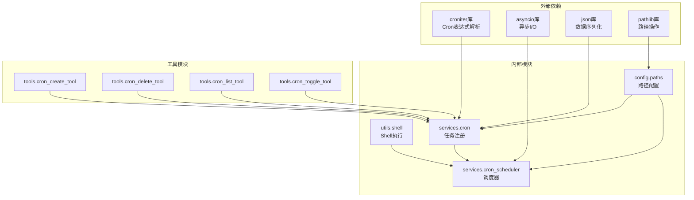

# 定时调度器服务

<cite>
**本文档引用的文件**
- [cron.py](file://src/openharness/services/cron.py)
- [cron_scheduler.py](file://src/openharness/services/cron_scheduler.py)
- [cron_create_tool.py](file://src/openharness/tools/cron_create_tool.py)
- [cron_delete_tool.py](file://src/openharness/tools/cron_delete_tool.py)
- [cron_list_tool.py](file://src/openharness/tools/cron_list_tool.py)
- [cron_toggle_tool.py](file://src/openharness/tools/cron_toggle_tool.py)
- [paths.py](file://src/openharness/config/paths.py)
- [shell.py](file://src/openharness/utils/shell.py)
- [cli.py](file://src/openharness/cli.py)
- [test_cron.py](file://tests/test_services/test_cron.py)
- [test_cron_scheduler.py](file://tests/test_services/test_cron_scheduler.py)
</cite>

## 目录
1. [简介](#简介)
2. [项目结构](#项目结构)
3. [核心组件](#核心组件)
4. [架构概览](#架构概览)
5. [详细组件分析](#详细组件分析)
6. [依赖关系分析](#依赖关系分析)
7. [性能考虑](#性能考虑)
8. [故障排除指南](#故障排除指南)
9. [结论](#结论)
10. [附录](#附录)

## 简介
OpenHarness 定时调度器服务提供基于标准 Cron 表达式的本地任务调度能力。该服务支持任务的创建、修改、删除、启用/禁用以及执行历史记录，并通过独立的守护进程实现后台运行。调度器采用异步事件循环，每 30 秒检查一次到期任务并并发执行多个到期任务。

## 项目结构
定时调度器相关代码主要分布在以下模块中：

**图表来源**
- [cron.py:1-118](file://src/openharness/services/cron.py#L1-L118)
- [cron_scheduler.py:1-359](file://src/openharness/services/cron_scheduler.py#L1-L359)
- [paths.py:97-100](file://src/openharness/config/paths.py#L97-L100)

**章节来源**
- [cron.py:1-118](file://src/openharness/services/cron.py#L1-L118)
- [cron_scheduler.py:1-359](file://src/openharness/services/cron_scheduler.py#L1-L359)
- [paths.py:1-161](file://src/openharness/config/paths.py#L1-L161)

## 核心组件
定时调度器由四个核心组件构成：

### 1. 任务注册表 (cron.py)
负责任务数据的持久化存储和基本操作：
- 任务 CRUD 操作
- Cron 表达式验证
- 下次运行时间计算
- 文件锁保证并发安全

### 2. 调度器主程序 (cron_scheduler.py)
实现调度逻辑的核心引擎：
- 主循环调度
- 并发任务执行
- 历史记录管理
- 进程生命周期管理

### 3. CLI 工具集
提供完整的命令行接口：
- 任务创建：`oh cron create`
- 任务删除：`oh cron delete`
- 任务列表：`oh cron list`
- 状态切换：`oh cron toggle`
- 状态查询：`oh cron status`
- 执行历史：`oh cron history`

### 4. 执行环境
集成沙箱和子进程管理：
- 跨平台 Shell 选择
- Docker 沙箱支持
- 超时控制和资源隔离

**章节来源**
- [cron.py:22-118](file://src/openharness/services/cron.py#L22-L118)
- [cron_scheduler.py:261-302](file://src/openharness/services/cron_scheduler.py#L261-L302)
- [cli.py:898-968](file://src/openharness/cli.py#L898-L968)

## 架构概览
定时调度器采用分层架构设计，确保职责分离和可扩展性：

**图表来源**
- [cron_scheduler.py:277-298](file://src/openharness/services/cron_scheduler.py#L277-L298)
- [cron.py:53-71](file://src/openharness/services/cron.py#L53-L71)
- [shell.py:51-105](file://src/openharness/utils/shell.py#L51-L105)

## 详细组件分析

### 任务注册表组件分析
任务注册表是整个调度系统的基础，提供可靠的任务数据管理：

**图表来源**
- [cron.py:22-118](file://src/openharness/services/cron.py#L22-L118)

#### Cron 表达式解析机制
系统使用 croniter 库进行 Cron 表达式验证和下次运行时间计算：
- 支持标准 5 字段格式：分钟 小时 日 月 星期
- 自动验证表达式有效性
- 支持复杂调度模式（如工作日、特定时间段）

#### 任务队列管理
任务数据存储采用 JSON 文件格式，具有以下特性：
- 原子写入确保数据一致性
- 文件锁防止并发冲突
- 自动排序保持输出一致性
- 支持任务状态跟踪（启用/禁用）

**章节来源**
- [cron.py:42-51](file://src/openharness/services/cron.py#L42-L51)
- [cron.py:66-70](file://src/openharness/services/cron.py#L66-L70)

### 调度器主程序组件分析
调度器实现高效的异步调度逻辑：

**图表来源**
- [cron_scheduler.py:277-298](file://src/openharness/services/cron_scheduler.py#L277-L298)

#### 调度机制实现
- **轮询间隔**：30 秒检查一次任务到期情况
- **并发执行**：使用 asyncio.gather 并发执行多个到期任务
- **信号处理**：支持 SIGTERM 和 SIGINT 优雅关闭
- **进程管理**：PID 文件管理和进程存活检测

#### 错误处理策略
调度器对各种异常情况进行统一处理：
- 任务超时：自动终止进程并记录超时信息
- 沙箱不可用：捕获 SandboxUnavailableError 并记录错误
- 其他异常：捕获通用异常并返回错误状态

**章节来源**
- [cron_scheduler.py:261-302](file://src/openharness/services/cron_scheduler.py#L261-L302)
- [cron_scheduler.py:150-231](file://src/openharness/services/cron_scheduler.py#L150-L231)

### 执行环境和上下文管理
定时任务在受控环境中执行，确保资源隔离和安全性：

**图表来源**
- [shell.py:51-105](file://src/openharness/utils/shell.py#L51-L105)
- [cron_scheduler.py:159-168](file://src/openharness/services/cron_scheduler.py#L159-L168)

#### 会话状态传递
- **工作目录**：支持自定义工作目录覆盖
- **环境变量**：继承父进程环境变量
- **标准输入**：默认使用 DEVNULL 避免交互阻塞
- **输出处理**：UTF-8 编码解码，截断过长输出

#### 资源隔离机制
- **沙箱支持**：Docker 后端提供容器级隔离
- **超时控制**：默认 300 秒超时保护系统资源
- **进程管理**：自动清理临时文件和僵尸进程
- **权限控制**：最小权限原则执行任务

**章节来源**
- [shell.py:17-48](file://src/openharness/utils/shell.py#L17-L48)
- [shell.py:65-84](file://src/openharness/utils/shell.py#L65-L84)

### CLI 工具链分析
提供完整的命令行操作接口：

| 工具名称 | 功能描述 | 关键参数 | 输出格式 |
|---------|----------|----------|----------|
| cron_create | 创建新任务 | name, schedule, command, cwd, enabled | 成功/失败消息 |
| cron_delete | 删除现有任务 | name | 删除确认 |
| cron_list | 列出所有任务 | 无 | 任务详情表格 |
| cron_toggle | 启用/禁用任务 | name, enabled | 状态变更确认 |

**章节来源**
- [cron_create_tool.py:26-64](file://src/openharness/tools/cron_create_tool.py#L26-L64)
- [cron_delete_tool.py:17-33](file://src/openharness/tools/cron_delete_tool.py#L17-L33)
- [cron_list_tool.py:16-56](file://src/openharness/tools/cron_list_tool.py#L16-L56)
- [cron_toggle_tool.py:18-38](file://src/openharness/tools/cron_toggle_tool.py#L18-L38)

## 依赖关系分析

**图表来源**
- [cron.py:10](file://src/openharness/services/cron.py#L10)
- [cron_scheduler.py:11-22](file://src/openharness/services/cron_scheduler.py#L11-L22)

### 外部依赖管理
- **croniter**：提供 Cron 表达式语法验证和时间计算
- **asyncio**：实现异步并发执行和事件循环
- **标准库**：json、pathlib 提供数据持久化和路径管理

### 内部模块耦合
- **低耦合设计**：各模块职责明确，接口清晰
- **单向依赖**：从工具到服务，再到执行环境的依赖链
- **配置注入**：通过 config.paths 统一管理文件路径

**章节来源**
- [cron.py:1-15](file://src/openharness/services/cron.py#L1-L15)
- [cron_scheduler.py:22-31](file://src/openharness/services/cron_scheduler.py#L22-L31)

## 性能考虑
定时调度器在设计时充分考虑了性能和可靠性：

### 并发执行优化
- **批量处理**：到期任务一次性并发执行，避免重复扫描
- **异步I/O**：使用 asyncio 实现非阻塞的进程管理
- **资源池**：共享的子进程执行环境减少启动开销

### 内存和磁盘优化
- **增量写入**：历史记录采用 JSON Lines 格式，支持流式处理
- **内存映射**：任务列表在内存中维护，减少频繁磁盘访问
- **输出截断**：限制标准输出和错误输出大小，防止内存溢出

### 可扩展性设计
- **插件架构**：支持新的任务类型和执行后端
- **配置驱动**：通过配置文件调整调度行为
- **监控集成**：提供详细的执行统计和性能指标

## 故障排除指南

### 常见问题诊断
1. **任务未执行**
   - 检查 Cron 表达式是否有效
   - 验证任务是否处于启用状态
   - 确认下次运行时间是否已到达

2. **调度器无法启动**
   - 检查 PID 文件是否存在且可写
   - 验证日志文件权限
   - 确认系统资源充足

3. **任务执行超时**
   - 检查命令执行时间
   - 调整超时阈值设置
   - 分析系统负载情况

### 调试工具
- **历史记录查询**：使用 `oh cron history` 查看执行详情
- **状态监控**：通过 `oh cron status` 获取系统状态
- **日志分析**：检查调度器日志文件获取详细信息

**章节来源**
- [cron_scheduler.py:46-71](file://src/openharness/services/cron_scheduler.py#L46-L71)
- [cron_scheduler.py:345-359](file://src/openharness/services/cron_scheduler.py#L345-L359)

## 结论
OpenHarness 定时调度器服务提供了功能完整、性能可靠的本地任务调度解决方案。其设计特点包括：

- **简洁高效**：基于标准 Cron 表达式，易于理解和使用
- **安全可靠**：完善的错误处理和资源隔离机制
- **易于扩展**：模块化设计支持功能扩展和定制
- **运维友好**：丰富的监控和调试工具

该系统适合各种自动化场景，从简单的周期性任务到复杂的批处理作业，都能提供稳定的服务保障。

## 附录

### 配置选项和参数设置
- **执行频率**：通过 Cron 表达式精确控制
- **重试机制**：支持任务失败后的重新调度
- **超时处理**：默认 300 秒超时保护系统资源
- **工作目录**：可指定任务执行的工作目录

### 监控和日志记录
- **执行历史**：JSON Lines 格式记录每次执行详情
- **状态跟踪**：实时显示任务执行状态和统计信息
- **错误报告**：详细的错误信息和堆栈跟踪
- **性能指标**：执行时间、成功率等关键指标

### 高可用部署方案
- **进程守护**：自动重启机制确保服务持续运行
- **健康检查**：定期检查调度器状态和任务执行情况
- **备份恢复**：任务配置和历史记录的定期备份
- **监控告警**：集成系统监控和告警通知机制