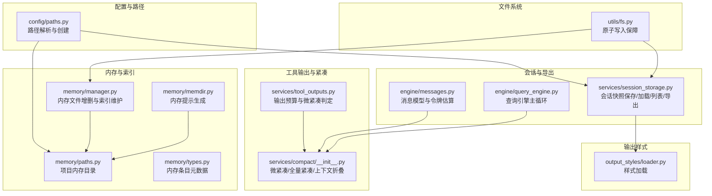
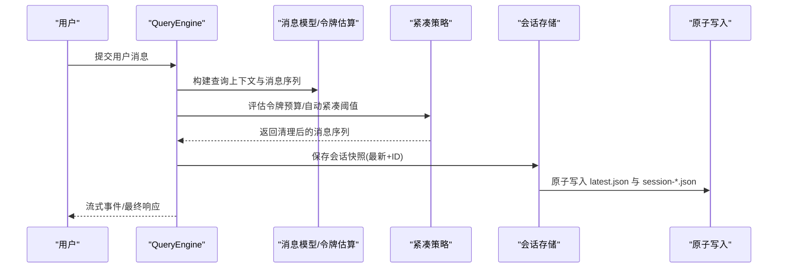
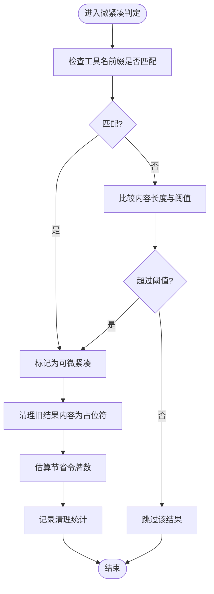
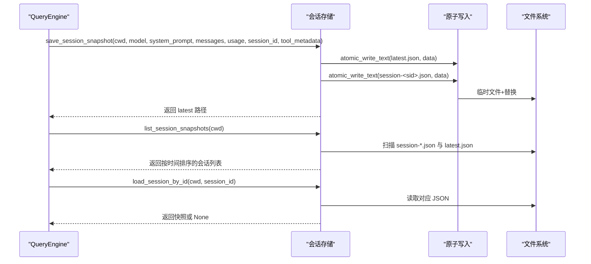
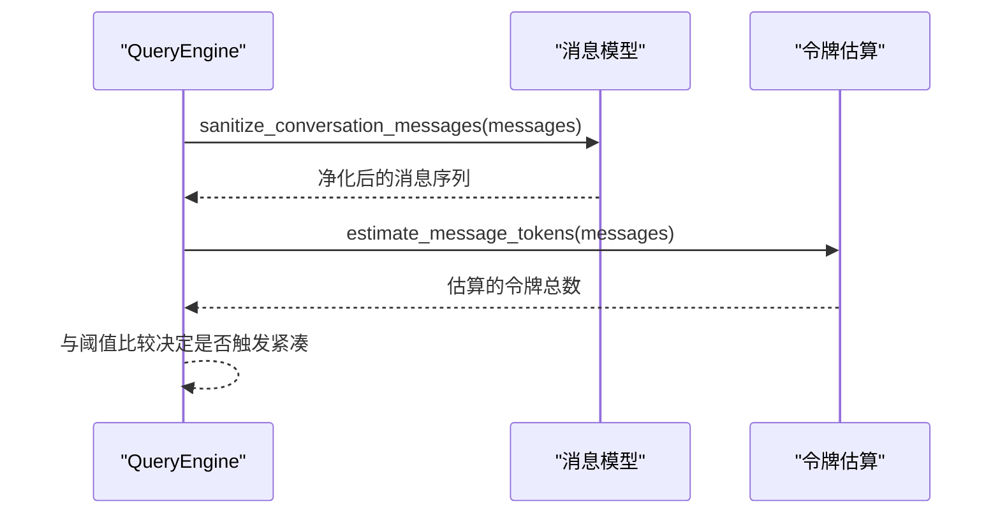
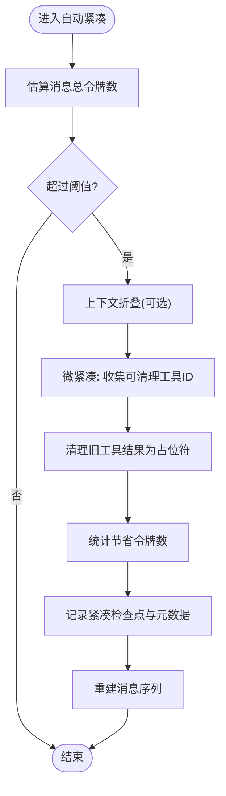
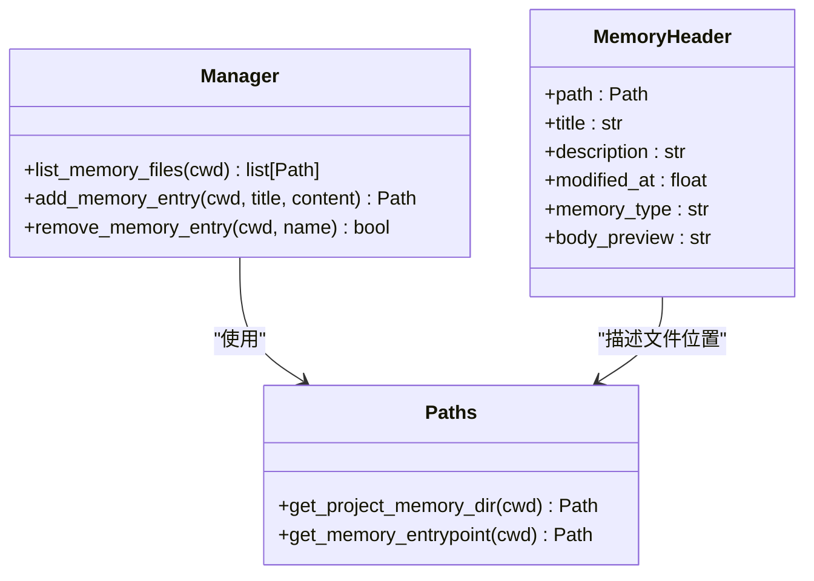
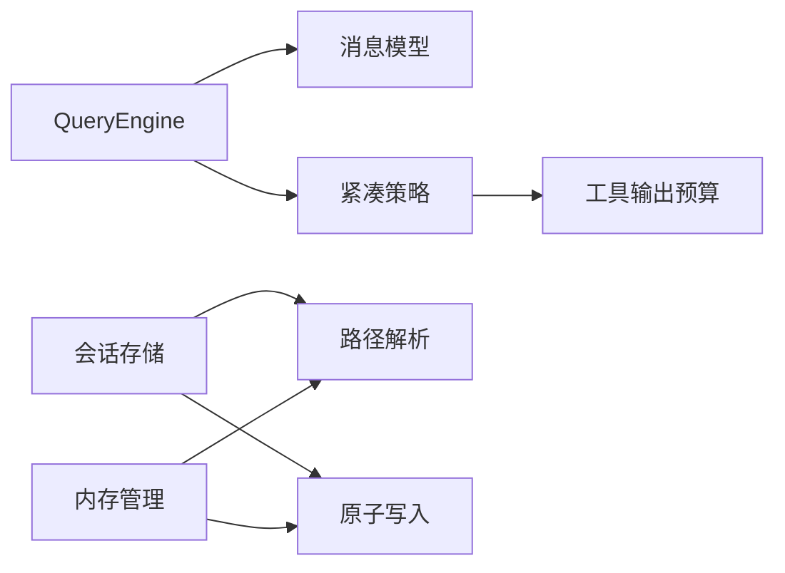

# 工具输出处理服务

<cite>
**本文引用的文件**
- [tool_outputs.py](file://src/openharness/services/tool_outputs.py)
- [session_storage.py](file://src/openharness/services/session_storage.py)
- [compact/__init__.py](file://src/openharness/services/compact/__init__.py)
- [paths.py](file://src/openharness/config/paths.py)
- [fs.py](file://src/openharness/utils/fs.py)
- [messages.py](file://src/openharness/engine/messages.py)
- [query_engine.py](file://src/openharness/engine/query_engine.py)
- [loader.py](file://src/openharness/output_styles/loader.py)
- [memdir.py](file://src/openharness/memory/memdir.py)
- [manager.py](file://src/openharness/memory/manager.py)
- [paths.py(memory)](file://src/openharness/memory/paths.py)
- [types.py(memory)](file://src/openharness/memory/types.py)
- [test_query_engine.py](file://tests/test_engine/test_query_engine.py)
- [test_session_storage.py](file://tests/test_services/test_session_storage.py)
</cite>

## 目录
1. [简介](#简介)
2. [项目结构](#项目结构)
3. [核心组件](#核心组件)
4. [架构总览](#架构总览)
5. [详细组件分析](#详细组件分析)
6. [依赖分析](#依赖分析)
7. [性能考虑](#性能考虑)
8. [故障排查指南](#故障排查指南)
9. [结论](#结论)
10. [附录](#附录)

## 简介
本文件系统化阐述 OpenHarness 工具输出处理服务的设计与实现，覆盖以下主题：
- 工具输出的标准化处理流程：包括不同输出类型的格式转换、内联与预览截断、离线落盘与索引记录。
- 存储与缓存机制：会话快照持久化、Markdown 导出、原子写入保障一致性；项目级内存目录与索引。
- 清理与过期管理：微紧凑（microcompact）策略、时间窗口清理、令牌预算控制与内存占用控制。
- 检索与查询接口：按会话、按时间、按工具类型过滤的查询能力。
- 错误处理与异常：空助手消息处理、提示过长错误识别、流式回退与重试。
- 性能优化与并发：令牌估算、上下文折叠、自动紧凑阈值、并发安全的原子写入。

## 项目结构
围绕“工具输出处理”的关键模块分布如下：
- 配置与路径：负责数据目录、会话目录、任务目录等的解析与创建。
- 输出与会话：工具输出预算与微紧凑策略、会话快照保存与加载、Markdown 导出。
- 引擎与消息：对话消息模型、令牌估算、消息净化、查询引擎主循环。
- 文件系统：原子写入保障，避免崩溃导致的半写文件。
- 内存与索引：项目级持久化记忆目录与索引文件，支持并发锁与原子更新。
- 输出样式：内置与自定义输出样式的加载与选择。

**图表来源**
- [paths.py:71-82](file://src/openharness/config/paths.py#L71-L82)
- [tool_outputs.py:1-56](file://src/openharness/services/tool_outputs.py#L1-L56)
- [compact/__init__.py:1-120](file://src/openharness/services/compact/__init__.py#L1-L120)
- [session_storage.py:1-108](file://src/openharness/services/session_storage.py#L1-L108)
- [messages.py:118-171](file://src/openharness/engine/messages.py#L118-L171)
- [query_engine.py:147-192](file://src/openharness/engine/query_engine.py#L147-L192)
- [fs.py:69-99](file://src/openharness/utils/fs.py#L69-L99)
- [paths.py(memory):11-23](file://src/openharness/memory/paths.py#L11-L23)
- [manager.py:23-59](file://src/openharness/memory/manager.py#L23-L59)
- [memdir.py:10-35](file://src/openharness/memory/memdir.py#L10-L35)
- [types.py(memory):9-19](file://src/openharness/memory/types.py#L9-L19)
- [loader.py:27-42](file://src/openharness/output_styles/loader.py#L27-L42)

**章节来源**
- [paths.py:71-82](file://src/openharness/config/paths.py#L71-L82)
- [session_storage.py:54-108](file://src/openharness/services/session_storage.py#L54-L108)
- [tool_outputs.py:10-56](file://src/openharness/services/tool_outputs.py#L10-L56)
- [compact/__init__.py:781-862](file://src/openharness/services/compact/__init__.py#L781-L862)
- [messages.py:118-171](file://src/openharness/engine/messages.py#L118-L171)
- [query_engine.py:147-192](file://src/openharness/engine/query_engine.py#L147-L192)
- [fs.py:69-99](file://src/openharness/utils/fs.py#L69-L99)
- [paths.py(memory):11-23](file://src/openharness/memory/paths.py#L11-L23)
- [manager.py:23-59](file://src/openharness/memory/manager.py#L23-L59)
- [memdir.py:10-35](file://src/openharness/memory/memdir.py#L10-L35)
- [loader.py:27-42](file://src/openharness/output_styles/loader.py#L27-L42)

## 核心组件
- 工具输出预算与微紧凑判定
  - 通过环境变量控制内联字符数、预览字符数、微紧凑阈值，并提供工具结果是否可微紧凑的判定逻辑。
- 会话快照与导出
  - 保存最新与指定 ID 的会话快照，列出最近会话，加载指定会话，导出 Markdown 转录。
- 消息模型与令牌估算
  - 定义文本、图像、工具调用、工具结果等消息块，提供令牌估算与消息净化。
- 自动紧凑与上下文折叠
  - 基于令牌预算的自动触发、上下文折叠、微紧凑清理旧工具结果、保留关键附件与元信息。
- 原子写入与并发安全
  - 使用临时文件+替换的方式保证写入原子性，配合独占锁处理并发读改写。
- 项目内存目录与索引
  - 为每个项目建立独立内存目录，支持增删内存文件并维护索引文件，提供并发锁保障。

**章节来源**
- [tool_outputs.py:26-56](file://src/openharness/services/tool_outputs.py#L26-L56)
- [session_storage.py:63-108](file://src/openharness/services/session_storage.py#L63-L108)
- [messages.py:118-171](file://src/openharness/engine/messages.py#L118-L171)
- [compact/__init__.py:781-862](file://src/openharness/services/compact/__init__.py#L781-L862)
- [fs.py:69-99](file://src/openharness/utils/fs.py#L69-L99)
- [manager.py:23-59](file://src/openharness/memory/manager.py#L23-L59)

## 架构总览
下图展示从用户输入到工具执行、输出落盘与会话持久化的端到端流程，以及微紧凑在其中的关键作用。

**图表来源**
- [query_engine.py:147-192](file://src/openharness/engine/query_engine.py#L147-L192)
- [messages.py:118-171](file://src/openharness/engine/messages.py#L118-L171)
- [compact/__init__.py:781-862](file://src/openharness/services/compact/__init__.py#L781-L862)
- [session_storage.py:63-108](file://src/openharness/services/session_storage.py#L63-L108)
- [fs.py:69-99](file://src/openharness/utils/fs.py#L69-L99)

## 详细组件分析

### 组件A：工具输出预算与微紧凑策略
- 功能要点
  - 通过环境变量动态调整内联显示长度、预览长度与微紧凑阈值。
  - 判定工具结果是否可进行微紧凑：以 MCP 前缀或长度阈值作为条件。
  - 微紧凑清理旧工具结果内容，仅保留占位信息，节省令牌并释放内存。
- 关键流程
  - 输入：工具名称与结果内容。
  - 判定：若工具名以特定前缀开头或内容长度超过阈值，则标记为可微紧凑。
  - 执行：在消息序列中定位旧工具结果块，替换为精简内容并统计节省的令牌数。
- 复杂度与性能
  - 时间复杂度：与消息中的工具结果数量线性相关。
  - 空间复杂度：原地替换，额外开销主要为计数与日志记录。
- 并发与一致性
  - 该策略由紧凑模块统一调度，不直接涉及文件写入，遵循查询引擎的消息序列更新。

**图表来源**
- [tool_outputs.py:50-56](file://src/openharness/services/tool_outputs.py#L50-L56)
- [compact/__init__.py:822-856](file://src/openharness/services/compact/__init__.py#L822-L856)

**章节来源**
- [tool_outputs.py:26-56](file://src/openharness/services/tool_outputs.py#L26-L56)
- [compact/__init__.py:781-862](file://src/openharness/services/compact/__init__.py#L781-L862)

### 组件B：会话快照存储与检索
- 功能要点
  - 保存会话快照：同时写入“最新”与“按ID命名”的 JSON 文件，便于快速加载与历史追溯。
  - 加载最新快照与按 ID 加载：支持从“latest.json”或“session-*.json”恢复。
  - 列表最近会话：扫描目录，提取摘要、消息数、模型与创建时间，按时间倒序返回。
  - 导出 Markdown：将转录内容写入 Markdown 文件，包含用户消息、工具调用与工具结果。
- 数据模型
  - 快照包含会话 ID、工作目录、模型、系统提示、消息序列、使用统计、工具元数据、创建时间、摘要与消息数。
- 原子写入与一致性
  - 使用原子写入函数确保写入过程崩溃时不会产生半写文件，提升可靠性。

**图表来源**
- [session_storage.py:63-108](file://src/openharness/services/session_storage.py#L63-L108)
- [session_storage.py:131-191](file://src/openharness/services/session_storage.py#L131-L191)
- [session_storage.py:194-207](file://src/openharness/services/session_storage.py#L194-L207)
- [fs.py:69-99](file://src/openharness/utils/fs.py#L69-L99)

**章节来源**
- [session_storage.py:63-108](file://src/openharness/services/session_storage.py#L63-L108)
- [session_storage.py:131-191](file://src/openharness/services/session_storage.py#L131-L191)
- [session_storage.py:194-207](file://src/openharness/services/session_storage.py#L194-L207)
- [fs.py:69-99](file://src/openharness/utils/fs.py#L69-L99)

### 组件C：消息模型与令牌估算
- 功能要点
  - 定义消息块类型：文本、图像、工具调用、工具结果。
  - 提供令牌估算函数，用于评估消息序列的上下文成本。
  - 消息净化：去除空助手消息、修剪未完成的工具往返，保证提供方兼容性。
- 序列图：查询引擎在提交消息前后对消息进行净化与令牌估算。

**图表来源**
- [messages.py:118-171](file://src/openharness/engine/messages.py#L118-L171)
- [compact/__init__.py:116-136](file://src/openharness/services/compact/__init__.py#L116-L136)
- [query_engine.py:147-192](file://src/openharness/engine/query_engine.py#L147-L192)

**章节来源**
- [messages.py:118-171](file://src/openharness/engine/messages.py#L118-L171)
- [compact/__init__.py:116-136](file://src/openharness/services/compact/__init__.py#L116-L136)
- [query_engine.py:147-192](file://src/openharness/engine/query_engine.py#L147-L192)

### 组件D：自动紧凑与上下文折叠
- 功能要点
  - 自动紧凑阈值与缓冲区：当估算令牌超过阈值时触发紧凑。
  - 上下文折叠：对较长文本进行头部/尾部折叠，减少冗余。
  - 微紧凑：清理旧工具结果内容，保留最近若干条，节省大量令牌。
  - 全量紧凑：调用 LLM 生成结构化摘要与保留段，重建消息序列。
- 关键常量与阈值
  - 缓冲令牌数、最大输出令牌、紧凑超时、最大连续失败次数、最近保留数量等。
- 流程图：微紧凑清理旧工具结果并统计节省的令牌数。

**图表来源**
- [compact/__init__.py:54-67](file://src/openharness/services/compact/__init__.py#L54-L67)
- [compact/__init__.py:273-344](file://src/openharness/services/compact/__init__.py#L273-L344)
- [compact/__init__.py:781-862](file://src/openharness/services/compact/__init__.py#L781-L862)

**章节来源**
- [compact/__init__.py:54-67](file://src/openharness/services/compact/__init__.py#L54-L67)
- [compact/__init__.py:273-344](file://src/openharness/services/compact/__init__.py#L273-L344)
- [compact/__init__.py:781-862](file://src/openharness/services/compact/__init__.py#L781-L862)

### 组件E：项目内存目录与索引
- 功能要点
  - 为每个项目生成唯一内存目录，基于工作目录哈希与名称组合。
  - 提供内存文件增删与索引文件维护，支持并发独占锁。
  - 自动生成内存提示，包含入口文件与内容预览。
- 类图：内存相关数据结构与操作

**图表来源**
- [types.py(memory):9-19](file://src/openharness/memory/types.py#L9-L19)
- [manager.py:17-59](file://src/openharness/memory/manager.py#L17-L59)
- [paths.py(memory):11-23](file://src/openharness/memory/paths.py#L11-L23)

**章节来源**
- [paths.py(memory):11-23](file://src/openharness/memory/paths.py#L11-L23)
- [manager.py:23-59](file://src/openharness/memory/manager.py#L23-L59)
- [memdir.py:10-35](file://src/openharness/memory/memdir.py#L10-L35)
- [types.py(memory):9-19](file://src/openharness/memory/types.py#L9-L19)

### 组件F：输出样式加载与选择
- 功能要点
  - 内置默认、最小化、Codex 三种输出样式。
  - 支持用户自定义样式目录，加载 Markdown 样式文件。
  - 提供样式名称与内容的映射，便于前端选择与渲染。

**章节来源**
- [loader.py:27-42](file://src/openharness/output_styles/loader.py#L27-L42)

## 依赖分析
- 组件耦合
  - 查询引擎依赖消息模型与紧凑策略，以维持上下文在阈值内。
  - 会话存储依赖路径解析与原子写入，确保可靠持久化。
  - 内存管理依赖路径解析与文件锁，保障并发安全。
- 外部依赖
  - 环境变量用于动态配置输出预算与紧凑阈值。
  - 文件系统 API 用于原子写入与目录创建。

**图表来源**
- [query_engine.py:147-192](file://src/openharness/engine/query_engine.py#L147-L192)
- [messages.py:118-171](file://src/openharness/engine/messages.py#L118-L171)
- [compact/__init__.py:116-136](file://src/openharness/services/compact/__init__.py#L116-L136)
- [tool_outputs.py:26-56](file://src/openharness/services/tool_outputs.py#L26-L56)
- [session_storage.py:54-108](file://src/openharness/services/session_storage.py#L54-L108)
- [paths.py:71-82](file://src/openharness/config/paths.py#L71-L82)
- [fs.py:69-99](file://src/openharness/utils/fs.py#L69-L99)
- [manager.py:23-59](file://src/openharness/memory/manager.py#L23-L59)

**章节来源**
- [query_engine.py:147-192](file://src/openharness/engine/query_engine.py#L147-L192)
- [compact/__init__.py:116-136](file://src/openharness/services/compact/__init__.py#L116-L136)
- [session_storage.py:54-108](file://src/openharness/services/session_storage.py#L54-L108)
- [paths.py:71-82](file://src/openharness/config/paths.py#L71-L82)
- [fs.py:69-99](file://src/openharness/utils/fs.py#L69-L99)
- [manager.py:23-59](file://src/openharness/memory/manager.py#L23-L59)

## 性能考虑
- 令牌估算与上下文折叠
  - 通过保守的令牌估算与上下文折叠，降低昂贵的全量紧凑触发频率。
- 微紧凑优先
  - 在满足预算的前提下优先采用微紧凑，成本低、效果显著。
- 原子写入与目录组织
  - 原子写入避免崩溃导致的半写文件，减少恢复成本；目录按项目与会话分层，便于清理与检索。
- 并发与锁
  - 内存文件增删与索引维护使用独占锁，避免多进程竞争写入。

[本节为通用性能建议，无需具体文件分析]

## 故障排查指南
- 空助手消息导致无响应
  - 现象：提交消息后无最终完成事件且消息数异常。
  - 排查：检查是否出现空助手消息，确认消息净化逻辑已移除无效消息。
  - 参考测试：[test_query_engine.py:1448-1464](file://tests/test_engine/test_query_engine.py#L1448-L1464)
- 提示过长错误
  - 现象：抛出“提示过长/上下文长度超出”等错误。
  - 排查：检查紧凑策略是否正确触发，确认上下文折叠与微紧凑已生效。
  - 参考实现：[compact/__init__.py:249-271](file://src/openharness/services/compact/__init__.py#L249-L271)
- 大型工具输出未落盘
  - 现象：工具输出过大但未见落盘文件。
  - 排查：确认输出预算阈值与预览阈值设置，检查微紧凑是否将完整内容保存至外部文件并记录路径。
  - 参考测试：[test_query_engine.py:1388-1464](file://tests/test_engine/test_query_engine.py#L1388-L1464)
- 会话加载失败
  - 现象：加载最新会话时报错或返回空。
  - 排查：确认会话目录存在且 JSON 可解析；检查“latest.json”与“session-*.json”的原子写入状态。
  - 参考实现：[session_storage.py:123-128](file://src/openharness/services/session_storage.py#L123-L128)
- 并发写入冲突
  - 现象：内存文件增删后索引不一致。
  - 排查：确认使用独占锁保护写入操作，避免竞态条件。
  - 参考实现：[manager.py:28-36](file://src/openharness/memory/manager.py#L28-L36)

**章节来源**
- [test_query_engine.py:1448-1464](file://tests/test_engine/test_query_engine.py#L1448-L1464)
- [compact/__init__.py:249-271](file://src/openharness/services/compact/__init__.py#L249-L271)
- [test_query_engine.py:1388-1464](file://tests/test_engine/test_query_engine.py#L1388-L1464)
- [session_storage.py:123-128](file://src/openharness/services/session_storage.py#L123-L128)
- [manager.py:28-36](file://src/openharness/memory/manager.py#L28-L36)

## 结论
OpenHarness 的工具输出处理服务通过“预算控制 + 微紧凑 + 全量紧凑 + 原子写入 + 并发锁”的组合，实现了高可靠、高性能、可扩展的工具输出标准化处理。它既能满足小型输出的内联展示，也能妥善处理大型输出的离线落盘与索引；既能保障内存占用与磁盘空间的可控，也提供了便捷的检索与导出能力。配合灵活的输出样式与会话管理，为用户提供了稳定可靠的协作与开发体验。

[本节为总结性内容，无需具体文件分析]

## 附录
- 环境变量与默认值
  - 工具输出内联字符数、预览字符数、微紧凑阈值均可通过环境变量调整。
- 输出样式
  - 内置样式与用户自定义样式目录，便于前端渲染与用户体验定制。
- 会话与内存目录
  - 会话快照与项目内存目录均按项目隔离，便于长期保存与清理。

**章节来源**
- [tool_outputs.py:26-56](file://src/openharness/services/tool_outputs.py#L26-L56)
- [loader.py:27-42](file://src/openharness/output_styles/loader.py#L27-L42)
- [paths.py:71-82](file://src/openharness/config/paths.py#L71-L82)
- [paths.py(memory):11-23](file://src/openharness/memory/paths.py#L11-L23)