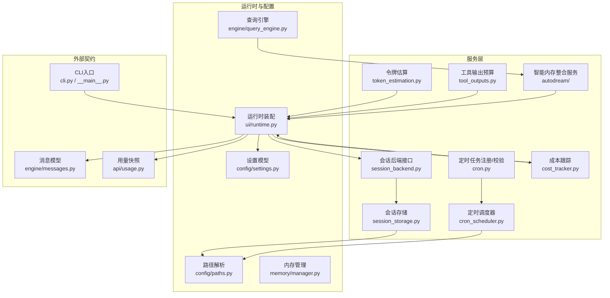
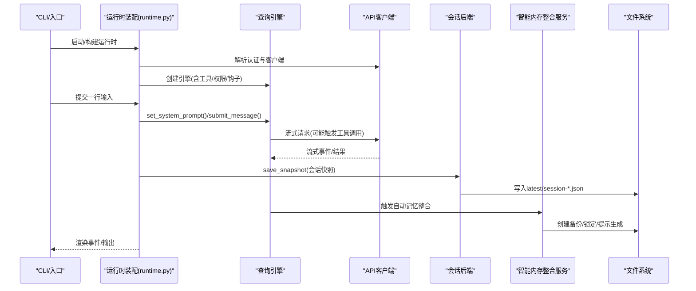
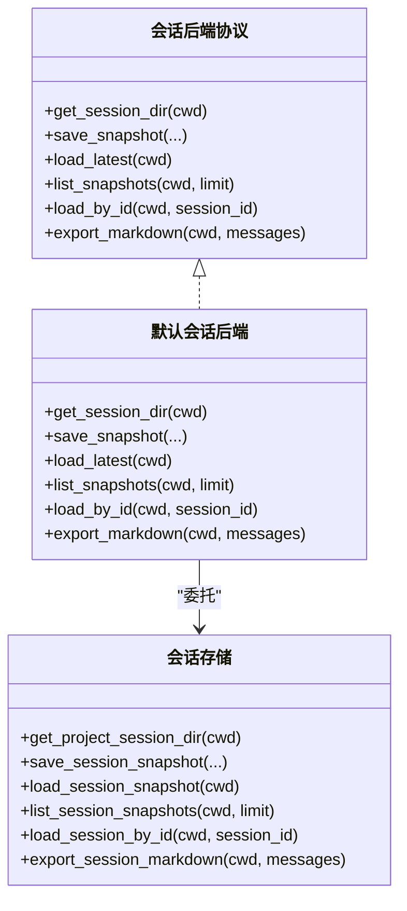
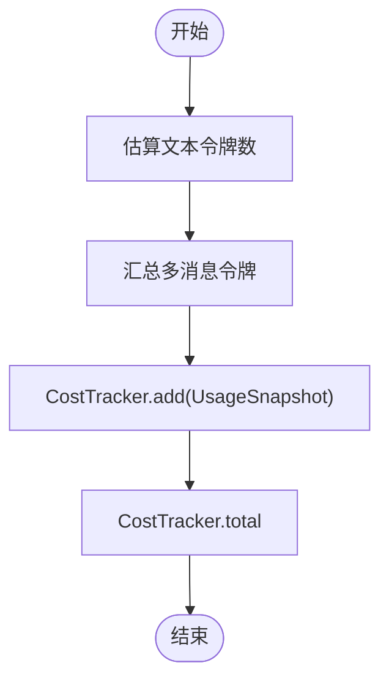
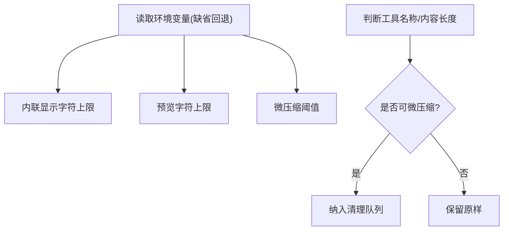
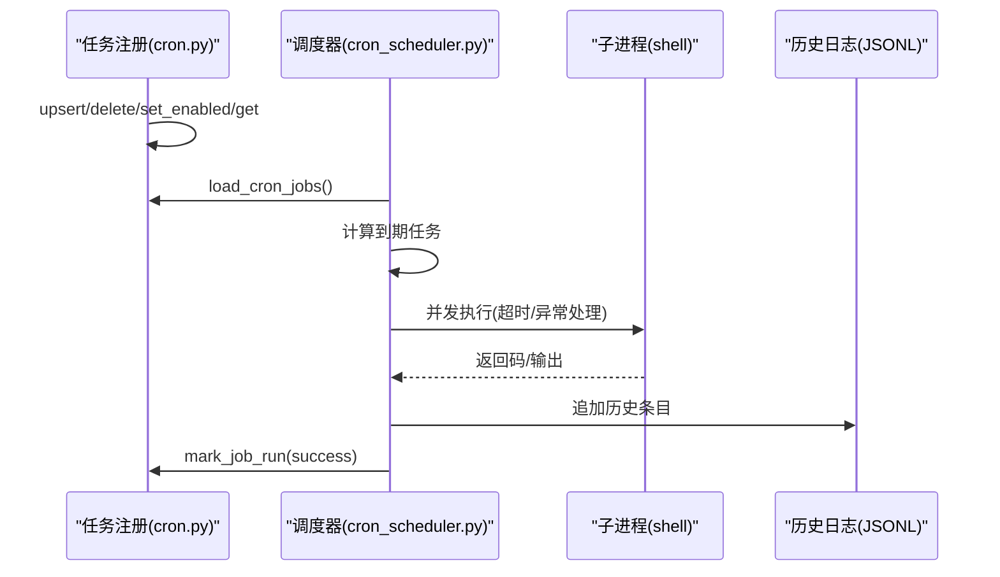
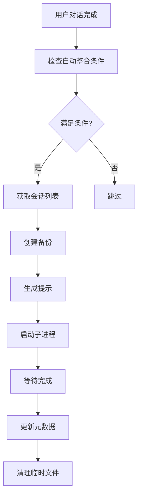
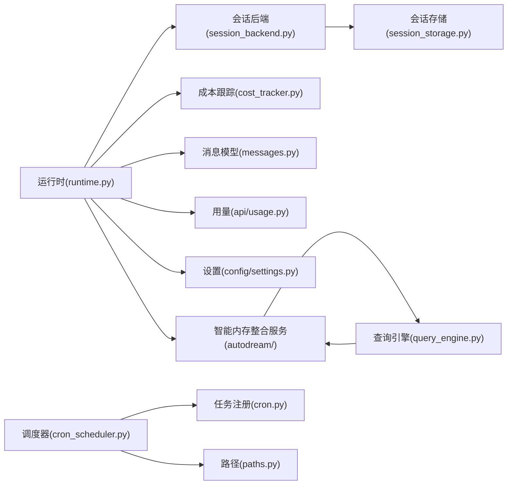

# 服务系统

<cite>
**本文引用的文件**
- [session_storage.py](file://src/openharness/services/session_storage.py)
- [token_estimation.py](file://src/openharness/services/token_estimation.py)
- [tool_outputs.py](file://src/openharness/services/tool_outputs.py)
- [session_backend.py](file://src/openharness/services/session_backend.py)
- [cron_scheduler.py](file://src/openharness/services/cron_scheduler.py)
- [cron.py](file://src/openharness/services/cron.py)
- [manager.py](file://src/openharness/memory/manager.py)
- [cost_tracker.py](file://src/openharness/engine/cost_tracker.py)
- [settings.py](file://src/openharness/config/settings.py)
- [paths.py](file://src/openharness/config/paths.py)
- [usage.py](file://src/openharness/api/usage.py)
- [messages.py](file://src/openharness/engine/messages.py)
- [runtime.py](file://src/openharness/ui/runtime.py)
- [cli.py](file://src/openharness/cli.py)
- [__main__.py](file://src/openharness/__main__.py)
- [README.md](file://README.md)
- [service.py](file://src/openharness/services/autodream/service.py)
- [backup.py](file://src/openharness/services/autodream/backup.py)
- [lock.py](file://src/openharness/services/autodream/lock.py)
- [prompt.py](file://src/openharness/services/autodream/prompt.py)
- [__init__.py](file://src/openharness/services/autodream/__init__.py)
- [query_engine.py](file://src/openharness/engine/query_engine.py)
</cite>

## 目录
1. [简介](#简介)
2. [项目结构](#项目结构)
3. [核心组件](#核心组件)
4. [架构总览](#架构总览)
5. [详细组件分析](#详细组件分析)
6. [依赖分析](#依赖分析)
7. [性能考虑](#性能考虑)
8. [故障排除指南](#故障排除指南)
9. [结论](#结论)
10. [附录](#附录)

## 简介
本文件面向OpenHarness服务系统，围绕会话存储、令牌估算、工具输出处理、会话后端、定时调度以及新增的智能内存整合服务（auto-dream）等进行全面说明。文档从架构设计、数据流、处理逻辑、依赖关系、配置与管理、扩展性与自定义、性能优化与监控、故障排除与维护等方面展开，帮助开发者与使用者理解并高效使用该服务系统。

## 项目结构
OpenHarness的服务系统主要分布在以下模块：
- 会话与持久化：services/session_storage.py、services/session_backend.py、config/paths.py
- 令牌估算与成本跟踪：services/token_estimation.py、engine/cost_tracker.py、api/usage.py
- 工具输出预算与截断：services/tool_outputs.py
- 定时调度：services/cron.py、services/cron_scheduler.py
- 内存管理：memory/manager.py
- 智能内存整合服务：services/autodream/（包含备份、锁定、提示生成、服务主模块）
- 运行时装配与会话集成：ui/runtime.py
- 配置模型与路径解析：config/settings.py、config/paths.py
- CLI入口与命令组织：cli.py、__main__.py
- 顶层说明与特性概览：README.md

**更新** 新增智能内存整合服务模块，包括备份、锁定、提示生成等功能

图表来源
- [session_storage.py:1-231](file://src/openharness/services/session_storage.py#L1-L231)
- [session_backend.py:1-98](file://src/openharness/services/session_backend.py#L1-L98)
- [token_estimation.py:1-16](file://src/openharness/services/token_estimation.py#L1-L16)
- [tool_outputs.py:1-56](file://src/openharness/services/tool_outputs.py#L1-L56)
- [cron.py:1-118](file://src/openharness/services/cron.py#L1-L118)
- [cron_scheduler.py:1-359](file://src/openharness/services/cron_scheduler.py#L1-L359)
- [cost_tracker.py:1-25](file://src/openharness/engine/cost_tracker.py#L1-L25)
- [runtime.py:1-703](file://src/openharness/ui/runtime.py#L1-L703)
- [settings.py:1-965](file://src/openharness/config/settings.py#L1-L965)
- [paths.py:1-161](file://src/openharness/config/paths.py#L1-L161)
- [messages.py:1-222](file://src/openharness/engine/messages.py#L1-L222)
- [usage.py:1-18](file://src/openharness/api/usage.py#L1-L18)
- [cli.py:1-800](file://src/openharness/cli.py#L1-L800)
- [__main__.py:1-7](file://src/openharness/__main__.py#L1-L7)
- [service.py:1-305](file://src/openharness/services/autodream/service.py#L1-L305)
- [backup.py:1-105](file://src/openharness/services/autodream/backup.py#L1-L105)
- [lock.py:1-139](file://src/openharness/services/autodream/lock.py#L1-L139)
- [prompt.py:1-124](file://src/openharness/services/autodream/prompt.py#L1-L124)
- [query_engine.py:136-148](file://src/openharness/engine/query_engine.py#L136-L148)

## 核心组件
- 会话存储与导出：负责会话快照的保存、加载、列表与Markdown导出；支持按项目隔离目录与"最新"别名。
- 会话后端抽象：定义统一的会话持久化接口，并提供默认实现（基于本地文件系统）。
- 令牌估算：提供文本到令牌的粗略估算，用于预算与成本控制。
- 工具输出预算：通过环境变量控制内联显示长度、预览长度与压缩阈值，支持对旧结果清理。
- 成本跟踪：聚合会话生命周期内的输入/输出令牌用量。
- 定时调度：提供任务注册、校验、执行、历史记录与守护进程管理。
- 内存管理：项目级记忆文件的增删与索引维护。
- 智能内存整合服务：自动备份、锁定、提示生成与执行，实现会话记忆的智能整合。
- 运行时装配：构建会话运行时对象，连接API客户端、工具注册表、钩子执行器、查询引擎等，并在每次交互后自动保存会话快照。
- 查询引擎集成：在用户对话完成后自动触发智能内存整合流程。

**更新** 新增智能内存整合服务组件，包括备份、锁定、提示生成等功能

章节来源
- [session_storage.py:63-108](file://src/openharness/services/session_storage.py#L63-L108)
- [session_backend.py:14-98](file://src/openharness/services/session_backend.py#L14-L98)
- [token_estimation.py:6-16](file://src/openharness/services/token_estimation.py#L6-L16)
- [tool_outputs.py:15-56](file://src/openharness/services/tool_outputs.py#L15-L56)
- [cost_tracker.py:8-25](file://src/openharness/engine/cost_tracker.py#L8-L25)
- [cron_scheduler.py:150-232](file://src/openharness/services/cron_scheduler.py#L150-L232)
- [manager.py:17-59](file://src/openharness/memory/manager.py#L17-L59)
- [runtime.py:205-392](file://src/openharness/ui/runtime.py#L205-L392)
- [service.py:1-305](file://src/openharness/services/autodream/service.py#L1-L305)
- [backup.py:1-105](file://src/openharness/services/autodream/backup.py#L1-L105)
- [lock.py:1-139](file://src/openharness/services/autodream/lock.py#L1-L139)
- [prompt.py:1-124](file://src/openharness/services/autodream/prompt.py#L1-L124)
- [query_engine.py:136-148](file://src/openharness/engine/query_engine.py#L136-L148)

## 架构总览
OpenHarness服务系统以"运行时装配"为核心，将API客户端、工具注册表、权限检查、钩子执行、查询引擎、会话后端、成本跟踪以及智能内存整合服务等组件组合成可复用的RuntimeBundle。运行时在用户提交每条消息或执行命令后，自动保存会话快照，确保状态可恢复与可观测。智能内存整合服务通过查询引擎的回调机制，在用户对话完成后自动触发。

**更新** 新增智能内存整合服务的触发流程

图表来源
- [runtime.py:528-677](file://src/openharness/ui/runtime.py#L528-L677)
- [session_backend.py:58-94](file://src/openharness/services/session_backend.py#L58-L94)
- [session_storage.py:63-108](file://src/openharness/services/session_storage.py#L63-L108)
- [query_engine.py:136-148](file://src/openharness/engine/query_engine.py#L136-L148)
- [service.py:238-294](file://src/openharness/services/autodream/service.py#L238-L294)

## 详细组件分析

### 会话存储与后端
- 会话存储
  - 功能：保存会话快照（含消息、用量、工具元数据、摘要等），支持按ID与"最新"两种方式访问；提供Markdown导出。
  - 关键点：消息规范化、元数据白名单过滤、原子写入、向前兼容的消息载入。
- 会话后端
  - 接口：统一的目录定位、保存、加载、列表、按ID加载与导出。
  - 默认实现：委托给会话存储模块，路径来自数据目录下的sessions子目录。

图表来源
- [session_backend.py:14-98](file://src/openharness/services/session_backend.py#L14-L98)
- [session_storage.py:54-231](file://src/openharness/services/session_storage.py#L54-L231)

章节来源
- [session_storage.py:63-231](file://src/openharness/services/session_storage.py#L63-L231)
- [session_backend.py:51-98](file://src/openharness/services/session_backend.py#L51-L98)
- [paths.py:71-75](file://src/openharness/config/paths.py#L71-L75)

### 令牌估算与成本跟踪
- 令牌估算
  - 基于字符数的启发式估算，适合预算与阈值控制。
- 成本跟踪
  - 聚合计费快照，累加输入/输出令牌，便于会话级别的成本统计。

图表来源
- [token_estimation.py:6-16](file://src/openharness/services/token_estimation.py#L6-L16)
- [cost_tracker.py:14-24](file://src/openharness/engine/cost_tracker.py#L14-L24)
- [usage.py:8-18](file://src/openharness/api/usage.py#L8-L18)

章节来源
- [token_estimation.py:6-16](file://src/openharness/services/token_estimation.py#L6-L16)
- [cost_tracker.py:8-25](file://src/openharness/engine/cost_tracker.py#L8-L25)
- [usage.py:8-18](file://src/openharness/api/usage.py#L8-L18)

### 工具输出处理与预算
- 预算参数
  - 内联显示字符上限、预览字符上限、微压缩阈值，均可通过环境变量覆盖。
- 判定策略
  - 对MCP类工具或超长结果启用微压缩判定，便于清理旧结果、释放上下文窗口空间。

图表来源
- [tool_outputs.py:15-56](file://src/openharness/services/tool_outputs.py#L15-L56)

章节来源
- [tool_outputs.py:15-56](file://src/openharness/services/tool_outputs.py#L15-L56)

### 定时调度与任务管理
- 注册与校验
  - 提供任务注册、删除、启用/禁用、存在性查询与下一次运行时间计算。
- 执行与历史
  - 调度器周期扫描，识别到期任务并发执行；记录执行历史（JSONL），包含开始/结束时间、返回码、标准输出/错误等。
- 守护进程
  - 支持fork式后台运行、PID文件、日志文件、停止信号处理与强制终止。

图表来源
- [cron.py:53-118](file://src/openharness/services/cron.py#L53-L118)
- [cron_scheduler.py:150-232](file://src/openharness/services/cron_scheduler.py#L150-L232)
- [cron_scheduler.py:261-302](file://src/openharness/services/cron_scheduler.py#L261-L302)
- [paths.py:97-99](file://src/openharness/config/paths.py#L97-L99)

章节来源
- [cron.py:22-118](file://src/openharness/services/cron.py#L22-L118)
- [cron_scheduler.py:1-359](file://src/openharness/services/cron_scheduler.py#L1-L359)
- [paths.py:97-99](file://src/openharness/config/paths.py#L97-L99)

### 智能内存整合服务
- 服务架构
  - 包含备份、锁定、提示生成和执行四个核心模块，提供完整的自动记忆整合解决方案。
- 备份管理
  - 创建时间戳备份、差异比较、格式化输出、最新备份查找和恢复功能。
- 锁定机制
  - 防止并发执行、检测持有者进程、记录最后整合时间、回滚锁定状态。
- 提示生成
  - 构建结构化的记忆整合提示，包含证据纪律、分类规则、过时性处理等指导原则。
- 执行流程
  - 自动触发条件检查、手动启动、子进程执行、任务元数据管理和完成监听。

**更新** 新增智能内存整合服务的完整架构图

图表来源
- [service.py:238-294](file://src/openharness/services/autodream/service.py#L238-L294)
- [backup.py:27-48](file://src/openharness/services/autodream/backup.py#L27-L48)
- [lock.py:52-75](file://src/openharness/services/autodream/lock.py#L52-L75)
- [prompt.py:12-123](file://src/openharness/services/autodream/prompt.py#L12-L123)

章节来源
- [service.py:1-305](file://src/openharness/services/autodream/service.py#L1-L305)
- [backup.py:1-105](file://src/openharness/services/autodream/backup.py#L1-L105)
- [lock.py:1-139](file://src/openharness/services/autodream/lock.py#L1-L139)
- [prompt.py:1-124](file://src/openharness/services/autodream/prompt.py#L1-L124)
- [__init__.py:1-35](file://src/openharness/services/autodream/__init__.py#L1-L35)

### 内存管理
- 文件管理
  - 列表、新增、删除项目级记忆文件，并同步更新索引文件。
- 锁与原子写入
  - 使用独占锁与原子写入保证并发安全。

章节来源
- [manager.py:17-59](file://src/openharness/memory/manager.py#L17-L59)

### 运行时装配与会话集成
- 组件装配
  - 解析设置、构建API客户端、MCP管理器、工具注册表、钩子执行器、查询引擎、应用状态存储、命令注册表等。
- 会话保存
  - 每次命令执行或消息提交后，自动保存会话快照（含消息、用量、工具元数据）。

章节来源
- [runtime.py:205-392](file://src/openharness/ui/runtime.py#L205-L392)
- [runtime.py:528-677](file://src/openharness/ui/runtime.py#L528-L677)

## 依赖分析
- 组件耦合
  - 会话后端与会话存储：低耦合，通过协议解耦，默认实现委托存储模块。
  - 运行时与会话后端：强依赖，每次交互均调用保存。
  - 定时调度与配置：调度器依赖任务注册文件与数据目录；任务注册依赖文件锁与原子写入。
  - 查询引擎与智能内存整合：查询引擎在对话完成后触发自动整合。
- 外部依赖
  - 文件系统：会话、任务、反馈、日志、定时任务注册、智能内存整合备份等均落盘。
  - 子进程：定时任务和智能内存整合通过shell子进程执行。
  - 第三方库：定时表达式校验、路径解析、配置序列化等。

**更新** 新增智能内存整合服务与查询引擎的依赖关系

图表来源
- [runtime.py:1-703](file://src/openharness/ui/runtime.py#L1-L703)
- [session_backend.py:1-98](file://src/openharness/services/session_backend.py#L1-L98)
- [session_storage.py:1-231](file://src/openharness/services/session_storage.py#L1-L231)
- [cost_tracker.py:1-25](file://src/openharness/engine/cost_tracker.py#L1-L25)
- [messages.py:1-222](file://src/openharness/engine/messages.py#L1-L222)
- [usage.py:1-18](file://src/openharness/api/usage.py#L1-L18)
- [cron_scheduler.py:1-359](file://src/openharness/services/cron_scheduler.py#L1-L359)
- [cron.py:1-118](file://src/openharness/services/cron.py#L1-L118)
- [paths.py:1-161](file://src/openharness/config/paths.py#L1-L161)
- [settings.py:1-965](file://src/openharness/config/settings.py#L1-L965)
- [service.py:238-294](file://src/openharness/services/autodream/service.py#L238-L294)
- [query_engine.py:136-148](file://src/openharness/engine/query_engine.py#L136-L148)

## 性能考虑
- 会话存储
  - 原子写入避免部分写入导致的损坏；消息规范化减少无效片段。
- 令牌估算
  - 启发式估算快速但不精确，适合预算与阈值控制；实际用量以API返回为准。
- 工具输出预算
  - 通过环境变量灵活调整内联/预览/压缩阈值，平衡可观测性与上下文占用。
- 定时调度
  - 固定tick间隔轮询，支持并发执行多个到期任务；超时与异常有明确处理与记录。
- 智能内存整合
  - 自动触发间隔限制，避免频繁执行；备份操作采用时间戳命名，支持增量备份。
- 运行时
  - 每次交互自动保存快照，兼顾恢复能力与磁盘IO；可通过设置限制最大轮次避免无限循环。

**更新** 新增智能内存整合服务的性能考虑

章节来源
- [session_storage.py:100-106](file://src/openharness/services/session_storage.py#L100-L106)
- [token_estimation.py:6-16](file://src/openharness/services/token_estimation.py#L6-L16)
- [tool_outputs.py:15-56](file://src/openharness/services/tool_outputs.py#L15-L56)
- [cron_scheduler.py:33-35](file://src/openharness/services/cron_scheduler.py#L33-L35)
- [service.py:25-28](file://src/openharness/services/autodream/service.py#L25-L28)
- [runtime.py:636-677](file://src/openharness/ui/runtime.py#L636-L677)

## 故障排除指南
- 定时调度器
  - 状态查询：检查PID文件、日志文件与历史文件位置。
  - 停止调度器：发送SIGTERM，若无响应则强制SIGKILL。
  - 历史排查：查看历史文件中的状态、返回码与错误信息。
- 会话恢复
  - 若会话被中断导致尾部工具调用未完成，消息规范化会移除无效片段，避免后续会话被拒绝。
- 权限与认证
  - 运行时构建失败通常与认证配置有关，需检查设置与环境变量；CLI提供dry-run预览以提前发现配置问题。
- 智能内存整合
  - 锁定失败：检查锁定文件是否存在，确认持有者进程是否仍在运行。
  - 备份恢复：使用恢复功能时注意备份目录结构，确保目标目录权限正确。
  - 提示生成：预览模式下不会修改文件，仅输出变更计划。
- 日志与路径
  - 日志目录与数据目录可通过环境变量覆盖，便于在不同部署环境下定位日志与缓存。

**更新** 新增智能内存整合服务的故障排除指南

章节来源
- [cron_scheduler.py:345-359](file://src/openharness/services/cron_scheduler.py#L345-L359)
- [cron_scheduler.py:119-144](file://src/openharness/services/cron_scheduler.py#L119-L144)
- [messages.py:118-171](file://src/openharness/engine/messages.py#L118-L171)
- [cli.py:396-595](file://src/openharness/cli.py#L396-L595)
- [paths.py:54-68](file://src/openharness/config/paths.py#L54-L68)
- [lock.py:52-75](file://src/openharness/services/autodream/lock.py#L52-L75)
- [backup.py:91-105](file://src/openharness/services/autodream/backup.py#L91-L105)
- [prompt.py:24](file://src/openharness/services/autodream/prompt.py#L24)

## 结论
OpenHarness服务系统以清晰的模块边界与协议抽象实现了会话持久化、令牌估算、工具输出预算、成本跟踪、定时调度、智能内存整合与运行时装配。通过统一的会话后端接口、运行时自动保存机制以及智能内存整合服务，系统在功能完整性与可维护性之间取得良好平衡。智能内存整合服务通过自动备份、锁定、提示生成和执行，实现了会话记忆的智能化管理。结合环境变量与配置模型，用户可在不同场景下灵活定制行为，并通过CLI与dry-run进行安全预览与排错。

**更新** 强调智能内存整合服务的重要作用和价值

## 附录
- 配置与管理要点
  - 设置模型：集中管理API、行为、UI、沙箱、插件、MCP、内存等配置项。
  - 路径解析：遵循XDG风格约定，支持环境变量覆盖。
  - CLI：提供子命令与选项，支持非交互模式与dry-run预览。
- 扩展与自定义
  - 自定义工具：遵循工具基类与输入模型规范。
  - 自定义技能：使用SKILL.md格式，按需加载。
  - 插件生态：支持命令、钩子、代理与MCP服务器扩展。
  - 智能内存整合：可配置自动整合开关、最小小时数和最小会话数量。
- 最佳实践
  - 在生产环境中启用原子写入与文件锁，避免并发冲突。
  - 使用定时任务前先dry-run验证任务与环境。
  - 合理设置工具输出预算，避免上下文溢出。
  - 定期清理历史与日志，保持磁盘空间健康。
  - 启用智能内存整合功能，定期整理会话记忆。
  - 使用预览模式先检查变更计划，确认后再执行实际修改。

**更新** 新增智能内存整合服务的最佳实践建议

章节来源
- [settings.py:60-71](file://src/openharness/config/settings.py#L60-L71)
- [paths.py:15-161](file://src/openharness/config/paths.py#L15-L161)
- [cli.py:749-800](file://src/openharness/cli.py#L749-L800)
- [README.md:725-780](file://README.md#L725-L780)
- [service.py:127-131](file://src/openharness/services/autodream/service.py#L127-L131)
- [prompt.py:24](file://src/openharness/services/autodream/prompt.py#L24)