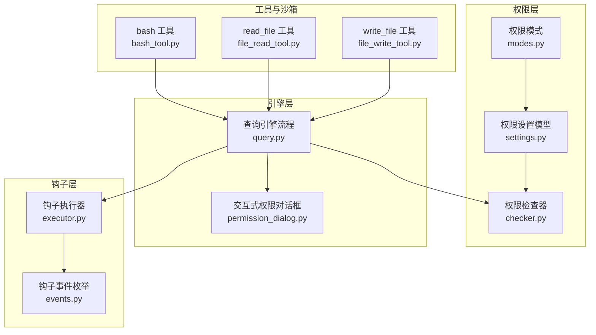
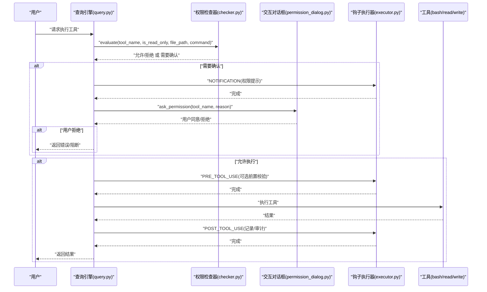
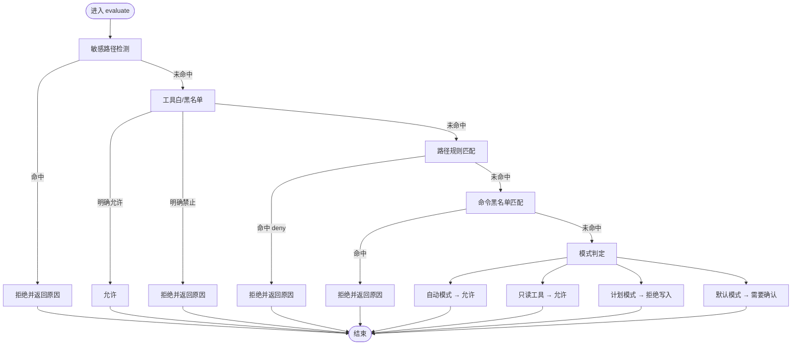
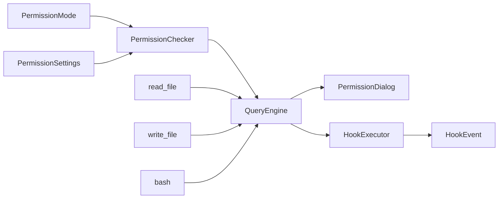

# 权限系统

<cite>
**本文引用的文件**
- [checker.py](file://src/openharness/permissions/checker.py)
- [modes.py](file://src/openharness/permissions/modes.py)
- [settings.py](file://src/openharness/config/settings.py)
- [query.py](file://src/openharness/engine/query.py)
- [permission_dialog.py](file://src/openharness/ui/permission_dialog.py)
- [events.py](file://src/openharness/hooks/events.py)
- [executor.py](file://src/openharness/hooks/executor.py)
- [bash_tool.py](file://src/openharness/tools/bash_tool.py)
- [file_read_tool.py](file://src/openharness/tools/file_read_tool.py)
- [file_write_tool.py](file://src/openharness/tools/file_write_tool.py)
- [README.md](file://README.md)
</cite>

## 目录
1. [简介](#简介)
2. [项目结构](#项目结构)
3. [核心组件](#核心组件)
4. [架构总览](#架构总览)
5. [详细组件分析](#详细组件分析)
6. [依赖关系分析](#依赖关系分析)
7. [性能考量](#性能考量)
8. [故障排除指南](#故障排除指南)
9. [结论](#结论)
10. [附录](#附录)

## 简介
本文件系统性阐述 OpenHarness 的权限系统设计与实现，覆盖多级安全控制（默认模式、自动模式、计划模式）的行为差异；路径级规则与命令规则的配置方法与最佳实践；权限检查器的工作机制（工具执行前的权限验证、交互式批准对话框、权限决策流程）；PreToolUse/PostToolUse 钩子在权限控制中的作用；以及安全配置指南与常见场景示例。

## 项目结构
权限系统由以下模块协同构成：
- 权限模式定义：用于选择默认/自动/计划三种模式
- 权限设置模型：承载模式、工具黑白名单、路径规则、命令黑名单
- 权限检查器：对工具调用进行综合判定
- 引擎查询流程：在工具执行前后插入权限检查与钩子通知
- 交互式权限对话框：在需要时弹出用户确认
- 工具与沙箱：部分工具在沙箱环境下受路径校验约束
- 钩子事件与执行器：支持 PreToolUse/PostToolUse 生命周期钩子

图表来源
- [modes.py:8-14](file://src/openharness/permissions/modes.py#L8-L14)
- [settings.py:50-58](file://src/openharness/config/settings.py#L50-L58)
- [checker.py:57-156](file://src/openharness/permissions/checker.py#L57-L156)
- [query.py:900-1005](file://src/openharness/engine/query.py#L900-L1005)
- [permission_dialog.py:8-15](file://src/openharness/ui/permission_dialog.py#L8-L15)
- [events.py:8-21](file://src/openharness/hooks/events.py#L8-L21)
- [executor.py:41-78](file://src/openharness/hooks/executor.py#L41-L78)
- [bash_tool.py:27-85](file://src/openharness/tools/bash_tool.py#L27-L85)
- [file_read_tool.py:20-65](file://src/openharness/tools/file_read_tool.py#L20-L65)
- [file_write_tool.py:20-46](file://src/openharness/tools/file_write_tool.py#L20-L46)

章节来源
- [modes.py:8-14](file://src/openharness/permissions/modes.py#L8-L14)
- [settings.py:50-58](file://src/openharness/config/settings.py#L50-L58)
- [checker.py:57-156](file://src/openharness/permissions/checker.py#L57-L156)
- [query.py:900-1005](file://src/openharness/engine/query.py#L900-L1005)
- [permission_dialog.py:8-15](file://src/openharness/ui/permission_dialog.py#L8-L15)
- [events.py:8-21](file://src/openharness/hooks/events.py#L8-L21)
- [executor.py:41-78](file://src/openharness/hooks/executor.py#L41-L78)
- [bash_tool.py:27-85](file://src/openharness/tools/bash_tool.py#L27-L85)
- [file_read_tool.py:20-65](file://src/openharness/tools/file_read_tool.py#L20-L65)
- [file_write_tool.py:20-46](file://src/openharness/tools/file_write_tool.py#L20-L46)

## 核心组件
- 权限模式（PermissionMode）
  - 默认模式：写入/可变操作需交互确认
  - 自动模式：允许一切工具（谨慎使用）
  - 计划模式：阻止一切写入，直到退出计划模式
- 权限设置模型（PermissionSettings）
  - mode：当前权限模式
  - allowed_tools/denied_tools：工具白/黑名单
  - path_rules：路径级通配规则（allow/deny）
  - denied_commands：命令模式匹配的黑名单
- 权限检查器（PermissionChecker）
  - 内置敏感路径保护（不可绕过）
  - 工具黑白名单优先
  - 路径规则匹配（目录根带尾随斜杠增强匹配）
  - 命令黑名单匹配
  - 模式分支：自动/只读/计划/默认（交互确认）
- 查询引擎（QueryEngine）
  - 在工具执行前调用权限检查器
  - 若需要确认，触发 NOTIFICATION 钩子后弹出交互对话框
  - 执行后触发 POST_TOOL_USE 钩子
- 交互式权限对话框（ask_permission）
  - 提示用户批准或拒绝
- 钩子（PreToolUse/PostToolUse）
  - PreToolUse：工具执行前的通知与前置校验
  - PostToolUse：工具执行后的记录与审计

章节来源
- [modes.py:8-14](file://src/openharness/permissions/modes.py#L8-L14)
- [settings.py:50-58](file://src/openharness/config/settings.py#L50-L58)
- [checker.py:57-156](file://src/openharness/permissions/checker.py#L57-L156)
- [query.py:900-1005](file://src/openharness/engine/query.py#L900-L1005)
- [permission_dialog.py:8-15](file://src/openharness/ui/permission_dialog.py#L8-L15)
- [events.py:8-21](file://src/openharness/hooks/events.py#L8-L21)
- [executor.py:41-78](file://src/openharness/hooks/executor.py#L41-L78)

## 架构总览
下图展示从用户发起工具调用到最终执行的完整权限控制链路，包括权限检查、交互确认与钩子通知。

图表来源
- [query.py:900-1005](file://src/openharness/engine/query.py#L900-L1005)
- [checker.py:75-156](file://src/openharness/permissions/checker.py#L75-L156)
- [permission_dialog.py:8-15](file://src/openharness/ui/permission_dialog.py#L8-L15)
- [executor.py:64-78](file://src/openharness/hooks/executor.py#L64-L78)
- [events.py:15-16](file://src/openharness/hooks/events.py#L15-L16)

## 详细组件分析

### 权限模式与行为差异
- 默认模式（default）
  - 只读工具直接放行
  - 写入/可变工具需要交互确认
  - 对于可能改变工作区的命令（如安装类命令）给出额外提示
- 自动模式（full_auto）
  - 放行所有工具，不弹交互确认
  - 适合受控沙箱环境或可信脚本运行
- 计划模式（plan）
  - 阻止一切写入型工具，直至退出计划模式
  - 适合大规模重构、批量修改前的安全隔离

章节来源
- [modes.py:8-14](file://src/openharness/permissions/modes.py#L8-L14)
- [checker.py:128-141](file://src/openharness/permissions/checker.py#L128-L141)
- [checker.py:132-134](file://src/openharness/permissions/checker.py#L132-L134)
- [checker.py:143-156](file://src/openharness/permissions/checker.py#L143-L156)

### 路径级规则与命令规则
- 路径级规则（path_rules）
  - 使用通配符模式匹配绝对路径
  - 目录根路径会附加尾随斜杠以增强匹配（例如 .ssh 目录本身也能被 .ssh/* 匹配）
  - 规则为“先匹配先生效”，deny 优先于 allow
- 命令规则（denied_commands）
  - 使用通配符匹配命令字符串
  - 适用于高风险命令（如系统清理、数据库破坏性操作等）

章节来源
- [checker.py:108-127](file://src/openharness/permissions/checker.py#L108-L127)
- [checker.py:159-169](file://src/openharness/permissions/checker.py#L159-L169)
- [settings.py:43-48](file://src/openharness/config/settings.py#L43-L48)
- [settings.py:56-57](file://src/openharness/config/settings.py#L56-L57)

### 敏感路径保护
- 内置敏感路径模式集合，涵盖 SSH、AWS、GCP、Azure、GPG、Docker、Kubernetes、OpenHarness 自身凭据存储等
- 该保护对用户配置与模式不可逆，始终生效，作为纵深防御的一部分

章节来源
- [checker.py:14-37](file://src/openharness/permissions/checker.py#L14-L37)

### 权限检查器工作机制
- 输入规范化
  - 统一提取 file_path（支持多种字段名），转换为绝对路径
  - 统一提取 command 字段
- 判定顺序
  - 敏感路径保护（内置）
  - 工具显式白/黑名单
  - 路径规则匹配（含目录根增强）
  - 命令黑名单匹配
  - 模式分支：自动/只读/计划/默认
- 输出
  - 允许/拒绝
  - 是否需要交互确认
  - 原因说明（便于对话框与日志）

图表来源
- [checker.py:75-156](file://src/openharness/permissions/checker.py#L75-L156)
- [checker.py:159-169](file://src/openharness/permissions/checker.py#L159-L169)

章节来源
- [checker.py:75-156](file://src/openharness/permissions/checker.py#L75-L156)
- [checker.py:159-169](file://src/openharness/permissions/checker.py#L159-L169)

### 交互式批准对话框
- 当权限检查器返回需要确认时，查询引擎会：
  - 触发 NOTIFICATION 钩子，传递权限提示信息
  - 弹出交互对话框，等待用户输入 y/yes 或 n/no
  - 用户拒绝则阻断执行，返回错误消息

章节来源
- [query.py:927-954](file://src/openharness/engine/query.py#L927-L954)
- [permission_dialog.py:8-15](file://src/openharness/ui/permission_dialog.py#L8-L15)

### PreToolUse 与 PostToolUse 钩子在权限控制中的作用
- PreToolUse
  - 在工具执行前触发，可用于二次校验、审计、告警
  - 可通过钩子逻辑决定是否继续执行（block_on_failure）
- PostToolUse
  - 在工具执行后触发，用于记录输出、错误状态、耗时等
  - 便于审计与回溯

章节来源
- [events.py:15-16](file://src/openharness/hooks/events.py#L15-L16)
- [executor.py:64-78](file://src/openharness/hooks/executor.py#L64-L78)
- [query.py:994-1004](file://src/openharness/engine/query.py#L994-L1004)

### 工具与沙箱路径约束
- 沙箱激活时，文件读写工具会进行路径合法性校验，确保仅访问允许范围
- 这与权限设置中的 path_rules 形成互补：前者在执行层面限制访问范围，后者在策略层面定义允许/禁止

章节来源
- [file_read_tool.py:38-45](file://src/openharness/tools/file_read_tool.py#L38-L45)
- [file_write_tool.py:34-41](file://src/openharness/tools/file_write_tool.py#L34-L41)

## 依赖关系分析
- 权限检查器依赖：
  - 权限模式（PermissionMode）
  - 权限设置模型（PermissionSettings）
  - 路径规则与命令规则（settings 中定义）
- 查询引擎依赖：
  - 权限检查器（evaluate）
  - 交互对话框（ask_permission）
  - 钩子执行器（NOTIFICATION/POST_TOOL_USE）
- 工具依赖：
  - 沙箱路径校验（在沙箱环境中）
  - 权限设置（path_rules/denied_commands）

图表来源
- [modes.py:8-14](file://src/openharness/permissions/modes.py#L8-L14)
- [settings.py:50-58](file://src/openharness/config/settings.py#L50-L58)
- [checker.py:57-156](file://src/openharness/permissions/checker.py#L57-L156)
- [query.py:900-1005](file://src/openharness/engine/query.py#L900-L1005)
- [permission_dialog.py:8-15](file://src/openharness/ui/permission_dialog.py#L8-L15)
- [executor.py:41-78](file://src/openharness/hooks/executor.py#L41-L78)
- [events.py:8-21](file://src/openharness/hooks/events.py#L8-L21)
- [file_read_tool.py:20-65](file://src/openharness/tools/file_read_tool.py#L20-L65)
- [file_write_tool.py:20-46](file://src/openharness/tools/file_write_tool.py#L20-L46)
- [bash_tool.py:27-85](file://src/openharness/tools/bash_tool.py#L27-L85)

章节来源
- [modes.py:8-14](file://src/openharness/permissions/modes.py#L8-L14)
- [settings.py:50-58](file://src/openharness/config/settings.py#L50-L58)
- [checker.py:57-156](file://src/openharness/permissions/checker.py#L57-L156)
- [query.py:900-1005](file://src/openharness/engine/query.py#L900-L1005)
- [permission_dialog.py:8-15](file://src/openharness/ui/permission_dialog.py#L8-L15)
- [executor.py:41-78](file://src/openharness/hooks/executor.py#L41-L78)
- [events.py:8-21](file://src/openharness/hooks/events.py#L8-L21)
- [file_read_tool.py:20-65](file://src/openharness/tools/file_read_tool.py#L20-L65)
- [file_write_tool.py:20-46](file://src/openharness/tools/file_write_tool.py#L20-L46)
- [bash_tool.py:27-85](file://src/openharness/tools/bash_tool.py#L27-L85)

## 性能考量
- 权限检查为常量时间复杂度，主要开销来自：
  - 路径规范化与通配符匹配
  - 交互确认（用户输入等待）
- 命令黑名单与路径规则数量应适度，避免过多规则导致匹配成本上升
- 在自动模式下可减少交互等待，提升吞吐

## 故障排除指南
- 工具被无故拒绝
  - 检查是否命中敏感路径保护（内置）
  - 检查 denied_tools 或 path_rules/denied_commands
  - 检查当前模式是否为 plan
- 交互确认频繁
  - 将常用工具加入 allowed_tools
  - 在非生产环境使用 full_auto（谨慎）
- 命令被误判
  - 使用更精确的命令模式（避免过于宽泛的通配）
  - 为特定场景添加 path_rules 以放宽限制
- 钩子未触发
  - 确认钩子注册与事件名称正确
  - 确认钩子 block_on_failure 设置是否导致提前阻断

章节来源
- [checker.py:88-98](file://src/openharness/permissions/checker.py#L88-L98)
- [checker.py:100-106](file://src/openharness/permissions/checker.py#L100-L106)
- [checker.py:108-127](file://src/openharness/permissions/checker.py#L108-L127)
- [checker.py:136-141](file://src/openharness/permissions/checker.py#L136-L141)
- [query.py:927-954](file://src/openharness/engine/query.py#L927-L954)
- [executor.py:64-78](file://src/openharness/hooks/executor.py#L64-L78)

## 结论
OpenHarness 的权限系统通过“内置敏感路径保护 + 多级模式 + 路径/命令规则 + 交互确认 + 钩子”的组合，在保证安全性的同时兼顾灵活性。默认模式适合日常开发，计划模式适合大规模变更，自动模式适合受控沙箱。合理配置工具白/黑名单与路径/命令规则，并结合钩子实现审计与告警，可满足不同场景的安全需求。

## 附录

### JSON 配置示例与最佳实践
- 示例：默认模式 + 路径规则 + 命令黑名单
  - 参考路径：[README.md:600-620](file://README.md#L600-L620)
  - 最佳实践
    - 将高风险命令（如系统清理、数据库破坏性操作）加入 denied_commands
    - 使用目录级规则限制对 /etc、~/.ssh 等敏感路径的访问
    - 仅在可信环境启用 full_auto
    - 对写入型工具尽量使用 allowed_tools 白名单
- 示例：计划模式下的安全隔离
  - 在大规模重构前切换至 plan 模式，确保只读操作可用，写入被阻断
  - 完成评审与准备后再退出计划模式

章节来源
- [README.md:600-620](file://README.md#L600-L620)

### 常见安全场景与配置建议
- 场景：CI/CD 脚本自动化
  - 建议：使用 full_auto（仅在受控沙箱内）
  - 配置：allowed_tools 限定为必要工具集，path_rules 限制工作区范围
- 场景：日常开发与探索
  - 建议：默认模式
  - 配置：为常用工具添加 allowed_tools，deny_commands 包含高风险命令
- 场景：大规模重构/批量修改
  - 建议：计划模式
  - 配置：保持 path_rules 严格，待评审通过后退出计划模式再执行写入

章节来源
- [modes.py:8-14](file://src/openharness/permissions/modes.py#L8-L14)
- [settings.py:50-58](file://src/openharness/config/settings.py#L50-L58)
- [checker.py:136-141](file://src/openharness/permissions/checker.py#L136-L141)