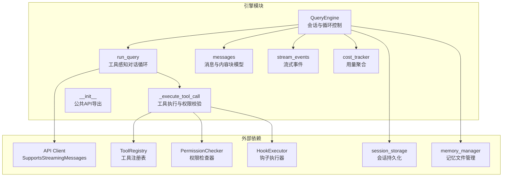
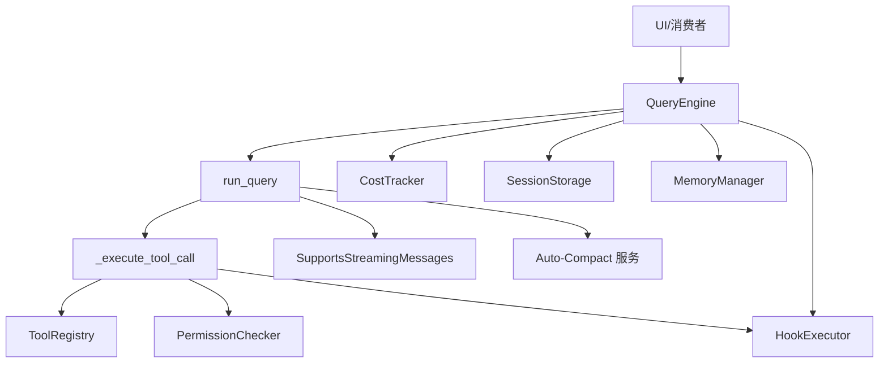
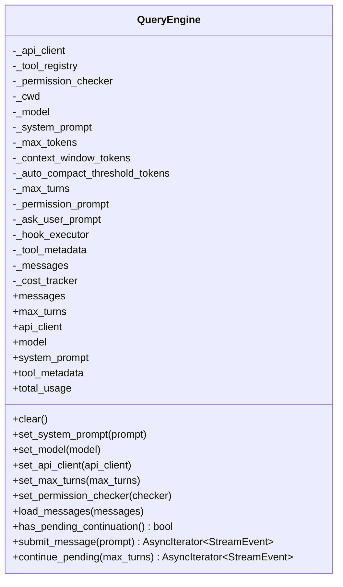
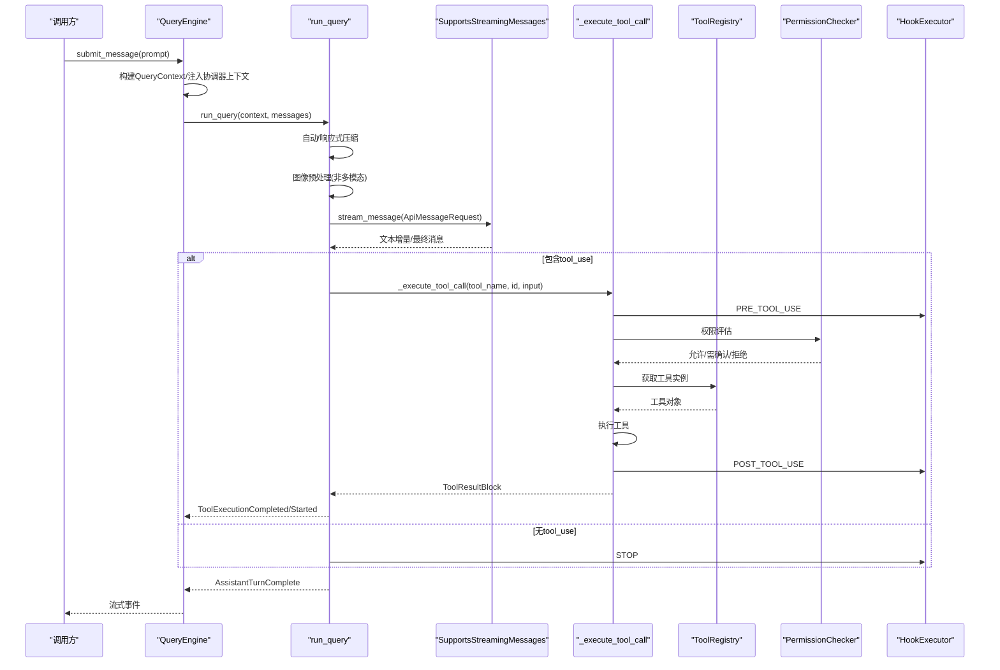
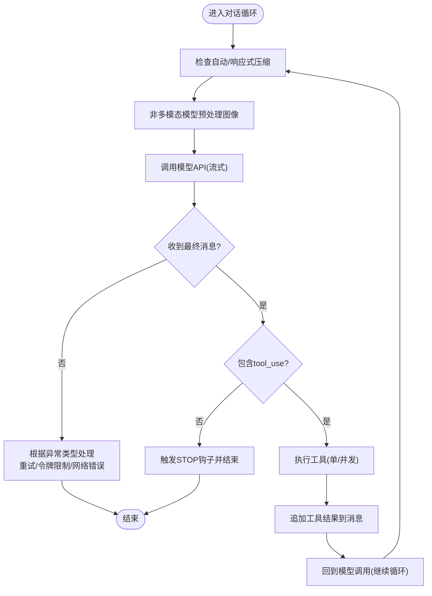
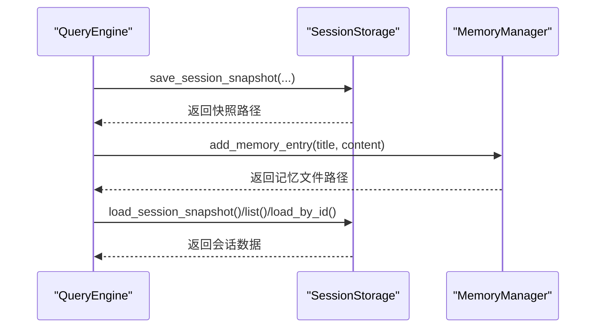
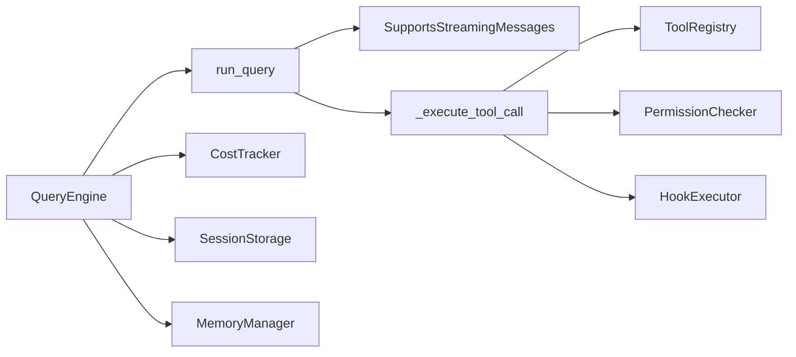

# Agent Harness架构原理

<cite>
**本文档引用的文件**
- [src/openharness/engine/query_engine.py](file://src/openharness/engine/query_engine.py)
- [src/openharness/engine/query.py](file://src/openharness/engine/query.py)
- [src/openharness/engine/messages.py](file://src/openharness/engine/messages.py)
- [src/openharness/engine/stream_events.py](file://src/openharness/engine/stream_events.py)
- [src/openharness/engine/cost_tracker.py](file://src/openharness/engine/cost_tracker.py)
- [src/openharness/engine/__init__.py](file://src/openharness/engine/__init__.py)
- [src/openharness/api/client.py](file://src/openharness/api/client.py)
- [src/openharness/tools/base.py](file://src/openharness/tools/base.py)
- [src/openharness/permissions/checker.py](file://src/openharness/permissions/checker.py)
- [src/openharness/hooks/executor.py](file://src/openharness/hooks/executor.py)
- [src/openharness/services/session_storage.py](file://src/openharness/services/session_storage.py)
- [src/openharness/memory/manager.py](file://src/openharness/memory/manager.py)
- [tests/test_engine/test_query_engine.py](file://tests/test_engine/test_query_engine.py)
- [docs/engine-module-design.md](file://docs/engine-module-design.md)
</cite>

## 目录
1. [引言](#引言)
2. [项目结构](#项目结构)
3. [核心组件](#核心组件)
4. [架构总览](#架构总览)
5. [详细组件分析](#详细组件分析)
6. [依赖关系分析](#依赖关系分析)
7. [性能考量](#性能考量)
8. [故障排查指南](#故障排查指南)
9. [结论](#结论)
10. [附录](#附录)

## 引言
本文件面向希望深入理解 Agent Harness 的开发者与使用者，系统性阐述“模型提供智能，Harness 提供手脚、眼睛、记忆和安全边界”的设计理念，并聚焦于 QueryEngine 类作为智能体执行框架的核心职责。文档将从架构、数据流、处理逻辑、集成点、错误处理与性能优化等多个维度展开，辅以图示帮助不同技术背景的读者快速掌握。

## 项目结构
OpenHarness 的核心执行引擎位于 openharness.engine 模块，围绕 QueryEngine 构建工具感知的对话循环，串联 API 客户端、工具注册表、权限检查器、钩子执行器与成本追踪器，并通过会话存储与内存管理实现持久化与知识沉淀。

**图表来源**
- [src/openharness/engine/query_engine.py:19-215](file://src/openharness/engine/query_engine.py#L19-L215)
- [src/openharness/engine/query.py:632-872](file://src/openharness/engine/query.py#L632-L872)
- [src/openharness/engine/messages.py:14-222](file://src/openharness/engine/messages.py#L14-L222)
- [src/openharness/engine/stream_events.py:12-90](file://src/openharness/engine/stream_events.py#L12-L90)
- [src/openharness/engine/cost_tracker.py:8-25](file://src/openharness/engine/cost_tracker.py#L8-L25)
- [src/openharness/engine/__init__.py:23-81](file://src/openharness/engine/__init__.py#L23-L81)

**章节来源**
- [docs/engine-module-design.md:1-251](file://docs/engine-module-design.md#L1-L251)

## 核心组件
- QueryEngine：持有对话历史与工具感知循环，负责消息提交、会话续传、状态管理与成本统计。
- run_query：核心对话循环，包含自动压缩、图像预处理、模型调用、工具执行与事件流式输出。
- 消息模型：统一的 ConversationMessage、TextBlock、ImageBlock、ToolUseBlock、ToolResultBlock。
- 流事件：AssistantTextDelta、AssistantTurnComplete、ToolExecutionStarted/Completed、ErrorEvent、StatusEvent、CompactProgressEvent。
- 成本追踪：CostTracker 聚合输入/输出 token 使用量。
- API 客户端：SupportsStreamingMessages 抽象，封装流式文本增量与最终消息。
- 工具注册表：ToolRegistry 提供工具发现与 API Schema。
- 权限检查：PermissionChecker 基于模式与规则进行读写/路径/命令级控制。
- 钩子执行：HookExecutor 支持命令、HTTP、提示词与代理型钩子，贯穿生命周期。
- 会话存储：保存/加载会话快照，导出 Markdown 转录。
- 记忆管理：项目级记忆文件索引与条目维护。

**章节来源**
- [src/openharness/engine/query_engine.py:19-215](file://src/openharness/engine/query_engine.py#L19-L215)
- [src/openharness/engine/query.py:632-872](file://src/openharness/engine/query.py#L632-L872)
- [src/openharness/engine/messages.py:14-222](file://src/openharness/engine/messages.py#L14-L222)
- [src/openharness/engine/stream_events.py:12-90](file://src/openharness/engine/stream_events.py#L12-L90)
- [src/openharness/engine/cost_tracker.py:8-25](file://src/openharness/engine/cost_tracker.py#L8-L25)
- [src/openharness/api/client.py:79-267](file://src/openharness/api/client.py#L79-L267)
- [src/openharness/tools/base.py:60-81](file://src/openharness/tools/base.py#L60-L81)
- [src/openharness/permissions/checker.py:57-201](file://src/openharness/permissions/checker.py#L57-L201)
- [src/openharness/hooks/executor.py:41-243](file://src/openharness/hooks/executor.py#L41-L243)
- [src/openharness/services/session_storage.py:63-231](file://src/openharness/services/session_storage.py#L63-L231)
- [src/openharness/memory/manager.py:17-59](file://src/openharness/memory/manager.py#L17-L59)

## 架构总览
QueryEngine 作为“手脚、眼睛、记忆和安全边界”的承载者，将模型能力与工具生态、权限策略、钩子扩展、会话持久化有机结合，形成可扩展、可观测、可治理的智能体执行框架。

**图表来源**
- [src/openharness/engine/query_engine.py:19-215](file://src/openharness/engine/query_engine.py#L19-L215)
- [src/openharness/engine/query.py:632-872](file://src/openharness/engine/query.py#L632-L872)
- [src/openharness/hooks/executor.py:41-243](file://src/openharness/hooks/executor.py#L41-L243)
- [src/openharness/services/session_storage.py:63-231](file://src/openharness/services/session_storage.py#L63-L231)
- [src/openharness/memory/manager.py:17-59](file://src/openharness/memory/manager.py#L17-L59)

## 详细组件分析

### QueryEngine 设计思想与生命周期
- 会话持有者：维护内存中的对话历史、工具元数据、成本统计；支持运行时更新系统提示词、模型、API 客户端、最大轮次与权限检查器。
- 工具感知循环：submit_message 将用户输入加入历史，构建 QueryContext，调用 run_query；continue_pending 在不新增用户消息的情况下恢复中断的工具循环；has_pending_continuation 判断是否需要继续。
- 协调器上下文：当系统提示词以“协调器”开头时，注入合成的“协调员用户上下文”，使子智能体可见可用工具集。
- 生命周期事件：在用户提交、停止、工具使用前后触发钩子，便于审计与扩展。

**图表来源**
- [src/openharness/engine/query_engine.py:19-215](file://src/openharness/engine/query_engine.py#L19-L215)

**章节来源**
- [src/openharness/engine/query_engine.py:19-215](file://src/openharness/engine/query_engine.py#L19-L215)

### 工具感知对话循环实现原理
- 自动压缩：每轮开始前检查是否需要自动压缩或响应式压缩，必要时先微压缩再进行 LLM 摘要压缩，保证上下文长度与性能平衡。
- 图像预处理：非多模态模型遇到 ImageBlock 时，通过 image_to_text 工具转换为文本描述，保持对话一致性。
- 模型调用：通过 SupportsStreamingMessages 流式接收文本增量与最终消息，处理重试、令牌上限与上下文过长等异常。
- 工具执行：单工具串行、多工具并发执行，确保即使部分失败也不阻塞其他工具；执行前后触发钩子，权限检查贯穿始终。
- 事件流：向调用方产出流式事件，包括文本增量、工具执行开始/结束、状态与错误信息以及压缩进度事件。

**图表来源**
- [src/openharness/engine/query_engine.py:147-215](file://src/openharness/engine/query_engine.py#L147-L215)
- [src/openharness/engine/query.py:632-872](file://src/openharness/engine/query.py#L632-L872)
- [src/openharness/api/client.py:160-258](file://src/openharness/api/client.py#L160-L258)
- [src/openharness/tools/base.py:60-81](file://src/openharness/tools/base.py#L60-L81)
- [src/openharness/permissions/checker.py:75-157](file://src/openharness/permissions/checker.py#L75-L157)
- [src/openharness/hooks/executor.py:64-79](file://src/openharness/hooks/executor.py#L64-L79)

**章节来源**
- [src/openharness/engine/query.py:632-872](file://src/openharness/engine/query.py#L632-L872)
- [src/openharness/engine/query_engine.py:147-215](file://src/openharness/engine/query_engine.py#L147-L215)

### 消息传递、状态管理与错误处理
- 消息模型：统一的 ConversationMessage 与内容块类型，支持文本、图像、工具调用与工具结果；提供序列化/反序列化与有效性判断。
- 状态管理：tool_metadata 作为可变延续状态，记录最近读取文件、已调用技能、异步代理活动与任务、工作日志、验证过的成果、任务焦点等；QueryEngine 提供 clear/load_messages/set_* 等运行时配置接口。
- 错误处理：针对“提示过长”“完成令牌限制”“网络/超时/连接错误”等进行分类处理，自动尝试压缩或调整 max_tokens，必要时抛出可恢复/不可恢复错误事件。

**图表来源**
- [src/openharness/engine/query.py:632-872](file://src/openharness/engine/query.py#L632-L872)
- [src/openharness/engine/messages.py:118-171](file://src/openharness/engine/messages.py#L118-L171)

**章节来源**
- [src/openharness/engine/messages.py:14-222](file://src/openharness/engine/messages.py#L14-L222)
- [src/openharness/engine/query.py:632-872](file://src/openharness/engine/query.py#L632-L872)

### 会话管理与生命周期管理
- 会话快照：save_session_snapshot 将消息、用量、工具元数据与摘要持久化，支持按 ID 与最新快照两种方式保存；load_session_snapshot/list/load_by_id 支持恢复与浏览。
- 记忆文件：add_memory_entry/remove_memory_entry 维护项目级记忆索引与条目，配合 exclusive_file_lock 保证并发安全。
- 生命周期钩子：USER_PROMPT_SUBMIT、STOP、PRE_TOOL_USE、POST_TOOL_USE 等事件贯穿提交、停止与工具使用全过程，便于审计与扩展。

**图表来源**
- [src/openharness/services/session_storage.py:63-231](file://src/openharness/services/session_storage.py#L63-L231)
- [src/openharness/memory/manager.py:23-59](file://src/openharness/memory/manager.py#L23-L59)

**章节来源**
- [src/openharness/services/session_storage.py:63-231](file://src/openharness/services/session_storage.py#L63-L231)
- [src/openharness/memory/manager.py:17-59](file://src/openharness/memory/manager.py#L17-L59)

### 具体使用示例（代码片段路径）
以下示例展示了如何使用 QueryEngine 进行会话管理的关键操作。请参考对应测试文件中的实现方式：

- 提交消息并获取流式事件
  - 示例路径：[tests/test_engine/test_query_engine.py:217-246](file://tests/test_engine/test_query_engine.py#L217-L246)
- 设置并应用最大轮次限制
  - 示例路径：[tests/test_engine/test_query_engine.py:269-289](file://tests/test_engine/test_query_engine.py#L269-L289)
- 执行工具调用并观察工具事件
  - 示例路径：[tests/test_engine/test_query_engine.py:291-339](file://tests/test_engine/test_query_engine.py#L291-L339)
- 协调器模式下的上下文注入与代理循环
  - 示例路径：[tests/test_engine/test_query_engine.py:341-372](file://tests/test_engine/test_query_engine.py#L341-L372)
- 无界轮次与继续会话
  - 示例路径：[tests/test_engine/test_query_engine.py:374-418](file://tests/test_engine/test_query_engine.py#L374-L418)
- 重试状态事件与压缩进度事件
  - 示例路径：[tests/test_engine/test_query_engine.py:421-435](file://tests/test_engine/test_query_engine.py#L421-L435)
  - 示例路径：[tests/test_engine/test_query_engine.py:437-482](file://tests/test_engine/test_query_engine.py#L437-L482)
- 响应式压缩与“提示过长”
  - 示例路径：[tests/test_engine/test_query_engine.py:484-519](file://tests/test_engine/test_query_engine.py#L484-L519)
- 工具元数据跟踪（最近读取文件、技能、异步代理）
  - 示例路径：[tests/test_engine/test_query_engine.py:521-584](file://tests/test_engine/test_query_engine.py#L521-L584)
  - 示例路径：[tests/test_engine/test_query_engine.py:586-637](file://tests/test_engine/test_query_engine.py#L586-L637)
- 预工具钩子阻止与用户提示提交钩子
  - 示例路径：[tests/test_engine/test_query_engine.py:639-695](file://tests/test_engine/test_query_engine.py#L639-L695)
  - 示例路径：[tests/test_engine/test_query_engine.py:710-730](file://tests/test_engine/test_query_engine.py#L710-L730)
  - 示例路径：[tests/test_engine/test_query_engine.py:732-752](file://tests/test_engine/test_query_engine.py#L732-L752)

**章节来源**
- [tests/test_engine/test_query_engine.py:217-752](file://tests/test_engine/test_query_engine.py#L217-L752)

## 依赖关系分析
- 组件耦合：QueryEngine 与 run_query 通过 QueryContext 解耦；工具执行通过 ToolRegistry 与 PermissionChecker 实现策略解耦；HookExecutor 作为横切关注点贯穿生命周期。
- 外部依赖：API Client 抽象屏蔽具体供应商差异；会话存储与记忆管理提供持久化能力。
- 循环依赖：各模块通过协议与数据类传递，未见直接循环导入。

**图表来源**
- [src/openharness/engine/query_engine.py:19-215](file://src/openharness/engine/query_engine.py#L19-L215)
- [src/openharness/engine/query.py:632-872](file://src/openharness/engine/query.py#L632-L872)
- [src/openharness/api/client.py:79-267](file://src/openharness/api/client.py#L79-L267)
- [src/openharness/tools/base.py:60-81](file://src/openharness/tools/base.py#L60-L81)
- [src/openharness/permissions/checker.py:57-201](file://src/openharness/permissions/checker.py#L57-L201)
- [src/openharness/hooks/executor.py:41-243](file://src/openharness/hooks/executor.py#L41-L243)
- [src/openharness/services/session_storage.py:63-231](file://src/openharness/services/session_storage.py#L63-L231)
- [src/openharness/memory/manager.py:17-59](file://src/openharness/memory/manager.py#L17-L59)

**章节来源**
- [src/openharness/engine/query_engine.py:19-215](file://src/openharness/engine/query_engine.py#L19-L215)
- [src/openharness/engine/query.py:632-872](file://src/openharness/engine/query.py#L632-L872)

## 性能考量
- 令牌上限与安全钳制：run_query 在请求前对 max_tokens 进行保守钳制，避免供应商拒绝；当供应商返回“完成令牌限制”时动态调整并重试。
- 自动压缩：基于上下文长度阈值触发微压缩与 LLM 摘要压缩，减少无效内容，提升吞吐与稳定性。
- 图像预处理：非多模态模型在会话内批量异步转换图像为文本，避免重复计算与阻塞主循环。
- 并发工具执行：多工具场景采用并发 gather，失败不影响其他工具，保障会话健康。
- 成本追踪：CostTracker 聚合输入/输出 token，便于成本控制与优化。

**章节来源**
- [src/openharness/engine/query.py:90-127](file://src/openharness/engine/query.py#L90-L127)
- [src/openharness/engine/query.py:632-872](file://src/openharness/engine/query.py#L632-L872)
- [src/openharness/engine/cost_tracker.py:8-25](file://src/openharness/engine/cost_tracker.py#L8-L25)

## 故障排查指南
- “提示过长”错误：检测多种供应商错误字符串，自动触发响应式压缩并重试；若仍失败，返回 ErrorEvent 并终止当前轮次。
- 令牌上限错误：解析供应商返回的最大完成令牌限制，动态下调并重试。
- 网络/超时/连接错误：发出 StatusEvent 提示用户检查网络；必要时抛出 ErrorEvent。
- 空助手消息：忽略无有效内容的助手消息，避免污染会话。
- 权限拒绝：根据 PermissionChecker 结果决定直接拒绝、要求用户确认或进入计划模式限制。
- 钩子失败：命令/HTTP/提示词钩子失败可选择阻断或继续，由钩子定义决定。

**章节来源**
- [src/openharness/engine/query.py:66-87](file://src/openharness/engine/query.py#L66-L87)
- [src/openharness/engine/query.py:751-780](file://src/openharness/engine/query.py#L751-L780)
- [src/openharness/engine/query.py:785-800](file://src/openharness/engine/query.py#L785-L800)
- [src/openharness/permissions/checker.py:75-157](file://src/openharness/permissions/checker.py#L75-L157)
- [src/openharness/hooks/executor.py:80-137](file://src/openharness/hooks/executor.py#L80-L137)

## 结论
Agent Harness 通过 QueryEngine 将“模型智能”与“Harness 的手脚、眼睛、记忆与安全边界”有机融合，形成稳定、可观测、可扩展的智能体执行框架。其工具感知对话循环、自动压缩、权限控制、钩子扩展与会话持久化共同构成了面向生产的工程化能力，既满足日常开发需求，也为复杂协作场景提供了坚实基础。

## 附录
- 公共 API 导出：通过懒加载重导出常用类型，避免循环导入问题。
- 设计文档：更全面的模块设计说明与数据流图，可作为进一步学习的参考。

**章节来源**
- [src/openharness/engine/__init__.py:23-81](file://src/openharness/engine/__init__.py#L23-L81)
- [docs/engine-module-design.md:1-251](file://docs/engine-module-design.md#L1-L251)