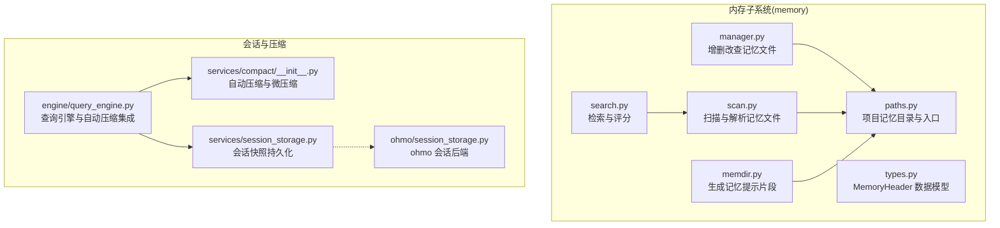
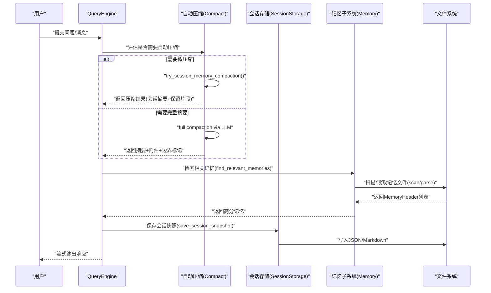
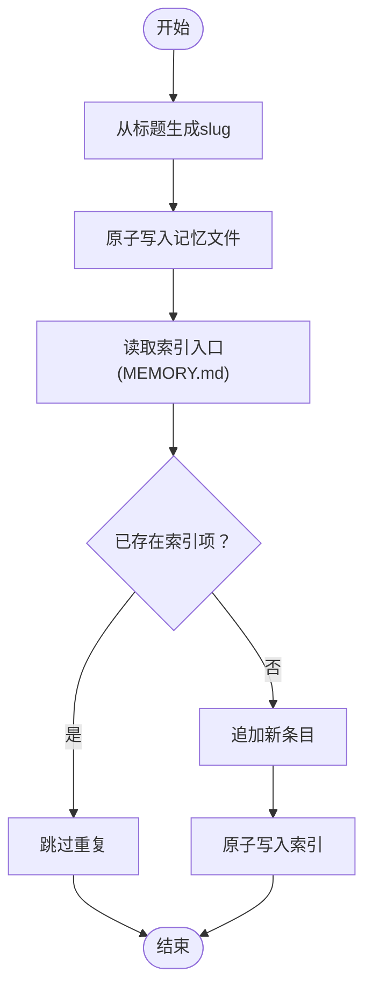
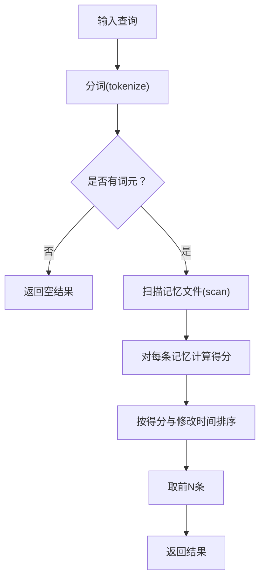
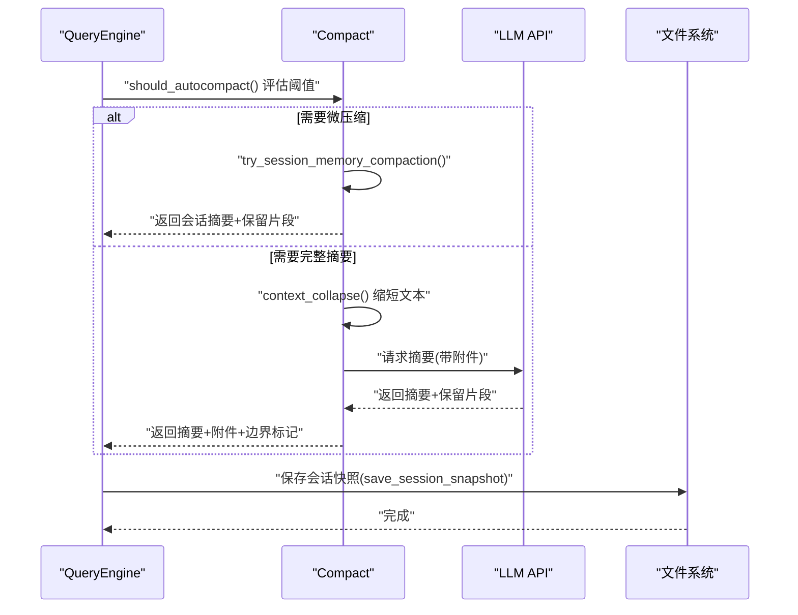
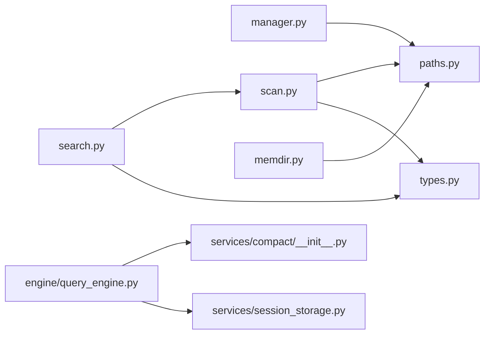

# 内存管理

<cite>
**本文引用的文件**
- [src/openharness/memory/__init__.py](file://src/openharness/memory/__init__.py)
- [src/openharness/memory/manager.py](file://src/openharness/memory/manager.py)
- [src/openharness/memory/memdir.py](file://src/openharness/memory/memdir.py)
- [src/openharness/memory/paths.py](file://src/openharness/memory/paths.py)
- [src/openharness/memory/scan.py](file://src/openharness/memory/scan.py)
- [src/openharness/memory/search.py](file://src/openharness/memory/search.py)
- [src/openharness/memory/types.py](file://src/openharness/memory/types.py)
- [src/openharness/services/compact/__init__.py](file://src/openharness/services/compact/__init__.py)
- [src/openharness/services/session_storage.py](file://src/openharness/services/session_storage.py)
- [ohmo/session_storage.py](file://ohmo/session_storage.py)
- [src/openharness/engine/query_engine.py](file://src/openharness/engine/query_engine.py)
- [tests/test_memory/test_memdir.py](file://tests/test_memory/test_memdir.py)
- [tests/test_services/test_compact.py](file://tests/test_services/test_compact.py)
</cite>

## 目录
1. [简介](#简介)
2. [项目结构](#项目结构)
3. [核心组件](#核心组件)
4. [架构总览](#架构总览)
5. [详细组件分析](#详细组件分析)
6. [依赖分析](#依赖分析)
7. [性能考虑](#性能考虑)
8. [故障排查指南](#故障排查指南)
9. [结论](#结论)
10. [附录：常用操作与示例路径](#附录常用操作与示例路径)

## 简介
本文件系统性梳理 OpenHarness 的“内存管理”能力，覆盖以下主题：
- MemoryManager 的设计与会话历史管理机制（消息存储、检索与压缩策略）
- memdir（内存目录）的组织结构与数据持久化（文件系统布局与缓存策略）
- 内存搜索系统（search）的实现原理（全文检索、语义启发式与索引维护）
- 自动压缩服务（Auto-Compact）工作机制（微压缩与完整摘要的触发条件与执行流程）
- 性能优化、容量规划与故障恢复策略
- 具体操作示例（消息添加、历史查询与内存清理）

## 项目结构
内存管理相关代码主要位于以下模块：
- memory 子系统：负责项目级“记忆”文件的增删改查、扫描解析、检索与提示生成
- services/compact：负责对话历史的自动压缩（微压缩与全量摘要），并提供进度事件与检查点
- services/session_storage：负责会话快照的持久化与导出（Markdown）
- engine/query_engine：在查询循环中集成自动压缩与上下文折叠
- 测试用例：验证路径稳定性、检索行为、前端言解析与自动压缩流程

图表来源
- [src/openharness/memory/manager.py:17-36](file://src/openharness/memory/manager.py#L17-L36)
- [src/openharness/memory/scan.py:11-25](file://src/openharness/memory/scan.py#L11-L25)
- [src/openharness/memory/search.py:12-40](file://src/openharness/memory/search.py#L12-L40)
- [src/openharness/memory/paths.py:11-22](file://src/openharness/memory/paths.py#L11-L22)
- [src/openharness/memory/memdir.py:10-34](file://src/openharness/memory/memdir.py#L10-L34)
- [src/openharness/services/compact/__init__.py:893-923](file://src/openharness/services/compact/__init__.py#L893-L923)
- [src/openharness/engine/query_engine.py:147-191](file://src/openharness/engine/query_engine.py#L147-L191)
- [src/openharness/services/session_storage.py:63-107](file://src/openharness/services/session_storage.py#L63-L107)
- [ohmo/session_storage.py:41-85](file://ohmo/session_storage.py#L41-L85)

章节来源
- [src/openharness/memory/__init__.py:1-19](file://src/openharness/memory/__init__.py#L1-L19)
- [src/openharness/memory/paths.py:11-22](file://src/openharness/memory/paths.py#L11-L22)
- [src/openharness/memory/manager.py:17-36](file://src/openharness/memory/manager.py#L17-L36)
- [src/openharness/memory/scan.py:11-25](file://src/openharness/memory/scan.py#L11-L25)
- [src/openharness/memory/search.py:12-40](file://src/openharness/memory/search.py#L12-L40)
- [src/openharness/memory/memdir.py:10-34](file://src/openharness/memory/memdir.py#L10-L34)
- [src/openharness/services/compact/__init__.py:893-923](file://src/openharness/services/compact/__init__.py#L893-L923)
- [src/openharness/engine/query_engine.py:147-191](file://src/openharness/engine/query_engine.py#L147-L191)
- [src/openharness/services/session_storage.py:63-107](file://src/openharness/services/session_storage.py#L63-L107)
- [ohmo/session_storage.py:41-85](file://ohmo/session_storage.py#L41-L85)

## 核心组件
- MemoryManager（记忆管理器）
  - 提供记忆条目的增删改查、索引入口（MEMORY.md）维护与原子写入
  - 使用独占锁确保并发安全
- memdir（内存目录）
  - 生成记忆提示文本，包含目录位置与索引内容预览
- 搜索系统（search）
  - 基于词元提取与权重评分的启发式检索，优先匹配 frontmatter 字段
- 扫描与解析（scan）
  - 解析记忆文件，支持 YAML frontmatter；提取标题、描述、类型与正文预览
- 类型定义（types）
  - MemoryHeader：统一的记忆文件元信息载体
- 路径工具（paths）
  - 基于项目路径与哈希生成稳定记忆目录，确保跨工作区隔离
- 自动压缩（services/compact）
  - 微压缩：清理旧工具结果以降低 token 成本
  - 完整摘要：调用 LLM 生成结构化摘要与保留片段
  - 自动触发：基于阈值与上下文窗口估算
- 会话存储（services/session_storage）
  - 保存/加载会话快照，导出 Markdown 转录

章节来源
- [src/openharness/memory/manager.py:17-36](file://src/openharness/memory/manager.py#L17-L36)
- [src/openharness/memory/memdir.py:10-34](file://src/openharness/memory/memdir.py#L10-L34)
- [src/openharness/memory/search.py:12-40](file://src/openharness/memory/search.py#L12-L40)
- [src/openharness/memory/scan.py:28-83](file://src/openharness/memory/scan.py#L28-L83)
- [src/openharness/memory/types.py:9-18](file://src/openharness/memory/types.py#L9-L18)
- [src/openharness/memory/paths.py:11-22](file://src/openharness/memory/paths.py#L11-L22)
- [src/openharness/services/compact/__init__.py:893-923](file://src/openharness/services/compact/__init__.py#L893-L923)
- [src/openharness/services/session_storage.py:63-107](file://src/openharness/services/session_storage.py#L63-L107)

## 架构总览
下图展示了从用户输入到自动压缩与记忆检索的整体流程。

图表来源
- [src/openharness/engine/query_engine.py:147-191](file://src/openharness/engine/query_engine.py#L147-L191)
- [src/openharness/services/compact/__init__.py:893-923](file://src/openharness/services/compact/__init__.py#L893-L923)
- [src/openharness/memory/search.py:12-40](file://src/openharness/memory/search.py#L12-L40)
- [src/openharness/services/session_storage.py:63-107](file://src/openharness/services/session_storage.py#L63-L107)

## 详细组件分析

### 组件一：MemoryManager（记忆管理器）
职责
- 创建/删除记忆文件，并同步更新索引入口（MEMORY.md）
- 使用独占锁保证并发安全，采用原子写入避免部分写入
- 自动生成文件名（slug 化标题），避免冲突

关键流程
- 添加记忆：计算 slug → 写入 .md → 更新 MEMORY.md（去重）
- 删除记忆：查找匹配文件 → 删除文件 → 从 MEMORY.md 移除对应行

图表来源
- [src/openharness/memory/manager.py:23-36](file://src/openharness/memory/manager.py#L23-L36)

章节来源
- [src/openharness/memory/manager.py:17-36](file://src/openharness/memory/manager.py#L17-L36)

### 组件二：memdir（内存目录提示）
职责
- 生成一段可注入到系统提示中的文本，包含：
  - 记忆目录绝对路径
  - 是否存在索引（MEMORY.md）
  - 索引内容的片段（限制行数）

注意
- 当索引不存在时，提示中会说明未创建

章节来源
- [src/openharness/memory/memdir.py:10-34](file://src/openharness/memory/memdir.py#L10-L34)

### 组件三：扫描与解析（scan/parse）
职责
- 扫描项目记忆目录，过滤掉索引文件（MEMORY.md）
- 解析记忆文件，支持 YAML frontmatter
- 提取标题、描述、类型与正文预览，按修改时间排序

frontmatter 解析要点
- 支持 name/description/type 等键
- 若无 frontmatter，使用首行非空、非标题行作为描述
- 正文预览排除已用作描述的行，避免重复

章节来源
- [src/openharness/memory/scan.py:11-25](file://src/openharness/memory/scan.py#L11-L25)
- [src/openharness/memory/scan.py:28-83](file://src/openharness/memory/scan.py#L28-L83)
- [src/openharness/memory/types.py:9-18](file://src/openharness/memory/types.py#L9-L18)

### 组件四：搜索系统（search）
职责
- 将查询拆分为词元（ASCII≥3字符、中日韩汉字独立成词）
- 对每个记忆文件计算得分：
  - frontmatter 标题/描述命中权重更高（×2）
  - 正文命中权重为 1
- 返回按得分与修改时间排序的前 N 条

图表来源
- [src/openharness/memory/search.py:12-40](file://src/openharness/memory/search.py#L12-L40)
- [src/openharness/memory/scan.py:11-25](file://src/openharness/memory/scan.py#L11-L25)

章节来源
- [src/openharness/memory/search.py:12-40](file://src/openharness/memory/search.py#L12-L40)

### 组件五：自动压缩服务（Auto-Compact）
目标
- 在对话历史过长导致 token 超限时，通过低成本或 LLM 摘要的方式降低上下文成本
- 保持任务焦点、近期工作、附件等关键信息的连续性

微压缩（try_session_memory_compaction）
- 作用：将较早的历史压缩为“会话记忆摘要”，保留最近若干轮对话
- 触发：当消息数量超过阈值且不破坏工具调用-结果配对时
- 输出：摘要消息 + 保留片段 + 边界标记 + 附件

完整摘要（full compaction）
- 作用：调用 LLM 生成结构化摘要与保留片段
- 附加：提取近期文件、任务焦点、已验证工作、计划模式、异步代理状态、工作日志等上下文附件
- 进度与检查点：通过回调事件与检查点记录，便于可观测与重试

自动触发（auto_compact_if_needed）
- 在每次查询前评估当前上下文是否需要压缩
- 支持上下文折叠（缩短超长文本块）与微压缩/完整摘要的组合策略

图表来源
- [src/openharness/services/compact/__init__.py:893-923](file://src/openharness/services/compact/__init__.py#L893-L923)
- [src/openharness/services/compact/__init__.py:1458-1594](file://src/openharness/services/compact/__init__.py#L1458-L1594)
- [src/openharness/services/session_storage.py:63-107](file://src/openharness/services/session_storage.py#L63-L107)

章节来源
- [src/openharness/services/compact/__init__.py:893-923](file://src/openharness/services/compact/__init__.py#L893-L923)
- [src/openharness/services/compact/__init__.py:1458-1594](file://src/openharness/services/compact/__init__.py#L1458-L1594)
- [tests/test_services/test_compact.py:137-148](file://tests/test_services/test_compact.py#L137-L148)
- [tests/test_services/test_compact.py:555-620](file://tests/test_services/test_compact.py#L555-L620)

### 组件六：会话存储（Session Storage）
职责
- 保存会话快照（JSON），同时保留“latest.json”
- 列举会话、按 ID 加载、导出 Markdown 转录
- 仅持久化受控的工具元数据字段，避免污染

章节来源
- [src/openharness/services/session_storage.py:63-107](file://src/openharness/services/session_storage.py#L63-L107)
- [src/openharness/services/session_storage.py:131-191](file://src/openharness/services/session_storage.py#L131-L191)
- [src/openharness/services/session_storage.py:210-230](file://src/openharness/services/session_storage.py#L210-L230)
- [ohmo/session_storage.py:41-85](file://ohmo/session_storage.py#L41-L85)

### 组件七：路径与目录组织（paths）
职责
- 基于项目路径与哈希生成稳定的记忆目录，避免同名冲突
- 提供 MEMORY.md 入口文件路径

章节来源
- [src/openharness/memory/paths.py:11-22](file://src/openharness/memory/paths.py#L11-L22)

## 依赖分析
- 内存子系统内部耦合度低，职责清晰：
  - manager 依赖 paths 与文件锁/原子写
  - scan 依赖 paths 与 types
  - search 依赖 scan 与 types
  - memdir 依赖 paths
- 自动压缩与查询引擎强耦合，通过回调与检查点进行可观测性
- 会话存储与自动压缩相互独立，但都面向“上下文成本控制”

图表来源
- [src/openharness/memory/manager.py:8-10](file://src/openharness/memory/manager.py#L8-L10)
- [src/openharness/memory/scan.py:7-8](file://src/openharness/memory/scan.py#L7-L8)
- [src/openharness/memory/search.py:8-9](file://src/openharness/memory/search.py#L8-L9)
- [src/openharness/memory/memdir.py:7-7](file://src/openharness/memory/memdir.py#L7-L7)
- [src/openharness/engine/query_engine.py:147-191](file://src/openharness/engine/query_engine.py#L147-L191)
- [src/openharness/services/compact/__init__.py:893-923](file://src/openharness/services/compact/__init__.py#L893-L923)
- [src/openharness/services/session_storage.py:63-107](file://src/openharness/services/session_storage.py#L63-L107)

## 性能考虑
- 检索性能
  - 限制扫描文件数量（默认 100），避免大规模目录下的线性扫描开销
  - 评分仅基于词元命中计数，复杂度 O(N×M)，其中 N 为扫描文件数，M 为查询词元数
- 写入与并发
  - 使用独占锁与原子写入，避免竞态与部分写入
- 上下文成本控制
  - 微压缩优先：低成本清理旧工具结果，减少 token 数
  - 上下文折叠：对超长文本块进行定长折叠，再进行微压缩/完整摘要
- 会话存储
  - 仅持久化必要字段，减少 JSON 序列化与 IO 开销
  - 导出 Markdown 用于审计与回放，不参与运行时上下文

## 故障排查指南
- 记忆文件无法写入或索引未更新
  - 检查是否存在 .memory.lock 文件（并发写入被阻塞）
  - 确认 MEMORY.md 是否被意外删除或损坏
- 检索结果为空
  - 确认查询词元长度（ASCII≥3，CJK 单字）
  - 检查记忆文件是否包含 frontmatter 或正文
- 自动压缩未触发
  - 检查阈值配置与上下文窗口估算
  - 查看进度回调与检查点记录，确认是否因超时而回退
- 会话快照缺失
  - 确认最新会话是否成功写入 latest.json
  - 检查会话 ID 是否正确，或尝试加载 “latest”

章节来源
- [src/openharness/memory/manager.py:28-35](file://src/openharness/memory/manager.py#L28-L35)
- [src/openharness/memory/search.py:43-49](file://src/openharness/memory/search.py#L43-L49)
- [src/openharness/services/compact/__init__.py:1458-1594](file://src/openharness/services/compact/__init__.py#L1458-L1594)
- [src/openharness/services/session_storage.py:123-128](file://src/openharness/services/session_storage.py#L123-L128)

## 结论
本内存管理子系统以“轻量、稳定、可压缩”为核心设计目标：
- 通过 frontmatter 与正文双通道检索，提升相关性
- 通过微压缩与上下文折叠，有效控制上下文成本
- 通过原子写入与独占锁，保障并发安全
- 通过会话存储与导出，兼顾运行时效率与审计需求

## 附录：常用操作与示例路径
- 添加记忆条目
  - 示例路径：[src/openharness/memory/manager.py:23-36](file://src/openharness/memory/manager.py#L23-L36)
- 删除记忆条目
  - 示例路径：[src/openharness/memory/manager.py:39-58](file://src/openharness/memory/manager.py#L39-L58)
- 列出记忆文件
  - 示例路径：[src/openharness/memory/manager.py:17-20](file://src/openharness/memory/manager.py#L17-L20)
- 检索相关记忆
  - 示例路径：[src/openharness/memory/search.py:12-40](file://src/openharness/memory/search.py#L12-L40)
- 生成记忆提示
  - 示例路径：[src/openharness/memory/memdir.py:10-34](file://src/openharness/memory/memdir.py#L10-L34)
- 扫描记忆文件
  - 示例路径：[src/openharness/memory/scan.py:11-25](file://src/openharness/memory/scan.py#L11-L25)
- 自动压缩（微压缩）
  - 示例路径：[src/openharness/services/compact/__init__.py:893-923](file://src/openharness/services/compact/__init__.py#L893-L923)
- 自动压缩（完整摘要）
  - 示例路径：[src/openharness/services/compact/__init__.py:1458-1594](file://src/openharness/services/compact/__init__.py#L1458-L1594)
- 保存会话快照
  - 示例路径：[src/openharness/services/session_storage.py:63-107](file://src/openharness/services/session_storage.py#L63-L107)
- 导出会话 Markdown
  - 示例路径：[src/openharness/services/session_storage.py:210-230](file://src/openharness/services/session_storage.py#L210-L230)
- ohmo 会话后端
  - 示例路径：[ohmo/session_storage.py:41-85](file://ohmo/session_storage.py#L41-L85)

章节来源
- [src/openharness/memory/manager.py:17-58](file://src/openharness/memory/manager.py#L17-L58)
- [src/openharness/memory/search.py:12-40](file://src/openharness/memory/search.py#L12-L40)
- [src/openharness/memory/memdir.py:10-34](file://src/openharness/memory/memdir.py#L10-L34)
- [src/openharness/memory/scan.py:11-25](file://src/openharness/memory/scan.py#L11-L25)
- [src/openharness/services/compact/__init__.py:893-923](file://src/openharness/services/compact/__init__.py#L893-L923)
- [src/openharness/services/compact/__init__.py:1458-1594](file://src/openharness/services/compact/__init__.py#L1458-L1594)
- [src/openharness/services/session_storage.py:63-107](file://src/openharness/services/session_storage.py#L63-L107)
- [src/openharness/services/session_storage.py:210-230](file://src/openharness/services/session_storage.py#L210-L230)
- [ohmo/session_storage.py:41-85](file://ohmo/session_storage.py#L41-L85)