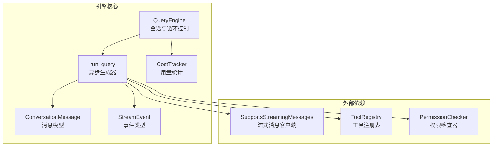
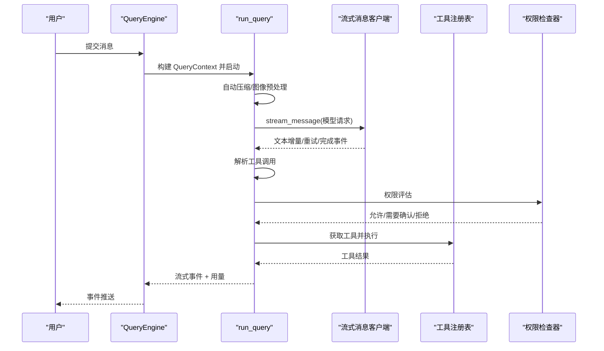
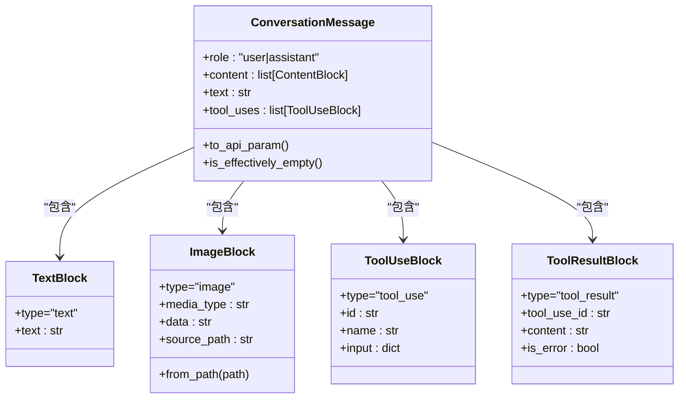
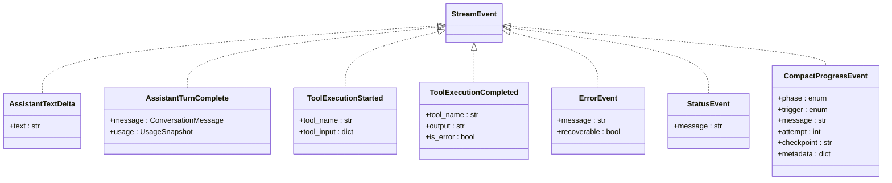
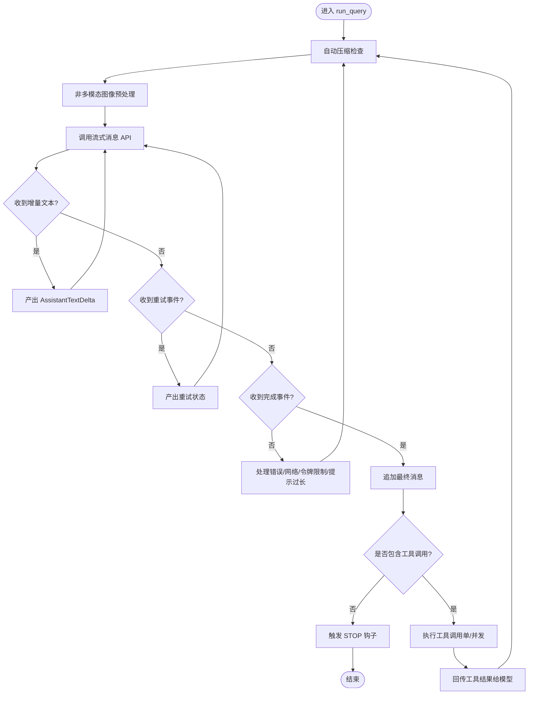
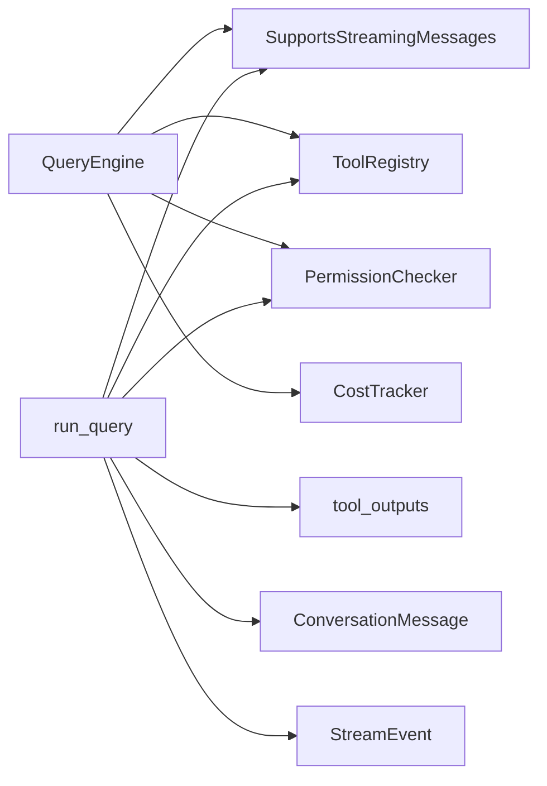

# 对话引擎设计

<cite>
**本文档引用的文件**
- [query_engine.py](file://src/openharness/engine/query_engine.py)
- [query.py](file://src/openharness/engine/query.py)
- [messages.py](file://src/openharness/engine/messages.py)
- [stream_events.py](file://src/openharness/engine/stream_events.py)
- [cost_tracker.py](file://src/openharness/engine/cost_tracker.py)
- [base.py](file://src/openharness/tools/base.py)
- [checker.py](file://src/openharness/permissions/checker.py)
- [tool_outputs.py](file://src/openharness/services/tool_outputs.py)
- [test_query_engine.py](file://tests/test_engine/test_query_engine.py)
- [test_messages.py](file://tests/test_engine/test_messages.py)
</cite>

## 目录
1. [简介](#简介)
2. [项目结构](#项目结构)
3. [核心组件](#核心组件)
4. [架构总览](#架构总览)
5. [详细组件分析](#详细组件分析)
6. [依赖关系分析](#依赖关系分析)
7. [性能考量](#性能考量)
8. [故障排查指南](#故障排查指南)
9. [结论](#结论)
10. [附录](#附录)

## 简介
本文件面向对话引擎设计，聚焦于 run_query 异步生成器的核心算法与工具感知查询循环的完整实现流程。文档详细说明：
- QueryContext 的作用与字段配置
- 消息处理、工具调用决策与流式事件产出机制
- ConversationMessage 模型设计与内容块类型（TextBlock、ImageBlock、ToolUseBlock、ToolResultBlock）及序列化
- 流式事件系统（StreamEvent）的设计与生命周期
- 具体的对话循环执行示例、错误处理、重试机制与性能优化策略

## 项目结构
对话引擎位于 src/openharness/engine 目录下，围绕以下模块协同工作：
- query_engine.py：对外暴露的 QueryEngine 类，管理会话历史与工具感知循环
- query.py：核心 run_query 异步生成器与工具执行逻辑
- messages.py：消息与内容块模型定义与序列化
- stream_events.py：流式事件类型定义
- cost_tracker.py：使用量统计
- tools/base.py：工具抽象与注册表
- permissions/checker.py：权限检查
- services/tool_outputs.py：工具输出预算与截断策略

图表来源
- [query_engine.py:19-215](file://src/openharness/engine/query_engine.py#L19-L215)
- [query.py:632-872](file://src/openharness/engine/query.py#L632-L872)
- [messages.py:64-222](file://src/openharness/engine/messages.py#L64-L222)
- [stream_events.py:12-90](file://src/openharness/engine/stream_events.py#L12-L90)
- [cost_tracker.py:8-25](file://src/openharness/engine/cost_tracker.py#L8-L25)

章节来源
- [query_engine.py:19-215](file://src/openharness/engine/query_engine.py#L19-L215)
- [query.py:632-872](file://src/openharness/engine/query.py#L632-L872)
- [messages.py:64-222](file://src/openharness/engine/messages.py#L64-L222)
- [stream_events.py:12-90](file://src/openharness/engine/stream_events.py#L12-L90)
- [cost_tracker.py:8-25](file://src/openharness/engine/cost_tracker.py#L8-L25)

## 核心组件
- QueryEngine：持有会话历史与工具感知循环，负责提交用户消息、触发 run_query 并聚合流式事件与用量统计。
- run_query：异步生成器，驱动“模型推理—工具调用—结果回传”的完整循环，内置自动压缩、图像预处理、权限检查、并发工具执行等能力。
- ConversationMessage：统一的消息载体，支持文本、图片、工具调用与工具结果四种内容块。
- StreamEvent：流式事件集合，覆盖增量文本、工具执行、状态提示、错误、压缩进度等。
- CostTracker：累计输入/输出 token 使用量。

章节来源
- [query_engine.py:19-215](file://src/openharness/engine/query_engine.py#L19-L215)
- [query.py:632-872](file://src/openharness/engine/query.py#L632-L872)
- [messages.py:64-222](file://src/openharness/engine/messages.py#L64-L222)
- [stream_events.py:12-90](file://src/openharness/engine/stream_events.py#L12-L90)
- [cost_tracker.py:8-25](file://src/openharness/engine/cost_tracker.py#L8-L25)

## 架构总览
对话引擎采用“查询上下文 + 异步生成器”的模式，QueryEngine 负责构建 QueryContext 并启动 run_query；run_query 在每轮中：
- 自动压缩（微压缩/全量摘要）
- 非多模态模型的图像预处理
- 调用流式消息 API 获取模型响应
- 解析响应中的工具调用，按单次或并发执行
- 将工具结果回传给模型，直至无工具调用或达到最大轮次

图表来源
- [query_engine.py:147-215](file://src/openharness/engine/query_engine.py#L147-L215)
- [query.py:632-872](file://src/openharness/engine/query.py#L632-L872)
- [query.py:875-1005](file://src/openharness/engine/query.py#L875-L1005)

## 详细组件分析

### QueryContext 设计与字段配置
- 作用：贯穿一次查询运行的所有上下文，包含模型、系统提示、工具注册表、权限检查器、工作目录、令牌限制、最大轮次、钩子执行器、工具元数据等。
- 关键字段：
  - api_client：流式消息客户端接口
  - tool_registry：工具注册表
  - permission_checker：权限检查器
  - cwd：工作目录
  - model/system_prompt/max_tokens/context_window_tokens/auto_compact_threshold_tokens：模型与上下文窗口参数
  - max_turns：最大轮次限制
  - permission_prompt/ask_user_prompt：权限确认与用户询问回调
  - hook_executor/tool_metadata：钩子与工具携带状态

章节来源
- [query.py:137-155](file://src/openharness/engine/query.py#L137-L155)

### ConversationMessage 与内容块模型
- 内容块类型：
  - TextBlock：纯文本
  - ImageBlock：多模态图片（base64 数据与媒体类型）
  - ToolUseBlock：模型请求执行的工具调用（含 id/name/input）
  - ToolResultBlock：工具返回结果（含 tool_use_id/content/is_error）
- 序列化机制：将本地模型转换为 API wire 格式，确保跨供应商兼容性。
- 辅助方法：from_user_text/from_user_content、text 属性拼接、tool_uses 过滤、is_effectively_empty 判空、sanitize_conversation_messages 规范化历史。

图表来源
- [messages.py:14-222](file://src/openharness/engine/messages.py#L14-L222)

章节来源
- [messages.py:14-222](file://src/openharness/engine/messages.py#L14-L222)

### 流式事件系统（StreamEvent）
- AssistantTextDelta：模型文本增量
- AssistantTurnComplete：整轮完成（含消息与用量）
- ToolExecutionStarted/ToolExecutionCompleted：工具执行开始/结束（含输出与错误标记）
- ErrorEvent：向用户展示的错误事件（可恢复）
- StatusEvent：瞬时系统状态提示
- CompactProgressEvent：压缩阶段的结构化进度（钩子开始/上下文折叠/会话内存/压缩开始/重试/结束/失败）

图表来源
- [stream_events.py:12-90](file://src/openharness/engine/stream_events.py#L12-L90)

章节来源
- [stream_events.py:12-90](file://src/openharness/engine/stream_events.py#L12-L90)

### run_query 异步生成器核心算法
- 自动压缩：
  - 启动前检查，必要时先进行微压缩（清理旧工具结果），再进行 LLM 摘要压缩
  - 压缩过程中通过 CompactProgressEvent 流式反馈进度
- 图像预处理：
  - 非多模态模型时，将 ImageBlock 转换为 TextBlock（通过 image_to_text 工具）
- 模型调用：
  - 使用 SupportsStreamingMessages.stream_message 发起请求
  - 处理 ApiTextDeltaEvent（增量文本）、ApiRetryEvent（重试提示）、ApiMessageCompleteEvent（最终消息与用量）
- 错误与重试：
  - 识别“提示过长”与“完成令牌上限”错误，分别触发自动/反应式压缩与令牌上限下调
  - 网络类错误转为 ErrorEvent
- 工具调用决策与执行：
  - 单工具：顺序执行，立即产出 ToolExecutionStarted/Completed
  - 多工具：并发执行，使用 return_exceptions=True 避免单点失败导致会话悬挂
  - 权限检查：基于 PermissionChecker.evaluate，支持显式允许/拒绝、路径规则、命令模式、计划模式等
  - 输出截断：超过阈值的工具输出落盘并以内联摘要形式回传
- 结束条件：
  - 无工具调用则触发 STOP 钩子并结束
  - 达到 max_turns 抛出 MaxTurnsExceeded

图表来源
- [query.py:632-872](file://src/openharness/engine/query.py#L632-L872)
- [query.py:875-1005](file://src/openharness/engine/query.py#L875-L1005)

章节来源
- [query.py:632-872](file://src/openharness/engine/query.py#L632-L872)
- [query.py:875-1005](file://src/openharness/engine/query.py#L875-L1005)

### 工具执行与权限检查
- 工具解析与执行：
  - 通过 ToolRegistry.get 获取工具实例，使用工具 input_model 进行参数校验
  - 执行前可触发 PRE_TOOL_USE 钩子，支持阻断与原因说明
  - 执行后记录工具携带状态（最近文件、技能、异步代理活动、工作日志等）
- 权限检查：
  - 优先级：敏感路径保护（内置）> 显式允许/拒绝 > 路径规则 > 命令模式 > 模式策略（FULL_AUTO/PLAN/默认）
  - 支持交互式确认（permission_prompt）与 bash 提示
- 输出截断：
  - 超过 inline 阈值的工具输出写入临时文件，内联仅保留预览摘要

章节来源
- [query.py:875-1005](file://src/openharness/engine/query.py#L875-L1005)
- [checker.py:57-156](file://src/openharness/permissions/checker.py#L57-L156)
- [base.py:17-81](file://src/openharness/tools/base.py#L17-L81)
- [tool_outputs.py:26-56](file://src/openharness/services/tool_outputs.py#L26-L56)

### 会话历史规范化与消息处理
- sanitize_conversation_messages：
  - 移除空的助理消息
  - 清理悬挂的工具调用（无匹配工具结果）与孤立工具结果
  - 保持完整的工具往返，避免后续请求被供应商拒绝

章节来源
- [messages.py:118-171](file://src/openharness/engine/messages.py#L118-L171)
- [test_messages.py:12-62](file://tests/test_engine/test_messages.py#L12-L62)

### 流式事件生命周期与 UI 响应
- 文本增量：逐字节推送 AssistantTextDelta，保证 UI 实时渲染
- 工具执行：在并发场景下，先产出多个 ToolExecutionStarted，再统一产出 ToolExecutionCompleted
- 状态与错误：StatusEvent 用于提示重试、压缩、令牌限制调整；ErrorEvent 用于用户可见错误
- 压缩进度：CompactProgressEvent 分阶段通知压缩钩子、上下文折叠、会话内存、压缩开始/重试/结束/失败

章节来源
- [stream_events.py:12-90](file://src/openharness/engine/stream_events.py#L12-L90)
- [query.py:727-780](file://src/openharness/engine/query.py#L727-L780)

### 具体执行示例与最佳实践
- 示例一：纯文本回复
  - 行为：产出 AssistantTextDelta，最后产出 AssistantTurnComplete，用量累加
  - 参考测试：[test_query_engine.py:217-246](file://tests/test_engine/test_query_engine.py#L217-L246)
- 示例二：令牌上限下调与重试
  - 行为：检测“完成令牌过大”，解析提供商限制并下调 max_tokens，重新发起请求
  - 参考测试：[test_query_engine.py:269-289](file://tests/test_engine/test_query_engine.py#L269-L289)
- 示例三：工具调用与并发执行
  - 行为：并发执行多个工具，统一产出 ToolExecutionCompleted
  - 参考测试：[test_query_engine.py:291-339](file://tests/test_engine/test_query_engine.py#L291-L339)
- 示例四：协调员模式与代理循环
  - 行为：系统提示包含“协调员”标识，自动注入“协调员用户上下文”消息，触发 agent 工具
  - 参考测试：[test_query_engine.py:342-372](file://tests/test_engine/test_query_engine.py#L342-L372)
- 示例五：压缩进度与反应式压缩
  - 行为：提示过长时触发反应式压缩，产出 CompactProgressEvent，随后继续对话
  - 参考测试：[test_query_engine.py:485-519](file://tests/test_engine/test_query_engine.py#L485-L519)

章节来源
- [test_query_engine.py:217-372](file://tests/test_engine/test_query_engine.py#L217-L372)
- [test_query_engine.py:485-519](file://tests/test_engine/test_query_engine.py#L485-L519)

## 依赖关系分析
- QueryEngine 依赖：
  - SupportsStreamingMessages：流式消息客户端
  - ToolRegistry：工具注册表
  - PermissionChecker：权限检查
  - HookExecutor：钩子执行器（可选）
  - CostTracker：用量统计
- run_query 依赖：
  - SupportsStreamingMessages：模型调用
  - ToolRegistry：工具解析与执行
  - PermissionChecker：权限决策
  - 工具输出预算与截断策略：tool_outputs
  - 压缩服务：openharness.services.compact（在 run_query 中动态导入）

图表来源
- [query_engine.py:19-215](file://src/openharness/engine/query_engine.py#L19-L215)
- [query.py:632-872](file://src/openharness/engine/query.py#L632-L872)
- [tool_outputs.py:26-56](file://src/openharness/services/tool_outputs.py#L26-L56)

章节来源
- [query_engine.py:19-215](file://src/openharness/engine/query_engine.py#L19-L215)
- [query.py:632-872](file://src/openharness/engine/query.py#L632-L872)
- [tool_outputs.py:26-56](file://src/openharness/services/tool_outputs.py#L26-L56)

## 性能考量
- 令牌上限安全策略：对单次请求的最大输出令牌进行保守上限控制，避免某些供应商拒绝大 max_tokens 导致失败
- 自动压缩：在每轮开始前检查，优先微压缩（清理旧工具结果），不足时进行 LLM 摘要压缩，减少上下文长度
- 图像预处理：非多模态模型时提前将图片描述为文本，降低上下文复杂度
- 工具输出截断：超过阈值的工具输出落盘，内联仅保留预览，控制消息体积
- 并发工具执行：使用 asyncio.gather 并设置 return_exceptions=True，确保单个工具失败不影响其他工具执行

章节来源
- [query.py:90-127](file://src/openharness/engine/query.py#L90-L127)
- [query.py:644-696](file://src/openharness/engine/query.py#L644-L696)
- [query.py:523-553](file://src/openharness/engine/query.py#L523-L553)
- [query.py:842-844](file://src/openharness/engine/query.py#L842-L844)

## 故障排查指南
- “提示过长”错误
  - 现象：抛出包含“context_length_exceeded”“context window”等关键字的异常
  - 处理：首次尝试反应式压缩；若仍失败，检查上下文窗口与自动压缩阈值配置
  - 参考：[query.py:66-87](file://src/openharness/engine/query.py#L66-L87)、[query.py:766-770](file://src/openharness/engine/query.py#L766-L770)
- “完成令牌过大”错误
  - 现象：max_tokens 超出模型支持上限
  - 处理：解析提供商返回的上限值，下调 max_tokens 后重试
  - 参考：[query.py:103-127](file://src/openharness/engine/query.py#L103-L127)、[query.py:753-765](file://src/openharness/engine/query.py#L753-L765)
- 网络/超时错误
  - 现象：连接、超时、网络相关错误
  - 处理：产出 ErrorEvent，建议检查网络与代理设置
  - 参考：[query.py:776-779](file://src/openharness/engine/query.py#L776-L779)
- 工具执行失败
  - 现象：工具未知、输入校验失败、权限拒绝、工具异常
  - 处理：统一包装为 ToolResultBlock（is_error=True），并记录携带状态
  - 参考：[query.py:896-954](file://src/openharness/engine/query.py#L896-L954)、[query.py:973-993](file://src/openharness/engine/query.py#L973-L993)
- 最大轮次限制
  - 现象：达到 max_turns 抛出 MaxTurnsExceeded
  - 处理：调整 max_turns 或在上层逻辑中捕获并提示
  - 参考：[query.py:129-135](file://src/openharness/engine/query.py#L129-L135)、[query.py:870-871](file://src/openharness/engine/query.py#L870-L871)

章节来源
- [query.py:66-127](file://src/openharness/engine/query.py#L66-L127)
- [query.py:753-779](file://src/openharness/engine/query.py#L753-L779)
- [query.py:896-954](file://src/openharness/engine/query.py#L896-L954)
- [query.py:973-993](file://src/openharness/engine/query.py#L973-L993)
- [query.py:129-135](file://src/openharness/engine/query.py#L129-L135)
- [query.py:870-871](file://src/openharness/engine/query.py#L870-L871)

## 结论
对话引擎通过 QueryContext 统一承载上下文，run_query 异步生成器实现了“模型推理—工具调用—结果回传”的闭环，具备自动压缩、图像预处理、权限检查、并发工具执行与流式事件产出等关键能力。配合 ConversationMessage 与内容块模型、StreamEvent 事件体系，以及工具元数据携带状态，形成一套可扩展、可观测、可恢复的工具感知对话系统。

## 附录
- 相关测试用例参考：
  - 纯文本回复与用量统计：[test_query_engine.py:217-246](file://tests/test_engine/test_query_engine.py#L217-L246)
  - 令牌上限下调与重试：[test_query_engine.py:269-289](file://tests/test_engine/test_query_engine.py#L269-L289)
  - 工具调用与并发执行：[test_query_engine.py:291-339](file://tests/test_engine/test_query_engine.py#L291-L339)
  - 协调员模式与代理循环：[test_query_engine.py:342-372](file://tests/test_engine/test_query_engine.py#L342-L372)
  - 压缩进度与反应式压缩：[test_query_engine.py:485-519](file://tests/test_engine/test_query_engine.py#L485-L519)
  - 历史消息规范化：[test_messages.py:12-62](file://tests/test_engine/test_messages.py#L12-L62)