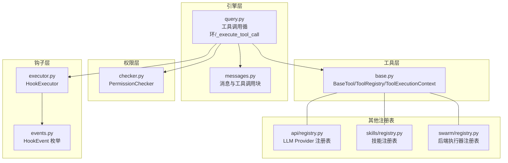
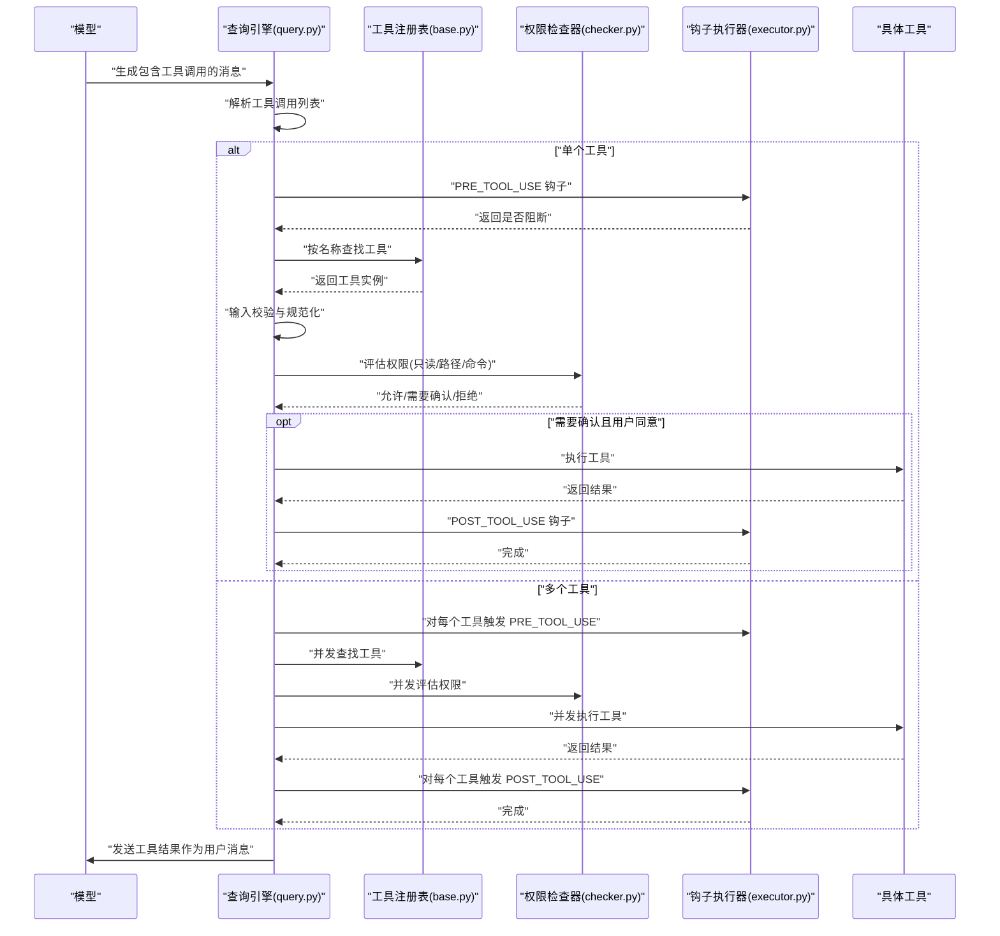
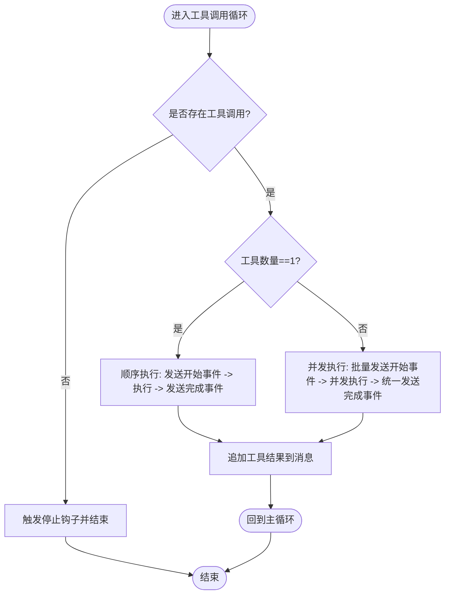
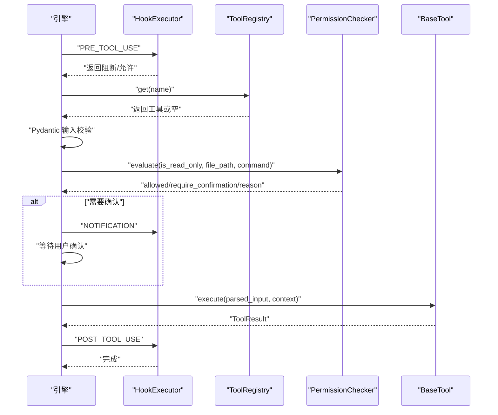
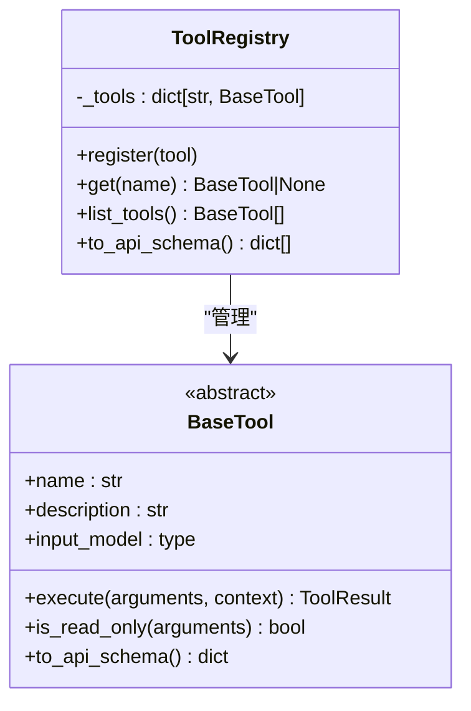
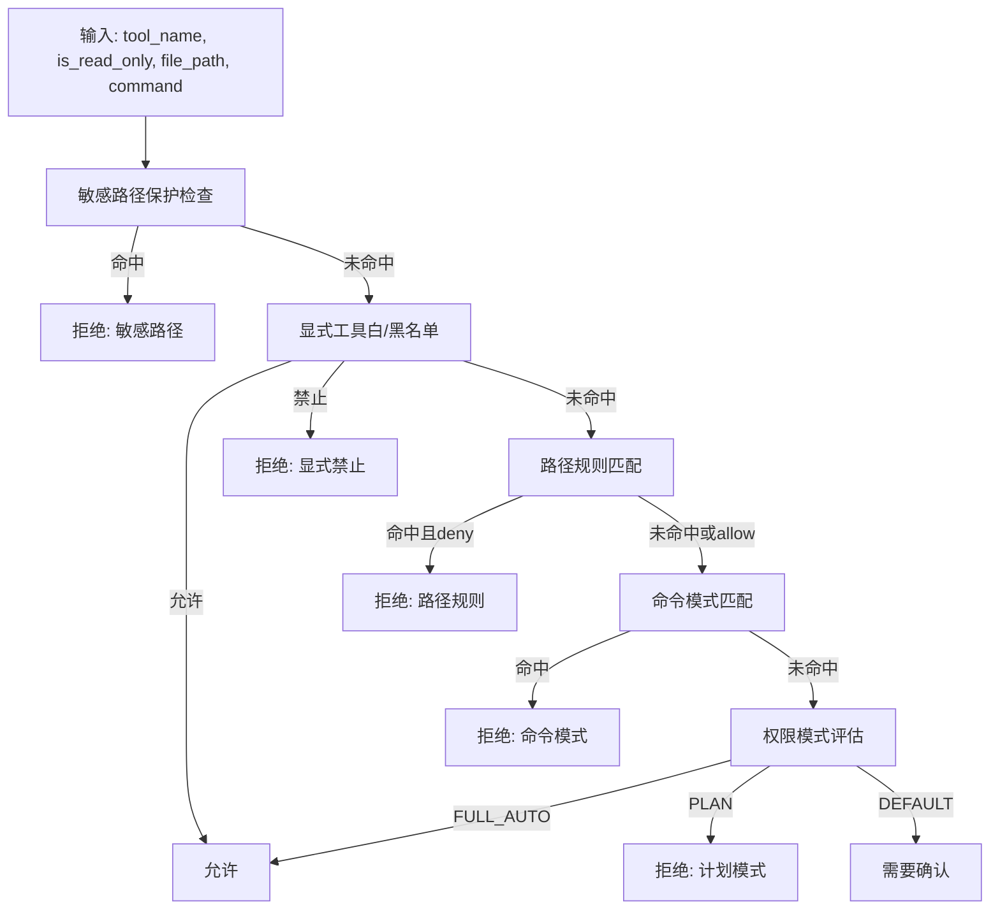
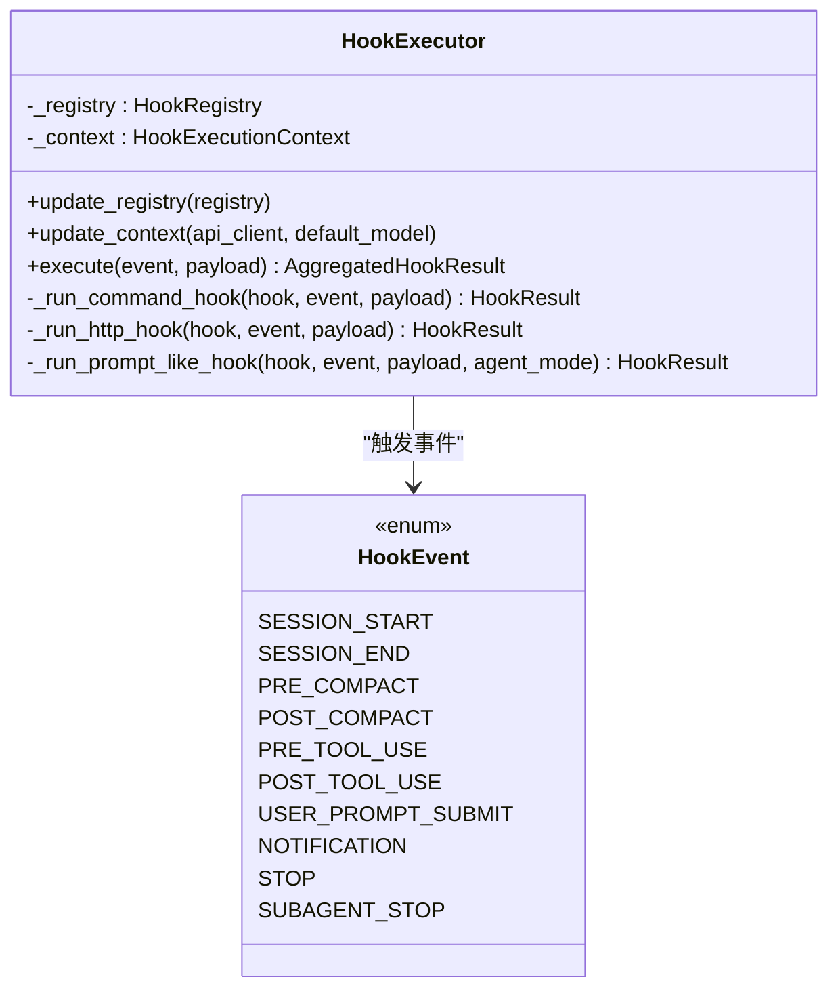
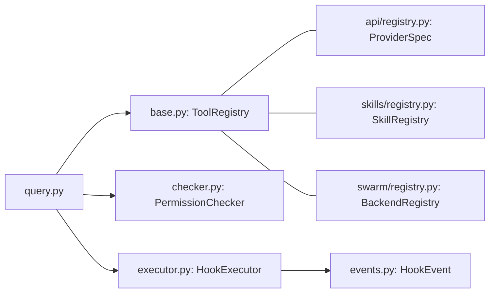

# 工具调用机制

<cite>
**本文引用的文件**
- [query.py](file://src/openharness/engine/query.py)
- [base.py](file://src/openharness/tools/base.py)
- [checker.py](file://src/openharness/permissions/checker.py)
- [executor.py](file://src/openharness/hooks/executor.py)
- [events.py](file://src/openharness/hooks/events.py)
- [messages.py](file://src/openharness/engine/messages.py)
- [registry.py](file://src/openharness/api/registry.py)
- [registry.py](file://src/openharness/skills/registry.py)
- [registry.py](file://src/openharness/swarm/registry.py)
- [test_query_engine.py](file://tests/test_engine/test_query_engine.py)
- [test_checker.py](file://tests/test_permissions/test_checker.py)
- [test_executor.py](file://tests/test_hooks/test_executor.py)
- [test_integration_flows.py](file://tests/test_tools/test_integration_flows.py)
- [test_stdio_flow.py](file://tests/test_mcp/test_stdio_flow.py)
- [test_http_flow.py](file://tests/test_mcp/test_http_flow.py)
</cite>

## 目录
1. [简介](#简介)
2. [项目结构](#项目结构)
3. [核心组件](#核心组件)
4. [架构总览](#架构总览)
5. [详细组件分析](#详细组件分析)
6. [依赖分析](#依赖分析)
7. [性能考量](#性能考量)
8. [故障排查指南](#故障排查指南)
9. [结论](#结论)
10. [附录](#附录)

## 简介
本文件系统性阐述 OpenHarness 的工具调用机制，覆盖从模型决策到工具执行的完整流程，重点解析以下方面：
- _tool_execution_loop 的实现原理：单工具顺序执行与多工具并发执行策略
- 工具注册表（ToolRegistry）的作用与工具发现机制
- 权限检查系统（PermissionChecker）的评估流程：权限决策、用户确认与安全边界控制
- 工具执行生命周期钩子（HookExecutor）机制：PRE_TOOL_USE 与 POST_TOOL_USE 的执行时机
- 错误处理、重试策略与性能监控的实践建议

## 项目结构
围绕工具调用的关键模块分布如下：
- 引擎层：负责对话轮次与工具调用循环，定义工具调用事件与消息模型
- 工具层：抽象工具接口、工具上下文与工具注册表
- 权限层：基于配置与规则进行工具使用决策
- 钩子层：在工具调用前后注入可编程扩展点
- 测试层：验证工具调用、权限检查与钩子行为

**图表来源**
- [query.py:800-999](file://src/openharness/engine/query.py#L800-L999)
- [messages.py:40-99](file://src/openharness/engine/messages.py#L40-L99)
- [base.py:35-81](file://src/openharness/tools/base.py#L35-L81)
- [checker.py:57-156](file://src/openharness/permissions/checker.py#L57-L156)
- [executor.py:41-79](file://src/openharness/hooks/executor.py#L41-L79)
- [events.py:8-21](file://src/openharness/hooks/events.py#L8-L21)
- [api/registry.py:17-368](file://src/openharness/api/registry.py#L17-L368)
- [skills/registry.py:8-30](file://src/openharness/skills/registry.py#L8-L30)
- [swarm/registry.py:97-290](file://src/openharness/swarm/registry.py#L97-L290)

**章节来源**
- [query.py:800-999](file://src/openharness/engine/query.py#L800-L999)
- [base.py:60-81](file://src/openharness/tools/base.py#L60-L81)
- [checker.py:57-156](file://src/openharness/permissions/checker.py#L57-L156)
- [executor.py:41-79](file://src/openharness/hooks/executor.py#L41-L79)
- [events.py:8-21](file://src/openharness/hooks/events.py#L8-L21)
- [messages.py:40-99](file://src/openharness/engine/messages.py#L40-L99)
- [api/registry.py:17-368](file://src/openharness/api/registry.py#L17-L368)
- [skills/registry.py:8-30](file://src/openharness/skills/registry.py#L8-L30)
- [swarm/registry.py:97-290](file://src/openharness/swarm/registry.py#L97-L290)

## 核心组件
- 工具调用循环（_tool_execution_loop）：根据模型返回的工具调用列表，选择单工具顺序执行或多工具并发执行，并在完成后追加工具结果消息
- 单工具执行（_execute_tool_call）：预钩子评估、工具查找与输入校验、权限决策与用户确认、工具执行、输出归档与记录、后钩子触发
- 工具注册表（ToolRegistry）：按名称映射工具实例，提供工具发现与 API 模式导出
- 权限检查器（PermissionChecker）：综合模式、显式白/黑名单、路径规则、命令模式与敏感路径保护，给出允许/需要确认/拒绝的决策
- 钩子执行器（HookExecutor）：按事件类型执行命令、HTTP 或提示类钩子，支持阻断策略与超时控制

**章节来源**
- [query.py:817-872](file://src/openharness/engine/query.py#L817-L872)
- [query.py:875-1001](file://src/openharness/engine/query.py#L875-L1001)
- [base.py:60-81](file://src/openharness/tools/base.py#L60-L81)
- [checker.py:57-156](file://src/openharness/permissions/checker.py#L57-L156)
- [executor.py:41-79](file://src/openharness/hooks/executor.py#L41-L79)

## 架构总览
下图展示了工具调用从模型到工具执行的端到端流程，包含权限与钩子的交叉点。

**图表来源**
- [query.py:817-872](file://src/openharness/engine/query.py#L817-L872)
- [query.py:875-1001](file://src/openharness/engine/query.py#L875-L1001)
- [base.py:60-81](file://src/openharness/tools/base.py#L60-L81)
- [checker.py:75-156](file://src/openharness/permissions/checker.py#L75-L156)
- [executor.py:64-79](file://src/openharness/hooks/executor.py#L64-L79)

## 详细组件分析

### 工具调用循环（_tool_execution_loop）
- 单工具顺序执行：立即发出“开始执行”事件，串行执行工具，完成后发出“执行完成”事件
- 多工具并发执行：先批量发出“开始执行”事件，再并发执行所有工具；为避免因单个失败导致会话悬挂，使用 gather(return_exceptions=True) 收集结果；最后统一发出“执行完成”事件
- 结果归档：将工具结果以 ToolResultBlock 形式追加到对话消息中，供后续轮次继续推理

**图表来源**
- [query.py:817-872](file://src/openharness/engine/query.py#L817-L872)

**章节来源**
- [query.py:817-872](file://src/openharness/engine/query.py#L817-L872)

### 单工具执行（_execute_tool_call）
- 预钩子评估：若存在 HookExecutor，则在执行前触发 PRE_TOOL_USE；若被阻断则直接返回错误结果
- 工具发现与输入校验：通过 ToolRegistry 查找工具并使用 Pydantic 校验输入；失败则返回错误
- 权限评估与用户确认：提取文件路径与命令，调用 PermissionChecker 进行评估；若需确认则触发 NOTIFICATION 钩子并等待用户确认
- 工具执行与记录：执行工具，记录耗时、输出归档与携带信息，必要时触发 POST_TOOL_USE 钩子
- 输出归档：对大输出进行离线归档并记录活动产物

**图表来源**
- [query.py:875-1001](file://src/openharness/engine/query.py#L875-L1001)
- [base.py:60-81](file://src/openharness/tools/base.py#L60-L81)
- [checker.py:75-156](file://src/openharness/permissions/checker.py#L75-L156)
- [executor.py:64-79](file://src/openharness/hooks/executor.py#L64-L79)

**章节来源**
- [query.py:875-1001](file://src/openharness/engine/query.py#L875-L1001)

### 工具注册表（ToolRegistry）
- 职责：维护工具名称到工具实例的映射，提供注册、查找、枚举与 API 模式导出
- 工具发现：通过名称精确匹配定位工具；结合输入模型进行参数校验
- 与引擎协作：在工具执行前由查询引擎调用 get 获取具体工具实例

**图表来源**
- [base.py:60-81](file://src/openharness/tools/base.py#L60-L81)

**章节来源**
- [base.py:60-81](file://src/openharness/tools/base.py#L60-L81)

### 权限检查系统（PermissionChecker）
- 决策维度：敏感路径保护（内置）、显式工具白/黑名单、路径规则、命令模式、权限模式（全自动/计划/默认）
- 评估流程：
  - 敏感路径保护优先于所有其他规则
  - 若命中显式允许/禁止，直接返回
  - 路径规则匹配后按 allow/deny 决定
  - 命令模式匹配禁止命令
  - 模式决定是否允许或要求确认
- 用户确认：当决策要求确认时，引擎触发 NOTIFICATION 钩子并调用 permission_prompt，等待用户同意后再继续

**图表来源**
- [checker.py:75-156](file://src/openharness/permissions/checker.py#L75-L156)

**章节来源**
- [checker.py:57-156](file://src/openharness/permissions/checker.py#L57-L156)

### 生命周期钩子（HookExecutor）
- 钩子类型：命令钩子、HTTP 钩子、提示类钩子、代理钩子
- 匹配与注入：根据 HookEvent 与 payload 中的字段（如 tool_name）进行匹配；命令钩子支持 JSON 序列化后的参数注入与 shell 转义
- 执行策略：支持超时控制与失败阻断；成功/失败均返回 HookResult，聚合为 AggregatedHookResult
- 事件触发：PRE_TOOL_USE 在工具执行前触发；POST_TOOL_USE 在工具执行后触发；NOTIFICATION 用于权限确认前的通知

**图表来源**
- [executor.py:41-79](file://src/openharness/hooks/executor.py#L41-L79)
- [events.py:8-21](file://src/openharness/hooks/events.py#L8-L21)

**章节来源**
- [executor.py:41-243](file://src/openharness/hooks/executor.py#L41-L243)
- [events.py:8-21](file://src/openharness/hooks/events.py#L8-L21)

## 依赖分析
- 查询引擎依赖工具注册表进行工具发现，依赖权限检查器进行安全决策，依赖钩子执行器进行生命周期扩展
- 工具注册表与 API 提供者、技能与 Swarm 后端注册表并列存在，分别服务于不同抽象层次

**图表来源**
- [query.py:800-999](file://src/openharness/engine/query.py#L800-L999)
- [base.py:60-81](file://src/openharness/tools/base.py#L60-L81)
- [checker.py:57-156](file://src/openharness/permissions/checker.py#L57-L156)
- [executor.py:41-79](file://src/openharness/hooks/executor.py#L41-L79)
- [events.py:8-21](file://src/openharness/hooks/events.py#L8-L21)
- [api/registry.py:17-368](file://src/openharness/api/registry.py#L17-L368)
- [skills/registry.py:8-30](file://src/openharness/skills/registry.py#L8-L30)
- [swarm/registry.py:97-290](file://src/openharness/swarm/registry.py#L97-L290)

**章节来源**
- [query.py:800-999](file://src/openharness/engine/query.py#L800-L999)
- [base.py:60-81](file://src/openharness/tools/base.py#L60-L81)
- [checker.py:57-156](file://src/openharness/permissions/checker.py#L57-L156)
- [executor.py:41-79](file://src/openharness/hooks/executor.py#L41-L79)
- [events.py:8-21](file://src/openharness/hooks/events.py#L8-L21)
- [api/registry.py:17-368](file://src/openharness/api/registry.py#L17-L368)
- [skills/registry.py:8-30](file://src/openharness/skills/registry.py#L8-L30)
- [swarm/registry.py:97-290](file://src/openharness/swarm/registry.py#L97-L290)

## 性能考量
- 并发执行：多工具场景采用 asyncio.gather 并发执行，显著降低总延迟；使用 return_exceptions=True 避免单点异常影响其他工具
- 输出归档：对大输出进行离线归档，减少消息体积与传输开销
- 耗时记录：在工具执行前后记录时间戳，便于性能监控与瓶颈定位
- 钩子超时：命令与 HTTP 钩子设置超时，防止阻塞工具执行

**章节来源**
- [query.py:838-866](file://src/openharness/engine/query.py#L838-L866)
- [query.py:970-972](file://src/openharness/engine/query.py#L970-L972)
- [executor.py:108-120](file://src/openharness/hooks/executor.py#L108-L120)
- [executor.py:145-167](file://src/openharness/hooks/executor.py#L145-L167)

## 故障排查指南
- 工具未知或输入无效
  - 现象：返回 Unknown tool 或 Invalid input
  - 排查：确认工具名称拼写与注册；检查输入模型字段与类型
  - 参考测试：[test_integration_flows.py:205-240](file://tests/test_tools/test_integration_flows.py#L205-L240)
- 权限被拒绝
  - 现象：Permission denied 或需要确认
  - 排查：检查权限模式、路径规则、命令模式与敏感路径保护；确认用户确认流程
  - 参考测试：[test_query_engine.py:972-1014](file://tests/test_engine/test_query_engine.py#L972-L1014)，[test_checker.py:12-35](file://tests/test_permissions/test_checker.py#L12-L35)
- 钩子阻断
  - 现象：PRE_TOOL_USE 阻断导致工具不执行
  - 排查：检查钩子匹配器、命令注入与转义；确认 block_on_failure 设置
  - 参考测试：[test_executor.py:110-121](file://tests/test_hooks/test_executor.py#L110-L121)
- MCP 工具异常
  - 现象：MCP 工具执行失败
  - 排查：确认 MCP 服务可用、资源 URI 正确与适配器注册
  - 参考测试：[test_stdio_flow.py:39-54](file://tests/test_mcp/test_stdio_flow.py#L39-L54)，[test_http_flow.py:74-90](file://tests/test_mcp/test_http_flow.py#L74-L90)

**章节来源**
- [test_integration_flows.py:205-240](file://tests/test_tools/test_integration_flows.py#L205-L240)
- [test_query_engine.py:972-1014](file://tests/test_engine/test_query_engine.py#L972-L1014)
- [test_checker.py:12-35](file://tests/test_permissions/test_checker.py#L12-L35)
- [test_executor.py:110-121](file://tests/test_hooks/test_executor.py#L110-L121)
- [test_stdio_flow.py:39-54](file://tests/test_mcp/test_stdio_flow.py#L39-L54)
- [test_http_flow.py:74-90](file://tests/test_mcp/test_http_flow.py#L74-L90)

## 结论
OpenHarness 的工具调用机制以查询引擎为核心，串联工具注册表、权限检查与钩子执行，形成可扩展、可观测且安全的工具执行闭环。单工具顺序执行保证确定性，多工具并发执行提升吞吐；权限检查与用户确认确保安全边界可控；钩子系统提供强大的生命周期扩展能力。通过测试用例与源码分析可知，该机制在错误处理、重试策略与性能监控方面具备良好实践基础。

## 附录
- 典型工具调用流程示例（路径参考）
  - 单工具顺序执行：[query.py:819-829](file://src/openharness/engine/query.py#L819-L829)
  - 多工具并发执行：[query.py:830-866](file://src/openharness/engine/query.py#L830-L866)
  - 工具执行与钩子：[query.py:875-1001](file://src/openharness/engine/query.py#L875-L1001)
  - 权限评估与确认：[checker.py:75-156](file://src/openharness/permissions/checker.py#L75-L156)，[query.py:927-954](file://src/openharness/engine/query.py#L927-L954)
  - 钩子执行与注入：[executor.py:64-243](file://src/openharness/hooks/executor.py#L64-L243)