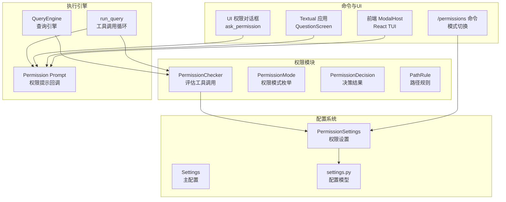
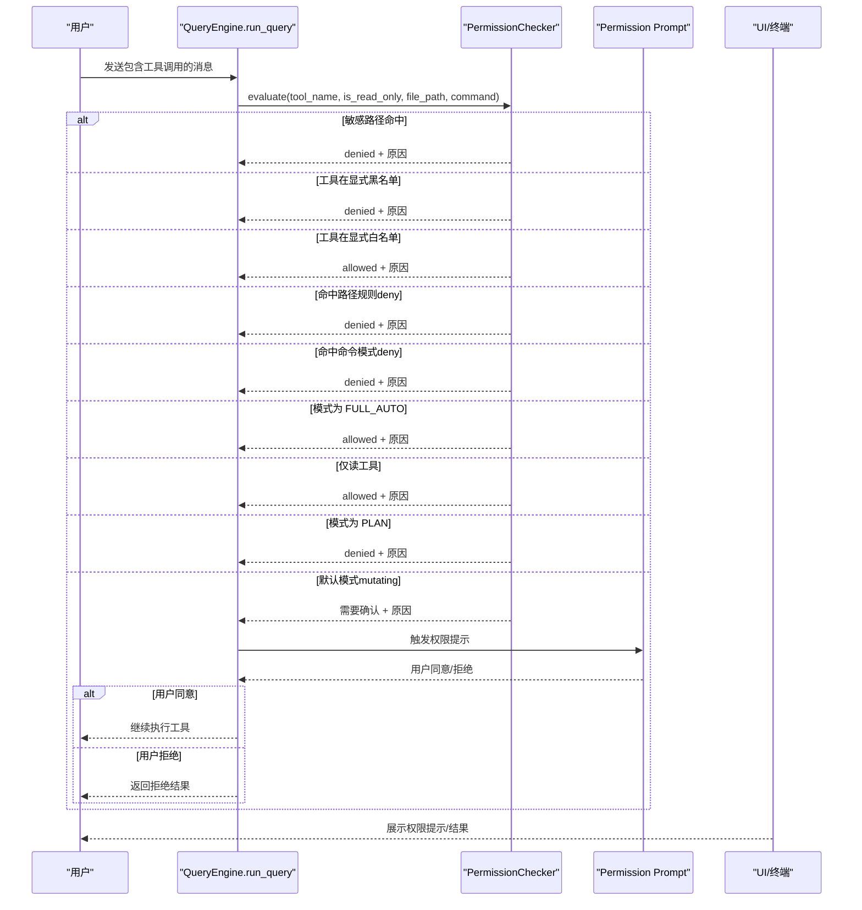
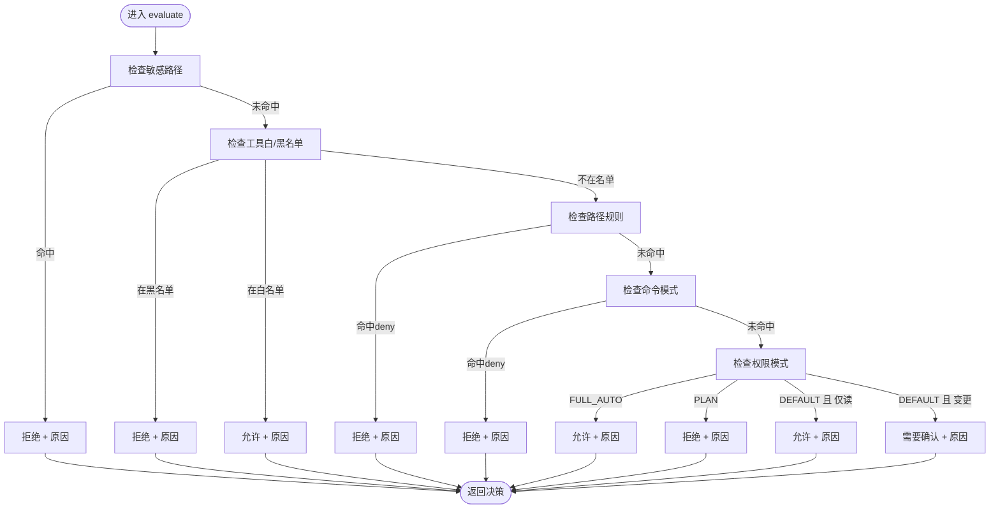
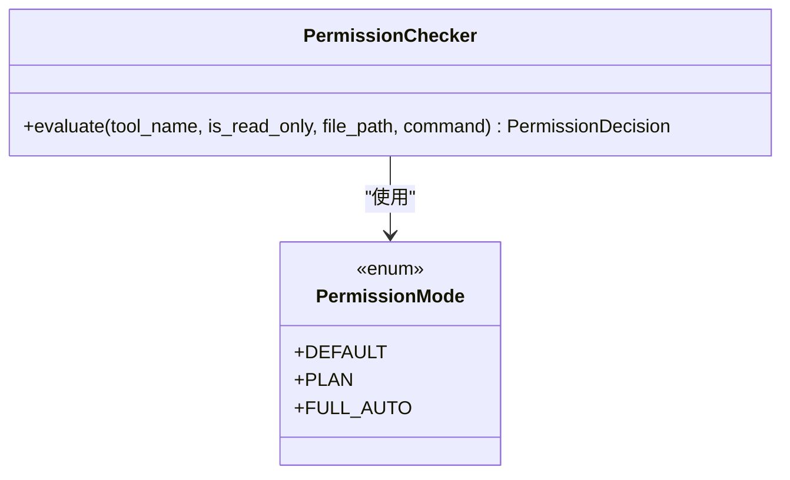
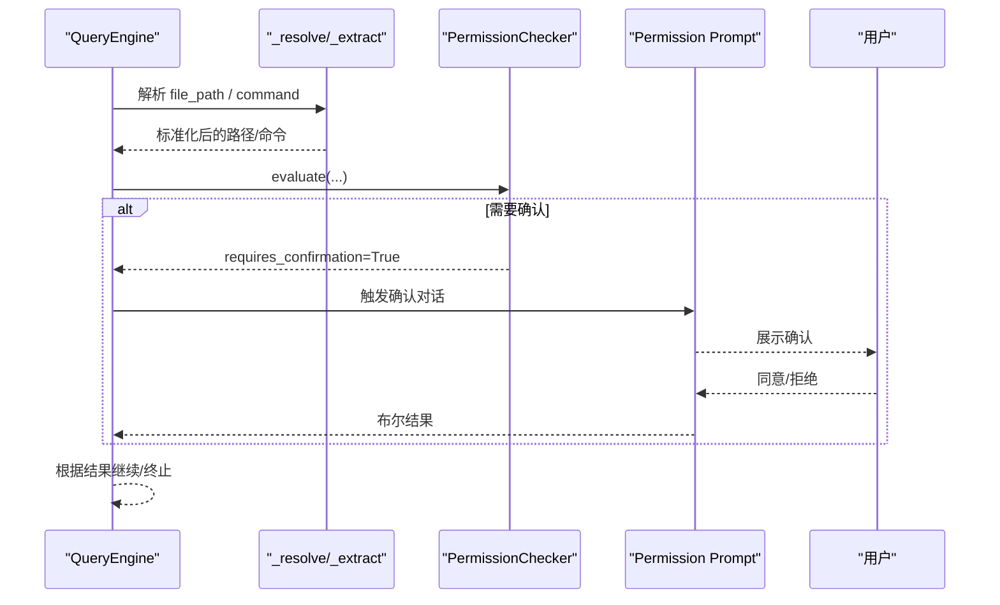
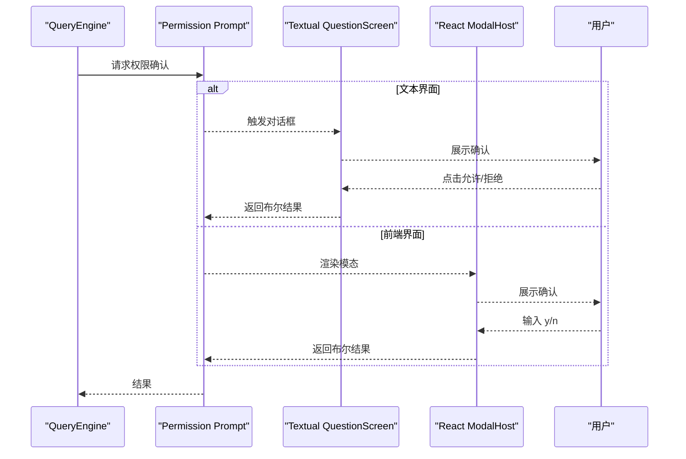
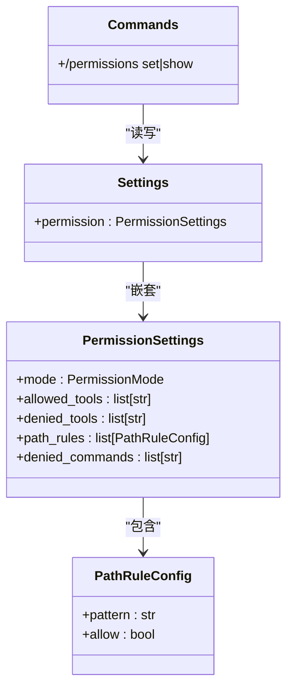
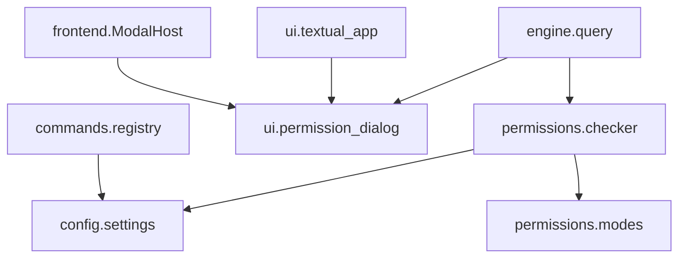

# 权限系统

<cite>
**本文档引用的文件**
- [checker.py](file://src/openharness/permissions/checker.py)
- [modes.py](file://src/openharness/permissions/modes.py)
- [__init__.py](file://src/openharness/permissions/__init__.py)
- [settings.py](file://src/openharness/config/settings.py)
- [schema.py](file://src/openharness/config/schema.py)
- [query.py](file://src/openharness/engine/query.py)
- [registry.py](file://src/openharness/commands/registry.py)
- [permission_dialog.py](file://src/openharness/ui/permission_dialog.py)
- [textual_app.py](file://src/openharness/ui/textual_app.py)
- [ModalHost.tsx](file://frontend/terminal/src/components/ModalHost.tsx)
- [engine-module-design.md](file://docs/engine-module-design.md)
- [test_checker.py](file://tests/test_permissions/test_checker.py)
- [test_harness_features.py](file://scripts/test_harness_features.py)
- [README.md](file://README.md)
</cite>

## 目录
1. [简介](#简介)
2. [项目结构](#项目结构)
3. [核心组件](#核心组件)
4. [架构总览](#架构总览)
5. [详细组件分析](#详细组件分析)
6. [依赖分析](#依赖分析)
7. [性能考虑](#性能考虑)
8. [故障排除指南](#故障排除指南)
9. [结论](#结论)
10. [附录](#附录)

## 简介
本文件系统化阐述 OpenHarness 权限系统的设计原理与实现细节，重点覆盖以下方面：
- PermissionChecker 的评估算法与决策流程，包括路径规则、命令限制与敏感路径保护
- 权限模式（PermissionModes）的三种级别及其适用场景：严格模式、宽松模式与自定义模式
- 权限提示与用户确认机制的实现方式
- 权限检查在工具调用请求到最终决策的完整流程
- 配置选项、调试方法与最佳实践

## 项目结构
权限系统位于独立模块中，围绕 PermissionChecker 核心类展开，并与配置系统、引擎执行循环、命令注册表以及 UI 提示组件协同工作。

**图表来源**
- [checker.py:57-156](file://src/openharness/permissions/checker.py#L57-L156)
- [modes.py:8-13](file://src/openharness/permissions/modes.py#L8-L13)
- [settings.py:50-58](file://src/openharness/config/settings.py#L50-L58)
- [query.py:908-1044](file://src/openharness/engine/query.py#L908-L1044)
- [registry.py:1285-1307](file://src/openharness/commands/registry.py#L1285-L1307)
- [permission_dialog.py:8-14](file://src/openharness/ui/permission_dialog.py#L8-L14)
- [textual_app.py:88-122](file://src/openharness/ui/textual_app.py#L88-L122)
- [ModalHost.tsx:91-151](file://frontend/terminal/src/components/ModalHost.tsx#L91-L151)

**章节来源**
- [checker.py:1-201](file://src/openharness/permissions/checker.py#L1-L201)
- [modes.py:1-14](file://src/openharness/permissions/modes.py#L1-L14)
- [settings.py:50-58](file://src/openharness/config/settings.py#L50-L58)
- [engine-module-design.md:21-45](file://docs/engine-module-design.md#L21-L45)

## 核心组件
- PermissionChecker：根据权限模式、显式工具白/黑名单、路径规则、命令模式与敏感路径保护进行综合评估，返回 PermissionDecision。
- PermissionMode：定义三种权限模式（默认、计划、全自动）。
- PermissionSettings：承载权限模式、工具白/黑名单、路径规则与命令禁止模式等配置。
- PermissionDecision：封装允许与否、是否需要确认、原因说明等结果信息。
- PathRule：基于 glob 的路径规则单元，支持允许/拒绝两种语义。
- Permission Prompt：异步回调，用于在需要时弹出用户确认对话框。

**章节来源**
- [checker.py:40-156](file://src/openharness/permissions/checker.py#L40-L156)
- [modes.py:8-13](file://src/openharness/permissions/modes.py#L8-L13)
- [settings.py:43-58](file://src/openharness/config/settings.py#L43-L58)

## 架构总览
权限系统在工具调用前插入统一的评估点，结合配置与 UI 提示，形成“策略驱动 + 人机协作”的安全边界。

**图表来源**
- [query.py:908-1044](file://src/openharness/engine/query.py#L908-L1044)
- [checker.py:75-156](file://src/openharness/permissions/checker.py#L75-L156)
- [permission_dialog.py:8-14](file://src/openharness/ui/permission_dialog.py#L8-L14)
- [textual_app.py:88-122](file://src/openharness/ui/textual_app.py#L88-L122)
- [ModalHost.tsx:91-151](file://frontend/terminal/src/components/ModalHost.tsx#L91-L151)

## 详细组件分析

### PermissionChecker 设计与评估算法
- 敏感路径保护：内置一组高价值凭证与密钥路径的通配模式，无论何种权限模式均生效，不可被用户配置覆盖。
- 工具级控制：支持显式允许/拒绝工具清单，优先于其他规则。
- 路径级规则：基于 glob 模式对文件路径进行允许/拒绝判定；对目录根路径附加尾随斜杠以确保目录本身也能被匹配。
- 命令级限制：支持基于通配的命令模式拒绝，例如危险命令组合。
- 权限模式：
  - FULL_AUTO：放行一切（仍受敏感路径保护约束）
  - PLAN：阻止所有变更型工具，直到退出计划模式
  - DEFAULT：仅读工具放行，变更型工具需要用户确认
- 用户提示与理由：在需要确认时，提供可读性强的理由，并在 bash 场景下给出包安装/脚手架的额外提示。

**图表来源**
- [checker.py:75-156](file://src/openharness/permissions/checker.py#L75-L156)
- [checker.py:159-169](file://src/openharness/permissions/checker.py#L159-L169)
- [checker.py:172-200](file://src/openharness/permissions/checker.py#L172-L200)

**章节来源**
- [checker.py:14-37](file://src/openharness/permissions/checker.py#L14-L37)
- [checker.py:57-156](file://src/openharness/permissions/checker.py#L57-L156)
- [checker.py:159-200](file://src/openharness/permissions/checker.py#L159-L200)

### 权限模式（PermissionModes）
- 默认模式（DEFAULT）：适合日常开发与探索，仅读工具默认放行，变更型工具需要用户确认。
- 计划模式（PLAN）：适合深度规划阶段，所有变更型工具被阻止，直至退出计划模式。
- 全自动（FULL_AUTO）：适合受控沙箱或测试环境，放行一切但保留敏感路径保护。

**图表来源**
- [modes.py:8-13](file://src/openharness/permissions/modes.py#L8-L13)
- [checker.py:128-141](file://src/openharness/permissions/checker.py#L128-L141)

**章节来源**
- [modes.py:8-13](file://src/openharness/permissions/modes.py#L8-L13)
- [settings.py:53-53](file://src/openharness/config/settings.py#L53-L53)

### 权限决策流程（从工具调用到最终决策）
- 输入归一化：引擎在调用前标准化文件路径与命令，确保规则匹配一致性。
- 权限评估：PermissionChecker 按既定顺序进行判定。
- 用户确认：当决策要求确认时，通过 Permission Prompt 回调触发 UI 提示。
- 结果应用：根据用户选择继续执行或拒绝。

**图表来源**
- [query.py:908-1044](file://src/openharness/engine/query.py#L908-L1044)
- [checker.py:75-156](file://src/openharness/permissions/checker.py#L75-L156)
- [permission_dialog.py:8-14](file://src/openharness/ui/permission_dialog.py#L8-L14)

**章节来源**
- [query.py:908-1044](file://src/openharness/engine/query.py#L908-L1044)

### 权限提示与用户确认机制
- 文本界面：通过异步提示会话询问用户是否允许特定工具调用。
- Textual 应用：提供问答式对话框，支持快捷键与按钮确认/拒绝。
- 前端 React TUI：渲染权限确认模态，显示工具名与原因，提供 y/n 选择。
- 并发与锁：在并发请求场景下保证模态请求的串行化与互斥。

**图表来源**
- [permission_dialog.py:8-14](file://src/openharness/ui/permission_dialog.py#L8-L14)
- [textual_app.py:88-122](file://src/openharness/ui/textual_app.py#L88-L122)
- [ModalHost.tsx:91-151](file://frontend/terminal/src/components/ModalHost.tsx#L91-L151)

**章节来源**
- [permission_dialog.py:8-14](file://src/openharness/ui/permission_dialog.py#L8-L14)
- [textual_app.py:88-122](file://src/openharness/ui/textual_app.py#L88-L122)
- [ModalHost.tsx:91-151](file://frontend/terminal/src/components/ModalHost.tsx#L91-L151)

### 配置选项与命令
- 权限设置模型：包含模式、工具白/黑名单、路径规则、命令禁止模式。
- 命令注册：/permissions 命令支持查看与设置权限模式，持久化到配置。
- 前端命令：支持远程管理员 opt-in 的显式远程执行。

**图表来源**
- [settings.py:43-58](file://src/openharness/config/settings.py#L43-L58)
- [settings.py:50-58](file://src/openharness/config/settings.py#L50-L58)
- [registry.py:1285-1307](file://src/openharness/commands/registry.py#L1285-L1307)

**章节来源**
- [settings.py:43-58](file://src/openharness/config/settings.py#L43-L58)
- [registry.py:1285-1307](file://src/openharness/commands/registry.py#L1285-L1307)

### 典型使用场景与代码示例路径
- 文件访问控制：通过路径规则对 /etc/* 等路径进行拒绝，即使模式为 FULL_AUTO 也有效。
- 命令执行限制：对危险命令模式（如递归删除）进行拒绝。
- 系统调用安全：敏感路径保护覆盖 SSH、AWS、GCP、Azure、GPG、Docker、K8s、Copilot 等凭证与配置文件。

参考示例路径（不直接展示代码内容）：
- [路径规则拒绝示例:156-177](file://scripts/test_harness_features.py#L156-L177)
- [命令模式拒绝示例:180-189](file://scripts/test_harness_features.py#L180-L189)
- [敏感路径保护测试:135-231](file://tests/test_permissions/test_checker.py#L135-L231)

**章节来源**
- [test_checker.py:1-231](file://tests/test_permissions/test_checker.py#L1-L231)
- [test_harness_features.py:156-189](file://scripts/test_harness_features.py#L156-L189)

## 依赖分析
- 权限模块依赖配置系统提供的 PermissionSettings 与 PermissionMode。
- 执行引擎在工具调用前调用 PermissionChecker，并在需要时通过 Permission Prompt 触发 UI。
- 命令注册表负责 /permissions 命令的解析与持久化。
- UI 层提供多种交互方式（文本、TUI、前端）以满足不同运行环境。

**图表来源**
- [checker.py:9-10](file://src/openharness/permissions/checker.py#L9-L10)
- [settings.py:23-25](file://src/openharness/config/settings.py#L23-L25)
- [query.py:908-930](file://src/openharness/engine/query.py#L908-L930)
- [registry.py:1285-1307](file://src/openharness/commands/registry.py#L1285-L1307)
- [permission_dialog.py:5-5](file://src/openharness/ui/permission_dialog.py#L5-L5)

**章节来源**
- [engine-module-design.md:21-45](file://docs/engine-module-design.md#L21-L45)

## 性能考虑
- 规则匹配采用线性扫描与通配匹配，路径规则数量应适度控制以避免评估开销。
- 目录路径匹配通过附加斜杠确保规则覆盖目录根，减少误判但增加少量字符串处理。
- 命令提示与 UI 交互为异步回调，不会阻塞引擎主循环。
- 建议在 FULL_AUTO 模式下谨慎启用大量路径规则，以免影响高频工具调用的响应速度。

## 故障排除指南
- 路径规则无效或被跳过：检查规则 pattern 是否为空、非字符串或仅有空白字符，此类规则会被忽略并产生警告日志。
- 敏感路径仍然被允许：确认不是误报，敏感路径保护不受模式影响，必须通过明确的路径规则放行（不建议）。
- 变更型工具被拒绝：在默认模式下属预期行为，可通过 /permissions 命令切换至 FULL_AUTO 或退出计划模式。
- 命令被意外拒绝：检查 denied_commands 中是否存在通配模式导致误伤，必要时调整为更精确的模式。
- UI 确认未出现：确认 permission_prompt 回调已正确注入，且运行环境支持相应 UI（文本/TUI/前端）。

**章节来源**
- [checker.py:64-73](file://src/openharness/permissions/checker.py#L64-L73)
- [test_checker.py:77-84](file://tests/test_permissions/test_checker.py#L77-L84)

## 结论
OpenHarness 权限系统通过“策略驱动 + 人机协作”的方式，在保障安全的前提下提供了灵活可控的工具调用边界。其核心在于：
- 不可绕过的敏感路径保护
- 分层的规则体系（工具级、路径级、命令级）
- 三种权限模式以适配不同场景
- 一致的评估流程与直观的用户确认机制

## 附录

### 权限模式与适用场景速查
- 默认模式（DEFAULT）：日常开发、探索性任务，变更型工具需要确认
- 计划模式（PLAN）：深度规划、风险隔离，禁止一切变更型工具
- 全自动（FULL_AUTO）：受控测试、自动化流水线，放行一切但保留敏感路径保护

**章节来源**
- [modes.py:11-13](file://src/openharness/permissions/modes.py#L11-L13)

### 配置要点与最佳实践
- 优先使用路径规则替代全局模式切换，以最小化权限范围
- 对高危命令使用明确的拒绝模式，避免通配导致误伤
- 在 FULL_AUTO 下谨慎开启路径规则，确保规则集精简高效
- 使用 /permissions 命令进行模式切换时，配合会话状态持久化
- 在 CI/CD 环境中固定权限模式，避免交互式确认

**章节来源**
- [settings.py:50-58](file://src/openharness/config/settings.py#L50-L58)
- [registry.py:1285-1307](file://src/openharness/commands/registry.py#L1285-L1307)