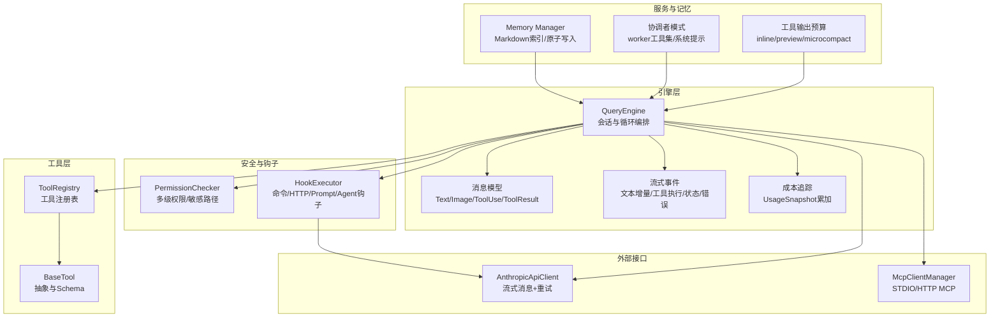
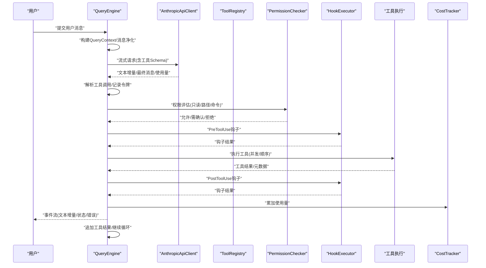
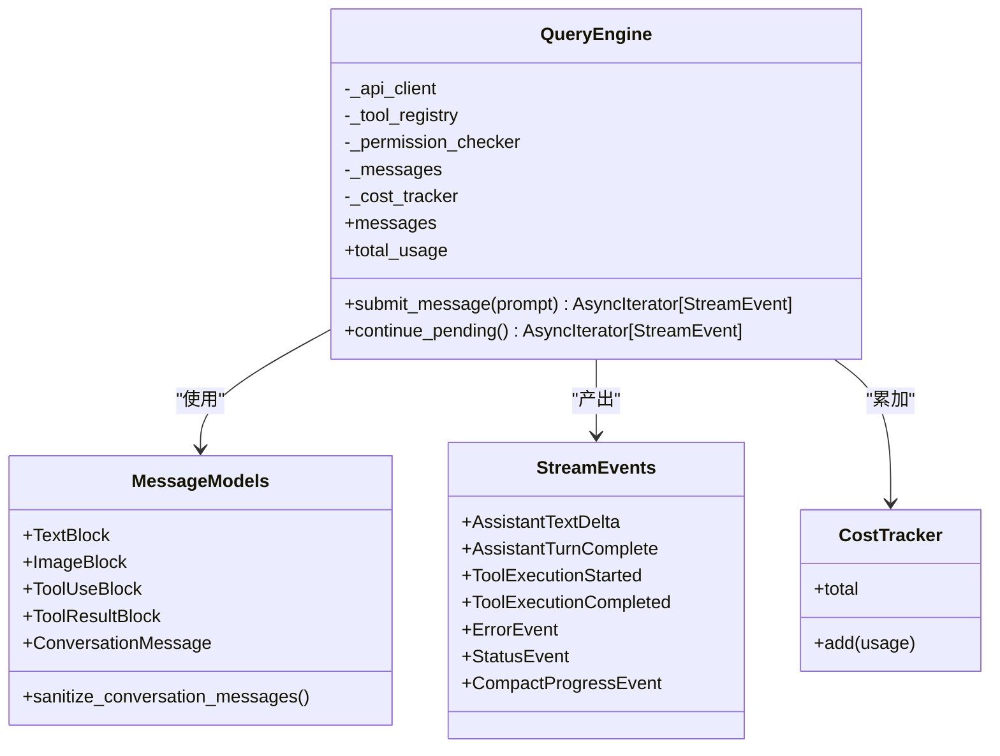
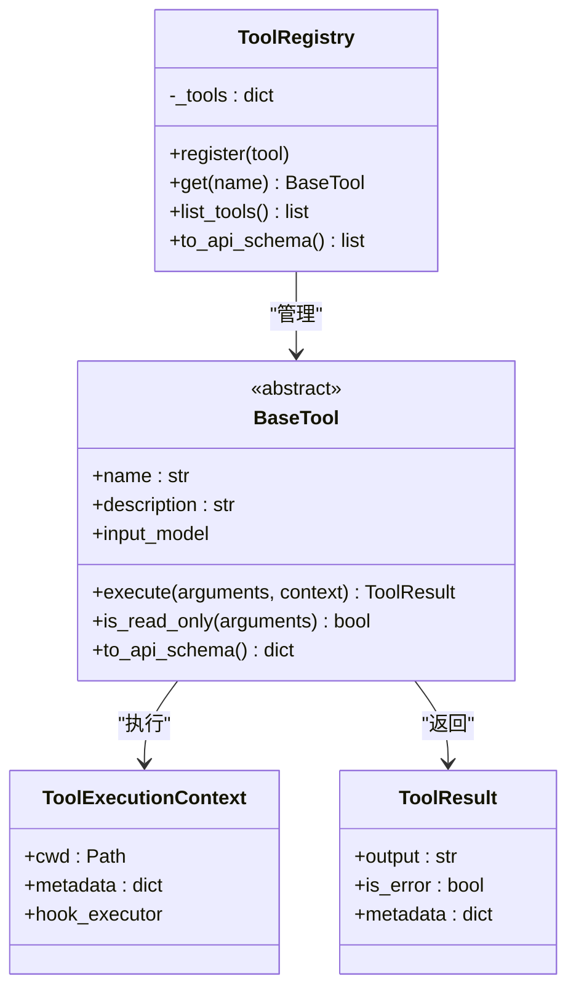
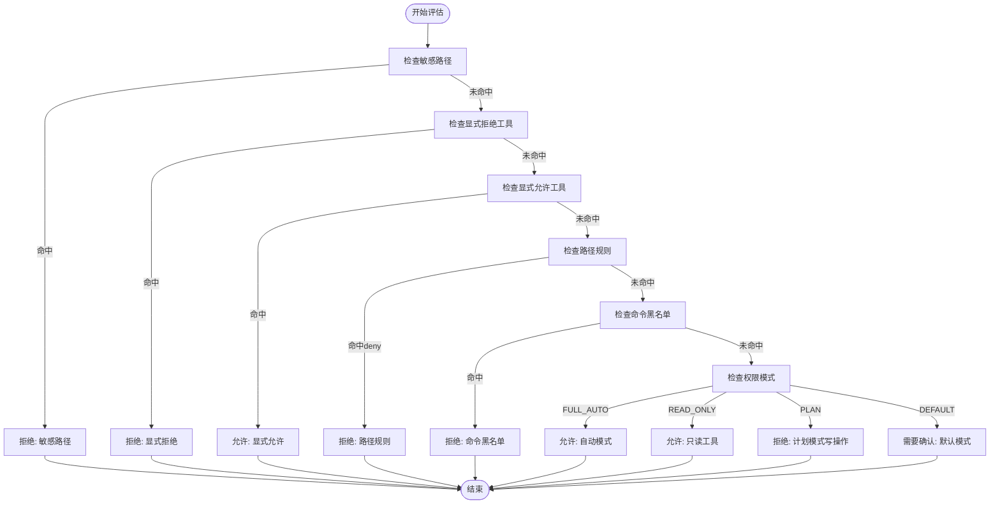
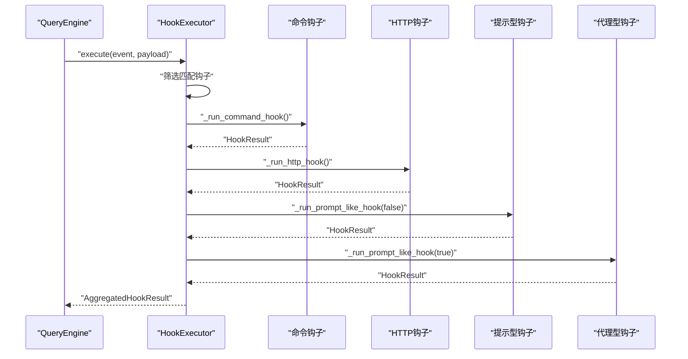
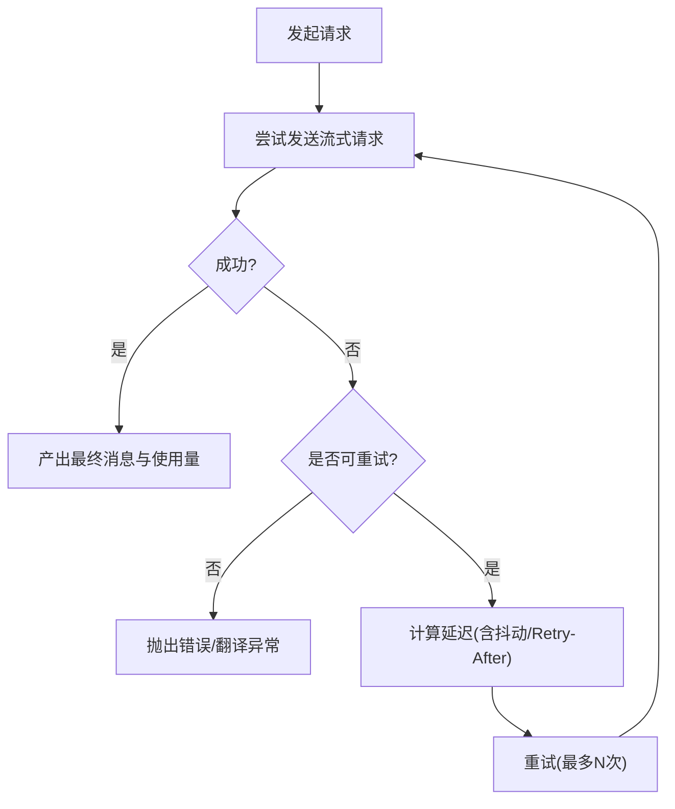
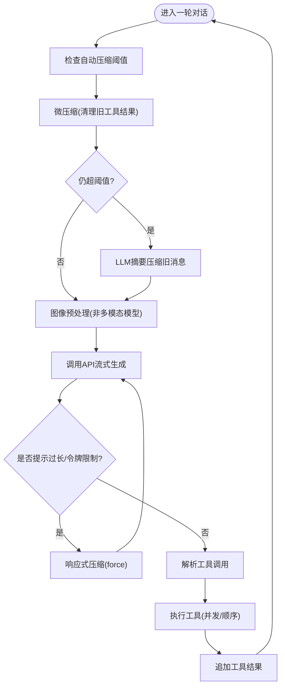
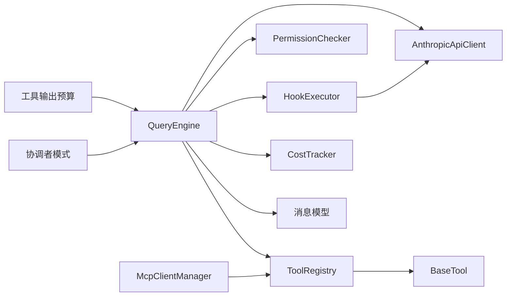

# 核心概念

<cite>
**本文引用的文件**
- [README.md](file://README.md)
- [engine/__init__.py](file://src/openharness/engine/__init__.py)
- [engine/query_engine.py](file://src/openharness/engine/query_engine.py)
- [engine/query.py](file://src/openharness/engine/query.py)
- [engine/messages.py](file://src/openharness/engine/messages.py)
- [engine/stream_events.py](file://src/openharness/engine/stream_events.py)
- [engine/cost_tracker.py](file://src/openharness/engine/cost_tracker.py)
- [tools/base.py](file://src/openharness/tools/base.py)
- [permissions/checker.py](file://src/openharness/permissions/checker.py)
- [hooks/executor.py](file://src/openharness/hooks/executor.py)
- [api/client.py](file://src/openharness/api/client.py)
- [services/tool_outputs.py](file://src/openharness/services/tool_outputs.py)
- [coordinator/coordinator_mode.py](file://src/openharness/coordinator/coordinator_mode.py)
- [mcp/client.py](file://src/openharness/mcp/client.py)
- [memory/manager.py](file://src/openharness/memory/manager.py)
</cite>

## 目录
1. [引言](#引言)
2. [项目结构](#项目结构)
3. [核心组件](#核心组件)
4. [架构总览](#架构总览)
5. [详细组件分析](#详细组件分析)
6. [依赖关系分析](#依赖关系分析)
7. [性能考量](#性能考量)
8. [故障排查指南](#故障排查指南)
9. [结论](#结论)
10. [附录](#附录)

## 引言
本节面向OpenHarness的核心理念与实现：以“模型提供智能，Harness提供手脚、眼睛、记忆和安全边界”为指导思想，系统化阐述对话引擎如何通过流式工具调用循环、API重试机制、并行工具执行与令牌计数成本跟踪，支撑起可观察、可扩展、可治理的Agent基础设施。同时覆盖会话管理、消息处理、工具调用决策、权限检查、钩子系统、内存管理与插件扩展等关键主题，帮助开发者快速理解底层实现。

## 项目结构
OpenHarness采用按功能域分层的模块化组织方式，核心子系统包括：
- engine：对话引擎与消息编排（QueryEngine、消息模型、事件流）
- tools：工具注册与执行（BaseTool、ToolRegistry）
- permissions：多级权限控制与敏感路径保护
- hooks：生命周期钩子（命令/HTTP/Prompt/Agent）
- api：统一的流式消息客户端与重试策略
- services：工具输出预算、压缩与任务管理辅助
- coordinator：协调者模式与多代理编排
- mcp：Model Context Protocol客户端与连接管理
- memory：跨会话持久化与索引管理
- ui、channels、plugins、commands、prompts、config等：交互、通道、生态扩展与配置

图表来源
- [engine/query_engine.py:19-215](file://src/openharness/engine/query_engine.py#L19-L215)
- [engine/messages.py:14-222](file://src/openharness/engine/messages.py#L14-L222)
- [engine/stream_events.py:12-90](file://src/openharness/engine/stream_events.py#L12-L90)
- [engine/cost_tracker.py:8-25](file://src/openharness/engine/cost_tracker.py#L8-L25)
- [tools/base.py:17-81](file://src/openharness/tools/base.py#L17-L81)
- [permissions/checker.py:57-201](file://src/openharness/permissions/checker.py#L57-L201)
- [hooks/executor.py:41-243](file://src/openharness/hooks/executor.py#L41-L243)
- [api/client.py:117-267](file://src/openharness/api/client.py#L117-L267)
- [mcp/client.py:29-299](file://src/openharness/mcp/client.py#L29-L299)
- [services/tool_outputs.py:15-56](file://src/openharness/services/tool_outputs.py#L15-L56)
- [coordinator/coordinator_mode.py:186-521](file://src/openharness/coordinator/coordinator_mode.py#L186-L521)
- [memory/manager.py:17-59](file://src/openharness/memory/manager.py#L17-L59)

章节来源
- [README.md:446-503](file://README.md#L446-L503)

## 核心组件
- 对话引擎（QueryEngine）：负责会话历史维护、工具感知的模型循环、上下文压缩、成本统计与事件流产出。
- 消息模型（messages）：统一的文本、图片、工具调用与结果块，支持序列化与规范化。
- 工具体系（tools/base）：标准化的工具抽象、输入校验、Schema导出与执行上下文。
- 权限检查（permissions/checker）：多级模式、路径规则、命令黑名单、敏感路径保护。
- 钩子系统（hooks/executor）：命令、HTTP、提示型与代理型钩子的统一执行器。
- API客户端（api/client）：流式消息协议封装、指数退避重试、错误翻译。
- 成本追踪（engine/cost_tracker）：累计输入/输出令牌用量。
- 服务与预算（services/tool_outputs）：工具输出内联阈值、预览长度、旧结果微压缩阈值。
- 协调者模式（coordinator/coordinator_mode）：多代理编排、worker工具集、系统提示注入。
- MCP客户端（mcp/client）：STDIO/HTTP传输、自动重连、工具与资源暴露。
- 内存管理（memory/manager）：项目级MEMORY.md索引、原子写入与并发锁。

章节来源
- [engine/query_engine.py:19-215](file://src/openharness/engine/query_engine.py#L19-L215)
- [engine/messages.py:14-222](file://src/openharness/engine/messages.py#L14-L222)
- [tools/base.py:17-81](file://src/openharness/tools/base.py#L17-L81)
- [permissions/checker.py:57-201](file://src/openharness/permissions/checker.py#L57-L201)
- [hooks/executor.py:41-243](file://src/openharness/hooks/executor.py#L41-L243)
- [api/client.py:117-267](file://src/openharness/api/client.py#L117-L267)
- [engine/cost_tracker.py:8-25](file://src/openharness/engine/cost_tracker.py#L8-L25)
- [services/tool_outputs.py:15-56](file://src/openharness/services/tool_outputs.py#L15-L56)
- [coordinator/coordinator_mode.py:186-521](file://src/openharness/coordinator/coordinator_mode.py#L186-L521)
- [mcp/client.py:29-299](file://src/openharness/mcp/client.py#L29-L299)
- [memory/manager.py:17-59](file://src/openharness/memory/manager.py#L17-L59)

## 架构总览
下图展示从用户输入到工具执行与结果回灌的完整闭环，以及与API、权限、钩子、MCP、成本追踪的交互关系。

图表来源
- [engine/query_engine.py:147-215](file://src/openharness/engine/query_engine.py#L147-L215)
- [engine/query.py:632-800](file://src/openharness/engine/query.py#L632-L800)
- [api/client.py:160-258](file://src/openharness/api/client.py#L160-L258)
- [tools/base.py:60-81](file://src/openharness/tools/base.py#L60-L81)
- [permissions/checker.py:75-157](file://src/openharness/permissions/checker.py#L75-L157)
- [hooks/executor.py:64-79](file://src/openharness/hooks/executor.py#L64-L79)
- [engine/cost_tracker.py:14-24](file://src/openharness/engine/cost_tracker.py#L14-L24)

## 详细组件分析

### 对话引擎与会话管理
- QueryEngine职责
  - 维护会话消息列表、系统提示、模型标识、最大轮次限制
  - 负责消息净化、上下文压缩触发、事件流产出、成本统计
  - 支持继续未完成的工具循环、动态更新配置
- 会话消息模型
  - TextBlock/ImageBlock/ToolUseBlock/ToolResultBlock统一建模
  - 提供序列化、反序列化与空消息过滤
- 流式事件
  - AssistantTextDelta、AssistantTurnComplete、ToolExecutionStarted/Completed、ErrorEvent、StatusEvent、CompactProgressEvent
- 成本追踪
  - UsageSnapshot累加，支持跨轮次统计

图表来源
- [engine/query_engine.py:19-116](file://src/openharness/engine/query_engine.py#L19-L116)
- [engine/messages.py:14-171](file://src/openharness/engine/messages.py#L14-L171)
- [engine/stream_events.py:12-90](file://src/openharness/engine/stream_events.py#L12-L90)
- [engine/cost_tracker.py:8-25](file://src/openharness/engine/cost_tracker.py#L8-L25)

章节来源
- [engine/query_engine.py:19-215](file://src/openharness/engine/query_engine.py#L19-L215)
- [engine/messages.py:14-222](file://src/openharness/engine/messages.py#L14-L222)
- [engine/stream_events.py:12-90](file://src/openharness/engine/stream_events.py#L12-L90)
- [engine/cost_tracker.py:8-25](file://src/openharness/engine/cost_tracker.py#L8-L25)

### 工具注册与执行
- BaseTool定义了工具名称、描述、输入模型与异步执行接口
- ToolRegistry提供注册、查询、API Schema导出能力
- 执行上下文包含工作目录与钩子执行器
- 工具结果标准化，支持错误标记与元数据

图表来源
- [tools/base.py:17-81](file://src/openharness/tools/base.py#L17-L81)

章节来源
- [tools/base.py:17-81](file://src/openharness/tools/base.py#L17-L81)

### 权限检查与安全边界
- 多级模式：默认（需要确认）、自动（允许一切）、计划模式（阻止写操作）
- 路径规则：glob匹配，deny优先于allow
- 命令黑名单：基于模式匹配
- 敏感路径保护：内置对SSH、AWS、GCP、Docker、K8s、OpenHarness凭证存储等路径的保护
- 只读工具始终允许；高风险命令有提示

图表来源
- [permissions/checker.py:75-157](file://src/openharness/permissions/checker.py#L75-L157)

章节来源
- [permissions/checker.py:57-201](file://src/openharness/permissions/checker.py#L57-L201)

### 钩子系统与生命周期
- 钩子类型：命令钩子、HTTP钩子、提示型钩子、代理型钩子
- 匹配与注入：基于事件名或工具名/提示内容进行匹配，支持JSON参数注入
- 执行流程：串行遍历匹配钩子，分别执行命令/HTTP/Prompt/Agent逻辑，聚合结果
- 安全与超时：命令钩子支持超时与沙箱可用性检查，HTTP钩子支持超时与状态码判定

图表来源
- [hooks/executor.py:64-213](file://src/openharness/hooks/executor.py#L64-L213)

章节来源
- [hooks/executor.py:41-243](file://src/openharness/hooks/executor.py#L41-L243)

### API重试机制与网络鲁棒性
- 重试策略：最大重试次数、指数退避、抖动、Retry-After头优先
- 可重试条件：特定HTTP状态码、网络/超时/OSError、部分API错误
- 错误翻译：认证、速率限制、请求失败等统一异常类型
- 流式协议：文本增量事件、最终消息事件、重试事件

图表来源
- [api/client.py:86-197](file://src/openharness/api/client.py#L86-L197)
- [api/client.py:160-258](file://src/openharness/api/client.py#L160-L258)

章节来源
- [api/client.py:117-267](file://src/openharness/api/client.py#L117-L267)

### 并行工具执行与上下文压缩
- 并行策略：图像预处理在非多模态模型场景下并行转换；工具结果落地后可并行清理旧结果
- 上下文压缩：自动压缩阈值触发微压缩（清理旧工具结果）与LLM摘要压缩；响应式压缩在“消息过长”错误时触发
- 令牌上限：对请求的max_tokens进行保守裁剪，避免上游拒绝

图表来源
- [engine/query.py:632-800](file://src/openharness/engine/query.py#L632-L800)
- [engine/query.py:562-631](file://src/openharness/engine/query.py#L562-L631)
- [services/tool_outputs.py:50-56](file://src/openharness/services/tool_outputs.py#L50-L56)

章节来源
- [engine/query.py:632-800](file://src/openharness/engine/query.py#L632-L800)
- [services/tool_outputs.py:15-56](file://src/openharness/services/tool_outputs.py#L15-L56)

### 令牌计数与成本跟踪
- 使用快照：输入/输出令牌累加
- 事件驱动：每次模型回合产出使用量，QueryEngine在事件流中同步累加
- 环境变量：可配置工具输出内联字符数、预览长度、微压缩阈值

章节来源
- [engine/cost_tracker.py:8-25](file://src/openharness/engine/cost_tracker.py#L8-L25)
- [engine/query_engine.py:186-191](file://src/openharness/engine/query_engine.py#L186-L191)
- [services/tool_outputs.py:26-47](file://src/openharness/services/tool_outputs.py#L26-L47)

### 协调者模式与多代理编排
- 模式检测：通过环境变量判断是否处于协调者模式
- 工具集：保留给worker的标准工具集合，支持简单/复杂两种模式
- 系统提示：为协调者注入明确角色、工具、工作流与并发策略
- 用户上下文：在协调者回合注入worker工具能力说明与可写目录信息

章节来源
- [coordinator/coordinator_mode.py:186-521](file://src/openharness/coordinator/coordinator_mode.py#L186-L521)

### MCP集成与工具/资源暴露
- 连接管理：支持STDIO与HTTP两种传输，自动初始化、列出工具与资源
- 工具调用：字符串化结果，结构化内容兜底
- 资源读取：文本/二进制内容拼接
- 断连处理：服务器未连接时抛出明确异常

章节来源
- [mcp/client.py:29-299](file://src/openharness/mcp/client.py#L29-L299)

### 内存管理与跨会话知识
- 列表与增删：列出项目内存文件、添加条目并更新索引、删除条目并移除索引
- 原子写入：确保并发安全
- 锁机制：每个项目一个锁文件，避免竞态

章节来源
- [memory/manager.py:17-59](file://src/openharness/memory/manager.py#L17-L59)

## 依赖关系分析
- QueryEngine依赖API客户端、工具注册表、权限检查器、钩子执行器、成本追踪器与消息模型
- 工具执行链路：QueryEngine -> 权限检查 -> 钩子Pre -> 工具执行 -> 钩子Post -> 结果回灌
- MCP与API并行存在：MCP工具作为工具注册表的一部分被模型发现与调用
- 服务层辅助：工具输出预算决定结果内联/落盘策略；上下文压缩保障长会话稳定性

图表来源
- [engine/query_engine.py:19-116](file://src/openharness/engine/query_engine.py#L19-L116)
- [tools/base.py:60-81](file://src/openharness/tools/base.py#L60-L81)
- [hooks/executor.py:41-79](file://src/openharness/hooks/executor.py#L41-L79)
- [api/client.py:117-160](file://src/openharness/api/client.py#L117-L160)
- [services/tool_outputs.py:15-56](file://src/openharness/services/tool_outputs.py#L15-L56)
- [coordinator/coordinator_mode.py:221-249](file://src/openharness/coordinator/coordinator_mode.py#L221-L249)
- [mcp/client.py:129-179](file://src/openharness/mcp/client.py#L129-L179)

章节来源
- [engine/query_engine.py:19-215](file://src/openharness/engine/query_engine.py#L19-L215)
- [tools/base.py:60-81](file://src/openharness/tools/base.py#L60-L81)
- [hooks/executor.py:41-243](file://src/openharness/hooks/executor.py#L41-L243)
- [api/client.py:117-267](file://src/openharness/api/client.py#L117-L267)
- [services/tool_outputs.py:15-56](file://src/openharness/services/tool_outputs.py#L15-L56)
- [coordinator/coordinator_mode.py:186-521](file://src/openharness/coordinator/coordinator_mode.py#L186-L521)
- [mcp/client.py:29-299](file://src/openharness/mcp/client.py#L29-L299)

## 性能考量
- 上下文压缩：在每轮开始前检查阈值，必要时先做微压缩再做摘要压缩，减少重复计算与内存占用
- 令牌上限：对max_tokens进行保守裁剪，避免因单次请求过大导致失败
- 工具输出预算：根据环境变量控制内联长度与预览长度，大结果落盘避免消息膨胀
- 图像预处理：非多模态模型场景下并行转换，提升端到端吞吐
- 并发策略：工具结果清理与图像转换并行，工具调用遵循只读优先与权限约束

## 故障排查指南
- API错误
  - 认证失败：检查密钥/令牌配置，查看翻译后的认证异常
  - 速率限制：等待Retry-After或降低频率
  - 网络/超时：检查网络连通性与代理设置
- 消息过长/上下文超限
  - 观察“自动压缩/响应式压缩”状态事件，确认压缩是否生效
  - 调整max_tokens或启用更激进的压缩策略
- 工具执行失败
  - 查看工具结果中的错误标记与元数据
  - 检查权限模式与路径规则，确认是否被拒绝
  - 钩子阻断：若钩子返回阻断，需调整钩子配置或人工放行
- MCP断连
  - 检查服务器配置与传输类型，尝试重连
  - 确认工具/资源列表是否正确加载

章节来源
- [api/client.py:86-197](file://src/openharness/api/client.py#L86-L197)
- [engine/query.py:751-780](file://src/openharness/engine/query.py#L751-L780)
- [hooks/executor.py:99-136](file://src/openharness/hooks/executor.py#L99-L136)
- [mcp/client.py:129-179](file://src/openharness/mcp/client.py#L129-L179)

## 结论
OpenHarness以“模型提供智能，Harness提供手脚、眼睛、记忆和安全边界”的理念，构建了可观察、可扩展、可治理的Agent基础设施。对话引擎通过流式工具调用循环、API重试、并行执行与上下文压缩，实现了高效稳定的长会话体验；权限与钩子体系提供了细粒度的安全与可观测性；MCP与内存管理进一步拓展了工具生态与知识持久化能力。开发者可在此基础上快速扩展自定义工具、插件与多代理编排方案。

## 附录
- 关键实现参考路径（不含具体代码内容，仅路径定位）
  - 对话引擎主循环与事件产出：[engine/query.py:632-800](file://src/openharness/engine/query.py#L632-L800)
  - QueryEngine对外接口与会话管理：[engine/query_engine.py:147-215](file://src/openharness/engine/query_engine.py#L147-L215)
  - 消息模型与序列化：[engine/messages.py:118-222](file://src/openharness/engine/messages.py#L118-L222)
  - 工具抽象与注册表：[tools/base.py:17-81](file://src/openharness/tools/base.py#L17-L81)
  - 权限检查策略：[permissions/checker.py:75-157](file://src/openharness/permissions/checker.py#L75-L157)
  - 钩子执行器与匹配注入：[hooks/executor.py:64-213](file://src/openharness/hooks/executor.py#L64-L213)
  - API客户端重试与流式协议：[api/client.py:160-258](file://src/openharness/api/client.py#L160-L258)
  - 成本追踪与使用快照：[engine/cost_tracker.py:14-24](file://src/openharness/engine/cost_tracker.py#L14-L24)
  - 工具输出预算与微压缩阈值：[services/tool_outputs.py:26-56](file://src/openharness/services/tool_outputs.py#L26-L56)
  - 协调者模式系统提示与工具集：[coordinator/coordinator_mode.py:221-521](file://src/openharness/coordinator/coordinator_mode.py#L221-L521)
  - MCP连接管理与工具/资源暴露：[mcp/client.py:129-299](file://src/openharness/mcp/client.py#L129-L299)
  - 内存索引与原子写入：[memory/manager.py:23-59](file://src/openharness/memory/manager.py#L23-L59)