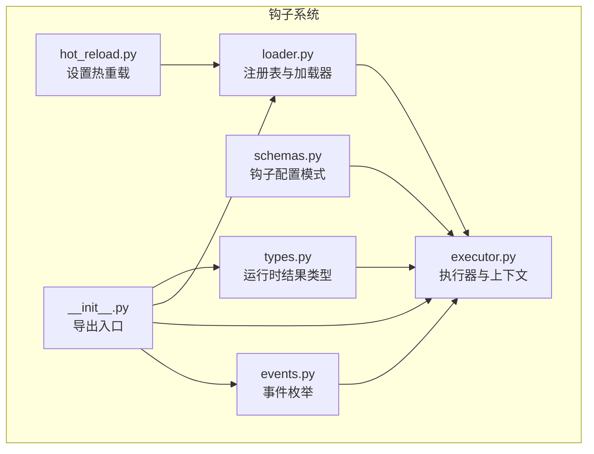
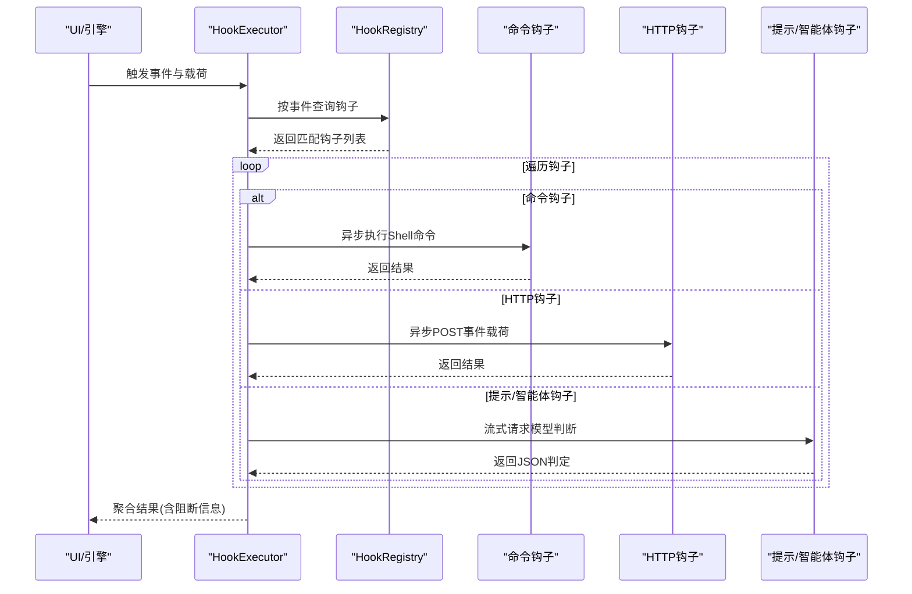
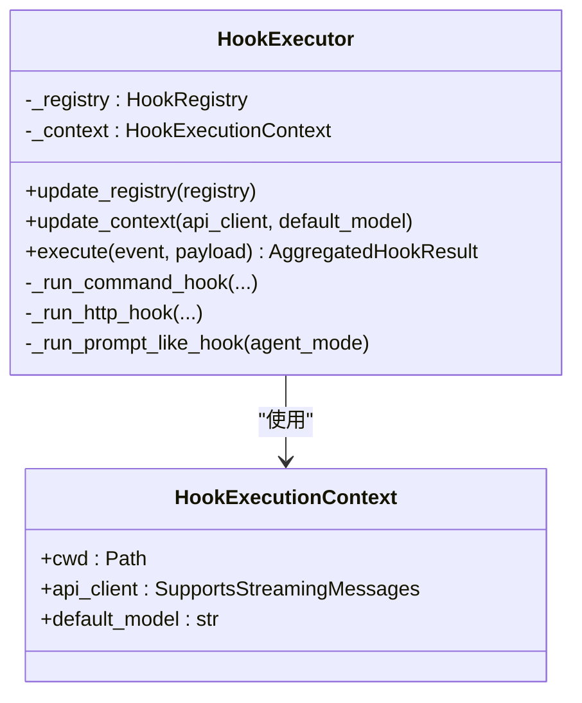
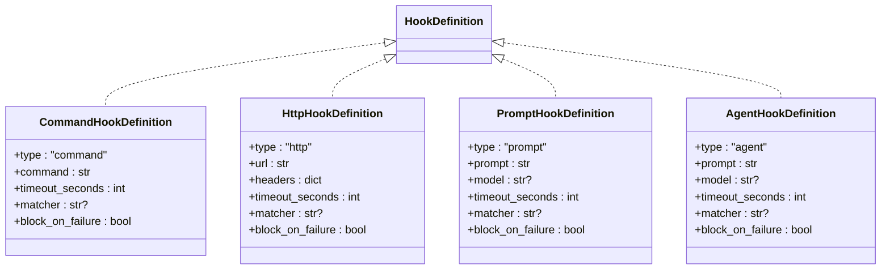
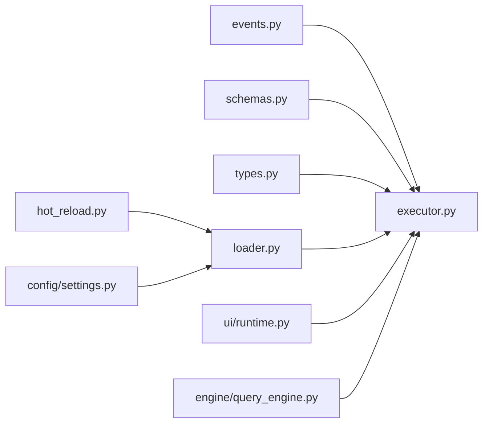

# 钩子系统

<cite>
**本文引用的文件**
- [src/openharness/hooks/__init__.py](file://src/openharness/hooks/__init__.py)
- [src/openharness/hooks/events.py](file://src/openharness/hooks/events.py)
- [src/openharness/hooks/executor.py](file://src/openharness/hooks/executor.py)
- [src/openharness/hooks/types.py](file://src/openharness/hooks/types.py)
- [src/openharness/hooks/schemas.py](file://src/openharness/hooks/schemas.py)
- [src/openharness/hooks/loader.py](file://src/openharness/hooks/loader.py)
- [src/openharness/hooks/hot_reload.py](file://src/openharness/hooks/hot_reload.py)
- [src/openharness/ui/runtime.py](file://src/openharness/ui/runtime.py)
- [src/openharness/engine/query_engine.py](file://src/openharness/engine/query_engine.py)
- [src/openharness/config/settings.py](file://src/openharness/config/settings.py)
- [tests/test_hooks/test_executor.py](file://tests/test_hooks/test_executor.py)
</cite>

## 目录
1. [简介](#简介)
2. [项目结构](#项目结构)
3. [核心组件](#核心组件)
4. [架构总览](#架构总览)
5. [详细组件分析](#详细组件分析)
6. [依赖分析](#依赖分析)
7. [性能考量](#性能考量)
8. [故障排除指南](#故障排除指南)
9. [结论](#结论)
10. [附录](#附录)

## 简介
本文件系统性地解析 OpenHarness 的钩子系统，围绕 HookExecutor 的设计与生命周期钩子的执行机制展开，覆盖钩子的注册、加载与执行流程；详述各类钩子事件类型与触发时机；解释异步执行与错误处理策略；阐述扩展性设计与自定义钩子的开发与部署；并提供可定位到源码路径的示例说明，帮助读者快速上手钩子系统的日志记录、审计跟踪与业务逻辑集成。

## 项目结构
钩子系统位于 src/openharness/hooks 目录下，核心模块包括：
- 事件枚举：定义所有支持的生命周期事件
- 执行器：负责异步执行不同类型的钩子
- 类型与模式：统一结果与配置模型
- 注册表与加载器：从设置与插件加载钩子并按事件分组
- 热重载：基于设置文件变更的钩子定义热更新

图表来源
- [src/openharness/hooks/events.py:8-21](file://src/openharness/hooks/events.py#L8-L21)
- [src/openharness/hooks/schemas.py:10-58](file://src/openharness/hooks/schemas.py#L10-L58)
- [src/openharness/hooks/types.py:9-39](file://src/openharness/hooks/types.py#L9-L39)
- [src/openharness/hooks/loader.py:10-60](file://src/openharness/hooks/loader.py#L10-L60)
- [src/openharness/hooks/hot_reload.py:11-31](file://src/openharness/hooks/hot_reload.py#L11-L31)
- [src/openharness/hooks/executor.py:32-242](file://src/openharness/hooks/executor.py#L32-L242)
- [src/openharness/hooks/__init__.py:13-50](file://src/openharness/hooks/__init__.py#L13-L50)

章节来源
- [src/openharness/hooks/__init__.py:13-50](file://src/openharness/hooks/__init__.py#L13-L50)
- [src/openharness/hooks/events.py:8-21](file://src/openharness/hooks/events.py#L8-L21)
- [src/openharness/hooks/schemas.py:10-58](file://src/openharness/hooks/schemas.py#L10-L58)
- [src/openharness/hooks/types.py:9-39](file://src/openharness/hooks/types.py#L9-L39)
- [src/openharness/hooks/loader.py:10-60](file://src/openharness/hooks/loader.py#L10-L60)
- [src/openharness/hooks/hot_reload.py:11-31](file://src/openharness/hooks/hot_reload.py#L11-L31)
- [src/openharness/hooks/executor.py:32-242](file://src/openharness/hooks/executor.py#L32-L242)

## 核心组件
- 事件枚举：定义会话、工具使用、提示提交、通知、停止等生命周期事件
- 执行器与上下文：封装执行环境（工作目录、流式消息客户端、默认模型），异步调度不同类型的钩子
- 结果类型：单钩子执行结果与聚合结果，包含成功/失败、阻断标志、原因与元数据
- 配置模式：命令、HTTP、提示词、智能体四类钩子的配置字段与约束
- 注册表与加载器：按事件分组存储钩子，支持从设置与插件合并加载
- 热重载：监听设置文件变更，动态重建注册表

章节来源
- [src/openharness/hooks/events.py:8-21](file://src/openharness/hooks/events.py#L8-L21)
- [src/openharness/hooks/executor.py:32-242](file://src/openharness/hooks/executor.py#L32-L242)
- [src/openharness/hooks/types.py:9-39](file://src/openharness/hooks/types.py#L9-L39)
- [src/openharness/hooks/schemas.py:10-58](file://src/openharness/hooks/schemas.py#L10-L58)
- [src/openharness/hooks/loader.py:10-60](file://src/openharness/hooks/loader.py#L10-L60)
- [src/openharness/hooks/hot_reload.py:11-31](file://src/openharness/hooks/hot_reload.py#L11-L31)

## 架构总览
钩子系统通过“事件驱动 + 多类型执行器”的方式实现非侵入式扩展。UI 层或引擎层在关键节点触发事件，执行器根据事件查找匹配的钩子，异步执行并返回聚合结果。聚合结果决定是否阻断后续流程。

图表来源
- [src/openharness/hooks/executor.py:64-78](file://src/openharness/hooks/executor.py#L64-L78)
- [src/openharness/hooks/loader.py:20-22](file://src/openharness/hooks/loader.py#L20-L22)
- [src/openharness/hooks/schemas.py:10-58](file://src/openharness/hooks/schemas.py#L10-L58)

## 详细组件分析

### 事件类型与触发时机
- 会话生命周期：会话开始、会话结束
- 内容压缩：压缩前、压缩后
- 工具使用：使用前、使用后
- 用户交互：用户提交提示
- 通知与停止：通知、停止、子代理停止

这些事件由事件枚举统一管理，确保跨模块一致引用。

章节来源
- [src/openharness/hooks/events.py:8-21](file://src/openharness/hooks/events.py#L8-L21)

### 执行器与上下文
- 上下文包含工作目录、流式消息客户端、默认模型，用于命令钩子与提示/智能体钩子的执行
- 执行器负责：
  - 更新注册表与上下文
  - 异步执行钩子：命令、HTTP、提示词、智能体
  - 统一结果封装与阻断判定

图表来源
- [src/openharness/hooks/executor.py:32-63](file://src/openharness/hooks/executor.py#L32-L63)

章节来源
- [src/openharness/hooks/executor.py:32-242](file://src/openharness/hooks/executor.py#L32-L242)

### 钩子类型与配置模式
- 命令钩子：执行Shell命令，支持超时、阻断失败、匹配器
- HTTP钩子：向指定URL POST事件与载荷，支持超时、阻断失败、匹配器
- 提示钩子：通过模型判断条件是否满足，严格JSON输出
- 智能体钩子：更深入的推理判断，适合复杂策略

图表来源
- [src/openharness/hooks/schemas.py:10-58](file://src/openharness/hooks/schemas.py#L10-L58)

章节来源
- [src/openharness/hooks/schemas.py:10-58](file://src/openharness/hooks/schemas.py#L10-L58)

### 结果类型与聚合
- 单钩子结果包含：类型、成功/失败、输出、阻断标志、原因、元数据
- 聚合结果包含：所有子结果列表，并提供阻断与首个阻断原因的便捷属性

章节来源
- [src/openharness/hooks/types.py:9-39](file://src/openharness/hooks/types.py#L9-L39)

### 注册表与加载器
- 注册表按事件分组存储钩子，支持汇总人类可读摘要
- 加载器从设置与插件合并加载钩子，忽略无效事件名

章节来源
- [src/openharness/hooks/loader.py:10-60](file://src/openharness/hooks/loader.py#L10-L60)

### 热重载
- 基于设置文件修改时间戳检测变更，重新加载钩子注册表
- 适用于本地开发与快速迭代

章节来源
- [src/openharness/hooks/hot_reload.py:11-31](file://src/openharness/hooks/hot_reload.py#L11-L31)

### 在引擎与UI中的使用
- UI运行时构建运行时包时，注入钩子执行器与热重载器，支持在会话与工具调用等关键节点触发事件
- 查询引擎在用户提交提示时触发事件，便于前置审计与策略控制

章节来源
- [src/openharness/ui/runtime.py:80-124](file://src/openharness/ui/runtime.py#L80-L124)
- [src/openharness/engine/query_engine.py:147-165](file://src/openharness/engine/query_engine.py#L147-L165)

## 依赖分析
钩子系统内部模块耦合度低，主要依赖关系如下：
- 执行器依赖事件枚举、注册表、配置模式与结果类型
- 注册表与加载器相互协作，加载器负责从设置与插件构造注册表
- 热重载依赖加载器与设置加载
- UI与引擎通过执行器间接使用钩子系统

图表来源
- [src/openharness/hooks/executor.py:16-27](file://src/openharness/hooks/executor.py#L16-L27)
- [src/openharness/hooks/loader.py:4-7](file://src/openharness/hooks/loader.py#L4-L7)
- [src/openharness/hooks/hot_reload.py:7-8](file://src/openharness/hooks/hot_reload.py#L7-L8)
- [src/openharness/config/settings.py](file://src/openharness/config/settings.py#L21)
- [src/openharness/ui/runtime.py:34-35](file://src/openharness/ui/runtime.py#L34-L35)
- [src/openharness/engine/query_engine.py](file://src/openharness/engine/query_engine.py#L14)

章节来源
- [src/openharness/hooks/executor.py:16-27](file://src/openharness/hooks/executor.py#L16-L27)
- [src/openharness/hooks/loader.py:4-7](file://src/openharness/hooks/loader.py#L4-L7)
- [src/openharness/hooks/hot_reload.py:7-8](file://src/openharness/hooks/hot_reload.py#L7-L8)
- [src/openharness/config/settings.py](file://src/openharness/config/settings.py#L21)
- [src/openharness/ui/runtime.py:34-35](file://src/openharness/ui/runtime.py#L34-L35)
- [src/openharness/engine/query_engine.py](file://src/openharness/engine/query_engine.py#L14)

## 性能考量
- 异步执行：命令与HTTP钩子均采用异步IO，避免阻塞主线程
- 超时控制：每类钩子均内置超时参数，防止长时间阻塞
- Shell注入防护：命令钩子在注入参数时支持shell转义，降低注入风险
- 流式响应：提示/智能体钩子采用流式消息接口，减少等待时间
- 聚合短路：一旦出现阻断，可提前终止后续流程（取决于上层决策）

章节来源
- [src/openharness/hooks/executor.py:80-136](file://src/openharness/hooks/executor.py#L80-L136)
- [src/openharness/hooks/executor.py:138-167](file://src/openharness/hooks/executor.py#L138-L167)
- [src/openharness/hooks/executor.py:169-212](file://src/openharness/hooks/executor.py#L169-L212)
- [src/openharness/hooks/schemas.py:14-17](file://src/openharness/hooks/schemas.py#L14-L17)
- [src/openharness/hooks/schemas.py:36-39](file://src/openharness/hooks/schemas.py#L36-L39)
- [src/openharness/hooks/schemas.py:25-28](file://src/openharness/hooks/schemas.py#L25-L28)
- [src/openharness/hooks/schemas.py:47-50](file://src/openharness/hooks/schemas.py#L47-L50)

## 故障排除指南
- 命令钩子失败
  - 可能原因：沙箱不可用、超时、退出码非零
  - 处理策略：检查工作目录权限、命令可用性、超时阈值；必要时开启阻断以阻止后续流程
- HTTP钩子失败
  - 可能原因：网络异常、目标服务不可达、状态码非成功
  - 处理策略：确认URL与Headers、超时设置、目标可达性
- 提示/智能体钩子失败
  - 可能原因：模型返回非严格JSON、拒绝判定
  - 处理策略：调整提示词、放宽阻断策略、检查模型可用性
- 匹配器不生效
  - 可能原因：匹配器未正确设置或与载荷字段不匹配
  - 处理策略：核对事件载荷字段（如工具名、提示文本、事件名）与匹配器
- 热重载未生效
  - 可能原因：设置文件未变更或权限问题
  - 处理策略：确认文件修改时间戳变化、权限与路径正确

章节来源
- [src/openharness/hooks/executor.py:99-136](file://src/openharness/hooks/executor.py#L99-L136)
- [src/openharness/hooks/executor.py:161-167](file://src/openharness/hooks/executor.py#L161-L167)
- [src/openharness/hooks/executor.py:203-212](file://src/openharness/hooks/executor.py#L203-L212)
- [src/openharness/hooks/executor.py:215-220](file://src/openharness/hooks/executor.py#L215-L220)
- [src/openharness/hooks/hot_reload.py:21-31](file://src/openharness/hooks/hot_reload.py#L21-L31)

## 结论
钩子系统通过清晰的事件模型、多类型的执行器与严格的超时与阻断策略，实现了对生命周期关键节点的灵活扩展。其异步执行与热重载能力提升了开发效率与运行稳定性。结合UI与引擎层的事件触发点，钩子可用于日志记录、审计跟踪与复杂业务策略的集成。

## 附录

### 使用场景与示例（路径定位）
- 命令钩子在会话开始时执行
  - 示例路径：[tests/test_hooks/test_executor.py:34-49](file://tests/test_hooks/test_executor.py#L34-L49)
- 提示钩子在工具使用前进行策略阻断
  - 示例路径：[tests/test_hooks/test_executor.py:52-73](file://tests/test_hooks/test_executor.py#L52-L73)
- Shell注入防护与参数转义
  - 示例路径：[tests/test_hooks/test_executor.py:98-121](file://tests/test_hooks/test_executor.py#L98-L121)
- UI运行时注入钩子执行器与热重载器
  - 示例路径：[src/openharness/ui/runtime.py:80-124](file://src/openharness/ui/runtime.py#L80-L124)
- 引擎在用户提交提示时触发事件
  - 示例路径：[src/openharness/engine/query_engine.py:147-165](file://src/openharness/engine/query_engine.py#L147-L165)

### 钩子配置与加载要点
- 设置文件中的 hooks 字段按事件名映射到钩子列表
- 插件可附加 hooks 字段，启用后与设置合并
- 无效事件名会被忽略，保证系统健壮性

章节来源
- [src/openharness/hooks/loader.py:40-60](file://src/openharness/hooks/loader.py#L40-L60)
- [src/openharness/config/settings.py](file://src/openharness/config/settings.py#L21)